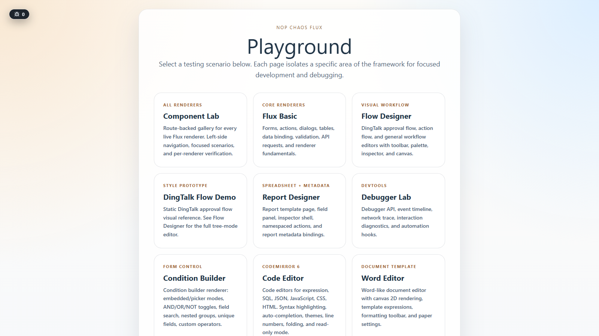
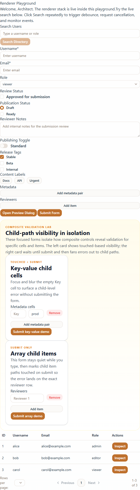
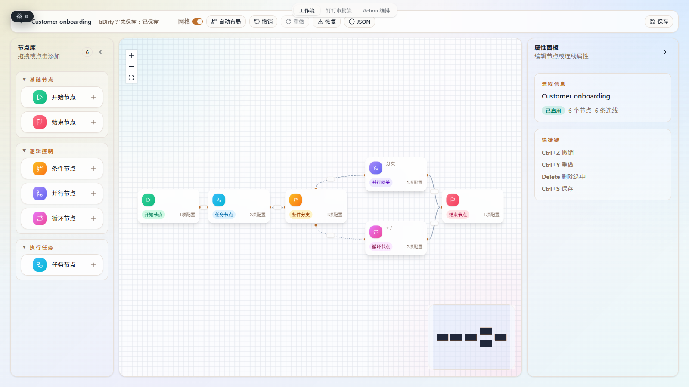
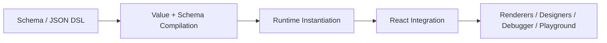

# NOP Chaos Flux

<div align="center">

**Write JSON, get UI. A schema-driven runtime for low-code systems, built around seven primitives.**

[Docs Index](docs/index.md) |
[Architecture Intro](docs/articles/flux-design-introduction.md) |
[Flux Core](docs/architecture/flux-core.md) |
[Example Schema](docs/examples/user-management-schema.md)

[](https://www.typescriptlang.org/)
[](https://react.dev/)
[](https://vitejs.dev/)
[](https://vitest.dev/)
[](https://tailwindcss.com/)
[](https://pnpm.io/)
[](LICENSE)

</div>

---

## What This Repo Is

NOP Chaos Flux is a schema-driven runtime and rendering framework for low-code systems, organized around a compact conceptual model: unified value semantics, compile-once execution, lexical scope, explicit capability boundaries, and framework-independent runtime state.

Flux is organized around a consistent conceptual model, a focused DSL, and architecture rules carried through package boundaries, runtime contracts, and host integration.

This repository is most useful to three audiences:

- Engineers evaluating schema-driven UI runtimes and low-code foundations
- Contributors working on renderers, runtime, designers, and tooling inside this monorepo
- Platform teams building schema-driven internal products, editors, or low-code infrastructure

If you need exact contracts or implementation details, continue into `docs/`.

## At A Glance

- JSON schema drives pages, forms, tables, dialogs, and richer design surfaces
- Expressions and templates are compiled before runtime rendering
- Runtime responsibilities stay explicit: `ScopeRef` for data, `ActionScope` for namespaced behavior, `ComponentHandleRegistry` for instance targeting
- React is the rendering layer, not the core state model; runtime state is built on vanilla Zustand stores
- The monorepo also contains Flow Designer, Spreadsheet/Report Designer, Word Editor, and debugger tooling
- Workspace packages are currently `private`; the main runnable surface is `apps/playground`
- Architecture rules stay visible through package boundaries, renderer contracts, action scope, and host integration

## A 30-Second Example

```jsonc
{
  "type": "form",
  "id": "profile-form",
  "title": "Profile",
  "data": {
    "fullName": "Alice",
    "email": "alice@example.com"
  },
  "body": [
    {
      "type": "input-text",
      "name": "fullName",
      "label": "Full Name",
      "required": true
    },
    {
      "type": "input-email",
      "name": "email",
      "label": "Email",
      "required": true
    },
    {
      "type": "button",
      "label": "Submit",
      "onClick": {
        "action": "submitForm",
        "api": {
          "method": "post",
          "url": "/api/profile"
        }
      }
    }
  ]
}
```

Flux compiles that schema into executable values, instantiates a form runtime, resolves renderer props and metadata, validates the form, and dispatches the submit action through the capability layer.

- `Authoring`: schema authors describe fields, events, and API intent in JSON
- `Compilation`: Flux classifies values, expressions, templates, and renderer metadata before hot-path rendering
- `Runtime guarantees`: data scope, action scope, validation, and side effects keep distinct runtime boundaries

The same execution model scales from simple forms to tables, dialogs, and designer workbenches.

## See It Running

All screenshots below are captured from the real `apps/playground` surface.

### Playground Home



The playground is the fastest way to inspect the current runtime surface. Each card opens an isolated scenario page for a single capability area.

### Flux Basic Surface

The `Flux Basic` scenario shows the core renderer stack in one place: form fields, validation timing, dialog actions, async requests, table refresh, and schema-driven data flow.



### Flow Designer Workspace

One of the main integrated surfaces is the Flow Designer workspace, which combines schema-driven tooling, canvas interactions, and host-scoped designer actions in a single page.



## Design Goals

Flux keeps its conceptual core small, coherent, and enforceable in implementation.

| Goal | What Flux enforces |
|---|---|
| Unified value semantics | A field keeps one name while its value can still be literal, expression, template, array, or object |
| Compile-once execution | Values and metadata are classified before runtime hot paths so static work stays cheap |
| Lexical scope | `ScopeRef` resolves data through predictable lexical lookup |
| Explicit authority boundaries | Data access, actions, and component targeting stay separated through `ScopeRef`, `ActionScope`, and `ComponentHandleRegistry` |
| Host-safe integration | Renderers expose stable markers and host boundaries stay visible through contracts |
| Design-to-code discipline | Package layering, renderer interfaces, and runtime boundaries are treated as implementation constraints |

For the deeper rationale, start with `docs/articles/flux-design-introduction.md`.

## Seven Primitives

Flux keeps its core vocabulary deliberately small. These seven primitives are the conceptual base that forms, tables, dialogs, designers, and tooling all build on:

| Primitive | Responsibility |
|---|---|
| `Base Tree` | Schema structure and node lifecycle |
| `ScopeRef` | Lexical data environment |
| `Value` | Literal, expression, template, array, and object execution model |
| `Resource` | Runtime-owned value producer such as data loading |
| `Reaction` | Declarative watch/effect primitive |
| `Capability` | The only authority channel for side effects |
| `Host Projection` | Read-only host state projected into schema-visible scope |

Forms, tables, dialogs, designer runtimes, and validation are derived systems on top of these primitives. That keeps the runtime small enough for advanced features to share one coherent execution model.

## Project Status

- Good for: architecture evaluation, contributor work, playground-driven experimentation, and internal platform prototyping
- Current shape: active monorepo, private workspace packages, and a playground-first integration surface
- Main entry point: `apps/playground`, with package-level work happening inside the monorepo

To evaluate Flux, run the workspace locally, explore the playground scenarios, and follow the linked architecture docs for the subsystems you care about.

## Architecture Snapshot

Flux keeps the execution model compact, then layers specialized packages on top of that shared backbone.

### Execution Pipeline



- `Value + Schema Compilation`: expression/template compilation, metadata classification, and schema normalization
- `Runtime Instantiation`: `ScopeRef`, `ActionScope`, validation, resources, and reactions
- `React Integration`: hooks, render handles, regions, and component integration
- `Renderers / Designers / Debugger / Playground`: concrete surfaces built on the same runtime contracts

### Workspace Backbone

| Layer | Packages | Role |
|---|---|---|
| Core contracts | `@nop-chaos/flux-core` | Primitive contracts, shared types, and pure utilities |
| Formula layer | `@nop-chaos/flux-formula` | Expression and template compilation |
| Runtime layer | `@nop-chaos/flux-runtime` | Scope, actions, validation, page and form runtime |
| React bridge | `@nop-chaos/flux-react` | Hooks, render handles, and renderer integration |

### Feature Families

| Family | Packages | Role |
|---|---|---|
| General renderers | `flux-renderers-basic`, `flux-renderers-form`, `flux-renderers-data` | Pages, layouts, forms, and data-oriented renderers |
| Designers and editors | `flow-designer-*`, `report-designer-*`, `spreadsheet-*`, `word-editor-*`, `flux-code-editor` | Domain-specific tooling and editing surfaces |
| Shared UI and styling | `ui`, `tailwind-preset` | Visual baseline, primitives, and styling conventions |
| Diagnostics and app surface | `nop-debugger`, `apps/playground` | Debugger tooling and integrated playground scenarios |

The reusable execution backbone is `flux-core -> flux-formula -> flux-runtime -> flux-react`. Many larger feature areas then split into `*-core` packages for framework-independent logic and `*-renderers` packages for Flux/React integration.

For the current baseline of any subsystem, prefer `docs/index.md` and the relevant architecture doc.

## Quick Start

Prerequisites: `Node.js LTS`, `pnpm 10+`

```bash
pnpm install
pnpm dev
```

Local playground: `http://localhost:5173`

Start here after `pnpm dev`:

- `Flux Basic` for forms, validation, data binding, and schema-driven interactions
- `Flow Designer` for a larger host-integrated editor surface
- `Debugger Lab` for diagnostics, event tracing, and automation APIs

Verification commands:

```bash
pnpm typecheck
pnpm build
pnpm test
pnpm lint
pnpm test:e2e
```

Per-package examples:

```bash
pnpm --filter @nop-chaos/flux-runtime test
pnpm --filter @nop-chaos/flux-react typecheck
pnpm --filter @nop-chaos/flow-designer-core build
```

## Where To Read Next

Start at [`docs/index.md`](docs/index.md). It routes tasks to the smallest relevant document.

If you are evaluating the architecture:

- [`docs/articles/flux-design-introduction.md`](docs/articles/flux-design-introduction.md)
- [`docs/architecture/flux-core.md`](docs/architecture/flux-core.md)
- [`docs/architecture/renderer-runtime.md`](docs/architecture/renderer-runtime.md)

If you are implementing or contributing:

- [`docs/architecture/form-validation.md`](docs/architecture/form-validation.md)
- [`docs/architecture/flow-designer/design.md`](docs/architecture/flow-designer/design.md)
- [`docs/architecture/debugger-runtime.md`](docs/architecture/debugger-runtime.md)
- [`docs/architecture/action-scope-and-imports.md`](docs/architecture/action-scope-and-imports.md)
- [`docs/architecture/styling-system.md`](docs/architecture/styling-system.md)
- [`docs/examples/user-management-schema.md`](docs/examples/user-management-schema.md)
- [`AGENTS.md`](AGENTS.md)

## Contributing

- Use the root `pnpm` scripts to work across the workspace
- Keep `pnpm typecheck`, `pnpm build`, `pnpm test`, and `pnpm lint` green for relevant changes
- Read `docs/index.md` before changing architecture or runtime contracts
- Follow `AGENTS.md` for repository conventions, package boundaries, and documentation routing

## License

MIT — see [LICENSE](LICENSE).

Flux is informed by [Baidu AMIS](https://github.com/baidu/amis). Parts of this repository were rewritten by using AI to analyze existing AMIS behavior and implementations, then re-expressing those ideas under Flux's own architecture, contracts, and coding rules.
