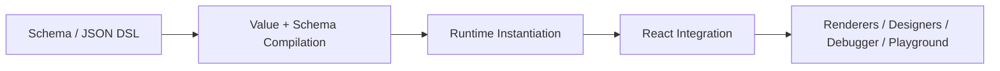

# NOP Chaos Flux

<div align="center">

**让 Schema 真正参与执行，而不只是负责渲染。**

*一个面向低代码系统的 Schema 驱动运行时，建立在七个原语之上。*

[English](README.md) | [简体中文](README.zh-CN.md)

[文档索引](docs/index.md) |
[架构导论](docs/articles/flux-design-introduction.md) |
[Flux Core](docs/architecture/flux-core.md) |
[示例 Schema](docs/examples/user-management-schema.md)

[](https://www.typescriptlang.org/)
[](https://react.dev/)
[](https://vitejs.dev/)
[](https://vitest.dev/)
[](https://tailwindcss.com/)
[](https://pnpm.io/)
[](LICENSE)
[](https://github.com/baidu/amis)

</div>

---

## 仓库说明

NOP Chaos Flux 是一个面向低代码系统的 Schema 驱动运行时与渲染框架。它围绕一套紧凑但完整的概念模型展开：统一值语义、一次编译的执行模型、词法作用域、显式 capability 边界，以及与框架解耦的运行时状态。

Flux 不是简单地把 JSON 映射成组件，而是用一致的概念模型、聚焦的 DSL，以及贯穿包边界、运行时契约和宿主集成的架构规则来组织整个系统。

这个仓库主要适合三类读者：

- 正在评估 Schema 驱动 UI 运行时和低代码底座的工程师
- 在这个 monorepo 中参与渲染器、运行时、设计器和工具链开发的贡献者
- 构建 Schema 驱动内部产品、编辑器或低代码基础设施的平台团队

如果你需要更精确的契约或实现细节，请继续阅读 `docs/`。

## 与 NOP Chaos Next 的关系

| 维度 | NOP Chaos Flux | NOP Chaos Next |
|-----------|----------------|----------------|
| **定位** | 低代码运行时与渲染框架 | 前端应用框架与脚手架 |
| **核心能力** | 建立在七个原语之上的运行时 | 扩展系统 + 插件系统 |
| **渲染层** | 自定义渲染器架构 | 基于 AMIS（已迁移到 React 19） |
| **适用场景** | 平台团队构建低代码基础设施 | 业务团队构建企业应用 |
| **设计器** | 内建 Flow / Report / Spreadsheet 设计器 | 集成第三方设计器 |
| **状态管理** | 与框架无关的 Zustand stores | 混合使用 Zustand + React Query |
| **依赖关系** | 独立运行时，不依赖 AMIS | 以 AMIS 作为核心渲染层 |
| **插件加载** | 未提供 | 基于 SystemJS 的远程插件加载 |

简而言之：
- **Flux** = “How to generate UI from JSON”（底层运行时）
- **Next** = “How to build extensible business applications”（应用框架）

两个项目可以协同工作：Next 可以集成 Flux 的设计器和运行时能力。

## AMIS 背景

- Flux 作为独立的运行时与渲染器栈开发，在运行时层面不依赖 AMIS
- 在有助于迁移和互操作的前提下，项目会参考 AMIS 的 Schema 约定和可观察行为
- 面向现有 AMIS Schema 的兼容工作已经在规划中，但它不是这个仓库当前对外公开的主契约

## 一览

- JSON Schema 可以驱动页面、表单、表格、对话框，以及更复杂的设计器界面
- 表达式和模板会在运行时渲染之前完成编译
- 运行时职责保持显式：`ScopeRef` 负责数据，`ActionScope` 负责具名行为，`ComponentHandleRegistry` 负责实例定位
- React 是渲染层，不是核心状态模型；运行时状态建立在原生 Zustand stores 之上
- 这个 monorepo 还包含 Flow Designer、Spreadsheet / Report Designer、Word Editor 和 debugger 工具
- workspace packages 当前仍为 `private`；主要可运行入口是 `apps/playground`
- 架构规则会持续体现在包边界、渲染器契约、action scope 和宿主集成上
- **AMIS 背景**：Flux 受 AMIS 启发，并可能在有助于迁移和互操作时增加有针对性的兼容层

## 30 秒示例

```jsonc
{
  "type": "form",
  "id": "profile-form",
  "title": "Profile",
  "data": {
    "fullName": "Alice",
    "email": "alice@example.com"
  },
  "body": [
    {
      "type": "input-text",
      "name": "fullName",
      "label": "Full Name",
      "required": true
    },
    {
      "type": "input-email",
      "name": "email",
      "label": "Email",
      "required": true
    }
  ],
  "submitAction": {
    "action": "ajax",
    "args": {
      "method": "post",
      "url": "/api/profile"
    }
  },
  "actions": [
    {
      "type": "button",
      "label": "Submit",
      "onClick": {
        "action": "submitForm"
      }
    },
  ]
}
```

Flux 会把这份 Schema 编译成可执行值，实例化表单运行时，解析渲染器属性和元数据，执行表单校验，并把触发动作接入表单自身的语义化提交流程。

- `Authoring`：用 JSON 描述字段、事件和 API 意图
- `Compilation`：Flux 在热路径渲染之前先分类值、表达式、模板和渲染器元数据
- `Runtime guarantees`：数据作用域、action scope、校验和副作用都保持清晰的运行时边界

对于带有语义 owner 的界面，Flux 也保留了一小组 owner-aware 内置动作。例如，`submitForm` 会作用于当前表单运行时，`closeDialog` 默认关闭最近的活动对话框。当触发器需要从当前 owner 上下文之外显式定位某个实例时，仍然可以使用 `component:submit` 这类显式实例目标动作。

同一套执行模型可以从简单表单扩展到表格、对话框和设计器工作台。

## 实际运行界面

下面所有截图都来自真实的 `apps/playground`。

### Playground 首页


playground 是查看当前运行时范围最直接的方式。每张卡片都会打开一个独立的场景页面，对应一个明确的 capability 域。

### Flux Basic 界面

`Flux Basic` 场景把核心渲染器栈集中放在一个页面里：表单字段、校验时机、对话框动作、异步请求、表格刷新，以及 Schema 驱动的数据流。


### Flow Designer 工作区

Flow Designer 工作区是主要集成界面之一，它把 Schema 驱动工具、画布交互和宿主作用域内的设计器动作组合在同一页面中。


## 设计目标

Flux 尽量把概念核心保持得小而一致，并确保这些原则在实现里真正落地。

| 目标 | Flux 如何落实 |
|---|---|
| 统一值语义 | 一个字段保持同一个名字，但它的值仍然可以是字面量、表达式、模板、数组或对象 |
| 一次编译的执行模型 | 值和元数据会在运行时热路径之前完成分类，让静态工作保持低成本 |
| 词法作用域 | `ScopeRef` 通过可预测的词法查找来解析数据 |
| 显式权限边界 | 数据访问、动作和组件定位通过 `ScopeRef`、`ActionScope` 和 `ComponentHandleRegistry` 保持分离 |
| 宿主安全集成 | 渲染器暴露稳定的标记，宿主边界通过契约保持可见 |
| 从设计到代码的一致性 | 包分层、渲染器接口和运行时边界都被当作实现约束 |

如果你想看更完整的设计动机，建议从 `docs/articles/flux-design-introduction.md` 开始。

## 七个原语

Flux 有意把核心词汇表保持得很小。这七个原语构成了表单、表格、对话框、设计器和工具能力的共同概念基础：

| 原语 | 职责 |
|---|---|
| `Template` | 编译后的程序结构、region 组合和生命周期锚点 |
| `ScopeRef` | 词法数据环境 |
| `Value` | 字面量、表达式、模板、数组和对象的执行模型 |
| `Resource` | 运行时拥有的值生产者，例如数据加载 |
| `Reaction` | 声明式 watch / effect 原语 |
| `Capability` | 唯一的副作用权限通道 |
| `Host Projection` | 投影到 Schema 可见作用域中的只读宿主状态 |

表单、表格、对话框、设计器运行时和校验系统都建立在这些原语之上。这让运行时足够小，也让高级能力共享一套一致的执行模型。

## 项目状态

- 适合：架构评估、贡献者开发、以 playground 为核心的实验，以及内部平台原型验证
- 当前形态：活跃中的 monorepo、私有 workspace packages，以及以 playground 为主的集成界面
- 主要入口：`apps/playground`，包级开发都在 monorepo 内进行

如果你想评估 Flux，建议先在本地跑起整个 workspace，浏览 playground 场景，再沿着你关心的子系统继续阅读对应的架构文档。

## 架构快照

Flux 先把执行模型收紧，再在这条共享主干之上叠加各类专门化包。

### 执行管线



- `Value + Schema Compilation`：表达式 / 模板编译、元数据分类和 Schema 规范化
- `Runtime Instantiation`：`ScopeRef`、`ActionScope`、校验、resources 和 reactions
- `React Integration`：hooks、render handles、regions 和组件集成
- `Renderers / Designers / Debugger / Playground`：建立在同一运行时契约上的具体界面

### Workspace 主干

| 层 | Packages | 角色 |
|---|---|---|
| Core contracts | `@nop-chaos/flux-core` | 原语契约、共享类型和纯工具函数 |
| Formula layer | `@nop-chaos/flux-formula` | 表达式和模板编译 |
| Compiler layer | `@nop-chaos/flux-compiler` | Schema 编译、规范化和诊断 |
| Action core | `@nop-chaos/flux-action-core` | 动作 lowering、selector 分类和控制流执行 |
| Runtime layer | `@nop-chaos/flux-runtime` | scope、actions、validation、page 和 form 运行时 |
| React bridge | `@nop-chaos/flux-react` | hooks、render handles 和渲染器集成 |

### 功能族

| 功能族 | Packages | 角色 |
|---|---|---|
| 通用渲染器 | `flux-renderers-basic`, `flux-renderers-form`, `flux-renderers-data` | 页面、布局、表单和面向数据的渲染器 |
| 设计器与编辑器 | `flow-designer-*`, `report-designer-*`, `spreadsheet-*`, `word-editor-*`, `flux-code-editor` | 领域专用工具与编辑界面 |
| 共享 UI 与样式 | `ui`, `tailwind-preset` | 视觉基线、基础组件和样式约定 |
| 诊断与应用界面 | `nop-debugger`, `apps/playground` | debugger 工具和集成 playground 场景 |

可复用的执行主干是 `flux-core -> flux-formula -> flux-compiler -> flux-action-core -> flux-runtime -> flux-react`。更大的功能区通常会继续拆成 `*-core` packages 承载与框架无关的逻辑，以及 `*-renderers` packages 承载 Flux / React 集成。

如果你要查看某个子系统的当前基线，请优先阅读 `docs/index.md` 和对应的架构文档。

## 快速开始

前置要求：`Node.js LTS`、`pnpm 10+`

```bash
pnpm install
pnpm dev
```

本地 playground：`http://localhost:5173`

运行 `pnpm dev` 后建议先看：

- `Flux Basic`：表单、校验、数据绑定和 Schema 驱动交互
- `Flow Designer`：更大的宿主集成式编辑器界面
- `Debugger Lab`：诊断、事件跟踪和自动化 API

验证命令：

```bash
pnpm typecheck
pnpm build
pnpm test
pnpm lint
pnpm test:e2e
```

单包示例：

```bash
pnpm --filter @nop-chaos/flux-runtime test
pnpm --filter @nop-chaos/flux-react typecheck
pnpm --filter @nop-chaos/flow-designer-core build
```

## 下一步阅读

从 [`docs/index.md`](docs/index.md) 开始。它会把任务路由到最小且最相关的文档。

如果你在评估架构：

- [`docs/articles/flux-design-introduction.md`](docs/articles/flux-design-introduction.md)
- [`docs/architecture/flux-core.md`](docs/architecture/flux-core.md)
- [`docs/architecture/renderer-runtime.md`](docs/architecture/renderer-runtime.md)

如果你要实现功能或参与贡献：

- [`docs/architecture/form-validation.md`](docs/architecture/form-validation.md)
- [`docs/architecture/flow-designer/design.md`](docs/architecture/flow-designer/design.md)
- [`docs/architecture/debugger-runtime.md`](docs/architecture/debugger-runtime.md)
- [`docs/architecture/action-scope-and-imports.md`](docs/architecture/action-scope-and-imports.md)
- [`docs/architecture/styling-system.md`](docs/architecture/styling-system.md)
- [`docs/examples/user-management-schema.md`](docs/examples/user-management-schema.md)
- [`AGENTS.md`](AGENTS.md)

## 贡献

- 使用根目录的 `pnpm` scripts 在整个 workspace 上工作
- 对相关改动保持 `pnpm typecheck`、`pnpm build`、`pnpm test` 和 `pnpm lint` 全绿
- 在修改架构或运行时契约前先读 `docs/index.md`
- 遵循 `AGENTS.md` 中的仓库约定、包边界和文档路由规则

## License

MIT，见 [LICENSE](LICENSE)。

Flux 受到 [Baidu AMIS](https://github.com/baidu/amis) 的启发。这个仓库中的部分内容借助 AI 辅助来研究现有 AMIS 的行为和实现，再用 Flux 自己的架构、契约和编码规则重新表达。
