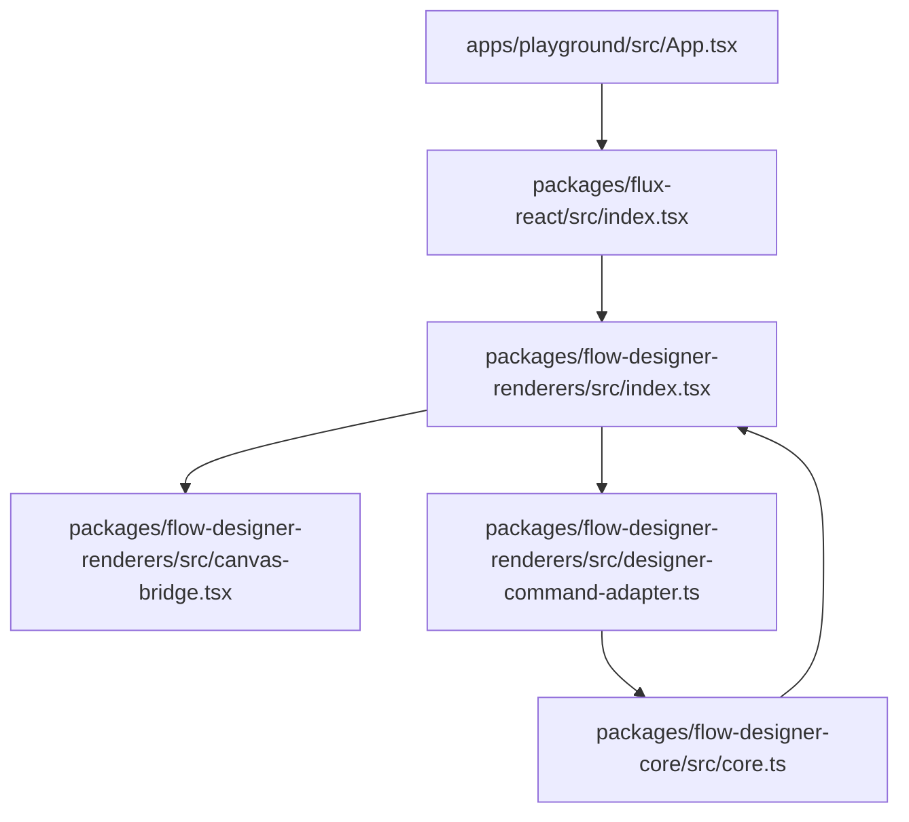
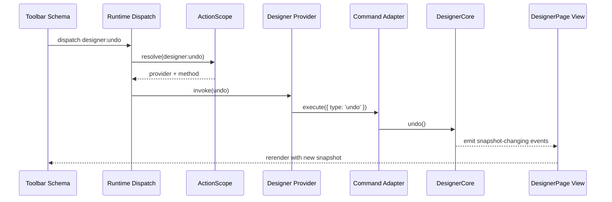
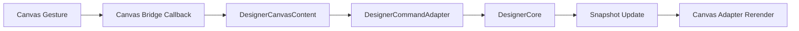

# Flow Designer 协作细节

## Purpose

本文聚焦当前 `flow-designer2` 里各层如何协作，而不是重复定义配置模型或画布 API。

适用场景:

- 想快速看懂 `designer-page` 从挂载到可交互的完整链路
- 想定位 toolbar / inspector / canvas 为什么都能复用同一套 runtime
- 想确认 graph mutation、SchemaRenderer runtime、canvas adapter 之间的职责边界

## Current Code Anchors

先从这些文件对照阅读:

- `packages/flux-react/src/index.tsx`
- `packages/flux-runtime/src/index.ts`
- `packages/flux-runtime/src/action-runtime.ts`
- `packages/flow-designer-renderers/src/index.tsx`
- `packages/flow-designer-renderers/src/designer-command-adapter.ts`
- `packages/flow-designer-renderers/src/canvas-bridge.tsx`
- `packages/flow-designer-core/src/core.ts`
- `apps/playground/src/App.tsx`

## 一句话模型

Flow Designer 不是独立页面引擎，而是把图编辑能力拆成两层后挂到现有 `SchemaRenderer` 体系上:

1. `@nop-chaos/flow-designer-core` 持有 graph document 和 graph command
2. `@nop-chaos/flow-designer-renderers` 把 graph 能力接到 SchemaRenderer 的 region、scope、action、dialog、form、canvas adapter 上

可以把当前实现理解成:

```text
schema-driven host shell
  -> designer-page renderer
  -> DesignerCore + command adapter
  -> snapshot exposed to schema fragments
  -> graph mutations routed back through designer:* or command dispatch
```

## 协作分层

### 1. 通用 schema/runtime 层

这层来自 `amis-schema`、`amis-runtime`、`amis-react`。

它负责:

- schema 编译
- scope 链和局部 scope 创建
- page/form runtime
- built-in action + namespaced action 分发
- React context 和 region 渲染

Flow Designer 复用这层，而不是重新做一套页面状态机。

### 2. Flow Designer domain core

这层来自 `@nop-chaos/flow-designer-core`。

它负责:

- `GraphDocument` / `GraphNode` / `GraphEdge`
- selection
- undo / redo
- save / restore / export
- viewport / grid
- node / edge CRUD 和 reconnect

这里才是 graph state 的唯一 source of truth。

### 3. Flow Designer renderer bridge

这层来自 `@nop-chaos/flow-designer-renderers`。

它负责:

- 定义 `designer-page` 这类 renderer
- 创建 `DesignerCore`
- 把 snapshot 暴露给 toolbar / inspector / canvas
- 注册 `designer` namespace provider
- 把 UI 手势翻译成 command

### 4. Canvas adapter 层

这层由 `card` / `xyflow-preview` / `xyflow` 三种 adapter 组成。

它只负责:

- 展示当前 snapshot
- 把 click / drag / connect / reconnect 等 UI 手势翻译成显式 callback

它不直接修改 graph document。

## 职责边界

| 层 | 持有状态 | 可写 graph | 关心 schema | 典型入口 |
| --- | --- | --- | --- | --- |
| `flux-runtime` / `flux-react` | page, form, scope, dialog, action scope | 否 | 是 | `createRendererRuntime()`, `RenderNodes` |
| `flow-designer-core` | document, selection, history, viewport, grid | 是 | 否 | `createDesignerCore()` |
| `flow-designer-renderers` | bridge host local intent | 间接 | 是 | `DesignerPageRenderer` |
| canvas adapters | UI library local transient state | 否 | 否 | `renderDesignerCanvasBridge()` |

当前有一个很重要的规则:

- graph mutation 只能落到 `DesignerCore`
- schema fragment 只能读 snapshot 和发命令
- canvas adapter 只能翻译 UI 手势

## 挂载协作链路

`designer-page` 真正依赖的是通用 `NodeRenderer` 先给它搭好 runtime 边界，再在它自己的组件里创建 graph runtime。

### 调用链图: `designer-page` 首次挂载

```text
host schema
  -> SchemaRenderer
  -> RenderNodes
  -> NodeRenderer(designer-page compiled node)
  -> NodeRenderer sees actionScopePolicy: 'new'
  -> runtime.createActionScope(...)
  -> DesignerPageRenderer
  -> createDesignerCore(document, config)
  -> useDesignerSnapshot(core.subscribe)
  -> actionScope.registerNamespace('designer', provider)
  -> render toolbar region / palette / canvas / inspector region
```

```mermaid
flowchart TD
  A[SchemaRenderer] --> B[RenderNodes]
  B --> C[NodeRenderer for designer-page]
  C --> D[new ActionScope boundary]
  D --> E[DesignerPageRenderer]
  E --> F[createDesignerCore(document, config)]
  E --> G[createDesignerActionProvider(core)]
  G --> H[register namespace designer]
  E --> I[subscribe to core snapshot]
  E --> J[render toolbar / canvas / inspector]
```

这里有两个关键点:

- `designer-page` 的 renderer definition 把 `actionScopePolicy` 设成了 `'new'`，所以它会拿到自己的 action namespace 边界
- toolbar 和 inspector 是 `designer-page` 的 regions，因此它们天然运行在这个新的 `designer` action scope 里面
- 当前 `DesignerPageRenderer` 在 region render 调用里也显式透传了 `actionScope` 和 designer host `scope`，这样即使后续 region 调用位置调整，toolbar / inspector 片段仍然会明确绑定到同一个 designer namespace 边界与 snapshot 视图
- `dialogs` 现在也会通过同样的 region render 调用被挂到 `designer-page` shell 上，并显式收到同一份 designer host `scope` 与 `actionScope`
- 但通过共享 `dialog` action runtime 打开的弹窗仍然是另一条路径；它们不是这个常驻 `dialogs` region 的替身，而是共享 dialog host 上的弹窗实例
- 这些行为现在都由 renderer 回归测试锁定：`toolbar` / `inspector` / `dialogs` 三个常驻 region 都可以读取注入后的 designer host scope；其中 `toolbar`、`dialogs` 与 `inspector` 也都已覆盖直接 dispatch `designer:*` 的写路径，而 dialog action 打开的内容同样会继承同一个 designer action scope

## 文件级协作图

如果要从源码文件角度追调用链，可以按下面这条主路径看。

### 文件级调用链图: 从宿主挂载到 graph mutation

```text
apps/playground/src/App.tsx
  -> registerFlowDesignerRenderers(registry)
  -> SchemaRenderer(schema)

packages/flux-react/src/index.tsx
  -> createRendererRuntime(...)
  -> RenderNodes
  -> NodeRenderer(designer-page)

packages/flow-designer-renderers/src/index.tsx
  -> DesignerPageRenderer
  -> createDesignerCore(document, config)
  -> createDesignerActionProvider(core)
  -> DesignerCanvasContent

packages/flow-designer-renderers/src/canvas-bridge.tsx
  -> card / xyflow-preview / xyflow callbacks

packages/flow-designer-renderers/src/designer-command-adapter.ts
  -> normalize command result / validation failure / unchanged semantics

packages/flow-designer-core/src/core.ts
  -> mutate document / selection / history / viewport
  -> emit events

packages/flow-designer-renderers/src/index.tsx
  -> useDesignerSnapshot(core.subscribe)
  -> rerender toolbar / canvas / inspector from latest snapshot
```



阅读顺序建议:

1. 先看 `apps/playground/src/App.tsx` 怎么注册 renderers
2. 再看 `packages/flux-react/src/index.tsx` 怎么给 `designer-page` 建立 runtime / action scope 边界
3. 再看 `packages/flow-designer-renderers/src/index.tsx` 怎么创建 core、注册 `designer` namespace、渲染 canvas host
4. 最后看 `packages/flow-designer-renderers/src/designer-command-adapter.ts` 和 `packages/flow-designer-core/src/core.ts` 的命令落地

## 为什么 toolbar / inspector 可以直接用 `designer:*`

根本原因不是它们“知道 core 在哪”，而是它们运行在 `designer-page` 创建的新 action scope 里。

协作过程如下:

1. `NodeRenderer` 为 `designer-page` 建立新的 `ActionScope`
2. `DesignerPageRenderer` 在这个 scope 上注册 `designer` namespace provider
3. `toolbar` 和 `inspector` region 通过 `RenderNodes` 在同一个 scope 下渲染；当前 renderer 还显式把 `actionScope` 传给 region render，避免这条依赖链只靠 React context 的隐式继承
4. 这些 schema 里的 `onClick: { action: 'designer:undo' }` 最终都能被 namespaced action dispatcher 解析到

这也是为什么 Flow Designer 不需要把一堆 domain action 硬编码进 built-in action switch。

当前 region 能力矩阵可直接参考 `docs/architecture/flow-designer/runtime-snapshot.md` 的 “Region capability matrix”，那里把 `toolbar` / `inspector` / `dialogs` / shared dialog popup 的 mount、读 scope、写 action、回归覆盖状态汇总在一起了。

## Action 协作链路

### 调用链图: schema toolbar 按钮触发 `designer:undo`

```text
toolbar button schema
  -> compiled event action
  -> renderer event handler
  -> helpers.dispatch(action)
  -> runtime.dispatch(action, ctx)
  -> action dispatcher sees namespaced action
  -> actionScope.resolve('designer:undo')
  -> designer provider.invoke('undo')
  -> commandAdapter.execute({ type: 'undo' })
  -> core.undo()
  -> core emits historyChanged/documentChanged
  -> useDesignerSnapshot receives update
  -> designer-page rerenders
```



协作重点:

- schema 层发的是 action，不是直接调 `core.undo()`
- provider 层负责把 `designer:*` 规范化为 command
- command adapter 负责返回统一结果结构，如 `ok`、`error`、`reason`、`snapshot`

## Canvas 协作链路

Canvas 是当前协作里最容易误解的一层。

当前实现不是:

```text
xyflow state == graph state
```

而是:

```text
graph state lives in core
xyflow only reflects snapshot and emits gestures
```

### 调用链图: 画布连线

```text
canvas adapter gesture
  -> bridge callback
  -> DesignerCanvasContent host
  -> dispatch addEdge / reconnectEdge command
  -> command adapter validates and executes
  -> core mutates document and emits events
  -> snapshot subscription updates
  -> adapter rerenders from latest snapshot
```



### 调用链图: live `xyflow` 的 `onConnect`

```text
ReactFlow onConnect(connection)
  -> DesignerXyflowCanvasBridge
  -> onStartConnection(sourceId)
  -> onCompleteConnection(targetId)
  -> DesignerCanvasContent dispatch({ type: 'addEdge' })
  -> DesignerCommandAdapter.execute(...)
  -> DesignerCore.addEdge(...)
  -> emit documentChanged
  -> useDesignerSnapshot setState
  -> createXyflowEdges(snapshot) rerender
```

这里最重要的协作约束是:

- host 可以保留临时 UI intent，例如 `pendingConnectionSourceId`、`reconnectingEdgeId`
- 但 host 不拥有第二份 document
- adapter 自己也不允许绕过 command adapter 去写 graph state

### 失败后的协作语义

当 `addEdge` 或 `reconnectEdge` 因为 `duplicate-edge`、`self-loop`、`missing-node` 等失败时:

- command adapter 返回带 `reason` 的失败结果
- `DesignerCanvasContent` 不立即清空 pending intent
- `env.notify('warning', ...)` 负责向宿主报告语义失败
- 用户可以直接换一个 target 重试或手动取消

这条规则保证画布交互不会在失败后丢失上下文。

## Inspector 协作链路

当前 inspector 有两种模式，协作边界略有不同。

### 模式 A: 默认 inspector UI

默认 inspector 是 `flow-designer-renderers` 里写死的 React 组件，但它仍然不直接操作 document，而是走 command dispatch。

调用链:

```text
input onChange
  -> dispatch({ type: 'updateNodeData' })
  -> command adapter
  -> core.updateNode(...)
  -> documentChanged
  -> snapshot rerender
```

### 模式 B: schema-driven inspector

schema-driven inspector 更能体现“复用核心逻辑”的意义。

调用链:

```text
designer-page inspector region
  -> RenderNodes(schema fragment)
  -> normal form / button / tpl renderers
  -> fragment reads activeNode / activeEdge from host scope snapshot
  -> fragment writes through designer:* actions
  -> provider -> command adapter -> core
```

也就是说，Flow Designer 没有再造一个“属性面板字段引擎”，而是复用了现有 schema renderers。

## Host Scope 协作

Flow Designer 的 schema fragment 之所以能工作，是因为 `designer-page` 把 graph snapshot 映射成了稳定宿主上下文。

实际使用上可以把它理解成一组只读视图:

- `doc`
- `selection`
- `activeNode`
- `activeEdge`
- `runtime`

这些值驱动:

- toolbar çš„ enable/disable
- inspector 的当前对象
- tpl 片段里的提示文案
- dialog 里的删除确认内容

但写操作仍然必须走 action / command 边界。

## Dialog 协作链路

Flow Designer 删除确认等 destructive UX 不在 core 里硬编码，而是复用 page/dialog runtime。

### 调用链图: 删除确认对话框

```text
toolbar or quick action
  -> built-in dialog action
  -> page runtime opens dialog
  -> dialog body rendered by RenderNodes
  -> confirm button dispatches designer:deleteNode or designer:deleteEdge
  -> provider -> command adapter -> core mutation
  -> built-in closeDialog closes dialog
```

这说明:

- core 只负责 graph command
- destructive UX 流程留给通用 dialog/action runtime
- renderer 不需要再实现一套 designer-only modal manager

## 从 playground 到运行时的接线关系

playground 的职责是组装，而不是改写 Flow Designer 内部协议。

调用关系是:

```text
playground registry setup
  -> registerBasicRenderers(registry)
  -> registerFormRenderers(registry)
  -> registerDataRenderers(registry)
  -> registerFlowDesignerRenderers(registry)
  -> SchemaRenderer(schema: designer-page + normal schema fragments)
```

这里说明 Flow Designer 只是 registry 里的另一组 renderer definitions，不是特权页面。

## 常见误区

### 误区 1: canvas adapter 是 graph store

不是。adapter 只能反射 snapshot 和上报手势。

### 误区 2: `designer:*` 是 built-in action

不是。它依赖 `ActionScope` 上注册的 namespace provider。

### 误区 3: inspector 需要单独的字段协议

不是。优先复用现有 schema form renderers 和 action runtime。

### 误区 4: `DesignerCore` 知道 SchemaRenderer

不是。`DesignerCore` 只关心 graph document 和 command 语义。

## 维护时优先检查什么

如果后续改动涉及以下任一部分，优先从对应链路回看:

- 改 `designer-page` region、scope、action 注册 -> 看挂载链路和 action 链路
- 改 canvas adapter 回调 -> 看 canvas 链路和失败语义
- 改 command adapter 返回值 -> 看 schema action、canvas host、notify 协作点
- 改 core selection/history/viewport -> 看 snapshot 订阅和 inspector / canvas 重渲染路径

## Related Documents

- `docs/architecture/flow-designer/design.md`
- `docs/architecture/flow-designer/api.md`
- `docs/architecture/flow-designer/config-schema.md`
- `docs/architecture/flow-designer/canvas-adapters.md`
- `docs/architecture/flux-core.md`
- `docs/architecture/renderer-runtime.md`

