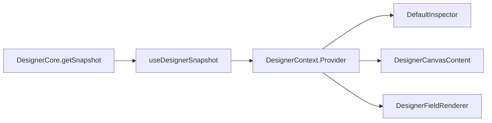
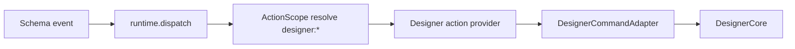
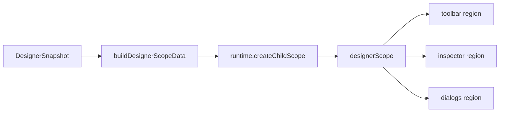

# Flow Designer Runtime Snapshot

## Purpose

本文单独说明当前 Flow Designer 在运行时真正稳定暴露出来的快照与宿主上下文，重点回答两个问题:

- `DesignerCore.getSnapshot()` 现在到底长什么样
- `designer-page` 当前哪些值真的暴露给了 schema 层，哪些还只是设计目标

这份文档故意区分"当前代码事实"和"更理想的宿主 scope 设计"，避免把设计稿里的字段误认为已经接线完成。

## Current Code Anchors

- `packages/flow-designer-core/src/types.ts`
- `packages/flow-designer-core/src/core.ts`
- `packages/flow-designer-renderers/src/designer-page.tsx`
- `packages/flow-designer-renderers/src/designer-context.ts`
- `packages/flow-designer-renderers/src/index.test.tsx`

## 一句话结论

当前 Flow Designer 已经有稳定的运行时快照，并且快照数据通过 `useDesignerHostScope` 被投影为 child scope 注入给 `toolbar`、`inspector`、`dialogs` 三个 region 的 schema 片段。

也就是说，当前实际存在并已落地的是:

- `DesignerSnapshot`
- `DesignerContextValue`
- `designer` action namespace
- `useDesignerHostScope` → 将快照投影成 child scope，通过 `buildDesignerScopeData` 生成 `doc`、`selection`、`activeNode`、`activeEdge`、`runtime` 等字段
- region 渲染时传入 `{ scope: designerScope, actionScope }` 使片段可读取上述字段

注意：host scope 已经接线，但只对 `toolbar` / `inspector` / `dialogs` 三个 region 有效；schema 表达式全局 scope（非 region 内部）不自动获得这些字段。

## 1. 当前真实快照契约

`DesignerCore.getSnapshot()` 当前返回 `DesignerSnapshot`，定义在 `packages/flow-designer-core/src/types.ts`。

```ts
interface SelectionSummary {
  selectedNodeIds: string[]
  selectedEdgeIds: string[]
  activeNodeId: string | null
  activeEdgeId: string | null
}

interface DesignerSnapshot {
  doc: GraphDocument
  selection: SelectionSummary
  activeNode: GraphNode | null
  activeEdge: GraphEdge | null
  canUndo: boolean
  canRedo: boolean
  isDirty: boolean
  gridEnabled: boolean
  viewport: { x: number; y: number; zoom: number }
}
```

这个类型是当前最可靠的运行时事实来源。

## 2. 每个字段的当前语义

### `doc`

当前完整图文档。

包含:

- `id`
- `kind`
- `name`
- `version`
- `meta?`
- `viewport?`
- `nodes`
- `edges`

用途:

- canvas 渲染节点与边
- export / save / restore 的数据源
- future schema-driven shell 的只读展示数据源

### `selection`

当前选中摘要，当前实现是单选模型，但摘要结构已经保留数组形态。

包含:

- `selectedNodeIds`
- `selectedEdgeIds`
- `activeNodeId`
- `activeEdgeId`

当前代码事实:

- `selectedNodeIds` / `selectedEdgeIds` 只有 0 或 1 个元素
- `activeNodeId` 与 `activeEdgeId` 二选一
- `clearSelection()` 会同时清空两者

### `activeNode`

当前激活节点实体。

当选中的是节点时:

- 返回该节点完整对象

否则:

- 返回 `null`

当前主要被默认 inspector 和 `designer-field` 使用。

### `activeEdge`

当前激活边实体。

当选中的是边时:

- 返回该边完整对象

否则:

- 返回 `null`

### `canUndo` / `canRedo`

直接反映 `DesignerCore` 当前 history 是否可回退/重做。

当前用途:

- toolbar 按钮禁用态
- provider 层命令可用性判断

### `isDirty`

表示当前文档是否与最近一次 `save()` 保存的文档不同。

当前实现注意点:

- 只有执行过 `save()` 之后，dirty 语义才真正有参照物
- 底层通过 document revision 与 saved revision 比较，不再在热路径上做 `JSON.stringify` 深比较

### `gridEnabled`

表示 host 侧网格开关状态。

当前它是 core-owned UI state，但不会写回 schema 层。

### `viewport`

当前受控视口摘要。

包含:

- `x`
- `y`
- `zoom`

当前语义:

- 由 core 统一归一化
- 参与 history
- undo / redo / restore 时一起回放

## 3. 当前 renderer 层怎么消费快照

当前不是把 `DesignerSnapshot` 散落到多个 React state 中，而是统一通过 `DesignerContextValue` 暴露。

```ts
interface DesignerContextValue {
  core: DesignerCore
  commandAdapter: DesignerCommandAdapter
  dispatch: (command: DesignerCommand) => DesignerCommandResult
  snapshot: DesignerSnapshot
  config: DesignerConfig
}
```

这意味着 renderer 内部组件有五个核心输入:

- `core`
- `commandAdapter`
- `dispatch`
- `snapshot`
- `config`

## 4. 当前实际暴露给谁

### 已实际暴露给 Flow Designer React 子组件

通过 `DesignerContext` 可直接拿到:

- `snapshot`
- `config`
- `dispatch`
- `core`
- `commandAdapter`

当前明确依赖这些值的组件包括:

- `DesignerPaletteContent`
- `DesignerCanvasContent`
- `DefaultInspector`
- `DesignerFieldRenderer`

### 已通过 child scope 注入给 region schema 片段

`designer-page.tsx:118` 调用 `useDesignerHostScope({ snapshot, config, core, path })` 创建 child scope，
然后在 `toolbar`、`inspector`、`dialogs` region 渲染时传入:

```ts
props.regions.toolbar?.render({ scope: designerScope, actionScope })
props.regions.inspector?.render({ scope: designerScope, actionScope })
props.regions.dialogs?.render({ scope: designerScope, actionScope })
```

因此这三个 region 内部的 schema 表达式**已经**可以读取由 `buildDesignerScopeData` 投影出的所有字段:

- `doc`
- `selection`（含 `kind`、`count`、`nodeIds`、`edgeIds`、`activeNodeId`、`activeEdgeId`）
- `activeNode`
- `activeEdge`
- `runtime`（含 `canUndo`、`canRedo`、`dirty`、`isDirty`、`gridEnabled`、`zoom`、`viewport`）
- `palette`
- `nodeTypes`
- `edgeTypes`
- `designerCore`

注意边界: 这些字段只对通过 `render({ scope: designerScope })` 挂载的 region 内部有效；`designer-page` 之外的 schema 全局 scope 不自动获得这些字段。

## 5. 当前 schema 层真正稳定可用的能力

### 已稳定可用

- `designer:*` namespaced actions
- `toolbar` / `inspector` / `dialogs` region 挂载点
- 通过共享 `dialog` action runtime 打开的 dialog 内继续 dispatch `designer:*`
- `designer-field` 这种由 Flow Designer 自己提供的专用 renderer
- region 内部 schema 表达式可读取 `doc`、`selection`、`activeNode`、`activeEdge`、`runtime`、`palette`、`nodeTypes`、`edgeTypes`（通过 child scope 注入，见第 4 节）

### Region capability matrix

| Path | Mounted by `designer-page` | Reads injected designer scope | Dispatches `designer:*` | Covered by regression |
| --- | --- | --- | --- | --- |
| `toolbar` region | Yes | Yes | Yes | Yes |
| `inspector` region | Yes | Yes | Yes | Yes |
| `dialogs` region | Yes | Yes | Yes | Yes |
| shared `dialog` action popup | Via dialog runtime | Inherits popup scope | Yes | Yes |

### 尚未落地（保留设计目标）

- `designer-page` 之外的 schema 全局 scope 自动获得 designer 快照字段（目前只有 region 内部有效）
- schema 层通过 `designerCore` 直接操作核心（当前仅 region 内 scope 可读，写路径必须走 action）

## 6. 当前已落地的三条消费路径

### 路径 A: React 子组件直接消费 `snapshot`

调用链:

```text
DesignerCore.getSnapshot()
  -> useDesignerSnapshot(core.subscribe)
  -> DesignerContext.Provider
  -> DefaultInspector / DesignerCanvasContent / DesignerFieldRenderer
```

这是当前最主要、最真实的快照消费方式。

### 路径 B: schema 片段通过 action 与 designer 交互

调用链:

```text
schema fragment event
  -> runtime.dispatch(action)
  -> ActionScope.resolve('designer:*')
  -> createDesignerActionProvider(core)
  -> DesignerCommandAdapter
  -> DesignerCore
```

这是当前 schema 与 designer 的主要写路径。

### 路径 C: region schema 片段读取 host scope 快照字段

调用链:

```text
DesignerSnapshot (reactive via useSyncExternalStore)
  -> buildDesignerScopeData(snapshot, config, core)
  -> runtime.createChildScope(parentScope, scopeData, { scopeKey })
  -> scope.merge(scopeData) on each update
  -> regions.toolbar/inspector/dialogs render({ scope: designerScope })
  -> schema fragment reads ${doc.*} / ${activeNode.*} / ${runtime.*}
```

这是当前 region 内 schema 表达式读取 designer 状态的路径。

## 7. 为什么要单独区分 snapshot 和 host scope

因为这两个概念很容易被混用，但职责不同。

### `snapshot`

是 graph runtime 的只读事实快照。

当前已经真实存在，并被 React 子组件稳定消费（路径 A）。

### `host scope`

是把快照重新投影为 schema 表达式和模板可读取的数据上下文。

当前已通过 `useDesignerHostScope` 为三个 region 建立了 child scope（路径 C），写路径继续走 `designer:*` action（路径 B）。

## 8. 当前可依赖字段清单

如果你在改代码或写文档，当前可以安全写成"已存在"的字段只有这些。

### `DesignerSnapshot`

```ts
snapshot.doc
snapshot.selection
snapshot.activeNode
snapshot.activeEdge
snapshot.canUndo
snapshot.canRedo
snapshot.isDirty
snapshot.gridEnabled
snapshot.viewport
```

### `DesignerContextValue`

```ts
ctx.core
ctx.commandAdapter
ctx.dispatch
ctx.snapshot
ctx.config
```

### region child scope 字段（toolbar / inspector / dialogs 内部有效）

```ts
doc
selection   // { kind, count, nodeIds, edgeIds, activeNodeId, activeEdgeId }
activeNode
activeEdge
runtime     // { canUndo, canRedo, dirty, isDirty, gridEnabled, zoom, viewport }
palette
nodeTypes
edgeTypes
designerCore
```

## 9. 当前不应写成"已经存在"的能力

下面这些在设计文档里可以作为目标，但不应在现状说明里写成"已落地"。

- `designer-page` 之外的全局 schema scope 自动包含 designer 快照字段（只有 region 内部有效）
- schema 层通过 `designerCore` 原地操作（写路径必须走 action）

## 10. 调用链图

### 当前真实快照流转



### 当前真实 schema 写路径



### 当前真实 host scope 投影路径



## Related Documents

- `docs/architecture/flow-designer/design.md`
- `docs/architecture/flow-designer/api.md`
- `docs/architecture/flow-designer/collaboration.md`
- `docs/architecture/flow-designer/config-schema.md`
- `docs/architecture/complex-control-host-protocol.md`
