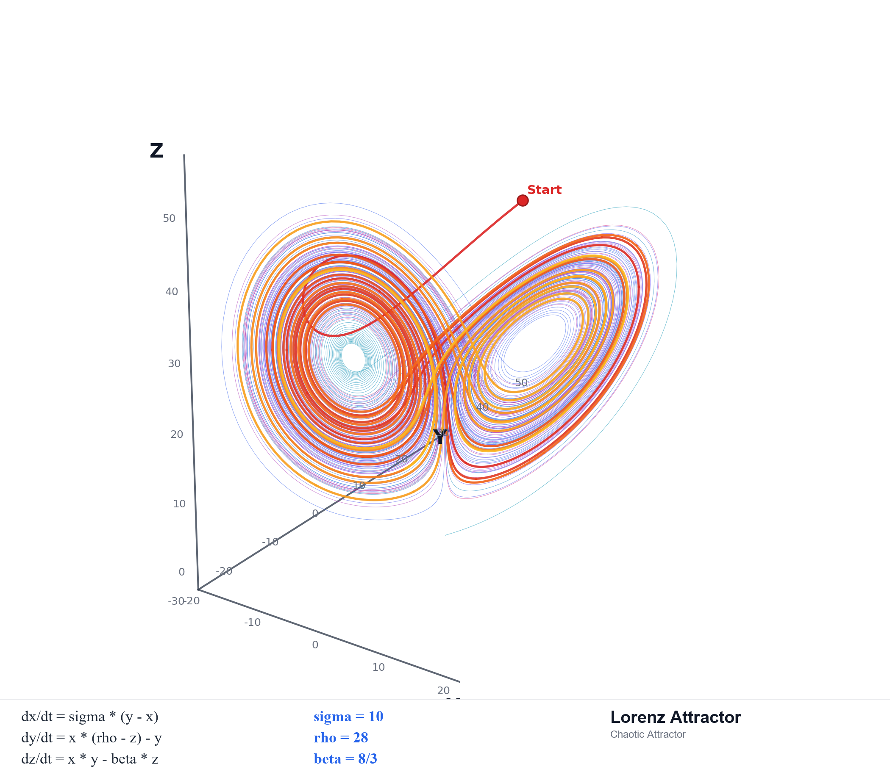

# Attractor Before Harness: AI 大规模开发的方法论

> 在 AI 深度参与开发的系统中，第一性的问题不是"如何约束 AI 的行为"，而是"系统应当收敛到怎样的长期结构"。
> 只有当这个方向被定义清楚之后，harness、guardrail、verification、audit、closure 这些机制才能真正具有意义。否则，它们不过是在高效地固化一套错误基线。
> 这个主张之所以是必然的，是因为 AI 协作把软件工程方法论中一个长期被外挂处理的问题——"轨迹收敛"——推到了必须显式建模的位置。

## 一、为什么一谈 AI 工程，大家先想到 Harness

当前讨论 AI 辅助开发时，最常见的说法是：

- `guardrail`
- `verification`
- `review`
- `feedback loop`
- `agent harness`

这套直觉默认了一个前提：

**系统正确的方向是已知的。**

在此前提下，问题自然变成：

- 怎么限制偏离
- 如何尽早暴露失败
- 怎么让 review 更严
- 怎么防止 agent 胡来

这套语言在小任务里是够用的。一个脚本、一页 CRUD、一个局部 bug 修复，大多数时候你已经知道"对的结果长什么样"，剩下的主要是执行和验证问题。

但大型系统真正困难的地方，往往不是"怎么防止越线"，而是"到底哪条路才是长期正确的结构"。

要回答这个问题，必须先看清一件事：**当前所有这些 harness 类机制，都建立在一个隐含前提上——评价单位以状态为主，轨迹收敛靠人的隐性方向感兜底**。而 AI 协作恰好把这个兜底机制抽走了。

## 二、被抽走的兜底机制

打开任何主流工程方法论——TDD、DDD、Clean Architecture、Agile、Code Review 文化——它们的一等公民评价对象几乎都是状态：

- 评价"这次 PR 对不对"，不评价"过去 100 次 PR 累积出的方向对不对"
- 评价"当前架构是否清晰"，不评价"架构在演化中是否被持续推向某种稳定形态"
- 评价"测试是否覆盖当前行为"，不评价"测试套件本身是否被实现细节腐蚀"

传统方法论并非完全没有轨迹意识——重构、技术债务、坏味道、演进式架构、Lehman 软件演化定律都涉及轨迹。但这些概念在体系里的地位是**修正机制和诊断词汇**，而不是基础对象。一个理论需要不断引入"债务""脆弱性""腐蚀"这类否定性概念来追认轨迹问题，恰恰反映出它的基础范畴集里没有正面的轨迹对象。

这套以状态为主的范式之所以长期够用，是因为人类工程师本身就是低频、稳定方向感的扰动源。一个人一天写几百行代码，每次扰动幅度小，且脑子里持续有方向。状态层质量保证 + 程序员的隐性方向感，合起来就能保证轨迹不漂移。

AI 协作把这个兜底机制抽走了。AI 不是更快的程序员，而是**结构上不同的扰动源**：

- **高频**：一个 session 可能在几分钟内生成数百行涉及多模块的代码
- **高幅度**：每次生成都可能引入跨边界的结构性变更
- **无持续方向感**：每个 session 独立，没有跨 session 的隐性架构判断
- **局部高度合理**：接口、类型、测试、文档可以同时给出，每一项单独看都过得了检查

最后一条是关键。**在 AI 协作中，所有状态层检查都能通过，但系统整体可以在持续漂移**。

`nop-chaos-flux` 的 Plan 76 是个典型例子。一次尝试移除 `array-editor` / `key-value` 的本地状态镜像，直接引出 11 个测试失败。但暴露的不是某个 bug，而是更深的事实：**测试本身已经与旧实现的时序紧密耦合**。从状态视角看，每一次累积修改都通过了 review 和 CI；从轨迹视角看，测试套件已经在不知不觉中漂移到了一个无法支撑结构演进的位置。

传统理论里有"测试脆弱性"这个**症状名**——但症状名是截面诊断，它不命名"100 次合法提交累积出脆弱性"这个过程。轨迹问题是过程问题，过程问题需要过程语言。

所以问题不是 AI 让旧问题变严重了，而是 AI 把轨迹问题从**偶发的修补对象**推向**高频的一等公民对象**。要让这类问题进入方法论的视野，工程方法论必须把"轨迹"作为基础范畴。

## 三、动力系统语言：把轨迹问题显式化

在数学物理中，**动力系统**指的是一个状态会随时间持续演化、并且下一步状态依赖当前状态的系统。我们关心的不只是某一个时刻对不对，而是它在时间中会走出什么样的**轨迹**。

放到 AI 大规模开发里，这套语言对应四个相互定义的基础对象：

- **状态空间**：系统在当前约束下所有可能演化到的实现状态
- **吸引子**：系统在长期演化中反复被拉回的稳定结构
- **轨迹**：每一轮生成、验证、纠偏之后真实留下来的演化路径
- **控制**：通过局部信号持续影响轨迹的各种机制

仓库在现有约束下可能演变出的所有代码、文档和测试组合，构成了状态空间；人、AI、review、CI 以及文档更新等持续作用，构成了演化规则；二者叠加形成的 live repo 历史，就是轨迹；而 attractor，则是系统在长期迭代中反复被拉回的那个稳定结构。

**这里需要明确一点：这套语言不是"换个更优雅的说法"，而是新本体论的基础语言**。状态空间、吸引子、轨迹、控制四个概念相互定义，缺一个其他三个就无法严格表达。试图用旧本体论的语言（架构、约束、目标、流程）翻译这些概念，必然产生信息损失——这正是"Attractor Guided Engineering 不还是 Harness 吗"这类误读的根源。

四个对象的关系是：

**状态空间 → 吸引子 → 轨迹 → 控制**

**这不是修辞排序，是逻辑依赖**。状态空间不定义就谈不上吸引子；吸引子不定义就无法判断轨迹是否在漂移；轨迹判断不存在，控制就没有目标。

这里的 "before" 指**逻辑上的优先**：执行上 attractor 和 harness 在闭环中共演化，但 attractor 在概念上可以脱离 harness 被定义，harness 在概念上无法脱离 attractor 被定义（纠偏纠向哪里？）。这种不对称对应于动力系统中的目标因 vs 动力因关系——承认共演化不削弱 "before" 主张，目标因和动力因在物理系统里同样共同作用，但目标因仍然是动力因的逻辑前提。

## 四、吸引子到底是什么

以广为人知的 Lorenz 吸引子为例，它由微分方程隐式定义，它不是把所有正确轨迹预先列出来的清单，也不是一个简单的边界。吸引子中局部轨迹非常复杂，短期看上去近乎混沌，但整体并不是随机乱飞，而是始终被拉回同一类几何形态。

_Lorenz attractor：局部轨迹高度复杂，整体仍被稳定结构约束。混沌不等于随机；局部不可预测，不等于整体失控。_

工程里的 attractor 也一样。**它更像"方程定义流形"，而不是"把所有合法点一一列出来"**。方程不会提前写出流形上的每一个点，它只规定哪些关系必须成立；满足这些关系的点，自然落在同一个结构里。

**与传统架构概念的关键差异**：DDD、Clean Architecture 同样强调长期结构，但它们把长期结构当作**目标状态**——方法论的工作是"达到 X"。轨迹本体论把长期结构当作**吸引子**——方法论的工作是"无论被推开多远都能回到 X 附近"。**第二种视角处理的是扰动下的稳定性**。这正是 AI 协作场景的核心问题，也是传统方法论没有一等公民概念工具处理的问题。

为避免概念漂移，attractor 在工程中可以严格分三层：

- **结构层（attractor 本身）**：少量高阶不变量，比如职责怎么分、边界怎么立、哪些结构关系不能被破坏
- **承载层（attractor 的工程载体）**：把这些不变量外化为可版本化、可审计的文档
- **实现层（attractor 的瞬时投影）**：当前代码中实际体现这些不变量的部分

**attractor 不是文档，文档是 attractor 的承载；attractor 不是代码，代码是 attractor 的瞬时投影**。

这种分层之所以重要，是因为它解决了一个常见困惑："architecture doc 和代码冲突时听谁的？"答案不是"哪个更权威"，而是"问什么问题"：问当前实现行为，代码权威；问系统应向哪里收敛，文档权威；问某条路径为什么被放弃，logs/bugs/analysis 权威。每一层只在它对应的问题上是权威。

## 五、仓库开始承担系统真相，Harness 因而成为基础设施

AI 深度参与以后，仓库不再只是人类认知的外部投射，而开始成为系统唯一真相的载体。不再有人完整掌握系统中的设计细节，没有人能在不查看项目源码的情况下回答关于系统设计的问题。下一个 session 能重新读取的，不是作者脑中的完整意图，而是代码、diff、日志、测试和文档。

这带来一个直接的工程后果：

**生成和验收必须被真正分离。**

生成动作可以在同一个上下文里由 AI 高速完成，但验收已经不能再依赖那个生成上下文本身。你必须回到仓库里的外部证据，重新判断：

- 行为是不是真的落地了
- 当前基线到底是什么
- 哪些材料是权威的
- 这次"完成"是不是只是一种完成感

正是由于仓库开始承载系统真相，生成与评估才必须分离；也正是由于生成与评估分离，harness 才从一种"更稳妥的工程习惯"升级为必要的基础设施。

**在传统协作中，harness 是可选纪律；在 AI 协作中，harness 是让轨迹判断成为可能的必要条件**。原因在于：AI 在生成代码的同时，也在生成判断这段代码是否正确的所有材料——类型、测试、文档、完成总结都是同一个上下文基于同一套理解一起产出的。如果这套理解本身偏了，所有"验证证据"会一致地偏在同一方向，互相不矛盾，但整体错了。这种**自我验证陷阱**在人类协作中被自然削弱——CI 规则、reviewer、规范文档都是独立于本次生成动作的外部标准，由不同认知主体维护。AI 协作打破了这种独立性，所以必须用工程手段——fresh session、独立 audit、回到 live repo 取证——人为重建生成和验收的分离。

在 repo truth 条件下：

- `test / lint / audit` 更像测量
- `owner doc / plan / closure` 更像约束
- `logs / bugs / discussions` 更像轨迹记录和外部化记忆

## 六、三个最容易发生的本体论混淆

第一，**把 attractor 当作边界**。

边界回答"什么不能做"，违反它立即引起错误。Attractor 回答"系统应向哪里长期收敛"，单次违反不一定引起错误，但持续偏离会让结构腐烂。边界定义禁区，吸引子定义稳定区。混淆这两者，会把吸引子降格为更严格的护栏，错过它处理"扰动下稳定性"的核心能力。

第二，**把 attractor 当作更强的护栏**。

护栏在执行层（每次动作都被检查），attractor 在方向层（多次动作累积是否向其靠拢）。把它理解成更严格的治理、更密的约束、更强的审计，仍然是把首要问题降格到控制层。这种降格的根源是没意识到二者属于不同层级。

第三，**把 attractor 当作控制目标的另一种说法**。

`control target` 这个词看起来很接近，但它默认控制框架已经成立。在轨迹本体论下，attractor 的角色是**为控制提供目标因**——它在控制之前，不在控制之中。如果没有先定义 attractor，所谓控制就没有目标，harness、guardrail、verification、audit 这些机制也没有统一含义。

## 七、在 nop-chaos-flux 的仓库里，Attractor 首先是 `docs/architecture/`

如果 attractor 只停留在抽象层面，它就还没有真正的工程意义。对 `nop-chaos-flux` 来说，首先承担 attractor 的，是 **`docs/architecture/` 中带 precedence 的 owner-doc 体系**。

在本仓库里，工程落点很明确：`docs/architecture/` 下的规范定义在前，plan、verification、audit、logs 等收敛机制在后。

在 `docs/architecture/` 内部，这种"方程层"也有明确 precedence：

- `docs/architecture/README.md` 负责说明 architecture hierarchy 和 reading order
- `flux-design-principles.md` 负责方向层，解释设计意图和稳定原则
- `frontend-programming-model.md` 负责顶层规范层，定义 primitive identity、macro boundary 和 hard invariants
- `flux-core.md` 负责当前 codebase-wide baseline
- 更窄的 architecture doc 在各自主题内定义局部 contract

在 `nop-chaos-flux` 里，attractor 的结构层不是抽象的"正确架构"，而是由少数高价值不变量共同定义的：七个原语闭合集、编译优先的流水线、Template/Instance 分离、Data/Capability 正交、统一 renderer/hook contract，以及 `flux-core → flux-formula → flux-compiler → flux-action-core → flux-runtime → flux-react` 的依赖方向。

它们不是并列的治理材料，而是 owner docs 固定下来的结构方程。架构的价值不在于描述一切，而在于让错误结构无法继续合法存在。

也正因为如此，这个仓库里很多真正重要的收敛动作，最后都会表现成"某个旧结构被排除出合法状态空间"。

`CompiledSchemaNode` 被最终移除，就是一个典型例子。它不是单纯的重构清理，而是说明：模板/实例分离这条新基线成立之后，旧的中间结构虽然还能工作，但已经不再属于正确结构，于是被排除出去。

同样，`flux-compiler` / `flux-action-core` / `flux-runtime` 三层拆分也不是"多拆了两个包"这么简单，而是 attractor 变得更精确了：系统不只是"能跑"，而是被进一步收敛到更稳定的职责结构。

## 八、什么是 Harness

如果 attractor 解决的是"方向是什么"，那么 harness 解决的是：

**如何通过局部信号，持续地测量、纠偏、更新系统轨迹。**

这里说的 harness，不是狭义的测试 harness，而是更广义的执行支架。它通常包括：上下文路由、实现与验收分离、计划与关闭条件、验证机制、审计机制、诊断工具、外部化记忆。

放到这个仓库里，至少可以看到五层 harness：

### 1. 路由 harness

`docs/index.md` 和 `docs/architecture/README.md` 决定：碰到什么问题先读什么，什么是 current baseline，什么只是 analysis、plan 或 history。

### 2. Plan harness

`docs/plans/` 解决的是"这一轮扩张如何收口"，不是"系统是什么"。

`current baseline`、`goals / non-goals`、`exit criteria`、`validation checklist`、`closure audit evidence` 这些字段定义的是局部轨迹怎样才能有效闭合。

Plan 145 在 closure/audit 之后把新确认的跟进面拆到 Plan 146，Plan 143 的 closure assumption 被 fresh audit 连续推翻，直到 live repo 真正过线后才允许关闭。Plan 在这里不是待办列表，而是局部的收敛机制——它不是把"现在有哪些事要做"列出来，而是规定这一轮扩张要收口到哪里、满足什么退出条件、closure 需要哪些独立证据。

### 3. Verification harness

`lint`、`check`、`typecheck`、`build`、`test` 把高频、明确、可自动化的偏离检测提前到机器层。

### 4. Audit harness

并非所有偏离都能被自动化规则抓住。更高层的语义漂移、结构偏差、假完成、局部自洽但整体失真的问题，仍然需要独立审计。

审计本身也是一个闭环：发现偏离点、过滤冲突和伪问题、再回到 live repo 确认。高质量审计的重点不是堆出更多问题，而是尽快排除不成立的问题。

在这个仓库里，最关键的 harness 规则之一就是：**不要让同一个上下文既做实现，又做完成判定**。完成必须由 fresh session 或独立审计重新回看 live repo；Plan 143 和 Plan 145 的 closure 之所以有分量，正是因为"完成"不是实现者自报，而是来自独立的收敛判定。

### 5. Memory harness

`docs/logs/`、`docs/bugs/`、`docs/discussions/` 构成跨 session 的外部化记忆。

这一层特别重要，因为对 AI 来说，"为什么不能那样理解"本身也是系统记忆的一部分。只保留最终结论还不够，很多时候还必须保留：

- 哪个前提已经被证伪
- 哪条路径已经证明会发散
- 哪种术语翻译会把问题降格
- 哪个"已完成"判断后来被 live repo 推翻

没有这层 memory harness，系统每次都会丢失一部分历史轨迹信息。

真正的闭环不是"定义一次 attractor，然后永久执行 harness"，而是"定义 attractor → 扩张 → 纠偏 → 更新 attractor → 再扩张"。`flux-compiler` / `flux-action-core` / `flux-runtime` 三层拆分，就是 attractor 被实践校正后再继续扩张的例子。

## 九、为什么新 Attractor 通常不是 AI 自己演化得到

即使已经有了 harness，也不能指望 AI 在高速迭代中自己慢慢演化得出新的 attractor。

至少在当前主流模型的训练分布和偏置下，通常不能指望这件事自然发生。

更具体地说：

- 当前主流 AI 很擅长围绕既有 attractor 高速展开和收敛
- 但它通常会回到自己见过的平均方案
- 真正新的概念切分、边界重定义和架构语言，仍需要人先给出

**不能把定义新 attractor 的责任默认外包给 AI。**

在大型框架开发里，人和 AI 的分工不能简单理解成"AI 写代码，人做 review"。更真实的分工是：

- 人定义新的 attractor
- AI 围绕既定 attractor 高速展开
- harness 持续将轨迹拉回正轨

像 `ActionScope` 和 `Data Scope` 分离、词法作用域这类真正改变系统结构语言的概念，不是让 AI 自由采样平均方案就能生长出来的。它们是新 attractor 先被提出，然后 AI 才能在新基线上做大规模展开。

需要承认一个限制：**这意味着这套方法论的有效性依赖于团队中存在能定义 attractor 的人**。这不是方法论的弱点，而是它正确识别的事实——架构判断是稀缺资源。传统协作中，这种判断可以部分留在架构师脑中，靠口传心授和 code review 传递；AI 没有跨 session 记忆，任何未被显式外化的架构判断对 AI 都不存在。这套方法论的工程贡献正是把这种稀缺资源**外化为可版本化、可审计、可传承的仓库结构**，让它不必随个人走。但如果团队中完全没有人能做出这种判断，方法论也无法凭空生成它。

## 十、结语

AI 大规模开发真正困难的地方，不在于让 AI 多写一点代码，而在于让系统在高速扩张中仍然向正确结构收敛。

这个收敛问题在以状态为一等公民的传统方法论里**没有正面的对象**——它只能通过"债务""脆弱性""腐蚀"这类否定性词汇被间接追认。要让收敛问题成为可被表达、被讨论、被工程化处理的一等公民对象，方法论必须把轨迹纳入基础范畴。

谁提出新的 attractor，谁就在定义系统后续演化的结构基线。

把这套方法压缩到最后，核心只有一句：

**状态空间 → 吸引子 → 轨迹 → 控制。**

这不是更复杂的工程流程，是更基础的工程概念结构。先有系统应向哪里长期收敛的结构，才有轨迹是否跑偏的判断；先有轨迹是否跑偏的判断，后面的 harness、guardrail、verification、audit、closure 才有统一意义。

在 AI 时代，真正稀缺的并非更多会写代码的 agent，而是能够率先回答"系统该向哪里收敛"的人。

---

**nop-chaos-flux 已开源：**

- GitHub: https://github.com/entropy-cloud/nop-chaos-flux
- Gitee: https://gitee.com/canonical-entropy/nop-chaos-flux
