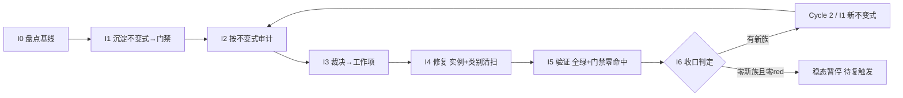

# AI Engine 不变式驱动的持续审计闭环（AI Engine Invariant-Driven Continuous Audit Loop）

> Last Updated: 2026-08-09
> 产出方法：`docs/skills/roadmap-and-mission-authoring-with-consensus-review.md`（诊断→选型→拟制→共识审查）；经 2 轮独立 fresh session 审查至共识（Round 1 revised → 修正 → Round 2 approved）
> 驱动方：`missions/ai-invariant-loop.json`（范围：`packages/flux-renderers-ai/` engine + adapters；授权/commitFormat/Loop Rule 见该 mission description）
> 先例与诊断依据：AI 模块 4 轮 open/multi audit（`docs/audits/2026-07-2*-ai.md`、`2026-07-25-0*-ai.md`）+ C8.1/C8.2/C8.3 逐组件卡 + post-closure；诊断结论见 `docs/logs/2026/08-08.md`
> 关联：本图为独立 roadmap（聚焦 AI engine 不变式闭环），与 `docs/backlog/component-audit-round2-roadmap.md` 范围不重叠（round-2 覆盖 host 大面 + P3 裁决 + 通用回扫；本图专注 AI engine 的不变式沉淀与防回退）。如后续需在 round-2 建立指向本图的 work item，按 round-2 的 Rule 走人工确认 + 共识审查。

## 目的

AI engine 已被审计 4 轮 + 逐组件卡 + post-closure（全仓最多）。每轮都在**同一家族的新路径**上发现缺陷——但**这些缺陷最终都被修了**（live code 已含 `deleteConversation` 的 `activeIdRef`、`clearAll` 的 storage 路径、`create-engine` 的 controller 身份守卫，见「当前基线」）。问题不是"缺陷修不掉"，而是**"每族都要历经多轮审计才完整捕获全部兄弟实例"**：

- **并发守卫族**历经 Bug 07（原始缺陷）→ AI-01（send 入口加 `isProcessing`，**修复不全**）→ 1757（发现 finally/catch 未做 controller 身份守卫的残留）**三次审计**才完整修复；
- **stale-closure 族**：P1-3 修了 `switchConversation` 加 `activeIdRef`，0707 才发现 `deleteConversation` 漏改（"same family, missed method"）；
- **storage 静默丢族**：P1-2 修了 `create`/`rename` 经 `reportStorageError`，0707-open 才发现 `clearAll` 完全无 delete 路径（"precise inverse"）。

根因 = **"修实例不修类别"** + **反应式测试（per-bug）非穷举** + **零 engine 不变式门禁**（renderer 包有 `check:audit-event-dispatch-ctx`，engine 无等价物）。下次重构或新增方法，同族缺陷会**再次回归**——因为没有可执行契约拦住。

本路线图把修-漏-再修的循环**改造为自驱动飞轮**：把已知失败模式**沉淀为可执行不变式门禁**（入 CI，回归自动被抓）→ 按不变式**确定性审计**全部方法（找违背）→ 裁决成工作项 → 修复（强制实例+类别清扫+测试）→ 新失败类再沉淀为新不变式。门禁集合**单调增长（棘轮）**，覆盖面随每轮扩大；整轮零新发现则进稳态，CI 变红或周期复探再触发。

## Loop Design（循环方法论，非 phase）

每个 Cycle 固定 7 步，I0 仅 Cycle 1 有：

```
I0 盘点基线 → I1 沉淀不变式(→门禁) → I2 按不变式审计(跑门禁+对抗探查) → I3 裁决→工作项
   → I4 修复(实例+类别清扫+测试) → I5 验证(全绿+门禁零命中) → I6 收口(新失败类?→下轮 I1; 否则稳态)
```

- **自动化边界**：I1/I2/I5 的门禁部分完全自动化（CI 连续跑）；I2 的对抗探查 + I3 裁决为半自动（每轮一次）；I4 修复预授权 P0/P1 自动执行（同 component-audit 纪律）；I3 新工作项 + I6 稳态判定按 Loop Rule 自动派生（预授权），不逐次人工重启。
- **棘轮规则**：不变式门禁只增不减；弱化/豁免任一不变式需人工确认并留痕（对齐 round-1 门禁纪律）。
- **稳态与复触发**：一轮 I2 零新违背且零新不变式类 → 循环暂停；触发复跑的条件：① CI 任一 engine 不变式门禁变红；② `packages/flux-renderers-ai/src/engine/` 或 `src/adapters/use-conversation*` 发生结构变更（git 监控，可选 hook）；③ 周期复探（默认每 major release 或季度，取早）。

## Work Item Status

> 唯一动态状态区。Cycle 1：I0/I1/I2/I3 已 `✅`、I4-I6 仍 `todo`（I3 已收口，见 `docs/audits/ai-invariants/cycle1-adjudication.md`；I2 已完成，见 `docs/audits/ai-invariants/cycle1-findings.md`）。后续 Cycle 按「Loop Rule」由 I6 自动派生（标记 `Cycle N`，附触发证据），不需人工重开。

| Work Item                                        | 交付范围                                                                                                                                                                                                                                                                                                                                                                                                                                                                                                                                                                                                        | 状态               | Owner Doc                                                                                                        | 依赖 |
| ------------------------------------------------ | --------------------------------------------------------------------------------------------------------------------------------------------------------------------------------------------------------------------------------------------------------------------------------------------------------------------------------------------------------------------------------------------------------------------------------------------------------------------------------------------------------------------------------------------------------------------------------------------------------------- | ------------------ | ---------------------------------------------------------------------------------------------------------------- | ---- | ------------------------------------------------------------------------------------------------------------------------------------------------------------------------------------------------------------------------------------------------------------------------------------------------------------------------------------------------------------------------------------------------------------------------------------------------------------------------------------------------------------------------------------------------------------------------------------------------------------------------------------------------------------------------------------------------------------------------------------------------------------------------------------------------------------------------------------------------------------------------------------------------------------------------------------------------------------------- |
| Cycle 1 / I0. 不变式盘点与基线                   | 从 4 轮审计 + post-closure 提取已知失败模式族 → 不变式目录（`docs/audits/ai-invariants/invariant-catalog.md`，每条：不变式陈述、覆盖的失败族、历史 bug 证据、检测方法）；确认基线 = 当前零 engine 不变式门禁（`scripts/` 无 engine 相关 check）；枚举全部变更型方法（异步：send/sendMessage/abort/regenerate 等；同步变更：clear/setMessages 等；adapter：delete/switch/create/rename/clearAll）作为审计目标集                                                                                                                                                                                                  | `✅`（2026-08-09） | docs/components/flux-renderers-ai/engine.md                                                                      | —    | （执行证据：plan `docs/plans/2026-08-09-1826-1-i0-invariant-inventory-baseline.md` completed + 两轮独立 closure-audit 均 PASS（`ses_019d97306ffeV5Nmu4WX3SyXSB` + `ses_019d61aa6ffe7PDTA69j8vwfwg`，fresh session）；交付物：`docs/audits/ai-invariants/invariant-catalog.md`（153 行：零门禁基线确认 + 5 条首批不变式 ×4 字段 + 三大族已修复逐行核对 + Cycle 2+ 候选族登记 + 目标集 12 变更方法 + 5 白名单 + runTurn/边界裁定 + 零 diff proof）；目标集 × live 类型交叉验证零 diff（脚本 + 运行时 Object.keys 双保险））                                                                                                                                                                                                                                                                                                                                                                                                                                           |
| Cycle 1 / I1. 不变式沉淀（第一批门禁）           | 将首批 5 类不变式落为**参数化穷举测试 + 门禁脚本**（方法表驱动）：① 变更型方法入口检查 `isProcessing`（异步族）；② `await` 后状态读取用 `activeIdRef`/`versionRef`（非闭包捕获）；③ catch/finally 的 controller 写入做身份守卫；④ storage 变更经 `reportStorageError`；⑤ abort 路径清理 controller。**表完备性门禁**：断言测试表方法集 == engine/adapter 公共变更方法集（从 `MessageEngine`/`UseConversationReturn` 类型反查），新增方法不入表即门禁红（防新方法静默成盲区）。门禁入 `pnpm check`（`check:ai-engine-invariants`）+ `scripts/__tests__/` committed 回归；落 `docs/audits/ai-invariants/gates.md` | `✅`（2026-08-09） | engine.md §invariants（本 plan 补写）                                                                            | I0   | （执行证据：plan `docs/plans/2026-08-09-1826-2-i1-invariant-gate-sedimentation.md` completed + 独立 closure-audit PASS_WITH_MINOR（`ses_019c50670ffeVYwPu3hesmn0GD`，fresh session，零 blocker/major；1 minor 为既有 CSS-export 测试 stale literal，非本 plan scope）；交付物：`engine-invariants.test.ts`（12 tests：①③⑤ 参数化穷举 + 表完备性门禁运行时枚举 + PROOF）+ `conversation-invariants.test.ts`（10 tests：②④⑤ + 表完备性 + PROOF）22/22 全绿；`scripts/audit/find-ai-engine-invariant-violations.mjs`（②③④ 静态扫描器）live 扫描零命中；`check:ai-engine-invariants` 入 `pnpm check` 链；`scripts/__tests__/find-ai-engine-invariant-violations.test.ts` committed 回归 4/4；`docs/audits/ai-invariants/gates.md` 门禁清单（棘轮登记处）；`engine.md` §Invariants；`pnpm --filter @nop-chaos/flux-renderers-ai test` 536/536 全绿零回归）                                                                                                               |
| Cycle 1 / I2. 不变式驱动审计                     | ① 跑 I1 门禁跨全部方法 → red list（确定性，自动化）；② 对抗式探查（`docs/skills/open-ended-adversarial-review-prompt.md`）针对「门禁尚未表达」的失效路径（新交错组合、refactor 引入的新方法）；③ 对照不变式目录标注每条发现属于已知族（门禁漏覆盖）还是新族（需新增不变式）                                                                                                                                                                                                                                                                                                                                     | `✅`（2026-08-09） | docs/skills/open-ended-adversarial-review-prompt.md                                                              | I1   | （执行证据：plan `docs/plans/2026-08-09-1826-3-i2-invariant-driven-audit.md` completed + 独立 closure-audit PASS（`ses_0199e90acffektDg63TggLe6ys`，fresh session，零 blocker/major）；交付物：`docs/audits/ai-invariants/cycle1-findings.md`（空 red list 零命中验证——`check:ai-engine-invariants` exit 0 + AI 包 536/536 全绿 + `pnpm check` 仅既有登记 red；12×5 覆盖矩阵含 runTurn 间接行；已知族 K1-K4 门禁漏覆盖 → I3 补门禁：③ 成功路径身份守卫缺失 / ⑤ abort 不强制终结 generator / ④ storage save-after-delete ghost / ② rename sync 闭包读取；新族 N1-N5 触发证据齐备 → Cycle 2 派生：active 提升位移完整性（5 成员复现）/ bootstrap 列表覆盖 / branch 戳泄漏（候选族触发）/ plugin 错误隔离（候选族触发）/ 失败轮残留污染；watch-only W1-W4 + 未触发候选族登记）；双轮对抗探查记录 `docs/analysis/2026-08-09-i2-cycle1-adversarial-probe/round-01-executor.md` + `round-02-independent.md`（14 项 RED 复现全部经临时 vitest 验证后清除，工作区零残留）） |
| Cycle 1 / I3. 发现裁决与工作项拟制               | red list 逐条裁决（P0/P1/P2/P3，对齐 checklist v2 裁决表）→ P0/P1 派为本 Cycle I4 修复项；**新族**派为 Cycle 2 / I1 新不变式项（按 Loop Rule 自动派生）；P2/P3 入本图 Follow-up Backlog；裁决表 `docs/audits/ai-invariants/cycle1-adjudication.md`（零悬挂）                                                                                                                                                                                                                                                                                                                                                    | `✅`（2026-08-09） | cr-inventory-adjudication.md 先例                                                                                | I2   | （执行证据：plan `docs/plans/2026-08-09-2007-1-cycle1-i3-adjudication.md` completed + 独立 closure-audit APPROVED（`ses_0198191d3ffeSD37970JCqZSmi`，fresh session，零 blocker/major；2 条 non-blocking 观察：Exit Criterion 措辞先于翻转、log 门禁编号 off-by-one 已修）；交付物：`docs/audits/ai-invariants/cycle1-adjudication.md`（零悬挂 13 条目 = K1-K4 ×4 + N1-N5 ×5 + W1-W4 ×4，findings ↔ 裁决表逐条 ID 勾对；K1=P1/K2=P1/K3=P0/K4=P0 诚实判级附 checklist 依据 → 路由 I4 附门禁补强契约 ③/⑤/④/②；N1-N5 → Cycle 2 / I1 触发证据齐备（N3/N4 为登记候选族正式触发）；W1-W4 watch-only 复触发条件在案，W1 列 I4 附带收敛预期；零 P2/P3 项；§5 候选族按设计排除）；roadmap 动态状态区 + Follow-up Backlog 节同步（零 P2/P3 + W1-W4 watch-only 项））                                                                                                                                                                                                           |
| Cycle 1 / I4. 修复执行（实例 + 类别清扫 + 测试） | 逐项修复：**强制类别清扫**（修任一方法必 grep 全部同类兄弟方法一并修，禁止只修报到的实例）+ test-first（先红后绿）+ 不变式门禁复跑零命中；三大族的历史案例（deleteConversation stale-closure、clearAll storage 路径、controller 身份守卫——**均已修复**）作为类别清扫的回归用例基线，I2 若发现新违背点纳入修复                                                                                                                                                                                                                                                                                                   | `todo`             | docs/bugs/00-bug-fix-note-writing-guide.md（复杂 bug 行内补写，编号接 round2 DB 之后，约 114+（live 最高 113）） | I3   |
| Cycle 1 / I5. 全量验证与门禁零命中               | `pnpm typecheck/build/lint` + `pnpm --filter @nop-chaos/flux-renderers-ai test` + `pnpm check`（含新 `check:ai-engine-invariants` 零命中）+ 相关 e2e；full-green 记录                                                                                                                                                                                                                                                                                                                                                                                                                                           | `todo`             | docs/logs/                                                                                                       | I4   |
| Cycle 1 / I6. 循环收口与下一轮触发判定           | 统计本轮：新增不变式门禁数、red list 规模、新族数；判定 → 有新族：按 Loop Rule 派生 Cycle 2 / I1（新不变式沉淀）+ I2/I3，附触发证据回写本表；无新族且 red list 为零：标记「稳态暂停」，登记复触发条件；closure 由独立 fresh session 执行                                                                                                                                                                                                                                                                                                                                                                        | `todo`             | 本路线图「Loop Rule」                                                                                            | I5   |

## 框架/平台复用

| 类型                                           | 清单                                                                                                                                                                                                                                                           |
| ---------------------------------------------- | -------------------------------------------------------------------------------------------------------------------------------------------------------------------------------------------------------------------------------------------------------------- |
| 不变式来源（4 轮审计已证实的失败族）           | 并发守卫族（Bug 07 / AI-01 / 1757 abort-send race）、stale-closure 族（P1-3 switch / 0707 deleteConversation）、storage 静默丢族（P1-2 create-rename / 0707 clearAll）、controller 生命周期族（finally/catch 身份守卫缺失）、unmount-abort 族（F2.2 已修先例） |
| 既有 engine 测试（反应式，待升级为参数化穷举） | `engine/__tests__/engine-concurrency.test.ts`、`adapters/__tests__/use-conversation-{switch,delete-during-abort,clear-all}.test.ts`、`renderers/__tests__/ai-silent-drop-guards.test.tsx`                                                                      |
| 门禁基建                                       | `scripts/__tests__/` committed 回归先例、`pnpm check` 聚合、`scripts/audit/` 扫描器框架（shared.mjs/rules.mjs）                                                                                                                                                |
| 审计技能                                       | `docs/skills/open-ended-adversarial-review-prompt.md`（对抗探查）、`docs/skills/deep-audit-prompts.md`（维度 06 异步/19 状态/23 测试质量）                                                                                                                     |
| 先例                                           | round-1 `check:audit-event-dispatch-ctx`（renderer 包的等价物：一类模式落一个 check + committed 回归，基线零命中防回退）                                                                                                                                       |

## 当前基线

- 4 轮 audit + C8.1/8.2/8.3 + post-closure 已完成；AI 包 509+ 单测、typecheck/build/lint/test 全绿、`pnpm check` 零命中。
- **三大复发族的最终态均为「已修复」**（live code 实证）：①并发守卫族——`create-engine.ts:330/344/346/448/467` controller 身份守卫已落（标 `P1#1`）；②stale-closure 族——`use-conversation.ts:360` `deleteConversation` 用 `activeIdRef.current`、`:339` switchConversation eviction（标 `P1-a/P1-c`）；③storage 静默族——`clearAll` 走 storage fan-out + `reportStorageError`（标 `P1-b`）；回归测试 `use-conversation-clear-all.test.ts`/`-delete-during-abort.test.ts`/`engine-concurrency.test.ts` 均存在。
- **真正未解决的是「效率与防回退」**：①每族历经 2–3 轮审计才完整捕获全部兄弟实例（非一轮）；②修复是反应式 per-bug 测试，**无"枚举全部方法 × 全部不变式"的穷举契约**，新增/重构方法会再次成盲区；③**零 engine 不变式门禁**——`package.json` 28 项 `check:*` 无 engine/conversation 相关，`scripts/` 无对应扫描器（renderer 包有 `check:audit-event-dispatch-ctx`，engine 无等价物）。本图治的是这第三层。
- 变更型方法目标集（I0 复核补全）：engine 的 `sendMessage`/`send`/`runTurn`/`abort`/`regenerate`（异步）+ `clear`/`setMessages`（同步但变更状态）；adapter 的 `createConversation`/`renameConversation`/`deleteConversation`/`switchConversation`/`clearAll`。**注**：`send` 与 `sendMessage` 是两个独立公共入口（`create-engine.ts:172,185`，均入 `runTurn`），穷举须二者并列。

## Phase Details

### I0 — 不变式盘点与基线（仅 Cycle 1）

不变式目录 `docs/audits/ai-invariants/invariant-catalog.md`：每条不变式含「陈述 / 覆盖失败族 / 历史 bug 证据（`文件:行` 或 bug note）/ 检测方法（静态 grep pattern 或运行时断言）」。审计目标集 = engine 全部变更型方法（`sendMessage`/`send`/`runTurn`/`abort`/`regenerate` 异步 + `clear`/`setMessages` 同步变更）+ conversation adapter 全部变更方法（create/rename/delete/switch/clearAll）。确认基线（零门禁）落目录首页。**已知未覆盖族登记**（Cycle 1 首批 5 不变式之外，管理预期）：plugin 生命周期、tool-execution 并发、streaming backpressure、分支/fork（branching.ts）——列为「Cycle 2+ 候选不变式」，Cycle 1 不实现，I2 若触及则触发新族派生。

### I1 — 不变式沉淀（每 Cycle 一批门禁）

把不变式目录的条目落为：① 参数化穷举测试（方法表驱动，单文件 `engine/__tests__/engine-invariants.test.ts` + `adapters/__tests__/conversation-invariants.test.ts`）+ **表完备性门禁**（断言测试表方法集 == 从 `MessageEngine`/`UseConversationReturn` 类型反查的公共变更方法集，新增方法不入表即门禁红——防新方法静默成盲区，这正是要治的反应式盲区）；② 静态可 grep 的不变式补 `scripts/audit/` 扫描器 + `check:ai-engine-invariants` 门禁入 `pnpm check`；③ committed 回归测试（`scripts/__tests__/`）。engine.md 补「§invariants」节文档化。Cycle 1 首批 5 类（见 Work Item Status）；不变式①的 `isProcessing` 入口守卫仅适用于异步变更族（`sendMessage`/`send`/`runTurn`/`abort`/`regenerate`），`clear`/`setMessages` 为同步变更方法不适用该不变式但在目标集内供其他不变式覆盖。

### I2 — 不变式驱动审计

① 门禁跑全方法 → red list（自动化主体）；② 对抗探查聚焦「门禁未表达」的盲区（新交错、refactor 新增方法、跨方法组合状态）；③ 每条发现标注「已知族（门禁漏覆盖，补门禁）」或「新族（Cycle 2 新增不变式）」。

### I3 — 发现裁决与工作项拟制

red list → P0/P1 入本 Cycle I4；新族 → Cycle 2 / I1（Loop Rule 自动派生）；P2/P3 入 Follow-up Backlog。裁决表零悬挂。

### I4 — 修复执行

**类别清扫强制**：修任一方法时 grep 全部同类兄弟一并修（如修 switchConversation 的 ref 必同时核对 delete/create/rename/clearAll）；test-first 先红后绿；复杂 bug 行内补 bug note（编号接 round2 DB 之后）；门禁复跑零命中。

### I5 — 全量验证

typecheck/build/lint + AI 包 test + `pnpm check`（新门禁零命中）+ 相关 e2e；full-green 记 `docs/logs/`。

### I6 — 循环收口与下一轮触发判定

统计本轮新增门禁数 / red list / 新族数；有新族 → 派 Cycle 2（I1 新不变式 + I2 + I3，本表追加）；无新族且 red list 零 → 标「稳态暂停」+ 登记复触发条件（CI 变红 / 结构变更 / 周期复探）。closure 独立 fresh session。

## Dependency Graph



## Loop Rule（自动派生与稳态规则）

- **新族强制沉淀**：I2/I3 发现的任一"新失败类"（现有不变式目录未覆盖）→ I6 必须派生 Cycle N+1 / I1（新不变式沉淀），**AI 可自动追加该 work item**（预授权，类 round-1 CX-n 机制），追加时附「触发证据 = 发现 `文件:行` + 不变式陈述」回写本表。
- **棘轮**：已沉淀的不变式门禁只增不减；弱化/删除/豁免任一需人工确认 + 该 plan 内留痕 + committed 回归测试同步。
- **稳态暂停与复触发**：一轮零新族且 red list 零 → 标「稳态暂停」；复触发条件三选一：① CI 该门禁变红；② engine/use-conversation 结构变更（新增/重命名变更型方法）；③ 周期复探（默认每 major release 或季度，取早）。复触发时 AI 自动派生新 Cycle I2（直接审计，跳过 I1，因门禁已存在）。
- **类别清扫强制**：I4 修任一实例必须 grep 同类兄弟一并修；只修报到的实例 = 未完成（closure audit 拒绝）。
- **范围独立**：本图专注 AI engine 不变式沉淀与防回退，与 `docs/backlog/component-audit-round2-roadmap.md`（host 大面 + P3 裁决 + 通用回扫）范围不重叠；两图无相互 work item 引用（如需建立，按各图 Rule 走人工确认 + 共识审查）。

## Cross-Cutting

- **授权**：AI 包不在 Protected Areas 表，默认 `implement`；engine/adapter 修复预授权 P0/P1 自动（同 component-audit）；结构性重构（engine 公共 API、adapter 契约）执行前人工确认；新不变式门禁入 `pnpm check` 视为 check 脚本变更，需 committed 回归测试（对齐既有门禁纪律）。
- **可推广性**：本方法论（沉淀→审计→裁决→修→验→新沉淀）适用于任何有状态子系统；本轮 scope 限 AI engine，flow-designer 事务/undo 等待其专属审计有结论后另立 successor loop（不在本图）。
- **记录持久化**：每 Cycle 的 I6 产出追加本图 Work Item Status + `docs/audits/ai-invariants/cycle{N}-adjudication.md`；门禁清单 `docs/audits/ai-invariants/gates.md` 单调追加。
- **提交纪律**：closure 通过后按 `fix(ai-invariant-loop): <description>` 提交；full-green 必须在 commit 标题显式声明。

## Rule

- 本路线图状态仅由 plan 生命周期 + Loop Rule 自动派生驱动。
- work item = 一个 plan；Cycle = 一轮完整 7 步（I0 仅 Cycle 1）。
- 审计记录入 `docs/audits/ai-invariants/`，本文件只维护 Work Item Status + Loop Rule + Follow-up Backlog，不维护第二动态块。
- AI 不重排既有 work item 优先级；**Loop Rule 派生的下一 Cycle work item 是唯一允许的自动新增路径**（附触发证据），其他新增需人工确认。
- 每个 work item plan 遵循 `docs/plans/00-plan-authoring-and-execution-guide.md`，Test Strategy = "Must automate"（不变式门禁本身即测试）。
- **类别清扫不可豁免**：I4 只修实例不修类别 = closure 拒绝（这是本图存在的全部意义）。

## Follow-up Backlog

（Cycle 1 I3 产出后填充：P2/P3 项 + 稳态期 watch-only 项）

- **Cycle 1 I3 填充（2026-08-09）**：零 P2/P3 项（裁决表 `cycle1-adjudication.md` §4：findings 13 条目全部落入 K1-K4 → I4 / N1-N5 → Cycle 2 / I1 / W1-W4 → watch-only 三态，无条目落入 P2/P3 区间）。
- **稳态期 watch-only 项**：W1-W4（findings §4 复触发条件登记在案；W1 的 abortController 残留面列「I4 附带收敛预期」——K2 修复覆盖时由 I5/I6 从 watch-only 清单移除并记录）。
