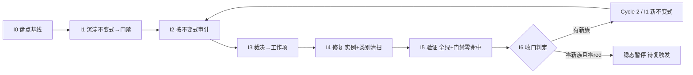

# AI Engine 不变式驱动的持续审计闭环（AI Engine Invariant-Driven Continuous Audit Loop）

> Last Updated: 2026-08-11
> 产出方法：`docs/skills/roadmap-and-mission-authoring-with-consensus-review.md`（诊断→选型→拟制→共识审查）；经 2 轮独立 fresh session 审查至共识（Round 1 revised → 修正 → Round 2 approved）
> 驱动方：`missions/ai-invariant-loop.json`（范围：`packages/flux-renderers-ai/` engine + adapters；授权/commitFormat/Loop Rule 见该 mission description）
> 先例与诊断依据：AI 模块 4 轮 open/multi audit（`docs/audits/2026-07-2*-ai.md`、`2026-07-25-0*-ai.md`）+ C8.1/C8.2/C8.3 逐组件卡 + post-closure；诊断结论见 `docs/logs/2026/08-08.md`
> 关联：本图为独立 roadmap（聚焦 AI engine 不变式闭环），与 `docs/backlog/component-audit-round2-roadmap.md` 范围不重叠（round-2 覆盖 host 大面 + P3 裁决 + 通用回扫；本图专注 AI engine 的不变式沉淀与防回退）。如后续需在 round-2 建立指向本图的 work item，按 round-2 的 Rule 走人工确认 + 共识审查。

## 目的

AI engine 已被审计 4 轮 + 逐组件卡 + post-closure（全仓最多）。每轮都在**同一家族的新路径**上发现缺陷——但**这些缺陷最终都被修了**（live code 已含 `deleteConversation` 的 `activeIdRef`、`clearAll` 的 storage 路径、`create-engine` 的 controller 身份守卫，见「当前基线」）。问题不是"缺陷修不掉"，而是**"每族都要历经多轮审计才完整捕获全部兄弟实例"**：

- **并发守卫族**历经 Bug 07（原始缺陷）→ AI-01（send 入口加 `isProcessing`，**修复不全**）→ 1757（发现 finally/catch 未做 controller 身份守卫的残留）**三次审计**才完整修复；
- **stale-closure 族**：P1-3 修了 `switchConversation` 加 `activeIdRef`，0707 才发现 `deleteConversation` 漏改（"same family, missed method"）；
- **storage 静默丢族**：P1-2 修了 `create`/`rename` 经 `reportStorageError`，0707-open 才发现 `clearAll` 完全无 delete 路径（"precise inverse"）。

根因 = **"修实例不修类别"** + **反应式测试（per-bug）非穷举** + **零 engine 不变式门禁**（renderer 包有 `check:audit-event-dispatch-ctx`，engine 无等价物）。下次重构或新增方法，同族缺陷会**再次回归**——因为没有可执行契约拦住。

本路线图把修-漏-再修的循环**改造为自驱动飞轮**：把已知失败模式**沉淀为可执行不变式门禁**（入 CI，回归自动被抓）→ 按不变式**确定性审计**全部方法（找违背）→ 裁决成工作项 → 修复（强制实例+类别清扫+测试）→ 新失败类再沉淀为新不变式。门禁集合**单调增长（棘轮）**，覆盖面随每轮扩大；整轮零新发现则进稳态，CI 变红或周期复探再触发。

## Loop Design（循环方法论，非 phase）

每个 Cycle 固定 7 步，I0 仅 Cycle 1 有：

```
I0 盘点基线 → I1 沉淀不变式(→门禁) → I2 按不变式审计(跑门禁+对抗探查) → I3 裁决→工作项
   → I4 修复(实例+类别清扫+测试) → I5 验证(全绿+门禁零命中) → I6 收口(新失败类?→下轮 I1; 否则稳态)
```

- **自动化边界**：I1/I2/I5 的门禁部分完全自动化（CI 连续跑）；I2 的对抗探查 + I3 裁决为半自动（每轮一次）；I4 修复预授权 P0/P1 自动执行（同 component-audit 纪律）；I3 新工作项 + I6 稳态判定按 Loop Rule 自动派生（预授权），不逐次人工重启。
- **棘轮规则**：不变式门禁只增不减；弱化/豁免任一不变式需人工确认并留痕（对齐 round-1 门禁纪律）。
- **稳态与复触发**：一轮 I2 零新违背且零新不变式类 → 循环暂停；触发复跑的条件：① CI 任一 engine 不变式门禁变红；② `packages/flux-renderers-ai/src/engine/` 或 `src/adapters/use-conversation*` 发生结构变更（git 监控，可选 hook）；③ 周期复探（默认每 major release 或季度，取早）。

## Work Item Status

> 唯一动态状态区。Cycle 1：I0-I6 已全 `✅`（**Cycle 1 完整闭环**；I6 收口见 plan `docs/plans/2026-08-09-2229-1-cycle1-i6-closure-and-cycle2-derivation.md` completed + 独立 closure-audit 通过 + daily log `docs/logs/2026/08-09.md`）。**Cycle 2 / I1 已 `✅`（2026-08-09，plan `docs/plans/2026-08-09-2229-2-cycle2-i1-invariant-sedimentation.md` completed + 独立 closure-audit approved（task `ses_018c671deffeNRcdOSIGlhc6au`）+ 收口记录 daily log `docs/logs/2026/08-09.md`）**。**Cycle 2 / I2 已 `✅`（2026-08-09，plan `docs/plans/2026-08-09-2229-3-cycle2-i2-invariant-driven-audit.md` completed + 独立 closure-audit 通过 + 收口记录 daily log `docs/logs/2026/08-09.md`）**。**Cycle 2 / I3 已 `✅`（2026-08-10，plan `docs/plans/2026-08-10-0925-1-cycle2-i3-adjudication.md` completed + 独立 closure-audit approved（task `ses_0169d8d24ffeDTTOPuuZScDiZl`，fresh session）+ 收口记录 daily log `docs/logs/2026/08-10.md`；交付物：`docs/audits/ai-invariants/cycle2-adjudication.md` 零悬挂 21 条目 = K 13（P0 ×3 + P1 ×10 → 路由 Cycle 2 / I4 附门禁补强契约）+ 注册红清零契约（⑥×3 + ⑧×1）+ N 零（不派生 Cycle 3）+ W 8 维持（W-E/W-⑨-b 附 I4 附带评估注记）；P2/P3 零项）**。**Cycle 2 / I4 已 `✅`（2026-08-10，plan `docs/plans/2026-08-10-0925-2-cycle2-i4-fix-execution.md` completed + 独立 closure-audit PASS_WITH_MINORS（task `ses_01664036affeTCJhM9FDtO59oV`，fresh session，零 Blocker/Major；2 Minor 已就地修复）+ 收口记录 daily log `docs/logs/2026/08-10.md`；交付物：13 条 K 全部修复（test-first 先红后绿）+ 注册红清零（`check:ai-engine-invariants` live 零命中）+ 门禁 ⑥⑦⑨⑩②④ 补强（12 处 `it.fails` 全量翻转 + `scanMirrorWriteSurface` 新规则 + committed 回归追加）+ 类别清扫总表（A-E 五族）+ bug notes 125-130 + W-E 维持/W-⑨-b 收敛评估回写）**。**Cycle 2 / I5 已 `✅`（2026-08-10，plan `docs/plans/2026-08-10-0925-3-cycle2-i5-verification.md` completed + 独立 closure-audit 通过 + 收口记录 daily log `docs/logs/2026/08-10.md`；交付物：full-green 基线——typecheck/build/lint 37/37 ×3 + `pnpm test` 66/66 tasks 37 包 12,536 passed/0 failed（AI 包 69 files/572 tests）+ `pnpm test:scripts` 8 files/41 tests（含 css-exports stale literal 19→22 同步）+ `check:ai-engine-invariants` exit 0 零命中（注册红 ⑥×3+⑧×1 清零确认）+ `pnpm check` 仅既有登记 red 零新增 + AI 面 e2e 13 文件 47 passed/0 failed/0 skipped；full-green 口径 = 全量单测 + AI 面 e2e，全仓 e2e 3 条 watch-only failed（gantt-perf ×2 + kanban-perf ×1）为登记终态不属反例）**。**Cycle 2 / I6 已 `✅`（2026-08-10，plan `docs/plans/2026-08-10-1154-1-cycle2-i6-closure-and-steady-state-determination.md` 收口执行 + 独立 closure-audit 引用（task id 见该 plan Closure 节，fresh session）+ 收口记录 daily log `docs/logs/2026/08-10.md`；交付物：Cycle 2 统计落档（门禁 5 条 ⑥-⑩ + I4 补强 / red list 4 注册命中 → 清零 → 零命中 / 新族 N=零）+ watch-only 复核 7 条维持（W-E / W-⑨-a/c + W1-W4，W-⑨-b 收敛移除核销）+ **稳态判定：N=零 + red list 零 ⇒ 标记「稳态暂停」** + 复触发条件三选一登记（CI 门禁变红 / engine·use-conversation 结构变更 / 周期复探）+ Follow-up Backlog 同步（watch-only 清单修正新 3 条））**。**Cycle 2 完整闭环：I1-I6 全 `✅`（2026-08-09/10）**，**稳态暂停**——复触发条件三选一（① CI 任一 engine 不变式门禁变红；② `packages/flux-renderers-ai/src/engine/` 或 `src/adapters/use-conversation*` 结构变更（新增/重命名变更型方法）；③ 周期复探——每 major release 或季度取早）。复触发时按 Loop Rule 自动派生 Cycle 3 / I2（直接审计，跳过 I1，因门禁已存在），不需人工重开。

| Work Item                                            | 交付范围                                                                                                                                                                                                                                                                                                                                                                                                                                                                                                                                                                                                                                                                                                                                                                                                                                                              | 状态                                                                                                                                                                                                                                                                                                                                                                                                                                                                                                                                                                                                                                                                                                                                                                                                      | Owner Doc                                                                                                        | 依赖         |
| ---------------------------------------------------- | --------------------------------------------------------------------------------------------------------------------------------------------------------------------------------------------------------------------------------------------------------------------------------------------------------------------------------------------------------------------------------------------------------------------------------------------------------------------------------------------------------------------------------------------------------------------------------------------------------------------------------------------------------------------------------------------------------------------------------------------------------------------------------------------------------------------------------------------------------------------- | --------------------------------------------------------------------------------------------------------------------------------------------------------------------------------------------------------------------------------------------------------------------------------------------------------------------------------------------------------------------------------------------------------------------------------------------------------------------------------------------------------------------------------------------------------------------------------------------------------------------------------------------------------------------------------------------------------------------------------------------------------------------------------------------------------- | ---------------------------------------------------------------------------------------------------------------- | ------------ | ---------------------------------------------------------------------------------------------------------------------------------------------------------------------------------------------------------------------------------------------------------------------------------------------------------------------------------------------------------------------------------------------------------------------------------------------------------------------------------------------------------------------------------------------------------------------------------------------------------------------------------------------------------------------------------------------------------------------------------------------------------------------------------------------------------------------------------------------------------------------------------------------------------------------------------------------------------------------------------------------------------------------------------------------------------------------------------------------------------------------------------------------------------------------------------------------------------------------------------------------------------------------------------------------------------------------------- |
| Cycle 1 / I0. 不变式盘点与基线                       | 从 4 轮审计 + post-closure 提取已知失败模式族 → 不变式目录（`docs/audits/ai-invariants/invariant-catalog.md`，每条：不变式陈述、覆盖的失败族、历史 bug 证据、检测方法）；确认基线 = 当前零 engine 不变式门禁（`scripts/` 无 engine 相关 check）；枚举全部变更型方法（异步：send/sendMessage/abort/regenerate 等；同步变更：clear/setMessages 等；adapter：delete/switch/create/rename/clearAll）作为审计目标集                                                                                                                                                                                                                                                                                                                                                                                                                                                        | `✅`（2026-08-09）                                                                                                                                                                                                                                                                                                                                                                                                                                                                                                                                                                                                                                                                                                                                                                                        | docs/components/flux-renderers-ai/engine.md                                                                      | —            | （执行证据：plan `docs/plans/2026-08-09-1826-1-i0-invariant-inventory-baseline.md` completed + 两轮独立 closure-audit 均 PASS（`ses_019d97306ffeV5Nmu4WX3SyXSB` + `ses_019d61aa6ffe7PDTA69j8vwfwg`，fresh session）；交付物：`docs/audits/ai-invariants/invariant-catalog.md`（153 行：零门禁基线确认 + 5 条首批不变式 ×4 字段 + 三大族已修复逐行核对 + Cycle 2+ 候选族登记 + 目标集 12 变更方法 + 5 白名单 + runTurn/边界裁定 + 零 diff proof）；目标集 × live 类型交叉验证零 diff（脚本 + 运行时 Object.keys 双保险））                                                                                                                                                                                                                                                                                                                                                                                                                                                                                                                                                                                                                                                                                                                                                                                                    |
| Cycle 1 / I1. 不变式沉淀（第一批门禁）               | 将首批 5 类不变式落为**参数化穷举测试 + 门禁脚本**（方法表驱动）：① 变更型方法入口检查 `isProcessing`（异步族）；② `await` 后状态读取用 `activeIdRef`/`versionRef`（非闭包捕获）；③ catch/finally 的 controller 写入做身份守卫；④ storage 变更经 `reportStorageError`；⑤ abort 路径清理 controller。**表完备性门禁**：断言测试表方法集 == engine/adapter 公共变更方法集（从 `MessageEngine`/`UseConversationReturn` 类型反查），新增方法不入表即门禁红（防新方法静默成盲区）。门禁入 `pnpm check`（`check:ai-engine-invariants`）+ `scripts/__tests__/` committed 回归；落 `docs/audits/ai-invariants/gates.md`                                                                                                                                                                                                                                                       | `✅`（2026-08-09）                                                                                                                                                                                                                                                                                                                                                                                                                                                                                                                                                                                                                                                                                                                                                                                        | engine.md §invariants（本 plan 补写）                                                                            | I0           | （执行证据：plan `docs/plans/2026-08-09-1826-2-i1-invariant-gate-sedimentation.md` completed + 独立 closure-audit PASS_WITH_MINOR（`ses_019c50670ffeVYwPu3hesmn0GD`，fresh session，零 blocker/major；1 minor 为既有 CSS-export 测试 stale literal，非本 plan scope）；交付物：`engine-invariants.test.ts`（12 tests：①③⑤ 参数化穷举 + 表完备性门禁运行时枚举 + PROOF）+ `conversation-invariants.test.ts`（10 tests：②④⑤ + 表完备性 + PROOF）22/22 全绿；`scripts/audit/find-ai-engine-invariant-violations.mjs`（②③④ 静态扫描器）live 扫描零命中；`check:ai-engine-invariants` 入 `pnpm check` 链；`scripts/__tests__/find-ai-engine-invariant-violations.test.ts` committed 回归 4/4；`docs/audits/ai-invariants/gates.md` 门禁清单（棘轮登记处）；`engine.md` §Invariants；`pnpm --filter @nop-chaos/flux-renderers-ai test` 536/536 全绿零回归）                                                                                                                                                                                                                                                                                                                                                                                                                                                                        |
| Cycle 1 / I2. 不变式驱动审计                         | ① 跑 I1 门禁跨全部方法 → red list（确定性，自动化）；② 对抗式探查（`docs/skills/open-ended-adversarial-review-prompt.md`）针对「门禁尚未表达」的失效路径（新交错组合、refactor 引入的新方法）；③ 对照不变式目录标注每条发现属于已知族（门禁漏覆盖）还是新族（需新增不变式）                                                                                                                                                                                                                                                                                                                                                                                                                                                                                                                                                                                           | `✅`（2026-08-09）                                                                                                                                                                                                                                                                                                                                                                                                                                                                                                                                                                                                                                                                                                                                                                                        | docs/skills/open-ended-adversarial-review-prompt.md                                                              | I1           | （执行证据：plan `docs/plans/2026-08-09-1826-3-i2-invariant-driven-audit.md` completed + 独立 closure-audit PASS（`ses_0199e90acffektDg63TggLe6ys`，fresh session，零 blocker/major）；交付物：`docs/audits/ai-invariants/cycle1-findings.md`（空 red list 零命中验证——`check:ai-engine-invariants` exit 0 + AI 包 536/536 全绿 + `pnpm check` 仅既有登记 red；12×5 覆盖矩阵含 runTurn 间接行；已知族 K1-K4 门禁漏覆盖 → I3 补门禁：③ 成功路径身份守卫缺失 / ⑤ abort 不强制终结 generator / ④ storage save-after-delete ghost / ② rename sync 闭包读取；新族 N1-N5 触发证据齐备 → Cycle 2 派生：active 提升位移完整性（5 成员复现）/ bootstrap 列表覆盖 / branch 戳泄漏（候选族触发）/ plugin 错误隔离（候选族触发）/ 失败轮残留污染；watch-only W1-W4 + 未触发候选族登记）；双轮对抗探查记录 `docs/analysis/2026-08-09-i2-cycle1-adversarial-probe/round-01-executor.md` + `round-02-independent.md`（14 项 RED 复现全部经临时 vitest 验证后清除，工作区零残留））                                                                                                                                                                                                                                                                                                                                                          |
| Cycle 1 / I3. 发现裁决与工作项拟制                   | red list 逐条裁决（P0/P1/P2/P3，对齐 checklist v2 裁决表）→ P0/P1 派为本 Cycle I4 修复项；**新族**派为 Cycle 2 / I1 新不变式项（按 Loop Rule 自动派生）；P2/P3 入本图 Follow-up Backlog；裁决表 `docs/audits/ai-invariants/cycle1-adjudication.md`（零悬挂）                                                                                                                                                                                                                                                                                                                                                                                                                                                                                                                                                                                                          | `✅`（2026-08-09）                                                                                                                                                                                                                                                                                                                                                                                                                                                                                                                                                                                                                                                                                                                                                                                        | cr-inventory-adjudication.md 先例                                                                                | I2           | （执行证据：plan `docs/plans/2026-08-09-2007-1-cycle1-i3-adjudication.md` completed + 独立 closure-audit APPROVED（`ses_0198191d3ffeSD37970JCqZSmi`，fresh session，零 blocker/major；2 条 non-blocking 观察：Exit Criterion 措辞先于翻转、log 门禁编号 off-by-one 已修）；交付物：`docs/audits/ai-invariants/cycle1-adjudication.md`（零悬挂 13 条目 = K1-K4 ×4 + N1-N5 ×5 + W1-W4 ×4，findings ↔ 裁决表逐条 ID 勾对；K1=P1/K2=P1/K3=P0/K4=P0 诚实判级附 checklist 依据 → 路由 I4 附门禁补强契约 ③/⑤/④/②；N1-N5 → Cycle 2 / I1 触发证据齐备（N3/N4 为登记候选族正式触发）；W1-W4 watch-only 复触发条件在案，W1 列 I4 附带收敛预期；零 P2/P3 项；§5 候选族按设计排除）；roadmap 动态状态区 + Follow-up Backlog 节同步（零 P2/P3 + W1-W4 watch-only 项））                                                                                                                                                                                                                                                                                                                                                                                                                                                                                                                                                                    |
| Cycle 1 / I4. 修复执行（实例 + 类别清扫 + 测试）     | 逐项修复：**强制类别清扫**（修任一方法必 grep 全部同类兄弟方法一并修，禁止只修报到的实例）+ test-first（先红后绿）+ 不变式门禁复跑零命中；三大族的历史案例（deleteConversation stale-closure、clearAll storage 路径、controller 身份守卫——**均已修复**）作为类别清扫的回归用例基线，I2 若发现新违背点纳入修复                                                                                                                                                                                                                                                                                                                                                                                                                                                                                                                                                         | `✅`（2026-08-09）                                                                                                                                                                                                                                                                                                                                                                                                                                                                                                                                                                                                                                                                                                                                                                                        | docs/bugs/00-bug-fix-note-writing-guide.md（复杂 bug 行内补写，编号接 round2 DB 之后，约 114+（live 最高 113）） | I3           | （执行证据：plan `docs/plans/2026-08-09-2007-2-cycle1-i4-fix-execution.md` completed + 独立 closure-audit PASS_WITH_MINORS（`ses_01951c859ffexp4FjJrOpeDWSP`，fresh session，零 blocker/major；3 minor：清扫总表行号漂移已加注 / closure 记账已填 / 全量断言由执行 session 复跑无相反证据）；交付物：K1 完成 mutate 身份守卫 + K2 abort 强制终结在途 generator（activeGenerator + 每迭代检查 + generator.return()）+ K3 pendingSavesRef 排空链（delete await 排空 / clearAll 链式排空 + detach 先于 abort）+ K4 rename/create conversationsRef 同步维护，全部 test-first 先红后绿（probe-A / signal-ignoring / probe-6 / probe-K4 场景在案）；门禁 ②③④⑤ 扩展落地（scanCompletionIdentityGuard + scanAdapterSyncClosureReads + 时序/强制终结运行时参数化测试 + committed 回归 6 用例）；类别清扫总表入档（A 终态写入 8 recipe / B generator 消费 / C storage 调用点 / D 列表闭包读取）；登记处同步（catalog §7/§8、gates.md、engine.md §Invariants + K2 契约违背 Failure Path、bug notes 121-124）；full-green：typecheck/build/lint 33/33、test 60/60（AI 包 66 files/542 tests）、test:scripts 36/36、check:ai-engine-invariants live 零命中、pnpm check 仅既有登记 red 零新增）                                                                                                                                            |
| Cycle 1 / I5. 全量验证与门禁零命中                   | `pnpm typecheck/build/lint` + `pnpm --filter @nop-chaos/flux-renderers-ai test` + `pnpm check`（含新 `check:ai-engine-invariants` 零命中）+ 相关 e2e；full-green 记录                                                                                                                                                                                                                                                                                                                                                                                                                                                                                                                                                                                                                                                                                                 | `✅`（2026-08-09）                                                                                                                                                                                                                                                                                                                                                                                                                                                                                                                                                                                                                                                                                                                                                                                        | docs/logs/                                                                                                       | I4           | （执行证据：plan `docs/plans/2026-08-09-2007-3-cycle1-i5-verification.md` completed + 本图 I5 全量验证 daily log `docs/logs/2026/08-09.md`（full-green 基线：typecheck/build/lint 33/33 ×3、`pnpm test` 60/60 tasks 12,246 passed/0 failed、AI 包 66 files/542 tests、`pnpm test:scripts` 8 files/36 tests、`check:ai-engine-invariants` exit 0 零命中、`pnpm check` 仅既有登记 red（industrial 6 hits + oversized locale 2 豁免）零新增、AI 面 e2e 13 文件 47 passed/0 failed/0 skipped；full-green 口径 = 全量单测 + AI 面 e2e，全仓 e2e 3 条 watch-only failed（gantt-perf ×2 + kanban-perf ×1）为登记终态不属反例）；commit 标题显式 `full-green verification`（AGENTS.md 纪律））                                                                                                                                                                                                                                                                                                                                                                                                                                                                                                                                                                                                                                       |
| Cycle 1 / I6. 循环收口与下一轮触发判定               | 统计本轮：新增不变式门禁数、red list 规模、新族数；判定 → 有新族：按 Loop Rule 派生 Cycle 2 / I1（新不变式沉淀）+ I2/I3，附触发证据回写本表；无新族且 red list 为零：标记「稳态暂停」，登记复触发条件；closure 由独立 fresh session 执行                                                                                                                                                                                                                                                                                                                                                                                                                                                                                                                                                                                                                              | `✅`（2026-08-09）                                                                                                                                                                                                                                                                                                                                                                                                                                                                                                                                                                                                                                                                                                                                                                                        | 本路线图「Loop Rule」                                                                                            | I5           | （执行证据：plan `docs/plans/2026-08-09-2229-1-cycle1-i6-closure-and-cycle2-derivation.md` completed + 独立 closure-audit 通过（见该 plan Closure 节，fresh session）+ 收口记录 daily log `docs/logs/2026/08-09.md`；交付物：Cycle 1 统计落档（门禁 5 类 + I4 扩展 / red list 0 / 新族 5）+ W1 实证复查（临时 vitest 3/3，维持 watch-only，findings §4 W1 行更新证据）+ 稳态判定（非稳态）+ Cycle 2 / I1 + I2 + I3 三行追加（附触发证据引用，行号按 cycle1 findings §3.2 原文）+ 动态状态区 + Follow-up Backlog 同步）                                                                                                                                                                                                                                                                                                                                                                                                                                                                                                                                                                                                                                                                                                                                                                                                       |
| Cycle 2 / I1. 不变式沉淀（第二批门禁）               | N1-N5 → 新不变式 ⑥-⑩ 落为**参数化穷举测试（`it.fails` 预期失败形态落库，套件保持全绿）+ 门禁脚本（静态规则 ⑥ `scanDisplacementVersionBumps` / ⑧ `scanBranchStampReset`，可行性 live 验证）+ 表完备性更新 + committed 回归**（修复归 Cycle 2 / I4）；**触发证据（findings §3.2 `文件:行` + adjudication §3 N 表不变式陈述；行号按 cycle1 findings §3.2 原文（2026-08-09 I2 时点））**：N1 active 位移完整性（`use-conversation.ts:293-346/:348-372/:390-423/:263-291`，5 成员 probe 全 RED）、N2 bootstrap 列表覆盖（`:221-229`，probe-2 RED）、N3 branch 戳泄漏（`create-engine.ts:100/:385/:542-566`，probe-3 RED，**登记候选族 branching/fork 触发**）、N4 plugin 错误隔离（`create-engine.ts:240-242/:324-341/:459-478/:350-352`，probe-4/probe-E RED，**登记候选族 plugin 生命周期触发**）、N5 失败轮残留污染（`create-engine.ts:459-478/:482-487`，probe-D RED） | `✅`（2026-08-09）                                                                                                                                                                                                                                                                                                                                                                                                                                                                                                                                                                                                                                                                                                                                                                                        | invariant-catalog.md §9 + gates.md + engine.md §Invariants                                                       | I6           | （执行证据：plan `docs/plans/2026-08-09-2229-2-cycle2-i1-invariant-sedimentation.md` completed + 独立 closure-audit approved（task `ses_018c671deffeNRcdOSIGlhc6au`，fresh session，零 blocker/major；2 minor 已就地修复）+ 收口记录 daily log `docs/logs/2026/08-09.md`；交付物：⑥-⑩ 五条不变式沉淀（catalog §9 四字段 ×5）——参数化穷举测试以 `it.fails` 预期失败形态落库（⑥×5 + ⑦×2 + ⑧泄漏×1 + ⑨×3 + ⑩排除×1 = 12 个 expected fail，⑧⑩ 消费/正常轮控制场景以普通 `it` 提交（live 即绿，it.fails 形式仅用于 live 违反成员，理由记录））+ 静态扫描器规则 ⑥ `scanDisplacementVersionBumps`（注册红 3：create/delete/clearAll）+ ⑧ `scanBranchStampReset`（静态可行性 live 验证通过——同闭包作用域；注册红 1：connector-missing 早退；isProcessing 入口早退豁免并记录理由）+ committed fixtures 39/39（⑥⑧ 违规/清洁 3 例新增）+ 表完备性零漂移（12 方法集）+ 登记处同步（gates.md ⑥-⑩ 五行 + 注册红节 / engine.md Cycle 2 节 + 已知违背面 Failure Path / catalog §9 / daily log）；套件全绿：typecheck/build/lint 33/33、test 60/60（AI 包 67 files / 544 passed + 12 expected fail）、test:scripts 39/39、check:ai-engine-invariants 4 注册命中（零未注册新增）、pnpm check 仅既有登记 red + 本 plan 注册红）                                                                                                                 |
| Cycle 2 / I2. 不变式驱动审计                         | 跑 ⑥-⑩ 门禁跨全部变更型方法 → **red list（预期 = Cycle 2 / I1 注册面：⑥ delete/clearAll/create ×3 + ⑧ connector-missing 早退 ×1，确定性确认零差异）** + 双轮对抗探查（执行轮 + 独立 fresh session 轮，聚焦 ⑥-⑩ 未表达盲区）+ W1-W4 复核（以 I6 复查结论为锚）→ `cycle2-findings.md` 零悬挂；**触发证据** = Cycle 2 / I1 注册面（N1-N5 → ⑥-⑩，findings §3.2 + adjudication §3 N 表，行号按 cycle1 findings §3.2 原文（2026-08-09 I2 时点））                                                                                                                                                                                                                                                                                                                                                                                                                           | `✅`（2026-08-09）                                                                                                                                                                                                                                                                                                                                                                                                                                                                                                                                                                                                                                                                                                                                                                                        | docs/skills/open-ended-adversarial-review-prompt.md（Cycle 1 先例）                                              | Cycle 2 / I1 | （执行证据：plan `docs/plans/2026-08-09-2229-3-cycle2-i2-invariant-driven-audit.md` completed + 独立 closure-audit 通过（见该 plan Closure 节，fresh session）+ 收口记录 daily log `docs/logs/2026/08-09.md`；交付物：`docs/audits/ai-invariants/cycle2-findings.md`（零悬挂）——red list 确定性确认（`check:ai-engine-invariants` 4 注册命中 = ⑥×3 + ⑧×1 与 Cycle 2 / I1 注册表零差异零未注册；AI 包 67 files / 544 passed + 12 expected fail；`pnpm check` 仅既有登记 red）；12×⑥-⑩ 覆盖矩阵零悬空格（uncovered=0）；已知族 K 13 条门禁漏覆盖 → I3 补门禁：K-⑩×5（abort-before-first-chunk 空残留进请求历史 / onBeforeRequest rejection loading 幽灵 / autoSave 持久化臂 / regenerate×失败销毁旧回答 / 零 chunk 成功轮）/ K-⑥×3（同 tick clearAll+create+delete 幽灵 activeId fixup / 同 tick delete+switch 提升已删目标 / bootstrap 选中 active 无引擎）/ K-⑦×1（bootstrap×clearAll 复活）/ K-K4/②×2（delete / clearAll 镜像写面）/ K-K3/④×1（create 元数据不入排空链）/ K-⑨×1（abort 变体 onTurnEnd rejection）；新族 N 零（不触发 Cycle 3 派生）；新 watch-only 4 条（W-E / W-⑨-a/b/c）+ Cycle 1 W1-W4 维持（I6 结论为锚）；双轮探查记录 `docs/analysis/2026-08-09-i2-cycle2-adversarial-probe/round-01-executor.md` + `round-02-independent.md`（7 项 RED + 6 项 RED 复现全部经临时 vitest 验证后清除，工作区零残留）） |
| Cycle 2 / I3. 发现裁决与工作项拟制                   | red list + 新发现逐条裁决（对齐 checklist v2 裁决表）→ P0/P1 派 Cycle 2 / I4；**新族 → Cycle 3 / I1（Loop Rule）**；裁决表 `cycle2-adjudication.md` 零悬挂；**触发证据** = `cycle2-findings.md`（Cycle 2 / I2 产出；派生时以 N1-N5 → ⑥-⑩ 注册面为锚，行号按 cycle1 findings §3.2 原文（2026-08-09 I2 时点））                                                                                                                                                                                                                                                                                                                                                                                                                                                                                                                                                         | `✅`（2026-08-10）                                                                                                                                                                                                                                                                                                                                                                                                                                                                                                                                                                                                                                                                                                                                                                                        | cr-inventory-adjudication.md 先例（Cycle 1 先例）                                                                | Cycle 2 / I2 | `✅`（2026-08-10；执行证据：plan `docs/plans/2026-08-10-0925-1-cycle2-i3-adjudication.md` completed + 独立 closure-audit approved（task `ses_0169d8d24ffeDTTOPuuZScDiZl`，fresh session）+ 收口记录 daily log `docs/logs/2026/08-10.md`；交付物：`docs/audits/ai-invariants/cycle2-adjudication.md` 零悬挂 21 条目 = K 13（P0 ×3：K-⑩-4 / K-K4/②-1 / K-K3/④-1 + P1 ×10 → 路由 Cycle 2 / I4 附门禁补强契约 ⑩五成员/⑥同 tick+bootstrap/⑦clearAll/②镜像写面/④create 元数据入排空链/⑨abort 变体 + §3.2 注册红清零契约 ⑥×3+⑧×1）+ N 零（不派生 Cycle 3，Loop Rule 路由空转）+ W 8 维持（W-E/W-⑨-b 附 I4 附带评估注记）；P2/P3 零项；roadmap I4/I5 两行按 Loop Rule 追加（触发证据在案））                                                                                                                                                                                                                                                                                                                                                                                                                                                                                                                                                                                                                                         |
| Cycle 2 / I4. 修复执行（实例 + 类别清扫 + 门禁补强） | 逐项修复 **13 条 K finding**（engine 6：K-⑩×5 + K-⑨×1；adapter 7：K-⑥×3 + K-⑦×1 + K-K4/②×2 + K-K3/④×1；**P0 ×3（K-⑩-4 / K-K4/②-1 / K-K3/④-1）+ P1 ×10**）+ **清零 4 个注册红**（⑥×3：create/delete/clearAll bump `switchVersionRef` + ⑧×1：connector-missing 早退清 `pendingBranchId`）+ 强制类别清扫（修任一方法必 grep 全部同类兄弟一并修）+ **门禁补强 ⑥⑦⑨⑩②④**（12 处 `it.fails` 翻转 `it` + 参数化测试扩展 + 扫描器规则保持 + committed 回归）——test-first 先红后绿，同步 invariant-catalog / gates.md / engine.md / bug notes 125+                                                                                                                                                                                                                                                                                                                              | `✅`（2026-08-10；plan `docs/plans/2026-08-10-0925-2-cycle2-i4-fix-execution.md` completed + 独立 closure-audit PASS_WITH_MINORS（task `ses_01664036affeTCJhM9FDtO59oV`，fresh session，零 Blocker/Major；2 Minor 文案就地修复）+ 收口记录 daily log `docs/logs/2026/08-10.md`）                                                                                                                                                                                                                                                                                                                                                                                                                                                                                                                          | engine.md §Invariants + gates.md + invariant-catalog.md + docs/bugs/（125+）                                     | Cycle 2 / I3 | （执行证据：13 条 K 全部修复（test-first 先红后绿，probe A/B/P3/P4/P6/C/C2/P7/F/D/P1/P2/P5 场景在案）+ 注册红清零（`check:ai-engine-invariants` live 零命中）+ 门禁补强（⑩ 空产物统一谓词 `isVacuousAssistantResidue`/commitOrDropResidue + ⑥ 同 tick 组合 + bootstrap build-on-demand + id-aware version guard + ⑦ clearAll 守卫 + ② 镜像写面 `scanMirrorWriteSurface` 新规则 + ④ 元数据排空链 + settlement 再校验 + ⑨ abort 变体 onTurnEnd 隔离）；12 处 `it.fails` 全量翻转全绿（AI 包 69 files / 572/572 零 expected fail）；类别清扫总表入档（A-E 五族）；登记处同步（catalog §10 supersede §7.3/§7.4 / gates.md / engine.md / bug notes 125-130 / cycle2-findings W-E 维持 + W-⑨-b 收敛移除））                                                                                                                                                                                                                                                                                                                                                                                                                                                                                                                                                                                                                        |
| Cycle 2 / I5. 全量验证与门禁零命中                   | `pnpm typecheck/build/lint` + `pnpm --filter @nop-chaos/flux-renderers-ai test`（12 `it.fails` 翻转后全绿）+ `pnpm check`（门禁补强后 `check:ai-engine-invariants` 零命中、注册红清零）+ 相关 e2e；full-green 记录（AI 面 e2e）；watch-only W-E/W-⑨-b 附带评估结论回写 findings §3.3                                                                                                                                                                                                                                                                                                                                                                                                                                                                                                                                                                                  | `✅`（2026-08-10；plan `docs/plans/2026-08-10-0925-3-cycle2-i5-verification.md` completed + 独立 closure-audit 通过（task id 见该 plan Closure 节，fresh session）+ 收口记录 daily log `docs/logs/2026/08-10.md`；执行证据：full-green 基线——typecheck/build/lint 37/37 ×3、`pnpm test` 66/66 tasks 37 包 12,536 passed/0 failed（AI 包 69 files/572 tests）、`pnpm test:scripts` 8 files/41 tests、`check:ai-engine-invariants` exit 0 零命中（注册红 ⑥×3 + ⑧×1 清零确认）、`pnpm check` 仅既有登记 red（industrial 6 hits + oversized locale 2 豁免）零新增、AI 面 e2e 13 文件 47 passed/0 failed/0 skipped；full-green 口径 = 全量单测 + AI 面 e2e，全仓 e2e 3 条 watch-only failed（gantt-perf ×2 + kanban-perf ×1）为登记终态不属反例；commit 标题显式 `full-green verification`（AGENTS.md 纪律）） | docs/logs/                                                                                                       | Cycle 2 / I4 | （触发证据（I3 派生）：`cycle2-adjudication.md` §6 路由摘要（13 条 K 全路由 I4 + 注册红清零契约 + watch-only 附带评估注记））                                                                                                                                                                                                                                                                                                                                                                                                                                                                                                                                                                                                                                                                                                                                                                                                                                                                                                                                                                                                                                                                                                                                                                                                |
| Cycle 2 / I6. 循环收口与下一轮触发判定               | 统计本轮（新增不变式门禁数 / red list 规模 / 新族数）+ watch-only 登记一致性复核（findings §3.3 + adjudication §3.4 + roadmap Follow-up Backlog 三处对照 + live 锚点抽查）+ 稳态判定（N=零 + red list 零 ⇒ 标记「稳态暂停」+ 登记复触发条件三选一）+ roadmap 同步（Work Item Status 追加本行 + 动态状态区 + Follow-up Backlog watch-only 清单修正 W-⑨-b 收敛移除）；意外发现新族 → 按 Loop Rule 派生 Cycle 3 / I1（附触发证据）；closure 由独立 fresh session 执行                                                                                                                                                                                                                                                                                                                                                                                                    | `✅`（2026-08-10；plan `docs/plans/2026-08-10-1154-1-cycle2-i6-closure-and-steady-state-determination.md` completed + 独立 closure-audit 通过（task `ses_01626c83cffeSAovJo71YMpiBM`，fresh session，G1-G8 全 PASS，1 Minor 非阻塞已就地处理）+ 收口记录 daily log `docs/logs/2026/08-10.md`；执行证据：Cycle 2 统计落档（门禁 5 条 ⑥-⑩ + I4 补强 12 处 `it.fails` 翻转 + `scanMirrorWriteSurface` / red list 4 注册命中 → I4 清零 → I5 零命中 + live 复跑 exit 0 / 新族 N=零）+ watch-only 复核 7 条维持（W-E / W-⑨-a/c + W1-W4，live 锚点实证；W-⑨-b 收敛移除核销）+ 稳态暂停标记 + 复触发条件三选一登记 + Follow-up Backlog 同步（watch-only 清单修正新 3 条））                                                                                                                                       | 本路线图「Loop Rule」                                                                                            | Cycle 2 / I5 | （触发证据（I3 派生）：`cycle2-adjudication.md` §3.3 N=零（Loop Rule 路由空转，不派生 Cycle 3）+ §3.4 watch-only 8 条维持 + I5 full-green 基线（daily log `docs/logs/2026/08-10.md`）；执行证据：本 plan 收口——稳态判定「稳态暂停」+ 复触发条件三选一 + roadmap 动态状态区/Follow-up Backlog 同步）                                                                                                                                                                                                                                                                                                                                                                                                                                                                                                                                                                                                                                                                                                                                                                                                                                                                                                                                                                                                                          |

## 框架/平台复用

| 类型                                           | 清单                                                                                                                                                                                                                                                           |
| ---------------------------------------------- | -------------------------------------------------------------------------------------------------------------------------------------------------------------------------------------------------------------------------------------------------------------- |
| 不变式来源（4 轮审计已证实的失败族）           | 并发守卫族（Bug 07 / AI-01 / 1757 abort-send race）、stale-closure 族（P1-3 switch / 0707 deleteConversation）、storage 静默丢族（P1-2 create-rename / 0707 clearAll）、controller 生命周期族（finally/catch 身份守卫缺失）、unmount-abort 族（F2.2 已修先例） |
| 既有 engine 测试（反应式，待升级为参数化穷举） | `engine/__tests__/engine-concurrency.test.ts`、`adapters/__tests__/use-conversation-{switch,delete-during-abort,clear-all}.test.ts`、`renderers/__tests__/ai-silent-drop-guards.test.tsx`                                                                      |
| 门禁基建                                       | `scripts/__tests__/` committed 回归先例、`pnpm check` 聚合、`scripts/audit/` 扫描器框架（shared.mjs/rules.mjs）                                                                                                                                                |
| 审计技能                                       | `docs/skills/open-ended-adversarial-review-prompt.md`（对抗探查）、`docs/skills/deep-audit-prompts.md`（维度 06 异步/19 状态/23 测试质量）                                                                                                                     |
| 先例                                           | round-1 `check:audit-event-dispatch-ctx`（renderer 包的等价物：一类模式落一个 check + committed 回归，基线零命中防回退）                                                                                                                                       |

## 当前基线

- 4 轮 audit + C8.1/8.2/8.3 + post-closure 已完成；AI 包 509+ 单测、typecheck/build/lint/test 全绿、`pnpm check` 零命中。
- **三大复发族的最终态均为「已修复」**（live code 实证）：①并发守卫族——`create-engine.ts:330/344/346/448/467` controller 身份守卫已落（标 `P1#1`）；②stale-closure 族——`use-conversation.ts:360` `deleteConversation` 用 `activeIdRef.current`、`:339` switchConversation eviction（标 `P1-a/P1-c`）；③storage 静默族——`clearAll` 走 storage fan-out + `reportStorageError`（标 `P1-b`）；回归测试 `use-conversation-clear-all.test.ts`/`-delete-during-abort.test.ts`/`engine-concurrency.test.ts` 均存在。
- **真正未解决的是「效率与防回退」**：①每族历经 2–3 轮审计才完整捕获全部兄弟实例（非一轮）；②修复是反应式 per-bug 测试，**无"枚举全部方法 × 全部不变式"的穷举契约**，新增/重构方法会再次成盲区；③**零 engine 不变式门禁**——`package.json` 28 项 `check:*` 无 engine/conversation 相关，`scripts/` 无对应扫描器（renderer 包有 `check:audit-event-dispatch-ctx`，engine 无等价物）。本图治的是这第三层。
- 变更型方法目标集（I0 复核补全）：engine 的 `sendMessage`/`send`/`runTurn`/`abort`/`regenerate`（异步）+ `clear`/`setMessages`（同步但变更状态）；adapter 的 `createConversation`/`renameConversation`/`deleteConversation`/`switchConversation`/`clearAll`。**注**：`send` 与 `sendMessage` 是两个独立公共入口（`create-engine.ts:172,185`，均入 `runTurn`），穷举须二者并列。

## Phase Details

### I0 — 不变式盘点与基线（仅 Cycle 1）

不变式目录 `docs/audits/ai-invariants/invariant-catalog.md`：每条不变式含「陈述 / 覆盖失败族 / 历史 bug 证据（`文件:行` 或 bug note）/ 检测方法（静态 grep pattern 或运行时断言）」。审计目标集 = engine 全部变更型方法（`sendMessage`/`send`/`runTurn`/`abort`/`regenerate` 异步 + `clear`/`setMessages` 同步变更）+ conversation adapter 全部变更方法（create/rename/delete/switch/clearAll）。确认基线（零门禁）落目录首页。**已知未覆盖族登记**（Cycle 1 首批 5 不变式之外，管理预期）：plugin 生命周期、tool-execution 并发、streaming backpressure、分支/fork（branching.ts）——列为「Cycle 2+ 候选不变式」，Cycle 1 不实现，I2 若触及则触发新族派生。

### I1 — 不变式沉淀（每 Cycle 一批门禁）

把不变式目录的条目落为：① 参数化穷举测试（方法表驱动，单文件 `engine/__tests__/engine-invariants.test.ts` + `adapters/__tests__/conversation-invariants.test.ts`）+ **表完备性门禁**（断言测试表方法集 == 从 `MessageEngine`/`UseConversationReturn` 类型反查的公共变更方法集，新增方法不入表即门禁红——防新方法静默成盲区，这正是要治的反应式盲区）；② 静态可 grep 的不变式补 `scripts/audit/` 扫描器 + `check:ai-engine-invariants` 门禁入 `pnpm check`；③ committed 回归测试（`scripts/__tests__/`）。engine.md 补「§invariants」节文档化。Cycle 1 首批 5 类（见 Work Item Status）；不变式①的 `isProcessing` 入口守卫仅适用于异步变更族（`sendMessage`/`send`/`runTurn`/`abort`/`regenerate`），`clear`/`setMessages` 为同步变更方法不适用该不变式但在目标集内供其他不变式覆盖。

### I2 — 不变式驱动审计

① 门禁跑全方法 → red list（自动化主体）；② 对抗探查聚焦「门禁未表达」的盲区（新交错、refactor 新增方法、跨方法组合状态）；③ 每条发现标注「已知族（门禁漏覆盖，补门禁）」或「新族（Cycle 2 新增不变式）」。

### I3 — 发现裁决与工作项拟制

red list → P0/P1 入本 Cycle I4；新族 → Cycle 2 / I1（Loop Rule 自动派生）；P2/P3 入 Follow-up Backlog。裁决表零悬挂。

### I4 — 修复执行

**类别清扫强制**：修任一方法时 grep 全部同类兄弟一并修（如修 switchConversation 的 ref 必同时核对 delete/create/rename/clearAll）；test-first 先红后绿；复杂 bug 行内补 bug note（编号接 round2 DB 之后）；门禁复跑零命中。

### I5 — 全量验证

typecheck/build/lint + AI 包 test + `pnpm check`（新门禁零命中）+ 相关 e2e；full-green 记 `docs/logs/`。

### I6 — 循环收口与下一轮触发判定

统计本轮新增门禁数 / red list / 新族数；有新族 → 派 Cycle 2（I1 新不变式 + I2 + I3，本表追加）；无新族且 red list 零 → 标「稳态暂停」+ 登记复触发条件（CI 变红 / 结构变更 / 周期复探）。closure 独立 fresh session。

## Dependency Graph



## Loop Rule（自动派生与稳态规则）

- **新族强制沉淀**：I2/I3 发现的任一"新失败类"（现有不变式目录未覆盖）→ I6 必须派生 Cycle N+1 / I1（新不变式沉淀），**AI 可自动追加该 work item**（预授权，类 round-1 CX-n 机制），追加时附「触发证据 = 发现 `文件:行` + 不变式陈述」回写本表。
- **棘轮**：已沉淀的不变式门禁只增不减；弱化/删除/豁免任一需人工确认 + 该 plan 内留痕 + committed 回归测试同步。
- **稳态暂停与复触发**：一轮零新族且 red list 零 → 标「稳态暂停」；复触发条件三选一：① CI 该门禁变红；② engine/use-conversation 结构变更（新增/重命名变更型方法）；③ 周期复探（默认每 major release 或季度，取早）。复触发时 AI 自动派生新 Cycle I2（直接审计，跳过 I1，因门禁已存在）。
- **类别清扫强制**：I4 修任一实例必须 grep 同类兄弟一并修；只修报到的实例 = 未完成（closure audit 拒绝）。
- **范围独立**：本图专注 AI engine 不变式沉淀与防回退，与 `docs/backlog/component-audit-round2-roadmap.md`（host 大面 + P3 裁决 + 通用回扫）范围不重叠；两图无相互 work item 引用（如需建立，按各图 Rule 走人工确认 + 共识审查）。

## Cross-Cutting

- **授权**：AI 包不在 Protected Areas 表，默认 `implement`；engine/adapter 修复预授权 P0/P1 自动（同 component-audit）；结构性重构（engine 公共 API、adapter 契约）执行前人工确认；新不变式门禁入 `pnpm check` 视为 check 脚本变更，需 committed 回归测试（对齐既有门禁纪律）。
- **可推广性**：本方法论（沉淀→审计→裁决→修→验→新沉淀）适用于任何有状态子系统；本轮 scope 限 AI engine，flow-designer 事务/undo 等待其专属审计有结论后另立 successor loop（不在本图）。
- **记录持久化**：每 Cycle 的 I6 产出追加本图 Work Item Status + `docs/audits/ai-invariants/cycle{N}-adjudication.md`；门禁清单 `docs/audits/ai-invariants/gates.md` 单调追加。
- **提交纪律**：closure 通过后按 `fix(ai-invariant-loop): <description>` 提交；full-green 必须在 commit 标题显式声明。

## Rule

- 本路线图状态仅由 plan 生命周期 + Loop Rule 自动派生驱动。
- work item = 一个 plan；Cycle = 一轮完整 7 步（I0 仅 Cycle 1）。
- 审计记录入 `docs/audits/ai-invariants/`，本文件只维护 Work Item Status + Loop Rule + Follow-up Backlog，不维护第二动态块。
- AI 不重排既有 work item 优先级；**Loop Rule 派生的下一 Cycle work item 是唯一允许的自动新增路径**（附触发证据），其他新增需人工确认。
- 每个 work item plan 遵循 `docs/plans/00-plan-authoring-and-execution-guide.md`，Test Strategy = "Must automate"（不变式门禁本身即测试）。
- **类别清扫不可豁免**：I4 只修实例不修类别 = closure 拒绝（这是本图存在的全部意义）。

## Follow-up Backlog

（Cycle 1 I3 产出后填充：P2/P3 项 + 稳态期 watch-only 项）

- **Cycle 1 I3 填充（2026-08-09）**：零 P2/P3 项（裁决表 `cycle1-adjudication.md` §4：findings 13 条目全部落入 K1-K4 → I4 / N1-N5 → Cycle 2 / I1 / W1-W4 → watch-only 三态，无条目落入 P2/P3 区间）。
- **稳态期 watch-only 项**：W1-W4（findings §4 复触发条件登记在案）。
- **I6 复查同步（2026-08-09）**：**W1 维持 watch-only**——I6 临时 vitest 实证复跑 3/3：K2 已收敛 generator 残留面（陈旧轮 unwind 后 finally 身份守卫归 null controller），abort→(clear|setMessages)→再 abort 的 controller/processingState 残留窗口**仍在**（二次 abort 仍把 idle clobber 回 'aborted'）→ 不满足移除条件，复触发条件证据已更新至 `cycle1-findings.md` §4 W1 行；**W2-W4 维持登记**（复触发条件已在 findings §4 逐条登记，本轮不重开；Successor Path 均为（无需），已按 plan `2026-08-09-2229-1` Deferred 块补键）。
- **Cycle 2 I3 填充（2026-08-10）**：零 P2/P3 项（裁决表 `cycle2-adjudication.md` §4：findings 21 条目全部落入 K 13（P0 ×3 + P1 ×10 → Cycle 2 / I4）/ N=零（Loop Rule 路由空转）/ watch-only 8 三态，无条目落入 P2/P3 区间）→ 无 P2/P3 填充项。
- **稳态期 watch-only 项（2026-08-10 更新）**：新 3 条 **W-E / W-⑨-a/c**（findings §3.3 复触发条件登记在案；**W-⑨-b 已随 K-⑥-3 修复自然收敛移除**，findings §3.3 2026-08-10 更新注记）+ **W1-W4 维持**（findings §4 + I6 复查结论为锚）；W-E 注「I4 附带评估不收敛」——`onAfterRequest` 仍在空产物 drop 前触发（`:531-532` 无条件调用，修复仅 drop 空产物未重排 hook 面），维持登记。
- **I6 同步（2026-08-10，plan `docs/plans/2026-08-10-1154-1-cycle2-i6-closure-and-steady-state-determination.md`）**：watch-only 复核 = **7 条登记**（W-E / W-⑨-a / W-⑨-c + W1-W4 全部维持，live 锚点抽查实证；W-⑨-b 收敛移除核销）；Cycle 2 判定 **N=零 + red list 零 ⇒ 稳态暂停**，复触发条件三选一（① CI 任一 engine 不变式门禁变红；② `packages/flux-renderers-ai/src/engine/` 或 `src/adapters/use-conversation*` 结构变更（新增/重命名变更型方法）；③ 周期复探——每 major release 或季度取早），复触发时按 Loop Rule 自动派生 Cycle 3 / I2（直接审计，跳过 I1）。
- **2026-08-09-1826 双审计 P2 填充（2026-08-10，mission-driver 起草轮）**：两审计 `Audit Status: open → planned`（P1 已路由 `docs/plans/2026-08-10-1301-1-engine-adapter-p1-remediation.md` + `2026-08-10-1301-2-renderer-bubble-p1-remediation.md`）。**26 条 P2 全部入本 backlog（带源审计路径）**：
  - **P2 路由注记（2026-08-10，mission-driver 起草轮，plan 审查通过转 active）**：25 条活跃 P2 已路由三 plan（P2-14 维持 watch-only 不路由）：engine/adapter 族 6 条（multi P2-1/P2-2/P2-7 + open P2-1/P2-2/P2-6）→ `docs/plans/2026-08-10-1606-1-engine-adapter-p2-remediation.md`；renderer/UI 族 9 条（multi P2-3/P2-4/P2-6/P2-8/P2-9/P2-17/P2-18 + open P2-7/P2-8）→ `docs/plans/2026-08-10-1606-2-renderer-ui-p2-remediation.md`；契约/文档族 10 条（multi P2-5/P2-10/P2-11/P2-12/P2-13/P2-15/P2-16 + open P2-3/P2-4/P2-5）→ `docs/plans/2026-08-10-1606-3-ai-contract-doc-truthfulness-remediation.md`；三 plan 均经独立 fresh-session review 达成共识（零 Blocker/Major），执行序 1→2→3。
  - **P2 路由收口注记（2026-08-10，plan `2026-08-10-1606-1` 完成）**：engine/adapter 族 6 条 P2 全部修复落地——multi P2-1（branch 戳 break/throw 残留，⑧ 门禁扩面：扫描器 return/break/catch 三规则 + 运行时成员 +3）/ multi P2-2（unmount detach-before-abort + pendingSavesRef 卸载清空）/ multi P2-7（bootstrap storageRef 镜像）/ open P2-1（connector fan-out 自建 engine 全量）/ open P2-2（createEngineOptions Omit 收窄 `'connector' | 'engine'`）/ open P2-6（O-2 注释重写真实 streaming 语义）；bug notes 137-139；AI 包 70 files/620 tests 全绿 + `check:ai-engine-invariants` 扩面后零命中。
  - **P2 路由收口注记（2026-08-10，plan `2026-08-10-1606-2` 完成）**：renderer/UI 族 9 条 P2 全部修复落地——multi P2-3（tiptap 零匹配键盘死区放行 + `popupItemsLengthRef` 镜像）/ multi P2-4（onApproval 全链线程到气泡路径，HITL 审批默认气泡路径可达）/ multi P2-6（voice in-flight ref 守卫 + 三处清位）/ multi P2-8（engineNullSwitch 窗口期双绑定面显式 null engine 显式拒绝）/ multi P2-9（autoScroll 核心行为 3 断言，RED 实证非"删掉也绿"）/ multi P2-17（aria-current）/ multi P2-18（编辑态 Textarea accessible name）/ open P2-7（`actions: []` 显式空 → 无操作栏，方案 A）/ open P2-8（citation 索引上限 ≤64，年份误报消除）；bug notes 140-143；AI 包 74 files/641 tests 全绿 + `check:ai-engine-invariants` 零命中 + typecheck/build/lint 37/37 + test 66/66。
  - **P2 路由收口注记（2026-08-10，plan `2026-08-10-1606-3` 完成）**：契约/文档族 10 条 P2 全部治理落地——multi P2-5（9 交互型渲染器消费 `meta.disabled` + `AiSenderExtensionProps.disabled` 接线，裁定表入档）+ open P2-3（autofocus 死字段 drop，schemas/registry/6 处文档面全移除，grep 仅剩豁免面）+ open P2-4（handleUpload 收敛 `buildImageContentParts` 单份组装）+ open P2-5（clone try/catch 降级浅拷贝，DataCloneError 崩溃面消除）+ multi P2-15（dompurify peer+dev 双移除，净化委托 content 包）+ multi P2-10/11/12/13（engine.md §8.1 12 方法 / §8.5+§9.5 9 字段 / §8.6 6 字段 / §9.3+§9.4 实际路径与函数名，活动文档死名 grep 清零）+ multi P2-16（catalog/gates 锚点 18 行对照表校准 + 时点注记）；bug notes 144-146；AI 包 76 files/659 tests 全绿 + `check:ai-engine-invariants` 零命中 + typecheck/build/lint 37/37 + test 66/66。
  - **P1 路由收口注记（2026-08-10，plan `2026-08-10-1301-1` 完成）**：engine/adapter 族 6 条 P1（P1-1/P1-2/P1-3/P1-4/P1-5 + open P1-1）全部修复落地 + 门禁 ⑩ dangling 成员 / ⑪ 新族 / ④ fan-out 源成员（`check:ai-engine-invariants` 零命中）；两审计 `Audit Status → closed`；renderer 族 P1-6/7/8/9 由 `2026-08-10-1301-2` 独立 closure surface 跟踪。
  - **P1 路由收口注记（2026-08-10，plan `2026-08-10-1301-2` 完成）**：renderer/bubble 族 4 条 P1（P1-6 投影 engine 替换刷新 / P1-7 工具卡展开 + P1-8 reasoning 面板（同根族，方案 A undefined-absent）/ P1-9 混合消息消息级并行渲染）全部修复落地（AI 包 70 files/612 tests 全绿 + bug notes 134-136）；P2-14 幽灵窗口随 P1-6 投影重建触发扩展顺带覆盖（zero-chunk abort 测试实证投影终态零 vacuous placeholder），维持 watch-only 登记；源审计状态已 closed 幂等跳过。
  - **multi-audit（源：`docs/audits/2026-08-09-1826-multi-audit-ai-invariant-loop.md`）18 条**：
    - P2-1 `pendingBranchId` 残留被无关 turn 消费（create-engine.ts:262,427-432,649-672；建议扩展 ⑧ 门禁 break/throw 路径）
    - P2-2 unmount 清理顺序与 clearAll detach-before-abort 不变式相反（use-conversation.ts:357-369）
    - P2-3 slash/mention 弹出层零匹配键盘死区 + 注释与实现矛盾（tiptap-sender.tsx:224-249,332-335,370-394）
    - P2-4 FallbackToolCallCard 未透传 onApproval，HITL 审批在默认气泡路径结构性不可达（ai-tool-call.tsx:198-216,312-320；tools.tsx:43-51；types.ts:55-64）
    - P2-5 全部 14 个 AI 渲染器未消费 schema `disabled` + `AiSenderExtensionProps.disabled` 死契约字段（ai-sender.tsx:124-142,214-246；schemas.ts:167-199）
    - P2-6 ai-voice-input 同 tick 双击麦克风双重识别实例（ai-voice-input.tsx:147-230）
    - P2-7 useConversation bootstrap effect 依赖不稳定 `storage` 引用逐 render 重跑 loadConversations（use-conversation.ts:297-348）
    - P2-8 engineNullSwitch 窗口期 component handle / action provider 绑定到被隐藏自建 engine（ai-chat.tsx:118-144,189-199；use-message.ts:87-88）
    - P2-9 useAutoScroll 核心行为（trigger 滚底 + scrollToBottom）零测试断言（use-auto-scroll.ts:42-58；phase5-deepening.test.tsx:66-112）
    - P2-10 engine.md §8.1 MessageEngine 接口清单缺 `setMessageEditing`，"共 11 个方法"计数过期（engine.md:106-151 vs types.ts:287-335）
    - P2-11 engine.md §8.5/§9.5 `UseMessageOptions` 接口列表过时（3 vs 9 字段）且与同节正文自相矛盾（engine.md:206-211,421-427 vs use-message.ts:14-41）
    - P2-12 engine.md §8.6 `UseConversationOptions` 缺 `initialConversations` 与 `onStorageError`（engine.md:251-257 vs use-conversation.ts:16-31）
    - P2-13 engine.md §9.3 示例文件路径与函数名不存在（engine.md:354-357,404-405；实际 `apps/playground/src/ai/openai-connector.ts` `createOpenAICompatibleConnector`）
    - P2-14 ai-chat 投影克隆 abort 同步翻转窗口可捕获空产物幽灵（K-⑩ 三落地面缺第四面；ai-chat.tsx:244-250；create-engine.ts:605-626）——**同面附注**：`docs/plans/2026-08-10-1301-2` Phase 3（投影重建触发扩展）顺带覆盖评估
    - P2-15 dompurify 非可选 peerDependency + devDependency，包内零引用（package.json:36,57）
    - P2-16 invariant-catalog / gates.md 记录 live 行号在 Cycle 2 / I4 后系统性漂移（catalog:33,43,52,63,73,82-86,109-122,190-218；gates.md:52-53）
    - P2-17 ai-conversations 当前会话缺 `aria-current`（ai-conversations.tsx:70-78）
    - P2-18 user-edit 编辑态 Textarea 无 accessible name（user-edit.tsx:81-87）
  - **open-audit（源：`docs/audits/2026-08-09-1826-open-audit-ai-invariant-loop.md`）8 条**：
    - P2-1 useConversation-built engines 永不 sync 变更的 `connector`（use-conversation.ts:84-87,168-183；2151 hot-swap 族新成员）
    - P2-2 `createEngineOptions` type 允许 `engine` 但 `buildEngine` 静默丢弃（use-conversation.ts:18,168-183）
    - P2-3 `autofocus` 死契约字段（schemas.ts:23,132；ai-renderer-definitions.ts:55,122）
    - P2-4 `buildImageContentParts` 死模块级导出 + 真实 send 路径重复内联逻辑（ai-attachments.tsx:373-377,190-196）
    - P2-5 `cloneMessages`/`cloneMessage` 无 structuredClone 抛错 fallback（ai-chat.tsx:46-54）
    - P2-6 O-2 注释声称 engine 从不 in-place mutate 嵌套对象——streaming 期间不成立（create-engine.ts:139-141）
    - P2-7 ai-feedback 无法表达"无操作栏"（`actions: []` 映射为默认栏，ai-feedback.tsx:107-111）
    - P2-8 ai-citations 年份误报（`[2026]` 渲染空 citation 卡，ai-citations.tsx:258,282-292）
- **2026-08-10-2245 双审计 P2 填充（2026-08-11，mission-driver 起草轮）**：两审计 `Audit Status: open → planned`（P0×1 + P1×6 已路由三 plan：FIND-01/FIND-06 → `docs/plans/2026-08-11-0008-1-renderer-contract-wiring-onapproval-and-projection-remediation.md`；R1-F1/FIND-03 → `docs/plans/2026-08-11-0008-2-engine-loop-termination-and-error-carrier-remediation.md`；FIND-02/FIND-04/FIND-05 → `docs/plans/2026-08-11-0008-3-conversation-adapter-host-contract-remediation.md`；三 plan 均经独立 fresh-session review 达成共识转 `active`，执行序 1→2→3）。**24 条 P2 全部入本 backlog（带源审计路径）**：
  - **P0/P1 路由收口注记（2026-08-11，plan `2026-08-11-0008-1` 完成）**：renderer 契约接线族 2 条全修复落地——FIND-01 [P0]（ai-chat/ai-bubble `RendererDefinition.fields` 注册 `onApproval` event，真实编译管线断言重写假绿测试）+ FIND-06 [P1]（投影谓词补元素恒等指纹 + engine 身份交换无条件克隆，盲区 A/B 回归）；AI 包 77 files/662 tests 全绿 + bug notes 147-148 + 类别清扫入档（全包 `on*` 已消费/已声明核对 + 引擎状态镜像面核对）；engine/adapter 面 FIND-03/FIND-02/FIND-04/FIND-05 由 plan `2026-08-11-0008-2`/`0008-3` 独立 closure surface 跟踪。
  - **P0/P1 路由收口注记（2026-08-11，plan `2026-08-11-0008-2` 完成）**：engine 循环终止/错误载体族 2 条全修复落地——R1-F1 [P1]（`toolLoopMaxReached` marker 载体归位：写面从 tool 消息 tail 改末条 assistant（`markToolLoopMaxReached` 提取入 `tool-execution.ts`，snapshot 恒等纪律保持）+ renderer 消息级终止 note 消费（`ai-message-list-loop-limit`，i18n `flux.ai.toolLoopMaxReached` en/zh）+ 无害性守卫测试钉住「正常 loop-max 路径无 dangling」（⑩ 面枚举事实修正）；FIND-03 [P1]（A-5 错误载体：零 chunk 失败轮空产物 drop 后 bubble 错误结构性不可达 → list 级错误横幅 `ListErrorBanner`（`ai-message-list-error` + retry），`requestState==='error'` 且末条非 assistant 时渲染，engine drop 语义不变）；AI 包 79 files/669 tests 全绿 + bug notes 149-150 + 类别清扫入档（⑩ 清理面修正后枚举 + A-5 失败轮 render 面五类终态）+ 全仓 typecheck/build/lint 37/37 + `pnpm test --force` 66/66 tasks 零缓存全绿 + `check:ai-engine-invariants` exit 0；独立 closure-audit pass（`ses_01316b533ffeMHxco0FkWyIo1i`，G1-G8 全 PASS，1 Minor 就地修复）；源审计 open-audit `planned → closed`；FIND-02/FIND-04/FIND-05 由 plan `2026-08-11-0008-3` 独立 closure surface 跟踪。
  - **P0/P1 路由收口注记（2026-08-11，plan `2026-08-11-0008-3` 完成）**：adapter/宿主契约族 3 条全修复落地——FIND-02 [P1]（clearAll×create 反向竞态：原子 `storage.clearAll()` 链在 drain 后结算会抹掉 clearAll→drain 窗口内新建会话记录 → 裁定方案 a：存储清空 = clearAll 时点快照 per-id `deleteConversation` fan-out，永不调用 `storage.clearAll()`（接口保留 host 直调面），clearAll-first + create 回归（原子 clear storage））；FIND-04 [P1]（命令边界失败保真：`ai:send`/`component:sendMessage` await 后快照 `requestState`，'error' → `{ok:false, error:lastError}`；发送前 `isProcessing` 预检 → `{ok:false, error: engine busy}`；同族忙时静默 no-op 面 clear/regenerate 预检补齐；engine void-settle 契约零改动）；FIND-05 [P1]（native adapter 无限渲染循环：`useEngineView` 运行时不稳定 getSnapshot 守卫（连续 ≥2 次快照引用不等 → warn 一次指向 `createReactMessageAdapter`，零误报）+ engine.md §8.2/§8.5 adapter 前置条件文档化）；AI 包 79 files/678 tests 全绿 + bug notes 151-153 + 类别清扫入档（时序窗口逐对 / 命令边界 7 命令 / getSnapshot 全部绑定面）+ 全仓 typecheck/build/lint 37/37 + `pnpm test` 66/66 tasks 全绿 + `check:ai-engine-invariants` exit 0；独立 closure-audit pass（`ses_012db03a2ffezNOnwNF4m1Qf5K`，G2-G7 全 PASS，G1/G8 收尾动作审计通过后完成）；源审计 multi-audit 已于 0008-1 收口翻 closed 幂等跳过；**三 plan 全部收口，2026-08-10-2245 双审计 P0×1 + P1×6 全数闭环**。
  - **multi-audit（源：`docs/audits/2026-08-10-2245-multi-audit-ai-invariant-loop.md`）16 条**：
    - FIND-07 `contentResolverName` 死契约字段（schemas.ts:123；ai-renderer-definitions.ts:105；renderers.md:125；ai-bubble/index.tsx:286-341 零读取；1606-3 autofocus 死字段 drop 同族）**✅ done（plan `2026-08-11-0335-3`：schema/registry/renderers.md/flux-guide schema.d.ts/ai.md 五面 drop，目标面 `rg contentResolver` 零残留（豁免面登记：源审计/roadmap/per-component card/本 plan/ai-survey 历史记录），零行为影响——真实机制为注入 `contentRenderers` matcher 数组）**
    - FIND-08 `ConversationStorageErrorEvent` 被 `UseConversationOptions.onStorageError` 引用但未从包入口导出（use-conversation.ts:36,39-51；index.ts:129-134 vs :111）**✅ done（plan `2026-08-11-0335-3`：index.ts Group 3c 补 `type ConversationStorageErrorEvent`，RED（TS2305）→ 正向 typecheck 断言在案 + engine.md §8.6 注记）**
    - FIND-09 `@tiptap/core` 生产值导入（rich-text 子路径 tiptap-sender.tsx:19）但仅 devDependencies，与同族 optional peer 处理不一致（package.json:33-49,53）**✅ done（plan `2026-08-11-0335-3`：升 peerDependencies + peerDependenciesMeta（optional: true），devDependencies 保留，与 `@tiptap/react`/`@tiptap/starter-kit` 同构）**
    - FIND-10 engine.md §7.1 `ChatMessageUIState` 代码块与 live types.ts 漂移（thinking 形状 + 漏 editing；engine.md:51-55 vs types.ts:67-84）**✅ done（plan `2026-08-11-0335-3`：§7.1 代码块同步 live（补 `ChatMessageEditingState` + thinking 形状 + editing 字段））**
    - FIND-11 engine.md §9.4 示例使用不存在的 `runtime.registerImport` API（engine.md:437-448；design.md:504；implementation.md:162；P2-13 同族未修净）**✅ done（plan `2026-08-11-0335-3`：§9.4/design.md §11.3/implementation.md §6 重写为真实机制（env.importLoader + schema xui:imports），虚构 API 示例移除，目标面 `rg registerImport` 零残留）**
    - FIND-12 autoSave 不覆盖 connector-missing 轮（use-conversation-autosave.ts:38-44；create-engine.ts:209-231；用户消息只进内存 reload 丢失）**✅ done（plan `2026-08-11-0335-1`：触发谓词扩为「wasProcessing‖消息数水位线」+ `full` 通道同步，K-⑩-3 剥离保持；RED→GREEN ×2 + bug note 154）**
    - FIND-13 ai-message-list 空态分支丢弃 `props.meta.className`（ai-message-list.tsx:61-76 vs :78-90；同包先例 ai-prompts.tsx:49 / ai-suggestions.tsx:89）**✅ done（plan `2026-08-11-0335-2`：空态分支补 `props.className` 合并，对齐非空分支与包内先例；RED→GREEN ×1 + bug note 159）**
    - FIND-14 `jsonrepair` 重复声明于 dependencies 与 devDependencies（package.json:31,57；P2-trivial）**✅ done（plan `2026-08-11-0335-3`：devDependencies 移除冗余声明，dependencies 保留（生产 import ai-tool-call.tsx:11））**
    - FIND-15 invariant ⑧ 新测试文件 `engine-invariants-p2.test.ts` 未进 engine.md 运行命令清单与 gates.md ⑧ 行（engine.md:520-526；gates.md:19；engine-invariants-p2.test.ts:45-160）**✅ done（plan `2026-08-11-0335-3`：engine.md 清单补 p2 文件（现 8 文件）+ gates.md ⑧ 行「同上」改显式文件；focused 实跑 3 tests PASS）**
    - FIND-16 invariant-catalog §4.1 `controller` 锚点漂移 ~240 行（invariant-catalog.md:125 vs use-conversation.ts:664-669）**✅ done（plan `2026-08-11-0335-3`：锚点校准至 live `use-conversation.ts:666-671`（对象字面量））**
    - FIND-17 engine.md:123-127 / types.ts:332-336 的「design.md §14.3 line 556」行锚失效（design.md 已增长，§14.3 现于 :655-666）**✅ done（plan `2026-08-11-0335-3`：改节引用去行号（§14.3 标题为稳定锚点，选优理由入档），目标文件 `rg "line 556"` 零残留）**
    - FIND-18 cycle2-findings / cycle2-adjudication 的 `文件:行` 引用在 1606-1 模块抽取后失效（cycle2-findings.md:74,170,173；cycle2-adjudication.md:43,76,79；K-⑩-3 实为 use-conversation-autosave.ts:42/:85）**✅ done（plan `2026-08-11-0335-3`：行号校准至 live（K-⑩-3 autoSave 改 `use-conversation-autosave.ts:56/:101` + create-engine catch `:579-580`；W-E `:552-554`；W-⑨-a `:215-238`；W-⑨-c `:150-162`/`:646-660`/`:247`）+ 两文件头部 anchor-epoch 注记（multi-audit 交叉模式 4）+ 「修正痕迹」行显式豁免注记（2026-08-10 审计时点核对记录不重写）；目标文件 `rg "use-conversation.ts:190|:203-209|:425-430"` 除豁免注记行外零残留）**
    - FIND-19 `AiConversationController` 与 `AiConversationControllerBridge` 同包双命名公共接口（ai-conversation-controller.ts:19-24；use-conversation.ts:689-694；index.ts:124-126,129-134；3/4 成员同构）**✅ done（plan `2026-08-11-0335-3`：裁定不合并（公共导出面变更需人工确认）+ 双命名关系文档化（engine.md §8.6 / renderers.md §1.4 + Bridge doc-comment 锁步要求）+ 结构性可赋值 typecheck 实证 + 未来成员分叉登记 watch-only residual）**
    - FIND-20 ai-attachments 根节点 `role="region"` 无 accessible name（ai-attachments.tsx:214-227；WCAG 4.1.2/1.3.1）**✅ done（plan `2026-08-11-0335-2`：根节点补 `aria-label={t('flux.ai.attachments')}`，i18n en/zh 对称；RED→GREEN ×1 + bug note 159）**
    - FIND-21 `ai-bubble-hitl.test.tsx` 模块级 `let captured` 无 afterEach 重置（:73,23-25,104；正确模式 ai-chat-projection.test.tsx:83-88；**同面注记**：plan `2026-08-11-0008-1` Phase 1 重写该文件时顺带修复）
    - FIND-22 `branching.ts` 「prev 无数字后缀」fallback 分支零测试覆盖（branching.ts:32-35,34-35；engine-branches.test.ts:24-127）**✅ done（plan `2026-08-11-0335-1`：`branch-abc` → regenerate fallback mint `branch-1` 用例落地 + bug note 158）**
  - **open-audit（源：`docs/audits/2026-08-10-2245-open-audit-ai-invariant-loop.md`）8 条**：
    - R1-F2 ⑪ plugin ctx 写隔离只到 element 层：`ctx.request.messages[i]` 嵌套值（tool_calls/content/metadata）仍共享引用（build-context.ts:55；utils.ts:254-268 projectWireMessage 直接引用赋值；types.ts:277-287 注释过度承诺；open P1-1 已修族的嵌套深度残留成员）**✅ done（plan `2026-08-11-0335-1`：`projectWireMessage` 全深度深克隆 + 注释如实化 + ⑪ 门禁嵌套成员 +3；RED→GREEN ×3 + bug note 155）**
    - R1-F3 `useConversation` 无 storage + `initialConversations`：首会话 activeId 已指向但 activeEngine 恒 null（use-conversation.ts:125-130,168,329-338；K-⑥-3 只覆盖 storage bootstrap 面）**✅ done（plan `2026-08-11-0335-1`：mount build-on-demand（K-⑥-3 同语义跳过 hydrate）+ activeId→engine 四面对齐；RED→GREEN ×2 + bug note 156）**
    - R1-F4 bootstrap `loadConversations` 期间 `deleteConversation` 被 K-⑦ merge 复活为幽灵列表项（use-conversation.ts:311-326 merge、:501-552 delete 镜像过滤；K-⑦ 只守卫 clearAll-during-load）**✅ done（plan `2026-08-11-0335-1`：`deletedDuringLoadRef` merge 基过滤（非空判断前）+ 并发变更四面对齐；RED→GREEN ×2 + bug note 157）**
    - R1-F5 `ai` ActionScope namespace 无实例隔离：同页双 ai-chat 后挂载者顶替 + 先卸载者整 namespace 注销（ai-chat.tsx:200-206；flux-runtime/src/action-scope.ts:53-68）**✅ done（plan `2026-08-11-0335-2`：P2 守卫 = 注册前检测 + 一次性 warn（注册/注销语义不变）+ design.md §14.2 / engine.md / renderers.md 多实例注记；完整实例隔离方案裁定超出 P2 范围入非阻塞 follow-up 需人工确认；RED→GREEN ×1 + bug note 160）**
    - R2-F1 `ai-citations` 显式 `sources: []` 不覆盖 `metadata.sources`（ai-citations.tsx:465-486 resolveSources；schemas.ts:344 override 承诺；ai-feedback P2-7 修复同族 sibling 成员）**✅ done（plan `2026-08-11-0335-2`：`Array.isArray(explicitSources)`（含空数组）即权威返回，metadata/data-sources fallback 仅 undefined/非数组；RED→GREEN ×2 + 边界 ×1 + bug note 159）**
    - R2-F2 markdown CodeBlock 复制在无 `navigator.clipboard` 环境报假「已复制」（ai-bubble/renderers/markdown.tsx:119-130,166-177；ai-feedback P3 家族第二实例）**✅ done（plan `2026-08-11-0335-2`：`clipboardAdapter.writeText` 缺失面改 reject（.catch 保持按钮原态）；ai-feedback `copyMessageText` P3 同根因成员顺带收敛 + 回归 ×2；RED→GREEN ×2 + bug note 160）**
    - R2-F3 `branching.ts` 前导零 branch id 归一化无契约说明（branch-01→branch-2），`findPriorAssistantBranchId` 不校验格式（branching.ts:32-35,55-63）**✅ done（plan `2026-08-11-0335-1`：`branch-01`→`branch-2` + 不校验格式行为锁死 + engine.md §8.1「A-16 branch id 契约」三规则文档化 + bug note 158）**
    - R3-F1 `TimestampContentRenderer` 对 host 可写非法 `metadata.createdAt` 无防护：Invalid Date 上 `toISOString()` 抛 RangeError 崩整棵气泡树（ai-bubble/renderers/timestamp.tsx:17-30；F6 cloneMessages 同族未守卫成员）**✅ done（plan `2026-08-11-0335-2`：`Number.isNaN(date.getTime())` 早退返回 null——单点覆盖 NaN/±Infinity/越界有限值，`toISOString()` 不再接触非法 Date；RED→GREEN ×3 + bug note 159）**
  - **P2 路由注记（2026-08-11，mission-driver 起草轮，三 plan 审查通过转 active）**：**23 条活跃 P2 已路由三 plan**（FIND-21 已由 plan `2026-08-11-0008-1` 顺带修复核销，不在路由面）：engine/adapter 族 6 条（FIND-12 + R1-F2/R1-F3/R1-F4 + FIND-22/R2-F3）→ `docs/plans/2026-08-11-0335-1-engine-adapter-p2-remediation-2245.md`；renderer/UI 族 6 条（R2-F1/R2-F2/R3-F1 + FIND-13/FIND-20 + R1-F5）→ `docs/plans/2026-08-11-0335-2-renderer-ui-p2-remediation-2245.md`；契约/文档族 11 条（FIND-07/FIND-08/FIND-09/FIND-14/FIND-19 + FIND-10/FIND-11/FIND-15/FIND-16/FIND-17/FIND-18）→ `docs/plans/2026-08-11-0335-3-ai-contract-doc-truthfulness-remediation-2245.md`；三 plan 均经独立 fresh-session review 达成共识（零 Blocker/Major；plan 3 两轮：Round 1 revised → 修正 → Round 2 pass-with-minors），执行序 1→2→3。
  - **P2 路由收口注记（2026-08-11，plan `2026-08-11-0335-1` 完成）**：engine/adapter 族 6 条 P2 全部修复落地——FIND-12（autoSave 触发谓词扩为「wasProcessing‖消息数水位线」+ `full` 通道同步，connector-missing 轮消息进持久化；K-⑩-3 剥离保持）/ R1-F2（`projectWireMessage` 全深度深克隆，⑪ 嵌套成员 +3 入 gates.md）/ R1-F3（no-storage 首会话 mount build-on-demand，activeId→engine 四面对齐）/ R1-F4（`deletedDuringLoadRef` merge 基过滤，唯一被删会话不 re-seed active）/ FIND-22 + R2-F3（fallback mint + `branch-01`→`branch-2` 归一化 + 不校验格式锁死，engine.md §8.1 A-16 契约三规则）；bug notes 154-158；AI 包 80 files/690 tests 全绿 + `check:ai-engine-invariants` exit 0 零命中 + 全仓 typecheck/build/lint 37/37 + `pnpm test` 66/66 tasks 全绿 + `pnpm check` 零新增命中（oversized 2 exempt locale + audit-event-dispatch-ctx 6 条 industrial 为既有登记红）；独立 closure-audit pass（`ses_012a906afffeowqwtEmlz5mwiv`，代码/测试全 PASS，1 条文本 truthfulness I-1（本 roadmap 注记与 daily log 审计前过早断言）按 D3.2 披露先例修订后通过，证据见 plan Closure 节）；**6 条 work item 全部 ✅ done**；renderer/UI 族 + 契约/文档族 17 条由 plan `2026-08-11-0335-2`/`0335-3` 独立 closure surface 跟踪。
  - **P2 路由收口注记（2026-08-11，plan `2026-08-11-0335-2` 完成）**：renderer/UI 族 6 条 P2 全部修复落地——R2-F1（`resolveSources` 显式数组（含 `[]`）即权威，P2-7「显式空数组 = 显式意图」sibling 契约）/ R2-F2（`clipboardAdapter` 缺失面 reject 对称化 + ai-feedback P3 同根因成员顺带收敛）/ R3-F1（`Number.isNaN(date.getTime())` 早退，NaN/±Infinity/越界值不崩树）/ FIND-13（空态分支补 className 合并）/ FIND-20（region 根补 aria-label + i18n en/zh 对称新 key）/ R1-F5（注册前检测 + 一次性 warn + design.md §14.2 / engine.md / renderers.md 多实例注记；完整实例隔离方案裁定超出 P2 范围入非阻塞 follow-up）；bug notes 159-160（README 索引补齐 121-158 既有缺口）；AI 包 80 files/704 tests 全绿 + `check:ai-engine-invariants` exit 0 零命中 + `check:i18n-keys` 绿 + 全仓 typecheck/build/lint/test 全绿 + `pnpm check` 零新增命中（仅既有登记红）；独立 closure-audit（fresh sub-agent，证据见 plan Closure 节）；**6 条 work item 全部 ✅ done**；契约/文档族 11 条由 plan `2026-08-11-0335-3` 独立 closure surface 跟踪。
  - **P2 路由收口注记（2026-08-11，plan `2026-08-11-0335-3` 完成）**：契约/文档族 11 条 P2 全部收口落地——FIND-07（`contentResolverName` 五面 drop，目标面 grep 零残留）/ FIND-08（`ConversationStorageErrorEvent` 补导出，RED→正向 typecheck 断言）/ FIND-09（`@tiptap/core` 升 optional peer 对齐同族）+ FIND-14（`jsonrepair` devDeps 去重）/ FIND-19（双命名接口裁定不合并 + engine.md/renderers.md/Bridge 注记 + 消费面核对零未记录）/ FIND-10（§7.1 代码块同步 live types.ts）/ FIND-11（§9.4/design.md/implementation.md 重写为 env.importLoader + xui:imports 真实机制，`rg registerImport` 零残留）/ FIND-15（engine.md 清单 + gates.md ⑧ 行补 `engine-invariants-p2.test.ts`，focused 实跑 PASS）/ FIND-16（catalog §4.1 controller 锚点校准至 live）/ FIND-17（§14.3 行锚改节引用去行号）/ FIND-18（cycle2 行号校准 + anchor-epoch 注记）；bug note 154；AI 包 80 files/704 tests 全绿 + `check:ai-engine-invariants` exit 0 零命中 + `check:active-doc-code-anchors`/`check:workspace-manifest-deps` exit 0 + 全仓 typecheck/build/lint/test 全绿 + `pnpm check` 零新增命中（仅既有登记红：oversized 2 exempt locale + audit-event-dispatch-ctx 6 条 industrial，git stash 基线复跑确认）；独立 closure-audit **approved**（fresh sub-agent 两轮：Round 1 `ses_01265ec1cffeQKmCkPe8kKCRSz` issues（plan 文本 Phase 5 未勾选）→ 修正 → Round 2 `ses_012603b77ffe6LrsM5PnUHdn5s` approved，证据见 plan Closure 节）；**11 条 work item 全部 ✅ done，2026-08-10-2245 双审计 P2 全数闭环（23/23）**。
