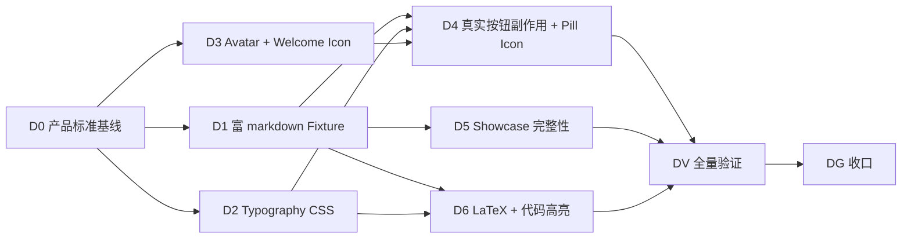

# AI Widgets Showcase 产品化 Roadmap

> Last Updated: 2026-08-24
> 产出方法：`docs/skills/roadmap-and-mission-authoring-with-consensus-review.md`（诊断→选型→拟制→共识审查）
> 驱动方：`missions/ai-widgets-product.json`（范围：`packages/flux-renderers-ai/` + `apps/playground/src/pages/ai-widgets-demo.tsx` + 相关 e2e + owner docs；授权 / Loop Rule / commitFormat 见该 mission description）
> 来源审计 / 诊断依据：`docs/analysis/2026-08-23-ai-widgets-vs-tiny-robot-comparison.md`（12 项 gaps G1–G12）+ `docs/analysis/2026-08-17-ai-dead-buttons-analysis.md`（toast 一侧已修，剩余"无内容 / 无样式 / 无副作用"）
> 关联：本图为**线性 roadmap**（非闭环）。与 `docs/backlog/ai-invariant-loop-roadmap.md`（AI engine 不变式闭环，专注防回退）范围不重叠；与 `docs/backlog/component-audit-roadmap.md`（host 大面 + P3 裁决）范围不重叠。本图专注把 `# /ai-widgets` showcase 从"功能正确但 demo 粗糙"提升到"产品级"。

## 目的

`# /ai-widgets` 是 `@nop-chaos/flux-renderers-ai` 包对外的旗舰 demo（home 页直接展示），用户据此判断包能力。当前状态：

- 引擎核心 + 14 个渲染器功能正确（A1–A6 plan 已闭环）；
- **视觉层严重欠产品化**：markdown 用浏览器默认样式（`@tailwindcss/typography` 未安装）；气泡头像空壳；对话示例内容贫瘠（mock connector 只回 8 词）；所有装饰按钮仅 toast。
- 12 项 gaps（G1–G12，详见 `docs/analysis/2026-08-23-ai-widgets-vs-tiny-robot-comparison.md` §0）。

本图按线性流水线把"产品级化"拆为 D0 → D1..D6 → DV → DG 八个 phase，每阶段一个 plan 闭环。每个 phase 一次交付，状态按 `todo / planned / done` 流转，依赖关系单调，不形成自驱动飞轮（因本图范围是"一次性 polish"，不是"防回退"——后者已由 ai-invariant-loop 负责）。

**不**复制 ai-invariant-loop 的不变式门禁机制；本图 closure 由独立 fresh session 验证。

## 选型理由（线性 vs 闭环）

按 `docs/skills/roadmap-and-mission-authoring-with-consensus-review.md` 步骤 1：

- **不是反复复发类问题**（缺陷类型 ≠ invariant 漏洞）；是产品 demo 一次性升级。
- **不是有状态子系统**（ai-bubble / ai-sender / mock connector 无独立生命周期管理诉求）。
- **不是反应式 bug 修复**（每个 gap 都有明确文件:行 + 一次性修复方案）。

→ 走**线性 roadmap**（D0..DG pipeline），不引入持续闭环 Loop Rule。每 phase 一次性落地，closure audit 验证后转 `done` 即可。

## Work Item Status

> **全文件唯一的动态状态区。** 状态流转：draft review 通过 → `todo` 改 `planned`；closure audit 通过 → `planned` 改 `done`（不得提前）。

| Phase ID | 名称                                                                                                           | 状态   | Owner Doc                                                                                                                                                             | 依赖     | Plan                                                           |
| -------- | -------------------------------------------------------------------------------------------------------------- | ------ | --------------------------------------------------------------------------------------------------------------------------------------------------------------------- | -------- | -------------------------------------------------------------- |
| D0       | 产品标准基线（fixture 设计与 typography 决策）                                                                 | `done` | `docs/analysis/2026-08-23-ai-widgets-vs-tiny-robot-comparison.md` §6-§7                                                                                               | —        | `docs/plans/2026-08-24-1045-1-d0-product-standard-baseline.md` |
| D1       | Mock Connector 富 markdown Fixture（含 11 种元素 + 6 preset + 关键词分发 + env 工厂 option 化）                | `done` | `apps/playground/src/ai/mock-ai-env.ts`、`apps/playground/src/ai/ai-widgets-fixture.ts`（新）                                                                         | D0       | `docs/plans/2026-08-24-1045-2-d1-rich-markdown-fixture.md`     |
| D2       | Markdown Typography 自定义 CSS（取代 `prose`）                                                                 | `done` | `packages/flux-renderers-ai/src/renderers/ai-bubble/renderers/markdown.tsx` + `styles.css`                                                                            | D0       | `docs/plans/2026-08-24-1045-3-d2-markdown-typography-css.md`   |
| D3       | 气泡 Avatar（lucide + 圆形 + 32px）                                                                            | `done` | `packages/flux-renderers-ai/src/renderers/ai-bubble/index.tsx` + `styles.css`                                                                                         | D0       | `docs/plans/2026-08-24-2237-1-d3-avatar-welcome-icon.md`       |
| D4       | 真实按钮副作用（`component:setSenderDraft` + `ai:regenerate` + feedback 写 metadata）                          | `done` | `packages/flux-renderers-ai/src/adapters/{ai-component-handle,ai-action-provider}.ts` + `ai-sender.tsx` + `schemas.ts` + `ai-widgets-demo.tsx`                        | D1+D2+D3 | `docs/plans/2026-08-24-2317-1-d4-real-button-side-effects.md`  |
| D5       | Showcase 完整性（扩 widgets demo 含 Reasoning / Tool-call / Citations widget 实例）                            | `done` | `apps/playground/src/pages/ai-widgets-demo.tsx` + `ai-widgets-fixture.ts`                                                                                             | D1       | `docs/plans/2026-08-24-2237-2-d5-showcase-completeness.md`     |
| D6       | LaTeX 公式渲染（`remark-math` + `rehype-katex` + `katex` peer dep）+ 代码高亮（lowlight 复用）+ fence 边界收紧 | `done` | `packages/flux-renderers-ai/src/renderers/ai-bubble/renderers/markdown.tsx` + `markdown-buffer.ts` + `package.json` + `styles.css` + `apps/playground/src/styles.css` | D2       | `docs/plans/2026-08-24-2237-3-d6-latex-code-highlight.md`      |
| DV       | 全量验证与 e2e 增量化                                                                                          | `todo` | `tests/e2e/ai-widgets-demo.spec.ts`（扩展）、`docs/logs/{year}/{month}-{day}.md`                                                                                      | D1–D6    | _(待 plan 起草)_                                               |
| DG       | 收口：owner-doc 同步 + closure log + mission closeout                                                          | `todo` | `docs/components/flux-renderers-ai/{design,renderers}.md`                                                                                                             | DV       | _(待 plan 起草)_                                               |

## 框架/平台复用

| 类型                           | 清单                                                                                                                                                                                                                                                                                                                                               |
| ------------------------------ | -------------------------------------------------------------------------------------------------------------------------------------------------------------------------------------------------------------------------------------------------------------------------------------------------------------------------------------------------- |
| 既有引擎 + 14 渲染器           | `packages/flux-renderers-ai/src/engine/`（`createMessageEngine` + thinking/tool/length 插件）、`src/renderers/`（ai-chat/ai-message-list/ai-bubble/ai-sender/ai-welcome/ai-prompts/ai-feedback/ai-suggestions/ai-voice-input/ai-token-usage/ai-attachments/ai-citations/ai-tool-call/ai-conversations）                                            |
| 既有 ActionScope 命名空间 `ai` | 7 个 action（send/abort/clear/createConversation/switchConversation/deleteConversation/renameConversation，`packages/flux-renderers-ai/src/adapters/ai-action-provider.ts:13-21`）—— D4 仅扩展 `regenerate` 与 `setSenderDraft`，不重建 namespace 契约                                                                                             |
| 既有 ComponentHandle 能力      | `setMessages` / `sendMessage`（`src/adapters/ai-component-handle.ts`）—— D4 复用现有 imperative handle 模式新增 `setSenderDraft`，不另立 dispatch 模型                                                                                                                                                                                             |
| 既有 mock connector + env      | `apps/playground/src/ai/mock-ai-env.ts` —— D1 扩 fixture 复用现有 `createStreamBasedAiConnector` 工厂                                                                                                                                                                                                                                              |
| 既有 markdown 安全缓冲         | `safeMarkdownSlice`（`src/renderers/ai-bubble/markdown-buffer.ts`，处理 UTF-16 / fence / `$$` / `\(` 边界）—— D6 扩展 `\[` 块级 + `$...$` 单美元内联边界，不重建 slice 机制                                                                                                                                                                        |
| 既有代码高亮底层 API           | `packages/flux-renderers-content/src/diff-view/adapters/syntax-highlight.ts` + `lowlight@^3.1.0`（已存在）—— D6 复用 0 增量依赖                                                                                                                                                                                                                    |
| 既有 DOMPurify + sanitizeHtml  | `packages/flux-renderers-content` 导出 `sanitizeHtml`（实测 `sanitize.ts:41-44` 用 `USE_PROFILES: { html: true }` 默认 + `FORBID_TAGS: ['style']`）—— D6 pipeline 顺序：sanitize 跑在 plain markdown 文本**之前**（line 36），**不**接触 rehype-katex 生成的 `<span class="katex">` HTML（rehype-katex 输出直接进 React DOM）；无需 allowlist 调整 |
| 既有 lucide-react peer dep     | 已声明在 `packages/flux-renderers-ai/package.json` —— D3 直接引入 `<Bot />` `<User />` 不增 dep                                                                                                                                                                                                                                                    |
| 既有 e2e 模式                  | `tests/e2e/ai-*.spec.ts` 13 文件 + `playwright.config.ts` —— DV 扩 `ai-widgets-demo.spec.ts` 不重写模式                                                                                                                                                                                                                                            |
| 审计技能                       | `docs/skills/ux-design-pattern-audit-prompt.md`（D0 用以定义产品标准基线）、`docs/skills/complex-component-display-operability-audit-prompt.md`（DV 用以验证）                                                                                                                                                                                     |
| 先例：dead-click 修复          | `docs/analysis/2026-08-17-ai-dead-buttons-analysis.md`（已把 toast 一侧修完；本图收口剩余内容 / 样式 / 副作用三方面）                                                                                                                                                                                                                              |

## 当前基线（live 实测）

- **绿色基线**：`pnpm typecheck` + `pnpm build` + `pnpm lint` + `pnpm test` + `pnpm check` 已全绿；`docs/logs/{year}/{month}-{day}.md` 记录最近一次 full-green。
- **`@nop-chaos/flux-renderers-ai`**：14 渲染器 + 8 programmatic views + 引擎 + adapters 完整；`pnpm --filter @nop-chaos/flux-renderers-ai test` 全部 pass（包内 572 tests）。
- **E2E**：**13 个** `tests/e2e/ai-*.spec.ts`，135 行 `ai-widgets-demo.spec.ts`（**10 个**测试覆盖结构断言，**全部为 DOM 结构断言，无 `getComputedStyle` / 无 `toHaveScreenshot`**）。
- **`#/ai-widgets` demo 当前 12 项 gaps**（G1–G12 详见 `docs/analysis/2026-08-23-ai-widgets-vs-tiny-robot-comparison.md` §1 + §2）：
  - **G1** mock connector 只回 8 词（`mock-ai-env.ts:25` `CANNED_REPLY_WORDS`）
  - **G2** `prose prose-sm dark:prose-invert` 类挂着但 `@tailwindcss/typography` **0 命中**（grep 全仓验证）
  - **G3** `ai-bubble/index.tsx:134` avatar 空 div + styles.css 无匹配规则
  - **G4** 所有 `onSelect/onAction/onResult/onError` 唯一副作用 `showToast`（`mock-ai-env.ts:88-94`）
  - **G5** 无 `katex/mathjax/remark-math/rehype-math` 依赖（grep 0 命中）→ **2026-08-23 human gate 决策 supersession**：D6 内置 LaTeX 渲染，G5 闭合路径 = 引入 `remark-math@^6` + `rehype-katex@^7` + `katex@^0.16` peer deps + `markdown-buffer.ts` 扩 `\[` 边界 + `markdown.tsx` 挂双插件 + playground import katex CSS
  - **G6** fenced code 无语法高亮（`lowlight` 存在于 content 包但未接入 ai-bubble）
  - **G7** `# /ai-widgets` 仅演示 6 个 widget；Reasoning/Tool/Citations 未纳入
  - **G8** `ai-welcome.tsx:25` `icon='bot'` 当字符串渲染（`{resolved.icon}` 字面输出）
  - **G9** `ai-suggestions` 用 emoji 字符替代 lucide 图标
  - **G10** 流式光标技术正确但示例 15ms/词太快
  - **G11** owner-doc gap：live `markdown.tsx:40` 引入 `prose prose-sm dark:prose-invert` 类，但 `design.md §10.4` / `renderers.md` 任一节均未文档化该 typography 决策（**实测非 drift**：design.md §10.4 实写流式 Markdown / Streamdown / LaTeX 决策，**不**写 prose；renderers.md §7 是 `ai-prompts` 章节，与 markdown typography 无关）→ G11 是 doc gap，DG 阶段新增 `ai-bubble-typography` 段固化自定义 CSS 方案
  - **G12** e2e 仅验证 DOM 结构（**10 个测试**，实测），未验证视觉产物（prose 样式 / avatar 显示 / 副作用）
- **既有 toast 修复**（`docs/analysis/2026-08-17-ai-dead-buttons-analysis.md`）：P2 dead-click 22+ 实例已闭合，**本图不再回头**——只做剩余三方面。

## Phase Details

### D0 — 产品标准基线

用 `docs/skills/ux-design-pattern-audit-prompt.md` 对 `# /ai-widgets` 当前视觉做诊断 + 对照 OpenTiny tiny-robot demo 视觉产出产品级 spec（typography 节奏 / 间距 token / 配色 token / 头像规格 / fixture 内容范围 / fixture 触发关键词）。同时输出 typography CSS 设计决策（**不**引入 `@tailwindcss/typography` —— 实测 tarball ~25-30KB / unpacked ~78KB / gzip ~17KB 违反包体积纪律；走自定义 `[data-slot="ai-bubble-markdown"]` CSS）。交付物：`docs/components/flux-renderers-ai/product-spec.md`（产品级 spec，与 `design.md` 区分：本 spec 只描述本图范围内的目标态）。**完成判定**：spec 文件存在 + 11 项 markdown 元素清单 + 6 个 fixture preset 内容大纲 + typography CSS 决策记录（D0 是设计阶段无代码改动，无 plan guide Closure Gates 适用；D1 计划时按 plan guide 走）。

### D1 — Mock Connector 富 markdown Fixture

`apps/playground/src/ai/ai-widgets-fixture.ts`（新文件）+ 改造 `mock-ai-env.ts`：6 个 preset fixture（关键词 `weather` / `code` / `formula` / `reasoning` / `citation` / 默认）+ 11 种富 markdown 元素各覆盖 ≥ 1 次（详见 D0 spec）。**`createMockAiEnv()` 接受 `{ delayMs?: number }` option，默认 15ms**（**不**改全局默认，避免破坏 13 个现有 e2e 的流式节奏断言）；**`ai-widgets-demo.tsx` 显式传 `delayMs=200`** 让 fixture 流式节奏可见（收口 G10）。Fixture 触发分发支持 trigger 流式 + 节奏。**注意**：`math` 关键词已改名为 `formula` 以贴近 D6 LaTeX 渲染产物（KaTeX 渲染的数学公式视觉）。**完成判定**：6 preset 文件落地 + dispatcher 关键词映射（含 `formula` 替 `math`）+ env factory option 化（`createMockAiEnv({ delayMs: 200 })`）+ `ai-widgets-demo.tsx` 显式传 200ms + `ai-chat-demo.tsx` 不传走默认 15ms + e2e `ai-widgets-fixture.spec.ts` 全过 + 现有 13 个 e2e 全部不破坏（**Test Strategy tier 草拟 plan 时必填：建议「必须自动化」**，理由：fixture 是 showcase 真实内容 substrate）。

### D2 — Markdown Typography 自定义 CSS

`packages/flux-renderers-ai/src/renderers/ai-bubble/renderers/markdown.tsx:40` 移除 `'prose prose-sm dark:prose-invert'` 类名；新增自定义 CSS（`styles.css` ~80 行 typography 规则：h1-h6 / p / ul / ol / blockquote / pre / code / a / table / hr / img / strong / em），dark mode **`@media (prefers-color-scheme: dark)` + `[data-mode='dark']` 双触发**（与项目主题系统对齐——实测 `docs/architecture/theme-compatibility.md:165` 使用 `:root[data-theme='classic'][data-mode='dark']` 双轴模式；本图 CSS 走 `[data-mode='dark']` 单轴覆盖足够，因 ai-bubble 不感知 theme variant）。**scope 显式声明**：本 phase **仅**处理 `markdown.tsx:40` 的 `prose prose-sm dark:prose-invert`；**`packages/flux-renderers-ai/src/rich-text/tiptap-sender.tsx:219` 的 `prose max-w-none` 不在本 phase scope**——rich-text 子路径独立 scope（opt-in，host 显式 import），Tiptap 由 A6 P6 plan 单独 ownership 跟踪，本图不强行耦合（避免越界）。**不引入** `@tailwindcss/typography`（**实测 `bundlephobia` `@tailwindcss/typography@0.5.16`：tarball ~25-30KB / unpacked ~78KB / gzip ~17KB**，违反包体积纪律），走自定义 CSS 是设计选择。**完成判定**：`markdown.tsx` 内 `prose` 字串 0 命中 + 新 CSS 行数 ≤ 150 + `markdown-content.test.tsx` 新增 typography 计算样式测试 3+ 通过（**Test Strategy tier 草拟 plan 时必填：建议「必须自动化」**，理由：typography 是 ai-bubble public contract 变化）。

### D3 — 气泡 Avatar + Welcome Icon（同时收口 G3 + G8）

**G3 气泡 avatar**：`packages/flux-renderers-ai/src/renderers/ai-bubble/index.tsx:134` 空 div 改为 lucide `<Bot />`（assistant）/ `<User />`（user）+ `data-role` + 32×32 圆 + `bg-secondary-surface` 背景 + 1px border。`AiBubbleViewProps` 增加 `avatar?: ReactNode` host 扩展位（向后兼容）；`schemas.ts` `AiBubbleSchema` 增加 `avatar?: SchemaInput` 字段。`styles.css` 新增 `[data-slot="ai-bubble-avatar"]` 规则。

**G8 welcome icon**：同步处理 `packages/flux-renderers-ai/src/renderers/ai-welcome.tsx:24-27` —— `resolved.icon` 由"字面字符串渲染"改为 lucide 分发（`Bot` / `User` / `Sparkles` 等常用预设 + `data-slot="ai-welcome-icon"` marker 一致），向后兼容（字符串仍渲染于 fallback），schemas.ts `AiWelcomeSchema` 增加 `iconLucide?: SchemaValue` 字段（host 注入 lucide component 引用）。**同一 phase 收口因 G3 与 G8 同源：均"渲染器未正确用 lucide 渲染图标"**，避免 D3 只修一半。

**完成判定**：e2e `ai-widgets-demo.spec.ts` 新增断言（avatar `getBoundingClientRect()` = 32×32 + 圆形 + welcome icon 不再字面字符串）+ unit 测试覆盖 lucide 按 role / welcome fallback 共 4+ 个 case 全过（**Test Strategy tier 草拟 plan 时必填：建议「必须自动化」**，理由：avatar 是 ai-bubble public contract 变化）。

### D4 — 真实按钮副作用 + Suggestion Pill Icon（同时收口 G4 + G9）

**G4 真实按钮副作用**：`packages/flux-renderers-ai/src/adapters/ai-component-handle.ts` 增加 `setSenderDraft(text: string)` imperative 方法（cid 隔离）；`adapters/ai-action-provider.ts` 在 `AI_NAMESPACE_ACTIONS` 增 `regenerate`；`ai-sender.tsx` 通过 `useAiChatContext()` 读 `senderDraftRef` 同步到内部 `draft` state；`ai-feedback.tsx` 的 like/dislike 写 `message.metadata.feedback` + 本地 useState 镜像；`schemas.ts` `AiComponentHandleSchema` 增加 `setSenderDraft` action schema。`apps/playground/src/pages/ai-widgets-demo.tsx` 重写 schema：

- `ai-prompts.onSelect` → `{ action: 'component:setSenderDraft', componentId: 'ai-chat-demo', args: { text: '${item.label}' } }`
- `ai-suggestions.onSelect` → 同上 + text = `'${item.text}'`
- `ai-feedback.actions` 包含 refresh → `onAction` 按 action 分发 refresh → `ai:regenerate`
- `ai-voice-input` 转写后走 `component:setSenderDraft` 追加（不替换）
- **draft race 处理**：`setSenderDraft` 实现上采用 "追加 + 用户输入优先保留" 策略——多次 setSenderDraft 时如果当前 draft 与上次 setSenderDraft 写入值一致则跳过（避免重复），不一致则追加 `\n` + 新文本；用户在转写中又打字时不打断（setSenderDraft 仅在用户 input 框失焦 / 显式触发时执行，可通过 ComponentHandle option `mode: 'append' | 'replace'` 切换，默认 `append`）。

**G9 suggestion pill icon**：同步处理 `apps/playground/src/pages/ai-widgets-demo.tsx:128-134` 的 `SUGGESTION_ITEMS` —— `icon: '✏️'` / `'🌐'` / `'💡'` / `'✨'` / `'➕'` 字符替换为 lucide 图标字符串引用（`Pencil` / `Languages` / `Lightbulb` / `Sparkles` / `Plus`）。`packages/flux-renderers-ai/src/renderers/ai-suggestions.tsx` 增加 lucide 分发（按字符串 → lucide 组件映射）；缺失时降级为字符回退（向后兼容）。**同 phase 收口因 G4 与 G9 均涉及 ai-suggestions 渲染器修改**。

**完成判定**：新 `tests/e2e/ai-widgets-button-actions.spec.ts` 6 个测试全过（prompt 点击 → 输入框值变化 + 重复点击不重复追加 / suggestions / refresh 触发新消息 / like toggle / sources 弹层 / pill icon 是 lucide svg 而非字面字符）+ `AI_NAMESPACE_ACTIONS` 测试断言 8 项 + 现有 13 个 e2e 不破坏（**Test Strategy tier 草拟 plan 时必填：建议「必须自动化」**，理由：button actions 是 schema public contract 变化）。

### D5 — Showcase 完整性

`apps/playground/src/pages/ai-widgets-demo.tsx` 在 `beforeMessages` 区 welcome + prompts 之间新增 3 个 widget 缩略卡（纯 static in-content link，**不是** `App.tsx` 顶层 nav menu 项——避免污染全局导航）：每张卡 `<a>` 跳转到 `# /ai-tools`（工具卡片 widget demo，`App.tsx:347`）/ `# /ai-citations`（引用 widget demo，`App.tsx:357`）/（无 reasoning 缩略卡——Reasoning 是 `ai-bubble` 的 content renderer 之一，D5 fixture 触发时让 mock connector 输出 `reasoning_content` 字段让 ai-bubble 渲染折叠面板即可，无需新增路由也无需缩略卡）；mock connector fixture A-F 每个至少含 1 种新 widget 触发（tool / citation / reasoning）。**完成判定**：首屏可见 widget ≥ 8 + fixture 触发后对话区含 tool-call 卡片 + citations marker + reasoning 折叠 + 现有 10 个 `ai-widgets-demo.spec.ts` 测试不破坏（**Test Strategy tier 草拟 plan 时必填：建议「必须自动化」**，理由：showcase completeness 是 demo public surface）。

### D6 — LaTeX 公式渲染 + 代码高亮（lowlight 复用）+ Fence 边界收紧

**LaTeX 内置决策（与 owner-doc supersession 对齐）**：原 `docs/components/flux-renderers-ai/design.md:378` / `improvement-analysis.md:209` / `plans/2026-07-24-1400-1-a3-...:245` 三处明确"**LaTeX 不内置**"。**2026-08-23 human gate 重新决策：LaTeX 为产品级 AI chat 实际应用必须能力**（科学 / 工程 / 教育场景高频），不再视为 niche 场景。本 phase **内置** `remark-math@^6` + `rehype-katex@^7` + `katex@^0.16` 作为硬 peer deps（与现有 `react-markdown` / `rehype-raw` 治理一致）。**owner-doc supersession 链**：design.md §10.4 + improvement-analysis.md §4.2 + plan A3 §Deferred But Adjudicated 三处均已 supersede（保留旧裁定 + supersession 注释 + 指向本 roadmap）。**变更追溯**：原"高频证据不足"在 human gate 重新评估为不成立。**peer deps 引入后 bundle 影响**：peer deps 不计入本包 bundle size（host 必须安装），但 host bundle 增量 ~20KB gzip + KaTeX CSS（katex CSS 必须 host `import 'katex/dist/katex.min.css'` 显式引入，与现有 `dompurify` / 样式 import 治理一致）。

**LaTeX 实现细节**：`packages/flux-renderers-ai/src/renderers/ai-bubble/renderers/markdown.tsx` 在 `ReactMarkdown` 的 `remarkPlugins` / `rehypePlugins` 数组追加 `remark-math` + `rehype-katex`（与既有 `remarkGfm` + `rehypeRaw` 同栈）。`markdown-buffer.ts` **同步扩展两类边界**：(a) `\[...\]` 块级公式（与既有 `$$` / `\(` 切割规则对齐）；(b) `$...$` 单美元内联公式（实测 `markdown-buffer.ts:98-113` `findUnclosedMathCutoff` 当前只跟踪 `$$` + `\(` + `\)`，未跟踪单 `$`；D6 plan 起草时需补 `findUnclosedSingleDollarCutoff` + 测试覆盖）。`packages/flux-renderers-ai/src/styles.css` 新增 `.katex` / `.katex-display` 容器基础排版（**仅排版**，颜色 / 字体靠 katex 自身 `katex.min.css`）。`apps/playground/src/styles.css` 加 `@import 'katex/dist/katex.min.css'`（playground 端 import 链入）。

**代码高亮（复用 content 包 lowlight）**：`packages/flux-renderers-ai/src/renderers/ai-bubble/renderers/markdown.tsx` 自定义 `code` component override 接 `lowlight.highlight(lang, code)` —— `lowlight@^3` 已存在于 `flux-renderers-content` 包（`packages/flux-renderers-content/package.json:27`），**`flux-renderers-ai` 加 peer dep `lowlight@^3` 即可**。`markdown-buffer.ts` 扩展 fence 边界（流式时 ` ``` ` 未闭合 → cut 防 broken fence 渲染）。`styles.css` 增加 `.tok-key` / `.tok-str` / `.tok-num` / `.tok-bool` 基础 token 配色（与 content 包 diff-view 配色对齐；详见 `flux-renderers-ai/src/styles.css:67-79` 既有 tool-call JSON 高亮规则）。

**完成判定**：e2e `ai-widgets-demo.spec.ts` fixture `formula` 关键词触发后 `<span class="katex">` 元素存在 + fixture `code` 触发后 `<code>` 内含 token class span（lowlight 着色）+ 流式中 `$\frac{1}{` 未闭合时 markdown-buffer.ts cut 防止 broken math 渲染 + 流式 fence 未闭合时 cut 防止 broken fence 渲染 + 现有 10 个 e2e 不破坏（**Test Strategy tier 草拟 plan 时必填：建议「必须自动化」**，理由：LaTeX 渲染 + code highlight 是 markdown public contract 变化）。

### DV — 全量验证与 e2e 增量化

`tests/e2e/ai-widgets-demo.spec.ts` 从当前 **10 个测试**增至 ≥ **16 个**（覆盖 typography / avatar / welcome icon / button actions / pill icon / fixtures / showcase completeness / code highlight 各 1+ 个；共增量 6+ 个测试）；新 `ai-widgets-button-actions.spec.ts` + `ai-widgets-fixture.spec.ts` 增量化；`pnpm typecheck && pnpm build && pnpm lint && pnpm test && pnpm check` 全量仓库级验证（按 plan guide Minimum Rule 18 — 全量验证归 closure，不在每个 Phase Exit 重复）；headless Chromium 跑全套 e2e；`_tmp/ai-widgets-product-snapshot.png` 保留一次截图作为产品级对照（按 AGENTS.md §测试策略——程序化视觉断言，不靠肉眼看）。**完成判定**：full-green baseline + e2e ≥ 16 通过 + 视觉快照落档。

### DG — 收口：owner-doc 同步 + closure log + mission closeout

`docs/components/flux-renderers-ai/design.md` **新增** `### ai-bubble-typography 段`（因实测 design.md §10.4 不写 prose typography → G11 是 doc gap 不是 drift，本 phase 补写新段而非修订既有段）；`renderers.md` 更新 ai-bubble 章节（avatar lucide + 圆形 + 32px）+ 新增 `setSenderDraft` 段 + 新增 `ai:regenerate` 段。`docs/logs/{year}/{month}-{day}.md` 写 closure log（包含 full-green 验证 + 各 phase 收口摘要 + G1–G12 闭合 checklist）。**不**回写 `docs/analysis/2026-08-23-ai-widgets-vs-tiny-robot-comparison.md`（按 plan guide Rule 21 — 已标记历史审计不回写）。**完成判定**：owner-doc grep 验证 `prose prose-sm` 字串在 `flux-renderers-ai` 包 markdown.tsx 0 命中（**注意：rich-text/tiptap-sender.tsx 的 `prose max-w-none` 独立 scope 不计入**）+ `setSenderDraft` 字串 ≥ 1 + `ai-bubble-typography` 段存在 + daily log 写入 + 独立 fresh session closure-audit 通过（plan guide Minimum Rule 12 / Closure Audit Rule）。

## Dependency Graph



## Cross-Cutting

### 授权（mission 自动修复）

- **不在 Protected Areas 表**（`docs/context/ai-autonomy-policy.md`）：`flux-renderers-ai` 包 renderer / adapter / engine / schema 代码不在受保护区（受保护的是 `flux-core/src/`、schema/contract validation、`ui/src/index.ts`、renderer definition、样式契约 —— 详见 policy.md）。本图变更均在 `flux-renderers-ai` 包 + `apps/playground/` + `tests/e2e/` + `docs/`，**不触及受保护区**。
- **P0/P1 自动修复预授权**（沿用 component-audit / ai-invariant-loop 纪律）：D1 / D2 / D3 / D4 / D6 任一文件:行 修复 + 验证测试 ≤ 1 个 plan 闭环的，AI 可自动执行；如发现需跨包接口变更（如下列结构性变更）—— 视为结构性，按 mission description 走 human gate 确认：
  - **新增 namespace action 修改 `AI_NAMESPACE_ACTIONS` 常量**（D4 `regenerate`）
  - **新增 ComponentHandle 方法**（D4 `setSenderDraft`）
  - **新增 hard peer deps 修改 `package.json`**（D6 `remark-math` / `rehype-katex` / `katex`）—— 2026-08-23 human gate 已 supersession 旧"不内置"裁定并授权内置，决策已写入 `design.md:378` supersession 注释 + `improvement-analysis.md:209` + `plan A3:245`
  - **修改 owner-doc 推翻既有决策**（D6 supersession 链——三处 owner-doc 修订均已应用）
- **`pnpm check` 新门禁？** 本图不新增 `check:*` 门禁（与 ai-invariant-loop 不同 —— 本图一次性 polish，非防回退）；如 D6 实现后发现需要 (`check:ai-bubble-math-peer-dep` 之类) 可加入，但**不**强制。沿用既有 `check:*` 全跑过即可。

### 包边界与契约

- D3 的 avatar 实现仅在 `flux-renderers-ai` 包内；D4 的 `setSenderDraft` 走 ComponentHandle imperative 模型（与现有 `sendMessage`/`setMessages` 平行），不破坏 schema 公共契约。
- D6 的 math/highlight peer dep 检测在 `markdown.tsx` 内做 try/catch dynamic require；缺失时降级（公式显示字面 + 提示气泡 / 代码块无高亮），不抛错、不影响其他 markdown 渲染。
- D5 的缩略卡为 playground-local widget（无 schema 公共接口新增）；引用现有完整 demo 路由（`# /ai-reasoning` 不存在则跳 `# /ai-tools` / `# /ai-citations` 已存在路由）。

### commitFormat

`fix(ai-widgets-product): <description>`（与 mission `commitFormat` 字段逐字符一致）。

## Rule

- **粒度纪律**：每 phase 必须 ≤ 1 个 plan 闭环（按 `docs/backlog/00-roadmap-authoring-guide.md` Phase Granularity）；超出则拆分（不存在合并需求 —— 每个 gap 已有清晰独立范围）。
- **状态更新**：本图 Work Item Status 表为**唯一**动态区；其他位置不维护 per-item 状态。`planned` 由 draft review 通过触发，`done` 由独立 fresh session closure-audit 通过触发，不得提前。
- **范围独立**：与 `ai-invariant-loop-roadmap.md` / `component-audit-roadmap.md` / `component-audit-round2-roadmap.md` 范围不重叠；如发现需 cross-reference，按各图 Rule 走人工确认 + 共识审查。
- **不复制 invariant 机制**：本图不走 Loop Rule；不是循环飞轮，是一次性 polish。closure 即 mission closeout。
- **双向范围独立声明（人工 gate 签字）**：本图主动声明与 `docs/backlog/ai-invariant-loop-roadmap.md` / `docs/backlog/component-audit-roadmap.md` / `docs/backlog/component-audit-round2-roadmap.md` 范围不重叠（**单向声明**，roadmap-and-mission-authoring-with-consensus-review.md 规则 4 要求双向核对——但反向 ack 需要修订既有 roadmap 文本，**不在本 plan scope**）。本图 closure 时由 human gate 显式签字承认本单向声明；反向 ack 留待 `ai-invariant-loop-roadmap.md` 下一轮修订时显式加入"与本图独立"声明。
- **不破坏既有 e2e**：D1 不改 mock connector 默认 `delayMs`（保持 15ms 全局兼容）；D1 改造 `createMockAiEnv` 接受 `{ delayMs?: number }` option（默认 15）；**`ai-widgets-demo.tsx` 显式传 `delayMs=200`** 让 fixture 流式节奏可见（收口 G10），其他 demo 不传（保持 15ms）。DV 验证 13 个现有 e2e 全部不破坏。
- **owner-doc 同步**：DG 阶段统一回写 `design.md` / `renderers.md`；不分散到各 Phase Exit Criteria（按 plan guide Minimum Rule 17：owner-doc 同步是 plan 级义务，不是每个 Phase 固定项）。
- **共识审查纪律**：每次本 roadmap 修订（含 D1-DG 任一 phase 启动前的 plan review）走 `docs/skills/roadmap-and-mission-authoring-with-consensus-review.md` 步骤 4：独立 fresh session 子 agent review 至 `approved`。
- **闭环**：D1–D6 任一 phase 完成不得宣布 mission closeout；closeout 仅在 DG 通过独立 closure-audit 后执行。
