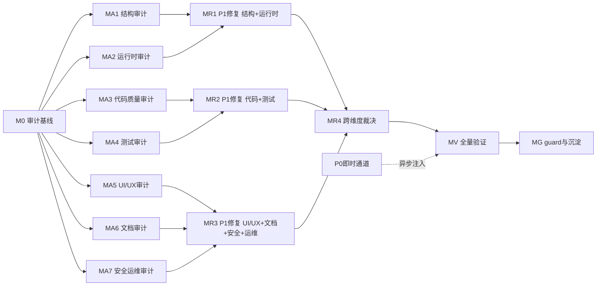

# 审计-修复路线图

> 最后更新：2026-07-27
> 来源：`docs/skills/audit-remediation-roadmap-authoring-prompt.md`

## 目的

本文件是 nop-chaos-flux 项目的"全面审计 + P0/P1 彻底修复"路线图，按 `docs/backlog/00-roadmap-authoring-guide.md` 规范编排，覆盖审计-修复闭环（流水线模式：P0 即时止血 + P1 维度内批量修复）。

AI 或维护者读完本文即知哪些工作项未开始（`todo`）、已计划（`planned`）、已完成（`done`），无需重走全部审计记录。

## Phase Status

> **全文件唯一的动态状态区。更新状态只改这里。**
> 状态流转：draft review 通过 → `todo` 改 `planned`；closure audit 通过 → `planned` 改 `done`（不得提前）。

| Phase ID | 名称                                          | 状态   |
| -------- | --------------------------------------------- | ------ |
| M0       | 审计编排基线                                  | `done` |
| MA1.1    | 结构层—核心包簇（core）依赖与边界审计         | `done` |
| MA1.2    | 结构层—运行时包簇（runtime）依赖与边界审计    | `done` |
| MA1.3    | 结构层—基础渲染器（basic）定义与边界审计      | `done` |
| MA1.4    | 结构层—设计器/办公/内容/移动端 定义与样式审计 | `done` |
| MA2.1    | 运行时层—核心包簇 Schema 与硬编码分发审计     | `done` |
| MA2.2    | 运行时层—运行时包簇裸读取与异步路径审计       | `done` |
| MA2.3    | 运行时层—基础渲染器分发与 Action 链路审计     | `done` |
| MA3.1    | 代码质量—核心+运行时 代码质量与 React19 审计  | `done` |
| MA3.2    | 代码质量—基础+内容+移动端 代码质量审计        | `done` |
| MA3.3    | 代码质量—设计器+办公 代码质量审计             | `done` |
| MA4.1    | 测试层—核心+运行时 测试覆盖审计               | `done` |
| MA4.2    | 测试层—基础+内容+移动端 测试覆盖审计          | `done` |
| MA4.3    | 测试层—设计器+办公 测试覆盖与 E2E 审计        | `done` |
| MA5.1    | UI/UX—设计器可操作性审计                      | `done` |
| MA5.2    | UI/UX—基础+内容渲染器 UX 审计                 | `done` |
| MA6      | 文档与契约一致性审计                          | `done` |
| MA7.1    | 安全与运维—XSS/样式/性能审计                  | `done` |
| MA7.2    | 安全与运维—CI/Deprecation/i18n 审计           | `todo` |
| R1.0     | P1 修复—结构+运行时（展开器）                 | `todo` |
| R2.0     | P1 修复—代码+测试（展开器）                   | `todo` |
| R3.0     | P1 修复—UI/UX+文档+安全+运维（展开器）        | `todo` |
| R4.0     | 跨维度 P1 裁决（可选）                        | `todo` |
| MV       | 全量验证与回归                                | `todo` |
| MG       | Guard 激活与知识沉淀                          | `todo` |

## 框架/平台复用

M0 产出 + 以下 skill 和工具可供审计工作项直接调用：

| 类型                       | 清单                                                                                                                                                                                                                                                                                                                                                                                                                                                         |
| -------------------------- | ------------------------------------------------------------------------------------------------------------------------------------------------------------------------------------------------------------------------------------------------------------------------------------------------------------------------------------------------------------------------------------------------------------------------------------------------------------ |
| 多维深度审计               | `docs/skills/deep-audit-prompts.md`                                                                                                                                                                                                                                                                                                                                                                                                                          |
| 开放式对抗审查             | `docs/skills/open-ended-adversarial-review-prompt.md`                                                                                                                                                                                                                                                                                                                                                                                                        |
| 代码质量审计               | `docs/skills/code-quality-audit-prompt.md`                                                                                                                                                                                                                                                                                                                                                                                                                   |
| React 19 最佳实践          | `docs/skills/react19-best-practices-review.md`                                                                                                                                                                                                                                                                                                                                                                                                               |
| UX 设计模式审计            | `docs/skills/ux-design-pattern-audit-prompt.md`                                                                                                                                                                                                                                                                                                                                                                                                              |
| 复杂交互 renderer 可操作性 | `docs/skills/complex-component-display-operability-audit-prompt.md`                                                                                                                                                                                                                                                                                                                                                                                          |
| 测试契约覆盖审计           | `docs/skills/unit-test-logic-and-contract-coverage-audit-prompt.md`                                                                                                                                                                                                                                                                                                                                                                                          |
| 审计工具脚本               | `check:audit-suspects`, `check:audit-runtime-raw-schema-reads`, `check:audit-fieldframe-bypasses`, `check:audit-async-failure-paths`, `check:audit-hardcoded-type-dispatch`, `check:audit-missing-renderer-markers`, `check:audit-test-global-leaks`, `check:audit-performance-suspects`, `check:audit-styling-suspects`, `check:audit-non-retained-renderer-references`, `check:audit-reactive-render-reads`, `check:audit-react19-optimization-candidates` |
| E2E 测试                   | `pnpm test:e2e`                                                                                                                                                                                                                                                                                                                                                                                                                                              |
| 变异测试                   | `pnpm audit:mutants`                                                                                                                                                                                                                                                                                                                                                                                                                                         |
| 静态分析                   | `pnpm audit:deps`, `pnpm audit:knip`, `pnpm audit:semgrep`                                                                                                                                                                                                                                                                                                                                                                                                   |
| React Doctor               | `pnpm audit:react-doctor`                                                                                                                                                                                                                                                                                                                                                                                                                                    |

## 当前基线

- **绿色基线**：`pnpm typecheck` + `pnpm build` + `pnpm test` 通过
- **已知良好测试状态**：AI 包 442/442 pass（54 文件），Scheduling 包 816/816 pass（70 文件）
- **E2E 测试**：AI Chat 10/10、AI Widgets 10/10、AI Conversations 4/4；Gantt 部分 pass（~5/27 rendering pass，interaction 预知失败）
- **审计工具状态**：待 M0 跑取基线
- **已闭包审计项**：AI 包 P1×5 + P2×32 已闭包；Scheduling 包 P0×12 + P1×35 + P2×10 已闭包

## 审计维度矩阵

详见 `docs/audits/audit-remediation-scope-and-dimension-matrix.md`。

## Milestones

### M0 — 审计编排基线

| Work Item                                  | Status | Owner Doc                                 | Dependencies | Skill                   |
| ------------------------------------------ | ------ | ----------------------------------------- | ------------ | ----------------------- |
| M0.1 初始化审计维度矩阵 + arm-index        | `done` | `docs/audits/00-audit-execution-guide.md` | 无           | —                       |
| M0.2 跑审计工具基线（check:audit-\* 全量） | `done` | —                                         | M0.1         | `pnpm check:*`          |
| M0.3 跑全量验证基线 + 文档索引扫描         | `done` | —                                         | M0.2         | `pnpm typecheck + test` |

### MA1 — 结构与架构层审计（维 A: 依赖图/包边界/模块边界/Renderer 定义/样式契约）

| Work Item                                                | Status | Owner Doc                                             | Dependencies | Skill                                                              |
| -------------------------------------------------------- | ------ | ----------------------------------------------------- | ------------ | ------------------------------------------------------------------ |
| MA1.1 核心包簇（flux-core/formula/compiler/action-core） | `done` | `docs/architecture/flux-core.md`                      | M0           | `deep-audit-prompts.md`                                            |
| MA1.2 运行时包簇（flux-runtime/react/bundle）            | `done` | `docs/architecture/flux-runtime-module-boundaries.md` | M0           | `deep-audit-prompts.md`                                            |
| MA1.3 基础渲染器包簇（basic/form/form-advanced/data）    | `done` | `docs/architecture/renderer-runtime.md`               | M0           | `deep-audit-prompts.md` + `flux-component-design-review-prompt.md` |
| MA1.4 设计器/办公/内容/移动端定义与样式                  | `done` | `docs/architecture/styling-system.md`                 | M0           | `deep-audit-prompts.md`                                            |

### MA2 — 运行时正确性层审计（维 B: 裸 schema/FieldFrame/异步路径/硬编码分发/Action 链路）

| Work Item                               | Status | Owner Doc                                       | Dependencies | Skill                                                                                                          |
| --------------------------------------- | ------ | ----------------------------------------------- | ------------ | -------------------------------------------------------------------------------------------------------------- |
| MA2.1 核心包簇 Schema 校验 + 硬编码分发 | `done` | `docs/architecture/flux-core.md`                | M0           | `check:audit-hardcoded-type-dispatch` + `code-quality-audit-prompt.md`                                         |
| MA2.2 运行时包簇裸读取 + 异步路径       | `done` | `docs/architecture/renderer-runtime.md`         | M0           | `check:audit-runtime-raw-schema-reads` + `check:audit-async-failure-paths` + `check:audit-fieldframe-bypasses` |
| MA2.3 基础渲染器分发 + Action 链路      | `done` | `docs/architecture/action-scope-and-imports.md` | M0           | `deep-audit-prompts.md`                                                                                        |

### MA3 — 代码质量与 React 实践层审计（维 C）

| Work Item                            | Status | Owner Doc                               | Dependencies | Skill                                                               |
| ------------------------------------ | ------ | --------------------------------------- | ------------ | ------------------------------------------------------------------- |
| MA3.1 核心+运行时 代码质量 + React19 | `done` | `docs/architecture/renderer-runtime.md` | M0           | `code-quality-audit-prompt.md` + `react19-best-practices-review.md` |
| MA3.2 基础+内容+移动端 代码质量      | `done` | `docs/architecture/styling-system.md`   | M0           | `code-quality-audit-prompt.md`                                      |
| MA3.3 设计器+办公 代码质量           | `done` | —                                       | M0           | `code-quality-audit-prompt.md`                                      |

### MA4 — 测试层审计（维 D）

| Work Item                               | Status | Owner Doc                                              | Dependencies | Skill                                                                                         |
| --------------------------------------- | ------ | ------------------------------------------------------ | ------------ | --------------------------------------------------------------------------------------------- |
| MA4.1 核心+运行时 测试覆盖 + 全局泄漏   | `todo` | —                                                      | M0           | `unit-test-logic-and-contract-coverage-audit-prompt.md` + `check:audit-test-global-leaks`     |
| MA4.2 基础+内容+移动端 测试覆盖         | `done` | —                                                      | M0           | `unit-test-logic-and-contract-coverage-audit-prompt.md`                                       |
| MA4.3 设计器+办公 测试覆盖 + E2E 有效性 | `done` | `docs/audits/arm-MA4-designer-office-test-coverage.md` | M0           | `unit-test-logic-and-contract-coverage-audit-prompt.md` + `exploratory-e2e-testing-prompt.md` |

### MA5 — UI/UX 与可操作性审计（维 E）

| Work Item                                            | Status | Owner Doc                                     | Dependencies | Skill                                                   |
| ---------------------------------------------------- | ------ | --------------------------------------------- | ------------ | ------------------------------------------------------- |
| MA5.1 设计器（flow/report/spreadsheet/word）可操作性 | `done` | `docs/audits/arm-MA5-designer-operability.md` | M0           | `complex-component-display-operability-audit-prompt.md` |
| MA5.2 基础+内容渲染器 UX 模式                        | `done` | `docs/audits/arm-MA5-basic-content-ux.md`     | M0           | `ux-design-pattern-audit-prompt.md`                     |

### MA6 — 文档与契约一致性审计（维 F）✅

| Work Item                             | Status | Owner Doc                             | Dependencies | Skill                                                            |
| ------------------------------------- | ------ | ------------------------------------- | ------------ | ---------------------------------------------------------------- |
| MA6.1 全部包簇 docs/ 与架构文档一致性 | `done` | `docs/audits/arm-MA6-doc-contract.md` | M0           | `doc-evaluation.md` + `implementation-contract-review-prompt.md` |

### MA7 — 安全、性能与运维审计（维 G/H）

| Work Item                          | Status | Owner Doc                             | Dependencies | Skill                                                                                         |
| ---------------------------------- | ------ | ------------------------------------- | ------------ | --------------------------------------------------------------------------------------------- |
| MA7.1 XSS/样式/性能（全包簇抽样）  | `todo` | `docs/architecture/styling-system.md` | M0           | `deep-audit-prompts.md` + `check:audit-styling-suspects` + `check:audit-performance-suspects` |
| MA7.2 CI/Deprecation/i18n/静态检查 | `todo` | —                                     | M0           | `deprecated-feature-cleanup.md` + `check:audit-non-retained-renderer-references`              |

### MR1 — P1 修复：结构+运行时（依赖 MA1 + MA2 完成）

| Work Item                            | Status | Owner Doc | Dependencies              | Skill |
| ------------------------------------ | ------ | --------- | ------------------------- | ----- |
| R1.0 P1 展开器（追加实际修复工作项） | `todo` | —         | MA1.1-MA1.4 + MA2.1-MA2.3 | —     |

### MR2 — P1 修复：代码+测试（依赖 MA3 + MA4 完成）

| Work Item                            | Status | Owner Doc | Dependencies              | Skill |
| ------------------------------------ | ------ | --------- | ------------------------- | ----- |
| R2.0 P1 展开器（追加实际修复工作项） | `todo` | —         | MA3.1-MA3.3 + MA4.1-MA4.3 | —     |

### MR3 — P1 修复：UI/UX+文档+安全+运维（依赖 MA5 + MA6 + MA7 完成）

| Work Item                            | Status | Owner Doc | Dependencies                      | Skill |
| ------------------------------------ | ------ | --------- | --------------------------------- | ----- |
| R3.0 P1 展开器（追加实际修复工作项） | `todo` | —         | MA5.1-MA5.2 + MA6.1 + MA7.1-MA7.2 | —     |

### MR4 — 跨维度 P1 裁决与冲突修复

| Work Item           | Status | Owner Doc | Dependencies | Skill |
| ------------------- | ------ | --------- | ------------ | ----- |
| R4.0 跨维度冲突裁决 | `todo` | —         | MR1-MR3      | —     |

### MV — 全量验证

| Work Item                          | Status | Owner Doc | Dependencies           | Skill |
| ---------------------------------- | ------ | --------- | ---------------------- | ----- |
| MV.1 全量 typecheck + build + test | `todo` | —         | MR1-MR4 + 全部 P0 修复 | —     |
| MV.2 审计工具基线对比              | `todo` | —         | MR1-MR4                | —     |
| MV.3 arm-index 完整性校验          | `todo` | —         | MR1-MR4                | —     |

### MG — Guard 激活与知识沉淀

| Work Item                              | Status | Owner Doc                         | Dependencies | Skill |
| -------------------------------------- | ------ | --------------------------------- | ------------ | ----- |
| MG.1 失败模式提升为 lessons            | `todo` | `docs/lessons/README.md`          | MV           | —     |
| MG.2 project-context.md 更新           | `todo` | `docs/context/project-context.md` | MV           | —     |
| MG.3 skills/README.md 已知失败模式更新 | `todo` | `docs/skills/README.md`           | MV           | —     |

## Work Item Details

### M0 — 审计编排基线

- **M0.1**：生成审计维度矩阵（`docs/audits/audit-remediation-scope-and-dimension-matrix.md`）+ 初始化 `docs/audits/arm-index.md` 骨架。产出：二维覆盖表 + 未闭包发现清单 + 索引。
- **M0.2**：跑全部 `check:audit-*` 脚本和 `pnpm audit:*`（deps/knip/mutants/semgrep/react-doctor），记录基线数值。
- **M0.3**：跑 `pnpm typecheck && pnpm build && pnpm test` + `pnpm test:e2e` 确认绿色基线。扫描 `docs/` 索引完整性。

### MA1 — 结构与架构层

- **MA1.1**：审计 `flux-core`/`flux-formula`/`flux-compiler`/`flux-action-core` 的跨包依赖 DAG 合规性、Renderer 定义字段正确性、样式契约合规。保护区域 flux-core/src 在审计范围内，发现 P0/P1 可直改。产出 arm-MA1-core-\* 审计报告。
- **MA1.2**：审计 `flux-runtime`/`flux-react`/`flux-bundle` 的模块边界合规、跨层引用、公共导出面纪律。产出 arm-MA1-runtime-\* 审计报告。
- **MA1.3**：审计 `flux-renderers-basic`/`form`/`form-advanced`/`data` 的 Renderer 定义完整性、样式 marker 类合规、data-slot 使用正确性。产出 arm-MA1-basic-\* 审计报告。
- **MA1.4**：审计 `content`/`mobile`/`scheduling`/`ai`/`designer`/`office` 的包边界 + 样式契约。已有密集审计记录可引用。产出 arm-MA1-others-\* 审计报告。

### MA2 — 运行时正确性

- **MA2.1**：审计核心包簇：Schema 校验规则是否覆盖所有 renderer；`check:audit-hardcoded-type-dispatch` 扫描结果验证。产出 arm-MA2-core-\* 报告。
- **MA2.2**：审计运行时包簇：`check:audit-runtime-raw-schema-reads` + `check:audit-async-failure-paths` + `check:audit-fieldframe-bypasses` 扫描，抽样验证每个候选命中。产出 arm-MA2-runtime-\* 报告。
- **MA2.3**：审计基础渲染器：硬编码分发路径 + Action 派发链路完整性。产出 arm-MA2-basic-\* 报告。

### MA3 — 代码质量 ✅

- **MA3.1**：核心+运行时包簇：代码实现质量 + React 19 `'use no memo'` 纪律 + useCallback/useMemo 必要性审查 + `check:audit-react19-optimization-candidates`。✅ `done` — 详见 `docs/audits/arm-MA3-core-runtime-code-quality.md`
- **MA3.2**：基础+内容+移动端：代码质量 + 重构候发现（超大文件/重复模式）。✅ `done` — 详见 `docs/audits/arm-MA3-basic-content-mobile-code-quality.md`
- **MA3.3**：设计器+办公：代码质量 + oversized code file 审查。✅ `done` — 详见 `docs/audits/arm-MA3-designer-office-code-quality.md`

### MA4 — 测试层

- **MA4.1**：核心+运行时：契约覆盖审计（`unit-test-logic-and-contract-coverage-audit-prompt.md`）+ `check:audit-test-global-leaks` 修正。
- **MA4.2**：基础+内容+移动端：契约覆盖审计。
- **MA4.3**：设计器+办公：契约覆盖 + E2E 测试有效性（`exploratory-e2e-testing-prompt.md`）。

### MA5 — UI/UX

- **MA5.1**：flow-designer/report-designer/spreadsheet/word-editor 的交互可操作性审计（`complex-component-display-operability-audit-prompt.md`）。
- **MA5.2**：基础渲染器 UX 模式审计（`ux-design-pattern-audit-prompt.md`）+ `check:audit-missing-renderer-markers`。

### MA6 — 文档

- **MA6.1**：全域文档准确性审计（`doc-evaluation.md`）+ Plan/设计契约一致性（`implementation-contract-review-prompt.md`）+ `diff-standards-and-spec-review-prompt.md`。

### MA7 — 安全/性能/运维

- **MA7.1**：XSS 路径抽样 + `check:audit-styling-suspects` + `check:audit-performance-suspects` + `check:audit-non-retained-renderer-references`。
- **MA7.2**：CI/guard 激活验证 + `deprecated-feature-cleanup.md` + i18n 完整性 + `audit:semgrep`/`audit:knip`/`audit:deps`。

### MR1-MR4 — P1 修复

- **R1.0 / R2.0 / R3.0**：展开器工作项——plan 产物是向 roadmap 追加具体修复工作项（R1.1, R1.2...）。每个追加的工作项对应一条审计发现的 P1。
- **R4.0**：裁决跨维度冲突。若无冲突直接标记 done。

### MV — 全量验证

- **MV.1**：`pnpm typecheck && pnpm build && pnpm test && pnpm test:e2e`。
- **MV.2**：审计工具基线对比——不得高于 M0 基线。
- **MV.3**：`arm-index.md` 完整性校验——全部 P0/P1 可追溯到修复或 deferred。

### MG — Guard 沉淀

- 新失败模式→`docs/lessons/`；重复审计维度→`docs/skills/` 新提示；更新 `project-context.md` 和 `README.md` 已知失败模式。

## 依赖图

## 横切关注点

- **执行模式（串行）**：Roadmap closed loop 按文档顺序取第一个 todo。实际执行是 M0→MA1→…→MA7→MR1→…→MV→MG 串行。不要声称"并行流水线"。
- **R\*.0 展开机制**：MR1-MR3 使用"展开器"工作项 R*.0，其 plan 产物是向 roadmap 追加具体修复工作项行。在横切关注点中预声明此机制，使 R*.0 的追加行为不违反"AI 不发明工作项"规则。
- **S 级包簇拆分**：core-cluster（204 文件）、runtime-cluster（165 文件）、basic-renderers（261 文件）、designer（170 文件）为 S 级，机械维度（依赖图/grep）可整簇，行为维度（代码质量/测试）必须按包拆分。
- **代码变更已授权**：本轮允许修改**全部保护区域**（`packages/flux-core/src/` 编译期：scope/表达式/schema、Schema/contract validation、`packages/ui/src/index.ts` 公共 UI 导出、Renderer 定义字段、样式契约：marker classes/data-slot/no BEM），修改后必须 `pnpm typecheck && pnpm build` 验证。
- **P0 即时通道纪律**：审计中发现 P0 必须当即处理（就地修复或异步注入 plan），不得留到批量修复。
- **报告归档纪律**：每份报告产出即更新 `arm-index.md`；修复完成即回填索引。命名：`YYYY-MM-DD-HHmm-arm-<milestone>-<pkg-cluster>-<dimension>.md`。
- **审计 plan 的 BUILD_VERIFY**：审计 plan 不改代码，BUILD_VERIFY 跑全量 `pnpm test`（~2-3min）。修复 plan 必须跑 `pnpm typecheck && pnpm build`。
- **审计工具脚本**：非引擎识别 key，仅在 plan EXECUTE 中显式调用。
- **CI 基线守护**：每次修复后审计工具基线不得高于 M0 记录的基线。
- **绿色基线保持**：每个 MR 里程碑结束时全量 `pnpm typecheck && pnpm build && pnpm test` 必须通过。

## 规则

- 保持粗粒度——Work Item Details 是简短列表，不是实现步骤
- 不重复 owner-doc 内容——Work Item Details 仅列出交付范围
- 不重复审计发现——发现存审计报告，roadmap 只引用 finding 编号
- 状态准确——初始全 `todo`，不得预填 `planned` 或 `done`
- 里程碑无状态——永远不给里程碑标题加状态字段
- AI 不重新仲裁优先级——按本路线图设定的里程碑顺序执行；若需调整，标记供人工审查
- Finding ID 规范：`P<级别>-<里程碑>-<序号>`（如 `P0-MA1-001`、`P1-MA3-012`）
- 报告命名规范：`arm-<milestone>-<pkg-cluster>-<dimension>.md`
- 报告产出即更新 `arm-index.md`；修复完成即回填索引
