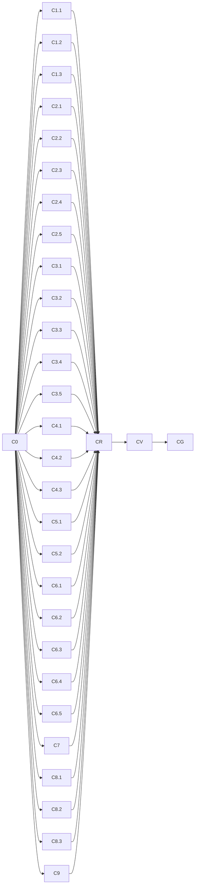

# 逐组件审计路线图（Component Audit Roadmap）

> 最后更新：2026-08-06
> 来源：用户要求"逐个组件完成一次审查"（上轮 `audit-remediation` 粒度在"包簇 x 维度"，未到组件级）
> 细则：`docs/audits/component-audit-checklist.md`（18 维清单 + 审计卡模板 + 裁决规则）
> Mission：`missions/component-audit.json`

## 目的

本文件是 nop-chaos-flux 的**逐组件深度审计 + 自动修复**路线图，按 `docs/backlog/00-roadmap-authoring-guide.md` 规范编排。与上轮 `docs/backlog/audit-remediation-roadmap.md`（10 包簇 x 7 审计层 + 工具扫描，已 done）的关系：**本路线图把审计单元下沉到单个 renderer 组件**，每个组件一张审计卡（`docs/audits/per-component/<type>.md`），逐一完成 18 维契约审查，并对发现的 P0/P1 缺陷**自动修复**（test-first + 回归测试 + 自动验证门禁，审计与修复之间无人工握手），同时完成真实浏览器宿主场景验证。自动修复机制见下文「自动修复机制」节。

## Work Item Status

> **全文件唯一的动态状态区。** 状态流转：draft review 通过 → `todo` 改 `planned`；closure audit 通过 → `planned` 改 `done`（不得提前）。一个 work item = 一个 execution plan 的交付范围（审计一个组件族 + 逐组件审计卡 + **P0/P1 自动修复** + 回归测试 + closure）。**组件族是 plan 单位、组件是审计卡单位**（micro-plan 反模式）；若单个 work item 无法被一个 plan 收口，在 C0 后经人工确认拆分。

| Work Item                                                                                                                                                                                                                                                                                                                                                                                                                                                                                                                                                                                                                                                                                                                                                                                                                                                                                                                                                                                                                                                                                                       | Status                   | Owner Doc                                                                                                                                                                                                                                                                                                                            | 覆盖组件 | Dependencies                                                                                                                                                                                                                                                                                                                                                                                                                                                                                                                                                                                                                                                                                                                                                                                                  |
| --------------------------------------------------------------------------------------------------------------------------------------------------------------------------------------------------------------------------------------------------------------------------------------------------------------------------------------------------------------------------------------------------------------------------------------------------------------------------------------------------------------------------------------------------------------------------------------------------------------------------------------------------------------------------------------------------------------------------------------------------------------------------------------------------------------------------------------------------------------------------------------------------------------------------------------------------------------------------------------------------------------------------------------------------------------------------------------------------------------- | ------------------------ | ------------------------------------------------------------------------------------------------------------------------------------------------------------------------------------------------------------------------------------------------------------------------------------------------------------------------------------ | -------- | ------------------------------------------------------------------------------------------------------------------------------------------------------------------------------------------------------------------------------------------------------------------------------------------------------------------------------------------------------------------------------------------------------------------------------------------------------------------------------------------------------------------------------------------------------------------------------------------------------------------------------------------------------------------------------------------------------------------------------------------------------------------------------------------------------------- | --- | ------------------------------------------------------------------------------------------------------------------------------------------------------------------------------------------------------------------------------------------------------------------------------------------------------------------------ |
| C0. 编排基线（组件清单与注册定义/amis-baseline-matrix 核对、全量基线重跑、审计卡模板、工具基线、保护区域地图）                                                                                                                                                                                                                                                                                                                                                                                                                                                                                                                                                                                                                                                                                                                                                                                                                                                                                                                                                                                                  | `done`                   | component-audit-checklist.md                                                                                                                                                                                                                                                                                                         | —        | —                                                                                                                                                                                                                                                                                                                                                                                                                                                                                                                                                                                                                                                                                                                                                                                                             |
| C1.1 basic 结构核心族（page/container/flex/tabs/dialog/drawer）                                                                                                                                                                                                                                                                                                                                                                                                                                                                                                                                                                                                                                                                                                                                                                                                                                                                                                                                                                                                                                                 | `done`                   | component-audit-checklist.md                                                                                                                                                                                                                                                                                                         | 6        | C0                                                                                                                                                                                                                                                                                                                                                                                                                                                                                                                                                                                                                                                                                                                                                                                                            |
| C1.2 basic 结构扩展族（fragment/loop/recurse/reaction/scope-debug/dynamic-renderer）                                                                                                                                                                                                                                                                                                                                                                                                                                                                                                                                                                                                                                                                                                                                                                                                                                                                                                                                                                                                                            | `done`                   | component-audit-checklist.md                                                                                                                                                                                                                                                                                                         | 6        | C0                                                                                                                                                                                                                                                                                                                                                                                                                                                                                                                                                                                                                                                                                                                                                                                                            |
| C1.3 basic 原子显示族（text/button/badge/icon）                                                                                                                                                                                                                                                                                                                                                                                                                                                                                                                                                                                                                                                                                                                                                                                                                                                                                                                                                                                                                                                                 | `done`                   | component-audit-checklist.md                                                                                                                                                                                                                                                                                                         | 4        | C0                                                                                                                                                                                                                                                                                                                                                                                                                                                                                                                                                                                                                                                                                                                                                                                                            |
| C2.1 form shell（form/fieldset + hidden-field 策略）                                                                                                                                                                                                                                                                                                                                                                                                                                                                                                                                                                                                                                                                                                                                                                                                                                                                                                                                                                                                                                                            | `done`                   | component-audit-checklist.md                                                                                                                                                                                                                                                                                                         | 2        | C0                                                                                                                                                                                                                                                                                                                                                                                                                                                                                                                                                                                                                                                                                                                                                                                                            |
| C2.2 form 文本输入族（input-text/input-password/input-email/input-number/textarea）                                                                                                                                                                                                                                                                                                                                                                                                                                                                                                                                                                                                                                                                                                                                                                                                                                                                                                                                                                                                                             | `done`                   | component-audit-checklist.md                                                                                                                                                                                                                                                                                                         | 5        | C0                                                                                                                                                                                                                                                                                                                                                                                                                                                                                                                                                                                                                                                                                                                                                                                                            |
| C2.3 form 选择控件族（select/checkbox/checkbox-group/radio-group/switch + button-group-select）                                                                                                                                                                                                                                                                                                                                                                                                                                                                                                                                                                                                                                                                                                                                                                                                                                                                                                                                                                                                                 | `done`                   | component-audit-checklist.md                                                                                                                                                                                                                                                                                                         | 6        | C0                                                                                                                                                                                                                                                                                                                                                                                                                                                                                                                                                                                                                                                                                                                                                                                                            |
| C2.4 form 日期族（input-date/input-datetime/input-time/date-range/input-month/input-quarter/input-year）                                                                                                                                                                                                                                                                                                                                                                                                                                                                                                                                                                                                                                                                                                                                                                                                                                                                                                                                                                                                        | `done`                   | component-audit-checklist.md                                                                                                                                                                                                                                                                                                         | 7        | C0                                                                                                                                                                                                                                                                                                                                                                                                                                                                                                                                                                                                                                                                                                                                                                                                            |
| C2.5 form markdown-editor                                                                                                                                                                                                                                                                                                                                                                                                                                                                                                                                                                                                                                                                                                                                                                                                                                                                                                                                                                                                                                                                                       | `done`                   | component-audit-checklist.md                                                                                                                                                                                                                                                                                                         | 1        | C0                                                                                                                                                                                                                                                                                                                                                                                                                                                                                                                                                                                                                                                                                                                                                                                                            |
| C3.1 form-advanced 复合输入族（combo/input-table/transfer/picker）                                                                                                                                                                                                                                                                                                                                                                                                                                                                                                                                                                                                                                                                                                                                                                                                                                                                                                                                                                                                                                              | `done`                   | component-audit-checklist.md                                                                                                                                                                                                                                                                                                         | 4        | C0                                                                                                                                                                                                                                                                                                                                                                                                                                                                                                                                                                                                                                                                                                                                                                                                            |
| C3.2 form-advanced 组合字段族（object-field/array-field/detail-field/detail-view/variant-field）                                                                                                                                                                                                                                                                                                                                                                                                                                                                                                                                                                                                                                                                                                                                                                                                                                                                                                                                                                                                                | `done`                   | component-audit-checklist.md                                                                                                                                                                                                                                                                                                         | 5        | C0（执行证据，父 plan completed + closure audit pass（fresh session CLOSURE_VERIFY，2026-08-03），证据见 `docs/plans/2026-08-03-0921-2-c3-2-form-advanced-composite-field-family-audit.md`）                                                                                                                                                                                                                                                                                                                                                                                                                                                                                                                                                                                                                  |
| C3.3 condition-builder                                                                                                                                                                                                                                                                                                                                                                                                                                                                                                                                                                                                                                                                                                                                                                                                                                                                                                                                                                                                                                                                                          | `done`                   | component-audit-checklist.md                                                                                                                                                                                                                                                                                                         | 1        | C0（执行证据，父 plan completed + closure audit pass（fresh session CLOSURE_VERIFY，2026-08-03），证据见 `docs/plans/2026-08-03-0921-3-c3-3-condition-builder-audit.md`）                                                                                                                                                                                                                                                                                                                                                                                                                                                                                                                                                                                                                                     |
| C3.4 form-advanced 轻量编辑族（tag-list/key-value/array-editor/icon-picker）                                                                                                                                                                                                                                                                                                                                                                                                                                                                                                                                                                                                                                                                                                                                                                                                                                                                                                                                                                                                                                    | `done`                   | component-audit-checklist.md                                                                                                                                                                                                                                                                                                         | 4        | C0（执行证据，父 plan completed + closure audit pass（fresh session CLOSURE_VERIFY，2026-08-03），证据见 `docs/plans/2026-08-03-1616-1-c3-4-form-advanced-lightweight-editor-family-audit.md`）                                                                                                                                                                                                                                                                                                                                                                                                                                                                                                                                                                                                               |
| C3.5 form-advanced 媒体与富文本族（editor/input-file/input-image/tree-select/input-tree）                                                                                                                                                                                                                                                                                                                                                                                                                                                                                                                                                                                                                                                                                                                                                                                                                                                                                                                                                                                                                       | `done`                   | component-audit-checklist.md                                                                                                                                                                                                                                                                                                         | 5        | C0（执行证据，父 plan completed + closure audit pass（fresh session CLOSURE_VERIFY，2026-08-03），证据见 `docs/plans/2026-08-03-1616-2-c3-5-form-advanced-media-rich-text-family-audit.md`）                                                                                                                                                                                                                                                                                                                                                                                                                                                                                                                                                                                                                  |
| C4.1 table                                                                                                                                                                                                                                                                                                                                                                                                                                                                                                                                                                                                                                                                                                                                                                                                                                                                                                                                                                                                                                                                                                      | `done`                   | component-audit-checklist.md                                                                                                                                                                                                                                                                                                         | 1        | C0（执行证据，父 plan completed + closure audit pass（fresh session CLOSURE_VERIFY，2026-08-04）：卡 closed + P1×7/P2×3 fixed + 宿主 3/3 + bug 78 + 全量 typecheck/build/lint/test 绿，证据见 `docs/plans/2026-08-03-1616-3-c4-1-table-audit.md` Closure Audit Evidence 与 `docs/logs/2026/08-03.md` C4.1 closure-audit 节）                                                                                                                                                                                                                                                                                                                                                                                                                                                                                  |
| C4.2 crud                                                                                                                                                                                                                                                                                                                                                                                                                                                                                                                                                                                                                                                                                                                                                                                                                                                                                                                                                                                                                                                                                                       | `done`                   | component-audit-checklist.md                                                                                                                                                                                                                                                                                                         | 1        | C0（执行证据，父 plan completed + closure audit pass（fresh session CLOSURE_VERIFY，2026-08-04），证据见 `docs/plans/2026-08-04-0043-1-c4-2-crud-audit.md` Closure Audit Evidence 与 `docs/logs/2026/08-04.md` C4.2 节；行状态由 C4.3 audit 一并机械同步）                                                                                                                                                                                                                                                                                                                                                                                                                                                                                                                                                    |
| C4.3 data 其余（tree/chart/list/pagination/statistics/data-source）                                                                                                                                                                                                                                                                                                                                                                                                                                                                                                                                                                                                                                                                                                                                                                                                                                                                                                                                                                                                                                             | `done`                   | component-audit-checklist.md                                                                                                                                                                                                                                                                                                         | 6        | C0（执行证据，父 plan completed + closure audit pass（fresh session CLOSURE_VERIFY，2026-08-04）：6 卡 closed + P1×3/P2×8 fixed + 宿主 5/5（含 bug 73 模式专项）+ 720 unit/58 workspace/31 typecheck/build/lint 全绿，证据见 `docs/plans/2026-08-04-0043-2-c4-3-data-rest-family-audit.md` Closure Audit Evidence 与 `docs/logs/2026/08-04.md` C4.3 节）                                                                                                                                                                                                                                                                                                                                                                                                                                                      |
| C5.1 layout 网格与流程族（grid/collapse/wizard）                                                                                                                                                                                                                                                                                                                                                                                                                                                                                                                                                                                                                                                                                                                                                                                                                                                                                                                                                                                                                                                                | `done`                   | component-audit-checklist.md                                                                                                                                                                                                                                                                                                         | 3        | C0（执行证据，父 plan completed + closure audit pass（fresh session CLOSURE_VERIFY，2026-08-04）：3 卡 closed + P1×4/P2×8 fixed + 宿主 5/5（含 bug 73 模式专项 host-wizard-gate/host-wizard-dialog）+ 81 unit/58 workspace/31 typecheck/build/lint 全绿，证据见 `docs/plans/2026-08-04-0043-3-c5-1-layout-grid-flow-family-audit.md` Closure Audit Evidence 与 `docs/logs/2026/08-04.md` C5.1 节）                                                                                                                                                                                                                                                                                                                                                                                                            |
| C5.2 layout 动作组族（button-group/dropdown-button/steps/timeline）                                                                                                                                                                                                                                                                                                                                                                                                                                                                                                                                                                                                                                                                                                                                                                                                                                                                                                                                                                                                                                             | `done`                   | component-audit-checklist.md                                                                                                                                                                                                                                                                                                         | 4        | C0（执行证据，父 plan completed + closure audit pass（fresh session CLOSURE_VERIFY，2026-08-04）：4 卡 closed + P1×4/P2×12 fixed + 宿主 5/5（含 bug 73 模式专项 host-dd-row 行 scope 污染复验）+ 93 unit/58 workspace/31 typecheck/build/lint 全绿，证据见 `docs/plans/2026-08-04-0841-1-c5-2-layout-action-family-audit.md` Closure Audit Evidence 与 `docs/logs/2026/08-04.md` C5.2 节）                                                                                                                                                                                                                                                                                                                                                                                                                    |
| C6.1 content 文本类（markdown/html/json-view/link/image）                                                                                                                                                                                                                                                                                                                                                                                                                                                                                                                                                                                                                                                                                                                                                                                                                                                                                                                                                                                                                                                       | `done`                   | component-audit-checklist.md                                                                                                                                                                                                                                                                                                         | 5        | C0（执行证据，父 plan completed + closure audit pass（fresh session CLOSURE_VERIFY，2026-08-04）：5 卡 closed + P0×2（markdown INV-1 src fetch 直调浏览器 fetch → env.fetcher；link href javascript: URI → isSafeNavigationUrl 白名单）/P1×1（image src 更新 sticky errored）/P2×4 fixed + 宿主 5/5（含 bug 73 模式专项 host-md-sanitize/host-html-sanitize 动态内容 sanitize 复验）+ 248 unit/58 workspace/31 typecheck/build/lint 全绿 + e2e 零新增失败，证据见 `docs/plans/2026-08-04-0841-2-c6-1-content-text-family-audit.md` Closure Audit Evidence 与 `docs/logs/2026/08-04.md` C6.1 节）                                                                                                                                                                                                              |
| C6.2 content 状态反馈类（card/cards/empty/progress/spinner/separator）                                                                                                                                                                                                                                                                                                                                                                                                                                                                                                                                                                                                                                                                                                                                                                                                                                                                                                                                                                                                                                          | `done`                   | component-audit-checklist.md                                                                                                                                                                                                                                                                                                         | 6        | C0（执行证据，父 plan completed + 执行证据已交付（4 Phase 全 completed、6 卡 closed + P1×2 fixed、宿主 7/7 含 bug 73 专项 host-cards-action、254 unit/58 workspace/31 typecheck/build/lint 全绿 + 相关 e2e 零新增失败），closure-audit pass 由 mission-driver CLOSURE_VERIFY fresh session 执行后收口，证据见 `docs/plans/2026-08-04-0841-3-c6-2-content-status-feedback-family-audit.md` Closure 节与 `docs/logs/2026/08-04.md` C6.2 节）                                                                                                                                                                                                                                                                                                                                                                    |
| C6.3 content 值映射类（alert/mapping/status）                                                                                                                                                                                                                                                                                                                                                                                                                                                                                                                                                                                                                                                                                                                                                                                                                                                                                                                                                                                                                                                                   | `done`                   | component-audit-checklist.md                                                                                                                                                                                                                                                                                                         | 3        | C0（执行证据，父 plan completed + closure audit pass（mission-driver CLOSURE_VERIFY fresh session，2026-08-04），证据见 `docs/plans/2026-08-04-1757-1-c6-3-content-value-mapping-family-audit.md` Closure Audit Evidence 与 `docs/logs/2026/08-04.md` C6.3 节；roadmap 行翻转由 2026-08-06 mission-driver 机械同步）                                                                                                                                                                                                                                                                                                                                                                                                                                                                                          |
| C6.4 content 媒体类（audio/video/carousel/qrcode）                                                                                                                                                                                                                                                                                                                                                                                                                                                                                                                                                                                                                                                                                                                                                                                                                                                                                                                                                                                                                                                              | `done`                   | component-audit-checklist.md                                                                                                                                                                                                                                                                                                         | 4        | C0（执行证据，父 plan completed + closure audit pass（fresh session CLOSURE_VERIFY，2026-08-05）：4 卡 closed + P0×0/P1×1 fixed（carousel onChange eventContracts test-first）/P2×10 fixed（lab 页 ×4 补维度 18 缺口、scope 注入、测试盲区 ×3、design.md ×2）+ 宿主 4/4（含 bug 73 模式专项 host-media-dialog 媒体 dialog 内加载 + 错误回退）+ 268 unit/58 workspace/31 typecheck/build/lint 全绿 + 相关 e2e 零新增失败（c6-4-host-surfaces 4/4、w4a-multimedia 9/9），证据见 `docs/plans/2026-08-04-1757-2-c6-4-content-media-family-audit.md` Closure Audit Evidence 与 `docs/logs/2026/08-04.md` C6.4 节）                                                                                                                                                                                                 |
| C6.5 diff-view                                                                                                                                                                                                                                                                                                                                                                                                                                                                                                                                                                                                                                                                                                                                                                                                                                                                                                                                                                                                                                                                                                  | `done`                   | component-audit-checklist.md                                                                                                                                                                                                                                                                                                         | 1        | C0（执行证据，父 plan completed + closure audit pass（fresh session CLOSURE_VERIFY，2026-08-05）：1 卡 closed + P0×0/P1×10 fixed（data-diff-type=hunk、data-diff-inline add/delete、three-column onLineClick、CX-9 reaction ready()、activeFileIndex 下界钳制、假绿 ×3 重写、eventContracts、handle componentRegistry 注册、onHunkExpand 语义、事件 ctx 注入）/P2×4 fixed（lab 页补维度 18 缺口、aria-label、design.md 漂移、测试加固）+ 宿主 5/5（含 bug 73 模式专项 host-diff-dialog dialog 内 diff-view + 行点击）+ 279 unit/58 workspace/31 typecheck/build/lint 全绿 + 相关 e2e 零新增失败（c6-5-host-surfaces 5/5、diff-demo 5/5、diff-perf 1/1 实测 1067ms < 5000ms），证据见 `docs/plans/2026-08-04-1757-3-c6-5-diff-view-audit.md` Closure Audit Evidence 与 `docs/logs/2026/08-04.md` C6.5 节）     |
| C7 mobile 交互族（pull-refresh/infinite-scroll/swipe-cell/countdown/notice-bar）                                                                                                                                                                                                                                                                                                                                                                                                                                                                                                                                                                                                                                                                                                                                                                                                                                                                                                                                                                                                                                | `done`                   | component-audit-checklist.md                                                                                                                                                                                                                                                                                                         | 5        | C0（执行证据，父 plan `2026-08-05-1314-1` completed + closure audit pass（fresh session CLOSURE_VERIFY，2026-08-05，证据见 `docs/plans/2026-08-05-1314-1-c7-mobile-interaction-family-audit.md` Closure Audit Evidence）：5 卡 closed + P0×0/P1×9 fixed（事件派发 evaluationBindings ctx ×6、eventContracts ×7、**NEW-C7-02 swipe-cell 操作区真实浏览器不可见 bug（bug 73 模式，docs/bugs/87）**）+ P2×8 fixed（lab 页 ×5 补维度 18 缺口、design payload/prefix-suffix 文档同步）+ 宿主 6/6（bug 73 专项 host-pr-dialog/host-is-dialog 触摸组件 dialog 内驱动 + host-sw-action 行内 onAction + host-cd-finish + host-is-retry + host-nb-close/click）+ 170 unit/32 workspace typecheck/build/lint + 59 test tasks 全绿 + 相关 e2e 零新增失败（c7-host-surfaces 6/6、mobile 7/1skip、m5 21、m2 9、smoke 86）） |
| C8.1 ai 会话主链（ai-chat/ai-message-list/ai-bubble/ai-sender/ai-conversations）                                                                                                                                                                                                                                                                                                                                                                                                                                                                                                                                                                                                                                                                                                                                                                                                                                                                                                                                                                                                                                | `done`                   | component-audit-checklist.md                                                                                                                                                                                                                                                                                                         | 5        | C0（执行证据，父 plan `2026-08-05-1314-2` 4 Phase 全 completed + 5 卡 closed（P0×0/P1×3/P2×6/P3×1，P1/P2 全部同 plan 修复）+ 宿主 c8-1-host-surfaces 5/5（含 bug 73 专项 host-ai-dialog/host-ai-hitl）+ ai 包 479 单测 + workspace typecheck/build/lint 32/32 + test 59/59 + ai 族 e2e 回归 29/29 + e2e pre-existing 复验（ai-chat timestamp + ai-rich-text-sender ×5，live 已由 commit abcecfa9 修复）；CX-10 事后回写插入；CLOSURE_VERIFY closure-audit 已 pass（2026-08-05，证据见 plan Closure Audit Evidence）翻转 done）                                                                                                                                                                                                                                                                                |
| C8.2 ai 工具内容族（ai-tool-call/ai-attachments/ai-citations/ai-feedback/ai-token-usage）                                                                                                                                                                                                                                                                                                                                                                                                                                                                                                                                                                                                                                                                                                                                                                                                                                                                                                                                                                                                                       | `done`                   | component-audit-checklist.md                                                                                                                                                                                                                                                                                                         | 5        | C0（执行证据，父 plan `2026-08-05-1314-3` 4 Phase 全 completed + 5 卡 closed（P0×0/P1×4/P2×8，P1/P2 全部同 plan 修复）+ 宿主 c8-2-host-surfaces 7/7（含 bug 73 专项 host-tool-dialog/host-attach-dialog + HITL 死点击专项 host-hitl-dead）+ ai 包 495 单测 + workspace typecheck/build/lint 32/32 + test 59/59 + ai 族 e2e 回归 42/42 + smoke 93/93 + e2e 零新增失败；CX-10 事后回写延伸覆盖（ai-feedback/ai-attachments/ai-citations/ai-token-usage 10 处派发）；CLOSURE_VERIFY closure-audit pass 后翻转 done（证据见 plan Closure Audit Evidence））                                                                                                                                                                                                                                                       |
| C8.3 ai 增强族（ai-prompts/ai-suggestions/ai-voice-input/ai-welcome）                                                                                                                                                                                                                                                                                                                                                                                                                                                                                                                                                                                                                                                                                                                                                                                                                                                                                                                                                                                                                                           | `done`                   | component-audit-checklist.md                                                                                                                                                                                                                                                                                                         | 4        | C0（执行证据，父 plan `2026-08-05-1721-1` 4 Phase 全 completed + 4 卡 closed（P0×0/P1×3/P2×8/P3×1，P1/P2 全部同 plan 修复）+ 宿主 c8-3-host-surfaces 4/4（含 bug 73 专项 host-prompts-dlg）+ ai 包 509 单测 + workspace typecheck/build/lint 32/32 + test 59/59 + smoke 110/110 + component-lab 全量 326 passed（2 failed 为 C7 记录在案 pre-existing，clean HEAD 复现）+ ai 族回归 34/34 + e2e 零新增失败；CX-11 公共层修复（openDialog 表面 args schema body 静态化，docs/bugs/89）；closure-audit 独立 fresh sub-agent pass（task `ses_02e102aa3ffeM6jl2rnsa9et6D`，证据见 plan Closure Audit Evidence 与 `docs/logs/2026/08-05.md` C8.3 节）翻转 done）                                                                                                                                                   |
| C9 scheduling 族（gantt/kanban/calendar/barcode-input）                                                                                                                                                                                                                                                                                                                                                                                                                                                                                                                                                                                                                                                                                                                                                                                                                                                                                                                                                                                                                                                         | `done`                   | component-audit-checklist.md                                                                                                                                                                                                                                                                                                         | 4        | C0（执行证据，父 plan `2026-08-05-1721-2` 4 Phase 全 completed + 4 卡 closed（P0×1/P1×15/P2×13/P3×13，P0/P1 全部同 plan 修复）+ 宿主 c9-host-surfaces 4/4（含 bug 73 专项 host-gantt-dialog/host-kanban-drag/host-cal-load）+ scheduling 854/854 单测 + workspace typecheck/build/lint 32/32 + test 59/59 + gantt-bars-and-links:132 隔离 15/15×3 复验（machine-load watch-only 归因）+ 相关 e2e 45 绿 + smoke/navigation 111/111 零新增失败；CX-12 家族共性修复（事件 ctx + reaction 接线）；closure-audit 独立 fresh sub-agent pass（task `ses_02d58a525ffe8vUs0IQnYTw0Mq`，证据见 plan Closure Audit Evidence 与 `docs/logs/2026/08-05.md` C9 节）翻转 done）                                                                                                                                              |
| CX-1 共性重构：schema-renderer page data 同步 effect 在 StrictMode 重跑时以 no-op replace 清掉 page scope 写入（statusPath 发布 / page.data init patch / action 写 page scope）；C1.1 已按 §7b 当前 plan 内修复（行为修复，非结构性），此处事后回写留痕                                                                                                                                                                                                                                                                                                                                                                                                                                                                                                                                                                                                                                                                                                                                                                                                                                                         | `done`                   | component-audit-checklist.md                                                                                                                                                                                                                                                                                                         | —        | C1.1（执行证据，父 plan completed + closure audit pass，§7b 事后回写 2026-08-03 C2.3 核对标 done）                                                                                                                                                                                                                                                                                                                                                                                                                                                                                                                                                                                                                                                                                                            |
| CX-2 共性重构：@base-ui/react 1.3.0 modal dialog/drawer focus-guard 回绕真机失效（Tab 逃逸到 body/页面 chrome）→ ui 层确定性 Tab wrap（`packages/ui/src/components/ui/wrap-surface-tab-focus.ts`，Dialog/Drawer popup 挂载）；C1.1 已按 §7b 当前 plan 内修复（行为修复，非结构性），此处事后回写留痕                                                                                                                                                                                                                                                                                                                                                                                                                                                                                                                                                                                                                                                                                                                                                                                                            | `done`                   | component-audit-checklist.md                                                                                                                                                                                                                                                                                                         | —        | C1.1（执行证据，父 plan completed + closure audit pass，§7b 事后回写 2026-08-03 C2.3 核对标 done）                                                                                                                                                                                                                                                                                                                                                                                                                                                                                                                                                                                                                                                                                                            |
| CX-3 共性重构：basic 注册项 defaultSchema 补齐——recurse/reaction/dynamic-renderer 三组件注册项缺 `defaultSchema`（loop/fragment/scope-debug 有），作者插入/设计器基线不完整；C1.2 已按 §7b 当前 plan 内修复（纯注册项补齐，行为修复，非结构性），此处事后回写留痕；**C1.3 同根因追加**：badge/icon 两组件注册项同缺 defaultSchema（badge 另缺 fields: text/level），已在 C1.3 当前 plan 内一并补齐（badge `{type:'badge',text:'Badge'}` + fields、icon `{type:'icon',icon:'star'}`），证据见 `docs/plans/2026-08-03-0105-1-c1-3-basic-atomic-display-family-audit.md`                                                                                                                                                                                                                                                                                                                                                                                                                                                                                                                                           | `done`                   | component-audit-checklist.md                                                                                                                                                                                                                                                                                                         | —        | C1.2（执行证据）+ C1.3（执行证据），父 plan 均 completed + closure audit pass，§7b 事后回写 2026-08-03 C2.3 核对标 done                                                                                                                                                                                                                                                                                                                                                                                                                                                                                                                                                                                                                                                                                       |
| CX-4 共性重构：文本输入族（input-text/input-email/input-password/textarea）根 type marker 缺失（`nop-input-text`/`nop-input-email`/`nop-input-password`/`nop-textarea` vs 各 design.md §10 承诺；input-number 有 `nop-input-number`）——根因在 `input.tsx` `createInputRenderer` 共享工厂与 `textarea-renderer.tsx` 未输出 type marker（C1.3 badge P1-1 同模式）；C2.2 已按 §7b 当前 plan 内修复（`nop-input-${inputType}` + `nop-textarea`，bare/InputGroup/textarea footer 双路径全覆盖），此处事后回写留痕；另含 input-suggest 组合框 ARIA 契约落地（role=combobox/listbox + aria-expanded/controls/activedescendant）与 Base UI popover 焦点契约修复（initialFocus=false）证据见 `docs/plans/2026-08-03-0105-3-c2-2-form-text-input-family-audit.md`                                                                                                                                                                                                                                                                                                                                                         | `done`                   | component-audit-checklist.md                                                                                                                                                                                                                                                                                                         | —        | C2.2（执行证据，父 plan completed + closure audit pass，§7b 事后回写 2026-08-03 C2.3 核对标 done）                                                                                                                                                                                                                                                                                                                                                                                                                                                                                                                                                                                                                                                                                                            |
| CX-5 共性重构：选择控件族根 type marker 缺失（checkbox/switch/radio-group/checkbox-group 根仅 `nop-*-wrapper` 无 design.md §10 承诺的 `nop-checkbox`/`nop-switch`/`nop-radio-group`/`nop-checkbox-group` type marker；C1.3 badge/C2.2 input-text 同模式，违反 renderer-markers-and-selectors.md §Root Marker Rules type-only）——根因在选择控件 renderer 的根 class 书写（input-choice-renderers.tsx:565/:620/:680、checkbox-group-renderer.tsx:125）；C2.3 已按 §7b 当前 plan 内修复（根同时输出 type marker + `-wrapper`，DOM 契约 data-slot 不变），此处事后回写留痕；证据见 `docs/plans/2026-08-03-0517-1-c2-3-form-choice-control-family-audit.md`                                                                                                                                                                                                                                                                                                                                                                                                                                                          | `done`                   | component-audit-checklist.md                                                                                                                                                                                                                                                                                                         | —        | C2.3（执行证据，父 plan completed + closure audit pass（task `ses_03b60f3d0ffe0WzxJ5baVcQWAW`），§7b 事后回写 2026-08-03 标 done）                                                                                                                                                                                                                                                                                                                                                                                                                                                                                                                                                                                                                                                                            |
| CX-6 共性重构：选择控件 single 模式 number/boolean option value 选中态 echo 破坏（select/radio-group/button-group-select single 用 stringAdapter 把表单值字符串化，与 `Object.is(option.value, value)` 选项匹配契约冲突 → 数值/布尔选项永无选中态；radio 侧 Base UI `checkedValue === value` 严格匹配同受影响）——根因在选择字段共享的值适配器选择（input-choice-renderers.tsx:196/:648、button-group-select-renderer.tsx:37）；C2.3 已按 §7b 当前 plan 内修复（choiceSingleAdapter 值保真适配器 + radio-group selectedValue null/undefined→'' 防 Base UI uncontrolled→controlled 翻转，test-first choice-native-value-echo.test.tsx），此处事后回写留痕；证据见 `docs/plans/2026-08-03-0517-1-c2-3-form-choice-control-family-audit.md`                                                                                                                                                                                                                                                                                                                                                                         | `done`                   | component-audit-checklist.md                                                                                                                                                                                                                                                                                                         | —        | C2.3（执行证据，父 plan completed + closure audit pass（task `ses_03b60f3d0ffe0WzxJ5baVcQWAW`），§7b 事后回写 2026-08-03 标 done）                                                                                                                                                                                                                                                                                                                                                                                                                                                                                                                                                                                                                                                                            |
| CX-7 共性重构：日期族日历网格 locale 未随 flux 语言切换（react-day-picker 默认 en-US：月/周标题与导航文案在 zh-CN 运行时仍英文；`useFluxTranslation` 语言映射未传入 Calendar）——根因在共享 Calendar 使用点（`date-field-control.tsx` 与 `date-range-renderer.tsx`，input-date/input-datetime/date-range 3 组件受影响）；C2.4 已按 §7b 当前 plan 内修复（`useFluxTranslation().i18n.language` → `react-day-picker/locale` enUS/zhCN 映射传入 Calendar，zh-CN 周一起始，test-first date-calendar-locale.test.tsx 先红后绿；顺带发现 useFluxTranslation t() 为命名空间相对 key 语义，barcode-input 的 `flux.*` 前缀用法为同型潜伏问题，记 CR 归集），此处事后回写留痕；证据见 `docs/plans/2026-08-03-0517-2-c2-4-form-date-family-audit.md`                                                                                                                                                                                                                                                                                                                                                                        | `done`                   | component-audit-checklist.md                                                                                                                                                                                                                                                                                                         | —        | C2.4（执行证据，父 plan completed + closure audit pass（fresh session CLOSURE_VERIFY，2026-08-03），§7b 事后回写标 done）                                                                                                                                                                                                                                                                                                                                                                                                                                                                                                                                                                                                                                                                                     |
| CX-8 共性重构：复合字段族 `readOnly`/`disabled` 不传播到项/行内嵌字段（combo/input-table/array-field/object-field 的 createItemScope 仅发布 scope `readOnly` 路径（array-field-runtime.ts:11,23），项内嵌字段 presentation 只看自身 schema props（useFieldPresentation field-presentation.tsx:51）→ 复合组件锁定时子字段仍可编辑并写回，四态契约不成立，宿主场景实证）——根因在复合字段族的项布局传播模式；C3.1 已按 §7b 当前 plan 内修复 combo/input-table（FormLayoutContext.Provider staticReadOnly 经既有 form-layout 机制传播，test-first composite-readonly-propagation.test.tsx 4 用例先红后绿），此处事后回写留痕；**C3.2/C3.3 的 array-field/object-field/detail-field 同型缺口按同机制修复**；证据见 `docs/plans/2026-08-03-0921-1-c3-1-form-advanced-composite-input-family-audit.md`                                                                                                                                                                                                                                                                                                                 | `done`                   | component-audit-checklist.md                                                                                                                                                                                                                                                                                                         | —        | C3.1（执行证据，父 plan completed + closure audit pass（fresh session CLOSURE_VERIFY，2026-08-03），§7b 事后回写标 done）                                                                                                                                                                                                                                                                                                                                                                                                                                                                                                                                                                                                                                                                                     |
| CX-9 共性重构：renderer-owned reaction 结果捕获与 scope 投影通道（`kind:'reaction'` 字段组件）——`dependsOn` 反应式 force() 触发的结果被反应注册表吞掉（fetch 发出但渲染器拿不到 rows，crud loadAction 实证 bug 79）；且 includeScope 类按 dispatch scope own 数据提取的契约对「虚拟 scope」组件失效——根因在 `renderer-reaction-handle.ts`（flux-runtime 公共层，`__setLoadCallbacks`/`__setScopeOverride`/`__setIgnoreWritesTo` 扩展点）+ `reaction-handle-proxy.ts`（flux-react 转发）+ `ReactionHandle.dispatch` ctx 补 scope（flux-core），影响 ≥2 组件面（crud loadAction 已接线；content toggleViewType/setViewType 等 kind:'reaction' 字段同受益）                                                                                                                                                                                                                                                                                                                                                                                                                                                        | `done`                   | component-audit-checklist.md                                                                                                                                                                                                                                                                                                         | —        | C4.2（执行证据，父 plan `2026-08-04-0043-1` completed + closure audit pass（CLOSURE_VERIFY 2026-08-04）；按 §7b 事后回写插入，父 plan closure audit pass 后标 done——由 C4.3 audit 一并机械同步）                                                                                                                                                                                                                                                                                                                                                                                                                                                                                                                                                                                                              |
| CX-10 共性重构：ai 会话主链族 schema 事件派发 evaluationBindings ctx 补齐（C7 bug-83 家族约定缺失——`onResponseComplete`/`onError`/`onAbort`/`onConversationChange`/`onBranchChange`/`onSubmit`/`onCancel`/`onChange`/`onItemClick`/`onItemRename`/`onItemDelete`/`onCreate`/`onApproval` 13 处派发均单参，action args 模板读不到 payload 键；实测 `${event.x}` 亦不可解析——runtime args 求值仅合并 `evaluationBindings`+scope（`getEvaluationScope`，flux-action-core/src/action-core.ts:206-208））；**C8.1 已按 §7b 当前 plan 内修复**（ai-chat/ai-message-list/ai-bubble/ai-sender/ai-conversations + ai-tool-call onApproval 补 `{ event, evaluationBindings, scope }` ctx，test-first c8-1-host-surfaces.spec.ts 实证 `${id}`/`${action}`/`${text}`/`${conversationId}` 解析）；\*\*C8.2 事后回写延伸覆盖：ai-feedback onAction、ai-attachments onChange/onError/onUpload、ai-citations onSourceClick、ai-token-usage onClick（原空 payload → `{ type:'ai:token-usage-click', usage }` + ctx）共 10 处派发同型补齐（test-first ai-feedback.test.tsx 等 5 文件 + c8-2-host-surfaces.spec.ts 实证 `${action} | ${message.id}`/`${index} | ${source.title}`/`${usage.total_tokens}` 解析，docs/bugs/88）**；跨包文档口径同步：renderer-runtime.md Event Passthrough Contract 校正（evaluationBindings 裸键约定，`event` 仅用于 preventDefault 求值）+ layout-selection-guide/graph design.md 示例改裸键——此处事后回写留痕（CX-10 依赖 C8.1，C8.1 closure audit pass 后标 done） | `done`   | component-audit-checklist.md                                                                                                                                                                                                                                                                                                                                                                                                                                                                                                                                                                                                                                                                                                                                                                                  | —   | C8.1 + C8.2（执行证据：plan `2026-08-05-1314-2` Phase 2/3 + c8-1-host-surfaces.spec.ts 5/5 + ai 包 479 unit 全绿；C8.2 延伸覆盖证据：plan `2026-08-05-1314-3` Phase 2 + c8-2-host-surfaces.spec.ts 7/7 + ai 包 495 unit 全绿 + docs/bugs/88；按 §7b 事后回写插入，父 plan closure audit 均 pass（2026-08-05）翻转 done） |
| CX-11 共性重构：surface args 内嵌 schema body 急切求值导致 dialog/drawer 静默打不开（`openDialog`/`openDrawer` 的 `body` 为 schema 值，但 flux-compiler `action-compiler.ts` `compilePayload` 用通用 `compileValue` 编译整个 args 树——`compileNode` 下钻任意 plain object 把 body 内嵌事件 args 的 `${item.label}` 编译成模板；派发时 flux-action-core `evaluateSurfaceArgs` 先急切求值全 args（`built-in-actions.ts:50`）再以 isSchema 覆盖为 raw（:54-58）——成员访问模板在 dispatch scope（无 item）抛 TypeError，openDialog 静默失败；裸键模板（`${index}`）不抛故潜伏）——根因在 `action-compiler.ts`（flux-compiler 公共层）+ 求值顺序（flux-action-core）；**C8.3 已按 §7b 当前 plan 内修复**（`compilePayload` 对 isSchemaInput 顶层 arg 经 `__nopPreserveLiteral` envelope 编译为 static-node——与 dispatcher 侧 isSchema 保留契约对齐，`built-in-surface-args-preservation.test.ts` option ① 真实落地；test-first action-compiler.test.ts 先红后绿 + c8-3-host-surfaces.spec.ts host-prompts-dlg 实证 `${item.label}` / `${index}` 裸键解析，docs/bugs/89）                                              | `done`                   | component-audit-checklist.md                                                                                                                                                                                                                                                                                                         | —        | C8.3（执行证据：plan `2026-08-05-1721-1` Phase 2/3 + action-compiler.test.ts + c8-3-host-surfaces.spec.ts 4/4 + docs/bugs/89；按 §7b 事后回写插入，父 plan closure audit pass 后标 done）                                                                                                                                                                                                                                                                                                                                                                                                                                                                                                                                                                                                                     |
| CX-12 共性重构：scheduling 族（gantt/kanban/calendar/barcode-input）schema 事件派发缺 `{ event, evaluationBindings, scope }` ctx（CX-10/bug-83 家族模式延伸，~25 派发点单参 → action args 模板不可读 payload 键）+ gantt/calendar 的 `kind:'reaction'` 字段（zoomIn/zoomOut/scrollToToday/scrollToTask/print/exportPNG）未接线（渲染器不消费 `props.reactions`、无 ComponentHandle 注册，`component:*` 不可解析，CX-9 通道缺口）——根因在各渲染器派发/接线点（非公共层）；**C9 已按 §7b 当前 plan 内修复**（事件 ctx 全量补齐 + barcode payload `type` 字段；gantt/calendar `reactions[key].ready()` + useCurrentComponentRegistry 句柄注册 + gantt header 按钮派发；test-first 各组件 regression 用例 + c9-host-surfaces.spec.ts 实证 `${_taskId}`/`${cardId}`/`${eventId}`/`${barcode}` 解析）                                                                                                                                                                                                                                                                                                                 | `done`                   | component-audit-checklist.md                                                                                                                                                                                                                                                                                                         | —        | C9（执行证据：plan `2026-08-05-1721-2-c9-scheduling-family-audit.md` Phase 2/3 + 各组件单测 + c9-host-surfaces.spec.ts；按 §7b 事后回写插入，父 plan closure audit pass 后标 done——closure-audit 已 pass（task `ses_02d58a525ffe8vUs0IQnYTw0Mq`），CX-12 与 C9 一并翻转 done）                                                                                                                                                                                                                                                                                                                                                                                                                                                                                                                                |
| CR. 跨族集中修复与裁决（**剩余** shared 缺陷（C\* 已通过 CX-n 处理的除外）、C 阶段 deferred P1、各审计卡 P2 backlog、机制落地后复验项）——**CR 输入清单已预提取（`docs/audits/cr-input-inventory.md`，69 条剩余 + 17 条已由 plan-2026-08-05-1359-1 处理）**                                                                                                                                                                                                                                                                                                                                                                                                                                                                                                                                                                                                                                                                                                                                                                                                                                                      | `done`                   | component-audit-checklist.md                                                                                                                                                                                                                                                                                                         | —        | 全部 C\*                                                                                                                                                                                                                                                                                                                                                                                                                                                                                                                                                                                                                                                                                                                                                                                                      |     | CR（执行证据：plan `2026-08-06-0329-1-cr-cross-family-centralized-remediation.md` completed + closure-audit pass（fresh session，2026-08-06）；裁决表 `docs/audits/cr-inventory-adjudication.md`，输入清单 `docs/audits/cr-input-inventory.md`）                                                                         |
| CV. 全量验证（typecheck/build/lint/test + e2e full-green + 回归）                                                                                                                                                                                                                                                                                                                                                                                                                                                                                                                                                                                                                                                                                                                                                                                                                                                                                                                                                                                                                                               | `done`                   | component-audit-checklist.md                                                                                                                                                                                                                                                                                                         | —        | CR（执行证据：父 plan `2026-08-06-0329-2` 4 Phase 全 completed + closure-audit pass（fresh session `ses_029a3fe7effe65LlVkDsfBgoP4`，2026-08-06）：typecheck/build/lint 32/32 + test 59/59（10,397 passed/0 failed）+ e2e 1054 passed/43 skipped/6 watch-only（clean HEAD 同值复现，零悬空）+ component-lab 334/1/2 + smoke/navigation 111/111 + host-surfaces 42/42 + 3 卡 spot-check 零意外；2 项真缺陷最小修复（check:flux-bundle-pack 脚本归一化、form-input-enhancements i18n placeholder locale-agnostic、playground-entry-pages graph-demo 断言补齐）；full-green verification 记录于 `docs/logs/2026/08-06.md`）                                                                                                                                                                                      |
| CG. Guard 沉淀（审计卡汇总索引、lessons、checklist v2、工具脚本升级）                                                                                                                                                                                                                                                                                                                                                                                                                                                                                                                                                                                                                                                                                                                                                                                                                                                                                                                                                                                                                                           | `done`                   | component-audit-checklist.md                                                                                                                                                                                                                                                                                                         | —        | CV（执行证据：父 plan `2026-08-06-0343-1` 5 Phase 全 completed + Plan Status completed（2026-08-06 执行 run）：pc-index 113 卡逐卡索引 + P0/P1 全量索引零遗漏 + CX-1..CX-12 完整、工具基线新增 `check:audit-renderer-browser-io`（INV-1 直连 IO 零容忍，基线零命中）、lessons 02–05 四条 + README 索引、checklist v2 + 模板 v2（历史卡未回写）、project-context 基线回写 CV full-green（1054 passed / 6 watch-only）+ docs/index 登记；closure-audit 由独立 fresh session CLOSURE_VERIFY 执行后收口（证据见 plan Closure 节））                                                                                                                                                                                                                                                                               |

> 组件合计 **113** 个注册组件（basic 16 / content 19 / data 8 / layout 7 / form 21 / form-advanced 19 / mobile 5 / ai 14 / scheduling 4）——C0 已与 live 注册定义核对（2026-08-02，逐包定义文件 + 运行时 registry 枚举，证据见 `docs/logs/2026/08-02.md` C0 记录）。**注册合计 114**：上述 113 为 component-audit 逐卡范围；`graph`（`flux-renderers-graph/src/graph-definitions.ts:6`，type 'graph'）为第 114 个注册组件，由 G1 plan（`docs/plans/2026-08-04-2030-1-*.md`）独立闭环（42 单测 + 8 e2e + closure audit），**非本路线逐卡范围**（无 per-component 审计卡）。一个非注册项说明：`input-suggest` 是 input-text 的 `suggestSource` 子特性（`renderers/input-suggest.tsx` 为 hook，非注册 type），随 C2.2 一并审查。`button-group-select` 已于 2026-08-02 mission-driver 注册（`flux-renderers-form/src/renderers/input.tsx:639`，fields: options/multiple/direction/dict，见 `docs/logs/2026/08-02.md`），随 C2.3 一并审查（其 DOM 契约测试已在 C0 基线全绿）。C0 与注册定义核对后，任何差异以注册为准并回写本表。**执行中发现共性缺陷模式时，插入的「共性重构」work item 使用 `CX-n` 编号**（见「自动修复机制」§7），插入时同步更新本表、依赖图与计数说明。

## 框架/平台复用

| 类型         | 清单                                                                                                                                                                                                                                                                                                                                                                                                                                                         |
| ------------ | ------------------------------------------------------------------------------------------------------------------------------------------------------------------------------------------------------------------------------------------------------------------------------------------------------------------------------------------------------------------------------------------------------------------------------------------------------------ |
| 多维深审     | `docs/skills/deep-audit-prompts.md`（23 维）、`docs/skills/code-quality-audit-prompt.md`、`docs/skills/react19-best-practices-review.md`                                                                                                                                                                                                                                                                                                                     |
| 对抗式审查   | `docs/skills/open-ended-adversarial-review-prompt.md`、`docs/skills/ux-design-pattern-audit-prompt.md`、`docs/skills/complex-component-display-operability-audit-prompt.md`                                                                                                                                                                                                                                                                                  |
| 测试覆盖审计 | `docs/skills/unit-test-logic-and-contract-coverage-audit-prompt.md`、`docs/skills/exploratory-e2e-testing-prompt.md`                                                                                                                                                                                                                                                                                                                                         |
| 审计工具脚本 | `check:audit-suspects`、`check:audit-runtime-raw-schema-reads`、`check:audit-fieldframe-bypasses`、`check:audit-async-failure-paths`、`check:audit-hardcoded-type-dispatch`、`check:audit-missing-renderer-markers`、`check:audit-styling-suspects`、`check:audit-performance-suspects`、`check:audit-reactive-render-reads`、`check:audit-non-retained-renderer-references`、`check:audit-react19-optimization-candidates`、`check:audit-test-global-leaks` |
| 变异/静态    | `pnpm audit:mutants`、`pnpm audit:knip`、`pnpm audit:semgrep`、`pnpm audit:deps`                                                                                                                                                                                                                                                                                                                                                                             |
| E2E          | `pnpm test:e2e`（Playwright）；诊断见 `docs/references/e2e-test-diagnostic-guide.md`                                                                                                                                                                                                                                                                                                                                                                         |
| 契约基线     | `docs/architecture/renderer-markers-and-selectors.md`、`docs/architecture/styling-system.md`、`docs/architecture/nested-schema-field-classification.md`（v8）、08-01 field-selector 契约、`docs/references/quick-reference.md`                                                                                                                                                                                                                               |

## 自动修复机制（Auto-Remediation Contract）

每个 C\* work item 的 plan 是「审计 → 自动修复 → 验证 → closure」一体化闭环，**审计与修复之间无人工握手门禁**（保护区域已获 mission 授权，见 `missions/component-audit.json` description）：

1. **审计产出**：18 维核对 + 每组件审计卡（P0/P1/P2/P3 裁决留痕），所有发现带 `文件:行` 证据。
2. **自动修复范围**：P0/P1 由执行 agent 在**同一个 plan 内**自动修复（不等批量、不推给 CR）；P2 若修复成本低（约 15 分钟内）也当场修复，否则记入审计卡 backlog 并由 CR 自动处理；P3 仅记录。
3. **Test-first 纪律**：每个缺陷先写复现/回归测试（断言正确行为，非仅 not-throw），再实现修复；契约/公共层修复必须 "Must automate"（先写失败测试再实现，见 `docs/plans/00-plan-authoring-and-execution-guide.md` Test Strategy 与 AGENTS.md Bug Fix Test Coverage Rule）。
4. **验证门禁**：每次修复后运行受影响包的 `pnpm --filter <pkg> typecheck/build/lint/test`；DOM/选择器契约变更追加 focused 契约测试与 e2e；全部通过才继续下一个发现。
5. **审计卡更新**：修复后卡内发现标 `fixed` + 引用 commit/plan；卡状态流转 `open → fixing → fixed-pending-closure → closed`（P0/P1 未清零不得 `closed`）。
6. **Closure 门禁**：work item 完成时由**独立子 agent**（fresh session）跑 closure audit；pass 后 roadmap 标 `done` 并按 `fix(component-audit): <description>` 提交。
7. **共性问题主动处理（执行中动态调整 roadmap）**：发现**共性缺陷模式**（同一根因影响 ≥2 个组件，或跨包/公共层机制，如公共 helper、field-frame、编译期机制、值所有权公共层）时，执行 agent 不得只修当前组件、也不得默认囤积到 CR，必须**主动**执行以下动作（在 plan 内记录决策）：
   - a. 在 Work Item Status 插入新 work item（编号 `CX-n`，命名含「共性重构」前缀，注明根因、受影响组件清单、影响范围、建议处理时机），或合并进已有的同类 work item/共性重构项并更新其覆盖范围与描述；
   - b. 若共性根因阻塞当前 work item 内多个组件的审计结论（审计卡只能标 `shared:` 而无法 close），可在当前 plan 内以多阶段方式**优先修复根因**（遵循 plan guide 多阶段规则），修复完成后再逐组件回填审计卡，随后把该次处理回写为 CX-n 记录（若未预先插入）；**事后回写的 CX-n 以 `planned` 状态插入（引用父 plan 为执行证据），父 plan closure audit 通过后一并标 `done`**——只有"预插入且延迟处理"的 CX-n 才走 §7c 完整生命周期；
   - c. 插入的 CX-n 走正常 plan 生命周期：独立 draft review 通过后 `todo → planned`，执行后独立 closure audit 通过才标 `done`；
   - d. 触及公共 API、包边界或编译期机制的**结构性重构**，插入后**执行前仍需人工确认**（与 Rule 一致）；不改签名/导出/包边界/编译期语义的**纯行为修复不视为结构性**，无需人工确认（保持本节引言"审计与修复之间无人工握手"的闭环比）；
   - e. 插入/合并时必须同步更新 Work Item Status 表与组件计数说明，并在 daily log 记录根因与决策；**依赖图至少补 CX-n 节点及其上游依赖边，或以注释声明「依赖以表 Dependencies 列为准」**（mermaid 静态图不做权威来源）。
8. **中断恢复**：plan 中断后由 mission-driver 扫描 unfinished plans 恢复，以审计卡当前状态（`open`/`fixing` 卡）为恢复点，不重复已闭卡。

## 当前基线

> **C0 后基线（2026-08-02 C0 全量重跑实测，本表权威基线；后续 work item 的验证门禁以此为参照）。** 历史快照：2026-07-28 audit-remediation MV/MG 收尾全绿（`pnpm typecheck` 58/58、`pnpm build` 31/31、`pnpm lint` 31/31、`pnpm test` 58/58，见 `docs/context/project-context.md` 历史段）。

- **单元基线（C0 实测 2026-08-02）**：`pnpm typecheck` 31/31、`pnpm build` 31/31、`pnpm lint` 31/31、`pnpm test` 58/58 全部成功（含 flux-compiler 531、flux-renderers-form 643、flux-renderers-ai 474、nop-debugger 125 等；`button-group-select` DOM 契约测试 5 条与 field-controls DOM 契约 28/28 全绿——2026-08-02 mission-driver 注册后已归零）。**unit 层全绿**。
- **E2E 基线（C0 实测 2026-08-02）**：`pnpm test:e2e` 全量 **770 passed / 43 skipped / 9 failed**。9 个失败与 2026-08-02 mission-driver 提交后基线逐项一致（同一 spec/测试名/类别），均为 mission 未触及包，**未达 full-green**：
  - `ai-chat.spec.ts` ai-bubble 渲染 timestamp（ai 包）→ successor: C8.1
  - `ai-rich-text-sender.spec.ts` ×5 Tiptap 编辑面/模板/mention/slash 命令/提交（ai 包）→ successor: C8.1
  - `calendar-demo.spec.ts` 日历导航按钮（scheduling 包）→ successor: C9
  - `diff-perf.spec.ts` 首屏渲染 <200ms 阈值（content 包，机器相关阈值）→ successor: CV/专项（需评估阈值与机器基线）
  - `input-suggest.spec.ts` suggest 选择写回值（form 包 input-text suggestSource 子特性，popover 稳定性）→ successor: C2.2
- **e2e pre-existing 9 失败裁定（C0 决策，watch-only residual）**：逐项与 HEAD 基线 stash 对比复现一致（2026-08-02 mission-driver 已核），均为 mission 未触及包；C0 不阻塞、不修复，归属 successor（C8.1/C9/C2.2/CV 专项），详见 `docs/plans/2026-08-02-2043-1-c0-orchestration-baseline.md` Deferred But Adjudicated 节。
- **保护区域地图与授权边界（C0 记录，来源 `docs/context/ai-autonomy-policy.md` Protected Areas 表 + `missions/component-audit.json` description）**：mission 已授权**全部保护区域**的代码变更——`packages/flux-core/src/`（`plan-first`，已获 mission 授权）、Schema/contract validation（`plan-first`，已授权）、`packages/ui/src/index.ts` 公共组件导出（`ask-first`，mission 授权范围内但仍需理由）、Renderer 定义 fields（`plan-first`，已授权）、样式契约（`plan-first`，已授权）；`@nop-chaos/ui` 公共导出变更维持 `ask-first`（须先说明理由）；**结构性重构**（公共 API、包边界、编译期机制）执行前仍需人工确认；P0/P1 自动修复、审计与修复之间无人工握手（roadmap「自动修复机制」§1）。
- **已知组件级缺陷样本**（证明逐组件审计必要性）：`combobox-item` 无 `data-value`（`select-combobox-lists.tsx:63`，DOM 契约测试冻结该缺口）——**已修复并复验（C2.3 2026-08-03 live 核对：`select-combobox-lists.tsx:67` 已输出 `data-value` + `field-controls-dom-contract.test.tsx:293` 契约测试绿，裁定 fixed，回写本基线）**；CRUD 行内 dropdown-button 嵌套 openDialog 提交旧值（行 scope 污染，`nested-schema-field-classification` plan 修复中）；dialog 表单真实浏览器输入不更新 store（bug 73，单测绿但真机失败）。
- **组件清单**：113 个注册组件（9 包：basic 16 / content 19 / data 8 / layout 7 / form 21 / form-advanced 19 / mobile 5 / ai 14 / scheduling 4），见 Work Item Status 逐项列示；C0 已与注册定义核对（逐包定义文件 + 运行时 registry 枚举），差异（form 20→21 计入 button-group-select）已回写本表。注册合计 114：另含 `graph`（`flux-renderers-graph`，G1 plan `2026-08-04-2030-1` 独立闭环，非本路线逐卡范围，见「组件合计」行说明）。
- **已知结论保留**：mobile/ai/scheduling 已有多轮密集审计（P0/P1 已闭包），本轮的增量价值在"组件级卡 + 组合宿主场景 + 契约维度回填"，不重跑其全量维度；`deep-audit-prompts.md` 已覆盖维度直接复用。

## 上轮审计的遗漏分析（Gap Analysis）

上轮 `audit-remediation` 以"包簇 x 维度矩阵 + 工具扫描"执行，以下审查内容未到组件级、本轮逐组件补查：

| #   | 遗漏点                        | 上轮表现                                                               | 本轮机制                                                 |
| --- | ----------------------------- | ---------------------------------------------------------------------- | -------------------------------------------------------- |
| 1   | 组件级契约缺陷                | 结论按包簇汇总，单组件缺口（如 combobox-item 缺 data-value）散落或漏查 | 每组件独立审计卡 + 18 维全表核对（维度 1-18）            |
| 2   | 组合宿主场景                  | 组件孤立审查；CRUD 行内 dropdown 提交旧值这类组合缺陷未被维度矩阵捕获  | 维度 12：每族 ≥1 个真实浏览器宿主场景                    |
| 3   | 值所有权三态逐组件验证        | 矩阵无此维度（状态所有权只在 core/runtime 包审计）                     | 维度 3：每表单组件三态全路径                             |
| 4   | 四态覆盖（空/加载/错误/禁用） | 未系统覆盖                                                             | 维度 10                                                  |
| 5   | DOM 选择器契约                | 08-01 契约晚于上轮审计，组件未回填                                     | 维度 5 + 与 field-selector 契约对齐                      |
| 6   | 嵌套 schema 分类              | 08-02 机制晚于上轮审计                                                 | 维度 6：无 deepFields 残留、action 分类正确              |
| 7   | 事件 payload 形状逐组件       | normalizeActionEvent 修复仅覆盖 AI 包                                  | 维度 7：全部组件派发形状核对                             |
| 8   | 真实浏览器行为                | 全量以单测+静态为主；bug 73 证明单测绿≠真机正确                        | 维度 12 强制浏览器验证                                   |
| 9   | 注册完整性逐组件              | 只在部分包核对                                                         | 维度 18：定义+surface 双注册、playground 页、bundle 导出 |
| 10  | 测试质量逐组件                | 抽样审计                                                               | 维度 16：not-throw-only 断言、DOM 契约断言、错误路径     |
| 11  | i18n key 逐组件               | 抽样                                                                   | 维度 9：含 aria-label/title                              |
| 12  | a11y 完整键盘路径             | 上轮 MA5 为设计器 UX 维度                                              | 维度 8：焦点管理/陷阱/aria-live                          |
| 13  | 异步生命周期逐组件            | 工具扫描 + AI 包抽查                                                   | 维度 11：abort/竞态/重试/失败状态                        |
| 14  | 样式契约逐组件                | 工具扫描 styling-suspects                                              | 维度 13：布局仅 marker 类、无 BEM                        |
| 15  | 安全红线逐组件                | 抽样 XSS                                                               | 维度 18：sanitize/URL 协议/附件                          |
| 16  | 性能边界逐组件                | 工具扫描                                                               | 维度 15：key 稳定性/订阅清理/O(n²)                       |
| 17  | React 19 逐组件               | 上轮 R2 批量                                                           | 维度 14：冗余 memo/effect 镜像                           |
| 18  | 文档对照逐组件                | MA6 文档维度（不映射组件）                                             | 维度 17：design.md ↔ 实现 props/行为                     |

> 维度对照说明：维度 1/2/4（Schema 契约 / RendererComponentProps 合规 / 表单参与）上轮已在 core/runtime 包级审计覆盖（MA1-MA4），本轮以组件级卡逐组件补查其落地；维度 12 承接 gap #2（组合宿主）+ #8（真实浏览器），维度 18 承接 gap #9（注册完整性）+ #15（安全红线）。

## Phase Details

### C0 — 编排基线

- 组件清单与注册定义核对（9 包 + `docs/components/amis-baseline-matrix.md` 对照，修正 Work Item Status 表格与计数）；**重跑全量基线**（typecheck/build/lint/test + e2e，回写「当前基线」节）；审计卡模板与 18 维 checklist v1 确认（复用 `docs/audits/component-audit-checklist.md`）；审计工具基线跑取（suspects/markers/styling/performance/fieldframe 等）；保护区域地图与授权边界记录。

### C1.x — basic 族

- 结构核心族 6（page/container/flex/tabs/dialog/drawer）+ 结构扩展族 6（fragment/loop/recurse/reaction/scope-debug/dynamic-renderer）+ 原子显示族 4（text/button/badge/icon）。重点：marker 类契约（container/flex/page 仅 marker）、text/button/badge/icon 的 name binding、loop/recurse 行 scope、dynamic-renderer autoLoad、dialog/drawer surface 生命周期与真实浏览器提交场景。

### C2.x — form 族

- shell（form/fieldset + hidden-field 策略）+ 文本输入 5 + 选择控件 6（含已注册的 button-group-select）+ 日期 7 + markdown-editor。`input-suggest`（input-text 的 suggestSource 子特性）随 C2.2 审查；`button-group-select` 已注册（`input.tsx:639`，DOM 契约测试全绿）随 C2.3 审查。重点：field metadata、校验参与、三态值所有权、受控 echo、DOM 契约（data-field/data-renderer/data-value/testid）、select 远程搜索异步生命周期。

### C3.x — form-advanced 族

- 复合输入 4 + 组合字段 5 + condition-builder + 轻量编辑 4 + 媒体富文本 5。重点：staged owner 语义、嵌套 item scope、行 scope 污染（bug 样板）、editor sanitize、upload 请求下沉与失败路径。

### C4.x — data 族

- table / crud 单组件深审 + 其余 6。重点：行身份/选择/分页钳制/排序、列 DOM 契约（column name 进 DOM）、quickSave/loadAction 组合宿主、data-source 请求层。

### C5.x — layout 族

- grid/collapse/wizard + button-group/dropdown-button/steps/timeline。重点：valueOwnership 三态分层、params/isolate 迁移语义（08-02）、items 内嵌 action 分类（dropdown-button live defect 复验）。

### C6.x — content 族

- 文本 5 + 状态反馈 6（badge 归属 basic C1.3，不在此族）+ 值映射 3 + 媒体 4 + diff-view。重点：sanitize 门禁（html/markdown）、mapping/status 降级路径、媒体元素生命周期、diff-view P2 已闭包仅补卡。

### C7 — mobile 族

- 5 组件。已有密集审计（P0/P1 已闭包）：本轮仅增量——组件卡回填、DOM 契约维度、真实浏览器触摸场景验证。

### C8.x — ai 族

- 会话主链 5 + 工具内容 5 + 增强 4。已有密集审计（P2 已闭包）：本轮增量——组件卡回填、事件 payload 形状全核对、HITL 死点击场景、流式渲染 DOM 契约。

### C9 — scheduling 族

- 4 组件。已有密集审计：本轮增量——组件卡回填、组合宿主场景（dialog 内 gantt/kanban 等）、DOM 契约回填。

### CR — 跨族集中修复与裁决

- 汇集各审计卡 `shared:` 标记的**剩余**跨组件缺陷（C\* 执行中已通过 CX-n 处理的除外：公共 helper、field-frame、编译期机制、值所有权公共层）；处理各 C 阶段 Deferred 的 P1 与**各审计卡登记的 P2 backlog**；执行「机制落地后复验」归集项（含维度 6 依赖 08-02 机制的延期项）；跨组件裁决（同型缺陷模式归类）。

### CV — 全量验证

- `pnpm typecheck`/`build`/`lint`/`test` 全绿 + `pnpm test:e2e` 全绿（含新补的逐组件 e2e 场景）；回归已闭包审计项；full-green 记录于 daily log。

### CG — Guard 沉淀

- `docs/audits/per-component/` 汇总索引（arm 风格：`pc-index.md`）；审计工具脚本升级（若有新模式）；lessons 写入；checklist v2 修订。

## Dependency Graph

> CX-n 节点不在静态图中（CX-1..CX-6 已完成并入各父 C\* 边；CX-7 依赖 C2.4；CX-8 依赖 C3.1 且后续 array-field/object-field/detail-field 由 C3.2/C3.3 消费；CX-11 依赖 C8.3）；依赖以 Work Item Status 表 `Dependencies` 列为准（§7e 注释声明）。

## Cross-Cutting

- **自动修复优先**：审计中发现即修（见「自动修复机制」§2），不安排"只审不修"的纯记录轮次；修复与审计同 plan 闭环。
- **共性即插即修**：共性缺陷模式（≥2 组件/跨包/公共层）执行中必须主动插入 CX-n「共性重构」work item 或合并进现有项（见「自动修复机制」§7），**不默认囤积到 CR**；CR 只处理剩余的小规模 `shared:` 项与复验归集。
- **真实浏览器验证**：每个 C 阶段至少 1 个宿主组合场景走 Playwright（programmatic DOM 断言，禁用截图诊断）；针对"单测绿但真机失败"类缺陷（bug 73 模式）做一次专项检查。
- **审计卡纪律**：无审计卡不开工、无 closure 不标 done；P0/P1 未清零的组件卡不得 `closed`。
- **复验归属**：「机制落地后复验」等延期项由 CR 集中执行（见 CR Phase Details），不悬空；卡内延期必须登记，不得静默跳过。
- **不与 08-02 计划冲突**：`nested-schema-field-classification` / `mechanism-unification` / `ajax-validation-migration` 三个 active plan 是本轮维度 6 的审查依据；若某组件在其落地前被审计，审计卡标记"机制落地后复验"。
- **与上轮审计的关系**：上轮结论不重审（已 closure），只在本轮发现与新证据冲突时提交跨维度裁决（CR）。

## Rule

- 本路线图状态仅由 plan 生命周期驱动（见 `docs/backlog/00-roadmap-authoring-guide.md`）。
- work item = 一个 plan；组件族为 plan 单位、组件为审计卡单位（组件级微 plan 是反模式，但若 work item 超单 plan 收口能力，C0 后人工确认拆分）。
- 审计记录写入 `docs/audits/per-component/`，本文件只维护 Work Item Status 与组件清单，不维护第二动态块。
- AI 不重排既有 work item 的优先级；**共性问题驱动的 `CX-n` 插入（或合并进现有同类项，CR 除外）是唯一允许的新增 work item 路径**（见「自动修复机制」§7），非共性问题不得新增；结构性重构（公共 API、包边界、编译期机制）插入后执行前需人工确认。
- 变更策略：每个 C 阶段 plan 遵循 `docs/plans/00-plan-authoring-and-execution-guide.md`，Test Strategy 至少 "Should have tests"；契约/公共层修复必须 "Must automate"（先写失败测试再实现）。
- **自动修复不可豁免**：P0/P1 必须同 plan 内修复（见「自动修复机制」），仅当缺陷依赖未落地的跨 plan 机制（如 08-02 nested-schema 机制）时可在卡内标记「机制落地后复验」并延期。

## 扫描发现路由登记（multi-audit R1，2026-08-05）

> 来源：`docs/analysis/2026-08-05-multi-audit-component-audit/{01,14,16,19,23}.md`（R1 态，复核结论节已回写「已路由」）。逐条登记扫描 P0/P1 发现与路由去向，零未分类；P1 候选的 R2 复核与裁决见 `docs/plans/2026-08-06-0529-1-gate-truthfulness-and-finding-routing.md` Phase 4（本区为权威去向记录）。

| 发现                                                                                                               | 来源文件                   | Severity   | 路由去向                  | 裁决/状态                                                                                                                                                                                                                                                                                                                                                                                                                                                                                                                                                                                                                                      |
| ------------------------------------------------------------------------------------------------------------------ | -------------------------- | ---------- | ------------------------- | ---------------------------------------------------------------------------------------------------------------------------------------------------------------------------------------------------------------------------------------------------------------------------------------------------------------------------------------------------------------------------------------------------------------------------------------------------------------------------------------------------------------------------------------------------------------------------------------------------------------------------------------------- |
| 01-01 workspace-manifest-deps 5 ERROR（form ×2 + scheduling ×3）                                                   | 01-dependency-graph.md     | P0         | 0529-1 Phase 1（本 plan） | fixed：scheduling devDep 补 flux-formula；form 侧 2 个测试迁至 data/nop-debugger（turbo 环约束，见 daily log 08-06），`check:workspace-manifest-deps` exit 0；form 733 / data 723 / nop-debugger 126 / scheduling 867 测试绿                                                                                                                                                                                                                                                                                                                                                                                                                   |
| 01-02 boundaries.md unstable-only 示例清单漂移（RenderNodes/raw contexts）                                         | 01-dependency-graph.md     | P1         | 0529-2（文档漂移）        | fixed：0529-2 Phase 1（2026-08-06）——示例清单重写为 live `flux-react/unstable` 真实集合（`unstable.ts:1-17`）+ `createReadonlyScopeBinding` unstable re-export 误述修正（实际不在 unstable），锚点 308 docs 零失效；与 16-1 同根一处处理                                                                                                                                                                                                                                                                                                                                                                                                       |
| 14-1 useDesignerShortcuts 键盘快捷键 hook 零测试覆盖                                                               | 14-test-coverage.md        | P1         | 0529-2（覆盖缺口）        | fixed：0529-2 Phase 3（2026-08-06）——新增 `use-designer-shortcuts.test.tsx` 9 用例（6 快捷键映射 + Escape 不派发 + 3 守卫负面断言 + feature 开关关闭路径），flow-designer-renderers 225 测试全绿，rg 引用成立（零覆盖清零）                                                                                                                                                                                                                                                                                                                                                                                                                    |
| 14-2 oversized 硬门禁 FAIL（coverage-manifest-entries.ts 816 行）                                                  | 14-test-coverage.md        | P1         | 0529-1 Phase 2（本 plan） | fixed：按分类拆 3 模块（entries/form/data），`check:oversized-code-files` 不再命中；拆分后超限基线 14 既有 + 0 新增（命名清单见 `docs/logs/2026/08-06.md`）                                                                                                                                                                                                                                                                                                                                                                                                                                                                                    |
| 16-1 boundaries.md unstable-only 示例清单与实际根导出不符                                                          | 16-doc-code-consistency.md | P1         | 0529-2（文档漂移）        | fixed：0529-2 Phase 1（2026-08-06）——与 01-02 同根一处处理（见上）                                                                                                                                                                                                                                                                                                                                                                                                                                                                                                                                                                             |
| 16-2 docs/components/index.md phantom `service` + 遗漏 4 个已注册组件                                              | 16-doc-code-consistency.md | P1         | 0529-2（文档漂移）        | fixed：0529-2 Phase 2（2026-08-06）——data 族移除 phantom `service`（仅剩 removed 说明语境）+ 补齐 statistics/graph/diff-view/button-group-select 4 条 + 同批补 scheduling 族清单；`:363` 矛盾消除；`rg "service" docs/components/index.md` 仅剩 removed 说明                                                                                                                                                                                                                                                                                                                                                                                   |
| 19-1 tree-session success 分支不移队首、无 ack 看门狗                                                              | 19-error-propagation.md    | P1（候选） | R2 属实 → CR              | 0529-1 Phase 4 R2：`tree-session.ts:259-263` live 属实（success 保队首等 ack，全文件无超时/看门狗），`tree-session.test.ts` 无 success-无-ack 用例 → **已追加 CR plan Phase 3 checklist**（ack 看门狗或 success 移队首 + 回归测试）→ **fixed：successor plan `2026-08-06-2027-1` Phase 1**（CR plan 关闭时 :139-142 四行未勾选被带关，按 Rule 21 历史 plan 不回写，由 successor 承接；2026-08-06 落地——success 分支移队首 + `acceptedBaselineDigest` 采纳 + dispatchNext，新增 2 条回归用例先红后绿，flow-designer-renderers 227 测试绿，证据见 `docs/logs/2026/08-06.md`）                                                                    |
| 19-2 calendar exportToPNG void + rethrow + 谎报 ok:true                                                            | 19-error-propagation.md    | P1（候选） | R2 属实 → CR              | 0529-1 Phase 4 R2：`calendar.tsx:224-226` void 调用 + `{ok:true}`、`use-calendar-export.ts:66-74` catch 内 setExportError 后 rethrow，live 属实 → **已追加 CR plan Phase 3 calendar 清单**（.catch 消费或 async 返回 `{ok:false,error}`）→ **fixed：successor plan `2026-08-06-2027-1` Phase 2**（2026-08-06 落地——handle async 消费 promise 失败返回 `{ok:false,error}` + `!blob` 路径改为 reject；新 handle 契约测试先红后绿（vitest 捕获 unhandled rejection 实证）+ hook 2 条新用例；scheduling 872 测试绿，证据见 `docs/logs/2026/08-06.md`）                                                                                             |
| 23-1 xui-roles-plugin 死代码带 12 测试、注册路径不可达                                                             | 23-test-effectiveness.md   | P1（候选） | R2 属实 → CR              | 0529-1 Phase 4 R2：`createXuiRolesPlugin` 仅自身源码+测试引用，无 barrel 导出、无 exports 深路径，live 属实 → **已追加 CR plan Phase 3 checklist**（barrel 导出或删除归档，二选一裁决）→ **fixed：successor plan `2026-08-06-2027-1` Phase 3**（2026-08-06 裁决「导出」——AMIS `xui:roles` parity 能力 + `runtime-factory.ts:101` 宿主注入点存在 + flux-guide 明示未导出为 API 缺口；经 `runtime-plugins.ts` + `src/index.ts` barrel 导出 `createXuiRolesPlugin`/`filterByRoles`/`XuiRolesPluginOptions`，新增公共面契约测试 3 条先红后绿，flux-runtime 1399 测试绿；flux-guide/11-host-integration.md 同步；证据见 `docs/logs/2026/08-06.md`） |
| 23-2 gantt/components 死代码家族（export-handles/filter-bar/scheduler-config/resource-load-view 等 6 文件 + 测试） | 23-test-effectiveness.md   | P1（候选） | R2 属实 → CR              | 0529-1 Phase 4 R2：全家族零生产引用（grep 仅命中自身与测试），live 属实 → **已追加 CR plan Phase 3 gantt 清单**（接线或删除，resource-load.ts 纯函数可保留）→ **fixed：successor plan `2026-08-06-2027-1` Phase 4**（2026-08-06 裁决「删除」——design 超前面无宿主消费方，gantt handle 仅 4 句柄无 export 接线；删除 7 文件 + 4 测试（测试归档 `docs/archive/gantt-dead-components-2026-08-06/`），保留 live `baseline-bars.tsx`；同步 design-export.md/design-filter-sort-group.md 标注未实现 + 清理 16 条失效 i18n 键；scheduling 842 测试绿 + anchors 零失效，证据见 `docs/logs/2026/08-06.md`）                                             |

> P2 候选（01-03/14-3/14-4/16-3..16-7/19-3/23-3 等）维持 R1「待复核」态，见下方 Follow-up Backlog「扫描 R1 其余 P2 候选」条目（先补 R2 复核再决定路由，不归本登记区）。

## Follow-up Backlog

> 仅收录 open audit 裁定的 P2 发现（P0/P1 已入 plan，见 `docs/plans/2026-08-06-0529-{1,2,3}-*.md`）。每条保留来源 audit 路径以便追溯；不单独开 plan。

- [x] **mission json 组件计数陈旧（112 → 113）**——来源：`docs/audits/2026-08-05-0656-open-audit-component-audit.md`（P2，F3）。`missions/component-audit.json:3` description 写「112 个注册组件」，roadmap 已更正为 113（含 `button-group-select`）。修正一行（112 → 113）。→ 已收口：plan `2026-08-06-0556-1` Phase 2（fixed，`rg "112 个注册组件" missions/component-audit.json` 零命中）。
- [x] **`swipe-cell.tsx:46-50` openStateRef effect-mirror 冗余**——来源：`docs/audits/2026-08-05-0656-open-audit-component-audit.md`（P2，F4）。`packages/flux-renderers-mobile/src/swipe-cell.tsx` 的 useEffect 镜像 `openState → openStateRef` 与 handler 内同步写 ref（:129/:142）重复；注释把职责归于 effect（实际承担者是 handler）。纯净化项：移除冗余 effect 或修正注释，并保留 MA-02 StrictMode 守卫语义（删除前需确认无第三条 `setOpenState` 路径）。→ 已收口：plan `2026-08-06-0556-1` Phase 2（fixed——effect 移除，注释改由 handler 同步写；setOpenState 全路径核对仅 :130/:143 两处；补快速连续手势守卫用例；mobile 包 171 测试绿）。
- [x] **扫描 R1 其余 P2 候选**——来源：`docs/analysis/2026-08-05-multi-audit-component-audit/{01,14,15,16,19,23}.md`（R1 待复核态）。含 API surface 零消费者符号（01-03）、innerHeight 未恢复（14-3）、canvas-bridge setup 膨胀（14-4）、quick-reference 缺 graph/ai 行（16-3）、timeline design.md 决策表残留（16-4）、tree-mode.md 导出口径（16-5）、roadmap 组件计数 113→114（16-6）、plan 453 日期（16-7）、designer JSON.parse 静默 null（19-3）、action-core 委托断言过弱（23-3）等——先补 R2 复核再决定路由。→ 已收口：plan `2026-08-06-0556-1` Phase 1/3/4（R2 复核 15 条全数裁决 + 10 项 fix-in-this-plan 落地 + 5 项 successor 登记，裁决表 `docs/audits/multi-audit-r2-verdicts.md` 零悬挂）。

### 2026-08-06-0711 两轮审计 P2（mission 收尾后新增）

> 来源：`docs/audits/2026-08-06-0711-open-audit-component-audit.md`（4 条 P2）+ `docs/audits/2026-08-06-0711-multi-audit-component-audit.md`（42 条 P2）。两审计的 P1 已入 plan `2026-08-06-0711-1`/`2026-08-06-0711-2`。以下 P2 不单独开 plan，按来源登记追溯。

- [x] **O-P2-1 multi-audit-r2-verdicts 5 项 successor 登记到不存在的 owner 链（14-4/15-1/15-2/17-2/19-3，其中 15-2 shell-controls NaN clamp 为 confirmed defect）**——来源：`docs/audits/2026-08-06-0711-open-audit-component-audit.md`。`docs/backlog/` 无 flow-designer/graph roadmap，`docs/plans/` 无 active 承接；建议在 `docs/backlog/` 登记 flow-designer 域条目或挂入既有 successor 机制。→ 已收口：plan `2026-08-07-0819-1`（2026-08-07）承接建立真实 owner 链——14-4 canvas-bridge 测试重构（setup 36%→~19% + 真实 fixture）、15-1 relayoutTree 变更检测裁决（watch-only residual + 双分支等价测试）、15-2 NaN fail-closed 三处修复（shell-controls/action-provider/command-adapter，test-first 先红后绿）、17-2 graph payload type 命名空间化、19-3 JSON.parse 失败 reportHostIssue + 错误文案；verdicts 5 行终态回写，证据见 `docs/logs/2026/08-07.md`。
- [x] **O-P2-2 `check:audit-renderer-browser-io` 覆盖范围与「INV-1 零容忍」不符**——来源：`docs/audits/2026-08-06-0711-open-audit-component-audit.md`。`scripts/audit/find-renderer-browser-io.mjs:115-128` 只扫 `packages/flux-renderers-*` 10 包（漏 flow-designer/spreadsheet/report-designer/word-editor 4 包），规则集缺 INV-1 清单的 `import()`。放宽 scope 正则 + 补规则。→ 已收口：plan `2026-08-07-1023-1`（2026-08-07）——作用域放宽至 14 renderer 包 + `renderer-remote-dynamic-import` 规则（URL 字面量形态）+ committed 回归测试 `scripts/__tests__/find-renderer-browser-io.test.ts`（test-first 红→绿，纳入 `pnpm test:scripts`）；全仓零命中，证据见 `docs/logs/2026/08-07.md`。
- [x] **O-P2-3 dialog/drawer surface 事件（onOpen/onClose/onConfirm）payload 携带但单参派发无 ctx**——来源：`docs/audits/2026-08-06-0711-open-audit-component-audit.md`。已修复（plan `2026-08-06-2306-1` Phase 2：5 处派发补 eventCtx 全量 ctx，契约测试实证 `${surfaceId}` 解析，`check:audit-event-dispatch-ctx` 门禁覆盖）。
- [x] **O-P2-4 upload-field 家族（input-file/input-image）7 个事件单参派发无 ctx**——来源：`docs/audits/2026-08-06-0711-open-audit-component-audit.md`。已修复（plan `2026-08-06-2306-1` Phase 3：7 处派发补 eventCtx 全量 ctx，契约测试实证 `${item.url}`/`${file.url}` 解析，`check:audit-event-dispatch-ctx` 门禁覆盖）。
- [x] **02-01 crud-renderer-state.ts 职责混合**——来源：`docs/audits/2026-08-06-0711-multi-audit-component-audit.md`（P2）。802 行「state」文件承载 312 行异步 load 编排；建议提取 `crud-renderer-load.ts`（useCrudLoadAction + CrudLoadActionResult 约 320 行）双方落回 <500 行。→ 已收口：plan `2026-08-07-0421-3` Phase 2（useCrudLoadAction + CrudLoadActionResult 343 行迁至 `crud-renderer-load.ts`，state 文件 477 行，退出 >700 命中区；crud-renderer.tsx 改从新文件导入；data 包 753 tests 绿）。
- [x] **02-02 table-renderer.tsx 二次膨胀 737 行压线超限**——来源：`docs/audits/2026-08-06-0711-multi-audit-component-audit.md`（P2）。2026-04-25 后 responsive 列实现直接写入主文件；建议提取 `table-renderer/responsive.ts`（约 85 行）主文件降至 ~650 行。→ 已收口：plan `2026-08-07-0421-3` Phase 3（resolveResponsiveBreakpoint/splitResponsiveColumns/useIsBelowResponsiveBreakpoint + useResponsiveExpandState 消费 hook 122 行迁至 `table-renderer/responsive.ts`，主文件 645 行；responsive 语义经 hook 原样保留，data 包 753 tests 绿）。
- [x] **02-03 flux-runtime-module-boundaries.md 所有权映射不完整（≥12 个 live 模块无条目）**——来源：`docs/audits/2026-08-06-0711-multi-audit-component-audit.md`（P2）。form-store-owned.ts、form-runtime-owner-validation-utils.ts、refresh-nearest.ts、surface-hooks.ts、request-in-flight-registry.ts、form-store-diagnostics-bridge.ts、flux-compiler schema-compiler 7 子模块等缺 doc 条目。→ 已收口：plan `2026-08-07-0421-3` Phase 4（补齐 28 条目：flux-runtime 根 13 + async-data 3 + schema-compiler 8 + flux-compiler 根 4，含 scope-change/runtime-plugins 散文改 bullet 条目；全量生产模块循环 MISSING:NONE，anchors 零失效，33,396 B < 40 KB）。
- [x] **02-04 diff-view/utils 子目录过度拆分（2 个 62 行小文件独占二级目录）**——来源：`docs/audits/2026-08-06-0711-multi-audit-component-audit.md`（P2）。合并为 `diff-view/utils.ts` 或并入 adapters/。→ 已收口：plan `2026-08-07-0421-3` Phase 1（diff-stats.ts + diff-template.ts 合并为 `diff-view/utils.ts` 62 行，7 处 import 更新，`utils/` 目录删除；content 包 286 tests 绿）。
- [x] **04-01 TableRenderer stableColumns props-to-state 双镜像同步链**——来源：`docs/audits/2026-08-06-0711-multi-audit-component-audit.md`（P2）。`table-renderer.tsx:166-183`；建议 last-good 存 ref render 期派生，或连续无效走 `reportRuntimeHostIssue`。已修复（plan `2026-08-07-0421-2` Phase 3：双镜像收敛为 last-good render 期派生（React 19「adjust state during render」模式，`lastGoodColumns`/`prevRawColumns` 状态 + 条件 setState，移除 useEffect/startTransition 镜像）；先绿回归测试 `table-t29-dynamic-columns-last-good.test.tsx` 3 用例——表达式变更渲染新列、无效格式 last-good 保留 + dev 警告、初始无效回退空列）。
- [x] **05-01 KanbanBoard 两处 useScopeSelector 无 paths/enabled 门控**——来源：`docs/audits/2026-08-06-0711-multi-audit-component-audit.md`（P2）。`kanban-board.tsx:58-78`；补 `paths` + `enabled: kanbanOwnership === 'scope'`（修复 22-03 时建议一并收紧）。已修复（plan `2026-08-07-0421-2` Phase 1：:61/:72 两处补 `enabled: <ownership> === 'scope' && !!statePath` + `paths` 收窄，board/collapsed 独立 ownership prop 门控不可混用；先红后绿 `kanban-ownership-gating.test.tsx` 5 用例）。
- [x] **05-02 useCalendarOwnership 两处 useScopeSelector 无 paths/enabled（同族）**——来源：`docs/audits/2026-08-06-0711-multi-audit-component-audit.md`（P2）。`use-calendar-ownership.ts:21-35`。已修复（plan `2026-08-07-0421-2` Phase 1：:21/:29 两处补 `enabled: isScopeView/isScopeDate`（scope + path 双条件）+ `paths` 收窄；先红后绿 `use-calendar-ownership.test.ts` 6 用例，controlled 模式行为不变断言）。
- [x] **05-03 table/list/crud 控制 hooks 族 10 处死订阅（非 scope 模式未 enabled 门控）**——来源：`docs/audits/2026-08-06-0711-multi-audit-component-audit.md`（P2）。use-table-pagination/selection/sort/filter/visible-columns/column-resize、list-pagination、crud-renderer-ownership；补 `enabled: <ownership> === 'scope'`。已修复（plan `2026-08-07-0421-2` Phase 2：10 处全部补 `enabled`（ownership + 路径存在性门控，visible-columns/crud 无独立 ownership prop 按路径存在性判定，sort 单/多模式分别门控）；list-pagination equality 补 undefined 安全；crud `useCrudVisibleColumnNames` 补 fallback 保持 selector 零值契约；先红后绿 `scope-subscription-gating.test.tsx` 8 用例）。
- [x] **09-01 渲染器 render 期 createScope 无配对 disposeScope（4 处跨 3 包）**——来源：`docs/audits/2026-08-06-0711-multi-audit-component-audit.md`（P2）。use-table-selection.ts:97-121、loop.tsx:82-94,105-117、recurse.tsx:88、variant-field-matching.ts:45-56；求值后配对 `helpers.disposeScope` 或改用 evaluationBindings。已修复（plan `2026-08-06-2306-2` Phase 2：4 处 render 期点全部 try/finally 配对 disposeScope，focused 测试先红后绿）。
- [x] **09-02 交互/事件路径 createScope 无配对 disposeScope（6 处）**——来源：`docs/audits/2026-08-06-0711-multi-audit-component-audit.md`（P2）。use-table-lazy-children.ts:60、condition-builder.tsx:106、tree-control-controllers.ts:48、picker-renderer.tsx:196、table-event-context.ts:17、use-select-remote-search.ts:54；并入 09-01 同修复计划。已修复（plan `2026-08-06-2306-2` Phase 3：dispatch 点 scope 于 promise settle 后 `.finally()` dispose，table-event-context 改 evaluationBindings + rootScope 约定不建子 scope，focused 测试先红后绿）。
- [x] **09-03 carousel/tabs 事件 payload type 字段无命名空间（裸 'change'）**——来源：`docs/audits/2026-08-06-0711-multi-audit-component-audit.md`（P2）。已修复（plan `2026-08-06-2306-1` Phase 5：`carousel:change`/`tabs:change` 命名空间化 + 源文锁断言 + 三份 design.md 同步）。
- [x] **10-01 包 CSS 引用 playground 专属类名 `.report-designer-demo`（7 处）**——来源：`docs/audits/2026-08-06-0711-multi-audit-component-audit.md`（P2）。`spreadsheet-renderers/src/canvas-styles.css:349,363,371,381,391,400,409`；移除 demo 类变体，差异样式下沉 playground。→ 已收口：plan `2026-08-07-0819-3` Phase 1（2026-08-07）——7 处变体与正统锚定同声明体（第二锚点非差异样式），并入独立 `[data-slot='spreadsheet-toolbar']`（及同组子槽位）裸选择器，包 CSS 零 `.report-designer-demo` 锚定（rg 零命中）；demo 工具栏视觉经 report-designer-demo e2e 计算样式断言保持（display flex / 背景非透明 / 边框 1px）；spreadsheet-renderers 140 tests 绿 + `check:package-css-exports` 绿。
- [x] **10-02 spreadsheet-toolbar 携带无样式定义的 BEM 死类名 `rd-toolbar` 系列（约 15 处）**——来源：`docs/audits/2026-08-06-0711-multi-audit-component-audit.md`（P2）。删除 `rd-*` 类名仅留 data-slot，同步 e2e 定位基准。→ 已收口：plan `2026-08-07-0819-3` Phase 2（2026-08-07）——16 处 `rd-*` 全删（toolbar.tsx/status/groups）仅留 data-slot（DOM 契约不变）；playground 单测断言改 `[data-slot='spreadsheet-toolbar']` + 子槽位存在性；e2e 定位基准（report-designer-demo.spec.ts 3 处 + subagent-a-independent-review.spec.ts 2 处）改 data-slot 定位；`rg "rd-toolbar|rd-toolbar--" packages/ tests/e2e/ apps/` 零命中；report-designer-demo e2e 9/9 绿。
- [x] **10-03 diff-view 文件列表组件内联硬编码语义色（10 处）**——来源：`docs/audits/2026-08-06-0711-multi-audit-component-audit.md`（P2）。`diff-file-list.tsx`；状态色映射到 `--nop-diff-*` token。→ 已收口：plan `2026-08-07-0819-3` Phase 3（2026-08-07）——`diff-view.css` 补齐 `--nop-diff-stat-modified-text`/`--nop-diff-stat-{added,removed,modified}-bg` + 文件列表家族 token（`--nop-diff-active-bg`/`--nop-diff-hover-bg`/`--nop-diff-muted-text`/`--nop-diff-accent`）；`diff-file-list.tsx` 10 处硬编码色/非家族 token 全改 `var(--nop-diff-*)`；`rg ... components/` 零命中裸 hex；content 286 tests 绿。
- [x] **11-01 ai-attachments 拖放区外层 div role="button" 未接线点击激活且键盘劫持内部 Button**——来源：`docs/audits/2026-08-06-0711-multi-audit-component-audit.md`（P2）。`ai-attachments.tsx:199-224,235-244`；移除容器 role/tabIndex/onKeyDown 或补 onClick 并对齐键盘行为。已修复（plan `2026-08-07-0421-1` Phase 4：容器去 role="button"/tabIndex/onKeyDown 改 `role="region"` 纯拖放面，内部 Pick Button 为键盘入口；先红后绿 `ai-attachments-a11y.test.tsx`）。
- [x] **11-02 diff-view 文件搜索框是全渲染器包唯一原生文本 input**——来源：`docs/audits/2026-08-06-0711-multi-audit-component-audit.md`（P2）。`diff-file-list.tsx:86-94`；替换为 ui `<Input />`。已修复（plan `2026-08-07-0421-1` Phase 4：原生 input 换 ui Input `className="h-8 w-full text-xs"`，删手写内联样式；先红后绿 `diff-file-list-a11y.test.tsx`）。
- [x] **12-01 variant-field 的 label 只支持值形式，region 形式静默丢失**——来源：`docs/audits/2026-08-06-0711-multi-audit-component-audit.md`（P2）。`variant-field-view.tsx:222`；改用 `resolveFieldLabelContent(props)`，补 region label 测试用例（复核建议优先快速修复）。→ 已收口：plan `2026-08-07-0819-2` Phase 1/2（2026-08-07）——`variant-field.tsx` 按 hint/description 先例 prop-threading `labelContent` 下传 view（region/值双形式），view `FieldFrame label={labelContent}`；region label 用例先红后绿（`label` region key 占位串 + regions.label render handle 模拟编译产物，FieldFrame/resolve 通道 mock 同步委托 regions），值 label 回归用例保持绿；form-advanced 包 1049 tests 绿。
- [x] **12-02 fieldframe-bypass allowlist 登记路径过期（variant-field.tsx → variant-field-view.tsx）**——来源：`docs/audits/2026-08-06-0711-multi-audit-component-audit.md`（P2）。`scripts/audit/rules.mjs:16-18` 更新登记路径。→ 已收口：plan `2026-08-07-0819-2` Phase 2——allowlist 登记路径更新为 `variant-field-view.tsx`，`check:audit-fieldframe-bypasses` 零候选命中 exit 0。
- [x] **12-03 field-frame.md 接口文档未列出 FieldFrame 的 `renderer` prop**——来源：`docs/audits/2026-08-06-0711-multi-audit-component-audit.md`（P2）。`docs/architecture/field-frame.md:97-116` 补 `renderer?: string`。→ 已收口：plan `2026-08-07-0819-2` Phase 2——接口列表补 `renderer?: string`（`data-renderer` debugger 锚点，`node-frame-wrapper.tsx:62` 实传 `templateNode.rendererType`），与 `field-frame.tsx:47` 一致。
- [x] **13-01 tree mode 空槽位键盘路径 KeyboardEvent 伪装为 MouseEvent，菜单定位坐标 NaN**——来源：`docs/audits/2026-08-06-0711-multi-audit-component-audit.md`（P2）。`designer-xyflow-node.tsx:197-203,224-229`；拆 `onActivate(source)` 或传显式坐标。→ 已收口：plan `2026-08-07-0819-1` Phase 3（2026-08-07）——onKeyDown 不再 cast KeyboardEvent as MouseEvent，改 `openSlotMenuFromElement`（槽位元素 `getBoundingClientRect` 中心点定位），键盘与鼠标路径行为一致；test-first 3 条（Enter/Space 有限坐标=元素中心 + 鼠标路径不变）先红后绿，flow-designer-renderers 235 tests 绿。
- [x] **13-02 公开导出组件 KanbanCard/KanbanColumn 的 `helpers` prop 用 any**——来源：`docs/audits/2026-08-06-0711-multi-audit-component-audit.md`（P2）。替换为 `Pick<RendererHelpers, 'render'>` 或完整类型。→ 已收口：plan `2026-08-07-1023-3`（2026-08-07）——`kanban-card.tsx`/`kanban-column.tsx` 两处 `helpers?: any` 收紧为 `Pick<RendererHelpers, 'render'>`（自 `@nop-chaos/flux-core` 导入，kanban 仅消费 render）；`kanban-card.tsx:76` 冗余 `as React.ReactNode` 断言移除（render 返回 `unknown` 在 fragment 子元素位置可直接消费）；类型契约测试 `kanban-types.test.tsx` 3 用例（正例 `{ render: () => null }`/`Pick` 值可赋值 + `@ts-expect-error` 反例锁 `{}` 不可赋值，`tsc` TS2578 强制，防回归 any）；scheduling typecheck 绿 + 878 tests 绿。
- [x] **18-01 flux-bundle 跨包 src 相对导入 + useSyncExternalStoreWithSelector 双实现（全仓唯一门禁盲区）**——来源：`docs/audits/2026-08-06-0711-multi-audit-component-audit.md`（P2）。`flux-bundle/src/use-sync-external-store-shim.ts:5`；二选一：统一改 npm shim 删 fork 或提升为公共导出 + bare specifier；建议 `check-workspace-manifest-deps` 增加跨包相对导入规则。→ 已收口：plan `2026-08-07-1023-2`（2026-08-07，mission-driver 完整执行指令行使方案 B 人工确认门）——方案 B 形态落地：fork 提升为 `@nop-chaos/flux-react` root 公共导出（5 处消费点同包 import 不变）、shim WithSelector 改 bare `@nop-chaos/flux-react`、vite alias 保留（tiptap CJS 拦截 load-bearing）、移除 flux-react 未用 `use-sync-external-store` + `@types/use-sync-external-store` 依赖；`check-workspace-manifest-deps` 新增跨包相对导入规则（尾斜杠边界 + 扩展名探测）+ 修复 git pathspec 扫描盲区（src 根级文件此前未扫描）；built-dist 浏览器 harness（`tests/e2e/flux-bundle-built-dist.spec.ts`）2/2 绿；全仓零跨包相对导入命中；3 条存量潜伏命中（root 级文件）裁决修复（见 pc-index.md:371 注记）。
- [x] **18-02 flux-bundle 发布元数据 description 与实际默认注册面不一致（3 族 vs 6 族）**——来源：`docs/audits/2026-08-06-0711-multi-audit-component-audit.md`（P2）。`flux-bundle/package.json:62` 更新并注明按需注册约定。→ 已收口：plan `2026-08-07-1023-2` Phase 4（2026-08-07）——description 更新为 6 族 + mobile/scheduling/ai/graph 按需注册；README 补注册面说明；`scripts/pack-flux-bundle.mjs` releaseManifest 补 `description` 字段（打包 manifest 与源一致）；`check:flux-bundle-pack` 绿。
- [x] **20-01 表格列宽调整手柄仅支持指针操作且以静态 separator 角色暴露交互控件**——来源：`docs/audits/2026-08-06-0711-multi-audit-component-audit.md`（P2）。`table-header-row.tsx:287-297,302-312`；加 tabIndex + ArrowLeft/Right 步进（沿用 use-row-drag-sort 先例）。已修复（plan `2026-08-07-0421-1` Phase 1：resize handle 补 `tabIndex` + ArrowLeft/Right 10px 步进（`useColumnResize.stepResize`，min/max 钳制、与 pointer drag 同 commit 路径）；先红后绿 `table-column-resize-keyboard.test.tsx`；table/design.md 同步）。
- [x] **20-02 CRUD 无限滚动状态文本无 aria-live 通知区域**——来源：`docs/audits/2026-08-06-0711-multi-audit-component-audit.md`（P2）。`crud-infinite-scroll-area.tsx:25-36`；加 `role="status"` + `aria-live="polite"`。已修复（plan `2026-08-07-0421-1` Phase 1：状态文本容器加 `role="status"` + `aria-live="polite"`（对照 mobile infinite-scroll 先例）；先红后绿 `crud-infinite-scroll-live-region.test.tsx`；crud/design.md 同步）。
- [x] **20-03 notice-bar 跑马灯/轮播文本无限运动无暂停机制**——来源：`docs/audits/2026-08-06-0711-multi-audit-component-audit.md`（P2）。`notice-bar.tsx:139-156,225-243`；hover/focus 暂停 + prefers-reduced-motion 停用轮播（参照 carousel 先例）。已修复（plan `2026-08-07-0421-1` Phase 2：hover/focus 暂停 JS 轮播 tick + `animation-play-state: paused`；prefers-reduced-motion 响应式停用 tick（含 JS setTimeout 层，非只 CSS）；先红后绿 `notice-bar-pause-a11y.test.tsx`；notice-bar/design.md 同步）。
- [x] **20-04 steps 组件 finish/error 状态指示按钮无 accessible name**——来源：`docs/audits/2026-08-06-0711-multi-audit-component-audit.md`（P2）。`steps-renderer.tsx:262-282`；加 `aria-label` 或 aria-labelledby 关联标题。已修复（plan `2026-08-07-0421-1` Phase 2：指示按钮补 `aria-label` = `${t('flux.steps.step')} ${index+1}: ${title}`（新增 i18n key `flux.steps.step`）；先红后绿 `steps-a11y.test.tsx`；steps/design.md 同步）。
- [x] **20-05 transfer 组件把含 Checkbox 的列表误标为 role="listbox"**——来源：`docs/audits/2026-08-06-0711-multi-audit-component-audit.md`（P2）。`transfer-renderer.tsx:418-441`；移除 listbox 角色或完整实现 listbox 模式。已修复（plan `2026-08-07-0421-1` Phase 3：移除 `role="listbox"`/`aria-multiselectable`，Checkbox 保留勾选语义（审计建议最小形态）；先红后绿 `transfer-a11y.test.tsx` + 旧断言更新；transfer/design.md 同步）。
- [x] **20-06 ai-attachments 图片模式移除按钮键盘聚焦时不可见**——来源：`docs/audits/2026-08-06-0711-multi-audit-component-audit.md`（P2）。`ai-attachments.tsx:299-309`；补 `focus-visible:opacity-100`。已修复（plan `2026-08-07-0421-1` Phase 4：图片模式移除按钮补 `focus-visible:opacity-100`；先红后绿 `ai-attachments-a11y.test.tsx`）。
- [x] **20-07 markdown 编辑器工具栏 role="toolbar" 未实现 roving tabindex/方向键导航**——来源：`docs/audits/2026-08-06-0711-multi-audit-component-audit.md`（P2）。`markdown-editor-renderer.tsx:227-254`；实现 roving tabindex 或去掉 toolbar 角色。已修复（plan `2026-08-07-0421-1` Phase 3，Decision：去 toolbar 角色退化形态——12 按钮独立 tab stop 全键盘可达，含分隔符分组 roving 收益低；删孤立 i18n key `markdown.toolbarLabel`；先红后绿 `markdown-editor-toolbar-a11y.test.tsx`；markdown-editor/design.md 记录 Decision）。
- [x] **20-08 list-renderer 在 role="listitem" 上使用 aria-selected（ARIA 1.2 不支持）**——来源：`docs/audits/2026-08-06-0711-multi-audit-component-audit.md`（P2）。`list-renderer.tsx:124-145`；改用 listbox+option 或 aria-current。已修复（plan `2026-08-07-0421-1` Phase 1：listitem 移除 aria-selected，选中项改 `aria-current="true"`；先红后绿 `list-selection-aria.test.tsx` + data-list-rendering/e2e w1c-list 旧断言更新）。
- [x] **20-09 wizard 步骤切换后无焦点移动也无步骤变更通知**——来源：`docs/audits/2026-08-06-0711-multi-audit-component-audit.md`（P2）。`wizard-renderer.tsx:235-267,561-579`；焦点移入新步骤体 + aria-live 短播报。已修复（plan `2026-08-07-0421-1` Phase 2：步骤切换后（初始 mount 除外）焦点移入新步骤体首个可聚焦元素 + `role="status"`/`aria-live="polite"` sr-only 播报当前步骤标题；先红后绿 `wizard-a11y.test.tsx`；wizard/design.md 同步）。
- [x] **20-10 crud 工具栏分页 PaginationPrevious 缺少 aria-disabled（与 Next 不对称）**——来源：`docs/audits/2026-08-06-0711-multi-audit-component-audit.md`（P2）。`crud-renderer-toolbar.tsx:128-151`。已修复（plan `2026-08-07-0421-1` Phase 1：PaginationPrevious 首页时与 Next 对称输出 `aria-disabled`，onClick 首页边界直接 return；先红后绿 `crud-toolbar-pagination-a11y.test.tsx`；crud/design.md 同步）。
- [x] **22-04 kanban controlled 模式 `onColumnAdd` 恒派发，违反文件自身契约注释**——来源：`docs/audits/2026-08-06-0711-multi-audit-component-audit.md`（P2）。已修复（plan `2026-08-06-2306-3` Phase 2：`kanban-board.tsx` onColumnAdd 派发补 `if (!isControlled)` 守卫，对齐同文件四处守卫先例；test-first 用例 local 派发 / controlled 不派发）。
- [x] **22-05 calendar `print`/`exportPNG` reaction ready() 后全包无派发点（声明即死的动作契约）**——来源：`docs/audits/2026-08-06-0711-multi-audit-component-audit.md`（P2）。已修复（plan `2026-08-06-2306-3` Phase 3：句柄 invoke 路径补 `exportPNG/print?.dispatch()` 对齐 gantt 先例；importICal/exportToICal 维持 @reserved；test-first 用例实证）。
- [x] **22-06 graph `layout` schema prop 仅挂载时生效，运行时变化不同步 store**——来源：`docs/audits/2026-08-06-0711-multi-audit-component-audit.md`（P2）。已修复（plan `2026-08-06-2306-3` Phase 3：`graph-renderer.tsx` 补值不等才 `setLayoutMode` 同步 effect；test-first 用例 rerender layout 切换实证 data-layout 变化）。
- [x] **22-07 gantt 数据变更路径（编辑器保存/行内编辑/键盘删除）无任何事件外抛**——来源：`docs/audits/2026-08-06-0711-multi-audit-component-audit.md`（P2）。已修复（plan `2026-08-06-2306-3` Phase 4：新增 onTaskEdit schema 事件（types + definitions + editor onCommit / grid onCellCommit / keyboard Delete `deleted:true` 三路径派发，全量 ctx 对齐 CX-12）；test-first 四用例）。
- [x] **22-08 kanban `columnsOrderOwnership`/`columnsOrderStatePath` 设计文档契约零代码消费**——来源：`docs/audits/2026-08-06-0711-multi-audit-component-audit.md`（P2）。已裁决落地（plan `2026-08-06-2306-3` Phase 2：与 22-12 合并裁决为 design.md 标注 @reserved——列排序随 boardData（kanbanStatePath）整体 scope-owned 已覆盖持久化需求，独立三态属超前面增强；§4.2/§5/§7/§11.2 同步）。
- [x] **22-10 gantt `zoomLevels`/`cellWidth`/`taskBarHeight` prop 运行时变化不生效**——来源：`docs/audits/2026-08-06-0711-multi-audit-component-audit.md`（P2）。已修复（plan `2026-08-06-2306-3` Phase 4：`gantt-store.ts` 补 taskBarHeight/zoomLevels setter + re-seed effect 配置字段同步 + recalcLayout；test-first 三用例（scale 宽度/bar 高度/zoom 可用级别））。
- [x] **22-09 graph 事件派发 ctx 缺 `evaluationBindings`/`event`，action args 模板 payload 键不可解析**——来源：`docs/audits/2026-08-06-0711-multi-audit-component-audit.md`（P2）。已修复（plan `2026-08-06-2306-1` Phase 4：`graph-renderer.tsx:158` 补 `event: fullPayload, evaluationBindings: fullPayload`；契约测试实证 `${nodeId}` 解析；门禁动态索引形态覆盖）。
- [x] **22-11 wizard 全部 schema 事件派发 ctx 缺 evaluationBindings/event（6 个派发点）**——来源：`docs/audits/2026-08-06-0711-multi-audit-component-audit.md`（P2，R2 深挖）。已修复（plan `2026-08-06-2306-1` Phase 4：6 点补 `{ event, evaluationBindings, scope }`；契约测试实证 `${currentStepKey}` 解析；wizard design.md 同步）。
- [x] **22-12 kanban 设计文档声明的 7 个 `component:*` 句柄零代码注册，运行时全部不可达**——来源：`docs/audits/2026-08-06-0711-multi-audit-component-audit.md`（P2，R2 深挖）。已修复（plan `2026-08-06-2306-3` Phase 2：按 gantt/calendar 模式注册 ComponentHandle 七句柄 + componentCapabilityContracts；`component:addCard` 经 registry 可解析，example.json 补 componentId 恢复可运行；`kanban-handle.test.tsx` 7 用例）。

### 2026-08-07-1747 两轮审计 P2（组件审计 2026-08-07 批）

> 来源：`docs/audits/2026-08-07-1747-open-audit-component-audit.md`（20 条 P2）+ `docs/audits/2026-08-07-1747-multi-audit-component-audit.md`（19 条 P2）。两审计的 P1 已入 plan `2026-08-07-1747-{1,2,3}-*.md`。以下 P2 不单独开 plan，按来源登记追溯。

- [x] **2-1 `crud.polling.stopWhen` 声明但零消费者**——来源：`docs/audits/2026-08-07-1747-open-audit-component-audit.md`（P2）。`crud-schema.ts:36` + `data-renderer-definitions.ts:333` 注册 prop，全仓生产代码零读取（data-source 自己的 stopWhen 是另一类型）；design.md:352 说由上游 data-source 配置——schema 作者配置后静默无效。裁决：透传或从 schema 移除并标注 @reserved。→ 已收口：plan `2026-08-07-2228-1`（2026-08-07）——裁决 option (b)：`CrudPollingConfig.stopWhen` 移除并标注 @reserved（停止条件由 data-source 自身配置，E1d 已裁定不重造请求层），design.md §Polling 启停状态发布同步；`rg "stopWhen" packages/flux-renderers-data/src/` 仅剩 @reserved 注释语境。
- [x] **2-2 `$crud.refreshing` 硬编码 false**——来源：`docs/audits/2026-08-07-1747-open-audit-component-audit.md`（P2）。`crud-renderer.tsx:206` 恒 `refreshing: false`，footer/statistics 消费永为 false；design.md:352 宣称已暴露。修复刷新中态表达。→ 已收口：plan `2026-08-07-2228-1`（2026-08-07）——loadAction 模式 `loading && 已有行`（对齐 data-source isRefreshing 先例），source 模式 `onRefresh` 派发 in-flight 窗口（`sourceRefreshInFlight`）；先红后绿测试 2 条（loadAction + source 双模式）。
- [x] **2-3 `finishAction` 恒等函数死管道**——来源：`docs/audits/2026-08-07-1747-open-audit-component-audit.md`（P2）。`flux-action-core/src/action-dispatcher/action-runners.ts:46-53` 原样返回 result；15+ 调用点构建的 `ActionMonitorPayload` + `dispatchMode` 全部被丢弃。修复或移除死 seam 并同步 action-scope-and-imports.md:617,1397。→ 已收口：plan `2026-08-07-2228-3`（2026-08-07）——裁决 option (a) 移除 seam：`finishAction` 删除、runner 签名瘦身（action-runners 6 + action-execution 3 + built-in-actions 5 共 14 调用点清零）、`buildActionMonitorPayload` 移除（index.ts 导出删除，全仓零消费者）；action-scope-and-imports.md Diagnostics 节改写为「无 action-monitor 机制」（onActionError/plugin onError/notify + ActionScope debug snapshot），`rg "finishAction" packages/` 零命中。
- [x] **2-4 死导出**——来源：`docs/audits/2026-08-07-1747-open-audit-component-audit.md`（P2）。`shape-validation-rules.ts:6` re-export 无消费者；`kanban/utils/kanban-undo-stack.ts:63` `BatchUpdateTaskCommand` 零实例化；`use-calendar-drag-create.ts:33,224-229` `availableTypes`/`dragCreateState` 零消费；`crud-renderer-state.ts:19` `InternalTableHandle`、`crud-schema.ts:273` `createDefaultCrudStatusSummary` 无外部消费者。逐一清理或登记。→ crud 部分已收口：plan `2026-08-07-2228-1`（2026-08-07）——`InternalTableHandle`/`createDefaultCrudStatusSummary` 移除，`rg` 零命中；shape-validation 部分由 plan `2026-08-07-2228-3` 收口；**scheduling 部分已收口：plan `2026-08-07-2228-2`（2026-08-07）——`use-calendar-drag-create` 返回值移除 `availableTypes`（生产+测试零消费）并删除未用 state，`dragCreateState` 登记为保留 API（hook 行为测试消费面）；`gantt/undo-stack.ts` `BatchUpdateTaskCommand` 裁决删除（生产零实例化，仅 undo-stack.test.ts 消费，引用与用例已同步删除）；`rg "availableTypes" packages/` 零命中**；**shape-validation 部分已收口：plan `2026-08-07-2228-3`（2026-08-07）——`validateStructuralPathField` 单一死 re-export 移除（唯一消费者直接 import 子模块），hub 其余 6 个 re-export 被 `shape-validation-node-fields.ts:14-23` 消费保留**。
- [x] **2-5 `form.tsx:50` `importsReady = true` 硬编码死守卫**——来源：`docs/audits/2026-08-07-1747-open-audit-component-audit.md`（P2）。两新 hook 均以 `!importsReady` 门控，值恒 true → early-return 不可达、参数误导。收敛守卫语义或移除。→ 已收口：plan `2026-08-07-2228-3`（2026-08-07）——裁决 = 移除死守卫：渲染期 imports 恒已 prepared（preload 失败阻断编译，见 action-scope-and-imports.md Loading States），`importsReady` 常量与两 hook 的 `importsReady` 参数/门控全部删除；既有 form 测试全绿零回归。
- [x] **2-6 input-choice append 模式远端空结果展示全部未过滤 raw options**——来源：`docs/audits/2026-08-07-1747-open-audit-component-audit.md`（P2）。`input-choice-utils.ts:142-150`——`remoteOptions === []` 时展示全量未过滤列表，与 replace 模式及本地过滤分支不一致。→ 已收口：plan `2026-08-07-2228-3`（2026-08-07）——`resolveChoiceVisibleOptions` append 分支补「空远端结果 + 非空 query → 空列表（ComboboxEmpty）」，本地过滤分支语义不变；先红后绿用例 1 条（append + 远端空结果不展示全量 raw）。
- [x] **2-7 事件 ctx 扫描器别名盲区**——来源：`docs/audits/2026-08-07-1747-open-audit-component-audit.md`（P2）。`find-event-dispatch-without-ctx.mjs:60` 正则只匹配 `props.events.X`/`eventHandlers.X`，`owner.events.X`（list-renderer:101 实际形态）漏检。（注：P1 1-3 已在 plan `2026-08-07-1747-2` Phase 3 一并修复别名 receiver 形态，本条目保留为登记回溯，收口时勾选并注明。→ 已收口 2026-08-07：plan `2026-08-07-1747-2` Phase 3 `DISPATCH_RECEIVER` 扩为 `<ident>.events.X` 别名形态 + native-forward 类级裁决，`check:audit-event-dispatch-ctx` exit 0 零假绿（allowlist 不变），`scripts/__tests__/find-event-dispatch-without-ctx.test.ts` 合成夹具负例 3/3 锁定判别力。）
- [x] **2-8 CRUD 自定义 state path 双 fetch**——来源：`docs/audits/2026-08-07-1747-open-audit-component-audit.md`（P2）。`crud-renderer-load.ts:173-180` ignore 列表未覆盖 `paginationStatePath` 自定义路径——reactive force() dispatch + imperative load effect dispatch 双请求/变更。→ 已收口：plan `2026-08-07-2228-1`（2026-08-07）——`__setIgnoreWritesTo` 补 pagination/query/sort/filter/selection 五条 state path，reactive 通道抑制、imperative 通道收敛单请求；先红后绿组合用例（自定义 paginationStatePath + loadAction + dependsOn 覆盖）。
- [x] **2-9 CRUD infinite 失败重试跳页**——来源：`docs/audits/2026-08-07-1747-open-audit-component-audit.md`（P2）。`crud-infinite-scroll-area.tsx:53-56` `onRetry={handleLoadMore}`——page N 失败后重试 bump 到 N+1 而非重试 N。→ 已收口：plan `2026-08-07-2228-1`（2026-08-07）——`handleRetry` 与 `handleLoadMore` 解耦（loadAction 模式 `loadMore()+reload()` 当前页重发；source 模式 `handleRefresh()` 不 bump），重试按钮带 thenable loading/error 反馈；先红后绿双模式用例（loadAction 请求序 [1,2,2] + source 模式页码不跳）。
- [x] **2-10 CRUD polling 挂载序竞态**——来源：`docs/audits/2026-08-07-1747-open-audit-component-audit.md`（P2）。`use-crud-polling.ts:106-134` handle 解析一次失败仅 console.warn 不重试；schema 顺序 `[crud, data-source]` 时轮询永久静默禁用。→ 已收口：plan `2026-08-07-2228-1`（2026-08-07）——解析失败进入 250ms 有限重试定时器（warn 一次），data-source 晚注册后轮询自动生效；先红后绿「data-source 在后」变体。
- [x] **2-11 pagination currentPage 无渲染期 clamp**——来源：`docs/audits/2026-08-07-1747-open-audit-component-audit.md`（P2）。`pagination-renderer.tsx:128-133` 仅 useState 初始化 clamp；total 收缩后渲染期 currentPage > totalPages 显示越界页。→ 已收口：plan `2026-08-07-2228-1`（2026-08-07）——渲染期 `clampedCurrentPage` 派生（total 收缩钳到末页，不改写本地交互态）；先红后绿用例（total 200→25 显示末页、next disabled、越界页链接不渲染）。
- [x] **2-12 surface scope dispose 缺口 + GC 测试假保障**——来源：`docs/audits/2026-08-07-1747-open-audit-component-audit.md`（P2）。`runtime-factory.ts:598-625` createSurfaceScope 绕过 ownedScopeDisposers；`surface-teardown-gc.test.ts:25-29` mock disposeScope 绕过生产链——「L1 regression gate」零判别力。→ 已收口：plan `2026-08-07-2228-3`（2026-08-07）——createSurfaceScope 双 scope（主 + openingScope）改经 `createChildScope` 创建并显式登记组合 disposer（opening scope id 非主 id 前缀，tree-dispose 覆盖不到）；surface 默认 dispose 链改为全量 `disposeOwnedScope`（真实 `scope.dispose()` + source/reaction registry）；GC 测试去 mock 走生产链（createChildScope 计数 + 关闭后 `scope.get()===undefined`/`opening.value==={}` 实效应断言），先红后绿 3/3。
- [x] **2-13 barcode 连续同值扫描静默丢弃**——来源：`docs/audits/2026-08-07-1747-open-audit-component-audit.md`（P2）。`use-barcode-detect.ts:102-105` 连续同值抑制 setResult；批量模式数据丢失。→ 已收口：plan `2026-08-07-2228-2` Phase 1（2026-08-07）——三层丢弃点裁决：detect 层新增 `dedupe` 选项（batch 模式 `dedupe:false` 放行连续同值、非 batch 保持防误触）+ overlay consume-once 改按结果对象身份（batch 模式新对象每次消费）+ queue `enqueueItem` 新增 `alwaysAppend`（batch 模式同值追加新 pending 条目，autoSubmit/batchConfirm 均可提交）；先红后绿 4 条（detect 非 batch 去重/detect batch 放行/queue alwaysAppend ×2/overlay batch 连续同值 ×2 均入队并 onScan ×2）。
- [x] **2-14 4 个 drag hook 无 pointercancel 处理**——来源：`docs/audits/2026-08-07-1747-open-audit-component-audit.md`（P2）。`use-gantt-drag/use-gantt-link-draw/use-calendar-drag/use-calendar-drag-create` 只监听 pointermove/pointerup——pointercancel 后 ghost 残留 + 窗口监听悬挂 + 误提交 drop。→ 已收口：plan `2026-08-07-2228-2` Phase 2（2026-08-07）——三 hook（use-calendar-drag-create 已由 1747-1 修复）补 pointercancel 终结路径：use-gantt-drag 清 ghost/drop-indicator/监听不提交、use-gantt-link-draw 清 tempLine/监听不建链、use-calendar-drag 复位会话不派发 onEventChange；每 hook 1 条先红后绿（含 pointercancel 后 pointerup 不误提交）。
- [x] **2-15 calendar 键盘 down 未知 resourceId 移入 resource[0]**——来源：`docs/audits/2026-08-07-1747-open-audit-component-audit.md`（P2）。`calendar.tsx:320-325` findIndex → -1 落位首个资源无守卫。→ 已收口：plan `2026-08-07-2228-2` Phase 3（2026-08-07）——`handleKeyboardMoveEvent` 补 `resourceIdx === -1` fail-closed 守卫（嵌套资源组子级 id 在 raw resourcesData 中 findIndex=-1 的真实场景）；新文件 `calendar-keyboard-move.test.tsx` 3 用例先红后绿（嵌套子级 ArrowDown 不移动 + 已知资源 down/up 正常移动）。
- [x] **2-16 `onErrorError` 重包装丢失 caught-failure 抑制标记**——来源：`docs/audits/2026-08-07-1747-open-audit-component-audit.md`（P2，登记追溯，随 2228-3 补登记本行）。`action-execution.ts:579-591` `{...result, onErrorError}` 未保留 `preserveCaughtFailureMarker`（:402/:455 retry 路径在用）——外层 onError 分支失败时 `caughtFailureResults` WeakSet 抑制失效。→ 已收口：plan `2026-08-07-2228-3`（2026-08-07）——两处重包装补 `preserveCaughtFailureMarker` 透传（对齐 retry 路径）；live 实测确认当前单上报点架构下重复 toast 路径不可达（审计「很可能/需嵌套链」为防御性对齐），新增 `nested-onerror-suppression.test.ts` 3 条嵌套链抑制回归锁（0 notify + onErrorError 保留 + 标记混合矩阵）。
- [x] **2-17 barcode/kanban 硬编码英文文案**——来源：`docs/audits/2026-08-07-1747-open-audit-component-audit.md`（P2）。`use-barcode-camera.ts:96-99` 相机错误原文渲染；`barcode-scanner-overlay.tsx:350` `dup` 字面量；`use-kanban-board-effects.ts:146` aria-live 播报不走 t()。→ 已收口：plan `2026-08-07-2228-2` Phase 1/3（2026-08-07）——相机错误三文案 + overlay `dup` 改 t()（新增 `flux.barcode.cameraPermissionDenied/cameraNotFound/cameraError/duplicate`，en-US/zh-CN 双注册）；kanban aria-live 播报改 `t('scheduling.kanban.draggingCard', { title })`（key 既有）；`use-barcode-camera.test.ts` 锁定 t() 通道 + 新增泛化错误用例；新文件 `use-kanban-board-effects.test.ts` 断言播报走 t()；`check:i18n-keys` exit 0。
- [x] **2-18 carousel/qrcode 硬编码文案**——来源：`docs/audits/2026-08-07-1747-open-audit-component-audit.md`（P2）。`carousel.tsx:270` `` `Slide ${index+1}` ``、`qrcode.tsx:109` `` `QR code for ${valueStr}` `` 不走 t()。→ 已收口：plan `2026-08-07-2228-2` Phase 1（2026-08-07）——carousel placeholder 改 `t('flux.carousel.slideLabel', { index })`、qrcode aria-label 改 `t('flux.qrcode.ariaLabel', { value })`（en-US/zh-CN 双注册）；carousel/qrcode 测试各补 1 条 t() 断言。
- [x] **2-19 gantt 键盘日期编辑派发 onTaskDragEnd 而非 onTaskEdit**——来源：`docs/audits/2026-08-07-1747-open-audit-component-audit.md`（P2）。`gantt.tsx:213,226,237,248`——编辑型变更走 drag-end 通道，host 以 onTaskEdit 持久化会静默漏改。契约裁决（P2 档：存在「键盘即拖拽等价物」合理解读）。→ 已收口：plan `2026-08-07-2228-2` Phase 4（2026-08-07）——**裁决 = 改派发 `onTaskEdit`**（键盘日期改期为编辑型变更，对齐 editor onCommit / grid onCellCommit / 键盘 Delete 三路径 22-07 家族约定；「键盘即拖拽等价物」解读否决——onTaskDragEnd 语义为物理拖拽结束）；四分支（move-up/move-down/resize-left/resize-right）改 `dispatchTaskEdit` 全量 ctx `{ event, evaluationBindings, scope }`，design.md §8.1 onTaskEdit 触发时机同步；新文件 `gantt-keyboard-edit.test.tsx` 4 用例先红后绿（旧派发 4 红）+ onTaskDragEnd 零调用断言。
- [x] **2-20 copy 提示 setTimeout 无卸载清理**——来源：`docs/audits/2026-08-07-1747-open-audit-component-audit.md`（P2）。`ai-feedback.tsx:51`/`ai-bubble/renderers/markdown.tsx:111` 1500ms `setCopied(false)` 卸载后 setState。→ 已收口：plan `2026-08-07-2228-2` Phase 1（2026-08-07）——两组件改 timer ref + useEffect unmount cleanup（重复点击先清再设）；ai-feedback/markdown 测试各补 1 条 fake-timers 卸载清理用例（unmount 时 clearTimeout 被调 + 定时推进无异常）。
- [x] **01-01 flux-renderers-form 构建排除缺 `src/**/test-support*` 模式，dist 泄漏含 devDep-only 依赖的测试模块**——来源：`docs/audits/2026-08-07-1747-multi-audit-component-audit.md`（P2）。`tsconfig.build.json:12-20`；`dist/test-support.js`live 存在，顶层 import 仅 devDep 声明的`@nop-chaos/flux-formula`。exclude 补 `"src/\*\*/test-support*"`与`"src/test-dom-polyfills\*"`后重跑 build。→ 已收口：plan`2026-08-07-2228-3`（2026-08-07）——exclude 补 `src/**/test-support\*`与`src/**/test-dom-polyfills\*`，clean build 后 `ls dist/ | grep -i "test-support\|test-dom"` 零命中（flux-react/flux-renderers-mobile 同型 stale dist 经 clean build 复核亦为零泄漏）。
- [x] **01-02 check-workspace-manifest-deps 新跨包相对导入规则只扫 `git ls-files` 已跟踪文件**——来源：`docs/audits/2026-08-07-1747-multi-audit-component-audit.md`（P2）。`scripts/check-workspace-manifest-deps.mjs:22-30`；合并 `git ls-files --others --exclude-standard` 未跟踪源文件，补脚本单测。→ 已收口：plan `2026-08-08-0150-1` Phase 1（2026-08-08）——`getTrackedFiles` 双源合并（tracked + untracked `--exclude-standard`，去重后统一过滤链）；新文件 `scripts/__tests__/check-workspace-manifest-deps.test.ts` exec 真实门禁 + 未跟踪夹具（`packages/<pkg>/src/temp/` 内暂存，`temp` 为 audit 扫描 ignore 名故不与其他门禁测试竞态，非 gitignore 故 `--others` 可见）先红后绿；`check:workspace-manifest-deps` exit 0 零回归。
- [x] **02-05 flux-runtime-module-boundaries.md 缺失今日新增的 5 个 shape-validation 子模块条目**——来源：`docs/audits/2026-08-07-1747-multi-audit-component-audit.md`（P2）。`:93-94` 补 shape-validation-rules-{structural,api-schema,action,source,reaction}.ts 五个 bullet，hub 条目改 re-export hub 描述。→ 已收口：plan `2026-08-07-2228-3`（2026-08-07）——五子模块 bullet 补全 + hub 条目改「re-export hub for schema shape validation rule implementations」；`check:active-doc-code-anchors` 零新增失效。
- [ ] **03-01 flux-react root 公共导出 fork `useSyncExternalStoreWithSelector` 无 JSDoc 且无直接单测**——来源：`docs/audits/2026-08-07-1747-multi-audit-component-audit.md`（P2）。`use-sync-external-store-with-selector.ts:20-26`；补 fork 行为单测（selector 相等性缓存、getServerSnapshot 回退、isEqual）+ JSDoc。
- [ ] **03-02 flux-renderers-graph 声明未使用的 `use-sync-external-store` 死依赖**——来源：`docs/audits/2026-08-07-1747-multi-audit-component-audit.md`（P2）。`package.json:27`；删除并同步 pnpm-lock.yaml；可选：manifest-deps 加「声明但未引用」反向检查。
- [x] **03-03 raw-schema-reads 扫描器块注释盲区导致误报，且 `as T).schema` 形态真实读取漏检**——来源：`docs/audits/2026-08-07-1747-multi-audit-component-audit.md`（P2）。`scripts/audit/rules.mjs:496-510` filterMatch 只滤 `//` 行注释；补 `*` 块注释排除 + `as TemplateNode).schema`/`as BaseSchema).schema` 形态匹配。→ 已收口：plan `2026-08-08-0150-1` Phase 2（2026-08-08）——`shared.mjs` 新增 `getCodeTextForLine`（跨行块注释状态机，剥除 `//`/`/*...*/` 后判定，字符串保留）；patterns 补 `\bas\s+TemplateNode\)\.schema\b`/`\bas\s+BaseSchema\)\.schema\b`；`crud-renderer-schema-builders.ts:115` 确定性命中经窄分支排除（`extractRegionSchema` region handle schema 组合/搬运，非 compile-once 违规，与 audit 裁定一致）；新文件 `scripts/__tests__/find-runtime-raw-schema-reads.test.ts` 合成夹具（块注释负例 + as-cast 正例）先红后绿；`:128` JSDoc 误报消失，`check:audit-runtime-raw-schema-reads` 零输出，`pnpm check` exit 0。
- [x] **14-1 find-renderer-browser-io.test.ts 将违规夹具写入真实包目录**——来源：`docs/audits/2026-08-07-1747-multi-audit-component-audit.md`（P2）。夹具目录改临时目录（/tmp 或 node_modules/.cache）或门禁 ignore 加 `__inv1_scan_fixture__` 兜底。→ 已收口：plan `2026-08-08-0150-1` Phase 3（2026-08-08）——**裁决 = 不实施 ignore 兜底**（collectSourceFiles 任意层级跳过 ignore 目录名，会连临时树内同名目录一起跳掉），实施 `FLUX_AUDIT_SCAN_ROOT` env 扫描根覆盖（扫描根 + 相对路径基准双切换，`packages/<pkg>/...` 形态不变）；测试夹具改 `os.tmpdir()/flux-inv1-scan-fixtures-*` 临时树镜像（目录名避开 ignore 集合），`stagedDirs` 局部化；`rg "__inv1_scan_fixture__" packages/` 零命中。**连带修复**：env 判别验证暴露 :127 范围正则回归（6d2497ea「widen 14 包」把 `^packages\/flux-renderers-` 前缀改坏成 `flux-renderers-` 后紧跟 `/`，10 个 flux-renderers-\* 包静默漏扫）——修订为 `flux-renderers-[^/]+` 前缀形态，带 isCodePosition 复扫真实仓库 0 命中维持 exit 0，新增 flux-renderers-data 正例用例锁定。
- [ ] **14-2 document-io-test-utils.ts 提取后成为「import 即注册全局 hook」的共享模块**——来源：`docs/audits/2026-08-07-1747-multi-audit-component-audit.md`（P2）。改显式 `installDocumentIoTestHooks()`（仿 canvas-bridge 先例）或文件头注释明确约束。
- [x] **14-3 input-choice-utils.ts 今日拆出 9 个纯函数零直接单测**——来源：`docs/audits/2026-08-07-1747-multi-audit-component-audit.md`（P2）。补 sanitize/matchChoice boolean 矩阵与 mobile trigger 文本选择直接单测。→ 已收口：plan `2026-08-07-2228-3`（2026-08-07）——新文件 `input-choice-utils.test.ts` 31 用例覆盖全部 9 个导出纯函数（getSourceErrorMessage/getChoiceOptionKey/sanitizeChoiceOptions/sanitizeChoiceGroups/matchChoiceLabel/resolveChoiceVisibleOptions/resolveChoiceVisibleGroups/resolveChoiceComboboxValue/resolveChoiceMobileTriggerText，用例名与函数名对应可 grep 验证），boolean 矩阵 + mobile trigger 文本选择齐备。
- [ ] **14-4 table-selection-checkable-scope-dispose.test.tsx 模块顶层 `let scopeCounter`（audit 命中治理）**——来源：`docs/audits/2026-08-07-1747-multi-audit-component-audit.md`（P2→P3）。计数器移入局部作用域（或 derived id），消除 `check:audit-test-global-leaks` 新命中。
- [x] **16-1 pc-index.md 守卫台账 `check:oversized-code-files` 行仍标「16 文件 >700 pre-existing red」**——来源：`docs/audits/2026-08-07-1747-multi-audit-component-audit.md`（P2）。`per-component/pc-index.md:370` 更新为 live 终态（exit 0，2 豁免，plan 2026-08-07-1053-1）。→ 已收口：plan `2026-08-07-2228-3`（2026-08-07）——台账行改「绿（exit 0）· 治理债已收口（plan 2026-08-07-1053-1）：10 拆 ≤700 行 + 2 豁免」。`pnpm check` exit 0 复验。
- [x] **16-2 crud-comparative-analysis.md `form.tsx:556` 行号越界**——来源：`docs/audits/2026-08-07-1747-multi-audit-component-audit.md`（P2）。`docs/components/crud/crud-comparative-analysis.md:296` 更新为 form.tsx:316（或去行号）。→ 已收口：plan `2026-08-07-2228-1`（2026-08-07）——:296 改为 live `form.tsx:316`（`formColumnCount` 定义行），`check:active-doc-code-anchors` 无新增失效。
- [x] **16-3 crud/design.md:485 仍称 `resolveToolbarBlocks` 在 crud-renderer.tsx**——来源：`docs/audits/2026-08-07-1747-multi-audit-component-audit.md`（P2）。改引 `crud-renderer-toolbar.tsx`。→ 已收口：plan `2026-08-07-2228-1`（2026-08-07）——design.md:487 表格行改引 `crud-renderer-toolbar.tsx:195`（live 定义处）。
- [x] **16-4 nested-schema-field-classification.md:260 引用 shape-validation-rules.ts:278-326 行段（现 10 行 hub）**——来源：`docs/audits/2026-08-07-1747-multi-audit-component-audit.md`（P2）。更新为 shape-validation-rules-action.ts（analyzeSchemaInput 递归路径）或去行段。→ 已收口：plan `2026-08-07-2228-3`（2026-08-07）——行段引用改 `shape-validation-rules-action.ts`（live 核对含 analyzeSchemaInput 递归 + action 链递归路径），`check:active-doc-code-anchors` 零新增失效。
- [x] **22-14 gantt design.md §4/§5 仍把已 @deprecated 的 6 个 schema 字段列为 live props**——来源：`docs/audits/2026-08-07-1747-multi-audit-component-audit.md`（P2）。`gantt.types.ts:160-178` 6 字段（scales/startDate/endDate/childrenField/initiallyExpanded/progressBarHeight）design.md 同步 @deprecated 标注（对齐 calendar 字段 @reserved 先例）。→ 已收口：plan `2026-08-07-2228-2` Phase 4（2026-08-07）——design.md §4 schema 块 6 字段逐项补 @deprecated 注释（与 gantt.types.ts 同文案）、§5 字段分类表拆出独立 @deprecated 行、推荐默认值移除 childrenField/scales 并加同步注记；`check:active-doc-code-anchors` 零新增失效。
- [x] **23-1 kanban-renderer 受控模式测试 if/else 条件性跳过（addCard 按钮永远找不到，断言恒真）**——来源：`docs/audits/2026-08-07-1747-multi-audit-component-audit.md`（P2）。`kanban-renderer.test.tsx:418-448` 用 `getAllByText('+ 添加卡片')` 定位真实按钮后点击断言；或删除（行为已由 kanban-handle.test.tsx 承担）。→ 已收口：plan `2026-08-07-2228-2` Phase 3（2026-08-07）——**裁决 = 保留并修复**（受控模式 mutation 丢弃语义需 UI 路径锁定，句柄路径只覆盖 invoke）：改 `screen.getAllByText('+ 添加卡片')`（i18n mock 精确映射）断言按钮存在并点击后 `onCardAdd` 不触发，删除 if/else 恒真分支。
- [x] **23-2 22-07 onTaskEdit：编辑器保存与行内提交两条生产派发路径的最终事件从未被断言**——来源：`docs/audits/2026-08-07-1747-multi-audit-component-audit.md`（P2）。gantt.test.tsx 补端到端用例：渲染 Gantt + events.onTaskEdit，经真实 UI 路径触发编辑保存与行内提交，断言收到 `{ _taskId, changes }` 且 ctx 携带 evaluationBindings。→ 已收口：plan `2026-08-07-2228-2` Phase 4（2026-08-07）——gantt.test.tsx 22-07 describe 补 2 条端到端用例：真实 GanttGrid 路径（双击 text 单元格 → Input → Enter）与真实 GanttEditor 路径（双击任务条 → Dialog 改值 → 保存）均断言 `{ _taskId, changes }` + ctx.evaluationBindings/scope。
- [x] **23-4 kanban-handle.test.tsx 中 scrollToCard/scrollToColumn 两个句柄零行为覆盖（P3）**——来源：`docs/audits/2026-08-07-1747-multi-audit-component-audit.md`（P2→P3）。补两条 invoke 用例：存在 id 返回 `{ok:true}` + 不存在 id 返回 `{ok:false}`。→ 已收口：plan `2026-08-07-2228-2` Phase 3（2026-08-07）——补 4 条 invoke 用例（scrollToCard/scrollToColumn × 存在 id `{ok:true}` + 缺失 id `{ok:false, error}`，含 not-found 负面契约）。
