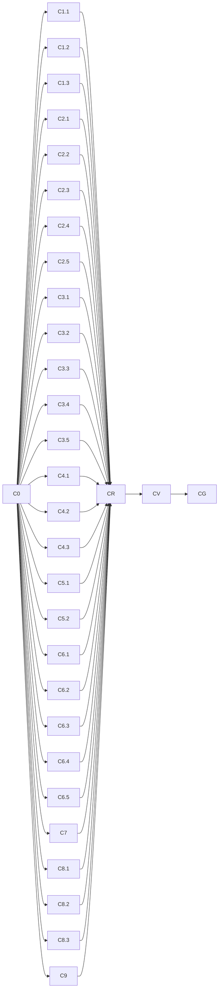

# 逐组件审计路线图（Component Audit Roadmap）

> 最后更新：2026-08-02
> 来源：用户要求"逐个组件完成一次审查"（上轮 `audit-remediation` 粒度在"包簇 x 维度"，未到组件级）
> 细则：`docs/audits/component-audit-checklist.md`（18 维清单 + 审计卡模板 + 裁决规则）
> Mission：`missions/component-audit.json`

## 目的

本文件是 nop-chaos-flux 的**逐组件深度审计 + 自动修复**路线图，按 `docs/backlog/00-roadmap-authoring-guide.md` 规范编排。与上轮 `docs/backlog/audit-remediation-roadmap.md`（10 包簇 x 7 审计层 + 工具扫描，已 done）的关系：**本路线图把审计单元下沉到单个 renderer 组件**，每个组件一张审计卡（`docs/audits/per-component/<type>.md`），逐一完成 18 维契约审查，并对发现的 P0/P1 缺陷**自动修复**（test-first + 回归测试 + 自动验证门禁，审计与修复之间无人工握手），同时完成真实浏览器宿主场景验证。自动修复机制见下文「自动修复机制」节。

## Work Item Status

> **全文件唯一的动态状态区。** 状态流转：draft review 通过 → `todo` 改 `planned`；closure audit 通过 → `planned` 改 `done`（不得提前）。一个 work item = 一个 execution plan 的交付范围（审计一个组件族 + 逐组件审计卡 + **P0/P1 自动修复** + 回归测试 + closure）。**组件族是 plan 单位、组件是审计卡单位**（micro-plan 反模式）；若单个 work item 无法被一个 plan 收口，在 C0 后经人工确认拆分。

| Work Item                                                                                                                               | Status    | Owner Doc                    | 覆盖组件 | Dependencies |
| --------------------------------------------------------------------------------------------------------------------------------------- | --------- | ---------------------------- | -------- | ------------ |
| C0. 编排基线（组件清单与注册定义/amis-baseline-matrix 核对、全量基线重跑、审计卡模板、工具基线、保护区域地图）                          | `done`    | component-audit-checklist.md | —        | —            |
| C1.1 basic 结构核心族（page/container/flex/tabs/dialog/drawer）                                                                         | `planned` | component-audit-checklist.md | 6        | C0           |
| C1.2 basic 结构扩展族（fragment/loop/recurse/reaction/scope-debug/dynamic-renderer）                                                    | `planned` | component-audit-checklist.md | 6        | C0           |
| C1.3 basic 原子显示族（text/button/badge/icon）                                                                                         | `todo`    | component-audit-checklist.md | 4        | C0           |
| C2.1 form shell（form/fieldset + hidden-field 策略）                                                                                    | `todo`    | component-audit-checklist.md | 2        | C0           |
| C2.2 form 文本输入族（input-text/input-password/input-email/input-number/textarea）                                                     | `todo`    | component-audit-checklist.md | 5        | C0           |
| C2.3 form 选择控件族（select/checkbox/checkbox-group/radio-group/switch + button-group-select）                                         | `todo`    | component-audit-checklist.md | 6        | C0           |
| C2.4 form 日期族（input-date/input-datetime/input-time/date-range/input-month/input-quarter/input-year）                                | `todo`    | component-audit-checklist.md | 7        | C0           |
| C2.5 form markdown-editor                                                                                                               | `todo`    | component-audit-checklist.md | 1        | C0           |
| C3.1 form-advanced 复合输入族（combo/input-table/transfer/picker）                                                                      | `todo`    | component-audit-checklist.md | 4        | C0           |
| C3.2 form-advanced 组合字段族（object-field/array-field/detail-field/detail-view/variant-field）                                        | `todo`    | component-audit-checklist.md | 5        | C0           |
| C3.3 condition-builder                                                                                                                  | `todo`    | component-audit-checklist.md | 1        | C0           |
| C3.4 form-advanced 轻量编辑族（tag-list/key-value/array-editor/icon-picker）                                                            | `todo`    | component-audit-checklist.md | 4        | C0           |
| C3.5 form-advanced 媒体与富文本族（editor/input-file/input-image/tree-select/input-tree）                                               | `todo`    | component-audit-checklist.md | 5        | C0           |
| C4.1 table                                                                                                                              | `todo`    | component-audit-checklist.md | 1        | C0           |
| C4.2 crud                                                                                                                               | `todo`    | component-audit-checklist.md | 1        | C0           |
| C4.3 data 其余（tree/chart/list/pagination/statistics/data-source）                                                                     | `todo`    | component-audit-checklist.md | 6        | C0           |
| C5.1 layout 网格与流程族（grid/collapse/wizard）                                                                                        | `todo`    | component-audit-checklist.md | 3        | C0           |
| C5.2 layout 动作组族（button-group/dropdown-button/steps/timeline）                                                                     | `todo`    | component-audit-checklist.md | 4        | C0           |
| C6.1 content 文本类（markdown/html/json-view/link/image）                                                                               | `todo`    | component-audit-checklist.md | 5        | C0           |
| C6.2 content 状态反馈类（card/cards/empty/progress/spinner/separator）                                                                  | `todo`    | component-audit-checklist.md | 6        | C0           |
| C6.3 content 值映射类（alert/mapping/status）                                                                                           | `todo`    | component-audit-checklist.md | 3        | C0           |
| C6.4 content 媒体类（audio/video/carousel/qrcode）                                                                                      | `todo`    | component-audit-checklist.md | 4        | C0           |
| C6.5 diff-view                                                                                                                          | `todo`    | component-audit-checklist.md | 1        | C0           |
| C7 mobile 交互族（pull-refresh/infinite-scroll/swipe-cell/countdown/notice-bar）                                                        | `todo`    | component-audit-checklist.md | 5        | C0           |
| C8.1 ai 会话主链（ai-chat/ai-message-list/ai-bubble/ai-sender/ai-conversations）                                                        | `todo`    | component-audit-checklist.md | 5        | C0           |
| C8.2 ai 工具内容族（ai-tool-call/ai-attachments/ai-citations/ai-feedback/ai-token-usage）                                               | `todo`    | component-audit-checklist.md | 5        | C0           |
| C8.3 ai 增强族（ai-prompts/ai-suggestions/ai-voice-input/ai-welcome）                                                                   | `todo`    | component-audit-checklist.md | 4        | C0           |
| C9 scheduling 族（gantt/kanban/calendar/barcode-input）                                                                                 | `todo`    | component-audit-checklist.md | 4        | C0           |
| CR. 跨族集中修复与裁决（**剩余** shared 缺陷（C\* 已通过 CX-n 处理的除外）、C 阶段 deferred P1、各审计卡 P2 backlog、机制落地后复验项） | `todo`    | component-audit-checklist.md | —        | 全部 C\*     |
| CV. 全量验证（typecheck/build/lint/test + e2e full-green + 回归）                                                                       | `todo`    | component-audit-checklist.md | —        | CR           |
| CG. Guard 沉淀（审计卡汇总索引、lessons、checklist v2、工具脚本升级）                                                                   | `todo`    | component-audit-checklist.md | —        | CV           |

> 组件合计 **113** 个注册组件（basic 16 / content 19 / data 8 / layout 7 / form 21 / form-advanced 19 / mobile 5 / ai 14 / scheduling 4）——C0 已与 live 注册定义核对（2026-08-02，逐包定义文件 + 运行时 registry 枚举，证据见 `docs/logs/2026/08-02.md` C0 记录）。一个非注册项说明：`input-suggest` 是 input-text 的 `suggestSource` 子特性（`renderers/input-suggest.tsx` 为 hook，非注册 type），随 C2.2 一并审查。`button-group-select` 已于 2026-08-02 mission-driver 注册（`flux-renderers-form/src/renderers/input.tsx:639`，fields: options/multiple/direction/dict，见 `docs/logs/2026/08-02.md`），随 C2.3 一并审查（其 DOM 契约测试已在 C0 基线全绿）。C0 与注册定义核对后，任何差异以注册为准并回写本表。**执行中发现共性缺陷模式时，插入的「共性重构」work item 使用 `CX-n` 编号**（见「自动修复机制」§7），插入时同步更新本表、依赖图与计数说明。

## 框架/平台复用

| 类型         | 清单                                                                                                                                                                                                                                                                                                                                                                                                                                                         |
| ------------ | ------------------------------------------------------------------------------------------------------------------------------------------------------------------------------------------------------------------------------------------------------------------------------------------------------------------------------------------------------------------------------------------------------------------------------------------------------------ |
| 多维深审     | `docs/skills/deep-audit-prompts.md`（23 维）、`docs/skills/code-quality-audit-prompt.md`、`docs/skills/react19-best-practices-review.md`                                                                                                                                                                                                                                                                                                                     |
| 对抗式审查   | `docs/skills/open-ended-adversarial-review-prompt.md`、`docs/skills/ux-design-pattern-audit-prompt.md`、`docs/skills/complex-component-display-operability-audit-prompt.md`                                                                                                                                                                                                                                                                                  |
| 测试覆盖审计 | `docs/skills/unit-test-logic-and-contract-coverage-audit-prompt.md`、`docs/skills/exploratory-e2e-testing-prompt.md`                                                                                                                                                                                                                                                                                                                                         |
| 审计工具脚本 | `check:audit-suspects`、`check:audit-runtime-raw-schema-reads`、`check:audit-fieldframe-bypasses`、`check:audit-async-failure-paths`、`check:audit-hardcoded-type-dispatch`、`check:audit-missing-renderer-markers`、`check:audit-styling-suspects`、`check:audit-performance-suspects`、`check:audit-reactive-render-reads`、`check:audit-non-retained-renderer-references`、`check:audit-react19-optimization-candidates`、`check:audit-test-global-leaks` |
| 变异/静态    | `pnpm audit:mutants`、`pnpm audit:knip`、`pnpm audit:semgrep`、`pnpm audit:deps`                                                                                                                                                                                                                                                                                                                                                                             |
| E2E          | `pnpm test:e2e`（Playwright）；诊断见 `docs/references/e2e-test-diagnostic-guide.md`                                                                                                                                                                                                                                                                                                                                                                         |
| 契约基线     | `docs/architecture/renderer-markers-and-selectors.md`、`docs/architecture/styling-system.md`、`docs/architecture/nested-schema-field-classification.md`（v8）、08-01 field-selector 契约、`docs/references/quick-reference.md`                                                                                                                                                                                                                               |

## 自动修复机制（Auto-Remediation Contract）

每个 C\* work item 的 plan 是「审计 → 自动修复 → 验证 → closure」一体化闭环，**审计与修复之间无人工握手门禁**（保护区域已获 mission 授权，见 `missions/component-audit.json` description）：

1. **审计产出**：18 维核对 + 每组件审计卡（P0/P1/P2/P3 裁决留痕），所有发现带 `文件:行` 证据。
2. **自动修复范围**：P0/P1 由执行 agent 在**同一个 plan 内**自动修复（不等批量、不推给 CR）；P2 若修复成本低（约 15 分钟内）也当场修复，否则记入审计卡 backlog 并由 CR 自动处理；P3 仅记录。
3. **Test-first 纪律**：每个缺陷先写复现/回归测试（断言正确行为，非仅 not-throw），再实现修复；契约/公共层修复必须 "Must automate"（先写失败测试再实现，见 `docs/plans/00-plan-authoring-and-execution-guide.md` Test Strategy 与 AGENTS.md Bug Fix Test Coverage Rule）。
4. **验证门禁**：每次修复后运行受影响包的 `pnpm --filter <pkg> typecheck/build/lint/test`；DOM/选择器契约变更追加 focused 契约测试与 e2e；全部通过才继续下一个发现。
5. **审计卡更新**：修复后卡内发现标 `fixed` + 引用 commit/plan；卡状态流转 `open → fixing → fixed-pending-closure → closed`（P0/P1 未清零不得 `closed`）。
6. **Closure 门禁**：work item 完成时由**独立子 agent**（fresh session）跑 closure audit；pass 后 roadmap 标 `done` 并按 `fix(component-audit): <description>` 提交。
7. **共性问题主动处理（执行中动态调整 roadmap）**：发现**共性缺陷模式**（同一根因影响 ≥2 个组件，或跨包/公共层机制，如公共 helper、field-frame、编译期机制、值所有权公共层）时，执行 agent 不得只修当前组件、也不得默认囤积到 CR，必须**主动**执行以下动作（在 plan 内记录决策）：
   - a. 在 Work Item Status 插入新 work item（编号 `CX-n`，命名含「共性重构」前缀，注明根因、受影响组件清单、影响范围、建议处理时机），或合并进已有的同类 work item/共性重构项并更新其覆盖范围与描述；
   - b. 若共性根因阻塞当前 work item 内多个组件的审计结论（审计卡只能标 `shared:` 而无法 close），可在当前 plan 内以多阶段方式**优先修复根因**（遵循 plan guide 多阶段规则），修复完成后再逐组件回填审计卡，随后把该次处理回写为 CX-n 记录（若未预先插入）；**事后回写的 CX-n 以 `planned` 状态插入（引用父 plan 为执行证据），父 plan closure audit 通过后一并标 `done`**——只有"预插入且延迟处理"的 CX-n 才走 §7c 完整生命周期；
   - c. 插入的 CX-n 走正常 plan 生命周期：独立 draft review 通过后 `todo → planned`，执行后独立 closure audit 通过才标 `done`；
   - d. 触及公共 API、包边界或编译期机制的**结构性重构**，插入后**执行前仍需人工确认**（与 Rule 一致）；不改签名/导出/包边界/编译期语义的**纯行为修复不视为结构性**，无需人工确认（保持本节引言"审计与修复之间无人工握手"的闭环比）；
   - e. 插入/合并时必须同步更新 Work Item Status 表与组件计数说明，并在 daily log 记录根因与决策；**依赖图至少补 CX-n 节点及其上游依赖边，或以注释声明「依赖以表 Dependencies 列为准」**（mermaid 静态图不做权威来源）。
8. **中断恢复**：plan 中断后由 mission-driver 扫描 unfinished plans 恢复，以审计卡当前状态（`open`/`fixing` 卡）为恢复点，不重复已闭卡。

## 当前基线

> **C0 后基线（2026-08-02 C0 全量重跑实测，本表权威基线；后续 work item 的验证门禁以此为参照）。** 历史快照：2026-07-28 audit-remediation MV/MG 收尾全绿（`pnpm typecheck` 58/58、`pnpm build` 31/31、`pnpm lint` 31/31、`pnpm test` 58/58，见 `docs/context/project-context.md` 历史段）。

- **单元基线（C0 实测 2026-08-02）**：`pnpm typecheck` 31/31、`pnpm build` 31/31、`pnpm lint` 31/31、`pnpm test` 58/58 全部成功（含 flux-compiler 531、flux-renderers-form 643、flux-renderers-ai 474、nop-debugger 125 等；`button-group-select` DOM 契约测试 5 条与 field-controls DOM 契约 28/28 全绿——2026-08-02 mission-driver 注册后已归零）。**unit 层全绿**。
- **E2E 基线（C0 实测 2026-08-02）**：`pnpm test:e2e` 全量 **770 passed / 43 skipped / 9 failed**。9 个失败与 2026-08-02 mission-driver 提交后基线逐项一致（同一 spec/测试名/类别），均为 mission 未触及包，**未达 full-green**：
  - `ai-chat.spec.ts` ai-bubble 渲染 timestamp（ai 包）→ successor: C8.1
  - `ai-rich-text-sender.spec.ts` ×5 Tiptap 编辑面/模板/mention/slash 命令/提交（ai 包）→ successor: C8.1
  - `calendar-demo.spec.ts` 日历导航按钮（scheduling 包）→ successor: C9
  - `diff-perf.spec.ts` 首屏渲染 <200ms 阈值（content 包，机器相关阈值）→ successor: CV/专项（需评估阈值与机器基线）
  - `input-suggest.spec.ts` suggest 选择写回值（form 包 input-text suggestSource 子特性，popover 稳定性）→ successor: C2.2
- **e2e pre-existing 9 失败裁定（C0 决策，watch-only residual）**：逐项与 HEAD 基线 stash 对比复现一致（2026-08-02 mission-driver 已核），均为 mission 未触及包；C0 不阻塞、不修复，归属 successor（C8.1/C9/C2.2/CV 专项），详见 `docs/plans/2026-08-02-2043-1-c0-orchestration-baseline.md` Deferred But Adjudicated 节。
- **保护区域地图与授权边界（C0 记录，来源 `docs/context/ai-autonomy-policy.md` Protected Areas 表 + `missions/component-audit.json` description）**：mission 已授权**全部保护区域**的代码变更——`packages/flux-core/src/`（`plan-first`，已获 mission 授权）、Schema/contract validation（`plan-first`，已授权）、`packages/ui/src/index.ts` 公共组件导出（`ask-first`，mission 授权范围内但仍需理由）、Renderer 定义 fields（`plan-first`，已授权）、样式契约（`plan-first`，已授权）；`@nop-chaos/ui` 公共导出变更维持 `ask-first`（须先说明理由）；**结构性重构**（公共 API、包边界、编译期机制）执行前仍需人工确认；P0/P1 自动修复、审计与修复之间无人工握手（roadmap「自动修复机制」§1）。
- **已知组件级缺陷样本**（证明逐组件审计必要性）：`combobox-item` 无 `data-value`（`select-combobox-lists.tsx:63`，DOM 契约测试冻结该缺口）；CRUD 行内 dropdown-button 嵌套 openDialog 提交旧值（行 scope 污染，`nested-schema-field-classification` plan 修复中）；dialog 表单真实浏览器输入不更新 store（bug 73，单测绿但真机失败）。
- **组件清单**：113 个注册组件（9 包：basic 16 / content 19 / data 8 / layout 7 / form 21 / form-advanced 19 / mobile 5 / ai 14 / scheduling 4），见 Work Item Status 逐项列示；C0 已与注册定义核对（逐包定义文件 + 运行时 registry 枚举），差异（form 20→21 计入 button-group-select）已回写本表。
- **已知结论保留**：mobile/ai/scheduling 已有多轮密集审计（P0/P1 已闭包），本轮的增量价值在"组件级卡 + 组合宿主场景 + 契约维度回填"，不重跑其全量维度；`deep-audit-prompts.md` 已覆盖维度直接复用。

## 上轮审计的遗漏分析（Gap Analysis）

上轮 `audit-remediation` 以"包簇 x 维度矩阵 + 工具扫描"执行，以下审查内容未到组件级、本轮逐组件补查：

| #   | 遗漏点                        | 上轮表现                                                               | 本轮机制                                                 |
| --- | ----------------------------- | ---------------------------------------------------------------------- | -------------------------------------------------------- |
| 1   | 组件级契约缺陷                | 结论按包簇汇总，单组件缺口（如 combobox-item 缺 data-value）散落或漏查 | 每组件独立审计卡 + 18 维全表核对（维度 1-18）            |
| 2   | 组合宿主场景                  | 组件孤立审查；CRUD 行内 dropdown 提交旧值这类组合缺陷未被维度矩阵捕获  | 维度 12：每族 ≥1 个真实浏览器宿主场景                    |
| 3   | 值所有权三态逐组件验证        | 矩阵无此维度（状态所有权只在 core/runtime 包审计）                     | 维度 3：每表单组件三态全路径                             |
| 4   | 四态覆盖（空/加载/错误/禁用） | 未系统覆盖                                                             | 维度 10                                                  |
| 5   | DOM 选择器契约                | 08-01 契约晚于上轮审计，组件未回填                                     | 维度 5 + 与 field-selector 契约对齐                      |
| 6   | 嵌套 schema 分类              | 08-02 机制晚于上轮审计                                                 | 维度 6：无 deepFields 残留、action 分类正确              |
| 7   | 事件 payload 形状逐组件       | normalizeActionEvent 修复仅覆盖 AI 包                                  | 维度 7：全部组件派发形状核对                             |
| 8   | 真实浏览器行为                | 全量以单测+静态为主；bug 73 证明单测绿≠真机正确                        | 维度 12 强制浏览器验证                                   |
| 9   | 注册完整性逐组件              | 只在部分包核对                                                         | 维度 18：定义+surface 双注册、playground 页、bundle 导出 |
| 10  | 测试质量逐组件                | 抽样审计                                                               | 维度 16：not-throw-only 断言、DOM 契约断言、错误路径     |
| 11  | i18n key 逐组件               | 抽样                                                                   | 维度 9：含 aria-label/title                              |
| 12  | a11y 完整键盘路径             | 上轮 MA5 为设计器 UX 维度                                              | 维度 8：焦点管理/陷阱/aria-live                          |
| 13  | 异步生命周期逐组件            | 工具扫描 + AI 包抽查                                                   | 维度 11：abort/竞态/重试/失败状态                        |
| 14  | 样式契约逐组件                | 工具扫描 styling-suspects                                              | 维度 13：布局仅 marker 类、无 BEM                        |
| 15  | 安全红线逐组件                | 抽样 XSS                                                               | 维度 18：sanitize/URL 协议/附件                          |
| 16  | 性能边界逐组件                | 工具扫描                                                               | 维度 15：key 稳定性/订阅清理/O(n²)                       |
| 17  | React 19 逐组件               | 上轮 R2 批量                                                           | 维度 14：冗余 memo/effect 镜像                           |
| 18  | 文档对照逐组件                | MA6 文档维度（不映射组件）                                             | 维度 17：design.md ↔ 实现 props/行为                     |

> 维度对照说明：维度 1/2/4（Schema 契约 / RendererComponentProps 合规 / 表单参与）上轮已在 core/runtime 包级审计覆盖（MA1-MA4），本轮以组件级卡逐组件补查其落地；维度 12 承接 gap #2（组合宿主）+ #8（真实浏览器），维度 18 承接 gap #9（注册完整性）+ #15（安全红线）。

## Phase Details

### C0 — 编排基线

- 组件清单与注册定义核对（9 包 + `docs/components/amis-baseline-matrix.md` 对照，修正 Work Item Status 表格与计数）；**重跑全量基线**（typecheck/build/lint/test + e2e，回写「当前基线」节）；审计卡模板与 18 维 checklist v1 确认（复用 `docs/audits/component-audit-checklist.md`）；审计工具基线跑取（suspects/markers/styling/performance/fieldframe 等）；保护区域地图与授权边界记录。

### C1.x — basic 族

- 结构核心族 6（page/container/flex/tabs/dialog/drawer）+ 结构扩展族 6（fragment/loop/recurse/reaction/scope-debug/dynamic-renderer）+ 原子显示族 4（text/button/badge/icon）。重点：marker 类契约（container/flex/page 仅 marker）、text/button/badge/icon 的 name binding、loop/recurse 行 scope、dynamic-renderer autoLoad、dialog/drawer surface 生命周期与真实浏览器提交场景。

### C2.x — form 族

- shell（form/fieldset + hidden-field 策略）+ 文本输入 5 + 选择控件 6（含已注册的 button-group-select）+ 日期 7 + markdown-editor。`input-suggest`（input-text 的 suggestSource 子特性）随 C2.2 审查；`button-group-select` 已注册（`input.tsx:639`，DOM 契约测试全绿）随 C2.3 审查。重点：field metadata、校验参与、三态值所有权、受控 echo、DOM 契约（data-field/data-renderer/data-value/testid）、select 远程搜索异步生命周期。

### C3.x — form-advanced 族

- 复合输入 4 + 组合字段 5 + condition-builder + 轻量编辑 4 + 媒体富文本 5。重点：staged owner 语义、嵌套 item scope、行 scope 污染（bug 样板）、editor sanitize、upload 请求下沉与失败路径。

### C4.x — data 族

- table / crud 单组件深审 + 其余 6。重点：行身份/选择/分页钳制/排序、列 DOM 契约（column name 进 DOM）、quickSave/loadAction 组合宿主、data-source 请求层。

### C5.x — layout 族

- grid/collapse/wizard + button-group/dropdown-button/steps/timeline。重点：valueOwnership 三态分层、params/isolate 迁移语义（08-02）、items 内嵌 action 分类（dropdown-button live defect 复验）。

### C6.x — content 族

- 文本 5 + 状态反馈 6（badge 归属 basic C1.3，不在此族）+ 值映射 3 + 媒体 4 + diff-view。重点：sanitize 门禁（html/markdown）、mapping/status 降级路径、媒体元素生命周期、diff-view P2 已闭包仅补卡。

### C7 — mobile 族

- 5 组件。已有密集审计（P0/P1 已闭包）：本轮仅增量——组件卡回填、DOM 契约维度、真实浏览器触摸场景验证。

### C8.x — ai 族

- 会话主链 5 + 工具内容 5 + 增强 4。已有密集审计（P2 已闭包）：本轮增量——组件卡回填、事件 payload 形状全核对、HITL 死点击场景、流式渲染 DOM 契约。

### C9 — scheduling 族

- 4 组件。已有密集审计：本轮增量——组件卡回填、组合宿主场景（dialog 内 gantt/kanban 等）、DOM 契约回填。

### CR — 跨族集中修复与裁决

- 汇集各审计卡 `shared:` 标记的**剩余**跨组件缺陷（C\* 执行中已通过 CX-n 处理的除外：公共 helper、field-frame、编译期机制、值所有权公共层）；处理各 C 阶段 Deferred 的 P1 与**各审计卡登记的 P2 backlog**；执行「机制落地后复验」归集项（含维度 6 依赖 08-02 机制的延期项）；跨组件裁决（同型缺陷模式归类）。

### CV — 全量验证

- `pnpm typecheck`/`build`/`lint`/`test` 全绿 + `pnpm test:e2e` 全绿（含新补的逐组件 e2e 场景）；回归已闭包审计项；full-green 记录于 daily log。

### CG — Guard 沉淀

- `docs/audits/per-component/` 汇总索引（arm 风格：`pc-index.md`）；审计工具脚本升级（若有新模式）；lessons 写入；checklist v2 修订。

## Dependency Graph

## Cross-Cutting

- **自动修复优先**：审计中发现即修（见「自动修复机制」§2），不安排"只审不修"的纯记录轮次；修复与审计同 plan 闭环。
- **共性即插即修**：共性缺陷模式（≥2 组件/跨包/公共层）执行中必须主动插入 CX-n「共性重构」work item 或合并进现有项（见「自动修复机制」§7），**不默认囤积到 CR**；CR 只处理剩余的小规模 `shared:` 项与复验归集。
- **真实浏览器验证**：每个 C 阶段至少 1 个宿主组合场景走 Playwright（programmatic DOM 断言，禁用截图诊断）；针对"单测绿但真机失败"类缺陷（bug 73 模式）做一次专项检查。
- **审计卡纪律**：无审计卡不开工、无 closure 不标 done；P0/P1 未清零的组件卡不得 `closed`。
- **复验归属**：「机制落地后复验」等延期项由 CR 集中执行（见 CR Phase Details），不悬空；卡内延期必须登记，不得静默跳过。
- **不与 08-02 计划冲突**：`nested-schema-field-classification` / `mechanism-unification` / `ajax-validation-migration` 三个 active plan 是本轮维度 6 的审查依据；若某组件在其落地前被审计，审计卡标记"机制落地后复验"。
- **与上轮审计的关系**：上轮结论不重审（已 closure），只在本轮发现与新证据冲突时提交跨维度裁决（CR）。

## Rule

- 本路线图状态仅由 plan 生命周期驱动（见 `docs/backlog/00-roadmap-authoring-guide.md`）。
- work item = 一个 plan；组件族为 plan 单位、组件为审计卡单位（组件级微 plan 是反模式，但若 work item 超单 plan 收口能力，C0 后人工确认拆分）。
- 审计记录写入 `docs/audits/per-component/`，本文件只维护 Work Item Status 与组件清单，不维护第二动态块。
- AI 不重排既有 work item 的优先级；**共性问题驱动的 `CX-n` 插入（或合并进现有同类项，CR 除外）是唯一允许的新增 work item 路径**（见「自动修复机制」§7），非共性问题不得新增；结构性重构（公共 API、包边界、编译期机制）插入后执行前需人工确认。
- 变更策略：每个 C 阶段 plan 遵循 `docs/plans/00-plan-authoring-and-execution-guide.md`，Test Strategy 至少 "Should have tests"；契约/公共层修复必须 "Must automate"（先写失败测试再实现）。
- **自动修复不可豁免**：P0/P1 必须同 plan 内修复（见「自动修复机制」），仅当缺陷依赖未落地的跨 plan 机制（如 08-02 nested-schema 机制）时可在卡内标记「机制落地后复验」并延期。
