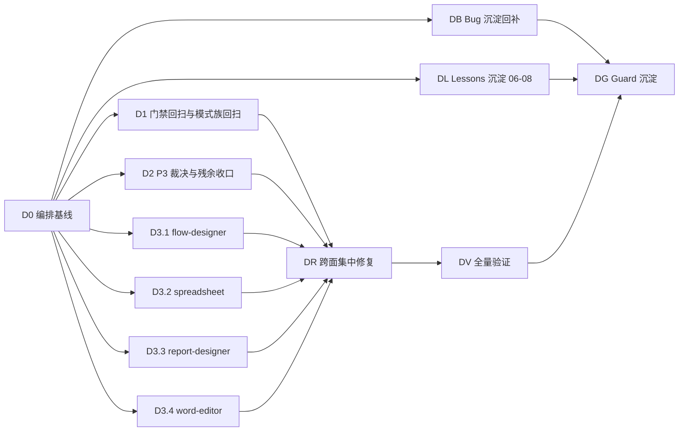

# 逐组件审计第二轮路线图（Component Audit Round-2 Roadmap）

> Last Updated: 2026-08-08
> 驱动方：第一轮 `docs/backlog/component-audit-roadmap.md`（C0–C9 + CX-1..CX-12 + CR/CV/CG 全部 `done`，113 卡 closed）与 `docs/audits/component-audit-checklist.md` v2
> 本路线图 = **post-closure 第二轮**：模式族回扫 + 4 个 host 大面逐面审计 + P3/残余裁决
> 细则：`docs/audits/component-audit-checklist.md`（18 维清单 v2 + 审计卡模板 v2 + 裁决规则）；host 大面审计卡模板（D0 定义，18 维降维 + designer 特有维度）
> Mission：`missions/component-audit-round2.json`（授权范围与自动修复机制见该文件 description；industrial-hmi 分支不在本轮范围）

## 目的

第一轮逐组件审计（113 张卡、P0×4/P1×128/P2×225/P3×149、CX-1..CX-12 共性重构）已收口，CV full-green（10,397 单测 + 1054 e2e）。但收口后的两轮追加审计（2026-08-06/08-07 open/multi-audit）**仍发现 85 条 P2 且多为真缺陷**（pointercancel 缺失、polling 竞态、重试跳页、NaN fail-closed、键盘编辑派发错通道、事件 ctx 别名盲区等，已于 08-07/08-08 修复）——证明「一轮审计必然不彻底」。本路线图按第一轮沉淀的教训组织第二轮：

1. **门禁漂移回扫**：第一轮最大的沉淀物是 12+ 个 `check:audit-*` 工具门禁；第二轮先重跑全部门禁 + 对 CV 之后新增代码做模式族回扫（事件 ctx / reaction 接线 / scope 生命周期 / i18n 硬编码），成本低、命中率高。
2. **P3 裁决与残余收口**：113 卡 149 条 P3 backlog 未经逐条裁决；`@reserved` 契约与 6 条 watch-only e2e 长期悬挂。
3. **4 个 host 大面逐面审计**：flow-designer / spreadsheet / report-designer / word-editor（8 个包）从未有逐面审计卡（M 轮 MA1.4/MA3.3/MA4.3/MA5.1 为包簇级，非逐面）；它们只被 08-06/08-07 的零散 P2 触碰过。
4. **自动修复 + closure 门禁**沿用第一轮纪律（审计→自动修复→验证→closure，closure 由独立 fresh session 执行）——**自动修复机制与 CX-n 共性插入纪律沿用第一轮 roadmap `docs/backlog/component-audit-roadmap.md`「自动修复机制」节（§1–§7），本轮编号自 CX-13 起**；mission 授权与范围见 `missions/component-audit-round2.json`。

## Work Item Status

> **全文件唯一的动态状态区。** 状态流转：draft review 通过 → `todo` 改 `planned`；closure audit 通过 → `planned` 改 `done`（不得提前）。一个 work item = 一个 execution plan 的交付范围（审计一个面/一类模式 + 逐面审计卡 + **P0/P1 自动修复** + 回归测试 + closure）。

| Work Item                                                                         | 交付范围                                                                                                                                                                                                                                                                                                                                                                                                                                                                                                                                                                                                                                                                                                                                                                                         | 状态   | Owner Doc                                                        | 卡数（预估）   | 依赖                                                                                                                                                                                                                                                                                                                                                                                                                                                                                           |
| --------------------------------------------------------------------------------- | ------------------------------------------------------------------------------------------------------------------------------------------------------------------------------------------------------------------------------------------------------------------------------------------------------------------------------------------------------------------------------------------------------------------------------------------------------------------------------------------------------------------------------------------------------------------------------------------------------------------------------------------------------------------------------------------------------------------------------------------------------------------------------------------------ | ------ | ---------------------------------------------------------------- | -------------- | ---------------------------------------------------------------------------------------------------------------------------------------------------------------------------------------------------------------------------------------------------------------------------------------------------------------------------------------------------------------------------------------------------------------------------------------------------------------------------------------------- |
| D0. 编排基线（第二轮）                                                            | 输入盘点（113 卡 149 P3 全量提取 + 08-06/08-07 审计 P3 + 各 plan Non-Blocking Follow-ups 归集）、4 host 面范围核对（8 包注册定义/导出面/宿主场景）、全量门禁基线重跑、host 审计卡模板定义（18 维降维 + designer 特有维度：host 契约/事务/undo/拖拽/e2e 可操作性）、保护区域地图核对                                                                                                                                                                                                                                                                                                                                                                                                                                                                                                              | `done` | component-audit-checklist.md（模板 v2 + D0 新增 host 模板节 §6） | —              | （执行证据：plan `docs/plans/2026-08-08-0715-1-round2-d0-orchestration-baseline.md` completed + closure-audit pass（fresh session，2026-08-08），证据见 plan Closure 节与 `docs/logs/2026/08-08.md` D0 节；交付物：`docs/audits/round2-p3-inventory.md`（149 P3 零悬挂）、`docs/audits/host-surface/`（README + surface-inventory）、门禁基线（28 项 `check:*` 27/28 exit 0 + duplicates:detail 归因归 D1 + `pnpm test:scripts` 6/15 全绿）、checklist v2 §6 host 模板节 + §6.4 保护区域地图） |
| D1. 门禁漂移回扫与模式族回扫（10 个 flux-renderers-\* 包）                        | ① 全量门禁重跑（root `check:*` 28 项含 `check:audit-*` 14 项，含 `check:workspace-manifest-deps` 反向规则、`check:audit-renderer-browser-io` INV-1、`check:audit-event-dispatch-ctx`；清单以 live `package.json` 为准）零新增命中复验 + `scripts/__tests__/` 回归套件复跑；② 四模式族对 CV 之后新增代码回扫：事件派发 ctx（新派发点单参形态）、`kind:'reaction'` 三件套接线（reactionsRef + ready() + ComponentHandle 全量登记 vs 接线矩阵）、createScope/disposeScope 配对（渲染期 + 事件路径）、i18n 硬编码 `rg` 兜底（中文字面量/硬编码英文）；host renderer 包（flow-designer/spreadsheet/report-designer/word-editor）不在此范围，归 D3.x 逐面审计                                                                                                                                          | `done` | component-audit-checklist.md v2                                  | —              | D0（执行证据：plan `docs/plans/2026-08-08-0715-2-round2-d1-gate-drift-pattern-family-rescan.md` completed + closure-audit pass（fresh session，2026-08-08），证据见 plan Closure 节与 `docs/logs/2026/08-08.md` D1 节；交付物：28 项门禁 27/28 exit 0 与 D0 逐位一致（duplicates:detail 非门禁归因维持）、test:scripts 6/15 全绿、扫描器回归专项复核、四模式族零命中（reaction 13 声明全接线 / scope 全配对 / i18n 零硬编码）、共性缺陷显式声明无、5 卡回扫节回写）                            |
| D2. P3 裁决与残余收口                                                             | ① 113 卡 149 P3 逐条裁决（约 30 条需实质裁定，其余低成本当场修复 / 记录留痕 / 驳回 + 理由），裁决表落 `docs/audits/round2-p3-adjudication.md`；② `@reserved` 契约全量核对（schema 字段 + design.md 标注 vs live 消费，ghost contract 专项）；③ 6 条 watch-only e2e 复核裁决（Tiptap 批次 ×2 + w3d-editor 是否真缺陷、gantt-perf/kanban-perf 60Hz 环境阈值复测、ai-attachments 已解 flake 记录复核）；④ 各 plan Non-Blocking Follow-ups 归集收口                                                                                                                                                                                                                                                                                                                                                  | `todo` | cr-inventory-adjudication.md 先例 + 本路线图 D2 节               | ~30 条实质裁决 | D0                                                                                                                                                                                                                                                                                                                                                                                                                                                                                             |
| DB. Bug 沉淀回补（第一轮 + post-closure 缺口）                                    | 按 `docs/bugs/00-bug-fix-note-writing-guide.md` 门槛盘点第一轮 C1–C9 + CR + 08-06/08-07/08-08 收口批次中已修复但**缺 bug note** 的复杂缺陷（live 核对已知候选 ~15 条：CX-6 数值/布尔选项选中态 echo 破坏、CX-7 日期日历 locale 不随语言、CX-8 复合字段 readOnly/disabled 不传播、2-8 CRUD 自定义 state path 双 fetch、2-9 无限滚动重试跳页、2-10 polling 挂载序竞态、2-11 pagination 渲染期 clamp、2-12 surface scope dispose 缺口 + GC 测试假保障、2-13 barcode 连续同值静默丢弃、2-14 四个 drag hook 无 pointercancel、2-16 onErrorError 抑制标记丢失、2-19 gantt 键盘编辑派发错通道、15-2 设计器 NaN fail-closed、22-07 gantt onTaskEdit 缺失、22-12 kanban 死句柄）逐一补写（编号从 90 起，短小聚焦记忆点）并更新 `docs/bugs/README.md` 索引；盘点表落 `docs/audits/round2-bug-note-gaps.md` | `todo` | docs/bugs/00-bug-fix-note-writing-guide.md                       | ~15 note       | D0                                                                                                                                                                                                                                                                                                                                                                                                                                                                                             |
| DL. Lessons 沉淀（06–08）                                                         | 从第一轮 + post-closure 执行证据提取方法论教训写入 `docs/lessons/`（编号 06 起）：06 审计必漏定律与 post-closure audit 制度（mission 收口后两轮仍 85 条真缺陷的证据链）、07 工具门禁沉淀法（每修一类模式落一个 `check:` + committed 回归测试，基线零命中才是真收口）、08 声明即契约（ghost contract）检测法（注册项/事件派发点/component:\* 句柄 ↔ design.md 双向核对）；更新 `docs/lessons/README.md`                                                                                                                                                                                                                                                                                                                                                                                           | `todo` | docs/lessons/README.md                                           | 3 note         | D0                                                                                                                                                                                                                                                                                                                                                                                                                                                                                             |
| D3.1 flow-designer 大面审计（flow-designer-core + flow-designer-renderers）       | 逐面审计卡（canvas/节点/边/槽位/面板/树视图/命令/事务/undo/拖拽/键盘/剪贴板…）+ 宿主场景（真实浏览器交互，bug 73 专项）+ P0/P1 自动修复 + 回归                                                                                                                                                                                                                                                                                                                                                                                                                                                                                                                                                                                                                                                   | `todo` | component-audit-checklist.md（host 模板节）                      | ~12 卡         | D0                                                                                                                                                                                                                                                                                                                                                                                                                                                                                             |
| D3.2 spreadsheet 大面审计（spreadsheet-core + spreadsheet-renderers）             | 逐面审计卡（表格渲染/单元格编辑/工具栏/状态栏/公式/冻结/选择/键盘导航/搜索…）+ 宿主场景 + P0/P1 自动修复 + 回归                                                                                                                                                                                                                                                                                                                                                                                                                                                                                                                                                                                                                                                                                  | `todo` | 同上                                                             | ~10 卡         | D0                                                                                                                                                                                                                                                                                                                                                                                                                                                                                             |
| D3.3 report-designer 大面审计（report-designer-core + report-designer-renderers） | 逐面审计卡（画布/字段拖拽/面板/inspector/预览/保存/undo…）+ 宿主场景 + P0/P1 自动修复 + 回归                                                                                                                                                                                                                                                                                                                                                                                                                                                                                                                                                                                                                                                                                                     | `todo` | 同上                                                             | ~8 卡          | D0                                                                                                                                                                                                                                                                                                                                                                                                                                                                                             |
| D3.4 word-editor 大面审计（word-editor-core + word-editor-renderers）             | 逐面审计卡（文档渲染/工具栏/选区/数据集/恢复/导出…）+ 宿主场景 + P0/P1 自动修复 + 回归                                                                                                                                                                                                                                                                                                                                                                                                                                                                                                                                                                                                                                                                                                           | `todo` | 同上                                                             | ~8 卡          | D0                                                                                                                                                                                                                                                                                                                                                                                                                                                                                             |
| DR. 跨面集中修复与裁决                                                            | D1/D2/D3.x 的 deferred P1/P2 + 跨面共享缺陷（4 host 面共性模式，CX-n 编号沿用）+ P3 裁决表残留复核                                                                                                                                                                                                                                                                                                                                                                                                                                                                                                                                                                                                                                                                                               | `todo` | component-audit-checklist.md                                     | —              | D1–D3                                                                                                                                                                                                                                                                                                                                                                                                                                                                                          |
| DV. 全量验证                                                                      | typecheck/build/lint + test + e2e full-green（含 host 面新增 e2e）+ `pnpm check` exit 0 + full-green 记录                                                                                                                                                                                                                                                                                                                                                                                                                                                                                                                                                                                                                                                                                        | `todo` | `docs/logs/`                                                     | —              | DR                                                                                                                                                                                                                                                                                                                                                                                                                                                                                             |
| DG. Guard 沉淀                                                                    | 第二轮审计卡汇总索引（`docs/audits/round2-index.md`）、lessons 09 起续写（接 DL 06–08）、bug-note 缺口终验（D3.x 行内 + DB 回补后零缺口核对）、门禁升级（回扫发现的扫描器盲区）、checklist 修订、project-context 基线回写                                                                                                                                                                                                                                                                                                                                                                                                                                                                                                                                                                        | `todo` | pc-index 先例                                                    | —              | DV + DL + DB                                                                                                                                                                                                                                                                                                                                                                                                                                                                                   |

## 框架/平台复用

| 类型                       | 清单                                                                                                                                                                                                                                                                                                                                                                                                                                                                                                                                                                                                                                                                                                               |
| -------------------------- | ------------------------------------------------------------------------------------------------------------------------------------------------------------------------------------------------------------------------------------------------------------------------------------------------------------------------------------------------------------------------------------------------------------------------------------------------------------------------------------------------------------------------------------------------------------------------------------------------------------------------------------------------------------------------------------------------------------------ |
| 审计工具门禁（第一轮沉淀） | `check:audit-suspects`、`check:audit-runtime-raw-schema-reads`、`check:audit-fieldframe-bypasses`、`check:audit-async-failure-paths`、`check:audit-hardcoded-type-dispatch`、`check:audit-missing-renderer-markers`、`check:audit-styling-suspects`、`check:audit-performance-suspects`、`check:audit-reactive-render-reads`、`check:audit-non-retained-renderer-references`、`check:audit-react19-optimization-candidates`、`check:audit-test-global-leaks`、`check:audit-renderer-browser-io`（INV-1 零容忍）、`check:audit-event-dispatch-ctx`、`check:workspace-manifest-deps`（正 + 反向规则）、`check:oversized-code-files`、`check:i18n-keys`、`check:active-doc-code-anchors`、`check:package-css-exports` |
| 多维深审                   | `docs/skills/deep-audit-prompts.md`、`docs/skills/code-quality-audit-prompt.md`、`docs/skills/react19-best-practices-review.md`                                                                                                                                                                                                                                                                                                                                                                                                                                                                                                                                                                                    |
| 对抗式审查                 | `docs/skills/open-ended-adversarial-review-prompt.md`、`docs/skills/ux-design-pattern-audit-prompt.md`、`docs/skills/complex-component-display-operability-audit-prompt.md`                                                                                                                                                                                                                                                                                                                                                                                                                                                                                                                                        |
| 测试覆盖审计               | `docs/skills/unit-test-logic-and-contract-coverage-audit-prompt.md`、`docs/skills/exploratory-e2e-testing-prompt.md`                                                                                                                                                                                                                                                                                                                                                                                                                                                                                                                                                                                               |
| 变异/静态                  | `pnpm audit:mutants`、`pnpm audit:knip`、`pnpm audit:semgrep`、`pnpm audit:deps`                                                                                                                                                                                                                                                                                                                                                                                                                                                                                                                                                                                                                                   |
| E2E                        | `pnpm test:e2e`（Playwright）；诊断见 `docs/references/e2e-test-diagnostic-guide.md`                                                                                                                                                                                                                                                                                                                                                                                                                                                                                                                                                                                                                               |
| 第一轮产物                 | `docs/audits/per-component/pc-index.md`（113 卡索引 + CX 模式索引）、`docs/audits/component-audit-checklist.md` v2、`docs/lessons/` 01–05、`docs/audits/cr-input-inventory.md` + `cr-inventory-adjudication.md`、`docs/audits/multi-audit-r2-verdicts.md`                                                                                                                                                                                                                                                                                                                                                                                                                                                          |

## 当前基线

- CV full-green（2026-08-06 实测）：typecheck/build/lint 32/32、test 59/59（10,397 passed/0 failed）、e2e 1054 passed/43 skipped/**6 failed（watch-only 归因清单：c3-5 Tiptap 批次 ×2、w3d-editor、gantt-perf/kanban-perf 本机 50Hz 阈值；另 ai-attachments 为已解瞬时 flake 记录，不占 6 席）**、component-lab 334/1/2、smoke 111/111、host-surfaces 42/42。
- `pnpm check` exit 0：oversized 仅 2 条既有 locale 豁免；workspace-manifest-deps（含反向规则）零命中；audit 三门禁（event-dispatch-ctx / renderer-browser-io / raw-schema-reads）零命中 + 7 条原生 DOM 转发 allowlist。
- 第一轮 Follow-up Backlog 三批（08-06/08-07/08-08）全部 `[x]` 收口（2026-08-08 终态）。
- **主缺口**：4 个 host 大面（8 包，约 38 个审计面预估）无逐面审计卡；149 P3 backlog 未经逐条裁决；@reserved 契约与 watch-only e2e 长期悬挂；CV 后新增代码未做模式族回扫。

## 上轮审计的遗漏分析（Gap Analysis，第二轮立项依据）

| 教训（来自第一轮数据）                         | 证据                                                                                                                                                                           | 第二轮对策                                                                           |
| ---------------------------------------------- | ------------------------------------------------------------------------------------------------------------------------------------------------------------------------------ | ------------------------------------------------------------------------------------ |
| 审计必漏定律：closure 只保证「本轮无已知问题」 | mission 08-06 收口 → 08-06/08-07 两轮 post-closure audit 仍发现 85 条 P2（真缺陷占多数，如 pointercancel、polling 竞态、重试跳页、NaN fail-closed、gantt 键盘编辑派发错通道）  | D1 门禁漂移回扫 + D2 P3 裁决 + D3 host 面（本轮新范围，第一轮未覆盖）                |
| 门禁是唯一防回退沉淀物                         | 每修一类模式落一个 check 后，08-07/08-08 多轮零新增命中；扫描器自身也出过回归（browser-io 正则 6d2497ea 漏扫 10 包）                                                           | D1 全量重跑 + 扫描器回归测试复核；DG 将回扫发现沉淀为新门禁                          |
| 单测绿 ≠ 真机可用（bug 73 模式）               | 第一轮每卡必检 host 场景后，C7 发现 swipe-cell 操作区真实浏览器不可见（bug 87）；dialog 表单输入不更新 store                                                                   | D3.x host 面审计每面必带真实浏览器交互场景（programmatic DOM 断言，禁截图）          |
| 声明即契约（ghost contract）                   | 声明事件从不派发、component:\* 句柄零注册、schema 字段声明零消费（stopWhen/finishAction/importsReady 等）是第一轮最高产缺陷类别                                                | D2 @reserved 核对 + D3.x 逐面 events/reactions/handles 三件套核对                    |
| 大面从未被逐面审计                             | 4 host 面仅 M 轮包簇级审计 + 08-06/08-07 零散 P2（canvas-bridge、rd-toolbar、NaN clamp、JSON.parse 静默 null）——已有 confirmed defect 证据                                     | D3.1–D3.4 逐面审计卡 + P0/P1 自动修复                                                |
| 机制类缺陷跨组件复制                           | CX-10（事件 ctx）→ CX-12（scheduling）→ 08-06/08-07 又发现 graph/wizard/kanban 同型                                                                                            | D1 模式族回扫面向全 renderer 包而非单族                                              |
| 修复了 bug 却漏写 bug note / lesson            | 第一轮 + post-closure 修复的 ~15 条复杂缺陷无 `docs/bugs/` note（CX-6/7/8、2-8/2-9/2-10/2-11/2-12/2-13/2-14/2-16/2-19、15-2、22-07、22-12）；lessons 止于 05，方法论教训未成文 | DB 回补（90 起）+ DL 沉淀（06–08）；Cross-Cutting 定「当 plan 行内补写」纪律防再积压 |

## Phase Details

### D0 — 编排基线（第二轮）

输入盘点：113 卡 P3 全量提取（live grep `- [P<n>-<seq>]`，与 pc-index 149 核对）→ `docs/audits/round2-p3-inventory.md`；08-06/08-07 两轮审计 P3 登记；各 plan Non-Blocking Follow-ups 归集（含 2228-3 登记的工具治理轮次条目）；4 host 面范围核对（8 包 src 结构、导出面、既有 e2e 宿主场景、`tests/e2e/` 下 designer/office 相关 spec 清单）；全量门禁基线重跑（`pnpm check` + 各 `check:audit-*`，记录 D1 的零新增判定基线）；host 审计卡模板（18 维降维应用 + designer 特有维度：host 契约（`RendererEnv`/`hostContract`/manifest 注册）、事务与 undo 语义、拖拽/键盘交互完整性、剪贴板、e2e 可操作性、M 轮 MA4.3 测试覆盖缺口回归）写入 checklist v2；保护区域地图核对（4 host 面包不在 Protected Areas 表，但 `packages/ui` 公共导出与结构重构维持原规则）。

### D1 — 门禁漂移回扫与模式族回扫

- ① 门禁全量重跑：`pnpm check` + 全部 `check:audit-*`（root `package.json` 28 项 `check:*` 中含 14 项 `check:audit-*`，清单以 live 为准）逐一确认零新增命中（与 D0 基线比对；新增命中 = 门禁本身回归或 CV 后代码漂移，先修门禁还是先修代码按门禁语义裁决）+ `pnpm test:scripts`（`scripts/__tests__/` 门禁回归套件）复跑，扫描器自身无回归（browser-io 6d2497ea 漏扫教训专项）。
- ② 四模式族回扫（扫描目标 = CV 后新增/修改的 renderer 代码 + 第一轮 allowlist/豁免点复验；范围 = 10 个 flux-renderers-\* 包，4 个 host renderer 包归 D3.x）：
  - 事件派发 ctx：全 renderer 包新派发点是否携带 `{ event, evaluationBindings, scope }`（`check:audit-event-dispatch-ctx` 覆盖 + 人工抽查 template `${key}` 解析）；
  - `kind:'reaction'` 三件套：`rg "kind: 'reaction'" packages/*/src` 全量登记 vs 各渲染器 reactions 消费/句柄注册矩阵（CX-9/CX-12 后新接线点）；
  - scope 生命周期：渲染期 + 事件路径 createScope/disposeScope 配对（`rg "createScope"` 新点 + `check:audit-test-global-leaks`）；
  - i18n 硬编码：`rg "[\u4e00-\u9fa5]" packages/*/src -g '*.{ts,tsx}' --glob '!**/__tests__/**'` + 硬编码英文抽样。
- 产出：回扫发现全部带 `文件:行` 证据 + P0/P1/P2/P3 裁决；P0/P1 当 plan 内自动修复（test-first），P2 入 DR，P3 入 D2 裁决表。

### D2 — P3 裁决与残余收口

- ① 149 P3（+ 08-07 审计新增）逐条裁决：低成本（约 15 分钟内）当场修复；其余记录留痕或驳回（附理由），裁决表 `docs/audits/round2-p3-adjudication.md`（零悬挂要求，对齐 `cr-inventory-adjudication.md` 先例）。
- ② `@reserved` 契约核对：`rg "@reserved" packages/*/src` + design.md 标注 vs live 消费；确认仍为零消费者则维持 @reserved 并回写状态，发现新消费者则裁决激活或撤销标注。
- ③ 6 条 watch-only e2e 复核：Tiptap 批次（c3-5-host-surfaces:27/81 + w3d-editor:28）隔离复跑判断真缺陷 vs 环境；gantt-perf/kanban-perf 在 60Hz 环境复测阈值可达性（若本机仍 50Hz 则维持归因记录并标注「需 60Hz 环境最终确认」）；ai-attachments 已解 flake 多轮复跑确认不再现（不占 6 席）。
- ④ Non-Blocking Follow-ups 归集收口（如 2228-1 的 ERP 设计文档 watch-only 项维持 watch-only 并记录复核结论）。

### DB — Bug 沉淀回补

盘点（D0 产物 + live 核对）：以「根因非平凡 / 跨包 / 修复加了回归测试 / 重构可重引入」门槛筛第一轮 C1–C9 + CR + 08-06/08-07/08-08 收口批次的已修复缺陷，候选已知 ~15 条（见 Work Item Status 行），盘点表 `docs/audits/round2-bug-note-gaps.md` 零悬挂（每条：缺陷、修复 plan/commit、门槛命中理由、note 去向）。逐条按 `docs/bugs/00-bug-fix-note-writing-guide.md` 模板补写（编号 **90 起**，短小聚焦记忆点，不重复实现 diff），并更新 `docs/bugs/README.md`「Current Entries」。注：后续 D3.x 各 plan 修复的复杂 bug 按纪律**行内补写**（不积压到本 work item）；DB 只回补历史缺口。

### DL — Lessons 沉淀（06–08）

三条方法论教训（证据全部来自第一轮 + post-closure 数据，非新观点）：

- **06 审计必漏定律**：closure 只保证「本轮无已知问题」——mission 08-06 收口后 08-06/08-07 两轮 post-closure audit 仍发现 85 条 P2 真缺陷；制度结论：任何大规模审计收口后必须安排 1–2 轮 post-closure audit，且审计轮之间间隔不宜长。
- **07 工具门禁沉淀法**：每修一类模式就落一个 `check:` + committed 回归测试（`scripts/__tests__/`），基线零命中才是真收口；门禁自身也会回归（browser-io 正则 6d2497ea 漏扫 10 包）——门禁必须有自己的测试。
- **08 声明即契约（ghost contract）检测法**：注册项 defaultSchema/fields、事件派发点、`component:*` 句柄、schema 字段与 design.md 必须双向核对；「声明即死」是第一轮最高产缺陷类别（stopWhen/finishAction/importsReady/22-12 等）。
  更新 `docs/lessons/README.md`；后续 DG 从 **09 起**续写第二轮（host 面审计方法等）。

### D3.x — host 大面审计（每面一个 plan，独立闭环）

审计单元：**面（surface feature）**而非注册 renderer type（host 面组件非注册渲染器，无 per-component 卡先例，D0 定义模板）。每个 D3.x plan：逐面审计卡（18 维降维 + designer 特有维度）→ 宿主场景（每面 ≥1 真实浏览器交互，bug 73 专项，programmatic DOM 断言）→ P0/P1 自动修复（test-first）→ 回归 → closure（独立 fresh session）。

- D3.1 flow-designer：canvas 渲染/节点/边/槽位/面板/树视图/命令系统/事务/undo/拖拽/键盘/剪贴板/缩放平移/JSON.parse 失败路径（19-3 遗留复核）。
- D3.2 spreadsheet：表格渲染/单元格编辑/工具栏/状态栏/公式/冻结/选择/键盘导航/搜索/undo。
- D3.3 report-designer：画布/字段拖拽/inspector/预览/保存/undo/模板。
- D3.4 word-editor：文档渲染/工具栏/选区/数据集/恢复/导出/导入。

### DR — 跨面集中修复与裁决

D1/D2/D3.x deferred P1/P2 收口；4 host 面共性缺陷模式（沿用 CX-n 编号插入本表，附执行证据回写）；P3 裁决表残留复核；裁决表 `docs/audits/round2-dr-adjudication.md`。

### DV — 全量验证

typecheck/build/lint 32/32 + test 59/59 + e2e full-green（含 D3.x 新增 host 面 spec；watch-only 清单按 D2 裁决终态）+ `pnpm check` exit 0 + component-lab + smoke 回归；full-green 记录于 `docs/logs/2026/{08-xx}.md`。

### DG — Guard 沉淀

`docs/audits/round2-index.md`（第二轮全部审计卡汇总索引 + P0/P1 全量索引 + CX-n 模式索引）；lessons **09 起**续写（第二轮方法论：host 面审计模板、模式族回扫方法；接 DL 的 06–08）；bug note 缺口终验（D3.x 各 plan 行内补写 + DB 回补后 `docs/bugs/README.md` 与盘点表零缺口核对）；门禁升级（D1 回扫发现的扫描器盲区补规则 + committed 回归测试）；checklist 修订（host 模板节回写）；project-context 基线回写 DV full-green；docs/index.md 登记。

## Dependency Graph

## Cross-Cutting

- **host 面授权**：4 host 面 8 包不在 Protected Areas 表，默认 `implement`；但涉及 `packages/ui/src/index.ts` 公共导出（ask-first）、结构性重构（公共 API/包边界，需人工确认）、样式契约与 renderer 定义字段（plan-first）时按 `ai-autonomy-policy.md` 执行。D0 需把 host 面已有的 owner docs（`docs/architecture/flow-designer/`、`docs/architecture/report-designer/`、word-editor/spreadsheet 相关架构文档）列为每面审计的契约基准。
- **门禁纪律**：任何 plan 不得以「临时改门禁规则」消化新增命中；规则变更必须带 committed 回归测试（`scripts/__tests__/`）且在该 plan 内留痕。
- **审计卡位置**：renderer 包回扫发现入 `docs/audits/per-component/<type>.md` 追加节；host 面卡入 `docs/audits/host-surface/`（D0 建目录）；汇总索引 `docs/audits/round2-index.md`。
- **bug note 纪律**：任何 plan 修复复杂 bug 必须**当 plan 行内**按 `docs/bugs/00-bug-fix-note-writing-guide.md` 补写（编号 **90 起**，DB 回补只覆盖历史缺口，不承接新发现）；`docs/bugs/README.md` 索引同步。
- **lessons 编号纪律**：DL 占 06–08，DG 从 09 起续写；与 `docs/lessons/README.md` 同步。
- **提交纪律**：closure 通过后按 `fix(component-audit-round2): <description>` 提交；full-green 状态必须在 commit 标题显式声明（AGENTS.md）。

## Rule

- 状态翻转纪律见「Work Item Status」注；work item 完成须 closure audit pass（独立 fresh session），不得自审自批。
- 本表是唯一动态状态区；D1/D2/D3.x 发现共性缺陷时插入 `CX-n` 新行（沿用第一轮编号语义，从 CX-13 起），插入时同步更新本表、依赖图与 Cross-Cutting。
- 新 work item 由人工确认后插入；AI 不自行增删改优先级。
- 每个 work item 的 plan 必须声明 `> Source:` 指向本表对应行与输入清单（D0 产物）。
- 文档守卫：本文件 < 40 KB；超限时拆分 Follow-up Backlog 至独立文档（先例：`component-audit-roadmap.md` 的 Follow-up Backlog 节）。
