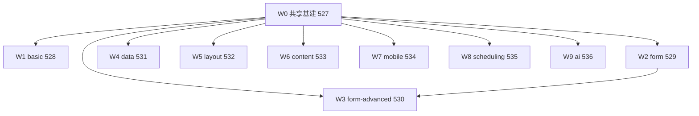

# DOM 结构契约审计路线图（DOM Structure Audit Roadmap）

> 最后更新：2026-10-03
> 来源：用户设计决定"逐个检查每个组件的结构设计：无必要不嵌套；根节点 `nop-<type>` + `data-renderer` 双标记；renderer 负责选择的子节点用 `data-slot` 区分；frame 一律外置为覆盖层（id 由控件 id 衍生 `nop-frame-${id}`）"
> 契约 owner doc：`docs/architecture/renderer-markers-and-selectors.md`（Universal Root Anchors、Structural Flatness Contract、Design-Time Frame Protocol 三节）
> 细则：`docs/audits/dom-structure-checklist.md`（6 维清单 + 审计卡模板 + 裁决规则）
> 规范：`docs/backlog/00-roadmap-authoring-guide.md`

## 目的

本文件是渲染器 DOM 结构契约的**逐包审计 + 整改**路线图。契约已在 owner doc 定稿；本路线图把"契约 ↔ live 代码"的差距按渲染器包拆成 work item，每个包一个 execution plan，逐包完成 6 维结构审计（审计卡落 `docs/audits/dom-structure/<type>.md`）、整改与契约测试冻结。与 `docs/backlog/component-audit-roadmap.md`（18 维功能契约）维度不同、互不替代。

## Work Item Status

> **全文件唯一的动态状态区。** 状态流转：draft review 通过 → `todo` 改 `planned`；closure audit 通过 → `planned` 改 `done`（不得提前）。一个 work item = 一个 execution plan 的交付范围（一个渲染器包的审计 + 整改 + 契约测试冻结）。W0 是其余全部 work item 的前置。

| Work Item                                                                  | Status | Plan (draft)                                                              |
| -------------------------------------------------------------------------- | ------ | ------------------------------------------------------------------------- |
| W0 共享基建：`data-renderer` 中央注入 + frame id/anchor 协议对齐 + 共享契约测试 helper | done   | `docs/plans/2026-10-03-527-dom-marker-shared-infra-plan.md`               |
| W1 `flux-renderers-basic`（~18 type）                                       | done    | `docs/plans/2026-10-03-528-dom-structure-basic-plan.md`                   |
| W2 `flux-renderers-form`（form/fieldset/hidden + ~30 控件 type）             | done    | `docs/plans/2026-10-03-529-dom-structure-form-plan.md`                    |
| W3 `flux-renderers-form-advanced`（~19 type）                                | done    | `docs/plans/2026-10-03-530-dom-structure-form-advanced-plan.md`           |
| W4 `flux-renderers-data`（~12 type）                                         | done    | `docs/plans/2026-10-03-531-dom-structure-data-plan.md`                    |
| W5 `flux-renderers-layout`（9 type，steps/timeline 单次注册）                   | done    | `docs/plans/2026-10-03-532-dom-structure-layout-plan.md`                  |
| W6 `flux-renderers-content`（20 type）                                       | done    | `docs/plans/2026-10-03-533-dom-structure-content-plan.md`                 |
| W7 `flux-renderers-mobile`（5 type）                                         | done    | `docs/plans/2026-10-03-534-dom-structure-mobile-plan.md`                  |
| W8 `flux-renderers-scheduling`（4 type，canvas 密集）                        | done    | `docs/plans/2026-10-03-535-dom-structure-scheduling-plan.md`              |
| W9 `flux-renderers-ai`（14 type）                                            | done    | `docs/plans/2026-10-03-536-dom-structure-ai-plan.md`                      |

## Framework / Platform Reuse

- **AutoRenderer 中央注入**：`data-testid` / `data-cid` 已由 `packages/flux-react/src/auto-renderer.tsx` 统一注入；`data-renderer` 由 W0 在同一路径补齐，各包不手写。
- **FieldFrame / node-frame-wrapper 字段包装契约**：`packages/flux-renderers-form` 已输出 `nop-field` + `data-field` + `data-renderer`，是 D1 的字段族参照实现。
- **CanvasOverlay 外置覆盖层**：`packages/page-designer-renderers/src/canvas-overlay.tsx` 是 frame 协议的参照实现（外置 overlay、`pointer-events:none`）；W0 将其锚定对齐到 `[data-cid]` + `nop-frame-${cid}` 命名。
- **DOM 契约测试模式**：`packages/flux-renderers-form/src/__tests__/field-controls-dom-contract.test.tsx` 是冻结测试的模板；W0 提炼共享断言 helper。
- **schema `data-*` 透传**：`collectDataAttrs`（`packages/flux-renderers-basic/src/utils.ts`）已支持 schema 侧 `data-slot` 直写。

## Current Baseline（2026-10-03 双代理盘点）

- **`data-renderer`**：除 FieldFrame（`field-frame.tsx:234`）外，9 个渲染器包全线缺失；需 W0 中央注入兜底。
- **`nop-<type>` 根类**：覆盖率接近 100%。已知待归因项：basic `dialog`/`drawer` portal 内容根已带 `nop-*`/`data-testid`/`data-cid`（`packages/flux-react/src/dialog-host.tsx:374-377`，cid 经 `use-surface-renderer.ts:240-247`），仅缺 `data-renderer`（归 W0 中央注入）；form `hidden`（刻意裸 input，待豁免登记）；layout `resizable` 的 `nop-resizable` 已由 packages/ui 包装层硬编码在 PanelGroup 上（`packages/ui/src/components/ui/resizable.tsx:12`），renderer 自有外层为 forced wrapper 待归因。
- **`data-cid`**：AutoRenderer 兜底 + 多数组件显式携带，portal 根（dialog-host）亦覆盖；form/form-advanced 多数控件依赖 FieldFrame/node-frame-wrapper 注入链。
- **`data-slot`**：各包普遍覆盖（basic flex/button/icon/badge 等单元素无内部区域，属 D4 豁免）。
- **冗余包装嫌疑（已点名，待审计卡裁定）**：crud toolbar 纯布局 flex 层、upload-field 4 层链（ul/li 层缺 `data-slot`；remove/input 的 `-0` 序号是 data-testid 动态插值，非硬编码类缺陷）、editor 无名边框层、array-editor 行内两层无 `data-slot`、form-body 纯 gap 层（已带 `data-slot="form-body"`，付租待裁定）、resizable 外层、carousel vendor 内层 flex（ui CarouselContent 双 div）、gantt-layout 重复 `nop-gantt`、ai-message-list 定位层、statistics/sparkline 单层包装。
- **Canvas a11y**：gantt/kanban/calendar 画布根缺 `role="application"` + i18n aria-label（既有契约欠账）；barcode-input 走表单域通道可豁免。
- **自带 frame**：9 包均未发现组件子树内选中框；设计器 frame 集中在 page-designer CanvasOverlay（现以 `data-testid^="psid-"`/`data-psid` 锚定，W0 对齐新命名）。

## Phases

| Phase | Owner Doc | Dependencies | Reuse | Plan |
| ----- | --------- | ------------ | ----- | ---- |
| W0 共享基建 | renderer-markers-and-selectors.md | 无 | AutoRenderer、CanvasOverlay、契约测试模板 | 527 |
| W1 basic | 同上 | W0 | W0 helper、portal/surface 口径（本包产出） | 528 |
| W2 form | 同上 | W0 | FieldFrame 链审计口径（本包产出） | 529 |
| W3 form-advanced | 同上 | W0, W2 | FieldFrame 链口径 | 530 |
| W4 data | 同上 | W0 | W0 helper | 531 |
| W5 layout | 同上 | W0 | W0 helper | 532 |
| W6 content | 同上 | W0 | W0 helper | 533 |
| W7 mobile | 同上 | W0 | W0 helper | 534 |
| W8 scheduling | 同上 | W0 | D6 canvas a11y 断言（本包产出） | 535 |
| W9 ai | 同上 | W0 | W0 helper | 536 |

## Phase Details（交付范围）

- **W0 共享基建**：flux-react 渲染路径统一注入 `data-renderer`；CanvasOverlay frame 元素对齐 `id="nop-frame-${cid}"` + `data-frame-for` + `[data-cid]` 查找；提炼跨包根标记断言 helper；既有 page-designer 行为保持绿。
- **W1 basic**：~18 type 审计卡；dialog/drawer 经 W0 注入后确认 portal 根 D1 三件套（登记）；command-palette 自绘根 `data-renderer` 落点裁定；flex/button/icon/badge leaf 豁免口径；产出 portal/surface 口径供全路线图引用。
- **W2 form**：~33 type 审计卡；确认 FieldFrame/node-frame-wrapper 链上 `data-renderer`/`data-cid` 到达每个 wrapped 控件根；form-body 层付租裁定（已带 slot）；hidden 豁免登记；产出字段族审计口径供 W3 引用。
- **W3 form-advanced**：~19 type 审计卡；upload-field ul/li 层归因、array-editor 行内两层补 slot、editor 无名边框层归因、variant-field FieldFrame 嵌入口径。
- **W4 data**：~13 type 审计卡（含 null-render 的 data-source）；crud toolbar、statistics、sparkline 包装裁定；chart/echarts 引擎挂载层归因；`<td data-field>` owner-doc drift 裁定（补实现或修订 owner doc）。
- **W5 layout**：9 type 审计卡；resizable forced wrapper 归因（`nop-resizable` 由 ui 层携带，不重复添加）；steps/timeline 单次注册结论记录。
- **W6 content**：20 type 审计卡；carousel 链（含 ui CarouselContent 双 div）归因；card/cards/carousel/diff-view composite 审计。
- **W7 mobile**：5 type 审计卡；notice-bar 动画服务层豁免登记。
- **W8 scheduling**：4 type 审计卡；gantt/kanban/calendar 画布根补 `role="application"` + i18n aria-label（属性级断言）；gantt-layout 重复根标记整改；barcode-input D6 n-a 登记（自绘字段 chrome，非 canvas 容器）。
- **W9 ai**：14 type 审计卡；ai-message-list 定位层豁免裁定；`role="log"` 合规确认。

## Dependency Graph

## Cross-Cutting

- **portal/surface 口径**：W1 裁定 dialog/drawer 后形成口径，后续包的 portal 类渲染器直接引用。
- **FieldFrame 依赖链**：W2 确认注入链完整性后，W3 只需复查 advanced 控件的显式嵌入点。
- **canvas a11y 是既有契约的补齐**，不是新契约；属 W8 必修项，不得降级。
- **steps/timeline 为定义文件拆分、单次注册**（`layout-renderer-definitions.ts:601-602` 按引用聚合进唯一注册数组），无双注册问题；W5 仅记录该结论。
- 每包 closure 时回写本表状态 + 同步 owner doc 的 rollout 状态（如全部包完成，owner doc 移除 rollout 跟踪行）。

## Rule

- 执行顺序：W0 → W1-W9；W1-W4（稳定高频包）建议优先于新包。
- 状态流转与回写遵循 `docs/backlog/00-roadmap-authoring-guide.md`；closure audit 通过后才置 `done`。
- 审计卡目录 `docs/audits/dom-structure/` 随首个包计划建立；全部包完成后建 `dom-structure-index.md` 汇总索引（模式同 `per-component/pc-index.md`）。
- AI 不重排优先级、不发明 work item；结构性调整（增删包、改顺序）标记给人工确认。
