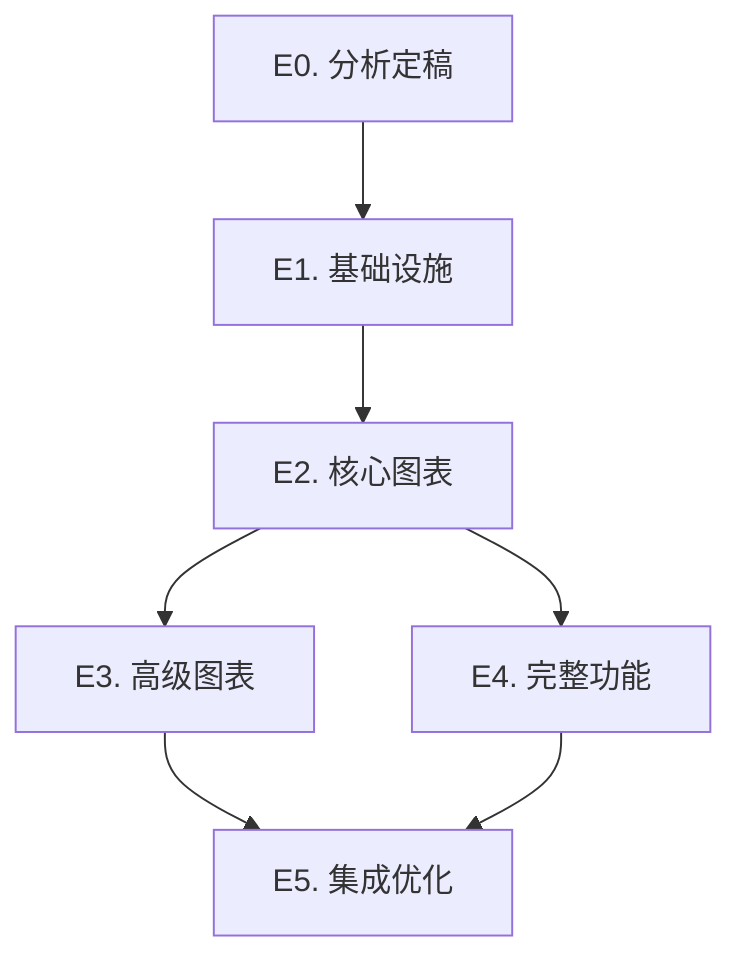

# ECharts 图表集成 Roadmap

> 最后更新：2026-09-06
> 来源：`analysis/echarts-migration-analysis.md`（分析报告 rev 2）
> Mission：`missions/echarts-integration.json`

## Purpose

本文是 ECharts 图表集成的开发路线图，覆盖双渲染器架构下的 `echarts` 渲染器落地（基础设施、核心图表、高级图表、完整功能、集成优化）。每个工作项（work item）是一个 execution plan 的合理交付范围。

AI 或维护者读完本文即知哪些工作项未开始（`todo`）、已计划（`planned`）、已完成（`done`），无需重走全部设计文档。

**本文是编排层，不是 execution plan，也不是设计契约。** 编写/更新规则见 `docs/backlog/00-roadmap-authoring-guide.md`。

## Phase Status

> **全文件唯一的动态状态区。**
> 状态流转：`todo` → `planned`（draft review 通过）→ `done`（closure audit 通过）

- **E0. 分析定稿** (`todo`)
- **E1. 基础设施** (`todo`)
- **E2. 核心图表** (`todo`)
- **E3. 高级图表** (`todo`)
- **E4. 完整功能** (`todo`)
- **E5. 集成优化** (`todo`)

## Framework / Platform Reuse

> 本项目已有的可复用能力，避免重复构建。

| 能力       | 来源包              | 复用方式                                   |
| ---------- | ------------------- | ------------------------------------------ |
| 表达式求值 | `flux-core`         | helpers.evaluate / 表达式编译器            |
| Scope 订阅 | `flux-react`        | useScopeSelector + paths                   |
| 渲染器注册 | `flux-react`        | createRendererRegistry（与 chart 并存）    |
| 事件通道   | `flux-runtime`      | events.* dispatch（click/hover → action）  |
| 图表基础   | `flux-renderers-data` | `chart`（recharts）零迁移，双渲染器并存  |

## Current Baseline

### 已有基础

- 现有 `chart` 渲染器（recharts，~50KB gzip）支持 6 种图表类型（bar/line/pie/scatter/area/heatmap），是普通图表场景的默认路径。
- 旧裁决（`docs/references/naming-conventions.md`）曾裁定"echarts 不采纳"；2026-09-06 更新为**双渲染器并存**：普通图表保持 `chart`（recharts），扩展/复杂自定义图表新增 `echarts` 渲染器，`chart` 渲染器不做 echarts config 透传。

### 主要缺口

- recharts 不支持桑基图、树图、箱线图、漏斗图、雷达图、K 线图、地理图等 24+ 种扩展图表。
- 复杂交互（brush/dataZoom）与自定义图表（custom series）超出 chart 表现层定位。

---

## Work Items

### E0 — 分析定稿

| ID   | Status | 内容                                                          | 设计文档                                                      | 依赖 |
| ---- | ------ | ------------------------------------------------------------- | ------------------------------------------------------------- | ---- |
| E0.1 | todo   | 收敛 `analysis/echarts-migration-analysis.md` rev 2 的三个 Open Questions（主题 token 方案、按需引入粒度、渲染器选择策略），结论从 open 转 closed | `analysis/echarts-migration-analysis.md` | —    |

### E1 — 基础设施

| ID   | Status | 内容                                                                                       | 设计文档                                                      | 依赖 |
| ---- | ------ | ------------------------------------------------------------------------------------------ | ------------------------------------------------------------- | ---- |
| E1.1 | todo   | `echarts` 渲染器骨架：基础组件（init/setOption/resize/dispose 生命周期）、schema 类型定义、结构验证、渲染器注册（与 `chart` 并存）；ECharts 作为可选依赖按需引入 | `analysis/echarts-migration-analysis.md`（§二/§三/§四）        | E0.1 |

### E2 — 核心图表

| ID   | Status | 内容                                                                                       | 设计文档                                                      | 依赖 |
| ---- | ------ | ------------------------------------------------------------------------------------------ | ------------------------------------------------------------- | ---- |
| E2.1 | todo   | dataset + encode 数据映射（对象数组 / 列式 / 二维数组），基础图表（bar/line/pie/scatter）落地，tooltip/legend 交互与主题配置 | `analysis/echarts-migration-analysis.md`（§三/§四）            | E1.1 |

### E3 — 高级图表

| ID   | Status | 内容                                                                                       | 设计文档                                                      | 依赖 |
| ---- | ------ | ------------------------------------------------------------------------------------------ | ------------------------------------------------------------- | ---- |
| E3.1 | todo   | 桑基图 (sankey)、树图 (treemap/tree)、箱线图 (boxplot)、仪表盘 (gauge)、漏斗图 (funnel)、雷达图 (radar) | `analysis/echarts-migration-analysis.md`（§五 Phase 3）        | E2.1 |

### E4 — 完整功能

| ID   | Status | 内容                                                                                       | 设计文档                                                      | 依赖 |
| ---- | ------ | ------------------------------------------------------------------------------------------ | ------------------------------------------------------------- | ---- |
| E4.1 | todo   | 地理图 (map) + GeoJSON 注册、K 线图 (candlestick)、力导向图 (graph)、旭日图 (sunburst)、主题河流 (themeRiver)、自定义图表 (custom) | `analysis/echarts-migration-analysis.md`（§五 Phase 4）        | E2.1 |

### E5 — 集成优化

| ID   | Status | 内容                                                                                       | 设计文档                                                      | 依赖 |
| ---- | ------ | ------------------------------------------------------------------------------------------ | ------------------------------------------------------------- | ---- |
| E5.1 | todo   | 按需引入（按图表类型粒度，控制包大小）、文档和示例、测试覆盖                                | `analysis/echarts-migration-analysis.md`（§五 Phase 5）        | E3.1, E4.1 |
| E5.2 | todo   | nop-datav 集成评估                                                                         | `analysis/echarts-migration-analysis.md`（§五 Phase 5）        | E5.1 |

---

## Dependency Graph

## Cross-Cutting

- **包大小**：ECharts 作为可选依赖、按需引入的决策在 E1 定型，影响 E2–E5 的每个图表类型落地方式
- **主题一致性**：recharts（CSS 变量 + Tailwind token）与 ECharts 主题体系并存，视觉一致性方案在 E0 裁决
- **渲染器共存契约**：`chart`（recharts）零迁移，`echarts` 不污染 chart schema，边界在 E1 落地并贯穿后续 phase
- **事件系统**：echarts 事件（click/hover）经 events.* 通道接入 Flux action graph，不发明平行事件命名

## Rule

1. 每个工作项对应一个 execution plan
2. 状态流转由 plan 生命周期驱动（`todo` → `planned` → `done`），不得提前标记 `done`
3. Phase Details 只列交付范围，不写实现步骤，不重复 owner doc 内容
4. 保持状态准确：任何 plan 闭合必须同步 Phase Status；过期状态比没有状态更糟
5. AI 不得重新裁定优先级或发明新 work item；结构调整（增删/改序）标记人工评审
6. 每个工作项完成后运行 typecheck/build/lint/test