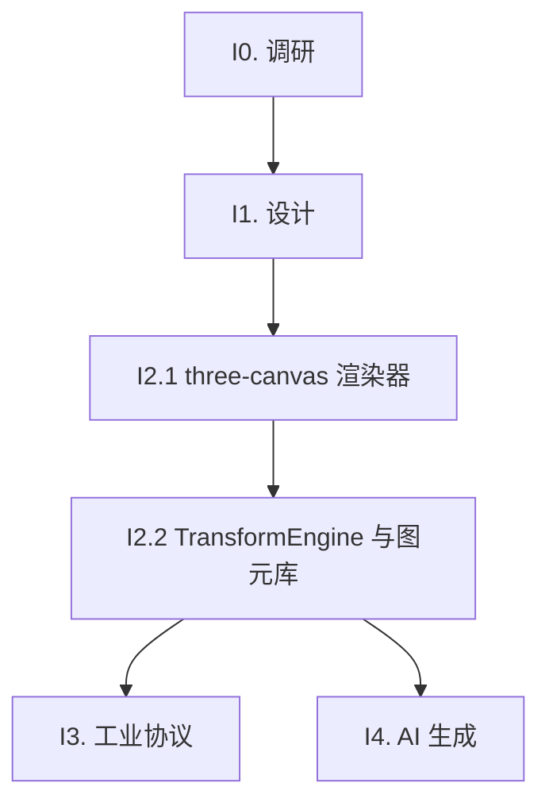

# Three.js 3D Rendering Integration Roadmap

> 最后更新：2026-09-13
> 来源：`docs/components/threejs-integration/design.md`（设计文档集 v5，含分册）、`docs/analysis/threejs-integration-analysis.md`（调研）
> Mission：`missions/threejs-integration.json`

## Purpose

本文是 Three.js 3D 渲染集成的开发路线图，覆盖 `three-canvas` 渲染器落地（调研、设计、核心引擎、工业协议、AI 生成）。每个工作项（work item）是一个 execution plan 的合理交付范围。

AI 或维护者读完本文即知哪些工作项未开始（`todo`）、已计划（`planned`）、已完成（`done`），无需重走全部设计文档。

**本文是编排层，不是 execution plan，也不是设计契约。** 编写/更新规则见 `docs/backlog/00-roadmap-authoring-guide.md`。

## Phase Status

> **全文件唯一的动态状态区。**
> 状态流转：`todo` → `planned`（draft review 通过）→ `done`（closure audit 通过）

- **I0. 调研** (`done`，plan: `docs/plans/463-threejs-i0-research-plan.md`)
- **I1. 设计** (`done`，plan: `docs/plans/464-threejs-i1-design-review-plan.md`)
- **I2. 核心引擎** (`done`：I2.1 plan `docs/plans/465-threejs-i2-renderer-plan.md`；I2.2 plan `docs/plans/466-threejs-i2-primitives-transform-plan.md`)
- **I3. 工业协议** (`done`，plan: `docs/plans/467-threejs-i3-protocol-plan.md`)
- **I4. AI 生成** (`todo`)

## Framework / Platform Reuse

> 本项目已有的可复用能力，避免重复构建。

| 能力        | 来源包                   | 复用方式                                                                                                                                                                           |
| ----------- | ------------------------ | ---------------------------------------------------------------------------------------------------------------------------------------------------------------------------------- |
| 表达式编译  | `flux-core`              | analyzeBindingSubscriptions                                                                                                                                                        |
| Scope 订阅  | `flux-react`             | useScopeSelector + paths                                                                                                                                                           |
| 动作分发    | `flux-react`             | useActionDispatcher                                                                                                                                                                |
| WebSocket   | RendererEnv              | env.openSocket                                                                                                                                                                     |
| Zustand     | zustand                  | vanilla store + useSyncExternalStore                                                                                                                                               |
| Socket 契约 | `flux-core` + playground | `RendererEnv.openSocket` 契约（`renderer-api.ts`）+ host 实现（`apps/playground/src/env/socket-impl.ts`）；scada 可复用的是其数据合帧模式，非 socket 代码（勘误详见调研文档 §7.3） |

## Current Baseline

### 已有基础

- 设计文档集 v5 已定稿（`docs/components/threejs-integration/`，design.md 总览 + renderer/data-binding/protocol/ai-generation 分册）：经 3 轮独立 sub-agent 共识审查（plan 464），六项决策 D1–D6 落纸。
- 调研产物：`docs/analysis/threejs-integration-analysis.md` + v2/v3 设计迭代。
- industrial-hmi 已落地 scada-canvas + 点表/表达式数据合帧桥接（PointStore/RefreshPipeline/useScopeSelector paths）；socket 侧 `openSocket` 契约与 host 实现分别在 `flux-core` 与 playground（industrial 包内无 socket 调用，勘误见调研文档 §7.3）。

### 主要缺口

- 无任何实现代码：`three-canvas` 渲染器、TransformEngine、图元库、协议适配器均为空白。
- 实现代码为零（表达式桥接与协议集成方案已随 v5 定稿，缺口只在实现）。

---

## Work Items

### I0 — 调研

| ID   | Status | 内容                                                                                                                                                            | 设计文档                                               | 依赖 |
| ---- | ------ | --------------------------------------------------------------------------------------------------------------------------------------------------------------- | ------------------------------------------------------ | ---- |
| I0.1 | done   | Three.js 核心 API 深度分析（场景/渲染器/几何/材质/灯光）、industrial-hmi 复用点确认、性能基准测试框架搭建（plan: `docs/plans/463-threejs-i0-research-plan.md`） | `docs/analysis/threejs-integration-analysis.md` §7–§10 | —    |

### I1 — 设计

| ID   | Status | 内容                                                                              | 设计文档                                                     | 依赖 |
| ---- | ------ | --------------------------------------------------------------------------------- | ------------------------------------------------------------ | ---- |
| I1.1 | done   | 设计 v4 共识审查（3 轮 sub-agent）、Flux 表达式桥接方案确认、工业协议集成方案确认 | `docs/components/threejs-integration/design.md`（v5 文档集） | I0.1 |

### I2 — 核心引擎

| ID   | Status | 内容                                                                                 | 设计文档                                                                            | 依赖 |
| ---- | ------ | ------------------------------------------------------------------------------------ | ----------------------------------------------------------------------------------- | ---- |
| I2.1 | done   | `three-canvas` 渲染器组件实现 + Flux 表达式编译器集成（analyzeBindingSubscriptions） | `docs/components/threejs-integration/design-renderer.md` + `design-data-binding.md` | I1.1 |
| I2.2 | done   | TransformEngine 实现 + 基础几何/材质图元库                                           | `docs/components/threejs-integration/design-data-binding.md` §5-§6                  | I2.1 |

### I3 — 工业协议

| ID   | Status | 内容                                                                    | 设计文档                                                 | 依赖 |
| ---- | ------ | ----------------------------------------------------------------------- | -------------------------------------------------------- | ---- |
| I3.1 | done   | ReconnectionManager 实现、Socket.IO/WebSocket 数据桥接、FUXA 协议适配器 | `docs/components/threejs-integration/design-protocol.md` | I2.2 |

### I4 — AI 生成

| ID   | Status | 内容                                                            | 设计文档                                                      | 依赖 |
| ---- | ------ | --------------------------------------------------------------- | ------------------------------------------------------------- | ---- |
| I4.1 | todo   | JSON Schema 验证、自然语言 → Three.js 场景转换、Gemini API 集成 | `docs/components/threejs-integration/design-ai-generation.md` | I2.2 |

---

## Dependency Graph

## Cross-Cutting

- **工业协议复用**：I3 复用 industrial-hmi 的数据合帧桥接模式（点表→scope），socket 走 `RendererEnv.openSocket` 契约 + 自建重连，不另起协议栈
- **AI 生成安全**：I4 的 AI 生成输出必须有 JSON Schema 验证兜底
- **表达式桥接**：I2 的 analyzeBindingSubscriptions 集成方案在 I1 定稿，贯穿后续 phase

## Rule

1. 每个工作项对应一个 execution plan
2. 状态流转由 plan 生命周期驱动（`todo` → `planned` → `done`），不得提前标记 `done`
3. Phase Details 只列交付范围，不写实现步骤，不重复 owner doc 内容
4. 保持状态准确：任何 plan 闭合必须同步 Phase Status；过期状态比没有状态更糟
5. AI 不得重新裁定优先级或发明新 work item；结构调整（增删/改序）标记人工评审
6. 设计文档共识审查：3 轮 sub-agent，超限升级人工
7. 每个工作项完成后运行 typecheck/build/lint/test
