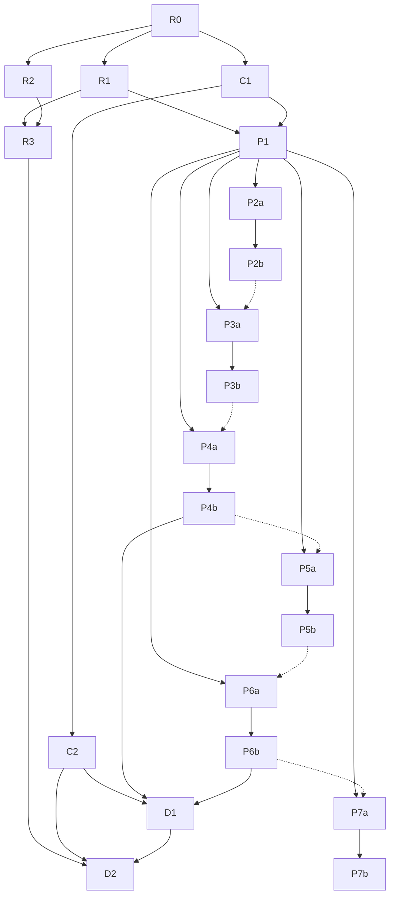

# UI Review Roadmap：对标分析 + 一致性审查 + 复杂页面构想 + 参考应用复刻

> Last Updated: 2026-08-31（D1 第 5 个产品化 plan 执行完毕：`docs/plans/2026-08-30-2312-2-d1-gb3-batch-bar-semantic-component.md` 全 Phase completed（closure audit 见 plan Closure 记录）——G-B3 批量操作栏语义件产品化：新 `batch-bar` renderer type 落 flux-renderers-data（`selectionPath` raw scope path 反应式绑定双宿主通用（crud 嵌套 `$crud.selectedRowKeys` / table 页面级 `selectionStatePath`）+ `countTemplate` lazyEval 子作用域求值（缺省 i18n，失败回退原始计数+dev warn）+ `actions` region + `clearTarget`/`clearLabel` 内建清空（registry 解析 → crud `clearSelection` 优先 → table `setSelection` 空集兜底的统一句柄 facade）+ 内建非空可见门控（与 `visible` 取 AND 不可绕过）；`rowSelection.selectAllMode: 'all'|'page'` crud/table 双侧采纳（'page' = check/uncheck-all-visible 与手动逐行勾选同构、服务端分页与 'all' 同源、表头勾选态页感知、max/checkable/modifier 共存矩阵锁定、radio 惰性、缺省 'all' 零回归）；26 条先红后绿单测；C2 回写 ⑬ + renderer-interfaces.md 两节终稿 + flux-guide 两处条目 + styling-system 核查零改动；详见下方 D1 条目与 plan Closure 记录；同日早前：2026-08-31（D1 第 4 个产品化 plan 执行完毕：`docs/plans/2026-08-30-2312-1-d1-gb2-keyboard-navigation-framework.md` 全 Phase completed（closure audit 见 plan Closure 记录）——G-B2 键盘导航框架产品化：不可见 logic renderer `keyboard`（bindings 单键位/chord + when 门控 + allowInInput + preventDefault + action/onTrigger 双轨 + chordTimeout，恒渲染 null）+ flux-react 共享键盘解析 helper（parse/chord 状态机 + 输入门控 + 内建优先 + surface 栈路由）+ command-palette parseHotkey 抽出换共享实现零回归 + table `rowSelection.modifierSelect` 选区修饰键（⇧click 加法并集/锚点/meta 切换/⌘A）+ J/K 指针组合验证成立；59 条先红后绿单测；C2 回写 ⑫ + renderer-interfaces.md 两节终稿 + flux-guide 两处条目 + styling-system 核查零改动；详见下方 D1 条目与 plan Closure 记录；同日早前：2026-08-30（D1 第 3 个产品化 plan 执行完毕：`docs/plans/2026-08-30-1737-2-d1-ga-page-template-semantic-components.md` 五 Phase 全 completed、closure audit 通过（fresh session 独立子 agent `ses_facd8a02effehnkTZqD2p7Smo6` 1 轮 APPROVED 零 Blocker/零 Major/零 Minor，3 Trivial + 1 Informational 随收口处置——page.tsx aside-toggle-only 边缘空 className 修复复绿 / Decision 5 i18n 新键注销 / diff summary 漏记登记测试行记录性 / gates 勾选时点差异非缺陷）——G-A 页面模板层语义件族产品化：PageHeader（`page` renderer 语义增强 L2 零新 type：`breadcrumb` 字段组合 ui Breadcrumb 七件 + `extra` region + 语义/legacy 双分支 header compat DOM 等价锁定 + truncate 溢出语义）、QueryFilter（新 `query-filter` renderer type 落 flux-renderers-data：body 降嵌套 form + 查询/重置内建 + togglable 包络 + 网格转发 + crud 主通道零改动 + dead config 分轨处置——queryForm.defaultCollapsed 族 @deprecated + warning 诊断、filterTogglable label 族接线消费 + 同源在库 bug「`filterTogglable: true` boolean 被 propContract 门禁静默丢弃」修复回归锁定）、Result（新 `result` renderer type 落 flux-renderers-content：status 四语义映射 + icon 覆盖 + actions 单通道 + 非法 status info 兜底 + dev warn）；38 条先红后绿单测（page-header 9 + query-filter 19 + result 10，补强断言变异校验）；C2 回写 ⑪（append-only 13+/0−）+ renderer-interfaces.md 三语义件 Status: landed 终稿 + flux-guide `design-patterns/page-templates.md` 新增 + styling-system 核查零改动；执行中断恢复完成（前序 session 产出 Phase 1–3 与 Phase 4 代码主体，恢复 session 补完登记尾巴 + Phase 5 收口）；closure 前 lint 三修（面包屑 index key → 内容派生 / result.tsx React.createElement 化解 React Compiler 门 / 未用 import 移除）；详见下方 D1 条目与 plan Closure 记录；同日早前：D1 第 2 个产品化 plan 执行完毕：`docs/plans/2026-08-30-1737-1-d1-gb1-command-palette-renderer-primitive.md` 三 Phase 全 completed、closure audit 通过（fresh session 独立子 agent `ses_fad67619dffeuwrWgYWwGx7CHK` 1 轮 APPROVED 零 Blocker/零 Major/零 Minor，2 Trivial——83 个 e2e replica 截图噪声 diff 随收口回退还原 + dev log 前向引用随 Closure 落字自洽）——G-B1 ⌘K command-palette 原语产品化（`command-palette` renderer type 落 flux-renderers-basic + ui Command 九件包装：静态 groups/items 双轨 + source 动态轨 + onCommand/条目 action 执行双轨 + 面板即关 + cmdk 内建键盘/过滤/空态 + surface 开合契约族复用 + `hotkey` 单键位呼出 + 编译期受控 open 路径捕获 plan-459 重开对等；31 条先红后绿单测；flux-core/ui 零改动）+ C2 回写 ⑩ + renderer-interfaces.md §Command Palette Surface Contract + flux-guide §8 条目；详见下方 D1 条目与 plan Closure 记录；同日早前：1737 批次：D1 第 2/3 个产品化 plans 起草并经独立 fresh session review 零 Blocker/零 Major 转 active——G-B1 command-palette（`ses_fadf14cf5ffe0NwLP3rtsiEXrE` 1 轮 `pass-with-minors`，4 Minor 随共识修复）+ G-A 页面模板语义件族（`ses_fadf0fd5cffeL2obcn1CNHz50o` 1 轮 `pass-with-minors`，5 Minor 随共识修复）；plan `docs/plans/2026-08-30-1737-1-d1-gb1-command-palette-renderer-primitive.md`（C2 §2 第 2 位）+ `docs/plans/2026-08-30-1737-2-d1-ga-page-template-semantic-components.md`（C2 §2 第 3 位），执行顺序 G-B1 → G-A 已写入 plan；详见下方 D1 条目。同日早前：D1 首个产品化 plan 执行完毕：`docs/plans/2026-08-30-1333-2-d1-gf-option-row-primitive.md` 四 Phase 全 completed、closure audit 通过（fresh session 独立子 agent `ses_fae13c0b9ffe0VipFysb4ADBpH` 1 轮 APPROVED 零 Blocker/零 Major，2 Minor + 2 项可修 Trivial 随收口修复）——G-F option-row 原语产品化（`optionRow` 字段族落 list/table + flux-react 共享 helper + ai-feedback 投票态标准通道采纳，33 条先红后绿单测）+ G-F2 终态关闭（被 G-F 吸收）随回写 ⑨ 落 C2；详见下方 D1 条目与 plan Closure 记录；同日早前：P7b `planned`→`done`：plan `docs/plans/2026-08-30-1333-1-p7b-stripe-interaction-wiring-and-tests.md` 四 Phase 执行完毕、closure audit 通过（fresh session 独立子 agent `ses_fae64ea42ffesnymhQ21CVu2Pk` 1 轮 APPROVED 零 Blocker/零 Major，2 Minor 记录性修正随收口落字）——详见下方 P7b 条目与 plan Closure 记录；ui-review mission 主线 P1–P7 两段式全部收口，Next: D1 产品化 plans（D1 触发条件已满足，执行顺序受 P7b 虚线约束现已解除）；同日早前：P7b/D1 `todo`→`planned`：两份 draft plan 经独立 fresh session review 通过转 active（`ses_faeceb4d3ffeaPGsrBvwm81ga3` R1 全量四查 + R2 scoped re-check 两轮：P7b R1 `pass-with-minors` 零 Blocker/零 Major，5 Minor 随共识修复（mock 行数误植/mock-backend.ts 归属路径/Follow-up 条件性 Fix 口径/Phase 4 Item Types 补 Decision/共写面补列 C2）；D1 option-row plan R1 `revised` 1 Major（族2 候选包错置 `flux-renderers-content` → mobile/ai/scheduling）+ 4 Minor 随共识修复，R2 双 `pass` 零 Blocker/零 Major；plan `docs/plans/2026-08-30-1333-1-p7b-stripe-interaction-wiring-and-tests.md` + `docs/plans/2026-08-30-1333-2-d1-gf-option-row-primitive.md`——后者为 D1 首个产品化 plan（G-F option-row 原语含 G-F2 终态裁决，D1 触发条件 C2 `done` + P4b `done` + P6b `done` 已满足），执行顺序受 P7b 虚线约束已写入 plan））；同日早前：P7a `planned`→`done`：plan `docs/plans/2026-08-30-0953-2-p7a-stripe-dashboard-static-replica.md` 三 Phase 执行完毕、closure audit 通过（fresh session 独立子 agent `ses_faee9e7d7ffecXp5lpwKVzYIJA` 1 轮 APPROVED 零 finding）；单页 `stripe-payments` 静态复刻（导航 shell 形态七组十四条目 + blurple 选中态样本/筛选 chip 条与日期范围预设档与搜索降级形态零生效/高密度交易表格 36 行 mock 流动·客户端分页 4 页·状态 pill 四语义色阶对·金额 tabular-nums 右对齐·部分列排序 chevron 形态/交易明细抽屉摘要·时间线·元数据三分区/导出模态与添加 widget 勾选列表双 dialog/图表卡区 KPI 卡 ×4 + 净额双曲线 recharts line）+ `stripe-replica.css` 令牌复刻（blurple `#635bff` 📊 独立令牌/四语义色阶对三件套/密度三档 32·40·48/Inter 近似/light-only，`.st-root,.st-dialog` 双作用域）+ `Stripe__` 3 端点 get-only mock 读分支（payments 分页 ≥3 页 + keyword/status 兜底、payment 明细 + 占位兜底、overview KPI + 30 点双曲线 + 空序列兜底；mock 四件拆分全 ≤500，showcase-env 余量整理后 wc 687/门禁 688 双口径，mock-backend.ts 零触碰）+ 15 条 mock 单测 + 5 条 e2e 全绿 + G-E/G-B3 静态实测结论九节落字（密度三档实测/色阶对终判/等宽排版/金额格式化双轨/chip·日期·搜索表达边界/无批量栏 G-B3 对照/widget 边界/排序与 URL 同步初判/分析篇逐行复核一处落点勘误）+ 差异声明 D1/D2/D3 落字（单页裁定/Balance 裁剪/浮层六载体/pill 四态/令牌差异），全量验证 full-green，详见 plan Closure 记录；交互接线与测试归 P7b）；同日早前：P6b `planned`→`done`：plan `docs/plans/2026-08-30-0953-1-p6b-airtable-interaction-wiring-and-tests.md` 四 Phase 执行完毕、closure audit 通过（fresh session 独立子 agent 两轮：`ses_faf349015ffeR7LLlG3AimCygf` R1 `ISSUES` 3 Major + 1 Minor →全部修复→`ses_faf28ff66ffe3z64YF8uT7UiQI` R2 scoped re-audit APPROVED 零 Blocker/零 Major）；`Airtable__` 3 个写端点会话态（updateRecord/createRecord/updateViewConfig——A5 排序机制实测修正增设）+ 单页 schema 七项接线锁定（A1 搜索/A5 排序/A8 分组/A9 行高/A10 插行/A11a 编辑保存/A11b prev-next dialog 内重载）+ 处置表 A1–A16 与键盘十五键位终态表落字（显式裁决八条，无静默跳过）+ 22 条 mock 单测 + 11 条交互 e2e（目标 e2e 17/17 全绿）+ C2 回写 ⑦ + 分析篇 §4.4 对照与 §5 两行勘误，全量验证 full-green，详见 plan Closure 记录）；同日早前：P6b/P7a `todo`→`planned`：两份 draft plan 经独立 fresh session review 通过转 active（`ses_faf94f6d4ffeq6yERh5IxyuQu8` 各 1 轮 pass-with-minors 零 Blocker/零 Major，2+2 Minor 随共识修复；plan `docs/plans/2026-08-30-0953-1-p6b-airtable-interaction-wiring-and-tests.md` + `docs/plans/2026-08-30-0953-2-p7a-stripe-dashboard-static-replica.md`，P7a 执行时序受 P6b 虚线约束已写入 plan）；同日早前：P6a `planned`→`done`：plan `docs/plans/2026-08-30-0614-2-p6a-airtable-grid-static-replica.md` 三 Phase 执行完毕、closure audit 通过（fresh session `ses_fafb62ebdffeubGr72pTIkBsrh` R1 `issues` 1 Major（行数记录中间态）+ 3 Minor →修复→`ses_fafaea25effeFLo6S4feG0t0qs` R2 scoped re-audit APPROVED 零 finding）；单页 `airtable-grid` 静态复刻（20 列型别分派网格 + summary bar + 分组样本 + 行高四档 + 列头菜单/Hide fields/record modal 三浮层）+ `airtable-replica.css` 令牌 + `Airtable__` 2 端点 get-only mock（四件拆分，showcase-env 699/700 双口径）+ 13 条 mock 单测 + 6 条 e2e 全绿 + G-D 静态实测结论（键盘 15 键位缺口清单等）+ 分析篇 §5 勘误，全量验证 full-green，详见 plan Closure 记录）；同日早前：P5b `planned`→`done`：plan `docs/plans/2026-08-30-0614-1-p5b-notion-interaction-wiring-and-tests.md` 全 Phase 执行完毕、closure audit 通过（fresh session `ses_fafff478cffeG21SJs0O0vQanH` R1 APPROVED 零 Blocker/零 Major，3 Minor 记录性修正随收口落字）；`Notion__` 5 端点（4 写 + copyLink）会话态 + 单页 schema 交互接线（I5 搜索/I8 新建 5 入口/I6+I10 peek 编辑/I3 filter/I4 sort/I9 拖拽/I11 group/日历 `+`）+ mock 模块五件拆分 + 22 条 mock 单测 + 14 条交互 e2e（N1–N14 逐条处置）+ C2 回写 ⑥ + 分析篇 §4.1 对照，全量验证 full-green，详见 plan Closure 记录）；同日早前：P5b/P6a `todo`→`planned`：两份 draft plan 经独立 fresh session review 通过转 active（`ses_fb05df864ffeBQsSWCYP7XeySM` 各 1 轮 pass 零 Blocker/零 Major，4 Minor 随共识修复；plan `docs/plans/2026-08-30-0614-1-p5b-notion-interaction-wiring-and-tests.md` + `docs/plans/2026-08-30-0614-2-p6a-airtable-grid-static-replica.md`，P6a 执行时序受 P5b 虚线约束已写入 plan）；同日早前：P5a `planned`→`done`：plan `docs/plans/2026-08-30-0040-2-p5a-notion-database-static-replica.md` 全 Phase 执行完毕、closure audit 通过（fresh session 两轮：`ses_fb098471effeL2VnKlL8rwhh1f` R1 issues 1 Major + 4 Minor →修复→`ses_fb08d4f35ffel36MFdkW2uOmyi` R2 scoped re-audit APPROVED 零 finding）；单页 `notion-database` schema 五视图静态复刻 + `notion-replica.css` 浅色令牌 + `Notion__` 3 端点 get-only mock + 15 条 mock 单测 + 6 条初屏 e2e 全绿 + G-C 静态实测结论落字 + 分析篇 §5 勘误，全量验证 full-green，详见 plan Closure 记录）；同日早前：P4b `planned`→`done`：plan `docs/plans/2026-08-30-0040-1-p4b-linear-interaction-wiring-and-tests.md` 全 Phase 执行完毕、closure audit 通过（fresh session 两轮：`ses_fb0f28534ffeSbxjF4OS4giq0z` R1 REJECTED 1 Blocker（C2 回写⑤缺 G-A cardTemplate 引用）→修复→`ses_fb0e88198ffeUomdn1HZjztDiZ` R2 scoped re-audit APPROVED 零新 finding）；6 个 `Linear__` 写端点会话态 + 4 张 schema 交互接线 + 18 条交互 e2e（L1–L14 逐条处置）+ C2 回写 ⑤ + 分析篇 §4.8 对照与 §5 勘误，全量验证 full-green，详见 plan Closure 记录）；同日早前：P4b/P5a `todo`→`planned`：两份 draft plan 经独立 fresh session review 通过转 active（`ses_fb1927b7bffeqTLpboIxsYZSWY` 2 轮：P4b R1 fail（2 Major：⇧click/⌘A 非 table 内建、`component:clearSelection` 仅为 crud 句柄）修复后 R2 pass-with-minors；P5a R1 pass-with-minors，均零 Blocker/Major 达成共识；plan `docs/plans/2026-08-30-0040-1-p4b-linear-interaction-wiring-and-tests.md` + `docs/plans/2026-08-30-0040-2-p5a-notion-database-static-replica.md`，P5a 执行时序受 P4b 虚线约束已写入 plan）；同日早前：P4a `planned`→`done`：plan `docs/plans/2026-08-29-1819-2-p4a-linear-tracker-static-replica.md` 全 Phase 执行完毕、closure audit 通过（fresh session `ses_fb1adfa83ffeCRq6zO65oUo012`，APPROVED 零 Blocker/Major，3 Minor 随收口登记/落字）；6 张 `linear-*` schema + `linear-replica.css` 深色令牌复刻 + `Linear__` 5 端点 get-only mock 读分支 + 18 条 mock 单测 + 6 条初屏结构 e2e 全绿；键盘缺口静态证据清单落字（G-B1/G-B2/G-B3 供 P4b/C2 回写）；全量验证 full-green，详见 plan Closure 记录；同日早前：P3b `planned`→`done`：plan `docs/plans/2026-08-29-1819-1-p3b-cal-booking-interaction-wiring-and-tests.md` 全 Phase 执行完毕、closure audit 通过（fresh session `ses_fb21272a7ffennzqXt26oRIoxX`，approved-with-minors 零 Blocker/Major，2 Minor 随收口修复/登记）；5 个 `Cal__` 写端点会话态 + 3 张 `cal-*` schema 交互接线 + 16 条交互 e2e（I1–I15 逐条处置）+ C2 回写 ④ + 分析篇 §4.1 对照，全量验证 full-green，详见 plan Closure 记录；同日早前：P3b/P4a `todo`→`planned`：两份 draft plan 经独立 fresh session review 通过转 active（P3b：`ses_fb2ece73cffePZpRk7cBVSnwqr` 1 轮 pass-with-minors；P4a：`ses_fb2ecb628ffe9AVbcoSat7Gxin` 2 轮 fail→修复→pass-with-minors，均零 Blocker/Major；plan `docs/plans/2026-08-29-1819-1-p3b-cal-booking-interaction-wiring-and-tests.md` + `docs/plans/2026-08-29-1819-2-p4a-linear-tracker-static-replica.md`，P4a 执行时序受 P3b 虚线约束已写入 plan）；同日早前：P3a `planned`→`done`：plan `docs/plans/2026-08-29-1413-2-p3a-cal-booking-static-replica.md` 全 Phase 执行完毕、closure audit 通过（fresh session `ses_fb3036002ffe63FU6OjzSqBCF5`，approved-with-minors 零 Blocker/Major，2 Minor 随收口修复/勘误）；3 张 `cal-*` 复刻页 schema（booking 双栏槽位视图/confirm 确认表单/success 成功态，category `app-replica`）+ `cal-replica.css` 令牌复刻（品牌黑换名 `--cal-action*`、radius 10px 官方实证、light-only）+ 2 个 `Cal__` get-only mock 读端点 + 12 条 mock 单测 + 3 条初屏 e2e 全绿；联动可模拟性实测结论（P3b 接线路径 + G-C 证据）落字 plan；全量验证 full-green，详见 plan Closure 记录；同日早前：P2b `planned`→`done`：plan `docs/plans/2026-08-29-1413-1-p2b-antdpro-interaction-wiring-and-tests.md` 全 Phase 执行完毕、closure audit 通过（fresh session `ses_fb34349c2ffesT42CsbGgFKTwi`，approved-with-minors 零 Blocker/Major）；5 个 `AntdPro__` 写端点 + 8 张 schema 交互接线 + 23 条交互 e2e（I1–I18 逐条处置）+ C2 回写 ③ + 分析篇 §4.1 对照，全量验证 full-green，详见 plan Closure 记录；同日早前：P2b/P3a `todo`→`planned`：两份 draft plan 经独立 fresh session review 通过转 active（`ses_fb3d26ccdffeDayA2Mzzb1gI5B`，各 2 轮，pass-with-minors 零 Blocker/Major；plan `docs/plans/2026-08-29-1413-1-p2b-antdpro-interaction-wiring-and-tests.md` + `docs/plans/2026-08-29-1413-2-p3a-cal-booking-static-replica.md`，P3a 执行时序受 P2b 虚线约束已写入 plan）；同日早前：P2a `planned`→`done`：plan `docs/plans/2026-08-29-1240-1-p2a-antdpro-template-static-replica.md` 全 Phase 执行完毕、closure audit 通过（fresh session `ses_fb3e7a832ffe1Sy9XzXORpZMg9`，approved 零 Blocker/Major）；9 张 `antdpro-*` 复刻页 schema + 复刻 CSS + mock 读端点 + e2e/单测全绿落盘，详见 plan Closure 记录；同日早前：P2a `todo`→`planned`：draft review 通过（fresh session `ses_fb42bafc7ffeAjI6YMQRyheT8z`，2 轮，pass-with-minors 零 Blocker/Major）；同日早前：P1 `planned`→`done`：plan 2026-08-29-0419-2 全 Workstream 执行完毕、closure audit 通过（fresh session `ses_fb43c6d5bffeL4kz0gnJfK3aWM`，approved-with-minors）；产出 `docs/analysis/ui-review/P1-reference-apps/`（复刻工程规范 README + 6 篇应用分析篇，能力映射逐行 C2 对照 + 5 闭源应用差异声明）；同日早前：R3 `planned`→`done`：plan 2026-08-29-0419-1 全 Phase 执行完毕、closure audit 通过（fresh session `ses_fb4589abaffeqrHt1MkZyRtBw7`，approved 零 Blocker/Major）；17 条 P0/P1 修复 + P2 172 条裁决（3 随批修/169 候选）+ P3 87 条登记，落点与台账见 `R2-consistency-audit.md` §R3 收口节；R3/P1 `todo`→`planned` 两份 plan 转 active，R2 `planned`→`done`）
> Source: 用户目标指令（2026-08-19，四项要求：对标成熟框架的详尽分析 / 复杂页面构想验证承载力 / 线上调研参考应用并仿制页面与交互 / UI 一致性自查）；拟制流程按 `docs/skills/roadmap-and-mission-authoring-with-consensus-review.md`；复刻方法论先例 `docs/analysis/sundial-ui-reproduction-analysis.md`
> Mission: `missions/ui-review.json`
> **分支纪律**：本 roadmap 全部工作在 worktree `nop-chaos-flux-ui-review`（分支 `ui-review`）执行，禁止直接落在 master 工作区；合并回 master 为人工门禁（见 Cross-Cutting §1）。

## Purpose

本文是 UI review 专题的编排层（roadmap），覆盖四条相互衔接的工作线：

1. **对标分析**：把 nop-chaos-flux 的 UI **美观度**与**完善度**对照成熟体系（AMIS / Ant Design + Pro / shadcn/ui + blocks 生态 / Retool·Appsmith·ToolJet·Budibase 同品类低代码构建器 / Vant 移动端）做详尽的、有证据的分维评估。
2. **一致性审查**：用 `docs/skills/ux-design-pattern-audit-prompt.md` 对全部 renderer 包与 playground 复杂页做多轮递归的视觉/交互一致性审查并修复。
3. **复杂页面构想**：构想一批"类似 Sundial 这种"的高复杂度页面（三栏工作台、高密度数据表、看板拖拽、预约流程、多视图数据库、命令面板……），逐页预判当前设计能否承载、缺口在哪。
4. **参考应用复刻**：线上调研一批参考软件/参考应用，按 Sundial 已验证的复刻方法论（令牌提取 → 页面复杂度排序 → 能力映射 → schema+CSS 复刻 → 交互接线 + mock 后端 + e2e）仿制其页面与核心交互。

先例结论（`sundial-ui-reproduction-analysis.md` §6）：**"外部应用复刻作为能力发现器"成立**——Sundial 复刻直接驱动了 7 项能力改进中的 6 项（responsive 断点容器、collapse 语义字段、checkbox shape、chart 逐点上色、`?.[0]` 表达式、openDialog meta 透传）。本 roadmap 把该单点验证放大为持续机制。

本文不是 execution plan，不是逐组件契约说明。对标矩阵看 R1 产出文档；复刻工程规范看 P1 产出文档；一致性发现看 R2 产出文档。

## Phase Status

> **这是全文件唯一的动态状态区。更新状态只改这里。**
> 状态流转：draft review 通过 → `todo` 改 `planned`；closure audit 通过 → `planned` 改 `done`（不得提前）。执行顺序 = 本列表顺序（R → C → P → D），AI 不重排。
> 拆分阀：单个 work item 若实测一个 plan 收不下（最高风险：R2/R3、P2a），经人工确认拆分为带独立状态的子项后更新本区，不默认囤积。

- R0. UI 资产盘点与基线实测: `done`
- R1. 成熟框架对标分析（美观度 × 完善度双维评分卡）: `done`
- R2. 全量 UI 一致性审查（ux-design-pattern-audit 多轮递归）: `done`（plan `docs/plans/2026-08-28-1701-1-r2-consistency-audit.md`，2026-08-29 closure audit 通过；产出 `docs/analysis/ui-review/R2-consistency-audit.md`，276 发现 → 273 保留/3 降级/0 驳回，P0 5/P1 12/P2 172/P3 87）
- R3. 一致性 P0/P1 修复与共性归类收口: `done`（plan `docs/plans/2026-08-29-0419-1-r3-consistency-p0p1-remediation.md`，2026-08-29 closure audit 通过；17 条 P0/P1 先红后绿修复 + P2 172 条裁决（随批修 3/候选 169/拒绝 0）+ P3 87 条登记终态；落点清单与裁决台账见 `docs/analysis/ui-review/R2-consistency-audit.md` §R3 收口节 + `r2-audit/r3-p2-adjudication.md`）
- C1. 复杂页面构想清单与能力压力预判: `done`
- C2. 能力差距汇总与分级裁决（滚动文档）: `done`（初版裁决收口；Pi-b 回写走追加区）
- P1. 参考应用线上调研与复刻工程规范: `done`（plan `docs/plans/2026-08-29-0419-2-p1-reference-app-research-and-replication-spec.md`，2026-08-29 closure audit 通过（fresh session `ses_fb43c6d5bffeL4kz0gnJfK3aWM`，approved-with-minors，3 Minor 随收口修正）；产出 `docs/analysis/ui-review/P1-reference-apps/`：复刻工程规范 README（slug 分配表 / mock 与 e2e 模板 / 分析篇模板 / 验收维度）+ 6 篇应用分析篇（ant-design-pro / cal-booking / linear / notion-database / airtable-grid / stripe-dashboard），P2a–P7b 可凭 README 开工）
- P2a. Ant Design Pro 页面模板族 — 分析与静态复刻: `done`（plan `docs/plans/2026-08-29-1240-1-p2a-antdpro-template-static-replica.md`，2026-08-29 closure audit 通过（fresh session `ses_fb3e7a832ffe1Sy9XzXORpZMg9`，approved 零 Blocker/Major）；产出 9 张 `antdpro-*` 页面 schema（list/form×4/detail×2/dashboard/result，category `app-replica`）+ `antdpro-replica.css` 令牌复刻（差异裁定：圆角 6→8px）+ 3 个 `AntdPro__` get-only mock 读端点 + 10 条初屏 e2e + 12 条 mock 单测，全量验证 full-green；交互接线与测试归 P2b）
- P2b. Ant Design Pro 页面模板族 — 交互接线与测试: `done`（plan `docs/plans/2026-08-29-1413-1-p2b-antdpro-interaction-wiring-and-tests.md`，2026-08-29 closure audit 通过（fresh session `ses_fb34349c2ffesT42CsbGgFKTwi`，approved-with-minors 零 Blocker/Major，1 Minor 文本计数勘误随收口修正）；产出 5 个 `AntdPro__` mock 写端点（saveOrder/deleteOrders/approveOrder/submitForm/selectOrder，先红后绿 9 条写操作单测）+ 8 张 `antdpro-*` schema 交互接线（list CRUD/批量/工具栏、form×4 提交链路、审批翻转、result/detail 导航）+ `tests/e2e/antdpro-replica-interactions.spec.ts` 23 条交互 e2e（分析篇 §4 交互清单 I1–I18 逐条处置落终态表）；C2 回写 ③ + 分析篇 §4.1「预测 vs 实测」对照落字；全量验证 full-green，零 `packages/` 改动）
- P3a. Cal.com 预约流程复刻 — 分析与静态复刻: `done`（plan `docs/plans/2026-08-29-1413-2-p3a-cal-booking-static-replica.md`，2026-08-29 closure audit 通过（fresh session `ses_fb3036002ffe63FU6OjzSqBCF5`，approved-with-minors 零 Blocker/Major，2 Minor 随收口修复/勘误）；产出 3 张 `cal-*` 页面 schema（cal-booking 入口+双栏槽位选择/cal-confirm 确认表单/cal-success 成功态，category `app-replica`）+ `cal-replica.css` 令牌复刻（差异裁定：品牌黑语义换名 `--cal-action*`、radius 10px 官方实证维持、Cal Sans→Inter/系统栈、light-only）+ 2 个 `Cal__` get-only mock 读端点（event/slots，showcase-env.ts 691 行 ≤700 红线）+ 12 条 mock 单测 + 3 条初屏 e2e；联动可模拟性实测结论（calendar dateOwnership scope 写入 + data-source url 逐次物化 + refreshSource by name 的 P3b 接线路径；interval 内建/聚焦刷新缺口随 P3b 判断）落字 plan；执行期登记缺口修复：complex-pages registry 追加 `registerSchedulingRenderers`（render-host.tsx，零 `packages/` 改动）；全量验证 full-green；交互接线与测试归 P3b）
- P3b. Cal.com 预约流程复刻 — 交互接线与测试: `done`（plan `docs/plans/2026-08-29-1819-1-p3b-cal-booking-interaction-wiring-and-tests.md`，2026-08-29 closure audit 通过（fresh session `ses_fb21272a7ffennzqXt26oRIoxX`，approved-with-minors 零 Blocker/Major，2 Minor 随收口修复/登记）；产出 5 个 `Cal__` mock 写端点会话态（selectSlot 会话指针/book 失效失败分支/cancelBooking 翻转/addGuest·removeGuest 嘉宾列表，先红后绿单测）+ 3 张 `cal-*` schema 交互接线（booking 槽位→确认链路 + confirm 提交/校验/嘉宾增删/失效返回/回退预填 + success 状态感知徽章/复制链接语义模拟/重排/取消 dialog）+ `tests/e2e/cal-replica-interactions.spec.ts` 16 条交互 e2e（分析篇 §4 I1–I15 逐条处置落终态表 §4.1）+ opt-in e2e 观察钩子（`__calEndpointCalls`/`__calTestHooks`，生产 no-op）；C2 回写 ④（G-F/G-C 实测 + 候选 1/2 收口 + refreshSource scope 桶限定 finding）+ 分析篇 §4.1「预测 vs 实测」对照落字；全量验证 full-green，零 `packages/` 改动）
- P4a. Linear 风格 issue tracker 复刻 — 分析与静态复刻: `done`（plan `docs/plans/2026-08-29-1819-2-p4a-linear-tracker-static-replica.md`，2026-08-30 closure audit 通过（fresh session `ses_fb1adfa83ffeCRq6zO65oUo012`，APPROVED 零 Blocker/Major，3 Minor 随收口登记/落字）；产出 6 张 `linear-*` 页面 schema（issues 列表+批量栏/Display 抽屉/⌘K 壳/peek 浮层、board 看板、inbox 收件箱、detail 详情、projects 项目周期、settings 设置，category `app-replica`）+ `linear-replica.css` 令牌复刻（dark-only；背景四层/文本四级/品牌紫三档/rgba pill 模式/圆角层级 2·4·6·8·12·9999；差异声明三项 Decision 落字：页面粒度 6 张、浮层与替代承载（dialog ⌘K 壳/peek、drawer Display、自绘头像、纯 text 描述）、令牌抽样比对+priority 等效+510→500+JetBrains Mono）+ `Linear__` 5 端点 get-only mock 读分支（issues 含 board 视图/inbox/issue 详情/projects/commands，showcase-env.ts 699 行 ≤700 红线，mock-backend.ts 零触碰）+ 18 条 mock 单测 + 6 条初屏结构 e2e 全绿；键盘缺口静态证据清单（键位↔承载物↔缺口↔可模拟性初判，G-B1/G-B2/G-B3 对应）落字 plan 供 P4b 与 C2 回写；执行期实测：kanban cardTemplate region 无 params 绑定（默认卡面承载，G-A 证据）、`draggable:false` 必须显式声明（renderer 默认开启）；分析篇 §5 逐行复核无矛盾（No owner-doc update required）；全量验证 full-green；交互接线与测试归 P4b）
- P4b. Linear 风格 issue tracker 复刻 — 交互接线与测试: `done`（plan `docs/plans/2026-08-30-0040-1-p4b-linear-interaction-wiring-and-tests.md`，2026-08-30 closure audit 通过（fresh session `ses_fb0f28534ffeSbxjF4OS4giq0z` R1 REJECTED 1 Blocker→修复→`ses_fb0e88198ffeUomdn1HZjztDiZ` R2 scoped re-audit APPROVED 零新 finding）；产出 6 个 `Linear__` 写端点会话态（bulkUpdate/createIssue/archiveIssue/moveCard/inboxUpdate/copyLink，mock 三模块拆分 + `__linearTestHooks` opt-in 钩子，showcase-env.ts 699 行零改动、mock-backend.ts 零触碰）+ 4 张 schema 交互接线（issues：⌘K 过滤与执行/选择集驱动批量栏/批量四动作/筛选参数化刷新/新建/peek；board：拖拽跨列 onCardMove；inbox：逐条+批量已读归档；detail：复制/状态 form/归档 debounce 跳转）+ `tests/e2e/linear-replica-interactions.spec.ts` 18 条交互 e2e（L1–L14 处置表逐条落字）+ 单测 278 条全绿（先红后绿）+ C2 回写 ⑤（G-B1/G-B2/G-B3/G-A 含 cardTemplate 引用与两条 renderer finding/clipboard 第二例/帮助面板收口/富文本维持）+ 分析篇 §4.8 对照与 §5 勘误；全量验证 full-green，详见 plan Closure 记录）
- P5a. Notion database 多视图复刻 — 分析与静态复刻: `done`（plan `docs/plans/2026-08-30-0040-2-p5a-notion-database-static-replica.md`，2026-08-30 closure audit 通过（fresh session 两轮：`ses_fb098471effeL2VnKlL8rwhh1f` R1 issues（1 Major：plan 行数记录不实且将成新增未登记 oversized WARN；4 Minor）→全部修复→`ses_fb08d4f35ffel36MFdkW2uOmyi` R2 scoped re-audit APPROVED 零 finding）；产出单页 `notion-database` schema（6066 行：视图 tab 条 tabs 内建切换+五视图分支 table/board/gallery/calendar/list、型别分派 table 视图 9 列 label region 列头菜单、board 看板 draggable:false+Count/Percent 聚合条、gallery 封面墙、自绘六周月历、list 单列、View settings 抽屉含 condition-builder 静态内嵌与每视图配置集、peek 双形态 side 抽屉/center 弹窗、新建视图/新建记录/列头菜单/搜索四类静态浮层，category `app-replica`）+ `notion-replica.css` 浅色令牌复刻（--nt-\* 30 变量 10 色盘三套全集、33px 行高、hover 纯 CSS、light-only、营销紫隔离；差异声明 D1/D2/D3 落字）+ `Notion__` 3 端点 get-only mock 读分支（records 五视图参数化/record peek 兜底/viewConfigs 每视图私有配置集，showcase-env 697 行 ≤700 收敛为 [prefix,handler] 派发循环，mock-backend.ts 零触碰）+ 15 条 mock 单测 + 6 条初屏结构 e2e 全绿；G-C 静态实测结论落字（tab+visible+viewConfig 承载度/切换无重取数观察/L4 风险三处静态对照/P5b 接线落点清单）；分析篇 §5 calendar 行事实勘误已记；全量验证 full-green（typecheck/lint/build 37/37、test --force 68/68、check exit 0 零新增红、目标 e2e 6/6），详见 plan Closure 记录；交互接线与测试归 P5b）
- P5b. Notion database 多视图复刻 — 交互接线与测试: `done`（plan `docs/plans/2026-08-30-0614-1-p5b-notion-interaction-wiring-and-tests.md`，2026-08-30 closure audit 通过（fresh session `ses_fafff478cffeG21SJs0O0vQanH` R1 APPROVED 零 Blocker/零 Major，3 Minor 记录性修正随收口落字）；`Notion__` mock 5 端点（updateRecord/createRecord/moveCard/updateViewConfig 会话态 + copyLink 语义载体）+ mock 模块五件拆分（全部 ≤500，showcase-env 697 零改动、mock-backend.ts 零触碰）+ 单页 schema 交互接线（搜索参数化、新建链路 5 入口、peek 编辑×5 + 复制链接、settings 应用链 filter/sort/group、board 拖拽 draggable+onCardMove、日历 `+` 按钮面）+ mock 单测 22 条 + 交互 e2e 14 条（interactions spec 新建，N1–N14 逐条处置：接线锁定 8/内建锁定 1/显式裁决 5 复合）+ visual e2e 6 条零回归；P5a Deferred 三项收口（接线全谱 + 个人视图偏好存储层/board 列聚合两候选终态）；C2 回写 ⑥ + 分析篇 §4.1 对照与 §5 两行勘误；全量验证 full-green（typecheck/lint/build、test 37 files、check exit 0 零新增红、目标 e2e 20/20），详见 plan Closure 记录）
- P6a. Airtable grid 网格编辑复刻 — 分析与静态复刻: `done`（plan `docs/plans/2026-08-30-0614-2-p6a-airtable-grid-static-replica.md`，2026-08-30 closure audit 通过（fresh session 独立子 agent 两轮：`ses_fafb62ebdffeubGr72pTIkBsrh` R1 `issues`（1 Major：plan/dev log 行数记录中间态未刷新；3 Minor：门禁切分口径/artifacts 变更面/重复 Status 块）→全部修复→`ses_fafaea25effeFLo6S4feG0t0qs` R2 scoped re-audit APPROVED 零 finding）；产出单页 `airtable-grid` schema（3119 行：视图栏（switcher 选中态/Hide fields 抽屉入口/行高四档分段控件形态/搜索筛选入口形态）+ `table` 底座高密度网格（D2⑤ 裁定混合：20 列裁剪清单型别分派静态样本 + 33 行 mock 流动 + 客户端分页 ≥3 页 + 行 hover 展开入口 + 选中单元格蓝框样本 + 底部插行形态 + `.at-grid{min-width:max-content}` 横向滚动 32px Short 行高）+ summary bar（mock 预计算）+ 分组态样本（`group=category` 参数化：4 组头计数 + 组内 summary + 样本行）+ 行高四档密度样本（32/48/80/160 实测）+ 列头菜单 dialog ×3 列头（八条目 + 型别清单只读形态）+ Hide fields 抽屉（20 字段行 `fields` 载荷 + 主字段不可隐藏注记）+ 记录展开 modal（`Airtable__record?id=` 四分区 + prev/next 导航形态），category `app-replica`）+ `airtable-replica.css`（`--at-*` 令牌双作用域：主蓝 `#2d7ff9` 风格参考独立令牌/9 色盘三套/行高四档 32·48·80·160/13px 密度/Inter 近似/light-only；差异声明 D1/D2/D3 落字）+ `Airtable__` 2 端点 get-only mock 读分支（records keyword/group/view 兜底 + record prev/next/占位兜底，mock 四件拆分 123/191/243/48 全 ≤500，showcase-env 699 wc / 700 门禁口径 ≤700，mock-backend.ts 零触碰）+ 13 条 mock 单测 + 6 条 e2e 全绿 + G-D 静态实测结论落字（底座终判/双态近似边界/型别逐型对照/键盘 15 键位缺口清单/schema 表达边界五项——P6b 起点与 C2 回写携带）+ 分析篇 §5 两处更新（`upload`→`input-file`/`input-image` 勘误 + rating 零 renderer 确认）；全量验证 full-green（typecheck/build/lint 37/37、test 68/68 任务 playground 313 用例、check exit 0 零新增红、目标 e2e 6/6），详见 plan Closure 记录；交互接线与测试归 P6b）
- P6b. Airtable grid 网格编辑复刻 — 交互接线与测试: `done`（plan `docs/plans/2026-08-30-0953-1-p6b-airtable-interaction-wiring-and-tests.md` 四 Phase 执行完毕、closure audit 通过（fresh session 独立子 agent 两轮：`ses_faf349015ffeR7LLlG3AimCygf` R1 `ISSUES` 3 Major（可见文案品牌串/行数记录未实测/Phase 2 五项未勾）+ 1 Minor →全部修复→`ses_faf28ff66ffe3z64YF8uT7UiQI` R2 scoped re-audit APPROVED 零 Blocker/零 Major）；`Airtable__` mock 写端点 3 个会话态（`updateRecord` atEdit\* 规范键优先于 includeScope 载荷键 + 只读键忽略/空 patch 失败 + `modifiedAt` bump、`createRecord` AT-134 表尾插行 + 确定性默认值、`updateViewConfig` 会话排序——A5 机制实测修正增设）+ `sortAirtableRecords` 全字段排序 + `groupAirtableRecords` 泛化分组（category/owner/done）+ opt-in e2e 钩子（`__airtableEndpointCalls`/`__airtableTestHooks`，生产 no-op）+ mock 五件拆分（全 ≤500，showcase-env 699/700 双口径零改动）+ 单页 schema 七项接线锁定（A1 搜索 keyword url 物化/A5 列头菜单排序会话端点/A8 分组三档切换/A9 行高 className 表达式状态驱动/A10 底部插行/A11a record modal 15 字段编辑保存/A11b prev-next dialog 内数据重载）+ 显式裁决八条（A2/A3/A4/A6/A7/A13/A14/A15/A16 复合计——处置表 A1–A16 + 键盘十五键位终态表落字，无静默跳过）+ 22 条 mock 单测 + 11 条交互 e2e（visual 6 条零回归，17/17 全绿）+ C2 回写 ⑦（append-only，初版裁决零改动）+ 分析篇 §4.4 十四行对照 + §5 两行勘误，全量验证 full-green（typecheck/build/lint 37/37、test 68/68 任务 playground 32 files/322 tests、check exit 0 零新增红、目标 e2e 17/17），详见 plan Closure 记录；2026-08-30 draft review 通过转 active：independent fresh session `ses_faf94f6d4ffeq6yERh5IxyuQu8` 1 轮 `pass-with-minors` 零 Blocker/零 Major，2 Minor 随共识修复——A11a/A11b 编号拆分 + 处置表枚举盲区补拖拽三处与分组态键位归 A7/A8/A15）
- P7a. Stripe 风格数据面板复刻 — 分析与静态复刻: `done`（plan `docs/plans/2026-08-30-0953-2-p7a-stripe-dashboard-static-replica.md`，2026-08-30 closure audit 通过（fresh session 独立子 agent `ses_faee9e7d7ffecXp5lpwKVzYIJA` 1 轮 APPROVED 零 finding）；产出单页 `stripe-payments` schema（D1 裁定单页不拆：导航 shell 形态（七组十四条目 + blurple 选中态样本 + 零路由注记）+ 筛选区三形态（chip 条 2 chip + 移除形态/日期范围四档上月默认选中/搜索降级框，零生效归 P7b 注记）+ 高密度交易表格（六列集 📊 + 36 行 `Stripe__payments?perPage=100` 流动 + 客户端分页 pageSize 10 ·4 页 + 行 hover 浅灰铺底 + 金额/日期排序 chevron 形态 + 默认密度档 40px 实测）+ 状态 pill 四语义色阶对（`st-pill-ok/pending/failed/refunded` bg+text+dot 三件套令牌，首页四语义齐现 computed bg ≥4 值）+ 金额 `tabular-nums` 右对齐 + 五币种小数位样本（JPY 0 位对照）+ 交易明细 drawer（客户列链接 openDrawer + form loadAction `Stripe__payment?id=` + 摘要/时间线/元数据三分区 + 操作按钮形态零生效 + miss 占位）+ 导出模态与添加 widget 勾选列表双 dialog（时区/范围/列勾选 + Apply/Edit 形态零生效）+ 图表卡区（KPI 卡 ×4 经 `Stripe__overview` 流动 + 净额双曲线 recharts line schema series color）+ 无批量栏声明（I11——G-B3 对照）+ 行密度三档样本 32/40/48 实测，category `app-replica`）+ `stripe-replica.css`（`--st-*` 令牌双作用域：blurple `#635bff` 📊 独立令牌不映射 flux `--primary`/Downriver `#0a2540` 📊/四语义色阶对三件套（结构 🌐 hex 拟定）/密度三档 32·40·48 拟定/Inter 近似栈/light-only；差异声明 D1/D2/D3 落字）+ `Stripe__` 3 端点 get-only mock 读分支（payments 列表 keyword/status/分页兜底 + payment 明细占位兜底 + overview 空序列兜底；mock 四件拆分 wc 103/116/242/52 全 ≤500，showcase-env 余量整理后 wc 687/门禁 688 双口径 ≤700，mock-backend.ts 零触碰）+ 15 条 mock 单测 + 5 条 e2e 全绿 + G-E/G-B3 静态实测结论九节落字（密度三档实测/色阶对承载终判/等宽排版/金额格式化双轨结论——表达式轨 toFixed live 渲染成立但无千分位需 registry 函数候选/chip·日期·搜索 schema 表达边界/无批量栏对照素材/widget 增删边界/排序·URL 同步可模拟性初判/分析篇 §5 逐行复核一处落点勘误——P7b 起点与 C2 回写携带）+ 分析篇 §5 勘误；全量验证 full-green（typecheck/build/lint 37/37、test 68/68 任务 playground 33 文件 337 用例、check exit 0 零新增红、目标 e2e 5/5），详见 plan Closure 记录；交互接线与测试归 P7b。2026-08-30 draft review 通过转 active：同 session 1 轮 `pass-with-minors` 零 Blocker/零 Major，2 Minor 随共识修复——Phase 2 Exit 页面 id 改 D1 裁定引用 + 顺序共写面措辞；P7a 执行时序受虚线 `P6b -.-> P7a` 约束已写入 plan（P6b done 后启动执行））
- P7b. Stripe 风格数据面板复刻 — 交互接线与测试: `done`（plan `docs/plans/2026-08-30-1333-1-p7b-stripe-interaction-wiring-and-tests.md` 四 Phase 执行完毕、closure audit 通过（fresh session 独立子 agent `ses_fae64ea42ffesnymhQ21CVu2Pk` 1 轮 APPROVED 零 Blocker/零 Major，2 Minor 记录性修正随收口落字——spec 行数与 playground 文件数按 live 复核刷新）；`Stripe__` mock 写/会话端点补全（`Stripe__refundPayment` post 会话态（status 翻转 + timeline 追加 + miss/already-refunded 双守卫 + `refundMiss` 钩子）、`Stripe__exportPayments` get/post 双路零副作用语义模拟（空列集 st-export-empty 失败分支）+ `minAmount=`/`range=` 过滤域扩展 + `__stripeEndpointCalls`/`__stripeTestHooks.lastUrl` 生产 no-op 钩子；mock 五件 201/116/262/93/52 全 ≤500，showcase-env 687/688 双口径零改动，mock-backend.ts 零触碰）+ 单页 schema 交互接线（筛选 chip 增删/组合收窄 visible 表达式 + 筛选 dialog url 物化、日期范围四档列表+图表双源联动、搜索 keyword 参数化、金额/日期列内建排序 aria-sort、导出链路 checkbox 勾选 → 语义模拟端点 + messages 成对 + 空列拦截、widget 增删近似 visible 表达式驱动 Apply 后生效、drawer 退款语义模拟行 pill 随动）+ 显式裁决零静默跳过（筛选 URL 同步/语法搜索解析器/密度档切换/真实 CSV 下载通道/再次收款·发送收据/无批量栏 I11/`?` 快捷键面板附录——处置表 I1–I11 + 附录落字）+ mock 单测 25 条（新增 10 条先红后绿）+ interactions e2e 9 条新建（visual 5 条零回归一处走查 Esc 适配落字，14/14 全绿）+ C2 回写 ⑧（append-only 29+/0−：G-E 终态实测/G-B3 无批量栏对照终态/分析篇 §7 两候选归属裁决/D1 输入池素材六条/执行期新素材四条——submitAction 求值域按字段型别精化、checkbox defaultValue 通道坑 + form data 预填可达、table 内建 sorter 可达、lastUrl 观察 affordance）+ 分析篇 §4.1 十二行对照 + §5 两行落点勘误 + §7 两候选终态段，全量验证 full-green（typecheck/build/lint 37/37、test 68/68 任务 playground 33 files/347 tests、check exit 0 零新增红、目标 e2e 14/14），详见 plan Closure 记录；2026-08-30 draft review 通过转 active：fresh session 独立子 agent `ses_faeceb4d3ffeaPGsrBvwm81ga3` R1 全量四查 `pass-with-minors` 零 Blocker/零 Major，5 Minor 随共识修复（mock 行数误植/`mock-backend.ts` 归属路径/Follow-up 条件性 Fix 口径/Phase 4 Item Types 补 Decision/共写面补列 C2），R2 scoped re-check `pass`；执行顺序约束 `P7a → P7b` 已满足（P7a `done`））
- D1. 能力缺口产品化 plans（option-row / className 表达式 / command palette / 键盘导航 / 页面模板预设）: `planned`（首个产品化 plan `docs/plans/2026-08-30-1333-2-d1-gf-option-row-primitive.md`——G-F option-row 原语（含 G-F2 终态裁决），2026-08-30 draft review 通过转 active：同 session R1 `revised` 1 Major（族2 候选包错置 `flux-renderers-content` → mobile/ai/scheduling）+ 4 Minor 随共识修复，R2 scoped re-check `pass` 零 Blocker/零 Major；执行顺序约束：P7b plan `done` 前不得开始执行（已满足并于 2026-08-30 执行）。**首个产品化 plan 已执行完毕并关闭（2026-08-30）**：四 Phase 全 completed + closure audit 通过（fresh session `ses_fae13c0b9ffe0VipFysb4ADBpH` 1 轮 APPROVED 零 Blocker/零 Major）；产出 option-row 契约（`optionRow` 字段族落 list/table 定义 + flux-react 共享 helper `option-row.ts` + 标准 marker 输出 data-option-row/data-state/data-selected/aria-selected/aria-disabled + selectedClass 通道）、采纳面 list + table 行 + 族2 成员 ai-feedback 投票态（33 条先红后绿单测）、G-F2 终态关闭（被 G-F 吸收）、C2 回写 ⑨、renderer-interfaces.md §Option-Row 契约条目 + flux-guide list §3.1/table §4.1 作者条目、`table-row-option-state.ts` 抽取（oversized 门禁收敛）；全量验证 full-green（typecheck/build/lint 37/37、test 68/68、check exit 0 零新增红）。D1 本体维持 `planned`：其余候选按 C2 §2 排序由后续轮次逐项起草独立 plans。**1737 批次 G-B1 plan 已执行完毕并关闭（2026-08-30）**：三 Phase 全 completed + closure audit 通过（fresh session `ses_fad67619dffeuwrWgYWwGx7CHK` 1 轮 APPROVED 零 Blocker/零 Major/零 Minor）；产出 `command-palette` renderer type（flux-renderers-basic surface 家族，ui Command 九件包装零 ui/flux-core 改动：`items`+`groups` 静态双轨 + `source` 动态轨（`allowSource`+`sourceStateKey`）+ `onCommand`/条目 `action` 执行双轨（先关后派发=面板即关）+ cmdk 内建键盘选择/过滤/空态 + surface 开合契约族复用（句柄 no-op/外控优先/Esc）+ `hotkey` 单键位呼出（受控 no-op）+ `SchemaFieldRule.compile` 编译期受控 open 路径捕获（plan-459 幂等重开对等）+ playground route entry + lab page 下游登记）；31 条先红后绿单测（`command-palette.test.tsx` 14 + `command-palette-items-execute.test.tsx` 17）；C2 回写 ⑩ + renderer-interfaces.md §Command Palette Surface Contract + flux-guide `page-dialog-drawer.md` §8；全量验证 full-green（typecheck/build/lint 37/37、test 13,182/0 failed、check exit 0 stash 基线双口径零新增红、e2e 全套 1443 passed）。**2026-08-30 1737 批次新增两份 active plans**：G-B1 command-palette `docs/plans/2026-08-30-1737-1-d1-gb1-command-palette-renderer-primitive.md`（C2 §2 第 2 位）+ G-A 页面模板语义件族 `docs/plans/2026-08-30-1737-2-d1-ga-page-template-semantic-components.md`（C2 §2 第 3 位）——均经独立 fresh session review 零 Blocker/零 Major 转 `active`（G-B1 `ses_fadf14cf5ffe0NwLP3rtsiEXrE` 1 轮 pass-with-minors 4 Minor 随共识修复；G-A `ses_fadf0fd5cffeL2obcn1CNHz50o` 1 轮 pass-with-minors 5 Minor 随共识修复）；执行顺序约束 G-B1 → G-A（冲突面：`flux-renderers-basic` 定义登记文件）已写入两 plan，**该约束现已满足（G-B1 done），Next: G-A plan 执行**）。**1737 批次 G-A plan 已执行完毕并关闭（2026-08-30）**：五 Phase 全 completed + closure audit 通过（fresh session `ses_facd8a02effehnkTZqD2p7Smo6` 1 轮 APPROVED 零 Blocker/零 Major/零 Minor，3 Trivial + 1 Informational 随收口处置）；产出三语义件按裁定载体落地——PageHeader（`page` 语义增强：`breadcrumb`/`extra` 字段族，ui Breadcrumb 七件组合零 ui 改动，双分支 header compat 等价）、QueryFilter（`query-filter` type 落 flux-renderers-data：嵌套 form 降级 transform + 内建查询/重置 + togglable 包络，crud queryForm 主通道零改动 + dead config 分轨处置 + `filterTogglable: true` boolean 丢弃在库 bug 修复）、Result（`result` type 落 flux-renderers-content：status 四语义 + icon 覆盖 + actions 单通道 + info 兜底）；38 条先红后绿单测（9+19+10）；C2 回写 ⑪ + renderer-interfaces.md 三节 Status: landed 终稿 + flux-guide page-templates.md 新增 + styling-system 核查零改动；全量验证 full-green（typecheck/build/lint 37/37、test 68/68 tasks、check exit 0 零新增红）。**2312 批次 G-B2 plan 已执行完毕并关闭（2026-08-31）**：Phase 1（契约裁定，前序 session）+ Phase 2–4 全 completed（closure audit 见 plan Closure 记录）；产出键盘绑定通道契约——不可见 logic renderer `keyboard` 落 flux-renderers-basic（`bindings` 单键位组合/chord 序列 + `when` 门控 + `allowInInput` + `preventDefault` + `action`/`onTrigger` 双轨 + `chordTimeout`，恒渲染 null）+ 共享键盘解析 helper 落 flux-react（`keyboard.ts` parse/chord 状态机 + `use-keyboard-bindings.ts` 输入门控/内建优先/surface 栈路由）+ command-palette `parseHotkey` 抽出换共享实现零回归 + table `rowSelection.modifierSelect` 选区修饰键（⇧click 加法并集范围/锚点/meta 切换/⌘A，共存矩阵锁定，行 memo 局部性 ref 保持）+ J/K 指针组合验证成立（keyboard × optionRow 原语组合）；59 条先红后绿单测（flux-react 20 + basic 20 + data 19）；C2 回写 ⑫（含回写 ⑤「无 schema 事件面」表述修正 + 四维度 successor 登记：roving 不抽取/kanban 手势解耦 deferred/hover-peek deferred/fill-handle 编辑器选区模型 deferred）+ renderer-interfaces.md 两节终稿 + flux-guide Keyboard Bindings 条目 + table.md modifierSelect 条目 + styling-system 核查零改动；全量验证 full-green（typecheck/build/lint 37/37、test 68/68 tasks、check 零新增红）。D1 本体维持 `planned`：其余候选按 C2 §2 排序由后续轮次逐项起草独立 plans。**2312 批次 G-B3 plan 已执行完毕并关闭（2026-08-31）**：Phase 1–4 全 completed（closure audit 见 plan Closure 记录：fresh session 独立子 agent `ses_fab111b38ffea7Ucu87GF2KOLb` 1 轮 APPROVED 零 Blocker/零 Major/零 Minor）；产出批量操作栏语义件——新 `batch-bar` renderer type 落 flux-renderers-data（`selectionPath` raw scope path 反应式绑定（crud 嵌套读 `$crud.selectedRowKeys` / table 兄弟节点读页面级 `selectionStatePath`）+ `countTemplate` 经 `lazyEval` 编译进 structuralFields 在 `{count, selectedRowKeys}` 子作用域求值（loop `itemData` 先例；缺省 i18n；求值失败回退原始计数+一次性 dev warn）+ `actions` region + `clearTarget`/`clearLabel` 内建清空（registry 解析 → crud `clearSelection` 优先 → table `setSelection` 空集兜底 facade；目标缺失 no-op+一次性 dev warn）+ 内建非空可见门控（空集/路径缺失/求值失败渲染 null，与 schema 级 `visible` AND 不可绕过）+ marker `nop-batch-bar`/`data-slot=batch-bar`/`data-count`）+ `rowSelection.selectAllMode` 选择语义（'all' 缺省零回归；'page' = 当前显示页 check/uncheck-all-visible，与手动逐行勾选同构，服务端分页与 'all' 同源已流入行集，表头勾选态页感知，maxSelectionLength 沿页行序截断/checkableWhen 页内过滤/modifierSelect ⌘A 页作用域共存，radio 惰性；crud `selection.selectAllMode` 经 `buildCrudTableSchema` 透传双侧采纳）+ `batch-bar.selectionPath` 必填等双宿主校验 + i18n `flux.batchBar.*` 双语言 + playground route/lab page 三场景登记；26 条先红后绿单测（batch-bar 13 + 双宿主对接 2 + selectAllMode 11，含 P2b antdpro-list alert 包络与 P4b linear 批量栏的语义件等价表达用例）；C2 回写 ⑬（append-only，初版裁决表零改动）+ renderer-interfaces.md §Batch Bar Semantic Component/§Table Select-All Mode Contract 终稿 + flux-guide crud.md §4a/table.md §4 selectAllMode 条目 + styling-system 核查零改动；全量验证 full-green verification（typecheck/build/lint 37/37、test 68/68 tasks、check exit 0 零新增红——HEAD 与工作树双口径 195W/2E exempt 基线一致）。D1 本体维持 `planned`：其余候选（G-C 多视图状态机/G-D 网格编辑语义件族——G-D 依赖 G-B2+G-B3 双前置现已就位、schema 模板预设库 successor 等）按 C2 §2 排序由后续轮次逐项起草独立 plans）
- D2. 一致性门禁沉淀与 roadmap 收口: `todo`

## Platform Reuse

以下能力已存在，后续任何 work item **不得重建**，只做组装、审计与复刻：

| 能力                                                                      | 位置 / 证据                                                                                                                        |
| ------------------------------------------------------------------------- | ---------------------------------------------------------------------------------------------------------------------------------- |
| 结构/表单/内容/布局/数据 renderer 家族（14 个 renderer 包）               | `packages/flux-renderers-{basic,content,layout,data,form,form-advanced,mobile,scheduling,graph,map,pivot,dashboard,industrial,ai}` |
| 基础 UI 组件库（shadcn 体系，Button/Dialog/Table/Combobox/Sidebar 等）    | `packages/ui/src/index.ts`（组件清单见 `AGENTS.md`）                                                                               |
| 企业调度族（Gantt / Kanban / Calendar / BarcodeInput）                    | `packages/flux-renderers-scheduling`                                                                                               |
| 图表（recharts，含单 series 逐点上色 `colorRegionKey`）                   | `flux-renderers-data` chart（plan 456 落地）                                                                                       |
| 结构级响应式断点容器 `responsive`                                         | plan 456 落地，Sundial workbench 已用                                                                                              |
| 语义化分组折叠（`collapse` tone/count/leading）、圆形 checkbox（`shape`） | plan 456 落地                                                                                                                      |
| dialog/drawer surface meta 透传（className/testid）                       | `resolveSurfaceMeta`（plan 456 F2）                                                                                                |
| 复杂页 harness + mock 后端 + e2e 模式                                     | `apps/playground/src/complex-pages/`（19 个 schema、`shared/mock-backend.ts`、`shared/showcase-env.ts`）                           |
| 复刻页 CSS 令牌模式（playground 层 scope 专用类 + CSS 变量）              | `apps/playground/src/sundial-replica/sundial-replica.css`                                                                          |
| AMIS 基线对照矩阵                                                         | `docs/components/amis-baseline-matrix.md`                                                                                          |
| 移动端对标分析（vs Vant）                                                 | `docs/analysis/2026-06-21-flux-vs-vant-full-comparison.md`、`2026-06-21-flux-mobile-gap-analysis-vs-vant.md`                       |
| UI/UX 一致性审查提示词（行业基准表 + 输出格式）                           | `docs/skills/ux-design-pattern-audit-prompt.md`                                                                                    |
| 样式契约（marker class / tokens / 无 BEM / 主题独立）                     | `docs/architecture/styling-system.md`、`theme-compatibility.md`、`renderer-markers-and-selectors.md`；`packages/theme-tokens`      |

## Current Baseline

本节数据为 2026-08-19 live 实测（worktree `nop-chaos-flux-ui-review`，基点 master `0078f2a40`）：

- **Renderer 包 14 个**（Reuse 表所列）；注册 renderer type 实测 **122 个**（2026-08-19 R0 运行时 registry 口径：逐包 `register*Renderers` + `registry.list().length`；industrial/editor/ai 因 leafer canvas 依赖改用定义文件静态口径复核，逐包明细与复测命令见 `docs/analysis/ui-review/R0-baseline-inventory.md` §1——原 88 为 `*-definitions.ts` grep 口径下限，已修正）。
- **`@nop-chaos/ui`：62 个组件模块**（`export *` 全量导出，R0 实测非 test 模块数）**+ 16 工具/hooks**（`AGENTS.md` 40+ 清单为常用精选面而非全集；未宣传的 ~22 模块是 R1/R2 的输入）。
- **playground 复杂页 19 个 schema**：14 个企业向（standard-crud / master-detail / dashboard / advanced-query / approval-tasks / form-wizard / complex-form / combo-editor / tree-crud / inline-edit-table / detail-subtables / business-document / dynamic-tabs / crud-views-export）+ 5 个 Sundial 复刻页（workbench / detail / analytics / settings / todo-dialog）。
- **Sundial 复刻先例——已完成（2026-08-19 收口）**：plan 460 `completed`（commit 66476513d，两轮独立 closure audit approved；P1-P13 全部真实化且逐项有断言；附带等强度修复 B1 逃逸回归 surface-event-ctx）。B8 收口内容：settings 保存写 mock 后端、子任务删除/移动写后端、详情 X 真实导航、task-detail-dialog 字段行 picker 化；runtime 语义发现 4 条记入 plan 与日志。历史在途记录：plans 456/457/459 `completed`，458 `superseded-reverted`，460 Phase 1–4 对应批次 B1–B7（master HEAD 即 B7）。分析文档登记的剩余优化项仍开放：**G3 剩余**（input-date 行触发形态）与 **G5**（hover/选中态的 schema 表达——"可选行/选中值绑定"目前只能 CSS `.group:hover` 或 visible 双渲染模拟，建议通用 `option-row` 原语）。
- **R0 前置**：~~plan 460 须先恢复并收口~~ → 已满足（2026-08-19 plan 460 `completed`，见上条）。
- **既有对标物**：AMIS 侧有 `amis-baseline-matrix.md`（组件覆盖对照）；移动端侧有 vs Vant 全量对比；**企业后台框架（Ant Design Pro）、同品类低代码构建器（Retool 系）、组件美学生态（shadcn blocks）三个方向尚无系统对标** —— R1 补齐。
- **初步判断（待 R1/R2 量化，此处仅为工作假设）**：
  - 完善度——结构层完备（AMIS 基线组件大部分 runtime，另有 graph/scheduling/ai 等超出项）；短板在**页面级模板层**（Ant Design Pro 的 list/form/detail/result/dashboard 页面模板级预设）、**键盘/命令交互**（command palette、chord 导航）、**多视图数据库形态**（table/board/gallery 切换）、**行内网格编辑深度**（Airtable 型）。
  - 美观度——底座为 shadcn 令牌（行业主流审美基线）；已验证"扁平、无阴影、令牌化"设计（Sundial）可复刻到高保真；**未验证**场景：高密度数据页（Stripe 型）、键盘优先工作台（Linear 型）、产品级微交互（按压反馈/弹簧动画/等宽计数）。

## Phases

| Phase                         | Owner Doc（产出/依据）                                               | Dependencies                                         | Reuse                                             |
| ----------------------------- | -------------------------------------------------------------------- | ---------------------------------------------------- | ------------------------------------------------- |
| R0 资产盘点                   | `docs/analysis/ui-review/R0-baseline-inventory.md`                   | plan 460 收口（前置，见 Current Baseline）           | 复用表全部行                                      |
| R1 框架对标                   | `docs/analysis/ui-review/R1-framework-benchmark.md`                  | R0                                                   | amis-baseline-matrix、vs-Vant 分析                |
| R2 一致性审查                 | `docs/analysis/ui-review/R2-consistency-audit.md`                    | R0                                                   | ux-design-pattern-audit-prompt                    |
| R3 一致性修复                 | 同 R2 文档收口节 + 日志                                              | R1, R2                                               | R2 发现清单、component-audit 自动修复模式         |
| C1 页面构想                   | `docs/analysis/ui-review/C1-complex-page-conceptions.md`             | R0                                                   | sundial 分析 §3 复杂度分级法                      |
| C2 差距裁决                   | `docs/analysis/ui-review/C2-capability-gaps.md`（滚动）              | C1                                                   | sundial 分析 §5 gap 分类法                        |
| P1 应用调研与规范             | `docs/analysis/ui-review/P1-reference-apps/`（每应用一篇 + 总规范）  | R1, C1                                               | sundial 复刻模板全套                              |
| P2a/P2b Ant Design Pro 模板族 | `docs/analysis/ui-review/P2-ant-design-pro.md` + playground schema   | P1 / P2a→P2b                                         | page/container/flex/form/crud/result 族           |
| P3a/P3b Cal.com 预约          | `docs/analysis/ui-review/P3-cal-booking.md` + playground schema      | P1 / P3a→P3b                                         | scheduling calendar、input-datetime、dialog       |
| P4a/P4b Linear issue tracker  | `docs/analysis/ui-review/P4-linear-tracker.md` + playground schema   | P1 / P4a→P4b                                         | table/kanban、keyboard 能力现状由 C2 裁决         |
| P5a/P5b Notion database       | `docs/analysis/ui-review/P5-notion-database.md` + playground schema  | P1 / P5a→P5b                                         | crud 视图、tabs、filter/sort 现状                 |
| P6a/P6b Airtable grid         | `docs/analysis/ui-review/P6-airtable-grid.md` + playground schema    | P1 / P6a→P6b                                         | input-table、inline-edit-table、condition-builder |
| P7a/P7b Stripe dashboard      | `docs/analysis/ui-review/P7-stripe-dashboard.md` + playground schema | P1 / P7a→P7b                                         | chart、table 密度态、drawer                       |
| D1 缺口产品化                 | 独立 plans（`docs/plans/`）                                          | C2（输入源）, P4b, P6b（时序触发，见 Phase Details） | C2 裁决清单                                       |
| D2 门禁沉淀与收口             | `docs/analysis/ui-review/D2-closure.md` + check 脚本                 | R3, C2, D1                                           | R2/R3 共性清单、`pnpm check` 体系                 |

## Phase Details

### R 系列 — 对标分析与一致性审查

- **R0**：**前置：恢复并收口 plan 460（见 Current Baseline），否则不得启动。** 以运行时 registry 为口径实测注册 renderer 精确数并修正 Current Baseline；盘点 `@nop-chaos/ui` 组件清单与 `packages/theme-tokens` 令牌覆盖；盘点 playground 19 页并标注复杂度；建立 R 系列后续文档的目录与模板。
- **R1**：五组对标，每组产出一节"美观度 × 完善度"评分卡（1–5 分 + live 证据）：① AMIS（复用 matrix，聚焦 UI 质量而非覆盖数）② Ant Design / Ant Design Pro（企业后台金标准：组件 + 页面模板两层）③ shadcn/ui + blocks 生态（美学基线与"页面级 block"差距）④ Retool / Appsmith / ToolJet / Budibase（同品类低代码构建器的 demo 应用形态）⑤ Vant（移动端，复用既有分析做增量）。双维定义——美观度：令牌体系/密度与层次/微交互/暗色完整度/产品完成度；完善度：组件覆盖/页面模板/交互深度（键盘·拖拽·批量）/a11y/主题化。差距清单直接喂给 C2。
- **R2**：按 `ux-design-pattern-audit-prompt.md` 对 14 个 renderer 包 + `@nop-chaos/ui` + playground 复杂页做多轮递归审查（**范围口径以本 roadmap 为准**——该 skill 共享前缀的默认聚焦清单仅列 4 包，扩围按其附录 B §5 允许的方式显式声明）。审查维度含：图标语义/按钮一致性/状态指示/表单交互/视觉反馈/弹出层/颜色令牌/间距对齐/焦点管理/破坏性确认/滚动/触摸目标/跨组件一致性/版式层次/产品完成度/视觉原创性/**无障碍可见性**（该 skill 视角 9 的 ARIA 语义/role 部分；全量 WCAG 合规仍归 deep-audit 维度 20，边界按该 skill 边界表执行，不重复报告）。严重度词表映射：skill 输出 HIGH → P0/P1（落入 R3 预授权修复），MEDIUM → P2，LOW → P3；产出 P0–P3 发现清单与共性归类。
- **R3**：P0/P1（= skill HIGH）自动修复（预授权，模式同 component-audit：test-first + 回归测试 + 类别清扫——修任一实例必 grep 全类兄弟）；P2/P3 裁决路由（修 / 登记 / 拒绝）；共性模式回写 C2。

### C 系列 — 复杂页面构想

- **C1**：构想 8–12 个与既有 19 页去重的复杂页面，覆盖：三栏工作台（master + inspector）、高密度数据表（冻结列/列宽拖拽/批量栏）、看板拖拽重排、日历预约流程、多视图数据库（table/board/gallery 切换 + filter/sort UI）、命令面板（⌘K）、审批中心（流程图 + 待办 + 批量操作）、图表门户、移动端 shell（底部导航 + 弹层详情）。每页给出：复杂度 ★ 分级（沿 sundial 分析 §3 口径）、所需 flux 原语映射、预测缺口（显式对照 G3/G5 已知缺口）。
- **C2**：汇总 C1 预测 + R 系列实测 + P 系列复刻回写，按四级裁决并滚动更新：**CSS 可解 / 渲染器语义增强 / 新原语 / runtime 能力**。已预登记候选：option-row 通用原语（G5）、className 表达式绑定、command-palette 组件、键盘导航框架（chord/peek/多选）、页面模板 schema 预设。

### P 系列 — 参考应用复刻（每应用两段式：a = 分析 + 静态复刻；b = 交互接线 + 测试）

- **P1**：线上调研并选定 6 个参考应用（P2–P7 名单），每应用产出分析篇（设计令牌结构 / 页面清单与复杂度排序 / 核心交互清单 / 可复刻边界），并制定复刻工程规范（目录命名 `apps/playground/src/complex-pages/page-schemas/<app>-*.json` + `<app>-replica.css`、mock 端点、e2e 模板——全部沿用 sundial 先例）。调研锚点（2026-08-19 检索）：[Ant Design Pro 官方预览](https://preview.pro.ant.design/)、[Ant Design 页面规格（detail/form/visualization）](https://ant.design/docs/spec/detail-page/)、[Linear 官方交互文档](https://linear.app/docs/select-issues)、[Linear 设计细节](https://medium.com/linear-app/invisible-details-2ca718b41a44)、[Linear 快捷键全集](https://shortcuts.design/tools/toolspage-linear/)、[shadcn/ui blocks](https://ui.shadcn.com/blocks)、[Retool 系对比（stackfyi）](https://www.stackfyi.com/guides/retool-vs-appsmith-vs-budibase-2026)、[Appsmith/Budibase/ToolJet 对比](https://blog.tooljet.com/appsmith-vs-budibase-vs-tooljet/)。
- **P2 Ant Design Pro 页面模板族**：复刻 dashboard / list / form（四种布局：整页/分组/弹窗/分步）/ detail（基础+高级）/ result 页面模板——补齐 Flux"页面级模板"空白，直接服务企业向用户；focus：PageHeader 区、查询区+表格区组合、高级详情分组（tabs/steps）。**Pi-a 中静态范围最重的一项，超载即按 Phase Status 拆分阀处理。**
- **P3 Cal.com 预约流程**：复刻预约页（时长选择 → 时区/日历槽位 → 确认表单 → 成功态 + 加入日历）；focus：与 scheduling 包 calendar 协同、槽位网格、时区切换、多步向导回退。
- **P4 Linear 风格 issue tracker**：复刻 issue 列表 + board + 详情 peek；focus（键盘优先压力最大项）：⌘K 命令面板、G-then-X chord 导航、Space hover-peek、多选 + 批量操作、键盘/拖拽重排（Alt+↑↓）。
- **P5 Notion database 多视图**：复刻 table/board/gallery/calendar 视图切换 + filter/sort 面板 + 行内编辑 + 新建行插行；focus：视图切换状态机、filter 构建器（复用 condition-builder）、行内属性编辑。
- **P6 Airtable grid 编辑**：复刻网格编辑（单元格全型别行内编辑、列菜单（类型/排序/隐藏/着色）、行高切换、分组）；focus：单元格编辑器矩阵（text/select/date/checkbox/attachment…）、网格密度与滚动性能边界。
- **P7 Stripe 风格数据面板**：复刻交易列表（高密度表格 + 筛选 chip + 批量栏）+ 图表卡 + 明细 drawer；focus：数据密度档位、金额/状态排版（等宽/语义色）、图表-表格联动。
- 每个 Pi-b 的 closure 必须回写 C2（缺口回流），并把"预测缺口 vs 实测缺口"对照记入该应用分析篇。

### D 系列 — 沉淀

- **D1**：把 C2 裁决为"渲染器语义增强 / 新原语 / runtime 能力"的缺口逐项转为独立 plans（受 `ai-autonomy-policy.md` 保护区域约束：renderer 定义字段 plan-first、`ui/src/index.ts` ask-first、样式契约 plan-first）。**输入 = C2 终态内容**（初版裁决 + 后续 Pi-b 回写积累）；P4b/P6b 仅为**时序触发**依赖（键盘与网格两条最高价值缺口线的实例证据），不是独立输入源。触发条件：C2 `done` 且 P4b/P6b `done`。
- **D2**：把 R2/R3 沉淀的共性一致性模式转为 `check:*` 门禁候选（沿 `pnpm check` 体系，零新命中红线规则）；全 roadmap 终态盘点（对标分数复评 + C2 终版 + 各复刻页清单）+ owner docs / 日志同步。

## Dependency Graph

（**实线 = 硬依赖**；**虚线 = 执行顺序约束**——一次一应用、先静态后交互，沿 Sundial 的节奏。plan 460 收口是 R0 的前置（见 Current Baseline），不属于图内节点。表与图冲突时以 Phases 表为准。）

## Cross-Cutting

1. **分支纪律**：全部 plan 在 worktree `nop-chaos-flux-ui-review`（分支 `ui-review`）起草与执行；任何 plan 不得直接改 master 工作区；合并回 master 前须人工确认（含本 roadmap 自身的合入）。full-green commit 规则与 `AGENTS.md` 一致。
2. **复刻方法论统一**：所有 P 系列沿 sundial 五步模板——①设计令牌提取（颜色/字号/间距/圆角/交互习惯/图标）②页面复杂度分级排序 ③能力映射矩阵（元素 → flux 原语 + 保真度预估）④schema + 复刻 CSS 落地 ⑤交互接线 + mock 后端 + 测试锁定。规范源：`docs/analysis/sundial-ui-reproduction-analysis.md` + plans 457/460 的接线模式。
3. **复刻法律/品牌边界**：只仿制布局结构、交互模式与令牌结构；不复制 logo、品牌资产、文案、图标原图。参考优先级：开源应用（可读源码与令牌）> 官方文档/预览页 > 截图。闭源产品（Linear/Notion/Airtable/Stripe/Cal.com 的商业版式）以"风格等价物"复刻并在分析篇记录差异声明。
4. **样式契约**：复刻页新 CSS 一律走 playground 层 scope 专用类 + CSS 变量（`<app>-replica.css` 先例）；renderer 内改动必须走语义字段 + marker 输出（G1 collapse 模式），禁止依赖内部 DOM 结构的 CSS 覆盖回流进 renderer。
5. **缺口回流闭环**：C2 的 `done` = **初版裁决收口**（C1 预测 + R 系列实测汇总分级）；此后每个 P 系列 plan 的 closure 以**追加方式**回写 C2 文档（回写义务由各 Pi-b plan 承载，**不重开 C2 状态**）；D1 的输入 = C2 终态内容（初版 + 回写积累）。"能力发现器"闭环不复现 sundial 时期"缺口散落在各 plan"的状态。
6. **测试策略**：每个 plan 按 `AGENTS.md` Test Strategy Tiers 声明层级；复刻页交互契约（选中态/键盘/批量/编辑器矩阵）一律 **Must automate**（先红后绿）；纯静态分析文档项可 Not applicable 并注明理由。
7. **AI 模板感治理**：R2 skill 的"产品完成度/视觉原创性"两维作为所有复刻页验收维度之一——复刻页不得呈现"默认组件堆叠"的通用模板感。

## Rule

1. 遵守 `docs/backlog/00-roadmap-authoring-guide.md` 全部写作/更新规则：工作项粒度 = 一个 plan 可完成，实测超载则按 Phase Status 拆分阀处理；不提前标 `done`；状态只改 Phase Status 区（Phases 表不携带状态列）。
2. **修订走共识审查**：本 roadmap 及 mission 的任何修订须经独立 fresh 子 agent 审查至共识（`docs/skills/roadmap-and-mission-authoring-with-consensus-review.md` 步骤 4）。唯一例外（预授权）：某应用复刻 closure 后若需第三段深化（Pi-c，sundial 真实先例是 457 完成后经 459 修复基座再由 460 重做深化段的链；458 已 superseded-reverted，不作先例），可附触发证据 + C2 回写直接追加 work item，不触发共识审查；但更换/增删参考应用、新增系列属结构性变更，须人工确认。
3. **基线事实 live 实测**：本文计数类事实（注册 renderer 数、页面数）在 R0 完成后以 registry 口径修正；此后任何修订不得凭记忆改数。
4. **commit 纪律**：`feat(ui-review): <description>`（与 mission `commitFormat` 逐字一致）；记录 full-green 状态时 subject 显式含 `full-green verification`。
5. AI 按 Phase Status 顺序取第一个 `todo` 执行，不重排优先级、不跳项、不发明工作项。
