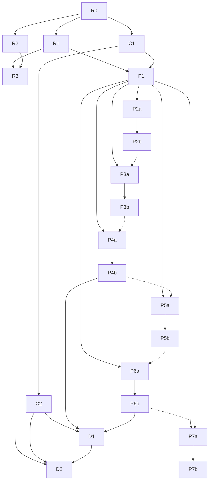

# UI Review Roadmap：对标分析 + 一致性审查 + 复杂页面构想 + 参考应用复刻

> Last Updated: 2026-08-29（P2b `planned`→`done`：plan `docs/plans/2026-08-29-1413-1-p2b-antdpro-interaction-wiring-and-tests.md` 全 Phase 执行完毕、closure audit 通过（fresh session `ses_fb34349c2ffesT42CsbGgFKTwi`，approved-with-minors 零 Blocker/Major）；5 个 `AntdPro__` 写端点 + 8 张 schema 交互接线 + 23 条交互 e2e（I1–I18 逐条处置）+ C2 回写 ③ + 分析篇 §4.1 对照，全量验证 full-green，详见 plan Closure 记录；同日早前：P2b/P3a `todo`→`planned`：两份 draft plan 经独立 fresh session review 通过转 active（`ses_fb3d26ccdffeDayA2Mzzb1gI5B`，各 2 轮，pass-with-minors 零 Blocker/Major；plan `docs/plans/2026-08-29-1413-1-p2b-antdpro-interaction-wiring-and-tests.md` + `docs/plans/2026-08-29-1413-2-p3a-cal-booking-static-replica.md`，P3a 执行时序受 P2b 虚线约束已写入 plan）；同日早前：P2a `planned`→`done`：plan `docs/plans/2026-08-29-1240-1-p2a-antdpro-template-static-replica.md` 全 Phase 执行完毕、closure audit 通过（fresh session `ses_fb3e7a832ffe1Sy9XzXORpZMg9`，approved 零 Blocker/Major）；9 张 `antdpro-*` 复刻页 schema + 复刻 CSS + mock 读端点 + e2e/单测全绿落盘，详见 plan Closure 记录；同日早前：P2a `todo`→`planned`：draft review 通过（fresh session `ses_fb42bafc7ffeAjI6YMQRyheT8z`，2 轮，pass-with-minors 零 Blocker/Major）；同日早前：P1 `planned`→`done`：plan 2026-08-29-0419-2 全 Workstream 执行完毕、closure audit 通过（fresh session `ses_fb43c6d5bffeL4kz0gnJfK3aWM`，approved-with-minors）；产出 `docs/analysis/ui-review/P1-reference-apps/`（复刻工程规范 README + 6 篇应用分析篇，能力映射逐行 C2 对照 + 5 闭源应用差异声明）；同日早前：R3 `planned`→`done`：plan 2026-08-29-0419-1 全 Phase 执行完毕、closure audit 通过（fresh session `ses_fb4589abaffeqrHt1MkZyRtBw7`，approved 零 Blocker/Major）；17 条 P0/P1 修复 + P2 172 条裁决（3 随批修/169 候选）+ P3 87 条登记，落点与台账见 `R2-consistency-audit.md` §R3 收口节；R3/P1 `todo`→`planned` 两份 plan 转 active，R2 `planned`→`done`）
> Source: 用户目标指令（2026-08-19，四项要求：对标成熟框架的详尽分析 / 复杂页面构想验证承载力 / 线上调研参考应用并仿制页面与交互 / UI 一致性自查）；拟制流程按 `docs/skills/roadmap-and-mission-authoring-with-consensus-review.md`；复刻方法论先例 `docs/analysis/sundial-ui-reproduction-analysis.md`
> Mission: `missions/ui-review.json`
> **分支纪律**：本 roadmap 全部工作在 worktree `nop-chaos-flux-ui-review`（分支 `ui-review`）执行，禁止直接落在 master 工作区；合并回 master 为人工门禁（见 Cross-Cutting §1）。

## Purpose

本文是 UI review 专题的编排层（roadmap），覆盖四条相互衔接的工作线：

1. **对标分析**：把 nop-chaos-flux 的 UI **美观度**与**完善度**对照成熟体系（AMIS / Ant Design + Pro / shadcn/ui + blocks 生态 / Retool·Appsmith·ToolJet·Budibase 同品类低代码构建器 / Vant 移动端）做详尽的、有证据的分维评估。
2. **一致性审查**：用 `docs/skills/ux-design-pattern-audit-prompt.md` 对全部 renderer 包与 playground 复杂页做多轮递归的视觉/交互一致性审查并修复。
3. **复杂页面构想**：构想一批"类似 Sundial 这种"的高复杂度页面（三栏工作台、高密度数据表、看板拖拽、预约流程、多视图数据库、命令面板……），逐页预判当前设计能否承载、缺口在哪。
4. **参考应用复刻**：线上调研一批参考软件/参考应用，按 Sundial 已验证的复刻方法论（令牌提取 → 页面复杂度排序 → 能力映射 → schema+CSS 复刻 → 交互接线 + mock 后端 + e2e）仿制其页面与核心交互。

先例结论（`sundial-ui-reproduction-analysis.md` §6）：**"外部应用复刻作为能力发现器"成立**——Sundial 复刻直接驱动了 7 项能力改进中的 6 项（responsive 断点容器、collapse 语义字段、checkbox shape、chart 逐点上色、`?.[0]` 表达式、openDialog meta 透传）。本 roadmap 把该单点验证放大为持续机制。

本文不是 execution plan，不是逐组件契约说明。对标矩阵看 R1 产出文档；复刻工程规范看 P1 产出文档；一致性发现看 R2 产出文档。

## Phase Status

> **这是全文件唯一的动态状态区。更新状态只改这里。**
> 状态流转：draft review 通过 → `todo` 改 `planned`；closure audit 通过 → `planned` 改 `done`（不得提前）。执行顺序 = 本列表顺序（R → C → P → D），AI 不重排。
> 拆分阀：单个 work item 若实测一个 plan 收不下（最高风险：R2/R3、P2a），经人工确认拆分为带独立状态的子项后更新本区，不默认囤积。

- R0. UI 资产盘点与基线实测: `done`
- R1. 成熟框架对标分析（美观度 × 完善度双维评分卡）: `done`
- R2. 全量 UI 一致性审查（ux-design-pattern-audit 多轮递归）: `done`（plan `docs/plans/2026-08-28-1701-1-r2-consistency-audit.md`，2026-08-29 closure audit 通过；产出 `docs/analysis/ui-review/R2-consistency-audit.md`，276 发现 → 273 保留/3 降级/0 驳回，P0 5/P1 12/P2 172/P3 87）
- R3. 一致性 P0/P1 修复与共性归类收口: `done`（plan `docs/plans/2026-08-29-0419-1-r3-consistency-p0p1-remediation.md`，2026-08-29 closure audit 通过；17 条 P0/P1 先红后绿修复 + P2 172 条裁决（随批修 3/候选 169/拒绝 0）+ P3 87 条登记终态；落点清单与裁决台账见 `docs/analysis/ui-review/R2-consistency-audit.md` §R3 收口节 + `r2-audit/r3-p2-adjudication.md`）
- C1. 复杂页面构想清单与能力压力预判: `done`
- C2. 能力差距汇总与分级裁决（滚动文档）: `done`（初版裁决收口；Pi-b 回写走追加区）
- P1. 参考应用线上调研与复刻工程规范: `done`（plan `docs/plans/2026-08-29-0419-2-p1-reference-app-research-and-replication-spec.md`，2026-08-29 closure audit 通过（fresh session `ses_fb43c6d5bffeL4kz0gnJfK3aWM`，approved-with-minors，3 Minor 随收口修正）；产出 `docs/analysis/ui-review/P1-reference-apps/`：复刻工程规范 README（slug 分配表 / mock 与 e2e 模板 / 分析篇模板 / 验收维度）+ 6 篇应用分析篇（ant-design-pro / cal-booking / linear / notion-database / airtable-grid / stripe-dashboard），P2a–P7b 可凭 README 开工）
- P2a. Ant Design Pro 页面模板族 — 分析与静态复刻: `done`（plan `docs/plans/2026-08-29-1240-1-p2a-antdpro-template-static-replica.md`，2026-08-29 closure audit 通过（fresh session `ses_fb3e7a832ffe1Sy9XzXORpZMg9`，approved 零 Blocker/Major）；产出 9 张 `antdpro-*` 页面 schema（list/form×4/detail×2/dashboard/result，category `app-replica`）+ `antdpro-replica.css` 令牌复刻（差异裁定：圆角 6→8px）+ 3 个 `AntdPro__` get-only mock 读端点 + 10 条初屏 e2e + 12 条 mock 单测，全量验证 full-green；交互接线与测试归 P2b）
- P2b. Ant Design Pro 页面模板族 — 交互接线与测试: `done`（plan `docs/plans/2026-08-29-1413-1-p2b-antdpro-interaction-wiring-and-tests.md`，2026-08-29 closure audit 通过（fresh session `ses_fb34349c2ffesT42CsbGgFKTwi`，approved-with-minors 零 Blocker/Major，1 Minor 文本计数勘误随收口修正）；产出 5 个 `AntdPro__` mock 写端点（saveOrder/deleteOrders/approveOrder/submitForm/selectOrder，先红后绿 9 条写操作单测）+ 8 张 `antdpro-*` schema 交互接线（list CRUD/批量/工具栏、form×4 提交链路、审批翻转、result/detail 导航）+ `tests/e2e/antdpro-replica-interactions.spec.ts` 23 条交互 e2e（分析篇 §4 交互清单 I1–I18 逐条处置落终态表）；C2 回写 ③ + 分析篇 §4.1「预测 vs 实测」对照落字；全量验证 full-green，零 `packages/` 改动）
- P3a. Cal.com 预约流程复刻 — 分析与静态复刻: `planned`（plan `docs/plans/2026-08-29-1413-2-p3a-cal-booking-static-replica.md`；执行时序受 P2b 虚线约束，plan 内已显式编码）
- P3b. Cal.com 预约流程复刻 — 交互接线与测试: `todo`
- P4a. Linear 风格 issue tracker 复刻 — 分析与静态复刻: `todo`
- P4b. Linear 风格 issue tracker 复刻 — 交互接线与测试: `todo`
- P5a. Notion database 多视图复刻 — 分析与静态复刻: `todo`
- P5b. Notion database 多视图复刻 — 交互接线与测试: `todo`
- P6a. Airtable grid 网格编辑复刻 — 分析与静态复刻: `todo`
- P6b. Airtable grid 网格编辑复刻 — 交互接线与测试: `todo`
- P7a. Stripe 风格数据面板复刻 — 分析与静态复刻: `todo`
- P7b. Stripe 风格数据面板复刻 — 交互接线与测试: `todo`
- D1. 能力缺口产品化 plans（option-row / className 表达式 / command palette / 键盘导航 / 页面模板预设）: `todo`
- D2. 一致性门禁沉淀与 roadmap 收口: `todo`

## Platform Reuse

以下能力已存在，后续任何 work item **不得重建**，只做组装、审计与复刻：

| 能力                                                                      | 位置 / 证据                                                                                                                        |
| ------------------------------------------------------------------------- | ---------------------------------------------------------------------------------------------------------------------------------- |
| 结构/表单/内容/布局/数据 renderer 家族（14 个 renderer 包）               | `packages/flux-renderers-{basic,content,layout,data,form,form-advanced,mobile,scheduling,graph,map,pivot,dashboard,industrial,ai}` |
| 基础 UI 组件库（shadcn 体系，Button/Dialog/Table/Combobox/Sidebar 等）    | `packages/ui/src/index.ts`（组件清单见 `AGENTS.md`）                                                                               |
| 企业调度族（Gantt / Kanban / Calendar / BarcodeInput）                    | `packages/flux-renderers-scheduling`                                                                                               |
| 图表（recharts，含单 series 逐点上色 `colorRegionKey`）                   | `flux-renderers-data` chart（plan 456 落地）                                                                                       |
| 结构级响应式断点容器 `responsive`                                         | plan 456 落地，Sundial workbench 已用                                                                                              |
| 语义化分组折叠（`collapse` tone/count/leading）、圆形 checkbox（`shape`） | plan 456 落地                                                                                                                      |
| dialog/drawer surface meta 透传（className/testid）                       | `resolveSurfaceMeta`（plan 456 F2）                                                                                                |
| 复杂页 harness + mock 后端 + e2e 模式                                     | `apps/playground/src/complex-pages/`（19 个 schema、`shared/mock-backend.ts`、`shared/showcase-env.ts`）                           |
| 复刻页 CSS 令牌模式（playground 层 scope 专用类 + CSS 变量）              | `apps/playground/src/sundial-replica/sundial-replica.css`                                                                          |
| AMIS 基线对照矩阵                                                         | `docs/components/amis-baseline-matrix.md`                                                                                          |
| 移动端对标分析（vs Vant）                                                 | `docs/analysis/2026-06-21-flux-vs-vant-full-comparison.md`、`2026-06-21-flux-mobile-gap-analysis-vs-vant.md`                       |
| UI/UX 一致性审查提示词（行业基准表 + 输出格式）                           | `docs/skills/ux-design-pattern-audit-prompt.md`                                                                                    |
| 样式契约（marker class / tokens / 无 BEM / 主题独立）                     | `docs/architecture/styling-system.md`、`theme-compatibility.md`、`renderer-markers-and-selectors.md`；`packages/theme-tokens`      |

## Current Baseline

本节数据为 2026-08-19 live 实测（worktree `nop-chaos-flux-ui-review`，基点 master `0078f2a40`）：

- **Renderer 包 14 个**（Reuse 表所列）；注册 renderer type 实测 **122 个**（2026-08-19 R0 运行时 registry 口径：逐包 `register*Renderers` + `registry.list().length`；industrial/editor/ai 因 leafer canvas 依赖改用定义文件静态口径复核，逐包明细与复测命令见 `docs/analysis/ui-review/R0-baseline-inventory.md` §1——原 88 为 `*-definitions.ts` grep 口径下限，已修正）。
- **`@nop-chaos/ui`：62 个组件模块**（`export *` 全量导出，R0 实测非 test 模块数）**+ 16 工具/hooks**（`AGENTS.md` 40+ 清单为常用精选面而非全集；未宣传的 ~22 模块是 R1/R2 的输入）。
- **playground 复杂页 19 个 schema**：14 个企业向（standard-crud / master-detail / dashboard / advanced-query / approval-tasks / form-wizard / complex-form / combo-editor / tree-crud / inline-edit-table / detail-subtables / business-document / dynamic-tabs / crud-views-export）+ 5 个 Sundial 复刻页（workbench / detail / analytics / settings / todo-dialog）。
- **Sundial 复刻先例——已完成（2026-08-19 收口）**：plan 460 `completed`（commit 66476513d，两轮独立 closure audit approved；P1-P13 全部真实化且逐项有断言；附带等强度修复 B1 逃逸回归 surface-event-ctx）。B8 收口内容：settings 保存写 mock 后端、子任务删除/移动写后端、详情 X 真实导航、task-detail-dialog 字段行 picker 化；runtime 语义发现 4 条记入 plan 与日志。历史在途记录：plans 456/457/459 `completed`，458 `superseded-reverted`，460 Phase 1–4 对应批次 B1–B7（master HEAD 即 B7）。分析文档登记的剩余优化项仍开放：**G3 剩余**（input-date 行触发形态）与 **G5**（hover/选中态的 schema 表达——"可选行/选中值绑定"目前只能 CSS `.group:hover` 或 visible 双渲染模拟，建议通用 `option-row` 原语）。
- **R0 前置**：~~plan 460 须先恢复并收口~~ → 已满足（2026-08-19 plan 460 `completed`，见上条）。
- **既有对标物**：AMIS 侧有 `amis-baseline-matrix.md`（组件覆盖对照）；移动端侧有 vs Vant 全量对比；**企业后台框架（Ant Design Pro）、同品类低代码构建器（Retool 系）、组件美学生态（shadcn blocks）三个方向尚无系统对标** —— R1 补齐。
- **初步判断（待 R1/R2 量化，此处仅为工作假设）**：
  - 完善度——结构层完备（AMIS 基线组件大部分 runtime，另有 graph/scheduling/ai 等超出项）；短板在**页面级模板层**（Ant Design Pro 的 list/form/detail/result/dashboard 页面模板级预设）、**键盘/命令交互**（command palette、chord 导航）、**多视图数据库形态**（table/board/gallery 切换）、**行内网格编辑深度**（Airtable 型）。
  - 美观度——底座为 shadcn 令牌（行业主流审美基线）；已验证"扁平、无阴影、令牌化"设计（Sundial）可复刻到高保真；**未验证**场景：高密度数据页（Stripe 型）、键盘优先工作台（Linear 型）、产品级微交互（按压反馈/弹簧动画/等宽计数）。

## Phases

| Phase                         | Owner Doc（产出/依据）                                               | Dependencies                                         | Reuse                                             |
| ----------------------------- | -------------------------------------------------------------------- | ---------------------------------------------------- | ------------------------------------------------- |
| R0 资产盘点                   | `docs/analysis/ui-review/R0-baseline-inventory.md`                   | plan 460 收口（前置，见 Current Baseline）           | 复用表全部行                                      |
| R1 框架对标                   | `docs/analysis/ui-review/R1-framework-benchmark.md`                  | R0                                                   | amis-baseline-matrix、vs-Vant 分析                |
| R2 一致性审查                 | `docs/analysis/ui-review/R2-consistency-audit.md`                    | R0                                                   | ux-design-pattern-audit-prompt                    |
| R3 一致性修复                 | 同 R2 文档收口节 + 日志                                              | R1, R2                                               | R2 发现清单、component-audit 自动修复模式         |
| C1 页面构想                   | `docs/analysis/ui-review/C1-complex-page-conceptions.md`             | R0                                                   | sundial 分析 §3 复杂度分级法                      |
| C2 差距裁决                   | `docs/analysis/ui-review/C2-capability-gaps.md`（滚动）              | C1                                                   | sundial 分析 §5 gap 分类法                        |
| P1 应用调研与规范             | `docs/analysis/ui-review/P1-reference-apps/`（每应用一篇 + 总规范）  | R1, C1                                               | sundial 复刻模板全套                              |
| P2a/P2b Ant Design Pro 模板族 | `docs/analysis/ui-review/P2-ant-design-pro.md` + playground schema   | P1 / P2a→P2b                                         | page/container/flex/form/crud/result 族           |
| P3a/P3b Cal.com 预约          | `docs/analysis/ui-review/P3-cal-booking.md` + playground schema      | P1 / P3a→P3b                                         | scheduling calendar、input-datetime、dialog       |
| P4a/P4b Linear issue tracker  | `docs/analysis/ui-review/P4-linear-tracker.md` + playground schema   | P1 / P4a→P4b                                         | table/kanban、keyboard 能力现状由 C2 裁决         |
| P5a/P5b Notion database       | `docs/analysis/ui-review/P5-notion-database.md` + playground schema  | P1 / P5a→P5b                                         | crud 视图、tabs、filter/sort 现状                 |
| P6a/P6b Airtable grid         | `docs/analysis/ui-review/P6-airtable-grid.md` + playground schema    | P1 / P6a→P6b                                         | input-table、inline-edit-table、condition-builder |
| P7a/P7b Stripe dashboard      | `docs/analysis/ui-review/P7-stripe-dashboard.md` + playground schema | P1 / P7a→P7b                                         | chart、table 密度态、drawer                       |
| D1 缺口产品化                 | 独立 plans（`docs/plans/`）                                          | C2（输入源）, P4b, P6b（时序触发，见 Phase Details） | C2 裁决清单                                       |
| D2 门禁沉淀与收口             | `docs/analysis/ui-review/D2-closure.md` + check 脚本                 | R3, C2, D1                                           | R2/R3 共性清单、`pnpm check` 体系                 |

## Phase Details

### R 系列 — 对标分析与一致性审查

- **R0**：**前置：恢复并收口 plan 460（见 Current Baseline），否则不得启动。** 以运行时 registry 为口径实测注册 renderer 精确数并修正 Current Baseline；盘点 `@nop-chaos/ui` 组件清单与 `packages/theme-tokens` 令牌覆盖；盘点 playground 19 页并标注复杂度；建立 R 系列后续文档的目录与模板。
- **R1**：五组对标，每组产出一节"美观度 × 完善度"评分卡（1–5 分 + live 证据）：① AMIS（复用 matrix，聚焦 UI 质量而非覆盖数）② Ant Design / Ant Design Pro（企业后台金标准：组件 + 页面模板两层）③ shadcn/ui + blocks 生态（美学基线与"页面级 block"差距）④ Retool / Appsmith / ToolJet / Budibase（同品类低代码构建器的 demo 应用形态）⑤ Vant（移动端，复用既有分析做增量）。双维定义——美观度：令牌体系/密度与层次/微交互/暗色完整度/产品完成度；完善度：组件覆盖/页面模板/交互深度（键盘·拖拽·批量）/a11y/主题化。差距清单直接喂给 C2。
- **R2**：按 `ux-design-pattern-audit-prompt.md` 对 14 个 renderer 包 + `@nop-chaos/ui` + playground 复杂页做多轮递归审查（**范围口径以本 roadmap 为准**——该 skill 共享前缀的默认聚焦清单仅列 4 包，扩围按其附录 B §5 允许的方式显式声明）。审查维度含：图标语义/按钮一致性/状态指示/表单交互/视觉反馈/弹出层/颜色令牌/间距对齐/焦点管理/破坏性确认/滚动/触摸目标/跨组件一致性/版式层次/产品完成度/视觉原创性/**无障碍可见性**（该 skill 视角 9 的 ARIA 语义/role 部分；全量 WCAG 合规仍归 deep-audit 维度 20，边界按该 skill 边界表执行，不重复报告）。严重度词表映射：skill 输出 HIGH → P0/P1（落入 R3 预授权修复），MEDIUM → P2，LOW → P3；产出 P0–P3 发现清单与共性归类。
- **R3**：P0/P1（= skill HIGH）自动修复（预授权，模式同 component-audit：test-first + 回归测试 + 类别清扫——修任一实例必 grep 全类兄弟）；P2/P3 裁决路由（修 / 登记 / 拒绝）；共性模式回写 C2。

### C 系列 — 复杂页面构想

- **C1**：构想 8–12 个与既有 19 页去重的复杂页面，覆盖：三栏工作台（master + inspector）、高密度数据表（冻结列/列宽拖拽/批量栏）、看板拖拽重排、日历预约流程、多视图数据库（table/board/gallery 切换 + filter/sort UI）、命令面板（⌘K）、审批中心（流程图 + 待办 + 批量操作）、图表门户、移动端 shell（底部导航 + 弹层详情）。每页给出：复杂度 ★ 分级（沿 sundial 分析 §3 口径）、所需 flux 原语映射、预测缺口（显式对照 G3/G5 已知缺口）。
- **C2**：汇总 C1 预测 + R 系列实测 + P 系列复刻回写，按四级裁决并滚动更新：**CSS 可解 / 渲染器语义增强 / 新原语 / runtime 能力**。已预登记候选：option-row 通用原语（G5）、className 表达式绑定、command-palette 组件、键盘导航框架（chord/peek/多选）、页面模板 schema 预设。

### P 系列 — 参考应用复刻（每应用两段式：a = 分析 + 静态复刻；b = 交互接线 + 测试）

- **P1**：线上调研并选定 6 个参考应用（P2–P7 名单），每应用产出分析篇（设计令牌结构 / 页面清单与复杂度排序 / 核心交互清单 / 可复刻边界），并制定复刻工程规范（目录命名 `apps/playground/src/complex-pages/page-schemas/<app>-*.json` + `<app>-replica.css`、mock 端点、e2e 模板——全部沿用 sundial 先例）。调研锚点（2026-08-19 检索）：[Ant Design Pro 官方预览](https://preview.pro.ant.design/)、[Ant Design 页面规格（detail/form/visualization）](https://ant.design/docs/spec/detail-page/)、[Linear 官方交互文档](https://linear.app/docs/select-issues)、[Linear 设计细节](https://medium.com/linear-app/invisible-details-2ca718b41a44)、[Linear 快捷键全集](https://shortcuts.design/tools/toolspage-linear/)、[shadcn/ui blocks](https://ui.shadcn.com/blocks)、[Retool 系对比（stackfyi）](https://www.stackfyi.com/guides/retool-vs-appsmith-vs-budibase-2026)、[Appsmith/Budibase/ToolJet 对比](https://blog.tooljet.com/appsmith-vs-budibase-vs-tooljet/)。
- **P2 Ant Design Pro 页面模板族**：复刻 dashboard / list / form（四种布局：整页/分组/弹窗/分步）/ detail（基础+高级）/ result 页面模板——补齐 Flux"页面级模板"空白，直接服务企业向用户；focus：PageHeader 区、查询区+表格区组合、高级详情分组（tabs/steps）。**Pi-a 中静态范围最重的一项，超载即按 Phase Status 拆分阀处理。**
- **P3 Cal.com 预约流程**：复刻预约页（时长选择 → 时区/日历槽位 → 确认表单 → 成功态 + 加入日历）；focus：与 scheduling 包 calendar 协同、槽位网格、时区切换、多步向导回退。
- **P4 Linear 风格 issue tracker**：复刻 issue 列表 + board + 详情 peek；focus（键盘优先压力最大项）：⌘K 命令面板、G-then-X chord 导航、Space hover-peek、多选 + 批量操作、键盘/拖拽重排（Alt+↑↓）。
- **P5 Notion database 多视图**：复刻 table/board/gallery/calendar 视图切换 + filter/sort 面板 + 行内编辑 + 新建行插行；focus：视图切换状态机、filter 构建器（复用 condition-builder）、行内属性编辑。
- **P6 Airtable grid 编辑**：复刻网格编辑（单元格全型别行内编辑、列菜单（类型/排序/隐藏/着色）、行高切换、分组）；focus：单元格编辑器矩阵（text/select/date/checkbox/attachment…）、网格密度与滚动性能边界。
- **P7 Stripe 风格数据面板**：复刻交易列表（高密度表格 + 筛选 chip + 批量栏）+ 图表卡 + 明细 drawer；focus：数据密度档位、金额/状态排版（等宽/语义色）、图表-表格联动。
- 每个 Pi-b 的 closure 必须回写 C2（缺口回流），并把"预测缺口 vs 实测缺口"对照记入该应用分析篇。

### D 系列 — 沉淀

- **D1**：把 C2 裁决为"渲染器语义增强 / 新原语 / runtime 能力"的缺口逐项转为独立 plans（受 `ai-autonomy-policy.md` 保护区域约束：renderer 定义字段 plan-first、`ui/src/index.ts` ask-first、样式契约 plan-first）。**输入 = C2 终态内容**（初版裁决 + 后续 Pi-b 回写积累）；P4b/P6b 仅为**时序触发**依赖（键盘与网格两条最高价值缺口线的实例证据），不是独立输入源。触发条件：C2 `done` 且 P4b/P6b `done`。
- **D2**：把 R2/R3 沉淀的共性一致性模式转为 `check:*` 门禁候选（沿 `pnpm check` 体系，零新命中红线规则）；全 roadmap 终态盘点（对标分数复评 + C2 终版 + 各复刻页清单）+ owner docs / 日志同步。

## Dependency Graph

（**实线 = 硬依赖**；**虚线 = 执行顺序约束**——一次一应用、先静态后交互，沿 Sundial 的节奏。plan 460 收口是 R0 的前置（见 Current Baseline），不属于图内节点。表与图冲突时以 Phases 表为准。）

## Cross-Cutting

1. **分支纪律**：全部 plan 在 worktree `nop-chaos-flux-ui-review`（分支 `ui-review`）起草与执行；任何 plan 不得直接改 master 工作区；合并回 master 前须人工确认（含本 roadmap 自身的合入）。full-green commit 规则与 `AGENTS.md` 一致。
2. **复刻方法论统一**：所有 P 系列沿 sundial 五步模板——①设计令牌提取（颜色/字号/间距/圆角/交互习惯/图标）②页面复杂度分级排序 ③能力映射矩阵（元素 → flux 原语 + 保真度预估）④schema + 复刻 CSS 落地 ⑤交互接线 + mock 后端 + 测试锁定。规范源：`docs/analysis/sundial-ui-reproduction-analysis.md` + plans 457/460 的接线模式。
3. **复刻法律/品牌边界**：只仿制布局结构、交互模式与令牌结构；不复制 logo、品牌资产、文案、图标原图。参考优先级：开源应用（可读源码与令牌）> 官方文档/预览页 > 截图。闭源产品（Linear/Notion/Airtable/Stripe/Cal.com 的商业版式）以"风格等价物"复刻并在分析篇记录差异声明。
4. **样式契约**：复刻页新 CSS 一律走 playground 层 scope 专用类 + CSS 变量（`<app>-replica.css` 先例）；renderer 内改动必须走语义字段 + marker 输出（G1 collapse 模式），禁止依赖内部 DOM 结构的 CSS 覆盖回流进 renderer。
5. **缺口回流闭环**：C2 的 `done` = **初版裁决收口**（C1 预测 + R 系列实测汇总分级）；此后每个 P 系列 plan 的 closure 以**追加方式**回写 C2 文档（回写义务由各 Pi-b plan 承载，**不重开 C2 状态**）；D1 的输入 = C2 终态内容（初版 + 回写积累）。"能力发现器"闭环不复现 sundial 时期"缺口散落在各 plan"的状态。
6. **测试策略**：每个 plan 按 `AGENTS.md` Test Strategy Tiers 声明层级；复刻页交互契约（选中态/键盘/批量/编辑器矩阵）一律 **Must automate**（先红后绿）；纯静态分析文档项可 Not applicable 并注明理由。
7. **AI 模板感治理**：R2 skill 的"产品完成度/视觉原创性"两维作为所有复刻页验收维度之一——复刻页不得呈现"默认组件堆叠"的通用模板感。

## Rule

1. 遵守 `docs/backlog/00-roadmap-authoring-guide.md` 全部写作/更新规则：工作项粒度 = 一个 plan 可完成，实测超载则按 Phase Status 拆分阀处理；不提前标 `done`；状态只改 Phase Status 区（Phases 表不携带状态列）。
2. **修订走共识审查**：本 roadmap 及 mission 的任何修订须经独立 fresh 子 agent 审查至共识（`docs/skills/roadmap-and-mission-authoring-with-consensus-review.md` 步骤 4）。唯一例外（预授权）：某应用复刻 closure 后若需第三段深化（Pi-c，sundial 真实先例是 457 完成后经 459 修复基座再由 460 重做深化段的链；458 已 superseded-reverted，不作先例），可附触发证据 + C2 回写直接追加 work item，不触发共识审查；但更换/增删参考应用、新增系列属结构性变更，须人工确认。
3. **基线事实 live 实测**：本文计数类事实（注册 renderer 数、页面数）在 R0 完成后以 registry 口径修正；此后任何修订不得凭记忆改数。
4. **commit 纪律**：`feat(ui-review): <description>`（与 mission `commitFormat` 逐字一致）；记录 full-green 状态时 subject 显式含 `full-green verification`。
5. AI 按 Phase Status 顺序取第一个 `todo` 执行，不重排优先级、不跳项、不发明工作项。
