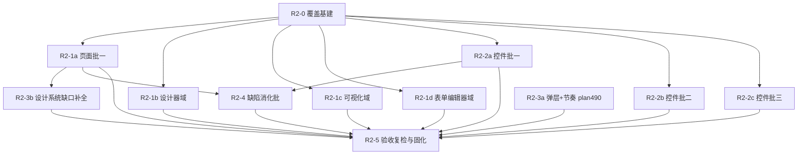

# 视觉质量二期路线图（Visual Quality R2: Rendered-Surface Audit And Design-System Rectification）

> Last Updated: 2026-09-23
> Source: `docs/skills/visual-page-quality-inspection-prompt.md`（页面级走查方法，2026-09-22 新立）、`docs/backlog/visual-quality-roadmap.md`（一期，V0–V12f 已全部 done）、`docs/plans/490-design-system-overlay-size-and-surface-rhythm-plan.md`（已 draft）、2026-09-22 用户反馈（复杂页面/设计器/弹层/间隔体感不达标）
> Mission: `missions/visual-quality-r2.json`
> 状态: active —— 执行队列已启动（2026-09-23 人工指令）；R2-3a（plan 490）、R2-0（plan 491）、R2-1a（plan 492）、R2-1b（plan 493）、R2-1c（plan 494）、R2-1d（plan 495）均 done 且经独立 closure audit（R2-1 阶段 121 页全量闭合）；下一批：R2-2a（控件批一）、R2-2b、R2-2c 及 R2-3b/R2-4（归族输入已齐备，终裁待 R2-2a）

## Purpose

本文件是视觉质量二期路线图，按 `docs/backlog/00-roadmap-authoring-guide.md` 编排，是渲染面视觉质量整改的 phase 索引与全局状态面。

一期路线图（V0–V12f）以**读代码普查**为证据基座，逐项修复了死配置/硬编码/死状态等缺陷并清空一致性豁免池，但它存在四个结构性盲区，导致"路线图全绿而体感不达标"：①证据来源是代码而非**渲染后的页面**——布局间隔、双主题平价、排布层级这些只有打开页面才可见的维度从未被成规模走查；②findings 逐点修补、无设计系统层收敛（弹层三套尺寸约定即其结果）；③276 项 ui-review findings 只修 17 条 P0/P1，其余入池缓慢消化且**无验收复检闭环**；④门禁只扫字面一致性，渲染后的几何/间隔/主题无守护。

本路线图是二期：以 `visual-page-quality-inspection-prompt.md` 为统一方法，对**每一个页面、每一个控件**做渲染面走查（截图确认 + 程序化取证 + A–H 维度评分卡），把发现强制归族为"系统性（进设计系统整改）"或"局部缺陷（进修复批）"，以设计系统整改消化系统性根因，最后用同探针复检轮 + 覆盖对账闭环验收。**核心承诺：不遗漏**——清单程序化枚举、逐项台账对账、逐卡截图证据、复检验收四道机制闭合（见 Cross-Cutting）。

## Work Item Status

> **全文件唯一的动态状态区。** 状态流转：plan 通过 draft review → `todo` 改 `planned`；closure audit 通过 → `planned` 改 `done`（不得提前）。带字母后缀的行是同一域内彼此独立的 closure 单元，各自携状态。Plan 列出现链接**不代表** `planned`（如 R2-3a 行链接的 plan 490 尚为 draft、待 review），一律以 Status 列为准。

| Work Item                                                                                                                                                                                             | Status | Owner Doc                                                                                                  | Dependencies                    | Plan                                                                           |
| ----------------------------------------------------------------------------------------------------------------------------------------------------------------------------------------------------- | ------ | ---------------------------------------------------------------------------------------------------------- | ------------------------------- | ------------------------------------------------------------------------------ |
| R2-0. 覆盖基建：页面/控件全量清单程序化枚举 + 覆盖台账与对账命令 + 截图矩阵工具链 + evidence card 模板 + 控件批次划分裁定                                                                             | `done` | `docs/references/e2e-test-diagnostic-guide.md`、`docs/audits/visual-quality-r2/`（台账落点，本 item 新建） | —                               | — `docs/plans/491-visual-quality-r2-coverage-infrastructure-plan.md`           |
| R2-1a. 复杂页面走查批一：复刻页（airtable/antdpro/cal/linear/notion/sundial）+ complex-pages 域                                                                                                       | `done` | `docs/skills/visual-page-quality-inspection-prompt.md`、`docs/audits/visual-quality-r2/`                   | R2-0                            | — `docs/plans/492-visual-quality-r2-1a-complex-pages-walkthrough-plan.md`      |
| R2-1b. 复杂页面走查批二：设计器域（flow/print/report×3/spreadsheet/word/taskflow/scada-editor/dashboard-editor/debugger-lab）                                                                         | `done` | 同上 + `docs/architecture/flow-designer/`、`docs/architecture/report-designer/`                            | R2-0                            | `docs/plans/493-visual-quality-r2-1b-designer-domain-walkthrough-plan.md`      |
| R2-1c. 复杂页面走查批三：数据可视化与表格域（dashboard/pivot/map/graph/three/scada 系列/表格 CRUD/分页）                                                                                              | `done` | 同上 + `docs/components/`（各可视化组件 design.md）                                                        | R2-0                            | `docs/plans/494-visual-quality-r2-1c-visualization-domain-walkthrough-plan.md` |
| R2-1d. 复杂页面走查批四：表单/编辑器/AI 会话/移动端/其余 demo 面                                                                                                                                      | `done` | 同上                                                                                                       | R2-0                            | `docs/plans/495-visual-quality-r2-1d-forms-ai-mobile-walkthrough-plan.md`      |
| R2-2a. 控件族走查批一：basic + form + form-advanced 全部 renderer 定义（默认分组，R2-0 可裁定调整）                                                                                                   | `todo` | `docs/components/`、`docs/audits/visual-quality-r2/`                                                       | R2-0                            | —                                                                              |
| R2-2b. 控件族走查批二：data + content + layout + mobile（默认分组）                                                                                                                                   | `todo` | 同上                                                                                                       | R2-0                            | —                                                                              |
| R2-2c. 控件族走查批三：ai + scheduling + industrial + 3d + graph/map/pivot/dashboard（默认分组）                                                                                                      | `todo` | 同上                                                                                                       | R2-0                            | —                                                                              |
| R2-3a. 设计系统整改一：弹层尺寸体系 + 表面节奏（一梯三默认/一组解剖学/一个块距/一道门禁）                                                                                                             | `done` | `docs/architecture/styling-system.md`                                                                      | —（可先行）                     | `docs/plans/490-design-system-overlay-size-and-surface-rhythm-plan.md`         |
| R2-3b. 设计系统整改二·首批族：令牌/组件契约缺口补全（**本行 = 首批族，范围 = R2-1a 归族后台账中最大的 systemic 族，在 R2-1a closure 时裁定登记**；候选：间距刻度完整性/密度档/焦点态令牌/色彩语义等） | `todo` | `docs/architecture/styling-system.md`、`packages/theme-tokens`                                             | R2-1a（首批归族）               | —                                                                              |
| R2-4. 缺陷与家族消化·首批：走查 findings 中局部缺陷修复（**本行 = 首批，范围 = R2-1a/R2-2a 归族后台账中最大的 local 族**）+ watch-only 显式裁决落台账                                                 | `todo` | `docs/audits/visual-quality-r2/`（台账）                                                                   | R2-1a、R2-2a                    | —                                                                              |
| R2-5. 验收复检与守护固化：同探针全量复检轮（评分卡前后对比）+ 视觉断言/e2e 固化 + 覆盖对账 uncovered=0 + 门禁收口                                                                                     | `todo` | `docs/references/e2e-test-diagnostic-guide.md`、`docs/architecture/styling-system.md`                      | R2-1a–d、R2-2a–c、R2-3a–b、R2-4 | —                                                                              |

## Framework / Platform Reuse

- **走查方法**：`docs/skills/visual-page-quality-inspection-prompt.md`（A–H 维度、状态矩阵、目视→程序化探针库、迭代式评审三步、独立复核要求）——R2-1/R2-2 全部批次统一用它，不得自造检查口径。
- **清单枚举源**：页面 = playground 路由模型（`apps/playground/src/route-model.ts` + `App.tsx` 路由注册；`pages/` 目录 81 个页面组件/97 个条目，路由模型可枚举路由约 245 条——124 renderer lab + 78 domain + 40 showcase-page + 3 索引路由，精确数以 R2-0 程序化枚举为准）；控件 = 各包 renderer definitions（约 15–16 个包含 `*renderer-definitions*.ts` / `definitions.ts` / 定义注册 index）。两者均程序化生成，禁止手抄清单。
- **视觉断言基建**：V0 交付的 `tests/e2e/helpers/` 计算样式断言 helper、replica 截图存档惯例、像素探测先例（three-canvas/scada）。
- **门禁**：`scripts/audit/find-ui-consistency-gaps.mjs` + `check:audit-ui-consistency-gaps`——R2 新检测器（如 plan 490 的 `overlay-adhoc-width`）在此扩展，豁免基数单调下降纪律沿用。
- **一致性台账惯例**：一期 `docs/analysis/ui-review/R2-consistency-audit.md` / `docs/analysis/ui-review/r2-audit/r3-p2-adjudication.md` 的裁决台账模式——R2 台账沿用"逐条 ID + 去向三态"结构。
- **主题令牌**：`packages/theme-tokens`（`:root` 结构令牌区 + 四主题块颜色区）——R2-3 所有新令牌落 `:root`。
- **mission-driver 闭环**：roadmap → plan → closure audit → 回写（一期 V0–V12f 已全程验证）。

## Current Baseline

- master 为 full-green 基线（unit 74/74 tasks、e2e 全绿、`pnpm check` exit 0，2026-09-22）；一期 roadmap V0–V12f 全部 done，一致性豁免 216 instances / 62 files、newHits=0。
- 一期后用户体感仍不达标的已坐实根因（2026-09-22 live 调研）：弹层尺寸三套约定并存（Dialog size prop+令牌 / AlertDialog data-size+硬编码类 / Sheet·Drawer 固定 `w-3/4 sm:max-w-sm`）、Dialog 阶梯非单调（xs=375 > sm=350）、分页条三处两种间距口径（`TablePaginationBar` 无上间距贴表格 vs `CrudListPagination` 裸 mt-3）、`--crud-toolbar-gap: 10px` 不在 4pt 栅格。
- 系统性修复方案已起草：plan 490（弹层尺寸体系 + 表面节奏，status: draft，含 `--overlay-size-*` 阶梯、`--overlay-anatomy-*`、`--space-block-gap`、`overlay-adhoc-width` 门禁）。
- 覆盖面底数（待 R2-0 程序化确认）：`pages/` 目录 81 个页面组件（97 个条目），路由模型可枚举路由约 245 条；renderer 定义分布在约 15 个包的 definitions 文件中，控件总数待枚举。**一期从未做过页面级/控件级渲染面走查，无任何覆盖台账。**
- 视觉回归守护现状：AI/3D/设计器 e2e 已有计算样式断言（一期补齐），但无页面级截图矩阵、无覆盖对账、无同探针复检机制。

## Phase Details

### R2-0. 覆盖基建

交付：①页面清单与控件清单**程序化枚举**（各自带再生成命令，输出落 `docs/audits/visual-quality-r2/inventory/`）；②覆盖台账（逐页面/逐控件条目，状态机 `pending → carded → digested → verified`；翻转规则：`carded`=走查卡+截图齐、`digested`=该条 findings 已归族并进入对应批、`verified`=批内复检通过（见 R2-3b/R2-4 交付范围），R2-5 全量轮为最终确认；落 `docs/audits/visual-quality-r2/ledger.md`）+ **对账命令**（清单 vs 台账计数闭合，uncovered=0 是本 roadmap 关闭前置）；③evidence card 模板（截图矩阵清单 + A–H 勾选表 + 发现归族栏）；④截图矩阵 runner（Playwright 批量：双主题 × 双视口 × 元素态/中间态，输出 `_tmp/visual-inspection-*/`，遵守快照政策）；⑤控件批次划分裁定（按枚举结果确认或调整 R2-2a–c 默认分组，复杂控件 C1–C10 全矩阵 vs 简单控件简化矩阵的阈值规则）。不做任何产品代码修改。

### R2-1a–d. 复杂页面走查（四批）

每批按检查提示词对所辖页面执行 R1 广扫：逐页 evidence card（**每页必含状态矩阵截图确认**）+ A–H 评分卡；发现按三态归族（systemic→R2-3 批 / local→R2-4 批 / watch-only→台账）。批间可并行；单批若超出一个 plan 收口能力，按本 roadmap Rule 3 预授权字母后缀滚动拆分。

### R2-2a–c. 控件族走查（三批，批次划分以 R2-0 裁定为准）

对枚举出的**每一个 renderer 定义**确认可渲染面（demo 页或最小 schema fixture，缺失 fixture 属 R2-2 批内补齐项）并执行状态矩阵走查：**每个控件截图确认** + A–H 评分卡 + 归族。复杂控件（满足检查提示词/可操作性 skill 的 C1–C10 复杂度阈值 ≥3 项）必须全矩阵（含拖拽中/弹层开/视图切换中间态）；简单展示控件可简化矩阵但须在卡内注明裁剪理由。发现的 owner-doc drift 回写 `docs/components/*/design.md`。

### R2-3a. 设计系统整改一：弹层尺寸体系 + 表面节奏

Owner plan 490 已起草（draft）：`--overlay-size-*` 单调阶梯四弹层组件统一消费、`--overlay-anatomy-*` 解剖学令牌共享、`--space-block-gap` 块距收敛三个分页条、`overlay-adhoc-width` 门禁、styling-system.md 契约回写。R2-1/R2-2 归族出的同根因 findings 经裁决并入本 plan 批次或其字母后缀兄弟批，**不得新起 per-widget 特殊处理 plan**。

### R2-3b. 设计系统整改二·首批族：令牌/组件契约缺口补全

首批族 = R2-1a 归族后台账中最大的 systemic 族（R2-1a closure 时裁定并登记进台账）。交付：该族研究报告核实 → plan（draft review）→ 令牌/组件契约落地 → **对该族涉及的页面/控件同探针批内复检，通过后回写台账 `verified`**。候选族（间距刻度完整性、密度档、焦点/交互态令牌、色彩语义令牌、排布层级辅助令牌）的其余族按字母后缀另起新行滚动承接（预授权，见 Rule 3），立项排序按台账中族内 findings 数量与影响面。

### R2-4. 缺陷与家族消化·首批

首批 = R2-1a/R2-2a 归族后台账中最大的 local 族（closure 时裁定并登记）。交付：按一期 component-audit 的"审计卡 + test-first + 类别清扫"机制消化首批族，watch-only 项显式裁决落台账；**批内同探针复检，通过后回写台账 `verified`**。后续族按字母后缀另起新行滚动承接（预授权，见 Rule 3）。

### R2-5. 验收复检与守护固化

①全量复检轮：R2-0 的截图矩阵 runner + 同探针重跑全部页面/控件，输出复检评分卡与走查轮前后对比；②有回归价值的探针经评审提升进 `tests/e2e/helpers/` 固化；③门禁扩展项全链 `pnpm check` newHits=0；④覆盖对账 uncovered=0；⑤daily log 记录 full-green 与评分卡归档。

**溢出规则**：本 plan 范围 = 执行一个完整复检轮 + 评分卡归档 + 对账 + 探针固化；**收口条件 = 该轮零新增 fail**（不含本轮新发现回流批的修复）。复检轮新发现按 Cross-Cutting 4 三态回流：systemic→R2-3 字母后缀新批、local→R2-4 字母后缀新批、watch-only→台账（均为预授权拆分，回流批完成并批内复检通过后，R2-5 按字母后缀再跑一轮增量复检确认，多轮预授权）。

## Dependency Graph

> 注：R2-3a 无前置依赖（plan 490 已起草），draft review 通过即可执行，不必等走查批次；R2-1a 仅是 R2-3b/R2-4 的首批归族来源，不是唯一来源。

## Cross-Cutting（不遗漏的四道闭环机制）

1. **清单程序化**：页面/控件清单必须由脚本从路由模型与 renderer definitions 生成并附再生成命令；手工维护的清单视为失效。新增页面/控件时清单随再生成自动扩面，走查范围自动纳入。
2. **覆盖对账**：`docs/audits/visual-quality-r2/ledger.md` 逐项追踪（状态机 pending/carded/digested/verified），对账命令输出 uncovered 计数；本 roadmap 关闭前置 = uncovered=0 且全部 work item `done`。台账状态只由 plan 生命周期回写，roadmap 不设第二动态块。
3. **截图证据强制**：每张 evidence card 必须含状态矩阵截图路径（存 `_tmp/`，按 AGENTS.md 快照政策永不入库）；复杂控件/复杂页面全矩阵，简化矩阵须注明裁剪理由；无截图的卡复核直接驳回。
4. **发现强制归族 + 复检验收**：每个 P0/P1 finding 必须落到 {systemic→R2-3 / local→R2-4 / watch-only→台账} 三态之一，禁止未归族的逐点修补批次（防止一期"276 findings 只修 17 条"重演）；R2-3b/R2-4 每批消化完成后对该批涉及页面/控件**同探针批内复检**，通过后回写台账 `verified`（R2-5 全量轮为最终确认）。验收不只看"修了多少"，看**复检评分卡是否无 fail + 对账是否 uncovered=0**。

## Rule

1. 本文件 Work Item Status 是唯一动态状态区；状态流转只由 plan 生命周期驱动。
2. 执行顺序按依赖图；R2-0 完成前不启动走查批次；R2-3a 可独立先行。
3. 字母后缀滚动拆分已由本 roadmap **预授权**（取代一期 Rule 3 的逐次人工裁决）：R2-1/R2-2/R2-3b/R2-4/R2-5 各行均可拆为字母后缀新行滚动承接，基础行即首批、完成后即 `done`，拆分记录落台账；除此之外的结构性调整（新增非预授权 work item、优先级变更）仍须人工评审。
4. 走查与修复统一使用 `visual-page-quality-inspection-prompt.md` 口径；更换口径属结构性调整，须人工评审。
5. 每次状态翻转同步更新 `Last Updated` 与 `docs/logs/`。
6. 审查记录（draft 阶段独立子 agent 共识审查）追加在文末 Review Record；生效后不再追加。

## Review Record

> 审查输入 = 本文件 + `missions/visual-quality-r2.json` + `docs/plans/490-...-plan.md` + 检查提示词 + 两份 guide（plan/roadmap authoring guide），不复用起草者过程上下文。

### Round 1（2026-09-22，三路并行）

- Reviewer / Agent: 结构审查员（fresh session）+ plan 490 深度审查员（fresh session）+ 证据核实审查员（fresh session）
- Verdict: `revised`（roadmap 侧 0 Blocker / 3 Major / 6 Minor；plan 490 侧 0 Blocker / 4 Major / 4 Minor；证据核实 4 处偏差、核心事实无证伪）
- 已处理（roadmap）：①伞形粒度——R2-3b/R2-4 行钉死首批族范围（最大 systemic/local 族、closure 时裁定登记），Rule 3 预授权清单扩充至 R2-1/R2-2/R2-3b/R2-4/R2-5 并声明"基础行即首批、完成后即 done、取代一期 Rule 3 逐次人工裁决"；②R2-5 补溢出规则（复检新发现三态回流字母批、收口=一个完整复检轮零新增 fail、多轮预授权）；③每批复检落点——R2-3b/R2-4 交付范围补"批内同探针复检、通过回写台账 verified"，R2-0 台账补状态机翻转规则，Cross-Cutting 4 同语。Minor 已处理：路径修正（route-model.ts、R2-consistency-audit.md、r2-audit/r3-p2-adjudication.md）、依赖图补 R21a/R22a→R25 两边、Plan 列注记、页数口径统一（81 组件/97 条目/约 245 路由）。
- 已处理（plan 490，见该 plan Draft Review Record）：断点行为依 live 机制修订、Drawer 改"仅初始宽度"、改值打击面补齐（styles.test.ts/c1a e2e/dialog-lab-page/dialog-host.test）、owner doc（dialog/design.md）回写项、AlertDialog 映射方向修正等。
- 已处理（证据偏差）：`:root` 1–120 行、"375/350 不在 4pt 栅格（500 恰为 4 的倍数但不在 8pt 系）"。

### Round 2（2026-09-22，fresh session 联合复审）

- Reviewer / Agent: 独立复审员（fresh session，两文档 + mission 全量修复验证 + 一致性扫描）
- Verdict: `revised`（Round 1 清单 19 项中 18 项验证通过、行号 15+ 处抽查零偏差；新发现 1 Major——AlertDialog live 消费方实为 3 处而非 1 处（`dirty-close-guard.tsx` 经 detail-surface、`confirm-bridge.tsx` env.confirm 桥，均未传 size、统一 320/384→480 静默变宽）+ 3 Minor）
- 已处理：plan 490 披露 3 处消费方并落 Phase 2 映射断言 Fix 项；roadmap R2-1a–d "一期 Rule 3" 残留清改；plan 别名零残留指针标签改指 Phase 3 收口 Proof；页数子分解补 "+3 索引路由"（124+78+40+3=245 自洽）。

### Round 3（2026-09-22，fresh session 终审）

- Reviewer / Agent: 独立终审员（fresh session，定点验证 + 短程一致性扫描）
- Verdict: `pass`（定点验证 4/4 通过——含 AlertDialog 三消费方行号 live 精确命中；"一期 Rule 3" 全文仅剩 Rule 3 本体 1 处合法引用；短程一致性扫描无异常；mission JSON 合法）
- 共识达成：**0 Blocker / 0 Major**，roadmap 升 `active`。plan 490 同批升 `active`（见其 Draft Review Record）。执行队列未启动，R2-0 立项待人工指令。
