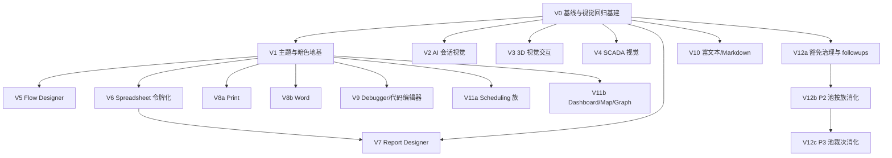

# 视觉质量深度修复路线图（Visual Quality Deep-Dive And Fix Roadmap）

> Last Updated: 2026-09-19
> Source: `docs/analysis/2026-09-15-visual-quality-deep-survey.md`（五路并行证据化普查，已经独立子 agent 逐条核实勘误）、`docs/analysis/ui-review/D2-closure.md`（§2.2 open candidates）、`docs/backlog/audit-followups-2026-08-11-1929.md` / `audit-followups-2026-08-28-1659.md`（未清池）、`docs/bugs/166`（open）
> Mission: `missions/visual-quality.json`（model glm-5.3-flash / variant max）
> 状态: active —— 已通过独立子 agent 三轮审查并达成共识（0 Blocker / 0 Major，见文末 Review Record）；work item 待逐个拟 plan（plan 通过 draft review 后 `todo` → `planned`）

## Purpose

本文件是 nop-chaos-flux **控件显示效果/视觉/交互质量**的深度调研并修复路线图，按 `docs/backlog/00-roadmap-authoring-guide.md` 编排。覆盖 ui-review 专题（已收口，偏一致性与复刻）之后的**显示效果深水区**：AI 会话组件、3D 渲染、SCADA、三类设计器（flow/report/spreadsheet）、文档域（word/print）、编辑器域（code/rich-text/markdown）、调度与数据可视化，以及横切主题与一致性债务。每个 work item 的交付模式固定为四步：**逐项深挖研究报告（`docs/analysis/visual-quality/`）→ 独立子 agent 核实 findings 真实可改进 → 按 plan guide 拟制 execution plan → 修复 + 视觉证据**。

## Work Item Status

> **全文件唯一的动态状态区。** 状态流转：研究报告核实通过且 plan draft review 通过 → `todo` 改 `planned`；closure audit 通过 → `planned` 改 `done`（不得提前）。一个 work item = 一个 execution plan 的交付范围（plan guide Rule 26：同组件族多能力合成一个 owner plan 内多 Phase）。带字母后缀的行（V8a/V8b、V11a/V11b、V12a/V12b/V12c）是同一域内彼此独立的 closure 单元，各自携状态。

| Work Item                                                                                                                     | Status | Owner Doc                                                                                                   | Dependencies | Plan                                                                 |
| ----------------------------------------------------------------------------------------------------------------------------- | ------ | ----------------------------------------------------------------------------------------------------------- | ------------ | -------------------------------------------------------------------- |
| V0. 视觉质量基线与视觉回归守护基建（各域证据卡 + 程序化视觉断言工具链 + 豁免基线快照）                                        | `done` | `docs/references/e2e-test-diagnostic-guide.md`                                                              | —            | `docs/plans/470-visual-quality-v0-baseline-infra-plan.md`            |
| V1. 主题与暗色横切地基（`:root` 兜底语义色、darkMode 触发器统一、运行时主题切换 G-I、playground 暴露）                        | `done` | `docs/architecture/styling-system.md`、`docs/architecture/theme-compatibility.md`                           | V0           | `docs/plans/471-visual-quality-v1-theme-darkmode-foundation-plan.md` |
| V2. AI 会话组件视觉修复（bug 166 流式、气泡视觉层、交互细节、AI 视觉断言）                                                    | `done` | `docs/components/flux-renderers-ai/design.md`、`renderers.md`                                               | V0           | `docs/plans/472-visual-quality-v2-ai-conversation-visuals-plan.md`   |
| V3. 3D 渲染视觉与交互修复（真 hover+高亮、阴影启用、容器高度解硬编码、加载/错误 UI、AI 生成出口、演示补齐）                   | `done` | `docs/components/threejs-integration/design*.md`                                                            | V0           | `docs/plans/473-visual-quality-v3-threejs-visuals-plan.md`           |
| V4. SCADA/工业视觉修复（I17 后残余视觉问题核实立项、grid 背景消费裁决、报警/趋势组件裁决）                                    | `todo` | `docs/components/industrial-hmi/design-*.md`、`docs/components/roadmap-industrial-hmi.md`                   | V0           | —                                                                    |
| V5. Flow Designer 交互补齐与主题化（框选/多选、吸附辅助线、边中点、节点实测尺寸 bugs/11、dark）                               | `todo` | `docs/architecture/flow-designer/design.md`                                                                 | V0、V1       | —                                                                    |
| V6. Spreadsheet 视觉令牌化（canvas-styles 29 处 hex 收敛、dark 变体、值类型视觉）                                             | `todo` | `docs/components/spreadsheet-page/design.md`、`docs/architecture/report-designer/spreadsheet-canvas-css.md` | V0、V1       | —                                                                    |
| V7. Report Designer 视觉与结构（画布解硬编码 30×10、带区/分组语义视觉、fallback 壳、codec 方向裁决）                          | `todo` | `docs/architecture/report-designer/design.md`、`codec-design.md`                                            | V0、V6       | —                                                                    |
| V8a. Print 设计器视觉修复（09-13 遗留①–⑩、吸附辅助线渲染、多选/微移/undo 面板/参考线、诊断 i18n）                             | `todo` | `docs/components/print/design.md`                                                                           | V0、V1       | —                                                                    |
| V8b. Word 编辑器视觉补齐（字体/字号自定义输入、页眉页脚编辑 UI 裁决、皮肤令牌化核对）                                         | `todo` | `docs/components/word-editor-page/design.md`                                                                | V0、V1       | —                                                                    |
| V9. Debugger 与代码编辑器（令牌化亮色适配、查找替换/括号自动闭合/活动行高亮）                                                 | `todo` | `docs/components/code-editor/`（debugger 域无现成 design.md，owner doc 由研究报告确认/补齐）                | V0、V1       | —                                                                    |
| V10. 富文本/Markdown 编辑器增强（Tiptap 扩展补齐、图标化工具条、滚动同步、autoGrow）                                          | `todo` | `docs/components/editor/`、`docs/components/markdown-editor/`（design.md）                                  | V0           | —                                                                    |
| V11a. Scheduling 族视觉补齐（gantt 关键路径、calendar 视图、kanban 拖拽视觉核对、任务条硬编码）                               | `todo` | `docs/components/roadmap-scheduling.md`、`docs/components/{gantt,kanban,calendar}/design.md`                | V0、V1       | —                                                                    |
| V11b. Dashboard/Map/Graph 补齐与裁决（canvasWidth 解硬编码、画布键盘导航、map heatmap/轨迹、graph G-K 数据驱动着色）          | `todo` | `docs/components/{dashboard-filter,dashboard-editor,map,graph}/design.md`                                   | V0、V1       | —                                                                    |
| V12a. 一致性豁免治理与 followups 处置（整包前缀豁免收紧为文件级、error.message 双轨统一、audit-followups 08-11/08-28 批处置） | `todo` | `scripts/audit/find-ui-consistency-gaps.mjs`、`docs/backlog/audit-followups-*.md`                           | V0           | —                                                                    |
| V12b. 一致性 P2 候选池按族消化（169 条，研究报告按组件族划批，类别清扫收口，豁免基数对照 V0 快照下降）                        | `todo` | `docs/analysis/ui-review/r2-audit.md`、`r3-p2-adjudication.md`                                              | V0、V12a     | —                                                                    |
| V12c. 一致性 P3 候选池裁决与消化（87 条：修复/显式 adjudicated 逐条裁定）                                                     | `todo` | `docs/analysis/ui-review/r3-p2-adjudication.md`                                                             | V0、V12b     | —                                                                    |

## Framework / Platform Reuse

- **主题令牌**：`packages/theme-tokens`（324 变量、classic/glass × light/dark 已对称）——各域 dark 工作只做消费层，不重建令牌。
- **一致性门禁**：`scripts/audit/find-ui-consistency-gaps.mjs` + `check:audit-ui-consistency-gaps`（15 步 check 链一环）——V12 各项以"豁免基数下降"为可观测指标，不新造门禁。
- **e2e 基建**：Playwright `tests/e2e/`、像素探测先例（`three-canvas-perf.spec.ts` readPixels、scada `assertScadaCanvasRendered`）、replica 截图存档惯例——V0 在此之上设计视觉断言工具链，遵守 AGENTS.md 2026-08-28 快照政策（快照可诊断、判据必须程序化；基线入 `tests/e2e/__snapshots__/` 或 `_tmp/baselines/`，永不入库）。
- **组件审计模式**：component-audit round1/2 的"审计卡 + test-first 自动修复 + 类别清扫 + 宿主场景验证"机制（`docs/audits/component-audit-checklist.md`）——各域 work item 复用该修复机制。
- **mission-driver 闭环**：roadmap → plan → closure audit → 回写（既有 echarts/threejs/ui-review 三条线已验证）。

## Current Baseline

- master @ 6fec8497e 为 full-green 基线（unit 74/74 tasks、e2e 1472 passed / 0 failed / 43 skipped、`pnpm check` 全链绿），09-15 达成。
- ui-review 专题已全部 done（对标/一致性/构想/复刻四线 + D2 门禁沉淀），但其 276 项发现只修 17 条 P0/P1，遗留池见 V12b/V12c。
- 五域普查（Source 报告）确认五类系统性模式：死配置（声明无实现）、浅色硬编码零 dark、对标交互缺失、视觉正确性 bug（含 open bug 166）、视觉零回归守护 + 债务只登记不消化。普查关键 findings 已由独立子 agent 逐条核实并经两轮反转勘误：最终 7 项证实、2 项证伪勘误（3D resize 链路已存在；kanban drop-target 链路已接通——发射端 `use-kanban-board-effects.ts:135-136` 与 CSS `kanban.css:144` 均在，非 confirmed defect，V11a 仅核对实际视觉/dark 表现）、若干行号/路径修正。
- print-designer 09-13 修复（选中框/手柄/标尺曾有 CSS 全无不可见）证明该类问题真实存在且可在域内快速收敛。
- industrial-hmi roadmap I17（视觉重设计）已 done（2026-08-06 closure approved），V4 只处理 I17 后残余问题，不重打已完成工作。

## Phase Details

### V0. 视觉质量基线与视觉回归守护基建

交付：①各域"证据卡"目录（`docs/audits/visual-quality/`，逐卡记录 findings/证据/裁决，沿 component-audit 卡模式，模板在本 work item 研究报告中定稿）；②程序化视觉断言工具链（断言 helper 落点 `tests/e2e/helpers/`；截图基线机制按 AGENTS.md 快照政策显式裁决——是否引入、基线落 `tests/e2e/__snapshots__/` 还是 `_tmp/baselines/`、判据如何保持程序化，裁决结论写入研究报告，无裁决不得进入 plan）；③`pnpm check` 豁免基线快照（413/121/32）固化为 V12 对照起点（快照文件落点在研究报告中裁定）；④AI/3D/三设计器现有 e2e 的视觉断言缺口清单。不做任何产品代码修改。

### V1. 主题与暗色横切地基

交付：`:root` 补 `--success/--warning/--info` 兜底；tailwind-preset darkMode 触发器与 tokens `data-mode` 统一（单一事实源）；playground 运行时主题切换（G-I 最小实现：classic/glass × light/dark 四态可切）；暗色适配规约回写 `theme-compatibility.md`。不改各包内部样式（那是各域 work item 的事）。

### V2. AI 会话组件视觉修复

交付：bug 166 修复（流式逐 chunk 渲染 + 光标可见，先红后绿回归）；气泡视觉层落地（`data-shape`/`data-placement` 消费规则：底色/圆角/用户消息右对齐）；滚动到底部悬浮按钮（接 `scrollToBottom`）；气泡级操作条默认挂载裁决（复制/重试）；代码高亮 token 色扩充裁决；图片 lightbox/时间分组/进入动画逐项核实后修复或裁决 deferred；AI 族 e2e 补视觉断言（V0 工具链首批消费方）。

### V3. 3D 渲染视觉与交互修复

交付：真 hover（pointermove + hover 高亮材质反馈）+ `onObjectHover` 语义修正；阴影启用（`shadowMap.enabled` + castShadow/receiveShadow 接通 schema 声明，`light.castShadow` 已设但 shadowMap 未启用）；容器高度解硬编码（three-canvas.tsx:98 的 400px → schema/容器自适应，resize 链路已存在、只补高度可配置）；模型加载进度条与内建错误/空态 UI；AI 生成链路出口（演示页或 schema 面裁决）；state/event clip、spring/step tween、hover 演示补齐；three-canvas e2e 补交互与视觉断言。

### V4. SCADA/工业视觉修复

交付：I17 已 done 的前提下，对"画面画乱"后续残余视觉问题做逐项核实（研究报告核实清单为准），确认仍存在的才立项修复；`background.grid` runtime 消费或显式裁除声明（watch-only 收口）；报警闪烁/趋势图/报警表格组件补齐裁决（含否决理由）；画布尺寸声明与渲染一致性回归守护（"声明 960/渲染 302"类缺陷的像素级断言）。

### V5. Flow Designer 交互补齐与主题化

交付：框选 + 多选默认开启（flow-designer 两包内补 `selectionOnDrag`/`multiSelect`，参照 flux-renderers-graph `xyflow-canvas.tsx` 既有先例）；对齐/吸附辅助线渲染；边中点插入裁决；节点实测尺寸替换静态假值（bugs/11）；`designer-node-appearance.ts` 钉钉系 hex 与 `designer-theme.css` 玻璃拟态令牌化 + dark 变体；dingflow 树模式视觉一致性核对；选择/剪贴板链路补直测（FDC-GAP-01/04）。

### V6. Spreadsheet 视觉令牌化

交付：`canvas-styles.css` 29 处浅色 hex → 令牌/语义类收敛；dark 变体补齐（以 report 画布共用为约束）；单元格值类型视觉（数字/日期/文本对齐与格式区分）最小实现；视觉回归断言（冻结/填充柄/选中态在 light/dark 双态的计算样式验证）。

### V7. Report Designer 视觉与结构

交付：画布解硬编码（30 行×10 列 → schema/模板驱动）；报表带区/分组头语义视觉最小实现裁决（含否决即 deferred 的显式理由）；fallback 壳可视化升级；`TemplateCodecAdapter` 方向裁决（hucre 引入与否、接口面），真实集成出独立 plan；report e2e 视觉断言补齐。

### V8a. Print 设计器视觉修复

交付：09-13 登记遗留①–⑩逐项修复或显式裁决（吸附辅助线渲染为最高性价比项：`canvas-math.ts` 已算出、`print-designer-canvas.tsx:130` 消费即可）；多选/方向键微移/undo 面板/标尺拖动参考线按对标缺口裁决落地；诊断消息 i18n 接管（88 键已备）；print e2e 视觉断言补齐。

### V8b. Word 编辑器视觉补齐

交付：字体/字号自定义输入（解 `toolbar/font-controls.tsx` 硬编码枚举）+ 中文字体族预览核对；页眉页脚编辑 UI 裁决（bridge 已透传数据、缺 UI）；15 行自有 CSS 与 canvas-editor 默认皮肤的令牌化边界核对；word e2e 视觉断言补齐。

### V9. Debugger 与代码编辑器

交付：debugger 注入式 CSS（`panel/styles-css.ts` 506 行）→ 设计令牌化（亮色宿主适配）；code-editor 补 searchKeymap（查找替换面板）/closeBrackets/highlightActiveLine；`code-editor-styles.css` 暗色 fallback 令牌映射；两域 e2e 视觉断言补齐。

### V10. 富文本/Markdown 编辑器增强

交付：Tiptap 扩展补齐（Image/Table/Underline/TextAlign/Highlight/Placeholder 中取哪个子集在研究报告中显式裁决，含否决理由）；B/I/S 文本字母按钮图标化；markdown 编辑器 autoGrow + 编辑/预览滚动同步裁决；三处 Tiptap 消费（form editor / ai tiptap-sender / markdown）工具条一致性核对。

### V11a. Scheduling 族视觉补齐

交付：gantt 关键路径高亮裁决；calendar 6 周网格月视图/密度视图裁决；kanban 拖拽悬停高亮实际视觉/dark 表现核对（链路已接通：发射端 `use-kanban-board-effects.ts:135-136` → CSS `kanban.css:144`，非 confirmed defect；核对发现问题才立项修复，否则显式 adjudicated 为 watch-only）；gantt 任务条选中 `bg-blue-50` 硬编码修复；scheduling e2e 视觉断言补齐。

### V11b. Dashboard/Map/Graph 补齐与裁决

交付：dashboard `canvasWidth=1200` 解硬编码 + 画布键盘导航裁决；map heatmap/轨迹 schema 通道裁决；graph G-K 数据驱动着色 schema 通道裁决（落地的进本 plan，否决的进 Deferred But Adjudicated）。

### V12a. 一致性豁免治理与 followups 处置

交付：整包前缀豁免（scheduling/industrial/3d/form-advanced）收紧为文件级；raw `error.message` 直出双轨统一；audit-followups 08-11 批视觉相关项 + 08-28 批 16 P2 + 3 observation 处置（observation 逐条裁定去向：修复 / adjudicated / 归入后续 work item）；闭环指标：`check:audit-ui-consistency-gaps` 豁免条目数（32）不增且命中实例数相对 V0 快照（413）可归因。

### V12b. 一致性 P2 候选池按族消化

交付：169 条 P2 候选按组件族分批，类别清扫收口（每批先红后绿/类别清扫）；plan 须定义批次机制与首批族范围，其余批次按 Rule 3 字母拆分滚动收口（不预设 169 条由单 plan 一次清零）；豁免基数对照 V0 快照下降，批次划分与目标值在本 work item 研究报告中裁定。

### V12c. 一致性 P3 候选池裁决与消化

交付：87 条 P3 逐条裁定（修复 / adjudicated as watch-only），消化批次随 V12b 批次机制执行；豁免基数持续下降。

## Dependency Graph

## Cross-Cutting

1. **研究先行**：每个 work item 开工先产出逐项深挖研究报告到 `docs/analysis/visual-quality/Vx-<topic>.md`（在普查报告基础上逐文件/逐交互核实），未核实 findings 不得进入 plan。
2. **独立核实**：研究报告由独立子 agent（fresh session）审核确认 findings 真实可改进（零 Blocker/Major）后方可拟 plan；plan 本身按 plan guide 走 draft review；closure audit 由独立子 agent 执行。
3. **视觉证据口径**：遵守 AGENTS.md 2026-08-28 快照政策——快照/目视用于诊断与评审，pass/fail 判据必须程序化（`getComputedStyle`/`page.evaluate`/readPixels/像素探测）；截图基线永不入库（`tests/e2e/__snapshots__` gitignored / `_tmp/baselines/`）。
4. **test-first**：确认的 live defect（bug 166、死配置类）按 component-audit 模式先红后绿；类别清扫替代逐点修补。
5. **保护区域**：`packages/ui/src/index.ts` 公共导出、renderer 定义字段、样式契约（styling-system.md 三原则）、flux-core 编译内核不轻动；触及走独立 plan + `ai-autonomy-policy.md` 人工确认。
6. **不与既有路线图抢地**：scheduling/industrial-hmi/ai 等域若与在途 mission 的活跃 plan 冲突，以在途 plan 为准，本路线图该 work item 顺延并记录冲突。

## Rule

1. 本文件 Work Item Status 是唯一动态状态区；状态流转只由 plan 生命周期驱动（draft review 通过 → `planned`；closure audit 通过 → `done`）。
2. 执行顺序按 Work Item Status 表自上而下；V0/V1 完成前不启动依赖它们的工作项（依赖列为准，依赖表与依赖图冲突时以表为准）。
3. 单 work item 若在拟 plan 时发现无法一个 plan 收口，先尝试 plan 内多 Phase；确需拆分时经人工裁决后拆为带字母后缀的新行（如 V6a/V6b），原行标记 superseded note。
4. 每次状态翻转须同步更新 `Last Updated` 与对应 `docs/logs/` 条目。
5. 结构性调整（新增/删除/重排 work item、优先级变更）须标记人工评审，AI 不得自行改队列语义。
6. 审查记录（本路线图 draft 阶段的独立子 agent 审查轮次与共识结论）追加在文末 Review Record；路线图生效后新增条目不再追加。

## Review Record

> 路线图 draft 的独立子 agent 审查证据（要求：规划本身须经独立子 agent 反复审查直到达成共识）。审查输入 = 本文件 + `docs/analysis/2026-09-15-visual-quality-deep-survey.md` + 两份 guide + mission JSON，不复用起草者过程上下文。

### Round 1（2026-09-15，双审查员并行）

- Reviewer / Agent: 结构审查员（fresh session）+ 证据核实审查员（fresh session）
- Verdict: `revised`（0 Blocker / 5 Major / 5 Minor + 2 项证据证伪）
- 结构审查 Major 已处理：①I17 状态失实勘误（V4 与 survey §3 改为"I17 已 done，只核残余"）；②依赖图补 V10/V0→V7 边（本轮重写全图）；③V11 拆为 V11a/V11b；④V12 拆为 V12a/V12b/V12c；⑤V8 拆为 V8a/V8b，Rule 3 拆分示例改为 V6a/V6b。Minor 已处理：Rule 1 章节名统一、mission-driver 粗体修复、V9 补 debugger owner doc 说明、survey §10 显式处置 G-J/D1 输入池/G-L/G-M、mission description 同步拆分后清单、V0 补工具链与模板落点约束、V10"按需子集"改显式裁决。
- 证据核实已处理：3D"无 resize 链路"证伪 → survey §2.3 与 V3 改为"resize 链路已存在、只解 400px 硬编码"；kanban drop-target 证伪 → survey §7.5 与 V11a 改为"死 CSS 规则补发射端"；selectionOnDrag 限定 flow-designer 两包（graph 包有先例）；multiSelect 出处改 `flow-designer-core/src/core/config.ts:36`；hex 计数 29。
- Findings addressed: 全部 Major 与 Minor 已落盘；无遗留。

### Round 2（2026-09-15，fresh session 复核）

- Reviewer / Agent: 独立复核员（fresh session）
- Verdict: `revised`（2 Major / 4 Minor；Round 1 必修清单 8 项中 7 项验证通过）
- 已处理：①**kanban finding 二次反转**——Round 1 证据审查员的"死 CSS 规则/无发射端"证伪本身有误，起草者已 live 验证（`use-kanban-board-events` 同族文件 `use-kanban-board-effects.ts:135-136` set/remove `data-drop-target`，`calendar.tsx:369/380` 同法，CSS `kanban.css:144` 消费在），拖拽悬停高亮链路已接通；survey §7.5 勘误、V11a 表行与 Phase Details 改为"链路已接通，仅核对实际视觉/dark 表现"，mission 同步；②survey §0 P4 删除残留的"无 ResizeObserver"；③§0 P2 hex 计数 29 对齐；④§2.3 路径补 `renderer/` 段；⑤V0"可选截图基线机制"改为显式裁决表述；⑥V12a 补"16 P2 + 3 observation（逐条裁定去向）"；⑦V12b 改为"批次机制 + 首批族范围，其余按 Rule 3 字母拆分滚动收口"。

### Round 3（2026-09-15，fresh session 终审）

- Reviewer / Agent: 独立终审员（fresh session）+ 单点核验员（fresh session，因终审员会话不可回连而补位）
- Verdict: `pass`（Round 3 逐项验证 Round 2 修复清单 7/8 通过 + 9 条证据抽查全属实 + 四者一致性/Anti-Slacking/结构完整性全过；唯一残留 Major R3-1——Current Baseline 残留"缺发射端"旧口径——当场机械修复，经单点核验员 fresh session 复核 CONFIRMED）
- 共识达成：**0 Blocker / 0 Major**，路线图升 `active`。
- Final Verdict 记录：终审员裁定"改毕无需再开新一轮，单点确认即达成共识"；单点核验员实测行号逐一属实、全文无"缺发射端"字样、无内部矛盾，verdict CONFIRMED。
