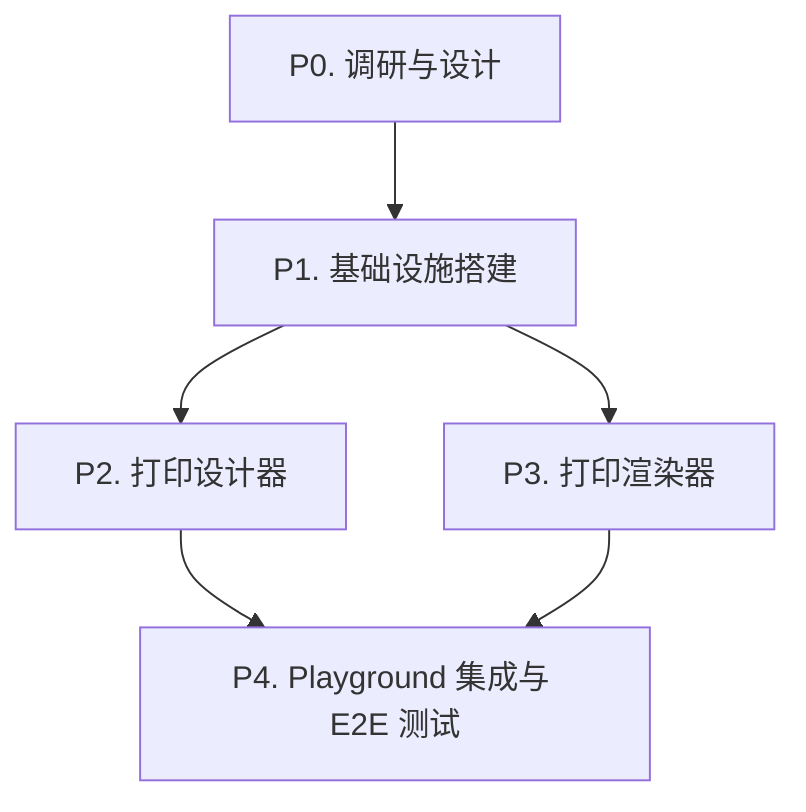

# Web Print Roadmap

> 最后更新：2026-09-05
> 来源：`~/sources/print/` 调研项目
> Mission：`missions/web-print.json`
> 目标：基于本项目现有设计器框架和 flux-json 体系，实现完整的 Web 打印功能

## Purpose

本文是 Web 打印功能的开发路线图，覆盖打印模板设计器、渲染器、浏览器打印、PDF 导出。每个工作项（work item）是一个 execution plan 的合理交付范围。

AI 或维护者读完本文即知哪些工作项未开始（`todo`）、已计划（`planned`）、已完成（`done`），无需重走全部设计文档。

**本文是编排层，不是 execution plan，也不是设计契约。**

## Phase Status

> **全文件唯一的动态状态区。**
> 状态流转：`todo` → `planned`（draft review 通过）→ `done`（closure audit 通过）

- **P0. 调研与设计** (`todo`)
- **P1. 基础设施搭建** (`todo`)
- **P2. 打印设计器** (`todo`)
- **P3. 打印渲染器** (`todo`)
- **P4. Playground 集成与 E2E 测试** (`todo`)

## Framework / Platform Reuse

> 本项目已有的可复用能力，避免重复构建。

| 能力 | 来源包 | 复用方式 |
|------|--------|----------|
| 设计器核心框架（core + renderers 分包模式） | `flow-designer-core`, `flow-designer-renderers` | 参考包结构和模块划分 |
| 编辑器核心（undo/redo、命令模式） | `editor-core` | 复用 `UndoCommandStack` |
| 属性面板框架 | `flow-designer-renderers/designer-inspector.tsx` | 参考属性面板设计 |
| 拖拽交互 | `flow-designer-renderers/designer-canvas.tsx` | 参考拖拽和吸附逻辑 |
| Canvas 渲染 | `flux-renderers-graph/xyflow-canvas.tsx` | 参考 canvas 适配器模式 |
| 数据绑定和表达式 | `flux-formula` | 复用公式引擎 |
| Schema 编译 | `flux-compiler/schema-compiler.ts` | 参考 schema 编译流程 |
| React 组件模式 | `flux-react` | 复用 hooks 和组件模式 |
| UI 组件库 | `@nop-chaos/ui` | 直接使用 Button, Input, Dialog 等 |
| Zustand 状态管理 | 全项目通用 | 复用 store 模式 |
| 测试框架 | Vitest + Playwright | 复用测试基础设施 |
| 打印已有实现 | `flux-renderers-scheduling/calendar` | 参考 `use-calendar-export.ts` 和 `calendar-print.css` |

## Current Baseline

### 已有基础

- 项目已有 flow-designer、report-designer、spreadsheet、word-editor、dashboard-editor 等设计器体系
- 已有一些 print 相关代码：calendar print (css + hook)、word-editor print button
- 核心技术栈：React 19, Zustand, TypeScript 6.0, Vite 8, pnpm workspace
- 设计器架构：core + renderers 分包，支持 undo/redo、属性面板、拖拽交互

### 调研项目

已下载 8 个 Web 打印开源项目到 `~/sources/print/`（详见调研项目清单）

---

## Work Items

### P0 — 调研与设计

| ID   | Status | 内容 | 设计文档 | 依赖 |
| ---- | ------ | ---- | -------- | ---- |
| P0.1 | todo   | 阅读 `~/sources/print/` 中所有项目的 README 和核心代码 | — | — |
| P0.2 | todo   | 提取各项目的技术栈、架构设计、核心功能对比 | 调研报告 | P0.1 |
| P0.3 | todo   | 分析本项目现有设计器框架可复用的部分 | 调研报告 | P0.2 |
| P0.4 | todo   | 设计 flux-json 打印模板 schema | `docs/components/print/design.md` | P0.3 |
| P0.5 | todo   | 编写调研报告文档 | `docs/analysis/web-print-research.md` | P0.2 |

### P1 — 基础设施搭建

| ID   | Status | 内容 | 设计文档 | 依赖 |
| ---- | ------ | ---- | -------- | ---- |
| P1.1 | todo   | 创建 `flux-print-core` 包（package.json、tsconfig、vitest、schemas.ts、index.ts） | — | P0.4 |
| P1.2 | todo   | 创建 `flux-print-renderers` 包（package.json、tsconfig、vitest、schemas.ts、renderer-definitions.ts、index.ts） | — | P1.1 |
| P1.3 | todo   | 配置包依赖和构建，注册到 workspace | — | P1.2 |
| P1.4 | todo   | 实现打印模板 schema 编译器 | `docs/components/print/design.md` | P1.1 |

### P2 — 打印设计器

| ID   | Status | 内容 | 设计文档 | 依赖 |
| ---- | ------ | ---- | -------- | ---- |
| P2.1 | todo   | 实现打印设计器画布组件（纸张、标尺、网格） | `docs/components/print/design.md` | P1.2 |
| P2.2 | todo   | 实现组件面板（文本、图片、表格、条码、二维码） | `docs/components/print/design.md` | P2.1 |
| P2.3 | todo   | 实现属性面板（位置、尺寸、样式、数据绑定） | `docs/components/print/design.md` | P2.1 |
| P2.4 | todo   | 实现打印预览功能 | `docs/components/print/design.md` | P2.2, P2.3 |
| P2.5 | todo   | 实现撤销/重做（复用 editor-core） | — | P2.1 |

### P3 — 打印渲染器

| ID   | Status | 内容 | 设计文档 | 依赖 |
| ---- | ------ | ---- | -------- | ---- |
| P3.1 | todo   | 实现打印渲染器（模板 + 数据 → HTML） | `docs/components/print/design.md` | P1.2 |
| P3.2 | todo   | 实现浏览器打印 API 调用 | — | P3.1 |
| P3.3 | todo   | 实现 PDF 导出功能（html2canvas + jspdf） | — | P3.1 |
| P3.4 | todo   | 支持分页和表格分组 | `docs/components/print/design.md` | P3.1 |

### P4 — Playground 集成与 E2E 测试

| ID   | Status | 内容 | 设计文档 | 依赖 |
| ---- | ------ | ---- | -------- | ---- |
| P4.1 | todo   | 创建打印设计器演示页面 | — | P2.4, P3.2 |
| P4.2 | todo   | 添加路由入口到 playground | — | P4.1 |
| P4.3 | todo   | 编写 e2e 测试用例 | — | P4.2 |
| P4.4 | todo   | 运行测试验证，确保全量通过 | — | P4.3 |

---

## Dependency Graph

## 调研项目清单

### 协议兼容性说明

本项目为 **MIT 协议**，协议兼容性如下：

| 协议 | 兼容性 | 说明 |
|------|--------|------|
| MIT | ✅ 完全兼容 | 可参考设计和代码 |
| Apache 2.0 | ✅ 完全兼容 | 可参考设计和代码 |
| 木兰宽松许可证 v2 | ✅ 完全兼容 | 可参考设计和代码 |
| AGPL-3.0 | ⚠️ 仅参考设计思想 | **不可拷贝代码**，仅参考架构设计和操作模式 |
| 无 LICENSE | ⚠️ 需谨慎 | 仅参考设计思想，不拷贝代码 |

### 项目列表

| # | 项目名 | 协议 | 来源 | 技术栈 | 特点 | 可参考内容 |
|---|--------|------|------|--------|------|------------|
| 1 | **openprint** | AGPL-3.0 | [gitee](https://gitee.com/haiming236/openprint) | TypeScript, Vue 3, Naive UI, Fabric.js | 完整方案：纯 TS 引擎 + 设计器 + AI 辅助 + 桌面客户端 + 云打印 | 架构设计、模板 schema、渲染流程（**不可拷贝代码**） |
| 2 | **vue-print-designer** | AGPL-3.0 | [gitee](https://gitee.com/theGreatOldFive/vue-print-designer) | Vue 3, Web Components, Naive UI | 跨框架 Web Components，静默打印 + 云打印，6 种语言 | 架构设计、打印流程、分页算法（**不可拷贝代码**） |
| 3 | **myprint** | 无 LICENSE | [gitee](https://gitee.com/MyPrintDesign/myprint) | Vue 3, TypeScript, Vite | 一站式方案，支持多级表头、SVG、手画板 | 架构设计参考（**谨慎使用**） |
| 4 | **fastprint-designer** | 木兰宽松 v2 | [gitee](https://gitee.com/rolaypp/fastprint-designer) | Vue 3, Vite, Element Plus, Interact.js | 拖拽式编辑，支持条形码/二维码/表格 | 设计思路、交互模式（可参考代码） |
| 5 | **vue-plugin-hiprint** | MIT | [gitee](https://gitee.com/CcSimple/vue-plugin-hiprint) | Vue 2/3, jQuery, 基于 hiprint 2.5.4 | 成熟生态：客户端、云打印、uniapp 支持 | 完全可参考（包括代码模式） |
| 6 | **vue-print** | MIT | [gitee](https://gitee.com/ymaai/vue-print) | Vue 3, TypeScript, Lodop | 基于 Lodop 打印控件，可视化拖拽设计 | 完全可参考 |
| 7 | **report-designer** | 无 LICENSE | [gitee](https://gitee.com/xinglie/report-designer) | 自研框架 | 多合一设计器（报表/标签/IoT/小票） | 架构设计参考（**谨慎使用**） |
| 8 | **open-press** | Apache 2.0 | [github](https://github.com/langyuxiansheng/open-press) | Vue, React, TypeScript | 数据驱动打印模板设计器与渲染引擎 | 完全可参考（包括代码） |

### 调研重点提取方向

1. **架构设计**：从所有项目提取分层模式、模块划分、状态管理方案
2. **模板 schema**：分析 JSON 模板结构设计（openprint、open-press 的 schema 设计特别值得参考）
3. **打印渲染流程**：从 vue-plugin-hiprint（MIT）提取完整的打印调用链路
4. **分页算法**：从 vue-print-designer（AGPL）的分页逻辑提取算法思想（不拷贝代码）
5. **设计器交互**：从 fastprint-designer（木兰宽松）提取拖拽、吸附、属性面板设计
6. **数据绑定机制**：分析各项目的变量绑定、表达式求值方案

## Cross-Cutting

- **协议合规**：AGPL 项目仅参考设计思想，不可拷贝代码；无 LICENSE 项目谨慎使用
- **技术选型**：基于本项目 React 19 + Zustand + TypeScript 技术栈
- **架构复用**：复用现有设计器框架（core + renderers 分包模式）
- **调研驱动**：P0 调研完成后，根据实际结果调整 P1-P4 的具体设计

## Rule

1. 每个工作项对应一个 execution plan
2. 状态流转由 plan 生命周期驱动（`todo` → `planned` → `done`）
3. 调研完成后根据实际结果调整后续 phases
4. AI 不得跳过 P0 直接进入实现阶段
