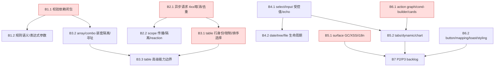

# Implementation Roadmap — Amis Bug-Driven Improvements

> Last Updated: 2026-06-27 (form/runtime correctness bundle收口 — plan `docs/plans/2026-06-27-0850-3-form-runtime-correctness-composite-editors-contract-honesty-async-lifecycle.md` completed。四 phase 全绿，Proof 先行。**Phase 1 契约诚实性**：flux-core 新增 `buildPerRendererSourceResolver`（按 renderer type 解析自身实现文件 + 传递式 import 闭包 + sibling/动态 import 排除 + 运行时 handle factory 按引用选择），6 个生产 harness 从整包 blob 改为 per-renderer 隔离（renderer A 用法不再 mask renderer B 声明）；`isCapabilityHandleReferenced` 数组锚收紧到 `methods`/`listMethods`/`return` 上下文（不再被 `labels:['save']` 类 incidental 数组满足）。**Phase 2 复合控件**：condition-builder `BetweenInput` 清一侧保留存活值（不再 null）；date-range `commitRange` clamp 到 minDate/maxDate（镜像单字段）；key-value `validateChild` 增内联重复 key 反馈；key-value remove 遵守 `validateOn`（与 combo/array-editor 对称）；`rewriteItemRight` DFS 短路防 id 碰撞串值；projected form/scope 按 item.id+right 缓存（消除每 render churn）；input-table 补 `removeWhen` 与 combo/array-field 对称。**Phase 3 树 async**：`treeConfig`/`baseOptions` memoize 解 debounce churn；lazy-children `runLoad` 加 mounted+generation 守护 + baseSnapshot 防 stale-merge；展开态 effect 改合并策略保留用户折叠；远程搜索补 AbortController/signal plumbing。**Phase 4 runtime async/验证**：data-source 成功路径镜像 catch 的 requestSequence 陈旧守护；upload `removeExisting` 读 ref；`validateSubtreeByNode` 透传 signal；`validateForm`/`validateSubtree` 入口加 isLifecycleTransitional 门控；`revalidateDependents` 不预清 validating；AUDIT-07 文档化为 caller 契约；qrcode AUDIT-13 文档化豁免。workspace typecheck/build/lint/test 全绿。Earlier: 2026-06-27 (anchor-honesty remediation bundle收口 — plan `docs/plans/2026-06-27-1030-2-validation-i18n-diagnostics-contract-honesty-anchor-plan.md` completed。八条 in-scope anchor findings 按契约生效：**G3** `buildValidationMessage` 对 required/minLength/maxLength 一致加 `rule.message ??` 守卫；**G14** `requiredRange` 改用专属 `validation.requiredRange` i18n key（两 locale 占位一致），消除「部分区间却读 generic is required」误导；**M-02** `form-validation.md`「exactly these」kind 列表补 `requiredRange` 与 live union（17 kind）一致；**M-09** `applyChangesAndRevalidate` 裸 `await revalidateDependents` 收敛为 try/catch 经 `reportDependentRevalidationFailure` 诊断缝 + 表单级错误（不再 bare reject），收敛注释如实列出三条入口；**M-08** `responseAdaptor` 错误路径 catch 加结构化诊断（`env.monitor.onError({phase:'api',...})` + `console.warn`）并保留后端消息 raw-body fallback；**M-06** dedup/cache cache-hit 检查 `signal?.aborted` 返回 `createCancelledResult`（共享 fetch 不取消的文档化意图不变）；**G4** `isCapabilityHandleReferenced` 锚定到真实接线（`case '<h>':` / `===` / method 数组字面量元素），不再误判 action type / i18n key；**G15** `findUnreferencedContracts` 支持 per-definition 源 resolver + 注释剥离，form 包 capability 检查从拼接 blob 改为 per-definition `capabilityHandleSource`，消除 sibling 掩盖。G16 经 live 核对为误报移出 scope。每条 Proof 先于 Fix；新增 `flux-core/contract-honesty.test.ts`（G4/G15 机制 Proof）。workspace typecheck/build/lint/test 全绿；独立 fresh-session closure-audit `approved`（0 defect）。Earlier: 2026-06-27 (F4+F5 follow-up done: async lifecycle abort & in-flight race hardening收口 — plan `docs/plans/2026-06-27-0007-3-async-lifecycle-abort-and-inflight-race-hardening-plan.md` completed。F4 `dynamic-renderer`：`run()`（autoload + 暴露的 `refresh` 能力使其在单个 effect 生命周期内可达 >1 次）改为捕获 per-invocation controller `const myController = new AbortController(); controller = myController;`，post-await 守卫（success `:127` + catch `:156` 两处）改查 `myController.signal.aborted`，消除 refresh-while-loading 时被 abort 的 run#1 读共享 `controller`(=AC2) 误判未取消、渲染虚假 error 状态；共享 `controller` 仍驱动 abort 闭包与 cleanup，既有 stale-clear / loadActionKey-change teardown 行为不变。F5 `FormRenderer`：init effect cleanup 在 `initActionAbortRef.current === controller` 块内追加清理 `inFlightInitKeyRef`（`=== activationKey` 时），`.finally` 的 marker 清理追加 controller-identity 守卫 `&& initActionAbortRef.current === controller`，使 mid-init 非-activation dep 变化（如 `initAction` identity）后 init 能为同一 activationKey 重新调用，且旧 aborted promise 的 finally 不会误清新 re-run 的 marker（draft-review minor 收口）；success-path `lastInitKeyRef` 语义不变。两处各先写失败态回归测试（Proof 先行）再转绿：`dynamic-renderer-refresh-race.test.tsx`（refresh-while-loading，abort 不渲染 `[data-error]`、fresh schema 胜出）、`form-init-inflight-race.test.tsx`（dep-change-during-in-flight，initAction #2/#3 重新调用）。owner doc `performance-design-requirements.md` P5 补两条规则（per-invocation controller + in-flight guard ref 必须在与 abort 同一 cleanup 中清理 + finally controller-identity 守卫）；source/crud 同类 race 记为 watch-only residual（plan `## Deferred But Adjudicated`）。workspace typecheck/build/lint/test 全绿；独立 fresh-session closure-audit pass-with-minors（0 blocker / 0 major）。属 B2 async/in-flight 主题 pre-existing 残留收口（mission 重构路径内），B2.1/B2.2 本体早已 `done`。Earlier: 2026-06-27 (F3 follow-up done: `responseAdaptor` error-path throw-case contract收口 — plan `docs/plans/2026-06-27-0007-2-response-adaptor-error-path-contract-plan.md` completed。裁定并落地 Decision (a)：`executeApiSchema` 的 `!response.ok` 分支对 `applyResponseAdaptor` try/catch 包裹，adaptor 抛异常时回退到 raw `response.data`，使 `readResponseErrorMessage` 仍能提取 backend `message`/`msg`；success 分支保持不变；补 throw-case 回归测试（2 例，Proof 先行）；owner doc `api-data-source.md` A1 节同步最终契约。workspace typecheck/build/lint/test 全绿；独立 fresh-session closure-audit pass。属 B2.1 4xx-adaptor reachability 的 mission-introduced 残留收口，B2.1 本体早已 `done`。Earlier: 2026-06-26 (B5.1 done: surface teardown GC 反复周期回归门落地、markdown content-only 契约 + sanitize 双策略 (a)+(b) 文档化与代码块逐字保留锚、tabs 受控值组合矩阵锁定、远程 schema i18n 边界裁定（message-key 半边已锁 / schema-string 翻译半边 Loader 层 DESIGN-ACK）；workspace typecheck/build/lint/test 全绿；closure-audit 待 fresh-session。Earlier: B5.1/B6.1/B5.2 drafted → active earlier: 三份 plan 经独立 fresh-session 子 agent plan review 达共识——B5.1 pass-with-minors（1 轮）、B6.1 pass-with-minors（1 轮）、B5.2 revised→pass（2 轮，Major M1 I3 scope 论证 + 6 Minor 已修正）；Phase Status B5.1/B6.1/B5.2 `todo`→`planned`，Plan 列填充。B5.1=surface GC 回归门/markdown 内容+安全双契约/远程 schema i18n 边界裁定；B6.1=action-graph reload 目标解析/condition-builder disabled 扇出/cards 选择归属（六行为已落地，收口为 lock+doc+回归锚）；B5.2=tabs candidate-fix(L8)+card media className(L14) 两处 Fix + `t()` formula(I3) + iframe/I4 裁定 + 数据显示/i18n 回归锚。B5.2 依赖 B6.1 先行。B3.3 done earlier: T11 tree lazy-children 裁定 B（DESIGN-ACK-NOT-IMPL + doc + 预加载锚，successor B7）+ T24 嵌套 crud ID-namespace 隔离（by construction）+ id-uniqueness doc（guard 裁定 doc-only non-goal）+ T29 hover/focus sibling-render 隔离锚（CSS-only + React.memo）+ T15 re-resize/delta 锚 + T18 summary 运行时切列重对齐锚 + T9 fixed-left+选择列 offset 锚 + T10 setSelection 跨页 keepOnPageChange 锚 + T23 source 刷新确认锚；table/crud owner doc 显式化；full-green test/typecheck/build/lint。B3.3/B4.1/B4.2 drafted → active earlier（独立 fresh-session 子 agent plan review 达共识，B3.3 经 2 Major 修正后 pass、B4.1 pass、B4.2 pass-with-minors）；B3.3 接管 B3.1 deferred 的 T9/T10。B3.2/B3.1/B2.2/B2.1/B1.2/B1.1 done earlier。)
> Source: `docs/components/amis-bug-driven-improvements/README.md` + 14 per-component signal docs (215 entries distilled from `~/app/nop-chaos-flux-tests/data/useful-llm/`, 1785 amis historical bug-fix issues)
> 关联：`docs/components/roadmap.md`（新组件，独立）、`docs/components/existing-components-improvement-roadmap.md`（Flux-first 能力缺口，已全部 `done`）、`docs/components/mobile-roadmap.md`（响应式，独立）

## Purpose

本文件是 **amis 历史 bug-fix 信号驱动改进**的全局阶段索引与状态面。AI 或维护者读完本文后即知哪些工作项尚未开始（`todo`）、已计划（`planned`）或已完成（`done`），无需重走 signal 文档与代码库。

本文件是粗粒度阶段索引，不是执行计划。每个 `planned` 阶段由其执行计划（`docs/plans/`）拥有。逐条属性、测试建议与 AMIS-REF 看源 signal 文档 `docs/components/amis-bug-driven-improvements/01-14*.md`；契约看对应 `design.md`。

> 编写和更新规则见 `docs/backlog/00-roadmap-authoring-guide.md`。本 roadmap 是 flux 多 roadmap 之一（与 `docs/components/roadmap.md`、`mobile-roadmap.md`、`existing-components-improvement-roadmap.md` 并列），故用具名文件名而非通用 `implementation-roadmap.md`；对应 mission 为 `missions/amis-bug-driven-improvements.json`。

**amis 不是标尺。** 每条 signal 已翻译成 Flux-first 的通用正确性属性；amis 坏设计显式 NOT-ADOPTED（见各 signal doc 的 NOT-ADOPTED 表与 `amis-bug-driven-improvements/README.md`）。本 roadmap 不复制 amis 行为，只补 Flux 已声称但未测试的属性 / 未文档化的设计边界。

## Phase Status

> **这是全文件唯一的动态状态块。仅在此处更新状态。**
> 工作项按 wave 分组（B1 最优先 → B7 最后）。状态流转：draft review 通过 → `todo` 改 `planned`；closure audit 通过 → `planned` 改 `done`（不得提前）。wave 只是优先级分组标签，**不携带状态**；只有工作项（B1.1 等）出现在本节。

### Wave B1 — 校验依赖闭包与规则语义

- B1.1 校验依赖闭包错误清除与 async 取消语义: `done`
- B1.2 校验规则语义、表达式参数与全管道入口: `done`

### Wave B2 — 异步请求与 scope 传播

- B2.1 异步请求 4xx/取消/去重契约: `done`
- B2.2 scope 传播、隔离与 reaction 触发: `done`

### Wave B3 — 表格/CRUD 行身份与数据生命周期

- B3.1 table 行身份、数据收缩钳制与排序/选择边界: `done`
- B3.2 array/combo 嵌套隔离与校验寻址: `done`
- B3.3 table 高级能力边界（树/聚合/性能）: `done`

### Wave B4 — 表单字段受控值与生命周期契约

- B4.1 select/input 受控值、echo 与事件契约: `done`
- B4.2 date/tree/file 生命周期与边界契约: `done`

### Wave B5 — 表面、生命周期拆除与显示/i18n

- B5.1 surface GC、markdown XSS 与远程 schema 本地化: `done`
- B5.2 tabs/dynamic-renderer/chart 契约: `done`

### Wave B6 — action graph、button、cards、condition-builder、styling

- B6.1 action graph 目标解析、condition-builder disabled 扇出、cards 选择归属: `done`
- B6.2 button/mapping/toast/styling 契约: `done`

### Wave B7 — P2/P3 Backlog

- B7 P2/P3 信号收口（103 条，未细化工作项）: `done`

## Framework / Platform Reuse

以下能力已由 Flux 现有 runtime / 包提供，本 roadmap 的工作项**不得重建**，只做补测试 / 补设计边界 / 补契约裁定：

| 能力            | 提供方                                                               | 说明                                                                                             |
| --------------- | -------------------------------------------------------------------- | ------------------------------------------------------------------------------------------------ |
| 校验运行时      | `flux-runtime` validation scope runtime                              | 依赖闭包、cycle-safe 遍历、async 校验、field-addressed 错误——本 roadmap 补测试与边界文档，不重建 |
| 请求层          | `data-source` + `api-data-source`                                    | requestAdaptor/responseAdaptor/反应/缓存——补 4xx/dedup/depth-N 边界                              |
| scope 模型      | `flux-runtime` scope ownership + isolation                           | 词法继承、owner-qualified keys——补深度与 location-param 边界                                     |
| 行身份          | `table-row-identity-and-scope-performance`                           | rowKey 解析、`runtimeId`——补复合 key 故事                                                        |
| 复合值字段      | `object-field`/`array-field`/`detail-field` staged owner             | combo/input-table 复用——补嵌套隔离与校验寻址测试                                                 |
| surface 运行时  | `surface-owner` (statusPath/z-index counter/close lifecycle)         | dialog/drawer/tabs——补 GC 回归与 inner-owner init 测试                                           |
| 表面族已有 wave | `existing-components-improvement-roadmap.md` E0/E1/E2/X（全 `done`） | 本 roadmap 是其**未测试边界**的反查，不重复已落地行为                                            |
| UI 组件库       | `@nop-chaos/ui`                                                      | button/select/dialog 等——禁止裸 HTML                                                             |
| i18n            | `packages/flux-i18n`                                                 | 补远程 schema 覆盖与无 baked-in string 测试                                                      |

## Current Baseline

**已成立（不需要本 roadmap 介入）：**

- Flux 主组件 roadmap（W1a–W4c + W1d）43 个 wave 组件全 `runtime`，12 个工作项 `done`（见 `docs/components/roadmap.md`）。
- Flux-first 能力改进（`existing-components-improvement-roadmap.md` E0a–E2h、X1–X5）全 `done`——已覆盖 select/table/tree/button/surface/data-source 等的能力补齐与命名规范化。
- `amis-bug-driven-improvements/` signal 库（README + 14 doc，215 条 signal）已 triage 完成，两轮独立 sub-agent review `ACCEPT`。

**本 roadmap 要补的 gap（Flux 已声称/已实现，但缺测试或未文档化的边界）：**

- **P0+P1（114 条）** 分布在 6 个 themed wave（B1–B6），按源 signal doc 的 severity 标注。每条要么是 TEST-GAP（设计声称但无回归测试），要么是 DESIGN-GAP（owner doc 沉默需补裁定），少数是 LOCK（设计正确但需锁回归锚）。
- **P2/P3（103 条）** 归 B7 backlog，等 B1–B6 closure 后再评估是否细化为工作项（部分可能在 B1–B6 执行中被顺手覆盖）。

**核心缺口陈述：** 114 条 P0+P1 signal 揭示 Flux 设计文档中**声称但未锁**的正确性属性（典型：校验依赖闭包错误清除、删行后页码钳制、async 请求去重、无限深度词法继承、condition-builder disabled 扇出）。这些不是 amis 缺失功能，而是 Flux 已有设计的**测试与文档边界债务**。

## Phases

> 工作项 = 一个 execution plan 的合理交付范围。Plan 列为 `none` 表示尚未拟 plan（当前为规划阶段，未开始拟制开发计划）。AMIS-REF 列指向源 signal doc 的条目 ID 与可反查的 amis issue 号。

### Wave B1 — 校验依赖闭包与规则语义

| Work item                                  | Status | Owner Doc                              | Dependencies | Reuse                         | Plan                                                                                   | AMIS-REF                                                                       |
| ------------------------------------------ | ------ | -------------------------------------- | ------------ | ----------------------------- | -------------------------------------------------------------------------------------- | ------------------------------------------------------------------------------ |
| B1.1 校验依赖闭包错误清除与 async 取消语义 | `done` | `docs/architecture/form-validation.md` | —            | flux-runtime validation scope | `docs/plans/2026-06-26-0234-1-b11-validation-dependency-closure-async-cancel-plan.md`  | `01` V1/V2/V16/V22（#1636/#11956/#10530/#4236,#4862,#4876 → V22 合并三 issue） |
| B1.2 校验规则语义、表达式参数与全管道入口  | `done` | `docs/architecture/form-validation.md` | B1.1         | flux-runtime validation scope | `docs/plans/2026-06-26-0406-1-b12-validation-rule-semantics-expression-params-plan.md` | `01` V3-V6/V8-V10/V13-V15/V17-V21/V23                                          |

### Wave B2 — 异步请求与 scope 传播

| Work item                             | Status | Owner Doc                                            | Dependencies | Reuse                         | Plan                                                                            | AMIS-REF                                       |
| ------------------------------------- | ------ | ---------------------------------------------------- | ------------ | ----------------------------- | ------------------------------------------------------------------------------- | ---------------------------------------------- |
| B2.1 异步请求 4xx/取消/去重契约       | `done` | `docs/architecture/api-data-source.md`               | —            | data-source / api-data-source | `docs/plans/2026-06-26-0234-2-b21-async-request-4xx-dedup-cache-plan.md`        | `11` A1/A3/A11（#3465/#1470,#2464/#3417）      |
| B2.2 scope 传播、隔离与 reaction 触发 | `done` | `docs/architecture/scope-ownership-and-isolation.md` | —            | flux-runtime scope ownership  | `docs/plans/2026-06-26-0406-2-b22-scope-propagation-isolation-reaction-plan.md` | `11` A2/A5/A9/A14-A16/A19（#4857/#3562/#5275） |

### Wave B3 — 表格/CRUD 行身份与数据生命周期

| Work item                                      | Status | Owner Doc                                                                          | Dependencies | Reuse            | Plan                                                                                          | AMIS-REF                                                   |
| ---------------------------------------------- | ------ | ---------------------------------------------------------------------------------- | ------------ | ---------------- | --------------------------------------------------------------------------------------------- | ---------------------------------------------------------- |
| B3.1 table 行身份、数据收缩钳制与排序/选择边界 | `done` | `table/design.md`, `crud/design.md`, `table-row-identity-and-scope-performance.md` | B2.1         | row-identity doc | `docs/plans/2026-06-26-0520-1-b31-table-row-identity-pagination-clamp-sort-selection-plan.md` | `02` T1/T3/T5/T6/T8/T27/F1（#479/#1478,#2458,#5203/#6004） |
| B3.2 array/combo 嵌套隔离与校验寻址            | `done` | `docs/architecture/array-field.md`                                                 | B1.1         | staged owner     | `docs/plans/2026-06-26-0520-2-b32-array-combo-nested-isolation-validation-addressing-plan.md` | `04` C1-C3/C5/C7/C9/C10/C12/C13                            |
| B3.3 table 高级能力边界（树/聚合/性能）        | `done` | `table/design.md`                                                                  | B3.1, B3.2   | table runtime    | `docs/plans/2026-06-26-0830-1-b33-table-advanced-tree-aggregate-perf-plan.md`                 | `02` T11/T15/T18/T23/T24/T29                               |

### Wave B4 — 表单字段受控值与生命周期契约

| Work item                                 | Status | Owner Doc                                                                                      | Dependencies | Reuse                                          | Plan                                                                                | AMIS-REF                                                                                                                                                                   |
| ----------------------------------------- | ------ | ---------------------------------------------------------------------------------------------- | ------------ | ---------------------------------------------- | ----------------------------------------------------------------------------------- | -------------------------------------------------------------------------------------------------------------------------------------------------------------------------- |
| B4.1 select/input 受控值、echo 与事件契约 | `done` | `select/design.md`, `input-text/design.md`, `input-number/design.md`                           | —            | shadcn Combobox, valueAdapter                  | `docs/plans/2026-06-26-0830-2-b41-select-input-controlled-value-echo-event-plan.md` | `03` S1/S3-S6/S8/S12；`05` I1-I6/I8（I11 经 Flux 原则审计降为 BY-DESIGN P3，移出 P0+P1；详见 B4.1 Phase Detail）                                                           |
| B4.2 date/tree/file 生命周期与边界契约    | `done` | `input-date/design.md`, `date-range/design.md`, `input-tree/design.md`, `input-file/design.md` | —            | date 底层（W2b）、tree primitive、uploadAction | `docs/plans/2026-06-26-0830-3-b42-date-tree-file-lifecycle-boundary-plan.md`        | `06` D1/D2/D4/D9/D12；`07` TR1-TR6（TR6 split：valueField remap 保留；enableNodePath 路径构建 → TR7 DESIGN-ACK-NOT-IMPL，因 input-tree/design.md 标 暂不实现）；`08` U2-U6 |

### Wave B5 — 表面、生命周期拆除与显示/i18n

| Work item                                          | Status | Owner Doc                                                                                                           | Dependencies | Reuse                          | Plan                                                                                  | AMIS-REF                                                      |
| -------------------------------------------------- | ------ | ------------------------------------------------------------------------------------------------------------------- | ------------ | ------------------------------ | ------------------------------------------------------------------------------------- | ------------------------------------------------------------- |
| B5.1 surface GC、markdown XSS 与远程 schema 本地化 | `done` | `docs/architecture/surface-owner.md`, `markdown/design.md`, `frontend-programming-model.md`(i18n 边界), `flux-i18n` | —            | surface runtime, sanitize 门禁 | `docs/plans/2026-06-26-1030-1-b51-surface-gc-markdown-xss-remote-schema-i18n-plan.md` | `09` L1/L7；`10` DD9/DD10；`12` I1                            |
| B5.2 tabs/dynamic-renderer/chart 契约              | `done` | `tabs/design.md`, `dynamic-renderer/design.md`, `chart/design.md`                                                   | B4.1, B6.1   | shadcn Tabs, recharts          | `docs/plans/2026-06-26-1030-3-b52-tabs-dynamic-chart-i18n-plan.md`                    | `09` L6/L8/L9/L14/L16；`10` DD1-DD3/DD8/DD12/DD13；`12` I2-I4 |

### Wave B6 — action graph、button、cards、condition-builder、styling

| Work item                                                                   | Status | Owner Doc                                                                                                | Dependencies | Reuse                              | Plan                                                                                            | AMIS-REF                                    |
| --------------------------------------------------------------------------- | ------ | -------------------------------------------------------------------------------------------------------- | ------------ | ---------------------------------- | ----------------------------------------------------------------------------------------------- | ------------------------------------------- |
| B6.1 action graph 目标解析、condition-builder disabled 扇出、cards 选择归属 | `done` | `docs/architecture/action-scope-and-imports.md`, `condition-builder/design.md`, `cards`/`card/design.md` | —            | action graph, E3 condition-builder | `docs/plans/2026-06-26-1030-2-b61-action-graph-reload-condition-builder-disabled-cards-plan.md` | `14` AG1/AG3/CB1/CB3/CD1/CD4（#5725/#4655） |
| B6.2 button/mapping/toast/styling 契约                                      | `done` | `button/design.md`, `mapping/design.md`, `docs/architecture/styling-system.md`                           | —            | ui Button, Tailwind                | `docs/plans/2026-06-26-2016-1-b62-button-mapping-toast-styling-contract-plan.md`                | `14` toast T2/MP2/STY2                      |

### Wave B7 — P2/P3 Backlog

| Work item                   | Status | Owner Doc      | Dependencies  | Reuse | Plan                                                                               | AMIS-REF                  |
| --------------------------- | ------ | -------------- | ------------- | ----- | ---------------------------------------------------------------------------------- | ------------------------- |
| B7 P2/P3 信号收口（103 条） | `done` | 各 `design.md` | B1-B6 closure | —     | `docs/plans/2026-06-26-2100-1-b7-p2p3-signal-triage-residual-adjudication-plan.md` | `01-14*.md` 全部 P2/P3 行 |

## Phase Details

> 短交付范围，无实现步骤。逐条属性、推荐测试与 AMIS-REF 看源 signal doc。

### B1.1 校验依赖闭包错误清除与 async 取消语义

值变更使规则通过时必须清除 field-addressed 错误（含相互约束双向重校验）；async 校验被更新运行取代时取消且不发布（不冒泡为用户可见错误）；任何校验入口（submit/action/manual）跑全规则管道，无"required-only"弱化模式。P0 锚点。

### B1.2 校验规则语义、表达式参数与全管道入口

派生值作为一等变更事件进依赖图；动态 requiredness 与 submit-gating 不分歧；数组每元素规则独立 materialize（默认值不抑制兄弟列）；外部错误按嵌套路径寻址；数值/格式规则类型契约与表达式参数；hidden/init/programmatic-write 参与语义；程序式 validate() 返回结构化结果。

> **Plan-authoring note:** B1.2 是本 roadmap 最大的单一工作项（~14 signal 条目，共享 form-validation 规则管道主题与同一 owner doc，故仍归一个工作项）。若 plan 执行时发现无法在一个 plan 内收口，可在 plan 内自然拆为 B1.2a（规则语义/类型强制：V10/V13/V14/V15）与 B1.2b（复合字段 + hidden/init + 程序式 API：V5/V6/V8/V9/V17-V21/V23）——这不需改本 roadmap，属 plan 级拆分。

### B2.1 异步请求 4xx/取消/去重契约

responseAdaptor 在 non-OK 响应也执行（可映射错误/msg，onError 随后）；单一 error→notify 翻译（不重复 toast）；requestAdaptor 可改写 GET query（Flux 故意与 amis 分歧，需 LOCK）；并发同请求按 executable identity 去重（schema-fetch 也参与缓存）。P0 锚点。

### B2.2 scope 传播、隔离与 reaction 触发

词法继承无限深度（非单层）；component-handle/refreshSource 按 runtime-instance 命名空间隔离；location/route 参数绑当前 page/surface scope；sendOn 门控所有入口路径（init/refresh/interval/action）；轮询刷新翻 isRefreshing 不翻 loading（silent）。

### B3.1 table 行身份、数据收缩钳制与排序/选择边界

复合/计算 rowKey 故事（表达式或合成 `__rowKey`）；删行/批量动作使总数 < (currentPage-1)\*pageSize 时钳制 currentPage 到末页并重取；sort 比较器用与 cell 显示同一 path binder（含 dotted 路径）；点击派发按目标区分（checkbox/popOver/cell 不互相触发）。P0 锚点（页码钳制）。

### B3.2 array/combo 嵌套隔离与校验寻址

嵌套 array-field 写隔离到 index-addressed 子路径；行内可读父行字段做级联；每行 delete 可按 item-scoped `when`（`removeWhen`）条件禁用；server 错误按行级 `${name}.${i}` 与叶级 `${name}.${i}.${child}`（穿容器/tab）寻址，undefined-target 不崩；item 提交值仅含声明子字段；hidden 字段提交契约裁定为「默认保留值并包含进提交，`clearValueWhenHidden` opt-in 清值排除」（C10 裁定 B，非默认排除）；行本地相对跨字段寻址裁定为 DESIGN-ACK-NOT-IMPL + successor B7（V6）。

### B3.3 table 高级能力边界（树/聚合/性能）

树表 lazy-load 每节点（大树不全量 children）；展开态跨刷新存活（或显式文档化不存活）；树选择不级联子（LOCK）；列 resize 在横向溢出时可用且可多次；summary 行在列隐藏时重对齐到可见叶列；hover/edit 单元格不重渲染兄弟行（行本地读）。

### B4.1 select/input 受控值、echo 与事件契约

multi-select 是真数组、按 Object.is 匹配（分隔符编码免疫 LOCK）；option 缺失时 echo 降级（非空）；远程搜索保留已选项 + 缓存 key 含全依赖；reset 同步显示与提交值（flush debounced write）；每条值变更路径（clear/reset/setValue）发统一 onChange；字面量初始值不被当表达式解析。

### B4.2 date/tree/file 生命周期与边界契约

valueFormat 控提交值、displayFormat 控渲染、utc 仅影响提交（显示/picker 留本地）；range 选一端不变异另一端时间分量、start≤end 保证、required 验两端、pending 仅 confirm 后提交；input-tree 空 children[] 当叶子、cascade 契约稳定（LOCK）、option 不可变；upload lifecycle 状态机（pending→uploading→uploaded|error）、multiple+autoUpload 增量 append、初始化已有列表+新增合并。

### B5.1 surface GC、markdown XSS 与远程 schema 本地化

surface 关闭释放 SurfaceEntry+validation owner+child scope（GC 回归）；markdown `src` 每变化取一次不循环；markdown HTML sanitize 策略 + 代码块逐字保留（区分两关注）；远程 schemaApi/dynamic schema 的 locale 解析与切换时重算；无 baked-in runtime string（notify title 等走 registry）。P0 锚点。

### B5.2 tabs/dynamic-renderer/chart 契约

tabs value(defaultValue vs value) 语义无歧义（LOCK）；动态 `items:${expr}` 变化时重算 + active 自动修正；mountOnEnter/unmountOnExit 含 inner-owner lifecycle init；drawer 内 transient overlay portal 到 root 不污染 DrawerContent position；dynamic-renderer 读 live scope 非 snapshot、lexical 隔离；chart 数据更新 in-place（不 remount/flash）、不硬编码 min-size、空态 placeholder。

### B6.1 action graph 目标解析、condition-builder disabled 扇出、cards 选择归属

reload action 定向到具名组件不刷整页；condition-builder `disabled` 扇出到所有 mutation affordance（drag/delete/add/not-input，单一 umbrella switch）；cards `selectable` 同时关 visual highlight + selection state（无半禁用）。P0 锚点。

### B6.2 button/mapping/toast/styling 契约

button `disabled` 接受 boolean|expr（统一，LOCK）；label 含 `&` 忠实渲染；toast imperative API strict-mode 安全、duration 跨 variant 一致；mapping 在重复上下文 source scope 定义（once-per-renderer 缓存 vs per-row，loader 胜出）；utility className 仅默认 stylesheet 即生效（无 helper.css，LOCK）。

### B7 P2/P3 信号收口

> Status (2026-06-26): `done`。99 条 P2/P3 signal（97 单一 decision-type + 2 复合标签行 I11/D3）逐条裁定并标注 `RESOLVED (B7)`，五类归宿分布：`covered-by` 21、`landed-anchor` 1（T13 tree-table no-cascade LOCK）、`landed-doc-note` 1（F2 crud cleared-field query 语义）、`watch-only` 68（每条含 non-blocking 理由）、`out-of-scope-feature` 8。裁定工作表：`docs/components/amis-bug-driven-improvements/_b7-triage.md`；执行计划：`docs/plans/2026-06-26-2100-1-b7-p2p3-signal-triage-residual-adjudication-plan.md`。

不丢弃原则已兑现：每条在源 doc 仍有 AMIS-REF 可反查，并附 `RESOLVED (B7): <verdict> <evidence>` 内联标记。

**Successor feature 清单（若产品判断需要，可反查 backlog；本 roadmap 是测试/文档边界债 roadmap，不实现 feature）：**

- 来自 B1–B6 显式 deferred：**V6** array/combo 行本地相对跨字段寻址、**C10-projection** hidden 字段排除投影、**T11** tree-table per-node lazy-children、**U5** input-file `deleteAction`、**U6** input-file `maxSize`/`onReject`、**DD9** markdown 远程 `src` fetch、**I1-schema** runtime schema-string i18n 翻译 pass、**I4** reactive locale 全量接线、**L16** iframe renderer + listener clone-safety、**MP2-loader** mapping loader-sourced map + loader-wins precedence。
- 来自 B7 Phase 1 新裁出：**T2** 字面含点/符号字段名 bracket-key 解析、**T28** 动态 `columns:${expr}` 重编译、**I10** input-number precision 舍入模式、**D10** 相对日期表达式、**TR7** input-tree `enableNodePath` 路径串、**DD7** image fetcher-backed 模式、**A10** polling jitter、**M2** multi-tab keep-alive shell。

## Dependency Graph

> P0 锚点工作项（B1.1/B2.1/B3.1/B4.2/B5.1/B6.1）标红。**禁止跳过 B1.1/B2.1 直接做 B3.x**——会产生不可关闭的 partial landing（B3.2 依赖 B1.1 校验闭包，B3.1 依赖 B2.1 请求边界）。

## Cross-Cutting

| 关注点            | 说明                                                                                                                                                                                                                                                                                                                                                                                                                                                                                                                                                                                                                                                                                                                                                                                                                                                                                                                                                                                                                                                                                              |
| ----------------- | ------------------------------------------------------------------------------------------------------------------------------------------------------------------------------------------------------------------------------------------------------------------------------------------------------------------------------------------------------------------------------------------------------------------------------------------------------------------------------------------------------------------------------------------------------------------------------------------------------------------------------------------------------------------------------------------------------------------------------------------------------------------------------------------------------------------------------------------------------------------------------------------------------------------------------------------------------------------------------------------------------------------------------------------------------------------------------------------------- |
| amis 不是标尺     | 每个 DESIGN-GAP 必须给详细理由（来自源 doc RELEVANCE TO FLUX）；每个 TEST-GAP 必须有 focused 可证伪测试；amis 坏设计显式 NOT-ADOPTED（散落条件属性→`when`、组件级 `api`→data-source、值编码→`{label,value}`、`level`/`actionType`→`variant`+action graph、`themeCss`/`mobileUI`→Tailwind+响应式、`dataProvider`/前端导出/echarts→拒绝）                                                                                                                                                                                                                                                                                                                                                                                                                                                                                                                                                                                                                                                                                                                                                           |
| owner-doc 同步    | 每个工作项关闭时更新对应 `design.md` 的 Flux 决策表（DESIGN-GAP 条目）；TEST-GAP 如不改契约则仅加测试                                                                                                                                                                                                                                                                                                                                                                                                                                                                                                                                                                                                                                                                                                                                                                                                                                                                                                                                                                                             |
| 测试自动化        | P0 锚点条目属"必须自动化"（Test Strategy Tier：failing test 先行）；P1 多为"建议有测"。源 doc 每条有具体 Recommended test                                                                                                                                                                                                                                                                                                                                                                                                                                                                                                                                                                                                                                                                                                                                                                                                                                                                                                                                                                         |
| Playground 示例   | 仅当工作项引入新用户可感知能力时才需 playground 页（多数 TEST-GAP/边界裁定不需要）                                                                                                                                                                                                                                                                                                                                                                                                                                                                                                                                                                                                                                                                                                                                                                                                                                                                                                                                                                                                                |
| 复用既有 wave     | 与 `existing-components-improvement-roadmap.md` E0/E1/E2/X（全 `done`）同源域的工作项，只补其未测试/未文档化边界，不重复已落地行为                                                                                                                                                                                                                                                                                                                                                                                                                                                                                                                                                                                                                                                                                                                                                                                                                                                                                                                                                                |
| 反查链            | 每条 signal 的 AMIS-REF 指向 `~/app/nop-chaos-flux-tests/data/useful-llm/` 原始 amis issue，便于判断 Flux 设计是否真闭合该属性                                                                                                                                                                                                                                                                                                                                                                                                                                                                                                                                                                                                                                                                                                                                                                                                                                                                                                                                                                    |
| **Flux 原则审计** | 2026-06-25 独立 sub-agent 逐条核验 215 条 vs Flux 设计原则（`field-binding-and-renderer-contract.md` Rule 1「表达式用普通字段」+ `naming-conventions.md` §3 NOT-ADOPTED + META_FIELDS 冻结集）。**结论：0 hard violation**（无条目提议 amis 坏设计）。修 5 处 framing 缺陷：**I11**（min/max clamp 是已定 BY-DESIGN，非开放缺口 → 降 P3）、**TR6** split（`valueField` remap 保留为 TR6；`enableNodePath` 路径构建 → TR7 DESIGN-ACK-NOT-IMPL，因 input-tree 标 暂不实现）、**ST1** 重述为「per-renderer 字段一致性」（非 Rule 1 同义反复）、**L12** 收窄到「grid column 表达式响应性」（className-expr 通用行为归 styling-system）、**D3** 以 `transformOutAction` submit-transformer 为 Flux-idiomatic 路径先行（`nullValue` 字段仅条件性 X5 follow-up）。见各源 doc 修订行。                                                                                                                                                                                                                                                                                                                    |
| **请求下沉审计**  | 2026-06-25 第二轮独立 sub-agent 专项核验 api/data-source/action 层（B2/B3/B6 + U5/T11/T23/T25/AG3/C13）vs `docs/bugs/15-component-level-initfetch-analysis-and-fix.md` 的三条合规模式（①表达式值绑定 ②gated action graph ③用户交互驱动）。**结论：0 violation，0 amis initApi/组件级 api 引入**。每个 `interval`/`silent`/`sendOn`/`initFetch`/`cache`/`dedup`/`resultMapping`/`mergeStrategy` 引用都绑定到 data-source/DataSourceController/ApiSchema（X4 layering），非消费组件字段。修 1 处措辞歧义：**T25**「source init fires once per mount」可误读为 mount-fetch → 改为「`source` 表达式每 dialog open 求值一次（无 fan-out）」并标注 pattern #1（表达式值绑定，组件不 fetch）。**U5 `deleteAction`** 显式镜像 W3d `uploadAction` 桥接（action ref via `kind:'prop'`，user click-remove 时 `props.helpers.dispatch`，非 mount）；**T11 tree lazy-load** 标 user-expand-driven（pattern #3，镜像 `childrenSource`）；**AG3 reload** = action-graph capability 定向具名 source（非组件 api）。NOT-ADOPTED 覆盖完整（api/table/file/action doc 均含「组件级 api/initApi/interval → 拒绝」）。 |

## Rule

- 本文件是粗粒度阶段索引，不是执行计划。无实现步骤、复选框、closure criteria（这些在 plan 里）。
- **本文件是人机对齐工件**：工作项的增删、拆分、优先级重排需人确认——这体现人类规划。AI/mission-driver 按既定顺序取第一个 `todo` 工作项，自动起草/执行 plan（人不审 individual plan），closure audit 通过后写回 `done`。
- **可标记单位是工作项**（B1.1…B6.2，以及 B7），不是 wave。wave 只是优先级分组标签，不携带状态，wave 标题永远无自己的状态。
- AI 可自主推进工作项状态（`todo`→`planned`→`done`），基于 plan 完成的客观事实；但工作项本身的增删/重排需人确认。
- 工作项状态变更只需更新 Phase Status（本文件顶部）。不得在别处维护第二份 per-item 状态（如带自己 status 的覆盖表），避免漂移。
- **依赖一致性**：Phases 表与 Dependency Graph 必须一致；冲突时 Phases 表为准。
- 每个 `planned` 工作项由其 plan 拥有；plan 通过 closure audit 后必须把对应工作项在 Phase Status 标 `done`。
- 不得在 closure audit 通过前把工作项标 `done`。
- 逐条 signal 属性、推荐测试、AMIS-REF 以 `docs/components/amis-bug-driven-improvements/0X-*.md` 为权威；本文件 Phase Details 仅列交付范围。
