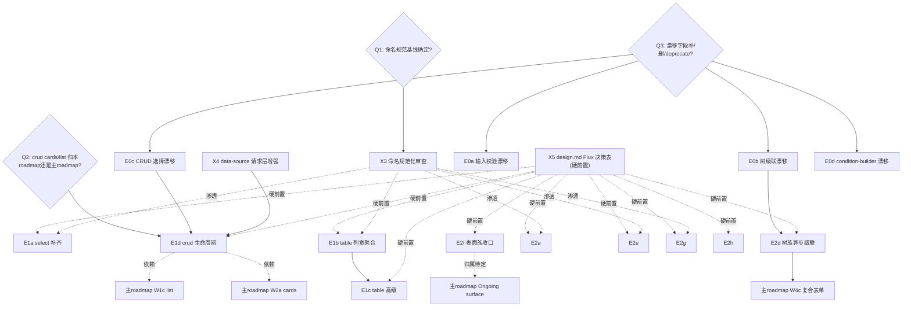

# 现有组件改进分析报告

> 分析日期: 2026-06-20（v2 — 按 Flux 设计原则重构，放弃 amis-parity 标尺）
> 分析范围: 全部 `status: runtime` 的已实现通用 renderer（共 39 个）
> 对照参考: amis-react19（仅作参考之一，**非标尺**）、shadcn/ui（主要命名/能力参照）、`docs/components/amis-baseline-matrix.md`、`roadmap.md`、各组件 `design.md`、明细附录 `existing-components-improvement-detail.md`
> 目的: 为"改进现有组件"建立独立 roadmap，区别于 `roadmap.md`（新增组件）与 mobile roadmap（响应式）

---

## 0. 阅读指引与分析原则（v2 核心变更）

### 0.1 不以 amis-parity 为标尺

v1 以"amis 有 Flux 无"为缺口定义，已被否决。**amis 的设计本身存在严重问题**，盲目对齐会把坏设计带进 Flux。本报告改用 **Flux 自身设计原则**为标尺，amis 仅作参考之一。

### 0.2 Flux 设计原则（裁决缺口的准绳）

| 原则                            | 含义                                                                                                                          | 对缺口判定的影响                                                                                               |
| ------------------------------- | ----------------------------------------------------------------------------------------------------------------------------- | -------------------------------------------------------------------------------------------------------------- |
| **核心已简化**                  | Flux 不需要 amis 的 `visibleOn`/`hiddenOn`/`disabledOn` 等散落条件属性，统一用 `when` 等机制                                  | amis 这类属性**不计入缺口**                                                                                    |
| **命名标准化 + shadcn/ui 对齐** | 属性命名明确、标准化，遵循 shadcn/ui 规范（如 `variant` 非 `level`、option 形状 `{label,value}`、`size` 语义）                | 新增能力**必须用 shadcn 命名**，amis 命名（`level`/`joinValues`/`borderMode`/`actionType` 判别树等）**不采纳** |
| **请求必须下沉**                | 数据请求走标准方案（`data-source` + action graph），**不在组件层开 `api`/`initFetch`/`interval` 短路径**                      | amis 组件级 api 生命周期**不采纳**；data-source 作为统一请求层的增强可保留                                     |
| **前端不做导出**                | CSV/Excel 导出是后台职责                                                                                                      | table/crud 的 export 能力**移出范围**                                                                          |
| **chart 用 recharts**           | echarts 过大，recharts 一般场景够用                                                                                           | echarts config 透传/echarts 扩展/geo 地图**不采纳**；chart 改进在 recharts 能力范围内                          |
| **不学 amis 的坏设计**          | amis 标准化差的部分（散落条件属性、`actionType` 判别树、`dataProvider` JS 函数串、`themeCss`、`mobileUI` 双实现等）一律不引入 | 见 §5 不采纳清单                                                                                               |

### 0.3 三 roadmap 结构（本次确定）

| Roadmap              | 内容                                                                                            | 文件                                                 |
| -------------------- | ----------------------------------------------------------------------------------------------- | ---------------------------------------------------- |
| **主 roadmap**       | 新增组件（`targetContract` → `runtime`）                                                        | `roadmap.md`（现有）                                 |
| **组件改进 roadmap** | 现有组件的能力补齐、命名规范化、契约漂移修复                                                    | `existing-components-improvement-roadmap.md`（待建） |
| **mobile roadmap**   | 现有组件的响应式改进（**同组件同属性 + 响应式实现**，不新建移动端组件、不引入 mobileUI 标志位） | `mobile-roadmap.md`（待建）                          |

**mobile 架构决策（已确认）：** 移动端 = 同一组件、同一套属性，内部用 Tailwind 响应式断点 + 必要运行时分支（如小屏 Select 变 bottom-sheet）自适应。因此 mobile roadmap 装的是"逐组件响应式审计与改进"，与组件改进 roadmap 内容不重叠（后者管桌面端功能/命名/契约）。详见 §8。

### 0.4 严重度与设计状态口径

- 严重度：`P0` 阻塞主流程 / `P1` 高频 / `P2` 常见可绕过 / `P3` 低频
- 设计状态：`DESIGN-GAP`（文档沉默）/ `DESIGN-ACK-NOT-IMPL`（已规划未实现）/ `DESIGN-COVERS`（契约级已写实现缺）/ `BY-DESIGN`（刻意不实现）/ `FLUX-ONLY`
- **新增 `不采纳`**：按 §0.2 原则明确拒绝（amis 坏设计或超出 Flux 范围），见 §5

### 0.5 范围与排除

- **覆盖：** `amis-baseline-matrix.md` §1-5 + §7 的全部 `runtime` 通用 renderer，共 39 个。
- **排除：** 领域 renderer（11 个：`designer-*`/`report-*`/`spreadsheet-page`/`word-editor-page`，Flux 独有宿主组件）；Flux-only 复合值字段原语（5 个：`object-field`/`array-field`/`variant-field`/`detail-field`/`detail-view`，随 `roadmap.md` W4c 一并讨论）。
- **非范围维度：** a11y/ARIA、i18n、键盘导航、错误边界、SSR、性能 — Flux 多走独立设计，单独立项评估。

---

## 1. 执行摘要

### 1.1 严重度分布（v2，剔除不采纳项后重定级）

| 严重度 | 数量 | 组件                                                                                                                                                                                                                |
| ------ | ---- | ------------------------------------------------------------------------------------------------------------------------------------------------------------------------------------------------------------------- |
| **P0** | 3    | `select`、`table`、`crud`                                                                                                                                                                                           |
| **P1** | 11   | `input-tree`、`tree-select`、`form`、`dialog`、`drawer`、`button`、`input-text`、`input-email`、`input-password`、`textarea`、`checkbox-group`                                                                      |
| **P2** | 17   | `radio-group`、`checkbox`、`switch`、`input-number`、`key-value`、`array-editor`、`tree`、`condition-builder`、`flex`、`page`、`tabs`、`dynamic-renderer`、`text`、`icon`、`tag-list`、`code-editor`、`data-source` |
| **P3** | 8    | `fieldset`、`container`、`reaction`、`loop`、`recurse`、`fragment`、`badge`、`chart`                                                                                                                                |

> v1 中 `code-editor`/`data-source` 为 P1，v2 降为 P2（code-editor 语言扩展非阻塞；data-source 请求下沉后 ws 等优先级降低）；`chart` 从 P1 降为 P3（recharts 够用，仅 minor 增强）。剔除了所有"不采纳"项后重新评级。

### 1.2 三个最高优先级结论

1. **`select` 功能严重不足（P0）。** 缺搜索过滤、多选、clearable、虚拟滚动、分组。用户反馈的"select 缺输入过滤"是头号缺口。改进时**采用 shadcn Combobox 命名模式**，不照搬 amis 的 `selectMode`/`joinValues`/`extractValue` 等。

2. **`table`/`crud` 桌面端能力缺口（P0）。** table 缺列宽 resize、表头吸顶、聚合行、单元格合并、多列排序。crud 缺自动轮询刷新（走 data-source）、可折叠查询区、无限滚动、跨页选择保留（契约漂移，需修）。**导出已移出范围（后台职责）**；crud 的 cards/list 模式依赖主 roadmap 的 `list`(W1c)/`cards`(W2a) 先落地。

3. **契约漂移（8 处，正确性问题）优先于功能新增。** condition-builder 的 `showIf`/`selectMode`/`formulas`、crud 选择保留字段、input-tree/tree-select 的 `cascade`/`showIcon`/`showOutline`、input-text 族的 `minLength`/`maxLength`/`pattern`。作者会以为字段生效，比缺功能更危险。

### 1.3 新增核心主题：命名规范化（用户强调）

多种控件属性命名需规范化、标准化、对齐 shadcn/ui。这既是横切工作项，也渗透进每个改进项。典型待规范项：选择族 option 形状、按钮 `variant` vs amis `level`、size 语义、clearable/searchable 等开关命名。详见 §2.6 与工作项 X4。

### 1.4 设计文档健康度

约 60% 缺口属 `DESIGN-GAP`（文档沉默）。**但 v2 重新定性后，相当一部分"沉默"实际是 Flux 刻意简化（不需要 amis 那些散落属性），应写进 design.md 的"不采纳"说明而非补实现。** 真正需补的能力，design.md 应先写契约（参考 `input-number/design.md:25-31` AMIS 对照表范本，但改为"Flux 决策表"）。

---

## 2. 跨组件共性主题（v2）

### 2.1 请求下沉 — data-source 作为统一请求层的增强（保留，重新定性）

请求不下沉到组件（不采纳 amis 组件级 `api`/`initFetch`/`interval`）。但 data-source 作为**统一请求层**可补强，让组合路径更完整：

| 增强项                             | 是否做         | 说明                                              |
| ---------------------------------- | -------------- | ------------------------------------------------- |
| `sendOn` 预取条件                  | 可做           | data-source 当前只有 `stopWhen` 后置，补前置 gate |
| `initFetch` gate                   | 可做           | 当前 mount 即拉，补 gate                          |
| WebSocket                          | 可做（低优先） | 真实场景存在，但优先级低于桌面端功能              |
| 生命周期事件（inited/fetchInited） | 可做           | 可观测性                                          |
| `messages`/`showErrorMsg`          | 重新设计       | 不照搬 amis，按 Flux statusPath 模式规范          |
| amis `dataProvider` JS 函数串      | **不采纳**     | 反模式                                            |

### 2.2 拖拽（drag-and-drop）桌面端缺口（保留）

table 行/列拖拽、tree 节点拖拽、tabs 拖拽、array-editor/key-value 行拖拽。flex/container 拖拽已 `BY-DESIGN` 排除。

### 2.3 虚拟滚动（保留）

table 已有；select/input-tree/tree-select/tree 缺。

### 2.4 表面族（dialog/drawer）契约不对称（保留）

drawer 缺 `closeOnOutside`（与 dialog 不对称 bug）；两者缺 `closeOnEsc`/`size`/`width`/`height`/`header`/`footer` region。与 `roadmap.md` Ongoing surface 收口合并归属（见 §7）。

### 2.5 移动端（→ mobile roadmap，不在本 roadmap）

见 §8。同组件同属性 + 响应式实现。

### 2.6 命名规范化（NEW，用户强调）

| 规范方向           | Flux/shadcn 准绳                                                      | 不采纳的 amis 命名                                                              |
| ------------------ | --------------------------------------------------------------------- | ------------------------------------------------------------------------------- |
| 选择族 option 形状 | `{label, value}`（shadcn Combobox/Select 标准）                       | amis `valueField`/`labelField`/`joinValues`/`extractValue`/`delimiter` 复杂编码 |
| 按钮视觉变体       | `variant`（shadcn：default/destructive/outline/secondary/ghost/link） | amis `level`（info/success/warning/danger/dark/light/...）                      |
| 开关命名           | `clearable`/`searchable`/`disabled`/`readOnly`（明确布尔）            | amis `borderMode`/`overlay` 等模糊枚举                                          |
| 动作触发           | Flux action graph（`onClick` 事件 + action）                          | amis `actionType` 判别树（ajax/dialog/drawer/toast/copy/...）                   |
| 条件渲染           | Flux 统一 `when`                                                      | amis `visibleOn`/`hiddenOn`/`disabledOn` 散落属性                               |
| 样式               | Flux 样式系统（marker class + Tailwind）                              | amis `themeCss`/`wrapperCustomStyle`                                            |

**这是个横切工作项（X4），也渗透每个改进项。** 改进任何控件时，新增字段必须先过命名规范审查。

### 2.7 `doAction` 命令族（保留）

输入控件补 `clear`/`reset`/`focus`（按 Flux `component:*` 句柄规范）。

### 2.8 可阻止事件（保留，重新设计）

按 Flux 事件系统设计 preventDefault 语义，不照搬 amis renderer event。

---

## 3. 逐组件缺口摘要（v2）

完整明细见附录 `existing-components-improvement-detail.md`（附录保留 amis 全量对照作参考，**但每项是否采纳须按本文件 §0.2/§5 筛选**）。

| 族               | 组件（v2 严重度）                                                                                                                       | 关键改进方向（已剔除不采纳项）                                                                                                                                                                                                                              |
| ---------------- | --------------------------------------------------------------------------------------------------------------------------------------- | ----------------------------------------------------------------------------------------------------------------------------------------------------------------------------------------------------------------------------------------------------------- |
| 选择族           | `select`(P0) `checkbox-group`(P1) `radio-group`(P2) `checkbox`(P2) `switch`(P2) `tag-list`(P2)                                          | select: 搜索/多选/clearable/虚拟滚动/分组（shadcn Combobox 命名）；checkbox-group: checkAll+半选+max/min；checkbox/switch: trueValue/falseValue+indeterminate+loading                                                                                       |
| 文本输入族       | `input-text`(P1,含正确性) `input-email`(P1) `input-password`(P1) `textarea`(P1) `input-number`(P2) `key-value`(P2) `array-editor`(P2)   | prefix/suffix/clearable/trimContents/showCounter/native maxLength（shadcn Input）；password reveal；textarea 自动高度；number 长按步进；key-value/array-editor min/max+reorder                                                                              |
| 树族             | `input-tree`(P1,含漂移) `tree-select`(P1) `tree`(P2)                                                                                    | cascade 半选（修漂移）/异步懒加载/远程搜索/虚拟滚动                                                                                                                                                                                                         |
| 数据展示族       | `table`(P0) `crud`(P0,含漂移) `chart`(P3) `condition-builder`(P2,含漂移)                                                                | table: resize/sticky/聚合/合并/多列排序/树表/行拖拽；crud: 轮询(走data-source)/可折叠查询/无限滚动/跨页选择(修漂移)/cards-list模式(依赖主roadmap)；chart: minor recharts 增强；condition-builder: formula/showIf/selectMode(修漂移)                         |
| 容器与表单族     | `form`(P1) `fieldset`(P3) `container`(P3) `flex`(P2) `page`(P2) `tabs`(P2)                                                              | form: columnCount/inline/submitOnChange/preventEnterSubmit/autoFocus/scrollToFirstError/static预览/rules组合校验；flex: alignContent/baseline/\*-reverse/space-evenly/flex-item；page: aside/subTitle；tabs: per-tab badge/icon/mountOnEnter                |
| 表面族           | `dialog`(P1) `drawer`(P1)                                                                                                               | closeOnEsc/size/width-height/header-footer region/修 drawer closeOnOutside 不对称                                                                                                                                                                           |
| 动作族           | `button`(P1)                                                                                                                            | icon/loading/tooltip/block/active（shadcn Button 命名，不采纳 amis level/hotKey/countDown/isMenuItem/actionType）                                                                                                                                           |
| 代码/结构/杂项族 | `code-editor`(P2) `data-source`(P2) `dynamic-renderer`(P2) `text`(P2) `icon`(P2) `loop`/`recurse`/`fragment`/`reaction`(P3) `badge`(P3) | code-editor: diff 模式+语言扩展+editorDidMount；data-source: 统一请求层增强(sendOn/initFetch gate/生命周期事件，见 X4)；text: 事件/copyable/maxLine/placeholder；icon: schema size/color（修硬编码 size=16 违背 design）；loop: maxLength 安全上限+对象迭代 |

**Flux 优于 amis 的组件（结构性优势，不掩盖）：** `loop`（强于 amis Each）、`recurse`/`fragment`/`reaction`（amis 无对应物）、`data-source`（统一 source 模型）、action graph（优于 amis 散落 actionType）。

---

## 4. 契约漂移登记表（Schema 声明但实现不消费）

> 优先级最高的正确性修复。字段名以 Flux 实际 schema 为准。

| #   | 组件                            | Flux schema 字段                                                                 | 声明位置                               | 实现现状                                                                                                                 | 风险                                        |
| --- | ------------------------------- | -------------------------------------------------------------------------------- | -------------------------------------- | ------------------------------------------------------------------------------------------------------------------------ | ------------------------------------------- |
| 1   | `condition-builder`             | `showIf?: boolean`                                                               | `types.ts:157`                         | `condition-group.tsx` 从不读                                                                                             | 设了无效                                    |
| 2   | `condition-builder`             | `selectMode?: 'list'\|'tree'\|'chained'`                                         | `types.ts:152`                         | 仅实现 list                                                                                                              | 设 tree/chained 无效                        |
| 3   | `condition-builder`             | `formulas`/`formulaForIf`                                                        | `design.md:46-48` 示例                 | `types.ts` 无字段                                                                                                        | 文档与代码契约不符（反向变体）              |
| 4   | `crud`                          | `keepOnPageChange`/`maxSelectionLength`/`maxKeepSelectionLength`/`checkableWhen` | `crud-schema.ts:103-109`               | **已修复（E0c）**：`keepOnPageChange`/`maxSelectionLength`/`checkableWhen` 已实现消费；`maxKeepSelectionLength` 已删字段 | ~~设跨页保留无效~~ 已修复                   |
| 5   | `input-tree`                    | `cascade?: boolean`                                                              | `schemas.ts:76`                        | `toggleTreeSelection` 只翻转单值                                                                                         | 设级联无效                                  |
| 6   | `input-tree`                    | `showIcon`/`showOutline`                                                         | `schemas.ts:79-80`                     | 不渲染图标                                                                                                               | 设图标无效                                  |
| 7   | `tree-select`                   | `cascade`/`showIcon`                                                             | `schemas.ts:91,94`（无 `showOutline`） | 同 input-tree                                                                                                            | 同上                                        |
| 8   | `input-text`/`email`/`password` | `minLength`/`maxLength`/`pattern`                                                | `schemas.ts:19-21`                     | 既不收集为校验也不传原生属性                                                                                             | 设长度限制无效；`design.md:10` 谎称"已实现" |

**处理策略（每项三选一，待 Q3 裁决）：** 补实现 / 删字段 / 标 deprecated。

---

## 5. 明确不采纳清单（amis 坏设计 / 超出 Flux 范围）

> v2 新增。这些项在 v1 附录里列为"amis 能力 Flux 缺"，按 §0.2 原则**明确拒绝**，不计入缺口、不进 roadmap。

| 类别                | 不采纳项                                                                                                                                                                                  | 理由                                                                 |
| ------------------- | ----------------------------------------------------------------------------------------------------------------------------------------------------------------------------------------- | -------------------------------------------------------------------- |
| **前端导出**        | table/crud 的 export-csv/export-excel/exportColumns                                                                                                                                       | 后台职责，前端不做                                                   |
| **echarts 相关**    | chart 的 echarts config 透传、echarts 扩展（wordcloud/stat/bmap）、geo 地图、`echarts.registerTheme`/`registerMap`                                                                        | recharts 够用，echarts 过大                                          |
| **组件级请求**      | form/page/chart/crud/dynamic-renderer 的组件级 `api`/`initFetch`/`initFetchOn`/`sendOn`/`asyncApi`/`interval`/`silentPolling`/`stopAutoRefreshWhen`                                       | 请求必须下沉 data-source + action，不在组件开短路径                  |
| **散落条件属性**    | amis `visibleOn`/`hiddenOn`/`disabledOn`/`hiddenOn` 等                                                                                                                                    | Flux 核心已简化，统一 `when`                                         |
| **button amis 化**  | amis `level`（用 variant）、`actionType` 判别树、`hotKey`、`countDown`/`countDownTpl`、`isMenuItem`、`requireSelected`、`feedback`/`messages`/`payload`、email/download/saveAs/url 子类型 | 用 Flux action graph + shadcn variant；不引入 amis 复杂判别          |
| **值编码 amis 化**  | 选择族 `valueField`/`labelField`/`joinValues`/`extractValue`/`delimiter`/`simpleValue`                                                                                                    | 用 shadcn `{label,value}` 标准形状；如需扩展按 Flux 命名规范单独立项 |
| **样式 amis 化**    | `themeCss`/`wrapperCustomStyle`/`CustomStyle`/`borderMode`                                                                                                                                | Flux 样式系统（marker + Tailwind）                                   |
| **mobileUI 双实现** | amis `mobileUI` 标志位 + `SelectMobile`/`Tabs` 移动分支等独立代码路径                                                                                                                     | 同组件同属性 + 响应式（见 §8）                                       |
| **JS 函数串**       | amis `dataProvider`、`str2AsyncFunction` onClick                                                                                                                                          | 反模式，安全/可维护性差                                              |
| **路由/持久化**     | `syncLocation`/`parsePrimitiveQuery`/`promptPageLeave`/`persistData`/`redirect`/`reload`/`target`                                                                                         | 宿主路由/状态管理职责，不在组件                                      |
| **杂项**            | `input-signature`/`location-picker`/`input-city`（重 SDK 耦合）、`iframe`（安全）、`tasks`/`sparkline`/`remark`/`tooltip-wrapper`/`words`/`multiline-text`（低价值）                      | 已在 amis-baseline-matrix 标 notRetained                             |

---

## 6. 设计文档健康度

- 约 60% 缺口是 `DESIGN-GAP`（文档沉默）。v2 重新定性：**其中相当一部分应写进 design.md 的"不采纳说明"**（刻意简化），而非补实现。
- **正面范本：** `input-number/design.md:25-31` 有显式决策表。推广为模板，但**改为"Flux 决策表"**（列：能力 / 采纳 / 不采纳 / 理由），不再以 amis 为对照主语。
- 工作项 X5：给 P0/P1 组件 design.md 补决策表，作为实现的硬前置。

---

## 7. 组件改进 roadmap 工作项草案 + 依赖图

> 草案，需人确认工作项增删/优先级（沿用 `roadmap.md` 协作纪律）。**导出/echarts/组件级 api/mobile 已移出本 roadmap。**

### 7.1 工作项

**第 0 批：契约漂移修复（正确性）— 门槛 Q3**

| 工作项 | 内容                                                                                                    | 组件                      |
| ------ | ------------------------------------------------------------------------------------------------------- | ------------------------- |
| E0a    | `minLength`/`maxLength`/`pattern` 收集为校验规则 + 传原生属性 + 文档校正                                | input-text/email/password |
| E0b    | `cascade` 实现父子传播+indeterminate；`showIcon`/`showOutline` 实现或删                                 | input-tree/tree-select    |
| E0c    | `keepOnPageChange`/`maxSelectionLength`/`checkableWhen` 实现；`maxKeepSelectionLength` 删字段（已完成） | crud                      |
| E0d    | `showIf`/`selectMode`/`formulas` 实现或删                                                               | condition-builder         |

**第 1 批：P0 核心选择与数据 — 门槛 Q1（命名规范）、Q2（crud 模式归属）**

| 工作项 | 内容                                                                                                                                              | 组件   |
| ------ | ------------------------------------------------------------------------------------------------------------------------------------------------- | ------ |
| E1a    | select 能力补齐：搜索/多选/clearable/虚拟滚动/分组（**shadcn Combobox 命名**）                                                                    | select |
| E1b    | table 列宽 resize + sticky header + 聚合行 + 单元格合并                                                                                           | table  |
| E1c    | table 高级：树表 + 行拖拽 + 多列排序 + 多级表头 + copyable 单元格                                                                                 | table  |
| E1d    | crud 数据生命周期：轮询刷新（走 data-source）+ 可折叠查询区 + 无限滚动 + cards/list 模式（**依赖主 roadmap W1c/W2a**；跨页选择保留已由 E0c 实现） | crud   |

**第 2 批：P1 表单与表面**

| 工作项  | 内容                                                                                                                                         | 组件                        |
| ------- | -------------------------------------------------------------------------------------------------------------------------------------------- | --------------------------- |
| E2a     | 文本输入增强：prefix/suffix + clearable + trimContents + showCounter + native maxLength（shadcn Input）                                      | input-text/email/password   |
| E2a-bis | password reveal 切换                                                                                                                         | input-password              |
| E2b     | textarea 自动高度 + showCounter                                                                                                              | textarea                    |
| E2c     | checkbox-group：checkAll + 半选 + max/min selected + per-option disabled                                                                     | checkbox-group              |
| E2d     | 树族：异步懒加载 + 远程搜索 + 级联半选（依赖 E0b）+ 虚拟滚动                                                                                 | input-tree/tree-select/tree |
| E2e     | button：icon + loading + tooltip + block + active（**shadcn Button 命名**）                                                                  | button                      |
| E2f     | 表面族收口：closeOnEsc + size + width/height + header/footer region + 修 drawer closeOnOutside（**与 roadmap.md Ongoing surface 合并归属**） | dialog/drawer               |
| E2g     | form shell：columnCount + inline mode + submitOnChange + preventEnterSubmit + autoFocus + scrollToFirstError + static 预览 + rules 组合校验  | form                        |
| E2h     | code-editor：diff 模式 + 语言扩展 + editorDidMount                                                                                           | code-editor                 |

**横切工作项**

| 工作项 | 内容                                                                            |
| ------ | ------------------------------------------------------------------------------- |
| X1     | doAction 命令族统一（输入控件 clear/reset/focus）                               |
| X2     | 可阻止事件（按 Flux 事件系统设计 preventDefault）                               |
| X3     | **命名规范化审查**（§2.6）— 渗透每个改进项，新增字段必须过 shadcn 命名审查      |
| X4     | data-source 统一请求层增强：sendOn + initFetch gate + 生命周期事件（ws 低优先） |
| X5     | design.md "Flux 决策表"补齐（P0/P1 组件，**作为实现硬前置**）                   |

**第 3 批：P2 体验完善（按需）** — flex 枚举扩展、page aside、tabs per-tab badge/icon、input-number 长按步进、tree 选择/拖拽/搜索、array-editor/key-value min/max+reorder、condition-builder formula、text 事件/copyable/maxLine、icon schema size/color、dynamic-renderer initFetch gate、radio-group/checkbox/switch trueValue-falseValue、chart minor recharts 增强。

### 7.2 依赖图

---

## 8. mobile roadmap（独立，本节仅定结构与范围）

**架构决策（已确认）：** 同组件同属性 + 响应式实现。不新建移动端组件、不引入 mobileUI 栚标志位。

**mobile roadmap 装什么：**

- 逐组件响应式审计：检查每个交互组件在小屏断点下的表现，按需补 Tailwind 响应式类 + 必要运行时分支（如 Select/Tree-select 小屏变 bottom-sheet、Dialog 小屏变全屏、Table 小屏变卡片堆叠）。
- 触摸交互适配（手势、点击区域、键盘弹起）。
- 与组件改进 roadmap **不重叠**：本 roadmap 不改桌面端功能/命名/契约，只加响应式层。

**mobile roadmap 不装什么：**

- 新建 `*-mobile` 组件（违反同组件原则）。
- 桌面端功能补齐（归组件改进 roadmap）。
- 新组件（归主 roadmap）。

**依赖：** mobile roadmap 可与组件改进 roadmap 并行，但每个组件的响应式改进建议在该组件桌面端契约稳定（design.md 决策表完成）之后进行，避免响应式层反复返工。

---

## 9. 待决问题（v2，已剔除已决项）

1. **Q1 命名规范基线：** 是否先产出一份 `naming-conventions.md`（shadcn 对齐的属性命名基线）作为 X3 的依据？建议是。
2. **Q2 crud cards/list 模式归属：** crud 支持多 render 模式（table/cards/list）的改进归本 roadmap，还是等主 roadmap 的 list(W1c)/cards(W2a) 落地后作为它们的集成？倾向后者（依赖关系）。
3. **Q3 契约漂移处理策略：** 每个漂移字段补实现/删/deprecate？逐项裁决。E0 批前置门槛。
4. **Q4 改进 roadmap 是否单列文件：** 建议 `existing-components-improvement-roadmap.md` 与 `mobile-roadmap.md` 单列，与 `roadmap.md` 并列。
5. **Q5 跨 roadmap 重叠归属：** E2f（surface）↔ 主 roadmap Ongoing surface；E1d（crud cards/list）↔ W1c/W2a；E2d（树）↔ W4c — 哪些归改进 roadmap？
6. **Q6 data-source 请求层增强范围：** X4 里 ws/sendOn/initFetch gate 哪些进首批？ws 是否推迟？

> v1 的 Q1（chart 选型）、Q4（组件级 api）、Q7（mobileUI）已由本次指令决定，移除。

---

## 10. 方法论与可信度

- **数据来源：** 5 个 explore agent + 2 轮 review agent（v1）；v2 按用户 6 条指令重构。
- **v2 变更可信度：** 不采纳清单（§5）严格按用户指令；保留项的 shadcn 命名方向基于 `@nop-chaos/ui` 现有导出（Button variant、Select 等）。
- **局限：** 命名规范基线（X3/Q1）尚未成文，当前 shadcn 命名映射是初步建议，需在 `naming-conventions.md` 落地后校准。
