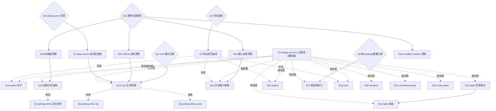

# Existing Components Improvement Roadmap

> Last Updated: 2026-06-21
> Source: `docs/components/existing-components-improvement-analysis.md`（v2 分析报告）、`docs/components/amis-baseline-matrix.md`
> 关联：`roadmap.md`（新增组件，独立）、`mobile-roadmap.md`（移动端响应式，独立）

## Purpose

本文是**已实现组件（`status: runtime`）能力改进**的全局状态索引，与 `roadmap.md`（新增组件）互补不重叠。

- `roadmap.md` 管 `targetContract → runtime`（新组件落地）
- 本文管 `runtime → 功能补齐 / 命名规范化 / 契约漂移修复`（现有组件改进）
- `mobile-roadmap.md` 管现有组件的响应式改进（同组件同属性 + 响应式实现）

**可标记单位是工作项（work item），不是单个组件。** 每个工作项 = 一个 execution plan 的合理交付范围。根据本文拟制 plan 时，一个 plan 对应一个或多个工作项；**plan 通过 closure audit 后，必须把对应工作项在 Phase Status 标记为 `done`**。

**本文是编排层，不是逐字段契约说明。** 组件契约看 `docs/components/<type>/design.md`；缺口分析看 `existing-components-improvement-analysis.md`；逐组件明细看其附录。

## 设计原则（裁决缺口的准绳）

改进必须遵循 Flux 设计原则（详见分析报告 §0.2）：

1. **不以 amis 为标尺** — amis 仅参考之一，坏设计不引入
2. **核心已简化** — 不需要 amis 的 `visibleOn`/`hiddenOn`/`disabledOn` 散落条件属性，统一 `when`
3. **命名标准化 + shadcn/ui 对齐** — 新字段用 shadcn 命名（`variant` 非 `level`、option `{label,value}`、`clearable`/`searchable` 明确布尔）
4. **请求下沉** — 不在组件开 `api`/`initFetch`/`interval` 短路径；请求走 data-source + action
5. **前端不做导出** — CSV/Excel 是后台职责
6. **chart 用 recharts** — echarts 过大，不采纳 echarts config 透传/扩展/geo

明确不采纳清单见分析报告 §5。

## Phase Status

> **全文件唯一动态状态区。** 状态流转：draft review 通过 → `todo` 改 `planned`；closure audit 通过 → `planned` 改 `done`（不得提前）。

- E0a 输入校验漂移修复: `done`
- E0b 树级联漂移修复: `done`
- E0c CRUD 选择漂移修复: `done`
- E0d condition-builder 漂移修复: `todo`
- X3 命名规范基线（naming-conventions.md）: `todo`
- X5 design.md Flux 决策表（P0/P1 硬前置）: `todo`
- E1a select 能力补齐: `todo`
- E1b table 列宽与聚合: `todo`
- E1c table 高级能力: `todo`
- E1d crud 数据生命周期: `todo`
- E2a 文本输入增强: `todo`
- E2a-bis password reveal: `todo`
- E2b textarea 自动高度: `todo`
- E2c checkbox-group 选择增强: `todo`
- E2d 树族异步与级联: `todo`
- E2e button 能力补齐: `todo`
- E2f 表面族统一收口: `todo`
- E2g form shell 增强: `todo`
- E2h code-editor diff + 语言: `todo`
- X1 doAction 命令族统一: `todo`
- X2 可阻止事件: `todo`
- X4 data-source 请求层增强: `todo`
- E3 P2 体验完善（按需启动）: `todo`

## Status Values

| Status    | 含义                                     |
| --------- | ---------------------------------------- |
| `done`    | 工作项全部交付且 plan 通过 closure audit |
| `planned` | 已有 execution plan，正在或等待实现      |
| `todo`    | 尚未开始                                 |

## Work Items

> 每个工作项标注：涉及组件、依赖、需更新的 design.md（**design 文档更新是每个工作项的硬性子任务**）、Reuse。

### 第 0 批 — 契约漂移修复（正确性，最高优先）

> 门槛：Q3（每个漂移字段补实现/删/deprecate 裁决）。

| Work item                          | 组件                      | 依赖 | design.md 更新                                                                                                                      | Reuse                        |
| ---------------------------------- | ------------------------- | ---- | ----------------------------------------------------------------------------------------------------------------------------------- | ---------------------------- |
| **E0a** 输入校验漂移修复           | input-text/email/password | Q3   | `input-text/design.md`（修 §2 谎称"已实现 maxLength/pattern"；补 Flux 决策表）、`input-email/design.md`、`input-password/design.md` | field validation contributor |
| **E0b** 树级联漂移修复             | input-tree/tree-select    | Q3   | `input-tree/design.md`、`tree-select/design.md`（cascade 父子传播+indeterminate 契约；showIcon/showOutline 实现或删）               | tree-options 模型            |
| **E0c** CRUD 选择漂移修复          | crud                      | Q3   | `crud/design.md`（keepOnPageChange/maxSelectionLength/maxKeepSelectionLength/checkableWhen 消费契约）                               | useTableSelection            |
| **E0d** condition-builder 漂移修复 | condition-builder         | Q3   | `condition-builder/design.md`（showIf/selectMode/formulas 三态：实现契约 or 删字段）                                                | condition-builder types      |

### 横切前置项

| Work item                                    | 组件       | 依赖 | design.md 更新                               | 说明                                                                                                                |
| -------------------------------------------- | ---------- | ---- | -------------------------------------------- | ------------------------------------------------------------------------------------------------------------------- |
| **X3** 命名规范基线                          | 全部       | Q1   | 新建 `docs/references/naming-conventions.md` | shadcn 对齐的属性命名基线；后续所有改进项新增字段必须过此审查                                                       |
| **X5** design.md Flux 决策表（P0/P1 硬前置） | P0/P1 组件 | X3   | 14 个 P0/P1 组件 design.md 补"Flux 决策表"节 | 参考 `input-number/design.md:13-31` 范本，但改为 Flux 决策主语（列：能力/采纳/不采纳/理由）。**E1/E2 实现的硬前置** |

### 第 1 批 — P0 核心选择与数据

> 门槛：Q1（命名基线）、X3、X5。

| Work item                 | 组件   | 依赖                | design.md 更新                                                                                                                           | Reuse                           |
| ------------------------- | ------ | ------------------- | ---------------------------------------------------------------------------------------------------------------------------------------- | ------------------------------- |
| **E1a** select 能力补齐   | select | X3、X5、Q2          | `select/design.md`（搜索/多选/clearable/虚拟滚动/分组契约；shadcn Combobox 命名；不采纳 amis selectMode/joinValues/extractValue 的理由） | @nop-chaos/ui Combobox          |
| **E1b** table 列宽与聚合  | table  | X5                  | `table/design.md`（列宽 resize/sticky header/聚合行/单元格合并 Flux 决策表）                                                             | table-renderer                  |
| **E1c** table 高级能力    | table  | E1b、X5             | `table/design.md`（树表/行拖拽/多列排序/多级表头/copyable 单元格）                                                                       | table-renderer                  |
| **E1d** crud 数据生命周期 | crud   | E0c、X4、X5、Q2、Q5 | `crud/design.md`（轮询刷新走 data-source/可折叠查询区/无限滚动/cards-list 模式契约）                                                     | data-source、主 roadmap W1c/W2a |

### 第 2 批 — P1 表单与表面

| Work item                       | 组件                        | 依赖        | design.md 更新                                                                                                                                    | Reuse                                                               |
| ------------------------------- | --------------------------- | ----------- | ------------------------------------------------------------------------------------------------------------------------------------------------- | ------------------------------------------------------------------- |
| **E2a** 文本输入增强            | input-text/email/password   | E0a、X3、X5 | `input-text/design.md`（prefix/suffix/clearable/trimContents/showCounter/native maxLength；shadcn Input 命名）                                    | @nop-chaos/ui Input                                                 |
| **E2a-bis** password reveal     | input-password              | E2a         | `input-password/design.md`（revealPassword 显示切换契约）                                                                                         | ui Input                                                            |
| **E2b** textarea 自动高度       | textarea                    | X5          | `textarea/design.md`（minRows/maxRows/showCounter 契约）                                                                                          | ui Textarea                                                         |
| **E2c** checkbox-group 选择增强 | checkbox-group              | X5          | `checkbox-group/design.md`（checkAll+半选+max/min selected+per-option disabled 契约）                                                             | ui Checkbox                                                         |
| **E2d** 树族异步与级联          | input-tree/tree-select/tree | E0b、X5     | `input-tree/design.md`、`tree-select/design.md`、`tree/design.md`（异步懒加载/远程搜索/虚拟滚动契约）                                             | tree-options                                                        |
| **E2e** button 能力补齐         | button                      | X3、X5      | `button/design.md`（icon/loading/tooltip/block/active 契约；shadcn Button 命名；不采纳 amis level/hotKey/countDown/isMenuItem/actionType 的理由） | ui Button、Tooltip                                                  |
| **E2f** 表面族统一收口          | dialog/drawer               | X5、Q5      | `dialog/design.md`、`drawer/design.md`（closeOnEsc/size/width-height/header-footer region 契约；修 drawer closeOnOutside 不对称）                 | @nop-chaos/ui Dialog/Drawer；与 roadmap.md Ongoing surface 合并归属 |
| **E2g** form shell 增强         | form                        | X3、X5      | `form/design.md`（columnCount/inline/submitOnChange/preventEnterSubmit/autoFocus/scrollToFirstError/static 预览/rules 组合校验契约）              | form runtime                                                        |
| **E2h** code-editor diff + 语言 | code-editor                 | X5          | `code-editor/design.md`（diff 模式/语言扩展/editorDidMount 契约）                                                                                 | flux-code-editor                                                    |

### 横切工作项

| Work item                     | 组件         | 依赖 | design.md 更新                                                               | 说明                                             |
| ----------------------------- | ------------ | ---- | ---------------------------------------------------------------------------- | ------------------------------------------------ |
| **X1** doAction 命令族统一    | 全部输入控件 | X3   | 相关输入控件 design.md 补 `component:clear/reset/focus` 契约                 | 按 Flux component:\* 句柄规范                    |
| **X2** 可阻止事件             | 全部交互控件 | X3   | 事件系统设计文档补 preventDefault 语义                                       | 按 Flux 事件系统设计，不照搬 amis renderer event |
| **X4** data-source 请求层增强 | data-source  | Q6   | `data-source/design.md`（sendOn/initFetch gate/生命周期事件契约；ws 低优先） | data-source runtime                              |

### 第 3 批 — P2 体验完善（按需启动）

启动任一项前需先确认其 design.md 决策表（X5 扩展到该组件）。涉及：flex 枚举扩展（`flex/design.md`）、page aside（`page/design.md`）、tabs per-tab badge/icon（`tabs/design.md`）、input-number 长按步进（`input-number/design.md`）、tree 选择/拖拽/搜索（`tree/design.md`）、array-editor/key-value min/max+reorder（`array-editor/design.md`、`key-value/design.md`）、condition-builder formula（`condition-builder/design.md`）、text 事件/copyable/maxLine（`text/design.md`）、icon schema size/color（`icon/design.md`）、dynamic-renderer initFetch gate（`dynamic-renderer/design.md`）、radio-group/checkbox/switch trueValue-falseValue（对应 design.md）、chart minor recharts 增强（`chart/design.md`）。

## Dependency Graph

## Platform Reuse

改进现有组件时**不得重建**以下已提供的能力：

| 能力                                     | 提供方                                                                                        |
| ---------------------------------------- | --------------------------------------------------------------------------------------------- |
| 通用 renderer 装配                       | `flux-react` renderer-runtime                                                                 |
| 表单运行时 / validation / field metadata | `flux-runtime`                                                                                |
| UI 组件库                                | `@nop-chaos/ui`（Button/Input/Select/Combobox/Dialog/Table/Card/Tooltip 等）；**禁止裸 HTML** |
| 请求层                                   | `data-source` + action graph（**不在组件开 api 短路径**）                                     |
| 表面 runtime                             | `SurfaceRuntime`（dialog/drawer 共享）                                                        |
| 树 option 模型                           | `tree-options`（input-tree/tree-select/tree 共享）                                            |

## Cross-Cutting

| 关注点         | 说明                                                                                          |
| -------------- | --------------------------------------------------------------------------------------------- |
| design.md 同步 | **每个工作项的硬性子任务**：实现前先更新对应 design.md 的 Flux 决策表（X5），实现后保持一致   |
| 命名审查       | 每个新增字段必须过 X3 命名规范基线（shadcn 对齐）                                             |
| 回归测试       | 每个改进配 focused 单测；契约漂移修复必须配验证字段生效的测试                                 |
| Owner-doc 同步 | 工作项关闭时更新 `amis-baseline-matrix.md`（如 retained 决策变化）与 `examples.manifest.json` |
| Dev log        | 每次实现后更新 `docs/logs/{year}/`                                                            |
| 不采纳记录     | 拒绝的 amis 能力写入对应 design.md 的 Flux 决策表"不采纳"行 + 理由（不只在分析报告 §5）       |

## Rule

- 本文档是状态索引和粗粒度工作项划分，不是 execution plan。
- **本文档是人与 AI 的对齐点**：工作项的增删、拆分、优先级重排需人确认。AI 按既定顺序取第一个 `todo` 工作项执行，不重新仲裁优先级、不跳过、不凭空新增工作项。
- **plan 由 AI 自动拟制和执行**；plan 质量靠 closure audit 兜底。
- **可标记单位是工作项**（E0a…E2h、X1…X5），不是批。批只是优先级分组。
- AI 可自主推进工作项状态（`todo`→`planned`→`done`），基于 plan 完成的客观事实；但工作项本身的增删/重排需人确认。
- **plan 通过 closure audit 后，必须把对应工作项在 Phase Status 标记为 `done`**。
- 不得在 closure audit 通过前把工作项标为 `done`。
- **design.md 更新是每个工作项的硬性子任务**：先写契约（Flux 决策表）再实现，是 Flux 文档纪律。
- 不采纳的 amis 能力必须记入对应组件 design.md（不只在分析报告），避免后续重复评估。
- 跨 roadmap 重叠（E1d ↔ W1c/W2a、E2d ↔ W4c、E2f ↔ surface Ongoing）归属见 Q5 裁决。
