# Mobile Roadmap（移动端响应式 + 移动端原生组件）

> Last Updated: 2026-06-21
> Source: `docs/components/existing-components-improvement-analysis.md` §8
> 关联：`roadmap.md`（新增组件）、`existing-components-improvement-roadmap.md`（桌面端组件改进）— 三者独立不重叠

## Purpose

本文是**移动端能力**的全局状态索引，包含两部分：

1. **现有组件移动端响应式改进**：同组件同属性 + 响应式实现
2. **移动端原生交互组件**：桌面端无等价物、依赖触摸手势的专用组件，归属 `flux-renderers-mobile` 包

## 架构决策（已确认）

### 响应式改进原则

**移动端 = 同一组件、同一套属性、响应式实现。** 沿用 shadcn/ui 思路：

- **不引入 `mobileUI` 根标志位**（amis 的双实现是坏设计，不采纳）
- **不新建 `*-mobile` 组件**（如不建 `select-mobile`）
- 组件内部用 **Tailwind 响应式断点** + **必要的运行时分支**自适应：
  - 小屏 Select/Tree-select/Combobox → bottom-sheet（底部抽屉）而非下拉
  - 小屏 Dialog → 全屏覆盖
  - 小屏 Table → 卡片堆叠（复用 `responsive.mode: 'expand'` 已有机制）
  - 小屏 Tabs → 横向滚动 + swipe 手势
  - 触摸交互：增大点击区域、手势支持、软键盘弹起视口处理

### 移动端原生组件包归属

桌面端无等价物的移动端原生交互组件（`pull-refresh`、`infinite-scroll`、`swipe-cell`、`countdown`、`notice-bar`）统一归属 `@nop-chaos/flux-renderers-mobile` 包。理由：

- 这些组件是**移动端原生交互模式**，不是桌面组件的响应式变体
- 依赖 `useTouch` Hook、手势追踪等移动端基础设施
- 纯桌面端项目不需要这些依赖，独立包实现依赖隔离
- 语义清晰，移动端能力 opt-in

`useTouch` Hook 放在 `flux-renderers-mobile/src/hooks/use-touch.ts`，从该包公共导出。

**因此本 roadmap 装的是"逐组件响应式审计与改进" + "移动端原生组件"，与组件改进 roadmap 内容不重叠**（后者管桌面端功能/命名/契约）。

## 范围边界

| 装                                                                                 | 不装                                       |
| ---------------------------------------------------------------------------------- | ------------------------------------------ |
| 逐组件小屏断点行为审计与改进                                                       | 新建 `*-mobile` 组件（如 `select-mobile`） |
| 触摸交互适配（手势、点击区域、软键盘）                                             | `mobileUI` 标志位                          |
| 响应式布局（断点、容器查询）                                                       | 桌面端功能补齐（归改进 roadmap）           |
| 必要的运行时分支（bottom-sheet/fullscreen/card-stack）                             | 新的非移动原生组件（归主 roadmap）         |
| 移动端原生交互组件（pull-refresh/infinite-scroll/swipe-cell/countdown/notice-bar） | —                                          |

## Phase Status

> **全文件唯一动态状态区。** 状态流转同其他 roadmap。

- M0 响应式基线与断点规范: `done`
- M1 高频交互控件响应式（select/tree/table/dialog/tabs）: `todo`
- M2 表单控件触摸适配（input/textarea/checkbox/switch/button）: `todo`
- M3 容器与布局响应式（page/flex/container/grid）: `todo`
- M4 数据展示响应式（crud/cards/list/chart）: `todo`
- M5 移动端原生组件（pull-refresh/infinite-scroll/swipe-cell/countdown/notice-bar）: `todo`

## Status Values

| Status    | 含义                                     |
| --------- | ---------------------------------------- |
| `done`    | 工作项全部交付且 plan 通过 closure audit |
| `planned` | 已有 execution plan，正在或等待实现      |
| `todo`    | 尚未开始                                 |

### M0 衍生交付物

以下文档是 M0 的同步产出：

| 文档                           | 位置                                        |
| ------------------------------ | ------------------------------------------- |
| `useTouch` Hook 设计           | `docs/components/use-touch/design.md`       |
| `PullRefresh` 组件设计         | `docs/components/pull-refresh/design.md`    |
| `InfiniteScroll` 组件设计      | `docs/components/infinite-scroll/design.md` |
| `BottomSheet` 移动端浮层设计   | `docs/components/bottom-sheet/design.md`    |
| Page 响应式章节                | 已更新 `docs/components/page/design.md` §13 |
| surface-owner BottomSheet 归类 | 已更新 `docs/architecture/surface-owner.md` |
| 主 roadmap W1d                 | 已更新 `docs/components/roadmap.md`         |

## Work Items

### M0 — 响应式基线与断点规范（前置）✅

| Work item | 内容                                                                                                                                                                                     | 涉及 | design.md 更新                       |
| --------- | ---------------------------------------------------------------------------------------------------------------------------------------------------------------------------------------- | ---- | ------------------------------------ |
| **M0** ✅ | 确立 Flux 响应式断点基线（对齐 shadcn/Tailwind 默认 sm/md/lg）、触摸目标尺寸规范、bottom-sheet/fullscreen 等 mobile surface 约定；产出 `docs/architecture/mobile-responsive-baseline.md` | 全局 | 基线文档已完成；组件设计文档同步产出 |

> M0 已完成。M1-M4 无此硬前置阻塞。

### M1 — 高频交互控件响应式

| Work item | 组件               | 行为                                                                               | design.md 更新                                           | 依赖                 |
| --------- | ------------------ | ---------------------------------------------------------------------------------- | -------------------------------------------------------- | -------------------- |
| **M1a**   | select/tree-select | 小屏 bottom-sheet 选项面板（复用 surface runtime + `@nop-chaos/ui` Sheet）         | `select/design.md`、`tree-select/design.md` 增响应式小节 | M0、改进 roadmap E1a |
| **M1b**   | table              | 小屏卡片堆叠（复用 `responsive.mode:'expand'`；评估是否需更丰富 mobile card 布局） | `table/design.md` 增响应式小节                           | M0、改进 roadmap E1b |
| **M1c**   | dialog/drawer      | 小屏 Dialog 全屏覆盖；Drawer 小屏行为统一                                          | `dialog/design.md`、`drawer/design.md` 增响应式小节      | M0、改进 roadmap E2f |
| **M1d**   | tabs               | 小屏横向滚动 + swipe 手势                                                          | `tabs/design.md` 增响应式小节                            | M0                   |

### M2 — 表单控件触摸适配

| Work item | 组件                                            | 行为                                             | design.md 更新                  | 依赖 |
| --------- | ----------------------------------------------- | ------------------------------------------------ | ------------------------------- | ---- |
| **M2a**   | input-text/email/password/textarea/input-number | 增大触摸目标、软键盘弹起视口处理、合适 inputmode | 各 input design.md 增响应式小节 | M0   |
| **M2b**   | checkbox/checkbox-group/radio-group/switch      | 增大触摸目标、小屏列表式布局                     | 各 design.md 增响应式小节       | M0   |
| **M2c**   | button                                          | 触摸目标尺寸、小屏 block 全宽                    | `button/design.md` 增响应式小节 | M0   |

### M3 — 容器与布局响应式

| Work item | 组件                | 行为                                                                  | design.md 更新                                            | 依赖                              |
| --------- | ------------------- | --------------------------------------------------------------------- | --------------------------------------------------------- | --------------------------------- |
| **M3a**   | page                | 小屏隐藏/折叠 aside（待改进 roadmap page aside 落地）、toolbar 响应式 | `page/design.md`                                          | M0、改进 roadmap page aside       |
| **M3b**   | flex/container/grid | 断点切换 direction/wrap、容器查询                                     | `flex/design.md`、`container/design.md`、`grid/design.md` | M0、主 roadmap W3a（grid 未落地） |

### M4 — 数据展示响应式

| Work item | 组件       | 行为                                    | design.md 更新                      | 依赖                   |
| --------- | ---------- | --------------------------------------- | ----------------------------------- | ---------------------- |
| **M4a**   | crud       | 小屏 toolbar 简化、查询区折叠、分页简化 | `crud/design.md`                    | M0、改进 roadmap E1d   |
| **M4b**   | cards/list | 小屏单列、触摸滚动                      | `cards/design.md`、`list/design.md` | M0、主 roadmap W1c/W2a |
| **M4c**   | chart      | 小屏尺寸自适应、图例位置                | `chart/design.md`                   | M0                     |

### M5 — 移动端原生组件（`flux-renderers-mobile` 包）

| Work item | 组件            | 行为                                        | design.md 更新                          | 依赖 |
| --------- | --------------- | ------------------------------------------- | --------------------------------------- | ---- |
| **M5a**   | pull-refresh    | 下拉刷新容器，状态机驱动                    | `pull-refresh/design.md`（已有初稿）    | M0   |
| **M5b**   | infinite-scroll | 无限滚动容器，IntersectionObserver 触底加载 | `infinite-scroll/design.md`（已有初稿） | M0   |
| **M5c**   | swipe-cell      | 左滑露出操作按钮，手势驱动                  | `swipe-cell/design.md`（新建）          | M0   |
| **M5d**   | countdown       | 倒计时展示，支持格式化模板和结束回调        | `countdown/design.md`（新建）           | —    |
| **M5e**   | notice-bar      | 滚动通知栏，支持滚动动画和点击交互          | `notice-bar/design.md`（新建）          | —    |

## Dependency Graph

```mermaid
graph TD
    M0["M0 响应式基线与断点规范"]
    M1a["M1a select/tree-select"]
    M1b["M1b table"]
    M1c["M1c dialog/drawer"]
    M1d["M1d tabs"]
    M2a["M2a input 族"]
    M2b["M2b checkbox/radio/switch"]
    M2c["M2c button"]
    M3a["M3a page"]
    M3b["M3b flex/container/grid"]
    M4a["M4a crud"]
    M4b["M4b cards/list"]
    M4c["M4c chart"]
    M5a["M5a pull-refresh"]
    M5b["M5b infinite-scroll"]
    M5c["M5c swipe-cell"]
    M5d["M5d countdown"]
    M5e["M5e notice-bar"]

    M0 --> M1a & M1b & M1c & M1d & M2a & M2b & M2c & M3a & M3b & M4a & M4b & M4c & M5a & M5b & M5c
```

## Cross-Cutting

| 关注点                  | 说明                                                                                                                                |
| ----------------------- | ----------------------------------------------------------------------------------------------------------------------------------- |
| design.md 同步          | 每个组件响应式改进需在其 design.md 增"响应式行为"小节，引用 M0 基线                                                                 |
| 与改进 roadmap 协调     | 桌面端契约（改进 roadmap 的 design.md 决策表）稳定后再做响应式，避免返工                                                            |
| 不重复造 mobile surface | bottom-sheet 等复用 surface runtime + `@nop-chaos/ui` Sheet，不新建独立体系                                                         |
| **Playground 示例**     | **每个工作项（M1-M5）完成后，必须在 `apps/playground/src/` 下有响应式示例页面，展示移动端/桌面端切换效果**                          |
| **E2E 测试**            | **每个工作项完成后，必须在 `tests/e2e/` 下有对应 e2e 测试，使用 Playwright `setViewportSize` 切换视口验证响应式行为，不靠截图诊断** |
| 单测                    | 运行时分支（如 bottom-sheet 切换）配 focused 单测验证分支逻辑                                                                       |
| **M5 包归属**           | **pull-refresh/infinite-scroll/swipe-cell/countdown/notice-bar 归属 `@nop-chaos/flux-renderers-mobile`，不放入 basic/content/data** |

## Rule

- 本文档是状态索引，不是 execution plan。
- **工作项增删/优先级重排需人确认**；AI 按既定顺序执行首个 `todo`，不重新仲裁。
- **plan 通过 closure audit 后标记 `done`**，不得提前。
- M0 是 M1-M5 硬前置。
- 严格遵循"同组件同属性 + 响应式实现"，任何工作项若演变为新建 `*-mobile` 组件（如 `select-mobile`）或引入 mobileUI 标志位，必须回到人确认。
- M5 移动端原生组件（pull-refresh/infinite-scroll/swipe-cell/countdown/notice-bar）归属 `flux-renderers-mobile` 包，这是独立于响应式改进的组件新增，遵循主 roadmap 的 renderer 实现规范。
- 跨 roadmap：本 roadmap 不做桌面端功能（归改进 roadmap）、不做非移动原生的新组件（归主 roadmap）。
