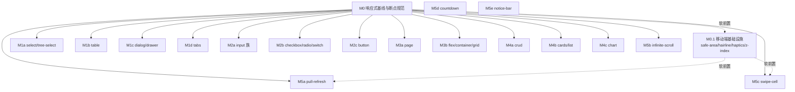

# Mobile Roadmap（移动端响应式 + 移动端原生组件）

> Last Updated: 2026-06-24（plan 7 design.md ↔ code 契约对账收口：MM-17/18/19/20/21，含 infinite-scroll 滚动祖先 IO root 实装、notice-bar/pull-refresh 文档与代码收敛）
> Source: `docs/components/existing-components-improvement-analysis.md` §8
> 关联：`roadmap.md`（新增组件）、`existing-components-improvement-roadmap.md`（桌面端组件改进）— 三者独立不重叠

## Purpose

本文是**移动端能力**的全局状态索引，包含两部分：

1. **现有组件移动端响应式改进**：同组件同属性 + 响应式实现
2. **移动端原生交互组件**：桌面端无等价物、依赖触摸手势的专用组件，归属 `flux-renderers-mobile` 包

## Current Baseline

> **截至 2026-06-22 的实现事实（read-only 核查结论，不是计划）：**

| 维度                                  | 状态                                                                                                                                                                                                                                                                                                                                                                                                                                                                                                                                                                                                                                                                                                                                                                                                                                                                                                                                                                                    |
| ------------------------------------- | --------------------------------------------------------------------------------------------------------------------------------------------------------------------------------------------------------------------------------------------------------------------------------------------------------------------------------------------------------------------------------------------------------------------------------------------------------------------------------------------------------------------------------------------------------------------------------------------------------------------------------------------------------------------------------------------------------------------------------------------------------------------------------------------------------------------------------------------------------------------------------------------------------------------------------------------------------------------------------------- |
| `@nop-chaos/flux-renderers-mobile` 包 | **5 个组件已落地**（pull-refresh/infinite-scroll/swipe-cell/countdown/notice-bar 实现 + focused 单测 + `mobileRendererDefinitions` + `registerMobileRenderers` + playground `/mobile-components` 演示页 + e2e 验证）。M5 工作项已完成。                                                                                                                                                                                                                                                                                                                                                                                                                                                                                                                                                                                                                                                                                                                                                 |
| M0 响应式基线                         | `done`（文档基线 + M0.1 基础设施代码已落地，见下）。                                                                                                                                                                                                                                                                                                                                                                                                                                                                                                                                                                                                                                                                                                                                                                                                                                                                                                                                    |
| M0.1 基础设施代码                     | `done`（safe-area/hairline/haptics/z-index 栈已落地于 `packages/ui/src/`，详见 `docs/plans/2026-06-22-2057-1-m01-mobile-infrastructure-plan.md`）。                                                                                                                                                                                                                                                                                                                                                                                                                                                                                                                                                                                                                                                                                                                                                                                                                                     |
| M1–M4 实现进度                        | **M1 done**（select/tree-select bottom-sheet、dialog 全屏、drawer 底部、tabs swipe、table expand 卡片，见 `docs/plans/2026-06-22-2335-1-m1-high-frequency-controls-responsive-plan.md`）。**M2 done**（input/textarea/input-number inputmode + font-size ≥16px + focus scrollIntoView、checkbox/radio/switch 触摸目标 ≥44px + nop-haptic + 小屏纵列、button 触摸目标 ≥44px，见 `docs/plans/2026-06-22-2335-2-m2-form-controls-touch-adaptation-plan.md`）。**M3 done**（page aside 折叠/触发式 Sheet + toolbar 堆叠 + footer fixed VisualViewport、§14 5 类骨架模板、flex/container per-breakpoint direction/wrap，见 `docs/plans/2026-06-23-0410-1-m3-container-and-layout-responsive-plan.md`；grid 响应式延后 W3a successor）。**M4 done**（M4a crud 小屏 toolbar 简化 + 查询折叠 + 分页简化、M4c chart 容器宽度 ResizeObserver 高度 clamp + 图例换行，见 `docs/plans/2026-06-23-0410-2-m4-data-display-responsive-plan.md`；M4b cards/list 延后 W1c/W2a successor）。M5 已 `done`。 |
| design.md 立约                        | ✅ 已存在：`pull-refresh`/`infinite-scroll`/`swipe-cell`/`countdown`/`notice-bar`/`bottom-sheet`/`use-touch` 共 7 份（99~152 行），属**文档先行**，现在代码已对齐契约。                                                                                                                                                                                                                                                                                                                                                                                                                                                                                                                                                                                                                                                                                                                                                                                                                 |

**读法约定**：本文中"已有初稿/design.md 已立约"一律指**契约文档**已写，不是代码已实现。代码是否落地只看本表，不看 design.md 是否存在。

## 架构决策（已确认）

### 响应式改进原则

**移动端 = 同一组件、同一套属性、响应式实现。** 沿用 shadcn/ui 思路：

- **不引入 `mobileUI` 根标志位**（amis 的双实现是坏设计，不采纳）
- **不新建 `*-mobile` 组件**（如不建 `select-mobile`）
- 组件内部用 **Tailwind 响应式断点** + **必要的运行时分支**自适应：
  - 小屏 Select/Tree-select/Combobox → bottom-sheet（底部抽屉）而非下拉
  - 小屏 Dialog → 全屏覆盖
  - 小屏 Table → 卡片堆叠（复用 `responsive.mode: 'expand'` 已有机制）
  - 小屏 Tabs → 横向滚动 + swipe 手势
  - 触摸交互：增大点击区域、手势支持、软键盘弹起视口处理

### 移动端原生组件包归属

桌面端无等价物的移动端原生交互组件（`pull-refresh`、`infinite-scroll`、`swipe-cell`、`countdown`、`notice-bar`）统一归属 `@nop-chaos/flux-renderers-mobile` 包。理由：

- 这些组件是**移动端原生交互模式**，不是桌面组件的响应式变体
- 依赖 `useTouch` Hook、手势追踪等移动端基础设施
- 纯桌面端项目不需要这些依赖，独立包实现依赖隔离
- 语义清晰，移动端能力 opt-in

`useTouch` Hook 放在 `flux-renderers-mobile/src/hooks/use-touch.ts`，从该包公共导出。

**因此本 roadmap 装的是"逐组件响应式审计与改进" + "移动端原生组件"，与组件改进 roadmap 内容不重叠**（后者管桌面端功能/命名/契约）。

## 范围边界

| 装                                                                                 | 不装                                       |
| ---------------------------------------------------------------------------------- | ------------------------------------------ |
| 逐组件小屏断点行为审计与改进                                                       | 新建 `*-mobile` 组件（如 `select-mobile`） |
| 触摸交互适配（手势、点击区域、软键盘）                                             | `mobileUI` 标志位                          |
| 响应式布局（断点、容器查询）                                                       | 桌面端功能补齐（归改进 roadmap）           |
| 必要的运行时分支（bottom-sheet/fullscreen/card-stack）                             | 新的非移动原生组件（归主 roadmap）         |
| 移动端原生交互组件（pull-refresh/infinite-scroll/swipe-cell/countdown/notice-bar） | —                                          |

## Phase Status

> **全文件唯一动态状态区。** 状态流转同其他 roadmap。
>
> **可标记单位是 work item（M0.1/M1/M2/M3/M4/M5），不是单组件子项。** 每个 work item = 一个 execution plan 的合理交付范围，一个 plan 可覆盖该 work item 下的多个组件子项。plan 通过 closure audit 后，整组 work item 标 `done`。**禁止为单个 M5a/M5b… 各开独立 plan**（违反 plan guide §22，会重蹈 micro-plan 覆辙）。子项（M1a/M1b…/M5e）是同一 work item 的拆解说明，不是独立打勾单位。

- M0 响应式基线与断点规范: `done`（含基础设施代码，见 M0.1）
- M0.1 移动端基础设施（safe-area/hairline/haptics/z-index 栈，4 子项，建议 1 plan 4 phase）: `done`（`docs/plans/2026-06-22-2057-1-m01-mobile-infrastructure-plan.md`）
- M1 高频交互控件响应式（select/tree/table/dialog/tabs，5 子项 M1a~M1d）: `done`（`docs/plans/2026-06-22-2335-1-m1-high-frequency-controls-responsive-plan.md`）
- M2 表单控件触摸适配（input/textarea/checkbox/switch/button，3 子项 M2a~M2c）: `done`（`docs/plans/2026-06-22-2335-2-m2-form-controls-touch-adaptation-plan.md`）
- M3 容器与布局响应式（page/flex/container/grid，2 子项 M3a~M3b）: `done`（`docs/plans/2026-06-23-0410-1-m3-container-and-layout-responsive-plan.md`；grid 延后到主 roadmap W3a successor）
- M4 数据展示响应式（crud/cards/list/chart，3 子项 M4a~M4c）: `done`（M4a/M4c 收口；M4b cards/list 延后 W1c/W2a successor，见 `docs/plans/2026-06-23-0410-2-m4-data-display-responsive-plan.md`）
- M5 移动端原生组件（pull-refresh/infinite-scroll/swipe-cell/countdown/notice-bar，5 子项 M5a~M5e，共用 useTouch Hook，建议 1 plan）: `done`

## Status Values

| Status     | 含义                                                                                          |
| ---------- | --------------------------------------------------------------------------------------------- |
| `done`     | 工作项全部交付且 plan 通过 closure audit                                                      |
| `planned`  | 已有 execution plan，正在或等待实现                                                           |
| `todo`     | 尚未开始                                                                                      |
| `proposed` | 已有提案（含 design.md 立约 / 工作项定义），**待人确认后才可改 `todo`**；AI 不得自行转 `todo` |

### M0 衍生交付物

以下文档是 M0 的同步产出：

| 文档                           | 位置                                        |
| ------------------------------ | ------------------------------------------- |
| `useTouch` Hook 设计           | `docs/components/use-touch/design.md`       |
| `PullRefresh` 组件设计         | `docs/components/pull-refresh/design.md`    |
| `InfiniteScroll` 组件设计      | `docs/components/infinite-scroll/design.md` |
| `BottomSheet` 移动端浮层设计   | `docs/components/bottom-sheet/design.md`    |
| Page 响应式章节                | 已更新 `docs/components/page/design.md` §13 |
| surface-owner BottomSheet 归类 | 已更新 `docs/architecture/surface-owner.md` |
| 主 roadmap W1d                 | 已更新 `docs/components/roadmap.md`         |

## Work Items

### M0 — 响应式基线与断点规范（前置）✅

| Work item | 内容                                                                                                                                                                                     | 涉及 | design.md 更新                       |
| --------- | ---------------------------------------------------------------------------------------------------------------------------------------------------------------------------------------- | ---- | ------------------------------------ |
| **M0** ✅ | 确立 Flux 响应式断点基线（对齐 shadcn/Tailwind 默认 sm/md/lg）、触摸目标尺寸规范、bottom-sheet/fullscreen 等 mobile surface 约定；产出 `docs/architecture/mobile-responsive-baseline.md` | 全局 | 基线文档已完成；组件设计文档同步产出 |

> M0 已完成。M1-M4 无此硬前置阻塞。

### M0.1 — 移动端基础设施 ✅

> 来源：`docs/analysis/2026-06-21-flux-vs-vant-full-comparison.md` §3 基础设施核查发现：safe-area 辅助类 / hairline 0.5px 细线 / haptics 触感反馈 / global z-index 栈 在当前代码库**均未实现**（仅 baseline 文档有约定）。这 4 项是移动端体验基本盘，且都不是 schema 层能解决的，必须在 `@nop-chaos/ui` 与 surface-runtime 基础设施层补齐。契约定义见 `docs/architecture/mobile-responsive-baseline.md` §10。
>
> **执行约束**：M0.1 全部子项落在 Protected Area（`packages/ui/src/index.ts` ask-first + styling contract plan-first + surface-runtime plan-first），因此**必须先拟 execution plan 经 draft review 通过后才能动代码**，不能直接 implement。建议**1 个 plan 覆盖 4 个 Phase**（4 项共享同一批 ui 样式契约文件 + 同一次 ui 导出变更，拆多 plan 会重复走 Protected Area 审批）。
>
> **状态（2026-06-22）**：✅ done。Execution plan: `docs/plans/2026-06-22-2057-1-m01-mobile-infrastructure-plan.md`。落地位置：
>
> - safe-area / hairline / haptics 三组 CSS 辅助类 → `packages/ui/src/styles/mobile.css`（经 `index.css` 加载链导出）
> - `nop-haptic` 默认启用 → `packages/ui/src/components/ui/button.tsx`（无条件）、`card.tsx`（条件：传入 `onClick`）
> - global z-index 计数器 → `packages/ui/src/hooks/use-global-z-index.ts`，导出 `useGlobalZIndex` / `setGlobalZIndex` / `nextGlobalZIndex` / `peekGlobalZIndex` / `GLOBAL_Z_INDEX_BASELINE_VALUE`
> - 12 个 overlay 组件 + sonner 完成 z-50 平滑迁移：`dialog`/`alert-dialog`/`drawer`/`sheet`/`popover`/`tooltip`/`hover-card`/`dropdown-menu`/`context-menu`/`combobox`/`select`/`navigation-menu` 从扁平 `z-50` 改为 `useGlobalZIndex()` 计数器取值；`sonner` Toaster 固定 `z-index: 10000`（顶层协调）
> - `docs/architecture/surface-owner.md` 新增 `Global z-index Stack` 章节
> - `docs/architecture/styling-system.md` 新增 `Mobile Infrastructure Helper Classes` 章节
> - playground 演示页：`apps/playground/src/pages/mobile-infrastructure-demo.tsx`（路由 `/mobile-infrastructure`）

| Work item    | 内容                                                                                                                                                                                                                                       | 涉及（Protected Area）                                                                | 依赖 |
| ------------ | ------------------------------------------------------------------------------------------------------------------------------------------------------------------------------------------------------------------------------------------ | ------------------------------------------------------------------------------------- | ---- |
| **M0.1a** ✅ | safe-area 辅助类落地：在 `@nop-chaos/ui` 实现 `nop-safe-top/bottom/left/right`（`env(safe-area-inset-*)`），baseline §2 已立约                                                                                                             | `packages/ui/src/index.ts`（ask-first）                                               | M0   |
| **M0.1b** ✅ | hairline 0.5px 细线工具：在 `@nop-chaos/ui` 或 `tailwind-preset` 提供 `nop-hairline` / `nop-hairline--top/right/bottom/left`（`::after` 伪元素 + transform scale，适配高 DPI），baseline §10 立约                                          | `packages/ui/src/index.ts`（ask-first）+ styling contract（plan-first）               | M0   |
| **M0.1c** ✅ | haptics 触感反馈：定义 `nop-haptic` class（按压 `:active` 反馈，opacity/transition），并让 Button/Card/Cell 等高频可点击控件默认启用                                                                                                       | `packages/ui/src/index.ts`（ask-first）+ styling contract（plan-first）               | M0   |
| **M0.1d** ✅ | global z-index 栈管理：在 surface-runtime 加共享 z-index 栈（dialog/drawer/sheet/toast/popover 共享自增计数器，对齐 Vant `useGlobalZIndex`）；当前所有 overlay 用扁平 `z-50` 存在叠加层级混乱风险；**plan 必须含现有 z-50 平滑迁移 Phase** | surface-runtime（plan-first，`docs/architecture/surface-owner.md` 需补 z-index 章节） | M0   |

> M0.1 是 M1–M5 的**软前置**（虚线依赖）：不硬阻塞现有 `todo` 推进，但 M5 移动端原生组件落地前最好先有 M0.1c（haptics）与 M0.1d（z-index 栈）。

### M1 — 高频交互控件响应式 ✅

> **代码已落地（执行期完成 2026-06-23）**。select/tree-select 小屏 bottom-sheet、dialog 全屏、drawer 底部统一、tabs 横向滚动 + swipe、table expand 卡片堆叠 + 6 份 design.md 响应式小节 + playground 演示页（`/m1-responsive`）+ e2e 全部交付。Execution plan：`docs/plans/2026-06-22-2335-1-m1-high-frequency-controls-responsive-plan.md`。

| Work item  | 组件               | 行为                                                                                                | design.md 更新                                           | 依赖                 |
| ---------- | ------------------ | --------------------------------------------------------------------------------------------------- | -------------------------------------------------------- | -------------------- |
| **M1a** ✅ | select/tree-select | 小屏 bottom-sheet 选项面板（renderer 内部 `useIsMobile()` + `@nop-chaos/ui` Sheet）                 | `select/design.md`、`tree-select/design.md` 增响应式小节 | M0、改进 roadmap E1a |
| **M1b** ✅ | table              | 小屏卡片堆叠（复用 `responsive.mode:'expand'`；mobile card 视觉增强 `nop-hairline` + 触摸 padding） | `table/design.md` 增响应式小节                           | M0、改进 roadmap E1b |
| **M1c** ✅ | dialog/drawer      | 小屏 Dialog 自动全屏（`fullSize: 'viewport'`）；Drawer 小屏 side 视觉层切 bottom                    | `dialog/design.md`、`drawer/design.md` 增响应式小节      | M0、改进 roadmap E2f |
| **M1d** ✅ | tabs               | 小屏横向滚动（`overflow-x-auto` + scrollIntoView）+ swipe 手势（内联 50px 阈值）                    | `tabs/design.md` 增响应式小节                            | M0                   |

### M2 — 表单控件触摸适配 ✅

> **代码已落地（执行期完成 2026-06-23）**。input/textarea/input-number inputmode + font-size ≥16px + focus scrollIntoView、checkbox/radio/switch 触摸目标 ≥44px + nop-haptic + 小屏纵列、button 触摸目标 ≥44px + 3 份 design.md 响应式小节 + playground 演示页（`/m2-touch`）+ e2e 全部交付。Execution plan：`docs/plans/2026-06-22-2335-2-m2-form-controls-touch-adaptation-plan.md`。

| Work item  | 组件                                            | 行为                                                                                                                | design.md 更新                                                                      | 依赖 |
| ---------- | ----------------------------------------------- | ------------------------------------------------------------------------------------------------------------------- | ----------------------------------------------------------------------------------- | ---- |
| **M2a** ✅ | input-text/email/password/textarea/input-number | inputmode 映射（email/tel/search/url + decimal）、font-size ≥16px 防 iOS 缩放（UI text-base）、focus scrollIntoView | `input-text/design.md`、`textarea/design.md`、`input-number/design.md` 增响应式小节 | M0   |
| **M2b** ✅ | checkbox/checkbox-group/radio-group/switch      | 触摸目标 ≥44px（min-h-11）+ nop-haptic；checkbox-group/radio-group 小屏选项 >3 自动纵列（flex-col）                 | `checkbox/design.md`、`switch/design.md` 增响应式小节                               | M0   |
| **M2c** ✅ | button                                          | 触摸目标 ≥44px（default/lg min-h-11，mobile only）；schema block 行为不变（Decision A）                             | `button/design.md` 增响应式小节                                                     | M0   |

### M3 — 容器与布局响应式 ✅

> **代码已落地（执行期完成 2026-06-23）**。M3a page 小屏 aside 折叠/触发式 Sheet 滑出 + toolbar 纵列堆叠 + footer fixed VisualViewport hook（收口 M2/M0.1 deferred）；§14 五类移动端骨架模式（Tabbar/NavBar/ActionBar/SubmitBar/Sticky）playground 演示页（`/m3-layout`）+ e2e；M3b flex/container per-breakpoint direction/wrap 切换（`responsiveDirection`/`responsiveWrap`）+ 3 份 design.md 响应式小节。`grid` 响应式显式延后到主 roadmap W3a successor。Execution plan：`docs/plans/2026-06-23-0410-1-m3-container-and-layout-responsive-plan.md`。

| Work item  | 组件                        | 行为                                                                                                 | design.md 更新                                           | 依赖                                  |
| ---------- | --------------------------- | ---------------------------------------------------------------------------------------------------- | -------------------------------------------------------- | ------------------------------------- |
| **M3a** ✅ | page                        | 小屏折叠 aside（触发式 Sheet 滑出）、toolbar 纵列堆叠、footer fixed VisualViewport；§14 5 类骨架模板 | `page/design.md` §13/§14                                 | M0、改进 roadmap page aside（已落地） |
| **M3b** ✅ | flex/container（grid 延后） | per-breakpoint direction/wrap 切换（Tailwind 响应式类）                                              | `flex/design.md`、`container/design.md`（grid 延后 W3a） | M0、主 roadmap W3a（grid 未落地）     |

#### M3a 移动端页面骨架模式（5 类复合模式，非独立组件）

> 修订（2026-06-21）：早期 mobile-mall analysis 把 Tabbar 等同为 "`Tabs` + 固定定位"，该措辞**不准确**。Tabbar 是**路由级导航**（配 `navigate` action），与 `tabs`（内容切换控件）语义不同。统一决策：这 5 类**不新增独立 renderer**，走 `page.header`/`page.footer` region + 标准 schema 模板，模板见 `docs/components/page/design.md` "移动端骨架模式"章节。

| 模式      | 载体                    | 关键区别 / 实现                                                             | 模板位置                         |
| --------- | ----------------------- | --------------------------------------------------------------------------- | -------------------------------- |
| Tabbar    | `page.footer` region    | **≠ `tabs`**。路由导航：`flex` + `button`（图标+文字）+ `onClick: navigate` | `page/design.md` §移动端骨架模式 |
| NavBar    | `page.header` region    | 返回按钮 `navigate {back:true}` + 居中标题 + 右操作槽                       | 同上                             |
| ActionBar | `page.footer` region    | 图标按钮组 + 大号 CTA（商品详情底部"客服/收藏/加购/购买"）                  | 同上                             |
| SubmitBar | `page.footer` region    | 复选 + 价格展示 + CTA（购物车结算栏）                                       | 同上                             |
| Sticky    | `container` + className | `sticky top-0`，引用 baseline §2 safe-area                                  | 同上                             |

### M4 — 数据展示响应式

> **代码已落地（执行期完成 2026-06-23）**。M4a crud 小屏 toolbar 简化（隐藏 switch-per-page + 纵列堆叠）、查询区默认折叠、分页简化（复用既有 headerBlocks 过滤机制）；M4c chart 用 `ResizeObserver` 测容器宽度，窄屏 height clamp 300 + 图例 `flex-wrap` 换行，`ResizeObserver` 缺席回退固定高度无报错；2 份 design.md 响应式小节 + playground 演示页（`/m4-data`）+ e2e 全部交付。M4b cards/list 因对象未落地（W1c/W2a `todo`）显式延后。附带根因修复：`packages/ui/src/hooks/use-mobile.ts` 改懒初始化消除多余重渲染。Execution plan：`docs/plans/2026-06-23-0410-2-m4-data-display-responsive-plan.md`。

| Work item  | 组件       | 行为                                                                             | design.md 更新                                    | 依赖                   |
| ---------- | ---------- | -------------------------------------------------------------------------------- | ------------------------------------------------- | ---------------------- |
| **M4a** ✅ | crud       | 小屏 toolbar 简化、查询区折叠、分页简化                                          | `crud/design.md` §14                              | M0、改进 roadmap E1d   |
| **M4b**    | cards/list | 小屏单列、触摸滚动（**延后**：cards/list renderer 未落地，转 W1c/W2a successor） | `cards/design.md`、`list/design.md`（待组件落地） | M0、主 roadmap W1c/W2a |
| **M4c** ✅ | chart      | 小屏尺寸自适应（容器宽度 ResizeObserver height clamp）、图例换行                 | `chart/design.md` §13                             | M0                     |

### M5 — 移动端原生组件（`flux-renderers-mobile` 包）✅

> **代码已落地（执行期完成 2026-06-22）**。5 个组件实现 + focused 单测 + `mobileRendererDefinitions` + `registerMobileRenderers` + playground 演示页（`/mobile-components`）+ e2e 验证全部交付。Execution plan：`docs/plans/2026-06-22-2057-2-m5-mobile-native-components-plan.md`。
>
> **异步/状态机正确性加固（2026-06-23，audit remediation plan 1 已完成）**：`docs/plans/2026-06-23-0655-1-mobile-async-and-state-machine-correctness-plan.md` 收敛了 4 个交互类渲染器（pull-refresh/infinite-scroll/swipe-cell/countdown）的异步链路与状态机——MA-01/02/12/13/14/15/16 + MA-20 observer/touchCancel 子项 + OA-05/10/13 共 12 条 finding 全部修复且有 focused 回归测试（包测试 78→101），独立 fresh-session closure audit `approved`。后续 plan 2（契约/marker）、plan 3（UX/a11y/样式）在同批文件上推进。审计来源：`docs/audits/2026-06-22-2039-multi-audit-mobile.md` + `docs/audits/2026-06-22-2039-open-audit-mobile.md`。
>
> **契约诚实性 + markers 门禁加固（2026-06-23，audit remediation plan 2 已完成）**：`docs/plans/2026-06-23-0655-2-mobile-contract-honesty-and-markers-gating-plan.md` 把 schema/field-rule/design.md/运行时四方收敛到一致——MA-03/04/08/09/11/17/18/19/25 + OA-01/02/03/06/11 共 14 条 contract drift 全部收敛：新增 markers 契约门禁测试（锁死 `nop-X__region`/`nop-X--modifier` 回退）、删 16 region + 1 modifier 死 BEM 类、InfiniteScrollSchema 补字段删 `as` 强转、icon 收窄 `string`、useTouch `onTouchEnd` 签名对齐、Countdown 接口导出、package.json 删 4 幽灵依赖、DOM 入口转发原生事件 + 语义事件结构化 payload、countdown format 三方对齐、notice-bar 多文本轮播死代码修复、swipe-cell `onAction`+close-after-action 实装、useTouch preventDefault 契约收紧、引入最小 i18n `t()` seam（+ `flux-i18n` locale 8 键）。包测试 101→119，仓库级 typecheck/build/lint（含 `check-i18n-keys` 门禁）/test 全绿。审计来源同上。
>
> **UX / a11y / 样式卫生（2026-06-23，audit remediation plan 3 已完成）**：`docs/plans/2026-06-23-0655-3-mobile-ux-a11y-and-styling-hygiene-plan.md` 收口了移动端原生交互的可达性、几何与样式系统卫生——MA-05/06/07/10/20-other/21/22/23/24 + OA-04/07/08/09/12 共 15 条 finding 全部修复：swipe-cell closed 态操作区 `inert`（OA-08，移出 Tab/可访问性树）、region 宽度 `ResizeObserver` 重测（OA-12）、pull-refresh indicator 出流跟手 1:1（OA-09）、notice-bar 角色 `button`/`status` 分流去掉 `role="alert"`（OA-04）、pull-refresh `pulling`/`loosing` 渲染期派生删镜像 effect（MA-10，带 `isTouching` 门控防 release 残留）、根 `touch-action` 手势所有权（MA-07，按正确语义落地 `pull-refresh=pan-x` / `swipe-cell=pan-y` + baseline §5 立约）、notice-bar `@keyframes`/变体 token 迁包 CSS（MA-05/06，删 `ensureMarqueeKeyframes` 与 `VARIANT_CLASS_MAP`）、内联样式→Tailwind 类 + countdown `tabular-nums` 类（MA-22/23）、swipe-cell 拖拽 `select-none`（MA-24）、notice-bar 测试与字面类解耦 + marquee true-branch 覆盖（MA-21/20）、e2e pull-refresh 白名单收紧去 `'normal'`（MA-20）、playground infinite-scroll demo 改可控 host 消除失控循环（OA-07，附带修复 demo 未透传 `registry` 的 pre-existing 缺陷）。新增包 CSS `packages/flux-renderers-mobile/src/styles.css`（keyframes + 变体 token + 暗色变体），包测试 119→128，仓库级 typecheck/build/lint/test 全绿，`npx playwright test mobile-components` 7 passed / 1 honest-skip。独立 fresh-session closure audit `approved`。审计来源同上。M5 audit remediation 三 plan（1 状态机 / 2 契约 / 3 UX-a11y-样式）全部收口。
>
> **Post-reaudit remediation（2026-06-23，audit remediation plan 4 已完成）**：`docs/plans/2026-06-23-1810-1-mobile-post-reaudit-remediation-owner-plan.md` 收口了两次 post-remediation 复审产生的 10 条新增/残留 finding（OA-14..17 + NEW-MM-01..06）：infinite-scroll in-flight guard 在 `error` 迁移时也释放（OA-16，host 清 `error` 即解锁重试）+ host 错误字符串呈现（OA-17 Decision a，`error?: boolean \| string` union 兑现声明价值）+ 错误行 a11y 收敛为单 focusable Button（NEW-MM-02）+ DEV 诊断（NEW-MM-01，`[flux.infinite-scroll]` gated `console.error`）；pull-refresh 移除几何反转的 `'up'` direction（OA-14 Decision b，schema 收敛为 `direction?: 'down'`，上拉加载归 infinite-scroll）+ `statusRef` 同步镜像对齐 swipe-cell 模式（NEW-MM-03）+ unmount 守卫测试改造为可观测信号（NEW-MM-04，setTimeout spy + successDuration 过滤，临时删守卫测试即失败）；notice-bar 轮播与溢出解耦（OA-15，独立 `setTimeout` 驱动 `currentIndex`，不溢出的多文本 bar 也能轮播）；swipe-cell design.md §6 阻尼行订正（NEW-MM-05）+ styles.css 注释订正为"package-local 固定 hsl + 覆盖变量"模型（NEW-MM-06）。包测试 128→138，仓库级 typecheck/build/lint/test 全绿。独立 fresh-session closure audit `approved`。审计来源：`docs/audits/2026-06-23-1732-{open,multi}-audit-mobile.md`。
>
> **运行时正确性 + 测试严谨度加固（2026-06-24，audit remediation plan 6 已完成）**：`docs/plans/2026-06-23-2235-1-mobile-runtime-correctness-and-test-rigor-plan.md` 收口了 18:24 移动端复审的 9 条去重 finding（MM-14/15/16/22/23/24/25 + OA-21/22）——即未被 sibling plan 5（2031-1）覆盖的运行时正确性与缺失测试项。旗舰项 **MM-14/OA-21**：countdown 的 `targetTime` 暂停/恢复会吞掉整个暂停窗口（60→39 跳变），`time` 分支在 `setInterval` 节流下漂移；统一为 wall-clock 派生（`remaining = max(0, remainingAtStart - (Date.now() - startTimestamp))`，两支共用，start/resume/config 变更时重新锚定 `startTimestamp`/`remainingAtStart`），暂停窗口不再计入、节流不再漂移。**MM-22**：`countdown/design.md §6↔§11` 对账——§6 改为诚实的 `setInterval` + wall-clock（rAF 补偿移到 §11 作为平滑度后续优化，不再承诺代码没有的能力）。**MM-15**：notice-bar 轮播 effect 增加 `visible` 守卫 + dep，关闭后不再每 3s `setCurrentIndex` 空转。**MM-16**：infinite-scroll in-flight guard 改为仅在 `loading`/`error` 真实变化时释放（`prevLoadingErrorRef`），React 19 StrictMode 双 setup 不再清空 guard 触发重复 `onLoadMore`，保留 OA-16/MA-13。**MM-25**：错误态重试 `<Button>` 透传 `disabled`（WCAG 4.1.2 可操作性诚实，不再是 dead button）。**MM-23**：countdown + infinite-scroll 补 StrictMode 派发测试（countdown 为 MA-02 加固、infinite-scroll 为回归）。**MM-24**：marquee 测试锁定 `direction:'right'→'normal'` 与 `'left'`/默认→`'reverse'` 两支。**OA-22**：Decision A 锁定 `direction` 当前映射（公开 schema 稳定）+ `notice-bar/design.md` 显式说明"值与运动方向相反"语义 + 代码注释。包测试 147→154（新增 7 条行为测试：throttled-tick、targetTime 暂停、StrictMode×2、close-no-churn、direction×2、disabled+error），仓库级 typecheck/build/lint/test 全绿。独立 fresh-session closure audit `approved`。审计来源：`docs/audits/2026-06-23-1824-multi-audit-mobile.md`（MM-14..16, MM-22..25）+ `docs/audits/2026-06-23-1824-open-audit-mobile.md`（OA-21, OA-22）。
>
> **design.md ↔ code 契约对账（2026-06-24，audit remediation plan 7 已完成）**：`docs/plans/2026-06-23-2235-2-mobile-design-doc-reconciliation-plan.md` 收口了 18:24 移动端复审的 5 条 design.md ↔ code 契约漂移 finding（MM-17/18/19/20/21）——即未被 sibling plan 5（2031-1，MM-09）与 plan 6（2235-1，MM-22/OA-22）覆盖的文档诚实性项。**MM-17**：`notice-bar/design.md` §2/§3/§4/§5/字段分类 删除幻影 `body`/`icon` region 声明、`icon?: IconSchema` → `icon?: string`（lucide 名，匹配 `schemas.ts:103`/`mobile-renderer-definitions.ts:114`/`notice-bar.tsx:41-42`）。**MM-18**：`notice-bar/design.md §6` 对账 NEW-MM-06——改为"包内固定 hsl 字面量 + `--nop-notice-bar-*` override 变量，**不**派生自共享主题 token"。**MM-19**：`infinite-scroll/design.md §4` 删除不存在的 scroll-math fallback，改为诚实的 IntersectionObserver 前置条件（v1 不提供回退；所有常青浏览器均内置 IO）。**MM-20**：`infinite-scroll.tsx` 实装滚动祖先自动检测（`findScrollableAncestor` 从 sentinel 向上遍历到首个 `overflow-y: auto/scroll` 祖先作为 IO `root`，无则回落视口）+ `design.md §5` 行改为如实描述 + 2 条 focused 回归测试（`options.root` 锁定，其一对 pre-fix 失败）。**MM-21**：`pull-refresh.tsx` 回弹 `transition` 由 `ease` 收敛为 `cubic-bezier(0.25, 0.46, 0.45, 0.94)`（匹配 `design.md §5:94` 与 `swipe-cell.tsx:11`）+ 1 条 focused 测试。包测试 154→157（新增 3 条：infinite-scroll 滚动祖先 root×2、pull-refresh easing×1），仓库级 typecheck/build/lint/test 全绿。独立 fresh-session closure audit `approved`。审计来源：`docs/audits/2026-06-23-1824-multi-audit-mobile.md`（MM-17..21）。

| Work item  | 组件            | 行为                                        | design.md 状态                   | 依赖 |
| ---------- | --------------- | ------------------------------------------- | -------------------------------- | ---- |
| **M5a** ✅ | pull-refresh    | 下拉刷新容器，状态机驱动                    | design.md 已立约，**代码已实现** | M0   |
| **M5b** ✅ | infinite-scroll | 无限滚动容器，IntersectionObserver 触底加载 | design.md 已立约，**代码已实现** | M0   |
| **M5c** ✅ | swipe-cell      | 左滑露出操作按钮，手势驱动                  | design.md 已立约，**代码已实现** | M0   |
| **M5d** ✅ | countdown       | 倒计时展示，支持格式化模板和结束回调        | design.md 已立约，**代码已实现** | —    |
| **M5e** ✅ | notice-bar      | 滚动通知栏，支持滚动动画和点击交互          | design.md 已立约，**代码已实现** | —    |

## Dependency Graph

> 虚线 = 软前置（M0.1 不硬阻塞 M1–M5，但 M5 落地前最好先有 M0.1c haptics + M0.1d z-index 栈）。M0.1 已 `done`（plan：`docs/plans/2026-06-22-2057-1-m01-mobile-infrastructure-plan.md`）。

## Cross-Cutting

| 关注点                  | 说明                                                                                                                                |
| ----------------------- | ----------------------------------------------------------------------------------------------------------------------------------- |
| design.md 同步          | 每个组件响应式改进需在其 design.md 增"响应式行为"小节，引用 M0 基线                                                                 |
| 与改进 roadmap 协调     | 桌面端契约（改进 roadmap 的 design.md 决策表）稳定后再做响应式，避免返工                                                            |
| 不重复造 mobile surface | bottom-sheet 等复用 surface runtime + `@nop-chaos/ui` Sheet，不新建独立体系                                                         |
| **Playground 示例**     | **每个工作项（M1-M5）完成后，必须在 `apps/playground/src/` 下有响应式示例页面，展示移动端/桌面端切换效果**                          |
| **E2E 测试**            | **每个工作项完成后，必须在 `tests/e2e/` 下有对应 e2e 测试，使用 Playwright `setViewportSize` 切换视口验证响应式行为，不靠截图诊断** |
| 单测                    | 运行时分支（如 bottom-sheet 切换）配 focused 单测验证分支逻辑                                                                       |
| **M5 包归属**           | **pull-refresh/infinite-scroll/swipe-cell/countdown/notice-bar 归属 `@nop-chaos/flux-renderers-mobile`，不放入 basic/content/data** |

## Rule

- 本文档是状态索引，不是 execution plan。
- **可标记单位是 work item（M0.1/M1/M2/M3/M4/M5），不是单组件子项（M1a/M5a…）。** 每个 work item = 一个 execution plan 的合理交付范围，一个 plan 覆盖该 work item 下的多个组件子项；plan 通过 closure audit 后，整组 work item 在 Phase Status 标 `done`。**禁止为单个子项各开 plan**（违反 plan guide §22 合并准则，会重蹈 micro-plan 覆辙）。
- **工作项增删/优先级重排需人确认**；AI 按既定顺序执行首个 `todo`，不重新仲裁。
- **`proposed` 状态的工作项是 AI 起草的提案，需人确认后才可改 `todo` 进入执行队列；AI 不得自行把 `proposed` 改为 `todo`。** AI 可自主推进 `todo`→`planned`→`done`，但不能跨过人审把 `proposed` 变成可执行项。
- **plan 通过 closure audit 后标记 `done`**，不得提前。
- **代码落地状态以 Current Baseline 表为准，不以 design.md 是否存在为准**（design.md 立约 ≠ 代码实现）。
- M0 是 M1-M5 硬前置；M0.1 是软前置（不阻塞，但 M5 落地前最好先做）。
- 严格遵循"同组件同属性 + 响应式实现"，任何工作项若演变为新建 `*-mobile` 组件（如 `select-mobile`）或引入 mobileUI 标志位，必须回到人确认。
- M5 移动端原生组件（pull-refresh/infinite-scroll/swipe-cell/countdown/notice-bar）归属 `flux-renderers-mobile` 包，这是独立于响应式改进的组件新增，遵循主 roadmap 的 renderer 实现规范。
- M3a 的页面骨架模式（Tabbar/NavBar/ActionBar/SubmitBar/Sticky）**不新增独立 renderer**，走 `page.region` + 标准 schema 模板（见 `page/design.md` §移动端骨架模式）。Tabbar 是路由导航（navigate），≠ `tabs`（内容切换）。
- 跨 roadmap：本 roadmap 不做桌面端功能（归改进 roadmap）、不做非移动原生的新组件（归主 roadmap）。本 roadmap 的 M0.1/M1-M5 在 `roadmap.md` 有镜像项，**口径以本文为准**。
