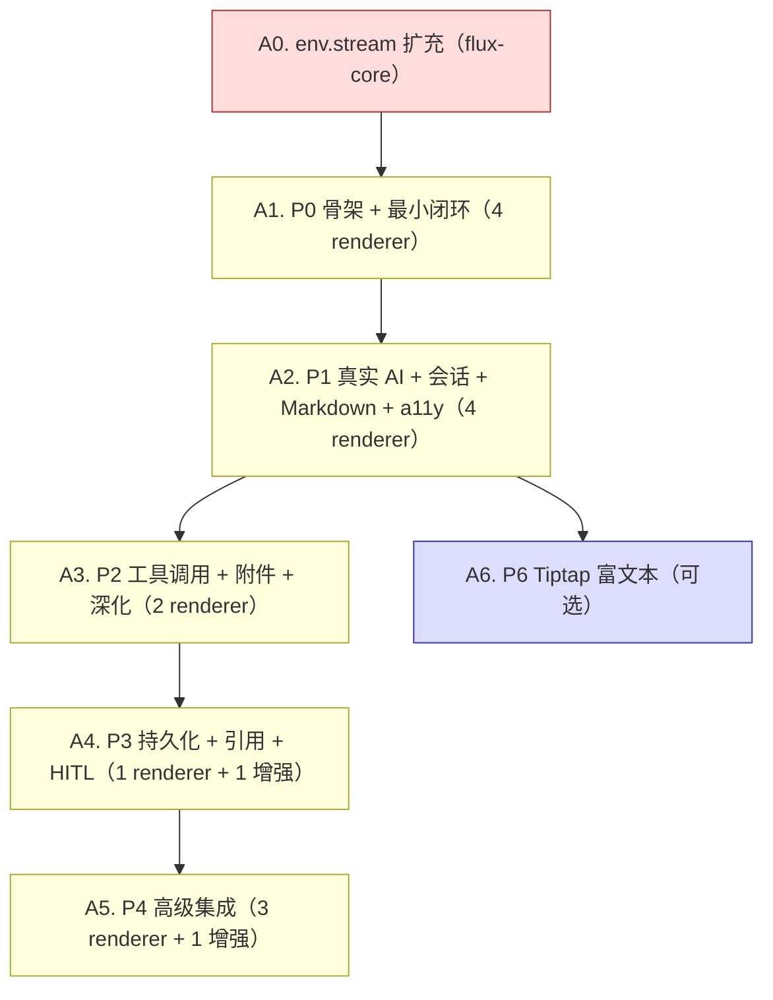

# flux-renderers-ai Roadmap

> 最后更新：2026-07-25
> 来源：`docs/components/flux-renderers-ai/design.md`、`implementation.md` §2、`docs/analysis/ai-survey/2026-07-21-tiny-robot-deep-analysis.md`
> Mission：`missions/ai.json`
> 目标：完整实现 `@nop-chaos/flux-renderers-ai` 包——AI 对话渲染器族（消息气泡、流式输出、会话管理、附件、工具调用、引用、HITL 审批、语音输入等），从 tiny-robot（Vue 3, MIT）移植引擎核心并用 React 19 + flux 架构重写。

## Purpose

本文是 AI 对话渲染器包的长期开发路线图。每个工作项（work item）是一个 execution plan 的合理交付范围。

AI 或维护者读完本文即知哪些工作项未开始（`todo`）、已计划（`planned`）、已完成（`done`），无需重走全部设计文档。

**本文是编排层，不是 execution plan，也不是设计契约。** 设计契约看 `docs/components/flux-renderers-ai/design.md`；渐进式路线与改进项映射看 `implementation.md` §2；引擎/适配器/connector 细节看 `engine.md`；组件级改进项清单看 `improvement-analysis.md` §4。

## Phase Status

> **全文件唯一的动态状态区。**
> 状态流转：`proposed`（pre-todo 初始状态）→ `todo` → `planned`（draft review 通过）→ `done`（closure audit 通过）。

- **A0. env.stream 扩充（前置，不在本包内）**: `done`
- **A1. P0 骨架 + 最小闭环**（4 renderer）: `done`
- **A2. P1 真实 AI + 会话 + 流式 Markdown + a11y**（4 renderer + 5 改进项）: `done`
- **A3. P2 工具调用 + 附件 + 渲染器深化**（2 renderer + 7 改进项）: `done`
- **A4. P3 持久化 + 引用 + HITL**（1 renderer + 1 增强 + 2 改进项）: `done`
- **A5. P4 高级集成**（3 renderer + 1 增强 + 3 改进项 + 2 评估项）: `done`
- **A6. P6 Tiptap 富文本（可选）**: `done`

### Follow-ups 已收口

- ✅ **ai-chat ↔ useConversation 引擎统一**（A4 deferred 项，原标 "A5 host 集成时评估"）：已落地于 `docs/plans/2026-07-24-0751-1-ai-chat-external-engine-injection.md`。`ai-chat` 新增 `engine?: SchemaValue`，可绑定 host 注入的外部 `MessageEngine`（`useConversation.activeEngine`），公共 `useEngineView` hook 收口订阅逻辑；持久化示例页改用 `ai-chat`（移除手工拼装 + 私有 helper）。design.md §11.2/§11.5、renderers.md 已同步。
- ✅ **`normalizeActionEvent` custom-payload drop bug 修复**（0751-1 plan 记录的 deferred bug-fix 项）：已落地于 `docs/plans/2026-07-24-1851-1-normalize-action-event-custom-payload-fix.md`。`normalizeActionEvent` 不再静默丢弃缺少 string `type` 的自定义 event payload——改为保留全部字段并合成 `type: 'custom'`（`${event.id}`/`${event.item}`/`${event.conversation}` 现可正确解析）；10 个 AI 渲染器的 ~18 处 custom-payload event 对齐了 namespaced `type`（`ai:*`）。`renderer-runtime.md` Event Passthrough Contract 已同步。

### Follow-up Backlog (P2 from audits)

> 以下 P2 项来自 2026-07-24 两份 open 审计（multi-audit + open-audit）。**代码/行为类 P2 项已由 `docs/plans/2026-07-24-2300-1-ai-p2-code-and-behavior-remediation.md` 收口（✅ 1757 批）+ `docs/plans/2026-07-25-0117-1-ai-p2-code-and-behavior-remediation-2151.md` 收口（✅ 2151 批 25 条代码/行为项）**；文档一致性类 P2 项由 `docs/plans/2026-07-24-2300-2-ai-p2-doc-consistency-remediation.md` 收口（✅ 已收口）；2151 批剩余 12 条（文档一致性 6 + 测试断言加固 6）由 `docs/plans/2026-07-25-0117-2-ai-p2-doc-and-test-hardening-2151.md` 收口（✅ 已收口；全量 typecheck/build/lint/test 绿；closure-audit gate 待独立子 agent）。每条带来源审计路径以保持可追溯。

**Source: `docs/audits/2026-07-24-1757-multi-audit-ai.md`**（P2 批）

- ✅ `tool-no-executor` 失败路径不写 `state.lastError`（`create-engine.ts:235-245`）——与 connector-throw 路径（`:406`）不对齐 → 已写 `draft.lastError`，与 connector-throw shape 对齐
- ✅ Clipboard copy 乐观显示"Copied"，写入失败静默（`ai-feedback.tsx:25-33,92-98`、`ai-bubble/renderers/markdown.tsx:102-107,143-153`）→ 改为 await + catch，失败不显示 "Copied"
- ✅ `AiChatProvider` value 每渲染内联重建，跨 Provider 边界 Compiler 无法 memoize（`ai-chat.tsx:283`）→ `useMemo` 稳定引用
- ✅ `MaybePromise<T>` 定义 3 处（`engine/types.ts:95`、`storage/types.ts:17`、`ai-conversation-controller.ts:26`），重复导出 → 收敛到 `engine/types.ts` 单一来源
- ✅ `toActionError` 死 module-local 导出，无消费者（`ai-action-provider.ts:41-43,136`）→ 已移除
- ✅ `engine.md:179` 标 `createNativeMessageAdapter` 为 "test-use only"，实为生产默认 + 公共导出（→ Plan 2 文档收口）
- ✅ `markdown-buffer.ts` stateful API（`createMarkdownBuffer` 等）导出但生产未用（仅 `safeMarkdownSlice` 在用）→ 仅保留 `safeMarkdownSlice`
- ✅ `nop-` 前缀泄到非根内部 region（8 元素：`ai-voice-input.tsx:202` 等）→ 内部 region 改用 `data-slot`；新增 marker 一致性静态测试
- ✅ `.ai-bubble-cursor` 裸全局 helper class，与文件自身 `data-slot` 约定不一致（`styles.css:4-21`）→ 改为 `[data-slot='ai-bubble-cursor']`
- ✅ 视觉布局规则直接挂 `.nop-ai-message-list` 根 marker（`styles.css:80-87`），应移至 `[data-slot='ai-message-list']` → 视觉规则移至 data-slot，marker class 仅做语义标识
- ✅ `ai-voice-input.tsx:100-105` effect deps 含 `props.events`（应用 latest-ref 模式）→ eventsRef latest-ref，deps 收敛为 `[unsupported]`
- ✅ `clear()` while-in-flight guard 无测试（与 `setMessages` 不对称；`create-engine.ts:451-464`）→ 新增 focused 测试
- ✅ `component-handle-no-registry` skip 路径无测试（registry 缺失时的防御跳过）→ 新增 focused 测试
- ✅ `use-conversation.test.ts`（520 行）跨 4 domain，导航性优化候选 → 拆为 create/switch/controller/storage 4 文件（断言零丢失）
- ✅ `renderers.md`/`design.md` reference-block line rot（批量：§3.2 phantom `BubbleBoxRendererMatch`、§13 phantom `onScrollTop`、§1.3 `<footer>` 包裹、§6 目录树漏 6 文件、§10.3 default renderer 计数、§13.1 marker 表缺 4）（→ Plan 2 文档收口）
- ✅ `terminology.md` 无 AI 包核心词条（`MessageEngine`/`AiConnector`/`ChatMessage`/`MessageStateAdapter`）（→ Plan 2 文档收口）
- ✅ `AGENTS.md:9` 包列表漏 `flux-renderers-ai`（→ Plan 2 文档收口）

**Source: `docs/audits/2026-07-24-1757-open-audit-ai.md`**（P2）

- ✅ O-4：`ai-attachments` 附件 id 由 `name-size-lastModified` 派生，重复文件 id 碰撞 → React key 重复 + `handleRemove` 误删全部同名件（`ai-attachments.tsx:99,243,125-137`）→ 改用 `generateAttachmentId()`（`crypto.randomUUID` + 回退 counter），同名文件各自唯一 id

**Source: `docs/audits/2026-07-24-2151-multi-audit-ai.md`**（P2 批，32 条）+ **`docs/audits/2026-07-24-2151-open-audit-ai.md`**（P2 N-3..N-8，6 条）。✅ **P1（P1-1..P1-5 / N-1 / N-2）已由 `docs/plans/2026-07-25-0044-1-ai-p1-remediation.md` 收口**（7 条全部修复 + focused proof，全量 typecheck/build/lint/test 绿；两份源审计 `Audit Status: closed`）。✅ **P2 代码/行为类 25 条已由 `docs/plans/2026-07-25-0117-1-ai-p2-code-and-behavior-remediation-2151.md` 收口**（25 条全部修复 + focused proof，全量 typecheck/build/lint/test 绿）。✅ **docs/test 加固 12 条已由 `docs/plans/2026-07-25-0117-2-ai-p2-doc-and-test-hardening-2151.md` 收口**（6 条文档 + 6 条测试断言全部落地，全量 typecheck/build/lint/test 绿；closure-audit gate 待独立子 agent）。

_防御/交互守卫（silent-drop 家族）_

- ✅ `ai-sender` 共享 `commit()` 无 `isProcessing` 守卫——host `senderExtensions` 组件不自禁用时 Enter 提交会静默丢 draft（`renderers/ai-sender.tsx:59-72,120-124`）→ `commit()` 入口加 `if (ctx?.isProcessing) return;` 守卫
- ✅ `ai-attachments` 上传按钮流式中不禁用；`handleUpload` 调 `ctx.sendMessage(parts)` 无守卫 → 多模态消息静默丢弃（`renderers/ai-attachments.tsx:165-175,222-231`）→ 按钮 `disabled={ctx?.isProcessing}` + `handleUpload` 早返回守卫
- ✅ `ai-tool-call` HITL approve/reject 在 host 未接 `onApproval` 时是死点击（无 disabled/tooltip，卡片永久 `pending`）（`renderers/ai-tool-call.tsx:241-272`）→ `!onApproval` 时按钮 disabled + `title` 提示「未配置审批处理器」
- ✅ 编辑态存在组件 `useState`（`ai-bubble/index.tsx:85`、`user-edit.tsx:36-37`）而 `design.md §11.5` 指派为引擎持有（`message.state.editing`）；影响仅限 >200 消息虚拟回收（design-doc 冲突）→ Plan 2 已以文档裁定收口：§11.5 改为如实记录「组件 useState 当前实现 + 虚拟回收限制 + 引擎无 editing-state setter」；迁移到引擎超 P2 polish 范围（Deferred successor）
- ✅ `ai-prompts` item key 用 `label#index`；重排/插入丢失元素身份（`renderers/ai-prompts.tsx:47`）→ 改用纯内容派生 key（`label`+`badge`）

_错误传播/可观测性_

- ✅ `tool-execution.ts:46-59` catch 把 tool error 压平为 `err.message`，丢原 Error（stack/cause/自定义字段）——host 无法结构化日志（`engine/tool-execution.ts:46-59`）→ catch 保留原 Error 写入 `metadata.toolError`，`resultText` 仍取可读 message
- ✅ `ai-bubble` `pickRenderer` 用裸 `catch {}` 吞 host matcher 异常（无 warn/回调）——host 无法调试自定义 bubble renderer 为何不匹配（`renderers/ai-bubble/index.tsx:206-224`）→ 改 `catch (err) { console.warn('[ai-bubble] custom matcher threw', err); }`
- ✅ 后台（流式中切换）引擎 turn 转换未被 `ai-chat` 的 `[engine]`-keyed subscribe effect 观测 → `onResponseComplete` 对切换后完成的 turn 不触发（`renderers/ai-chat.tsx:231-259`）→ 已由 AI-12 latest-events-ref 模式覆盖（既有测试 `ai-chat-subscribe.test.tsx` 已断言不丢过渡）；Plan 2 已在 `design.md §14.1` 显式记录该事件契约边界（仅 active engine turn 触发）

_Public API surface（calibration #6 零消费者）_

- ✅ `MaybePromise as AiMaybePromise` 死公共别名（`index.ts:84`）→ 移除（`rg AiMaybePromise` 全仓零消费）
- ✅ `MessageStateAdapter` 导出但其 aux 类型 `InternalMessageState`/`PublicMessageState` 未再导出（`index.ts:99` + `engine/types.ts:212-245`）→ 补再导出（host 可从包入口注解自定义 adapter）
- ✅ 引擎内部 `combineDeltaData`/`generateMessageId`/`measureContentLength` 泄漏到公共面（`index.ts:92-93`）→ 移除公共导出（包内相对 import；测试已用相对路径）

_显示/定位正确性_

- ✅ `parseCitations` 正则 `/\[(\d+(?:\s*,\s*\d+)*)\]/g` 误匹配代码块内的 `array[0]`/`[N]`；`byIndex` 1-based → index 0 空卡片（`renderers/ai-citations.tsx:203,224`）→ 解析前剥离 fenced/inline code span；index ≤ 0 不产生 citation segment
- ✅ `markdown-buffer` fence 计数混 ` ``` `/`~~~`，误数代码块内嵌 fence（`ai-bubble/markdown-buffer.ts:21`）→ 按 delimiter 种类独立计数（CommonMark: ``` 与 ~~~ 不能互关）

_测试断言强度（非 fake-green，但偏弱）_

- ✅ `ai-token-usage` clamp 测试仅断言 `.not.toBeNull()`（`renderers/__tests__/ai-token-usage.test.tsx:95-101`）→ Plan 2 已加固为读 `stroke-dasharray` 实际 clamped 值（dash === circumference、gap === 0、in-bounds 不变量）
- ✅ `safeMarkdownSlice` 已单测，但其接入 `MarkdownContentRenderer` 未 e2e 断言（`ai-bubble/renderers/markdown.tsx:28`）→ Plan 2 已新增 `markdown-content.test.tsx` 端到端 wiring 用例（未闭合 fence 被截断、移除 wiring 必红）
- ✅ `use-message.test.tsx` 未测 `toolExecutor` 转发到 engine（`adapters/__tests__/use-message.test.tsx`）→ Plan 2 已增 toolExecutor 转发用例（adapter → engine → tool_calls loop 全链路）
- ✅ Timestamp 测试仅断言 `tagName === 'TIME'`（`renderers/__tests__/p1-renderers.test.tsx:273-284`）→ Plan 2 已加固为断言 `toLocaleTimeString` 格式化 label + ISO `dateTime` 属性
- ✅ `hitl-no-handler` 测试仅 `.not.toThrow()`（`renderers/__tests__/ai-tool-call-hitl.test.tsx:66-75`）→ 已加固为「按钮 disabled + 不派发 event + approval 仍 pending」断言
- ✅ Markdown sanitize→`rehype-raw` 管线无 XSS 回归测试（`ai-bubble/renderers/markdown.tsx:34-47`）→ Plan 2 已新增 XSS 回归套件（`` / `<script>` / `javascript:` href raw+markdown 双路径 / 属性分裂嵌套 payload）；三层闸门（sanitize + urlTransform + React runtime）实证有效，未发现真实洞

_React-19/生命周期（churn 非正确性）_

- ✅ `ai-chat` 每渲染重建 `componentHandle`（`renderers/ai-chat.tsx:155-163`）→ `useMemo` 稳定（deps：engine + resolved id/name）
- ✅ `ai-chat` 每渲染重建 `actionProvider`（`renderers/ai-chat.tsx:141-145`）→ `useMemo` 稳定（deps：engine + conversationController）
- ✅ `ai-chat` 每渲染新建 `hostScopeData` 字面量（`renderers/ai-chat.tsx:215-220`）→ `useMemo` 稳定（deps：isProcessing + projectedMessages + activeConversationId）
- F3.1 残留：6 处手写 `useMemo`/`useCallback`（各带 justification 注释）（`tiptap-sender.tsx:81-83`、`ai-chat.tsx:181-183/274-277`、`use-conversation.ts:97-105`）→ watch-only periodic re-review（非正确性）

_a11y polish_

- ✅ `ai-sender` `<Textarea>` 仅 `placeholder`，无 `aria-label`/`<Label>`（`renderers/ai-sender.tsx:152-166`）→ 加 `aria-label={props.placeholder ?? t('flux.ai.messageInput')}`
- ✅ `ai-conversations` rename `<Input>` 无 `aria-label`（`renderers/ai-conversations.tsx:66-80`）→ 加 `aria-label={t('flux.ai.renameConversation')}`
- ✅ `ai-tool-call` `aria-label` 只含 tool name 不含 status（`renderers/ai-tool-call.tsx:129-130`）→ 拼接 status 文案（`toolStatusLabel(status)` + 新 i18n key `toolStatusRunning/Success/Failed/Cancelled`）

_文档/契约措辞 rot_

- ✅ `design.md §74` 仍把 ai-message-list 能力列为「分组」，F1.4 已移除 groupStrategy（`docs/components/flux-renderers-ai/design.md:74`）→ Plan 2 已移除「分组」，与 `renderers.md:95` 一致
- ✅ `design.md §13.1` marker 表漏 4 个已发 marker（`nop-ai-citations`/`nop-ai-voice-input`/`nop-ai-token-usage`/`nop-ai-suggestions`）（`docs/components/flux-renderers-ai/design.md:578-589`）→ Plan 2 已补齐 4 个 marker
- ✅ `terminology.md:511` 称 `createStreamBasedAiConnector` 桥接 `RendererEnv.fetcher`，代码用 `env.stream`（`docs/references/terminology.md:511`）→ Plan 2 已改为 `RendererEnv.stream`
- ✅ `useMessage` 仅热换 `connector`，其它 engine 选项 mount-time-only 无告警注记（`adapters/use-message.ts:62-92`）→ Plan 2 已补 JSDoc + `engine.md §8.5` 热换 scope 注记

_渲染器契约 polish_

- ✅ `ai-renderer-definitions.ts` 7 个 dead field-metadata（`itemRegion`/`avatarRegion`/sender `actions`/`menuItems`/`trigger`/`conversationId`/`onSend`）（`ai-renderer-definitions.ts:65,71,90,107,130,147,284`）→ 全部移除（renderer 测试零回归）
- ✅ 3 个渲染器（`ai-tool-call`/`ai-suggestions`/`ai-citations`）dispatch event 缺 `void` 前缀（`ai-tool-call.tsx:259-269`、`ai-suggestions.tsx:150`、`ai-citations.tsx:97`）→ 全部补 `void` 前缀（与其余 11 渲染器一致）

_Source: `docs/audits/2026-07-24-2151-open-audit-ai.md`（N-3..N-8）_

- ✅ N-3：`PROMPTS_DEFAULT_LABEL` 死导出 + 模块加载期 `t()`（i18n 顺序陷阱）（`renderers/ai-prompts.tsx:94`）→ 移除死导出（消费方渲染期 `t('flux.ai.placeholder')` 自取）
- ✅ N-4：mention query 正则含 `\s`，与「no whitespace」行内注释矛盾，候选框可跨空格常驻（`rich-text/extensions/mention.ts:27`）→ 字符类移除 `\s`
- ✅ N-5：`user-edit.tsx` 的 `onChange` 形参遮蔽引擎别名 `e`（`renderers/ai-bubble/user-edit.tsx:78`）→ 形参改名 `ev`
- ✅ N-6：`ai-suggestions` 用 `item.text` 作 key，重复文案即碰撞（`renderers/ai-suggestions.tsx:93,114`）→ `key={\`${item.text}#${index}\`}` 唯一化（`AiSuggestionItem` 无 id 字段，退化 text#index）
- ✅ N-7：`ai-feedback` like/dislike aria-label 是 emoji，`sources` 硬编码英文（`renderers/ai-feedback.tsx:86-90`）→ 新增 `flux.ai.like`/`dislike`/`sources` i18n key；labelFor 走 `t()`
- ✅ N-8：`highlightJson` token 正则在含 `&`/`<`/`>`/`"` 的字符串上失配（高亮缺失，非 XSS）（`renderers/ai-tool-call.tsx:332-343`）→ 重写为「先 tokenize 后 escape」（每 token 单独 escape，保留先 escape 防 XSS 不变量）

_Source: `docs/audits/2026-07-25-0707-multi-audit-ai.md`（P2-1..P2-6，6 条）+ `docs/audits/2026-07-25-0707-open-audit-ai.md`（P2-1..P2-3，3 条）。✅ **P1（multi P1-1/P1-2 + open P1-1/P1-2 共 4 条）已由 `docs/plans/2026-07-25-0730-1-ai-p1-remediation.md` 收口（completed；4 条全部修复 + focused proof，workspace 全量 typecheck/build/lint/test 绿；closure-audit `pass`；两份源审计 `Audit Status: closed`）。**每条带来源审计路径以保持可追溯。_

_a11y / i18n polish_

- [x] multi-audit P2-1：`user-edit` 铅笔按钮 `aria-label` 误用 `t('flux.ai.copy')`（实为编辑动作）（`renderers/ai-bubble/user-edit.tsx:106`）→ 新增 `flux.ai.editMessage` i18n key + locale，绑定 `aria-label={t('flux.ai.editMessage')}`；`p2-a11y-i18n.test.tsx` 增 aria-label 断言 ✅ `docs/plans/2026-07-25-0842-1-ai-p2-remediation-0707.md` Phase 1
- [x] multi-audit P2-4：`suggestion-popup`+`template-bar` 4 处硬编码英文 aria-label（`rich-text/components/suggestion-popup.tsx:44,65`、`template-bar.tsx:22`）→ 新增 `flux.ai.mentions`/`slashCommands`/`closeSuggestions`/`insertTemplate` key；`p2-a11y-i18n.test.tsx` 扩展覆盖 `rich-text/components/` ✅ `docs/plans/2026-07-25-0842-1-ai-p2-remediation-0707.md` Phase 1

_错误传播 / 可观测性_

- [x] multi-audit P2-2：`error.tsx` 重试按钮 `ctx?.sendMessage(lastUserText)` 是裸 promise（`renderers/ai-bubble/renderers/error.tsx:32-34`），与 `ai-sender.tsx:70/217`（`void`）/`ai-attachments.tsx:178`（`await`）不一致 → 改 `void ctx?.sendMessage(lastUserText);` ✅ `docs/plans/2026-07-25-0842-1-ai-p2-remediation-0707.md` Phase 2

_Public surface / 契约诚实_

- [x] multi-audit P2-3：7 个 schema TYPE 字段声明但无消费者（`schemas.ts:21,67,98,109,132,212,409`：`conversationId`/`onSend`/`itemRegion`/`avatarRegion`/`actions`/`menuItems`/`trigger`）→ 移除（与上轮 field-metadata 清理 + `contract-honesty.test.ts` 哲学一致）或实现 ✅ `docs/plans/2026-07-25-0842-1-ai-p2-remediation-0707.md` Phase 3（`actions` 仅删 sender dead `SchemaInput` 处，保留 ai-feedback live `SchemaValue`）

_文档 / 契约表 rot_

- [x] multi-audit P2-5：`roadmap-ai.md:253` Renderer Coverage 表仍宣传已移除的「分组」能力（与 `:113` 自述、`design.md §74`、`renderers.md:95`、`contract-honesty.test.ts:130` guard 均矛盾）→ 改为「自动滚动、注册制渲染、A-8 虚拟滚动」 ✅ `docs/plans/2026-07-25-0842-1-ai-p2-remediation-0707.md` Phase 4
- [x] multi-audit P2-6：`terminology.md:531-537` 误称 `ReactMessageAdapter` 公共导出（`index.ts:95` 仅导出工厂 `createReactMessageAdapter`，类为 module-local）→ 删「Publicly exported」句（或补 re-export type） ✅ `docs/plans/2026-07-25-0842-1-ai-p2-remediation-0707.md` Phase 4

_debug 残留 / 测试有效性_

- ✅ open-audit P2-1：`tmp-sanitize-check.mjs`（包根，`src/` 外）+ no-op `tmp-sanitize-check.test.ts`（`expect(true).toBe(true)`）debug 残留（`packages/flux-renderers-ai/src/__tests__/tmp-sanitize-check.test.ts:4-13`）→ 两文件已删除（两个 untracked debug 文件的 unused eslint-disable 指令阻塞 `pnpm lint` gate，随 `2026-07-25-0730-1` P1 closure 一并清除；`rg tmp-sanitize` 0 hits）

_显示 / 交互 polish_

- [x] open-audit P2-2：`ai-voice-input` 单次失败会话重复 emit `no-result`（`onerror` + `onend` 各一次）（`renderers/ai-voice-input.tsx:146-162`）→ `onend` 的 `no-result` 加 `!errorAlreadyFired` 门（或仅由 `onend` 单源 emit） ✅ `docs/plans/2026-07-25-0842-1-ai-p2-remediation-0707.md` Phase 2
- [x] open-audit P2-3：`ai-citations` sanitize 会 DROP citation marker（DOMPurify 丢弃 forbidden tag 内文本，非仅显示 mangle）——与 `2026-07-25-0730-1` plan 的 multi-audit P1-2（sanitizeHtml 双编码）同根，**该 P1 的 Proof 已含 `<script>x[1]</script> plain [2]` 验证点**（断言 `[1]` 保留）；本项随 P1 修复一并验证，不另立 scope ✅ `docs/plans/2026-07-25-0730-1-ai-p1-remediation.md` Phase 2（`ai-citations.test.tsx` FP-6 XSS invariant 用例绿：`<script>` 不注入 + `[1]`/`[2]` citation 保留）

## Status Values

| Status     | 含义                                                                                          |
| ---------- | --------------------------------------------------------------------------------------------- |
| `done`     | 工作项全部组件已实现且对应 plan 通过 closure audit                                            |
| `planned`  | 已有对应 execution plan，正在或等待实现                                                       |
| `todo`     | 尚未开始，无对应 plan                                                                         |
| `proposed` | 已有提案（含 design.md 立约 / 工作项定义），**待人确认后才可改 `todo`**；AI 不得自行转 `todo` |

## Current Baseline

### 已完成（设计阶段）

- tiny-robot 深度调研报告 → `docs/analysis/ai-survey/2026-07-21-tiny-robot-deep-analysis.md`（61 KB，912 行）
- tiny-robot 移植建议 → `docs/analysis/ai-survey/2026-07-21-tiny-robot-migration-recommendations.md`
- 包设计文档（v2，audit.md 已解决所有 FIX 项）→ `docs/components/flux-renderers-ai/design.md`
- 引擎与适配器设计 → `docs/components/flux-renderers-ai/engine.md`
- 实施辅助（测试策略、渐进式路线、风险表）→ `docs/components/flux-renderers-ai/implementation.md`
- 组件级改进分析 → `docs/components/flux-renderers-ai/improvement-analysis.md`
- 渲染器详细设计 → `docs/components/flux-renderers-ai/renderers.md`
- 设计审计 → `docs/components/flux-renderers-ai/audit.md`
- env.stream 扩充讨论 → `docs/discussions/2026-07-21-env-stream-and-websocket-extension.md`
- 新渲染器引入审计 → `docs/references/new-renderer-introduction-audit.md`

### 已完成（代码阶段）

- `packages/flux-renderers-ai/` 包已创建，全部 14 个渲染器 + 2 个增强项已实现（A1–A6 均 done）
- `packages/flux-core` 的 `RendererEnv` 已扩充 `stream` / `openSocket` 接口（A0 已落地，2026-07-23）+ playground 默认实现 + decorator hooks

### 总览

- 1 个新包（`@nop-chaos/flux-renderers-ai`），移植 tiny-robot 消息引擎核心
- 14 个渲染器 + 2 个增强项，分 6 个 Phase（P0–P4 必做，P6 可选）
- 17 个组件级改进项（A-1 ~ A-17，来自 `improvement-analysis.md` §4）
- 1 个前置依赖（env.stream 扩充，落在 `flux-core`）

---

## Work Items

> 每个 work item = 一个 execution plan 的合理交付范围。渲染器数标在括号内。

### A0 — env.stream 扩充（前置依赖）

> **不在本包内**，落在 `packages/flux-core`。是 A1（P0）的硬前置——没有 `env.stream`，P0 的 mock 流式对话无法跑通。

| ID  | Status | 内容                                                                                                                                                                                                | 设计文档                                                            | 依赖 |
| --- | ------ | --------------------------------------------------------------------------------------------------------------------------------------------------------------------------------------------------- | ------------------------------------------------------------------- | ---- |
| A0  | done   | 完成 `docs/discussions/2026-07-21-env-stream-and-websocket-extension.md` 评审；`packages/flux-core` 扩 `RendererEnv.stream` + `RendererEnv.openSocket` 接口；`apps/playground` 提供默认 stream 实现 | `docs/discussions/2026-07-21-env-stream-and-websocket-extension.md` | —    |

**退出条件**：`env.stream` 在 playground 可用；评审 discussion 完成总结。

### A1 — P0：骨架 + 最小闭环（4 renderer）

> 建包；移植引擎核心 + React adapter + ai-connector-factory；实现 4 个核心渲染器；host 提供 mock connector。

| ID  | Status | 内容                                                                                                                                                                                                                                                                                                                                                                                           | 设计文档                        | 依赖 |
| --- | ------ | ---------------------------------------------------------------------------------------------------------------------------------------------------------------------------------------------------------------------------------------------------------------------------------------------------------------------------------------------------------------------------------------------- | ------------------------------- | ---- |
| A1  | done   | 建 `flux-renderers-ai` 包（package.json、tsconfig、vitest、目录结构）；移植 `MessageEngine` + `combineDeltaData` + 插件链（thinking/tool/length）；React adapter（`useSyncExternalStore`）；`ai-connector-factory`；实现 `ai-chat` / `ai-message-list` / `ai-bubble`（仅 markdown + loading renderer）/ `ai-sender`；host 提供 mock connector 经 `xui:imports` 注入；playground 跑通 mock 对话 | `design.md §5-§10`、`engine.md` | A0   |

**退出条件**：`pnpm typecheck/build/lint/test` 全过；playground 能发送并接收 mock 流式回复。

### A2 — P1：真实 AI + 会话 + 流式 Markdown + a11y（4 renderer + 5 改进项）

> host 提供 OpenAI/DeepSeek connector；4 个辅助渲染器；ActionScope namespace `ai` 注册；流式 Markdown CJK 缓冲；基础 a11y。

| ID  | Status | 内容                                                                                                                                                                                                                                                                                                                                                                                                                                                                                                                                                                                  | 设计文档                                                       | 依赖 |
| --- | ------ | ------------------------------------------------------------------------------------------------------------------------------------------------------------------------------------------------------------------------------------------------------------------------------------------------------------------------------------------------------------------------------------------------------------------------------------------------------------------------------------------------------------------------------------------------------------------------------------- | -------------------------------------------------------------- | ---- |
| A2  | done   | `ai-conversations`（会话列表侧边栏：新建/切换/重命名/删除）；`ai-welcome`（空状态欢迎页）；`ai-prompts`（推荐提示词卡片）；`ai-feedback`（消息底部操作条：copy/refresh/like/dislike）；ActionScope namespace `ai`（send/abort/clear/createConversation/switchConversation/deleteConversation/renameConversation + `$ai` host scope projection）；**A-1** ChatMessageDataPart；**A-2** 流式 Markdown CJK + code fence 缓冲；**A-3** 代码块复制；**A-4** 消息时间戳；**A-5** 错误态组件；`useConversation` host helper（双层模型）；a11y `role="log"` + `aria-live="polite"` + 焦点回输 | `design.md §5.1`、`renderers.md`、`improvement-analysis.md §4` | A1   |

**退出条件**：接 DeepSeek/OpenAI 真实 API 能对话；会话切换正常；外部按钮 `ai:send` 工作；流式 Markdown 不闪烁。

### A3 — P2：工具调用 + 附件 + 渲染器深化（2 renderer + 7 改进项）

> 工具调用卡片 + 附件上传 + ComponentHandle 注册 + 渲染器深化（虚拟滚动、光标动画、消息编辑、LaTeX 等）。

| ID  | Status | 内容                                                                                                                                                                                                                                                                                                                                                                                                                                                                                                                               | 设计文档                                                   | 依赖 |
| --- | ------ | ---------------------------------------------------------------------------------------------------------------------------------------------------------------------------------------------------------------------------------------------------------------------------------------------------------------------------------------------------------------------------------------------------------------------------------------------------------------------------------------------------------------------------------- | ---------------------------------------------------------- | ---- |
| A3  | done   | `ai-tool-call` + `toolPlugin` 完整接入（状态、展开、JSON 高亮、按工具名注册专用渲染器）；`ai-attachments`（附件上传/预览，图片模式/卡片模式，多模态 content part + 拖放）；ComponentHandle 注册（Layer C）；**A-6** 工具卡片类型化（BubbleToolRendererMatch）；**A-7** Streamdown 适配（裁定不引入，保留路径 C）；**A-8** 虚拟滚动（复用 `@tanstack/react-virtual`）；**A-9** useAutoScroll hook 公开；**A-10** 推理持续时间；**A-11** 流式光标动画；**A-12** 工具状态颜色；消息编辑；LaTeX/KaTeX 评估（裁定不内置，交 host 注入） | `design.md §5.1, §10.3-10.4`、`improvement-analysis.md §4` | A2   |

**退出条件**：LLM 调用工具并回显结果；图片上传作为 `image_url` content part 发送；1000+ 消息性能不退化。

### A4 — P3：持久化 + 引用 + HITL（1 renderer + 1 增强 + 2 改进项）

> 会话持久化（host 实现）+ 引用气泡 + 人机审批（HITL）。

| ID  | Status | 内容                                                                                                                                                                                                                                                                                                                                                                                                                                                                                                  | 设计文档                             | 依赖 |
| --- | ------ | ----------------------------------------------------------------------------------------------------------------------------------------------------------------------------------------------------------------------------------------------------------------------------------------------------------------------------------------------------------------------------------------------------------------------------------------------------------------------------------------------------- | ------------------------------------ | ---- |
| A4  | done   | host 提供 localStorage / IndexedDB `ConversationStorageStrategy` 实现；`useConversation` 在 host 层封装 storage 同步（mount 引导 + 切换 `engine.setMessages` 重水合 + turn 完成 `autoSaveMessages` 落盘 + 三 Failure Path 非致命降级）；**A-13** `ai-citations` 渲染器（`[N]`/`[N,M]` 解析 + 悬停卡片 + 来源列表 + sanitize 安全）；**A-14** HITL 审批页脚（`ChatToolCallUIState.approval` + approve/reject 按钮 + `data-requires-approval` + 焦点陷阱 + 已决策徽标，engine 只持状态不实现暂停/恢复） | `design.md §5.1, §11.3`、`engine.md` | A3   |

**退出条件**：刷新页面后历史会话恢复；引用来源可悬停查看；工具调用可审批/拒绝。

### A5 — P4：高级集成（3 renderer + 1 增强 + 3 改进项）

> messages 序列化进 flux form 字段；data-source 联动；语音输入；消息分支；Token 用量；建议气泡。

| ID  | Status | 内容                                                                                                                                                                                                                                                                                                                                                                                                                                                                                          | 设计文档                                            | 依赖 |
| --- | ------ | --------------------------------------------------------------------------------------------------------------------------------------------------------------------------------------------------------------------------------------------------------------------------------------------------------------------------------------------------------------------------------------------------------------------------------------------------------------------------------------------- | --------------------------------------------------- | ---- |
| A5  | done   | messages 序列化进 flux form 字段（Decision-A 裁定 host 范式：`component:getMessages` → 序列化 → setValue，INV-17 保持）；`onResponseComplete` 接 data-source 联动（Decision-B 裁定无需新增方法）；**A-15** `ai-voice-input`（Web Speech API 直呼，非 IO 不经 env）；**A-16** 消息分支（`engine.regenerate` 记 branchId + host 管 branches + `onBranchChange` 选择器）；**A-17** `ai-token-usage`（Token / 成本 / 上下文占比 + SVG 环形）；`ai-suggestions`（建议气泡，expand/scroll/popover） | `design.md §5.1, §11`、`improvement-analysis.md §4` | A4   |

**退出条件**：对话历史可进入表单提交流程；语音输入工作；分支可切换。

### A6 — P6：Tiptap 富文本（可选）

> Sender 富文本扩展。非必做；启动前需人确认。

| ID  | Status | 内容                                                                                                                                  | 设计文档            | 依赖 |
| --- | ------ | ------------------------------------------------------------------------------------------------------------------------------------- | ------------------- | ---- |
| A6  | done   | `@tiptap/react` 接入；@提及 / 模板插入 / Slash 命令；保持 `<Textarea>` 作为降级（`senderExtensions` 字段未声明时 bundle 不含 Tiptap） | `design.md §3, §10` | A2   |

**退出条件**：富文本输入扩展通过 `senderExtensions` 字段注入。

---

## Renderer Coverage

> 静态映射：渲染器 → 工作项 → Phase。逐渲染器实现状态以本表为准。

| type               | Phase | Work item | 类别   | 职责                                                          | 状态 |
| ------------------ | ----- | --------- | ------ | ------------------------------------------------------------- | ---- |
| `ai-chat`          | P0    | A1        | Layout | 完整对话面板（messages + sender + auto-scroll + 状态管理）    | ✅   |
| `ai-message-list`  | P0    | A1        | Layout | 消息列表（自动滚动、注册制渲染、A-8 虚拟滚动）                | ✅   |
| `ai-bubble`        | P0    | A1        | Widget | 单条消息气泡（含 reasoning / tool_calls / markdown）          | ✅   |
| `ai-sender`        | P0    | A1        | Widget | 输入区（submit / cancel / 字数 / Enter 提交）                 | ✅   |
| `ai-conversations` | P1    | A2        | Widget | 会话列表侧边栏（新建/切换/重命名/删除）                       | ✅   |
| `ai-welcome`       | P1    | A2        | Widget | 空状态欢迎页 + icon/title/description/footer                  | ✅   |
| `ai-prompts`       | P1    | A2        | Widget | 推荐提示词卡片列表（垂直/水平/折行）                          | ✅   |
| `ai-feedback`      | P1    | A2        | Widget | 消息底部操作条（copy/refresh/like/dislike/sources）           | ✅   |
| `ai-attachments`   | P2    | A3        | Widget | 附件上传/预览（图片模式 / 卡片模式）                          | ✅   |
| `ai-tool-call`     | P2    | A3        | Widget | 工具调用卡片（状态、展开、JSON 高亮、按工具名注册专用渲染器） | ✅   |
| `ai-citations`     | P3    | A4        | Widget | 内联引用气泡（`[N]` 检测 + 悬停卡片 + 来源列表）              | ✅   |
| HITL 审批          | P3    | A4        | 增强   | `ai-tool-call` 增 `approval` 状态 + approve/reject 按钮       | ✅   |
| `ai-voice-input`   | P4    | A5        | Widget | 语音输入（Web Speech API 直呼，非 IO 不经 env）               | ✅   |
| `ai-token-usage`   | P4    | A5        | Widget | Token / 成本 / 上下文占比显示                                 | ✅   |
| 消息分支           | P4    | A5        | 增强   | 重新生成时分支切换（branches 由 host 管理）                   | ✅   |
| `ai-suggestions`   | P4    | A5        | Widget | 建议气泡（Popover / Pills）                                   | ✅   |

---

## Dependency Graph



---

## Platform Reuse

以下能力已由 Flux 现有 runtime / 包提供，实现 AI 渲染器时**不得重建**，只做组装：

| 能力               | 提供方                            | 说明                                                         |
| ------------------ | --------------------------------- | ------------------------------------------------------------ |
| 通用 renderer 装配 | `flux-react` renderer-runtime     | `SchemaRenderer`、region/slot 渲染、node identity            |
| 表单运行时         | `flux-runtime`                    | scope/form runtime、validation、field metadata（P4 才接入）  |
| UI 组件库          | `@nop-chaos/ui`                   | Button/Input/Textarea/Dialog 等基础控件；**禁止用裸 HTML**   |
| Markdown sanitize  | `flux-renderers-content/markdown` | `ai-bubble` 复用其导出的 `sanitizeHtml` 纯函数               |
| 集合渲染底层       | `table`/`crud`/`list`             | 虚拟滚动（P2 A-8 复用 `@tanstack/react-virtual`）            |
| IO 抽象            | `flux-core` `RendererEnv`         | `env.stream`（A0 扩充后）、`env.fetcher`——渲染器不直接 fetch |

---

## Cross-Cutting

| 关注点              | 说明                                                                                                                                                                                                                    |
| ------------------- | ----------------------------------------------------------------------------------------------------------------------------------------------------------------------------------------------------------------------- |
| Renderer 契约       | 每个新渲染器必须有 `design.md` + `example.json` + renderer definition（见 `renderer-implementation-guidelines.md`）                                                                                                     |
| 新渲染器引入审计    | 引入新渲染器包必须通过 `docs/references/new-renderer-introduction-audit.md` 的 5 项原则审计（IO 边界、复用边界、内部状态边界、契约边界、扩展边界）                                                                      |
| UI 组件来源         | 一律复用 `@nop-chaos/ui`，禁止裸 HTML                                                                                                                                                                                   |
| 请求下沉            | AI 渲染器**不得声明组件级 `api` 字段**。所有 AI 请求通过 `AiConnector` 函数式抽象注入，业务方在 host 层提供 connector 实现。流式请求走 `env.stream`（A0 扩充后）。                                                      |
| 安全                | `ai-bubble` 渲染 markdown 时必须走 sanitize pipeline（复用 `flux-renderers-content/markdown` 导出的 `sanitizeHtml`）                                                                                                    |
| a11y                | `ai-message-list` 根元素 `role="log"` + `aria-live="polite"`（P1）；`ai-tool-call` 根元素 `aria-label`（P1）；`ai-sender` 提交后焦点回输（P1）；消息列表 Tab 导航（P2）；模态审批焦点陷阱（P3）；流式文本动态播报（P2） |
| 单测                | 引擎核心（`src/engine/`）可独立单测，不依赖 React；每个落地渲染器配 focused 单测                                                                                                                                        |
| **Playground 示例** | **每个新渲染器或能力改进，必须在 `apps/playground/src/` 下有可交互示例页面，注册到 playground 路由**                                                                                                                    |
| **E2E 测试**        | **每个新渲染器或能力改进，必须在 `tests/e2e/` 下有对应 e2e 测试文件，覆盖关键交互路径**                                                                                                                                 |
| Owner-doc 同步      | 工作项关闭时更新本表 Phase Status + `design.md` §5.1 渲染器清单状态 + `docs/components/index.md`                                                                                                                        |
| Dev log             | 每次实现后更新 `docs/logs/{year}/`                                                                                                                                                                                      |

---

## Rule

- 本文档是状态索引和粗粒度工作项划分，不是 execution plan。
- **本文档是人与 AI 的对齐点**：工作项的增删、拆分、优先级重排需人确认。AI 按既定顺序取第一个非 `proposed` 的 `todo` 工作项执行，不重新仲裁优先级、不跳过、不凭空新增工作项。
- **`proposed` 状态的工作项是 AI 起草的提案，需人确认后才可改 `todo` 进入执行队列；AI 不得自行把 `proposed` 改为 `todo`。** AI 可自主推进 `todo`→`planned`→`done`（基于 plan 完成的客观事实），但不能跨过人审把 `proposed` 变成可执行项。
- **plan 由 AI 自动拟制和执行，人不审 individual plan**；plan 质量靠 closure audit 兜底。人通过 Phase Status 观察 AI 进度。
- **可标记单位是工作项**（A0–A6），不是 Phase。Phase 只是优先级分组。A0 是落在 `flux-core` 的前置依赖，不在本包内。
- 每个 Phase 落地时必须创建独立 plan 文档 `docs/plans/{date}-{phase}-flux-renderers-ai-{topic}.md`（按 `docs/plans/00-plan-authoring-and-execution-guide.md`）。
- 完成后跑全量 `pnpm typecheck && pnpm build && pnpm lint && pnpm test`，全绿才标 Phase 完成。
- 工作项状态变更只需更新 Phase Status（本文档顶部）。
- 不得在 closure audit 通过前把工作项标为 `done`。
- 新渲染器一律先有 `design.md` 和 `example.json`，再实现 renderer definition。
