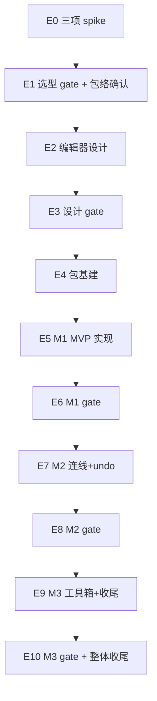

# Industrial HMI/SCADA Editor Roadmap

> 最后更新：2026-08-05
> 来源：`docs/components/industrial-hmi/editor-initiation.md`（I16.1 立项材料，2026-08-04 共识定稿）、`docs/components/roadmap-industrial-hmi.md`（前置 runtime mission，I0–I16 全部 done）、`docs/discussions/2026-08-03-industrial-hmi-scada-mission-scope-discussion.md`（§七 Q8 + §八 决策 1：编辑器后置为后继 mission）
> Mission：`missions/industrial-hmi-editor.json`
> 目标：为 nop-chaos-flux 新增**工业组态（HMI/SCADA）配置编辑器**——基于 leafer-editor 插件底座（spike 验证后裁定）+ 自研组态语义适配层（属性面板 schema / 连线声明 / undo-redo diff 命令栈 / 工具箱 / 双态隔离），消费前置 runtime mission 的 10 个复用点（`editor-initiation.md §3` 全部 live 核对：引擎层 / ConfigAdapter nodeById / 图元注册表 / JSON 序列化 / 组件句柄 / sky 交互覆盖物 / 测试句柄 / 绑定动画引擎 / 事件派发链 / benchmark 基座），按 M1/M2/M3 三里程碑分期交付（编辑器工程量为运行时 3–5 倍，`editor-initiation.md §5.1` 工作量档位）

## 文档共识审查记录（本文件）

> 依据 Cross-Cutting「文档共识审查」条款，本文件定稿前须经独立子 agent 反复审查直到共识。记录如下：

- _待 Round 1（fresh session 独立审查）_——本文件为首版起草（2026-08-05），尚未启动共识审查。按 Rule 5 + Cross-Cutting「文档共识审查」覆盖范围，本文件作为编排层 roadmap 进入 E0 spike plan 起草前**必须**先达成共识（连续一轮 0 新增修正项；≤3 轮，超限升级人工）。
- **Round 1（2026-08-05，fresh session 独立子 agent `ses_02ec81a79ffe0qNKQPVRiY7FWm`）**：判定 `REVISE`——0 Blocker / 1 Major / 4 Minor / 1 Nit，共 6 项修正全部落地（编写者经 live 复核上游依据逐项确认）：**M-1**「spike 任一项否决 → 转路径 B」否决条件过宽 → 改为精确条件（仅手势仲裁不成立或 API 漂移成本 ≥ 自研成本，对齐 `editor-initiation.md §4.3`），E0.3 性能不影响选型主路径（line 26 执行必读 + line 93 E0 Phase Details + line 188 Phase Details E0 三处同步）；**m-1** runtime 复用点内联表遗漏 3 项「需扩展」标注 → 补齐 #1 引擎层 undo 事务 / #4 序列化提交语义 / #9 事件预览派发 + line 63 汇总从「2 处」调整为「2 类需新造面 + 3 处衔接语义扩展」（对齐 `editor-initiation.md §3 line 64` 完整口径）+ Cross-Cutting 复用表同步补齐；**m-2** 包结构裁定归属不一致（总览「E2 裁定」vs E4.1「E4 裁定」）→ 统一为「待 E4.1 裁定（基于 E2.1 架构设计输入）」；**m-3** M1 交付边界错误标注 R8（`editor-initiation.md §6 line 131` R8 = 否）→ 改为「§2.2 范围级确认」（line 29 执行必读已正确，本次同步 line 154 E6.2 work item + line 272 Cross-Cutting 人工确认阈值）；**m-4** E5.1 实现renderer 未声明对 E2.6（renderer 契约设计）依赖 → 依赖列补 E2.6；**N-1** spike plan Phase 3 标题缺「Phase」前缀 → 补齐（对齐 plan guide Template）。6 项修正全部对照 live 上游依据核实（M-1/m-1 经 `editor-initiation.md §3/§4.3/§6` 引证、m-2 经 Dependency Graph E2→E3→E4 链引证、m-3 经 `editor-initiation.md §6 line 131/133` 引证、m-4 经 E2.6/E5.4 既有依赖引证、N-1 经 plan guide Template 引证）。Round 2 确认轮由独立 fresh-session sub-agent 执行。
- **Round 2（2026-08-05，fresh session 独立子 agent `ses_02ebf5257ffeeXf5npPaV6zmyO`）**：判定 `REVISE`（轻量轮）——Round 1 的 6 项修正**全部 ✅ 真实落地无回退**（逐项复核 M-1/m-1/m-2/m-3/m-4/N-1 经 live 行号 + 上游依据确认）。全文复扫发现 **1 项新增 Minor**：**m-5** spike plan Purpose line 14 否决条件表述过宽（"任一项否决 → 转路径 B"），是 M-1 修正未同步到 spike plan 的跨文档遗漏（与 roadmap line 27/94/189 三处精确化条件 + spike plan 自身 Failure Paths line 69-71 + `editor-initiation.md §4.3 line 95` 矛盾）。修正：spike plan line 14 改为精确条件（仅手势仲裁不成立或 API 漂移成本 ≥ 自研成本，E0.3 性能仅触发 R7）+ line 19 概括补「§4.3 否决条件仅两项」防误读。Round 3 为最后一轮（共识循环上限 3 轮）。
- **Round 3（2026-08-05，fresh session 独立子 agent `ses_02eb8c9a0ffetLu1ZasS657b0v`）**：判定 `AGREE`——m-5 两处修正（spike plan line 14 Purpose + line 19 Current Baseline）真实落地且与 roadmap 三处精确化条件（line 29/96/191）+ `editor-initiation.md §4.3 line 95` + spike plan 自身 Failure Paths（line 69-71）**全链跨文档一致**；关键改善：m-5 修正前 spike plan Purpose「任一项否决 → 转路径 B」与 spike-perf-fail（E0.3 → R7 而非路径 B）矛盾 → 修正后 Purpose 与三条 Failure Paths 完全自洽。全文复扫 0 新增修正项，Round 1 修正（M-1/m-1/m-2/m-3/m-4/N-1）抽查无回退、与 m-5 无新冲突。**Round 3 达成共识（连续一轮 0 新增修正项），roadmap + spike plan 共识循环结束**（R1 REVISE 6 项 → R2 REVISE 1 项 m-5 → R3 AGREE，未超 3 轮上限）。本文档及 spike plan 可作为 E0 spike 执行的输入依据。
- **E0.1 spike 完成（2026-08-05，✅ 主路径成立）**：scratch 工程 `~/sources/industrial-hmi-research/spike-editor/`（不入仓库）跑 5 场景初测 + 3 配置变体 + 3 深度探针，spike 报告 `docs/analysis/industrial-hmi-editor/spike-2026-08-05.md` §1 完成（15 项真实 API 锚点 / 1 项漂移 `editor.list=[]` → 用 `editor.cancel()` 规避）。**主路径 A（leafer-editor）成立**——`tree:viewport + move:drag:'auto' + editable:true + 真实点击` 配置下 Editor 完整接管拖拽，rect 移动 70×60px / viewport 不变 / 事件流 `editor.move × 9 帧` 验证；R1（选型变更）人工确认**不触发**。关键变因识别（spike-mock-leak 教训复现）：初测 S2/S4/S5 误判根因是 demo 缺 `editable:true` + 用 `editor.select()` API 替代真实点击；深度探针纠正后裁定成立。适配层 cost = 极小（仅需双态切换 `editable:true` + 监听 `editor.move` 转 diff）。
- **E0.2 spike 完成（2026-08-05，✅ 事件族 0 漂移）**：扩展 scratch demo（+ `@leafer-in/text-editor@2.2.9` 触发 InnerEditor），真实手势触发六大事件族 + 多选 + InnerEditor + 框选，`page.evaluate` 抽取真实 JSON 载荷（`results-e0.2-2026-08-05.json`）。**spike-event-drift 不触发**：六大事件族类名与 `research-render-engines.md §5:122` 完全一致，仅 InnerEditorEvent 在 §5:122 未枚举（⚠️ 无害漂移，登记 Follow-up 补文档）。flux action 衔接：leafer 事件携带循环 Leaf 引用**不能直传** `createNormalizedActionEvent`，需薄适配层抽纯 payload + nodeId；move/scale/rotate/skew 高频需节流（undo-redo 起止帧，E2.4 落点）；group/ungroup 需结构 diff（中 cost）。新发现：框选 selectArea 在 move:'auto' 关闭时拖拽过程渐进式选择成功（峰值 listLen=5）但**默认 release 清空选区**（isMoveMode/selectKeep 配置细节，E2 设计需 `selectKeep:true` 或自定义 release）。R1 不触发。
- **E0.3 spike 完成（2026-08-05，✅ 编辑态性能候选达标）**：scratch 10 万图元组态（mulberry32 固定种子 42，buildMs 239ms / final 内存 102.8MB 远低于 320MB 红线），方案 A（leafer Editor 内置覆盖物）vs 方案 B（独立 sky Group 自研覆盖物）内部 rAF 驱动 fps 矩阵（规避 page.mouse IPC 污染）。实测（headless+swiftshader 下界）：两方案 ≤1k 选区 ~50fps；10k 选区 A=32.2fps / B=36.4fps（均 ≥30 候选）；editor.move per-call 同步 8–10ms（n≤1k）/ 20.7ms（n=10k）；复合场景（n=1000 选区+视口平移）drag 49.9fps + pan 41.4fps。**编辑态包络候选三档位**（保守 ≥30fps@≤10k / 中性 ≥30fps@≤1k / 激进 ≥45fps@≤1k）均有实测支撑。**覆盖物挂载形态建议方案 A**（实际选区远小于 10k，两方案持平；方案 A 开箱提供完整交互原语，方案 B 作 fallback 路径 B）。**R7 不触发**（最保守候选实测达标，最低 32.2fps ≥ 30；最终包络经 E1.2 + R7 人工确认确立）；spike-perf-fail 不触发。
- **E0 spike 收口（2026-08-05，✅ 三项全绿 + 共识达成 + closure-audit PASS）**：三项否决条件均不触发（主路径 A 成立），R1/R7 均不触发。spike 报告经独立子 agent 文档共识审查 3 轮达成 AGREE（R1 REVISE 3m+3n → R2 REVISE 1n(n-4 选型路径建议否决条件口径) → R3 AGREE，未超 3 轮上限）。独立 fresh-session sub-agent closure-audit（`ses_02dbd68e6fferdFWkfmfT0k3q5`，2026-08-05）verdict = **PASS**（6 Closure Gates 全满足 + 跨文档否决条件 7 处一致 + 数字一致 + 无 stale placeholder）。**E0 Phase Status `planned` → `done`**。spike 报告作为 E1.1 选型 gate + E1.2 编辑态包络确认输入。

## Purpose

本文是工业组态编辑器的长期开发路线图。**范围已由人审确认（2026-08-05 决策）**：基于前置 runtime mission（I0–I16 全部 done）+ I16.1 立项入口产出的 `editor-initiation.md`（v1 共识定稿），实现编辑器 M1/M2/M3 三里程碑。每个工作项（work item）是一个 execution plan 的合理交付范围。

AI 或维护者读完本文即知哪些工作项未开始（`todo`）、已计划（`planned`）、已完成（`done`），无需重走 `editor-initiation.md` 全部内容。

**本文是编排层，不是 execution plan，也不是设计契约。** 设计契约由后继设计文档（E2 阶段产出）承担，立项材料 `editor-initiation.md` 是输入而非契约。

## 执行必读（Executors MUST Read）

> mission-driver 的 DRAFT prompt 要求完整阅读本文件（`Read {{roadmapPath}} completely`）。**必须全文阅读**，禁止只读 Phase Status / 前半部分就起草 plan——本文件**后半部分**（Work Items 细节、Phase Details、Dependency Graph、**Cross-Cutting、Rule**）包含对执行者有约束力的条款。执行前强制核对以下关键约束（原文条款为权威，此处仅集中核对）：

1. **spike 先行纪律**（Cross-Cutting 第 7 条 + `editor-initiation.md §4.3 / §6 R2`）：编辑器交互层的一切交互 API 设计必须先在真实 leafer 上 spike 固化（对齐 gate-3 §3 抽查口径与 `docs/bugs/76` 先例）；**禁止以 mock 行为推断真实 API**。E0 三项 spike（手势仲裁 / 事件族载荷 / 编辑态覆盖物性能）——其中**手势仲裁（E0.1）成立性决定选型主路径**、事件族载荷漂移（E0.2）决定适配层成本、E0.3 性能决定编辑态包络数字候选；**手势仲裁不成立或 API 漂移成本 ≥ 自研交互原语成本 → 转路径 B（自研交互层挂 sky）+ R1 人工确认**（`editor-initiation.md §4.3` 否决条件仅此两项）；E0.3 性能不影响选型主路径，仅触发 R7 编辑态包络数字人工确认。
2. **文档共识审查**（Cross-Cutting 第 1 条 + Rule 5）：本 mission 所有 AI 编写文档必须经独立子 agent 反复审查直到共识（判据：连续一轮零新增修正项；编写者不得单方拒绝修正项；上限 3 轮超限升级人工）。
3. **review gate 纪律**（Cross-Cutting 第 2 条）：E1（spike 选型）/ E3（设计）/ E6（M1）/ E8（M2）/ E10（M3）五个 gate 由独立 agent（fresh session）执行，输入 = 任务范围 + 上游产物 + 差异清单；修正项落地后该 gate 的 work item 才可标 `done`。
4. **人工确认阈值**（Cross-Cutting 第 4 条）：以下必须停下标记人工决策——**编辑器选型变更（leafer-editor 主路径 → 自研交互层）** / `scada-editor-canvas` 公共契约重大变更 / 编辑态 benchmark 包络数字确立（R7） / 文档共识循环超 3 轮 / 范围级变更（M1 交付边界）。
5. **平台能力复用**（Cross-Cutting 第 3 条 + `editor-initiation.md §3`）：runtime 10 个复用点（引擎层 / ConfigAdapter / 图元注册表 / JSON 序列化 / 组件句柄 / sky 覆盖物 / 测试句柄 / 绑定动画 / 事件派发 / benchmark 基座）**禁止重复实现**；其中需扩展的 2 处（图元定义属性 schema 统一抽取 / 编辑态交互覆盖物族 + undo 事务语义）按 E2 设计裁定。
6. **双态隔离**（Cross-Cutting 第 8 条 + `editor-initiation.md §6 R5`）：编辑态覆盖物 / 手柄 / 工具仅作用于编辑态画布，**不得在运行态启用**（编辑态开关隔离，design-engine.md §6 覆盖物最小化口径）；运行态包络（10 万图元 ≥45fps / 首屏 <2s / 内存 ≤320MB / 1 万点刷新 <200ms）不变，编辑态包络另立。
7. **状态写回纪律**（Rule 1-4）：状态仅由 plan 生命周期驱动；不得跳序/新增 work item；结构性调整标记人工确认；review gate 修正项必须回写本 roadmap（Rule 4）。

## Phase Status

> **全文件唯一的动态状态区。**
> 状态流转：`todo` → `planned`（draft review 通过）→ `done`（closure audit 通过）。
> 本 mission 固定 5 个 **review gate**（E1/E3/E6/E8/E10）：每个 gate 由独立 agent（fresh session，不复用执行上下文）对照上游产物审查，输出修正项并落地回写；修正若涉及范围/顺序/选型变更，标记为需人工确认项并暂停推进。

- **E0. 三项 spike 验证** (`done`) <!-- viewport+Editor 共存手势仲裁 / Editor 事件族载荷 / 编辑态覆盖物密集场景性能；scratch 目录 ~/sources/industrial-hmi-research/spike-editor/；2026-08-05 立项；E0.1+E0.2+E0.3 全绿 + 共识审查 3 轮 AGREE + closure-audit PASS（独立 sub-agent ses_02dbd68e6…，2026-08-05）→ 主路径 A 成立，R1/R7 均不触发 -->
- **E1. 选型 gate + 编辑态包络确认** (`todo`) <!-- spike 结论 → 主路径（leafer-editor vs 自研）+ 编辑态 benchmark 包络数字；R1+R7 人工确认项 -->
- **E2. 编辑器设计文档** (`todo`) <!-- 编辑器架构 / 属性面板 schema / 连线 / undo-redo / 工具箱 / 双态隔离 6 份 design-*.md -->
- **E3. 设计 gate** (`todo`) <!-- 独立 review -->
- **E4. M1 MVP 编辑器实现** (`todo`) <!-- 双态切换 + 图元库面板 + 拖拽放置 + 属性面板 schema（几何/样式/绑定）+ 保存/加载 + 编辑期校验 -->
- **E5. M1 包基建与依赖引入** (`todo`) <!-- 复用 flux-renderers-industrial 包 or 新建 flux-renderers-industrial-editor；引入 @leafer-in/editor or 自研交互层依赖 -->
- **E6. M1 整体 gate** (`todo`) <!-- 独立 review -->
- **E7. M2 连线与 undo-redo** (`todo`) <!-- 端点吸附连线 + 多选/框选 + undo-redo diff 命令栈 -->
- **E8. M2 整体 gate** (`todo`) <!-- 独立 review -->
- **E9. M3 工具箱完整** (`todo`) <!-- 对齐/分布/层级/复制粘贴/图元库管理 + 导入导出完善 + 撤销深化 -->
- **E10. M3 整体 gate + 收尾** (`todo`) <!-- 独立 review + 文档收尾 -->

## Current Baseline

### 已完成（2026-08-05 立项基线）

- 前置 runtime mission（I0–I16 全部 done）→ `docs/components/roadmap-industrial-hmi.md` + `packages/flux-renderers-industrial/` + 4 份 runtime 设计文档 + `apps/playground/src/pages/scada-*.tsx`
- 立项入口（I16.1 done）→ `docs/components/industrial-hmi/editor-initiation.md`（v1，2026-08-04 共识定稿 2 轮）
- 本 mission 配置 → `missions/industrial-hmi-editor.json`
- 本 roadmap（待 Round 1 共识审查）

### runtime 复用点（`editor-initiation.md §3` 全部 live 核对，2026-08-04）

> 10 项复用点整体无缺失；按 `editor-initiation.md §3 line 64` 完整口径：**2 类需新造面**（① 图元定义属性 schema 统一抽取，E2.2 设计 / E5.3 落地；② 编辑态交互覆盖物族 + undo 事务语义，E2.1/E2.4 设计 / E5-E7 落地）+ **3 处衔接语义扩展**（① 引擎层编辑操作→diff 事务语义 + undo 栈衔接，E2.4 设计 / E7.2 落地；② 组态 JSON 序列化编辑会话暂存/提交语义，E2.1 设计 / E5.1 落地；③ 事件派发链编辑态预览派发策略，E2.1 设计裁定）+ 句柄面增删命令（E5.4 落地）+ 编辑态测量档位（E1.2 落地）。

| #   | 复用点                                            | 三态                                                       | live 证据（`packages/flux-renderers-industrial/src/`）                                 |
| --- | ------------------------------------------------- | ---------------------------------------------------------- | -------------------------------------------------------------------------------------- |
| 1   | 引擎层（ScadaCanvasEngine）                       | 已落地（**需扩展**：编辑操作→diff 事务语义 + undo 栈衔接） | `engine/scada-engine.ts`（18 项命令面 + applyDiff 增量）                               |
| 2   | ConfigAdapter nodeById O(1) 索引                  | 已落地                                                     | `engine/config-adapter.ts:16`                                                          |
| 3   | 图元注册表（registerScadaSymbol + 24 内置）       | 已落地（**需扩展**：属性 schema 统一抽取）                 | `symbols/symbol-registry.ts` + `register-builtin.ts:35-60`                             |
| 4   | 组态 JSON 序列化（parse/validate/serialize/diff） | 已落地（**需扩展**：编辑会话暂存/提交语义）                | `serialization/{parse,validate,serialize,diff}.ts`                                     |
| 5   | 组件句柄面（9 方法）                              | 已落地（**需扩展**：增删图元命令）                         | `renderer/hooks/use-scada-handles.ts:10-20`                                            |
| 6   | sky 交互覆盖物（InteractionOverlay）              | 已落地（**需扩展**：编辑态覆盖物族）                       | `engine/interaction-overlay.ts`                                                        |
| 7   | 测试句柄 `window.__flux_scada_<cid>`              | 已落地                                                     | `engine/test-handle.ts`                                                                |
| 8   | 点表/绑定/动画引擎                                | 已落地                                                     | `binding/`（point-store / dirty-collector / animator）                                 |
| 9   | 事件声明与派发链                                  | 已落地（**需扩展**：编辑态事件是否预览派发策略）           | `renderer/hooks/use-scada-events.ts`                                                   |
| 10  | benchmark 测量基座                                | 已落地（**需扩展**：编辑态测量档位）                       | `apps/playground/src/pages/scada-perf-scale-demo.tsx` + `tests/e2e/scada-perf.spec.ts` |

### 总览

- 不新建包（首选）或新建 1 包（**待 E4.1 裁定**，基于 E2.1 架构设计输入）：编辑器实现可放入既有 `flux-renderers-industrial`（按 editor-initiation.md 不引入新依赖建议）或新建 `flux-renderers-industrial-editor`（与 runtime 解耦，避免 leafer-editor 拖入 runtime bundle）。
- 新增 1 个 renderer type：`scada-editor-canvas`（编辑态画布，与运行态 `scada-canvas` 双态隔离）
- 编辑态 benchmark 包络（待 E1 spike 后裁定 + R7 人工确认）：建议拖拽响应 ≥30fps、编辑操作响应 <100ms（`editor-initiation.md §5.2`）
- spike 源码下载目录：`~/sources/industrial-hmi-research/spike-editor/`（scratch，不入仓库）

---

## Work Items

> **状态说明**：各 work item 状态以 `Phase Status` 为准，本表不设独立状态列（避免第二动态状态面）。

### E0 — 三项 spike 验证

> spike 先行：用真实 leafer-ui + @leafer-in/editor 验证 `editor-initiation.md §4.3` 三项待验证项。scratch 目录 `~/sources/industrial-hmi-research/spike-editor/`，不入仓库。**否决条件精确化**（对齐 `editor-initiation.md §4.3`）：仅手势仲裁（E0.1）不成立或 API 漂移成本 ≥ 自研交互原语成本（E0.2）→ 转路径 B（自研交互层）+ R1 人工确认；E0.3 性能不影响选型主路径，仅触发 R7 编辑态包络数字人工确认。

| ID   | 内容                                                                                                                                                                                                                                                                                                     | 产出                                                                         | 依赖 |
| ---- | -------------------------------------------------------------------------------------------------------------------------------------------------------------------------------------------------------------------------------------------------------------------------------------------------------- | ---------------------------------------------------------------------------- | ---- |
| E0.1 | **viewport+Editor 共存手势仲裁 spike**：leafer-ui@2.2.9 + `tree: { type: 'viewport' }` + `@leafer-in/editor` 共存挂载形态；手势仲裁（拖拽图元 vs 平移画布）实测；`drag: 'auto'` 让位语义与 Editor 拖拽的交互优先级验证；事件冲突点（pointerdown / dragstart 顺序）记录                                   | spike 报告 E0.1 章节（手势仲裁成立/不成立 + 真实 API 锚点 + 适配层成本估计） | —    |
| E0.2 | **Editor 事件族载荷 spike**：EditorMoveEvent / EditorScaleEvent / EditorRotateEvent / EditorSkewEvent / EditorGroupEvent / InnerEditorEvent 载荷形状真实抽取（对齐 gate-3 M-1 类载荷面核对口径）；事件桥衔接路径（leafer Editor → flux action）；多选框选事件载荷；内部编辑器（InnerEditor）事件触发场景 | spike 报告 E0.2 章节（事件族载荷真实形状 + 适配层 cost）                     | E0.1 |
| E0.3 | **编辑态覆盖物密集场景性能 spike**：10 万图元组态下编辑态多选手柄 / 参考线 / 对齐吸附覆盖物的交互帧率实测；编辑态覆盖物挂载形态（独立 sky Group vs leafer Editor 内置）；扫描渲染开销 vs 事件驱动更新的对比                                                                                              | spike 报告 E0.3 章节（编辑态包络数字候选 + 覆盖物挂载形态建议）              | E0.1 |

### E1 — 选型 gate + 编辑态包络确认

> 第一个固定 review gate。独立 agent 输入 = spike 报告（E0.1–E0.3）+ `editor-initiation.md §4` + 差异清单。R1（选型）+ R7（编辑态包络数字）人工确认项在此 gate 提交人工。

| ID   | 内容                                                                                                                                                                                                         | 依赖 |
| ---- | ------------------------------------------------------------------------------------------------------------------------------------------------------------------------------------------------------------ | ---- |
| E1.1 | spike 结论 review：独立 agent 对照 `editor-initiation.md §4.3` 三项待验证项 + spike 报告，输出选型裁定（路径 A leafer-editor 主路径 vs 路径 B 自研交互层）；裁定若变更主路径（A→B 或 B→A），标记 R1 人工确认 | E0.3 |
| E1.2 | 编辑态 benchmark 包络确立：基于 E0.3 性能数字确立编辑态包络（拖拽响应 fps 阈值、编辑操作响应延迟、覆盖物密集场景上限），R7 人工确认项                                                                        | E1.1 |
| E1.3 | 选型与包络结论回写 roadmap（Rule 4）+ 共识审查（Round 1）                                                                                                                                                    | E1.2 |

### E2 — 编辑器设计文档

> 设计文档统一放 `docs/components/industrial-hmi-editor/design-*.md`（参考 industrial-hmi runtime 12 节 design.md 结构）。

| ID   | 内容                                                                                                                                                                                                                                          | 依赖                   |
| ---- | --------------------------------------------------------------------------------------------------------------------------------------------------------------------------------------------------------------------------------------------- | ---------------------- |
| E2.1 | **编辑器架构设计** `design-architecture.md`：编辑态画布架构（独立 sky Group）、双态隔离机制（编辑态开关 / 提交语义 / 状态不泄漏）、与 runtime 引擎层的衔接（复用 scada-engine vs 独立 editor-engine）、覆盖物挂载形态（基于 E0.3 spike 结论） | E1.3                   |
| E2.2 | **属性面板 schema 设计** `design-property-panel.md`：图元定义属性 schema 统一抽取（从 `symbols/register-builtin.ts` 导出 props schema）、面板字段分类（几何 / 样式 / 绑定 / 状态 / 动画 / 事件 六类）、编辑期校验衔接 runtime validate 面     | E2.1                   |
| E2.3 | **连线设计** `design-connection.md`：pipe-junction 端点吸附（归一化坐标 / 流向 / 目标设备）、`custom.connections` 声明写入、折线重拖、连接关系与图元移动联动                                                                                  | E2.1                   |
| E2.4 | **undo-redo 设计** `design-undo-redo.md`：diff 命令栈（逆 diff 撤销）、编辑操作→diff 事务语义（一次拖拽 = 一个 diff，防逐属性 applyAttrs 泄漏）、跨操作合并 / 边界提示、内存上限（10 万图元 MB 级，对齐 design-renderer.md §12.3）            | E2.1, E2.3             |
| E2.5 | **工具箱设计** `design-toolbox.md`：视图工具（缩放/平移/fit/center 复用引擎命令）、对齐/分布/层级（toTop/toBottom）、复制粘贴、导入导出（exportConfig/importConfig 复用）、图元库管理（注册表只读浏览）                                       | E2.1                   |
| E2.6 | **renderer 契约设计** `design-renderer.md`：`scada-editor-canvas` renderer type 注册、fields/events/regions/handles、React 桥接（编辑会话与运行组态分离）、save/load 提交语义                                                                 | E2.2, E2.3, E2.4, E2.5 |

### E3 — 设计 gate

| ID   | 内容                                                                                                                                                                   | 依赖 |
| ---- | ---------------------------------------------------------------------------------------------------------------------------------------------------------------------- | ---- |
| E3.1 | 设计文档 review：独立 agent 对照 E1 选型结论 + runtime 设计文档 + `editor-initiation.md` 审核 6 份设计文档，输出修正项；同时作为 E2 设计文档「文档共识审查」的终轮复核 | E2.6 |
| E3.2 | 修正落地：回写设计文档；涉及范围/顺序/选型变化时更新本 roadmap 并标记人工确认项                                                                                        | E3.1 |

### E4 — 包基建与依赖引入（M1 前置）

| ID   | 内容                                                                                                                                                                                                                                                                                                          | 依赖 |
| ---- | ------------------------------------------------------------------------------------------------------------------------------------------------------------------------------------------------------------------------------------------------------------------------------------------------------------- | ---- |
| E4.1 | **包结构裁定**：基于 E2.1 设计裁定——方案 A：编辑器实现放入既有 `flux-renderers-industrial`（不引入新包，可能引入 `@leafer-in/editor` 共装）；方案 B：新建 `flux-renderers-industrial-editor`（与 runtime 解耦，避免 leafer-editor 拖入 runtime bundle）。裁定依据：bundle size 影响 + 双态隔离强度 + 维护成本 | E3.2 |
| E4.2 | 注册 `scada-editor-canvas` 到 `examples.manifest.json` + playground registry（首期空壳注册，fields/events 随 E5/E7/E9 补全）+ 引入选型结论对应的依赖（leafer-editor 或自研交互层基础库）                                                                                                                      | E4.1 |

### E5 — M1 MVP 编辑器实现

> M1 交付边界：双态切换 + 图元库面板 + 拖拽放置 + 属性面板 schema（几何/样式/绑定）+ 保存/加载（exportConfig/importConfig 复用）+ 编辑期校验（validate 面）。**不含**连线（M2）、多选/框选（M2）、undo-redo（M2）、对齐/分布（M3）。

| ID   | 内容                                                                                                                                                                                                                       | 依赖             |
| ---- | -------------------------------------------------------------------------------------------------------------------------------------------------------------------------------------------------------------------------- | ---------------- |
| E5.1 | 编辑态画布组件 + 双态切换：`scada-editor-canvas` renderer（编辑态画布）、编辑/运行双态切换 UI、提交语义（编辑会话组态与运行组态分离，提交时才走 config 同步链）                                                            | E4.2, E2.1, E2.6 |
| E5.2 | 图元库面板 + 拖拽放置：图元库面板消费 `symbol-registry`（24 内置）、拖入放置（palette → canvas）、画布内单选 + 拖动 + 缩放 + 旋转（基于 E1 选型主路径，复用 leafer-editor 或自研）、编辑态图元拖拽写回组态模型（几何字段） | E5.1, E2.2       |
| E5.3 | 属性面板 schema：消费统一抽取的图元 props schema（E2.2 落地）、面板字段分类（几何/样式/绑定/状态/动画/事件 六类）、编辑期校验衔接 validate 面（即时报错）                                                                  | E5.2, E2.2       |
| E5.4 | 保存/加载 + 句柄扩展：扩展组件句柄面（addSymbol/removeSymbol/updateSymbol 入 SCADA_HANDLE_METHODS）+ 保存（exportConfig 导出编辑会话组态）+ 加载（importConfig 加载组态到编辑会话）                                        | E5.3, E2.6       |

### E6 — M1 整体 gate

| ID   | 内容                                                                                                                                                                                                    | 依赖 |
| ---- | ------------------------------------------------------------------------------------------------------------------------------------------------------------------------------------------------------- | ---- |
| E6.1 | M1 实现 review：独立 agent 对照 E2 设计文档 + `editor-initiation.md §2.1 M1 边界` + runtime 五边界审计先例（`new-renderer-introduction-audit.md` INV-1/INV-2）审查 E5 实现完整性（功能/性能/测试/文档） | E5.4 |
| E6.2 | 修正落地 + 回归验证；M1 交付边界确认（§2.2 范围级确认）裁定                                                                                                                                             | E6.1 |

### E7 — M2 连线与 undo-redo

| ID   | 内容                                                                                                                                            | 依赖       |
| ---- | ----------------------------------------------------------------------------------------------------------------------------------------------- | ---------- |
| E7.1 | 端点吸附连线：pipe-junction 端点吸附、`custom.connections` 声明写入（归一化坐标/流向/目标设备）、折线重拖、连接关系与图元移动联动               | E6.2, E2.3 |
| E7.2 | 多选/框选 + undo-redo diff 命令栈：多选/框选交互、diff 命令栈（一次编辑操作 = 一个 diff 事务）、逆 diff 撤销、跨操作合并/边界提示、内存上限守护 | E7.1, E2.4 |

### E8 — M2 整体 gate

| ID   | 内容                                                                                                 | 依赖 |
| ---- | ---------------------------------------------------------------------------------------------------- | ---- |
| E8.1 | M2 实现 review：独立 agent 对照 E2 设计文档 + `editor-initiation.md §2.1 M2 边界` 审查 E7 实现完整性 | E7.2 |
| E8.2 | 修正落地 + 回归验证                                                                                  | E8.1 |

### E9 — M3 工具箱完整

| ID   | 内容                                                                                                                                                                   | 依赖       |
| ---- | ---------------------------------------------------------------------------------------------------------------------------------------------------------------------- | ---------- |
| E9.1 | 工具箱完整：对齐/分布/层级（toTop/toBottom）、复制粘贴、图元库管理（注册表只读浏览）、导入导出完善（衔接 E5.4 句柄面）、撤销深化（跨操作合并 / 边界提示）              | E8.2, E2.5 |
| E9.2 | M3 收尾：编辑态 benchmark 复测（对照 E1.2 包络）、文档收尾（`docs/index.md` 导航 / 架构文档增量 / quick-reference 组件表 / flux-guide design-patterns 新增 editor 篇） | E9.1       |

### E10 — M3 整体 gate + 收尾

| ID    | 内容                                                                                                                                     | 依赖  |
| ----- | ---------------------------------------------------------------------------------------------------------------------------------------- | ----- |
| E10.1 | M3 实现 + 整体 review：独立 agent 对照讨论文件 + 全部设计文档 + `editor-initiation.md` 审查整体完整性（功能/性能/测试/文档），输出修正项 | E9.2  |
| E10.2 | 修正落地 + 收尾验证（含 daily log + 风险清单关闭 + 人工确认项闭环）                                                                      | E10.1 |

## Phase Details

### E0 三项 spike 验证

用真实 leafer-ui + @leafer-in/editor 在 scratch 目录（`~/sources/industrial-hmi-research/spike-editor/`）验证 `editor-initiation.md §4.3` 三项待验证项：① viewport+Editor 共存手势仲裁；② Editor 事件族载荷面；③ 编辑态覆盖物密集场景性能。**否决条件精确化**（对齐 `editor-initiation.md §4.3`）：仅 ① 手势仲裁不成立或 ② API 漂移成本 ≥ 自研成本 → 转路径 B（自研交互层挂 sky）+ R1 人工确认；③ 性能不影响选型主路径，仅触发 R7 编辑态包络数字人工确认。spike 禁止以 mock 推断真实 API（gate-3 §3 + `docs/bugs/76` 先例）。

### E1 选型 gate + 编辑态包络确认

第一个固定 review gate：独立 agent 对照 spike 报告 + `editor-initiation.md §4` 裁定选型主路径（leafer-editor vs 自研交互层）+ 确立编辑态 benchmark 包络数字（R1+R7 人工确认项）。

### E2 编辑器设计文档

6 份设计文档：编辑器架构（双态隔离 / 编辑态画布 / 与 runtime 引擎衔接）、属性面板 schema（图元定义属性 schema 统一抽取）、连线（pipe-junction 端点吸附）、undo-redo（diff 命令栈）、工具箱（对齐/分布/层级/复制粘贴）、renderer 契约（scada-editor-canvas fields/events/handles）。

### E3 设计 gate

第二个固定 review gate：独立 agent 对照 E1 选型结论 + runtime 设计文档审核 6 份设计文档，修正落地；同时充当 E2 设计文档「文档共识审查」的终轮复核。

### E4 包基建与依赖引入

包结构裁定（方案 A 放入既有包 vs 方案 B 新建 editor 包）+ 注册 `scada-editor-canvas` 空壳 + 引入选型对应依赖。

### E5 M1 MVP 编辑器实现

M1 交付边界：双态切换 + 图元库面板 + 拖拽放置 + 属性面板 schema + 保存/加载 + 编辑期校验。**不含**连线 / 多选 / undo-redo / 对齐分布（M2/M3）。

### E6 M1 整体 gate

第三个固定 review gate：独立 agent 对照 E2 设计 + M1 边界审查 E5 实现完整性。

### E7 M2 连线与 undo-redo

端点吸附连线（pipe-junction connections 声明写入）+ 多选/框选 + undo-redo diff 命令栈（一次操作 = 一个 diff 事务）。

### E8 M2 整体 gate

第四个固定 review gate。

### E9 M3 工具箱完整

对齐/分布/层级/复制粘贴/图元库管理 + 导入导出完善 + 撤销深化 + 编辑态 benchmark 复测 + 文档收尾。

### E10 M3 整体 gate + 收尾

第五个固定 review gate + 整体收尾（功能/性能/测试/文档四面审查 + 风险清单关闭 + 人工确认项闭环）。

## Dependency Graph

## Cross-Cutting

- **文档共识审查（mandatory，覆盖全部 AI 编写的文档）**：本 mission 中 AI 编写的**所有文档**——设计文档（E2）、plan（`docs/plans/`）、review gate 结论（E1/E3/E6/E8/E10）、spike 报告（E0）、benchmark 报告、每日日志、讨论记录——定稿前必须由**独立子 agent（fresh session，不复用编写者上下文）反复审查改进直到达成共识**。
  - **与既有审查体系的关系（不叠加）**：plan 的 draft review / closure audit（`docs/plans/00-plan-authoring-and-execution-guide.md`）不受本条款替代；review gate（E1/E3/E6/E8/E10）即对应阶段文档共识审查的**终轮复核**（如 E3.1 同时是 E2 设计文档共识审查的终轮），不再额外开一轮。
  - **共识判据**：连续一轮独立审查产生 **0 个新增修正项**即达成共识。
  - **修正项裁决**：审查者的修正项要么采纳落地，要么作为「待定项」提交人工或推迟到下一 review gate 裁定；编写者不得单方拒绝。
  - **轮次上限**：同一文档共识循环 ≤3 轮；超限升级人工裁决。
  - **证据记录**：每轮审查的轮次号、修正项摘要与共识结论记录在文档头部「文档共识审查记录」块。
- **review gate 执行纪律**：每个 gate（E1/E3/E6/E8/E10）由独立子 agent（fresh session）执行，不复用被审阶段的执行上下文；输入 = 任务范围（`editor-initiation.md`）+ 上游产物（spike 报告 / 设计文档 / 实现）+ 与 roadmap 的差异清单。修正项落地后该 gate 的 work item 才可标记 `done`。
- **平台能力复用（Framework / Platform Reuse）**：以下 runtime 能力**禁止重复实现**，设计/实现时直接消费（`editor-initiation.md §3` 10 项复用点全部 live 核对）：

  | 能力                                              | 提供方                 | 消费方                                                                                                                           |
  | ------------------------------------------------- | ---------------------- | -------------------------------------------------------------------------------------------------------------------------------- |
  | 引擎层（ScadaCanvasEngine 18 命令面 + applyDiff） | runtime mission I5     | E5/E7/E9（编辑操作走 applyDiff；视口工具走 fit/center；**需扩展**：编辑操作→diff 事务语义 + undo 栈衔接，E2.4 设计 / E7.2 落地） |
  | ConfigAdapter nodeById O(1) 索引                  | runtime mission I5     | E5/E7（编辑期按 id 查节点）                                                                                                      |
  | 图元注册表（registerScadaSymbol + 24 内置）       | runtime mission I8/I9  | E5.2 图元库面板（**需扩展**：属性 schema 统一抽取，E2.2 落地）                                                                   |
  | 组态 JSON 序列化（parse/validate/serialize/diff） | runtime mission I5     | E5/E7（保存/加载/校验/undo 载荷全部复用；**需扩展**：编辑会话暂存/提交语义，E2.1 设计 / E5.1 落地）                              |
  | 组件句柄面（9 方法）                              | runtime mission I10    | E5.4（**需扩展**：addSymbol/removeSymbol/updateSymbol）                                                                          |
  | sky 交互覆盖物（InteractionOverlay）              | runtime mission I8/I11 | E5/E7（**需扩展**：编辑态覆盖物族——多选手柄/参考线/锚点）                                                                        |
  | 测试句柄 `window.__flux_scada_<cid>`              | runtime mission I5     | E5+ e2e 程序化断言                                                                                                               |
  | 点表/绑定/动画引擎                                | runtime mission I6     | E5.3 属性面板绑定编辑（**只写声明结构**，运行时装配零改动）                                                                      |
  | 事件声明与派发链                                  | runtime mission I6/I10 | E5.3 事件面板编辑 events 声明（**需扩展**：编辑态事件预览派发策略，E2.1 设计裁定）                                               |
  | benchmark 测量基座                                | runtime mission I14    | E1.2 编辑态包络测量（**需扩展**：编辑态测量档位）                                                                                |

  此外复用既有跨 mission 能力：scope 数据流（`useScopeSelector`）/ action 派发（`useActionDispatcher`/`createNormalizedActionEvent`）/ renderer 注册（`RendererComponentProps`/registry）/ formula compiler / i18n / UI 组件（`@nop-chaos/ui`）/ Tailwind v4 样式扫描（`apps/playground/src/styles.css @source`）/ 复杂组件设计流程（`new-renderer-introduction-audit.md` INV-1/INV-2，E5/E7/E9 强制执行五边界审计）。

- **人工确认阈值**：以下必须停下标记人工决策——**编辑器选型变更（leafer-editor 主路径 ↔ 自研交互层，R1）** / `scada-editor-canvas` 公共契约重大变更 / **编辑态 benchmark 包络数字确立（R7）** / 文档共识循环超 3 轮 / **M1 交付边界确认（§2.2 范围级确认）** / 范围级变更。
- **spike 先行纪律**（`editor-initiation.md §4.3 / §6 R2`）：编辑器交互层的一切交互 API 设计必须先在真实 leafer 上 spike 固化（对齐 gate-3 §3 抽查口径 + `docs/bugs/76` 先例）；**禁止以 mock 行为推断真实 API**；交互层测试走真实浏览器 e2e 程序化断言 + 测试句柄（roadmap 测试纪律）。
- **双态隔离**（`editor-initiation.md §6 R5` + runtime `design-engine.md §6`）：编辑态覆盖物 / 手柄 / 工具仅作用于编辑态画布，**不得在运行态启用**（编辑态开关隔离）；运行态包络（10 万图元 ≥45fps / 首屏 <2s / 内存 ≤320MB / 1 万点刷新 <200ms）不变，编辑态包络另立（E1.2 裁定）。
- **新增包流程**：按 `AGENTS.md` "Adding New Packages"（vite.workspace-alias.ts + 根 tsconfig references + docs/logs）。E4.1 裁定是否新建包。
- **测试纪律**：纯逻辑层（属性 schema / undo diff / 连线声明）单测先行；canvas 渲染一律 Playwright 程序化断言，禁用截图判定；不引入 node-canvas；测试句柄 `window.__flux_scada_<cid>` / `window.__flux_scada_editor_<cid>` 经 `page.evaluate` 读场景树断言。
- **设计文档归属**：`docs/components/industrial-hmi-editor/design-*.md`（12 节结构参考 industrial-hmi runtime / scheduling）；spike 报告 `docs/analysis/industrial-hmi-editor/spike-*.md`（或 spike 报告直接入 E1.1 review 文档）。
- **组件注册**：新 renderer type `scada-editor-canvas` 需同步 `examples.manifest.json`、playground registry、i18n 文案、quick-reference 组件表。

## Follow-up Backlog

> 来源：本 mission 启动时（2026-08-05）从 industrial-hmi runtime mission 迁移的编辑器相关延迟项 + 本 mission 新登记发现。每条带来源可追溯。

- **[E0-spike] InnerEditorEvent 在 `research-render-engines.md §5:122` 未枚举**（来源：E0 spike plan `2026-08-05-1645-1` Phase 2 / spike 报告 §2.4）。描述：六大 Editor 事件族类名与 §5:122 完全一致，但 InnerEditorEvent 存在于 `leafer-in/packages/editor/src/event/` 并由 `@leafer-in/editor` 导出，§5:122 列名遗漏——⚠️ 无害漂移（不影响适配层，plan §4.3 已单列）。建议：补 `research-render-engines.md §5:122` 列名（加 InnerEditorEvent）。收口标记：未收口（按 mission 节奏择期处理，非阻断）。

## Rule

1. 本文件状态仅由 plan 生命周期驱动（`docs/backlog/00-roadmap-authoring-guide.md`）：draft review 通过 → `planned`；closure audit 通过 → `done`。
2. work item 粒度 = 一个 execution plan 的交付范围；若某 plan 完成时本表无任何状态可更新，视为粒度缺陷，需回填并拆分。
3. AI 不得重新仲裁优先级、跳序或新增 work item；结构性调整（新增/删除/重排）标记人工确认。
4. 每个 review gate 的修正项必须**回写本 roadmap**（涉及范围/顺序变化时），保持编排层与设计层一致。
5. AI 编写的**所有文档**必须经独立子 agent（fresh session）反复审查改进直到达成共识（判据/裁决/轮次上限见 Cross-Cutting「文档共识审查」）；达成共识前文档不得作为下游工作的输入依据。
