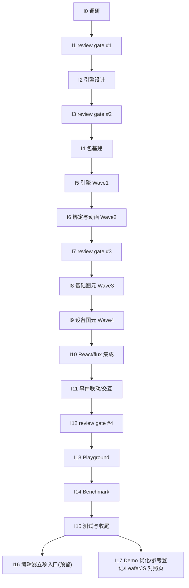

# Industrial HMI/SCADA Components Roadmap

> 最后更新：2026-08-05
> 来源：`docs/discussions/2026-08-03-industrial-hmi-scada-mission-scope-discussion.md`（范围讨论），后续调研报告 `docs/analysis/industrial-hmi/research-*.md`，设计文档 `docs/components/industrial-hmi/design-*.md`
> Mission：`missions/industrial-hmi.json`
> 目标：为 nop-chaos-flux 新增**工业组态（HMI/SCADA）运行时渲染**能力——高性能 Canvas 场景图引擎（LeaferJS 底座 + 自研组态语义层）+ 工业图元库 + 实时数据驱动 + 画面渲染组件（`scada-canvas`），对标 LeaferJS 官方性能档（数值官方自报，已由 I0 调研校准，见 `docs/analysis/industrial-hmi/research-download.md` §2.2；无 >30% 人工触发）

## 文档共识审查记录（本文件）

> 依据 Cross-Cutting「文档共识审查」条款，本文件定稿前须经独立子 agent 反复审查直到共识。记录如下：

- **Round 1（2026-08-03）**：独立 agent（fresh session）审查，判定 `REVISE`，20 条修正项（2 blocker / 6 major / 11 minor / 1 nit）。修正项全部落地或明确裁定（nit #20 保留原文）。证据：本文件头部 + 讨论文件头部 Round 1 记录。
- **Round 2（2026-08-03）**：独立 agent（fresh session）复审，判定 `REVISE`（轻量轮）——20/20 修正项真实落地，新增 3 项机械性问题：① `docs/logs/2026/08-03.md` 新条目未置顶（违反 reverse-chronological）；② Round 2 记录预写 `AGREE` 判定（应先于结论记录事实）；③ "已验证"措辞与"官方自报待 I0 校准"存在张力。修正项全部落地。
- **Round 3（2026-08-03）**：独立 agent（fresh session）复审，判定 `REVISE`（轻量轮）——2 项 minor：① 两份文件 Round 3 占位记录预写 `AGREE` 断言（预写判定反模式复发）；② 讨论文件 §九 待定事项仍引用 Round 2（已过期）。修正项全部落地（占位改中性 + §九 改 Round 3）。
- **Round 4（2026-08-03）**：独立 agent（fresh session）复审，判定 `AGREE`——零新增修正项，**达成共识**（共识循环：R1–R3 修正 3 轮 + R4 确认轮，未超轮次上限）。本文件可作为下游工作输入依据。
- **Round 5（2026-08-03，共识后增补验证）**：因执行安全考量新增「执行必读」节（防 mission-driver 执行 agent 只读 Phase Status/前半部而漏读后部 Cross-Cutting/Rule 条款），纯增补、不改既有条款语义。独立 agent（fresh session）focused 验证，判定 `AGREE`——增补与既有条款一致（编号/判据/阈值逐条吻合）、位置无 BULLET_RE 解析冲突、未破坏动态状态区唯一性；4 项低严重度建议中 3 项已采纳（执行必读头部措辞、Rule 4 引用补全、本记录回填），1 项裁量不采纳（"动画合帧"子约束因 Work Items I6.3/I14.2 已有呼应，核对清单定位为非穷尽）。增补定稿。
- **I1.1 review gate（2026-08-03，roadmap Rule 4 回写）**：独立 agent（fresh session，task `ses_03892d672ffeSeXQMQCUBFBIjo`）对照讨论文件 §八/§九 任务范围 + 5 份调研报告（`docs/analysis/industrial-hmi/research-*.md`）+ 差异清单执行终轮复核审查，判定 `pass-with-minors`——**零 Blocker，范围覆盖完整、选型（LeaferJS 底座 + 自研组态语义层）论证链成立**。修正项 3 项全部落地：`M-1`（Major）scada-apps §6 #9 动画表述修正（leafer 无帧动画/动画组队列类引擎、但过渡/路径动画原语已有——消除与 render-engines §8 #4 的跨报告矛盾）；`m-1`（Minor）scada-apps/summary 头部补「终轮复核说明」标准 bullet；`m-2`（Minor）本文件"待 I0 调研校准"过时表述回写（见「调研结论摘要」数值说明）。差异清单裁定：① SceneV 源码不可获取降级浅层、② 许可矩阵如实记录、③ 共识超轮（scada-apps 8 轮/summary 4 轮，全为行号/计数精度类 Minor、单调收敛）均**维持非阻断**；④ 性能数字观察项（内存 0% 余量 / 首屏 -36% 方向有利）**维持**交 I1.2 spike 实测仲裁。**I1.1 gate 达成共识（0 新增未落地修正项）**，I1 状态回写见 Phase Status。
- **I3.1 review gate（2026-08-03，roadmap Rule 4 回写）**：独立 agent（fresh session，task `ses_0382c18a7ffeF3m1lsPmGffiG7`）对照调研结论（I0.5）+ 项目架构文档 + 本 roadmap 全文 + 差异清单审查 4 份设计文档，产出 `docs/analysis/industrial-hmi/gate-2-review.md`，判定 `pass-with-minors`——**零 Blocker/零 Major，2 Minor 全部落地**：`m-1` 本文件总览依赖措辞回写（补 `@leafer-in/viewport@2.2.9` 必需依赖、移除过时"按需 `@leafer-ui/core`/`@leafer-ui/draw`"表述，对齐 design-engine.md §4.2/§12.2 与 I4 plan 清单）；`m-2` design-engine.md §4.6 组态 JSON 加载分解补全「渲染」分量（parse 23.4 + 实例化 88.5 + 渲染 ~67，口径 gate-1-review §3.2 #8）。差异清单裁定：① 依赖清单措辞需修正（m-1，I4 plan 已先行解析实现侧）；② 范围一致性（编辑器→I16/报警趋势/scada-symbol deferred 全链一致）、③ 顺序一致性（实现映射与依赖图逐项吻合）、④ 选型一致性（v2.2.9 锁定）、⑤ 性能包络一致性（11 行数字逐项对照，仅 m-2 分解遗漏）均**维持非阻断**。**I3.1 gate 作为 I2 设计文档「文档共识审查」终轮复核达成共识（m-1/m-2 落地后确认轮 0 新增）**，无人工确认触发（无范围/顺序/选型变化）；gate-2-review.md 自身经 3 轮共识审查达成 AGREE（R1 2 Minor + R2 N1 → R3）。I3 状态回写见 Phase Status。
- **I7.1/I7.2 review gate（2026-08-04，roadmap Rule 4 回写）**：独立 agent（fresh session，task `ses_037774c97ffekeQTBGto6crjFa`）对照 4 份 design-\*.md + I0.5 调研结论 + spike 工程（`~/sources/industrial-hmi-research/spike-leafer/`）审查 I5/I6 实现（契约一致性/序列化完整性/性能路径/测试覆盖 + leafer 真实 API 抽查），产出 `docs/analysis/industrial-hmi/gate-3-review.md`，判定 `revise`——**0 Blocker / 3 Major / 8 Minor**。3 项 Major 均为「单测全绿但真实 leafer 上不可用」的 live defect，共同根因是 `src/test-support/leafer-ui-mock.ts` 对事件载荷形状、`getByPoint` 返回值形状、zoomLayer 矩阵语义的错误建模掩蔽（I6 plan Failure Paths `leafer-event-api-drift` 触发）：`M-1` event-bridge 读 `event.point`（真实 leafer 事件数据为 `x`/`y`）→ symbol:click/dblclick/hover 永不发射；`M-2` hit.ts 未解包 `IPickResult.target` → 命中反查必失败；`M-3` `applyViewportState` 平移符号反（`move` 应传 `-(Δx)*scale`）→ setViewport/zoomAt/fit/center 反向平移且偏移翻倍。Minor 8 项：`m-1` onRender dirtyBlocks 恒 0（leafer 未暴露脏块计数，文档明示预留字段 I14 固化口径）；`m-2` `changedThreshold` 非 leafer 真实配置键（设计表述失真，修正为自研占位键）；`m-3` design-renderer.md:155 `ScadaConfigDiff.added` 类型笔误（设计写 `string[]`，实现为节点数组且语义正确，修正设计文档）；`m-4` validate 对 bindings/states/animations 仅容器级检查（补齐内部结构校验 + 回归测试）；`m-5` design-symbols.md §4.2 补 `dashOffset` 字段（flow 动画消费）；`m-6` getSymbolProps 返回 leafer 属性面（文档化，e2e 断言指南 I15.1 知悉）；`m-7` interactionLayer 惰性保留标注（sky 覆盖物归 I8.2/I11.2）；`m-8` config-adapter 逐节点 add vs spike batch.add（性能观察项，I14 复测对照，非缺陷）。leafer 真实 API 抽查 10 项：3 项 live-defect 漂移（事件载荷读取面、getByPoint 返回值、zoomLayer move 符号）+ 1 项无害漂移（changedThreshold）+ 1 项性能观察（batch add），其余 5 项一致（A1 tree viewport 固化/lazySpeard 拼写/事件名/forceRender/resize）。差异清单 10 项裁定：3 项实现缺陷（M-1/M-2/M-3）、2 项设计文档修正（m-2/m-3）、1 项文档同步（m-5）、1 项性能观察（m-8）、3 项一致无修正（createNormalizedActionEvent 归属 I11.1 裁定成立/I5 deferred 兑现/范围一致性）。**I5 遗留事项落地**：design-renderer.md:155 diff 类型笔误修正（m-3）、leafer 真实 API 抽查结论记录（gate-3-review §3，作 I14 复测口径基线）。**无人工确认触发**（修正项均为实现缺陷/文档笔误类，无范围/顺序/选型变化）。gate-3-review.md 自身经 3 轮文档共识审查达成 AGREE（R1 2 Minor+1 Nit → R2 3 项（F3 反向落地恢复）→ R3 确认轮 0 新增，未超轮次上限）。I7.2 修正全部落地（M-1/M-2/M-3 代码修正 + mock 面修塑 + 回归测试；m-4 校验补齐 + 3 组回归用例共 18 个非法形态断言；文档 m-1/m-2/m-3/m-5/m-6/m-7 回写；m-8 归属 I14），包级 273 tests / 20 files 全绿、coverage 阈值 90 达标，workspace 全量验证（typecheck/build/lint/test）全绿。I7 状态回写见 Phase Status。
- **I12.1/I12.2 review gate（2026-08-04，roadmap Rule 4 回写）**：独立 agent（fresh session，task `ses_0366f8601ffeTHct9ttCroe5g5`）对照讨论文件 §八（8 条最终决策）+ 4 份 design-\*.md 终态 + I0.5 调研结论 + `renderer-boundary-audit.md`（I10 五边界审计结论，INV-1–INV-5 + D-1 契约裁定）+ `gate-3-review.md`（§10/§11）审查 I8–I11 实现（功能完整性/性能/测试/文档四面），产出 `docs/analysis/industrial-hmi/gate-4-review.md`，判定 `pass-with-minors`——**零 Blocker/零 Major，3 Minor 全部落地**：`m-A` design-engine.md §4.4 视口钳制锚点措辞「视口中心」→「视口原点世界点」（与命令路径/M-3 推导口径一致）；`m-B` use-scada-config-sync 初始视口策略收窄至 full（reset）路径（diff 增量不重应用、绑定域重建不重复执行）+ 回归测试；`m-C` InteractionOverlay 覆盖物几何按 points 包围盒兜底（line/arrow/polygon 无宽高语义 0 尺寸退化）+ 最小框 + 回归测试。**gate-3-review §10 归属核对结论**：前 6 项（五边界审计/onReady/onError 桥接/component:\* 句柄/wheel/pinch 钳制/hover 覆盖物/flow 消费）全部兑现确认、后 2 项（1 万点批量合并断言+batch.add→I14、e2e 补强→I15.1）归属记录核对无误；M-1/M-2/M-3 修复未在 I8–I11 演化中回退（mock↔真实漂移面无回退、无新漂移）。I5/I6 M-1/M-2/M-3 修复复核未回退（event.x/y、IPickResult 解包、-(Δx)\*scale 符号均保持）。**I12 注意项清单**产出（14 行，供 I13/I14/I15 复用：I14×6/I13.1×3/I15.1×2/I15.2×2/I16×1 + 复合归属 1 行）。**无人工确认触发**（修正项均为文档措辞/行为边界类 Minor，无范围/顺序/选型变化）。gate-4-review.md 自身经 2 轮文档共识审查达成 AGREE（R1 2 Nit 落地 + 3 Nit 反向落地驳回 → R2 确认轮 0 新增，未超轮次上限）。I12.2 修正全部落地（m-A 文档回写；m-B/m-C 代码修正 + 2 个 focused 回归测试），包级 452 tests / 34 files 全绿、coverage 阈值 90 达标，workspace 全量验证（typecheck/build/lint/test）全绿。I12 状态回写见 Phase Status。
- **P1 remediation 轮 plan `{1}` 执行完成（2026-08-04，2026-08-04-1235-1-hmi-diff-path-convergence-plan）**：diff 路径收敛与双写源调和三 Phase 全部落地——Phase 1 diff 契约（同 id type 变更 → removed+added、children→undefined → `children: []` patch）、Phase 2 ConfigAdapter（applyDiff removed→added→updated 顺序 + nodeById 索引/声明随 applyUpdate 收敛，type-change remove-then-rebuild）、Phase 3 importConfig 汇入 props 同步链（`syncImported` + skip-next 防回刷 + change 基准 onBuilt）。multi-audit P1-4（nodeById 过期）、P1-5（importConfig 双写源）、open-audit P1 type-drop 三项 confirmed live defect 已修复并各带 focused 回归测试（diffScadaConfig type-change/children-removal、config-adapter type-change/declarations-sync、import-then-edit 幂等 + import 无 props 恢复 ready）；包级 468 tests / 34 files 全绿、workspace 全量验证（typecheck 32/32、build 32/32、lint 32/32、test 59/59）全绿。`design-renderer.md §4.3` diff 契约已同步。plan `{2}`/`{3}`（lifecycle wiring / display-math manifest）继续收口其余 P1。
- **P1 remediation 轮 plan `{2}` 执行完成（2026-08-04，2026-08-04-1235-2-hmi-lifecycle-wiring-plan）**：首帧/生命周期 wiring 五 Phase 全部落地——Phase 1 首帧绑定刷新（`reloadBindings` 重建后无条件 `requestRender` 首同步，静态/表达式点绑定/状态色/`when:'always'` 动画首帧生效，P1-2）、Phase 2 ready 恰一次（change 基准守卫计数测试收口 mount/full(importConfig)/非空 diff/宿主重传同值新对象四场景，P1-3；守卫代码随 plan `{1}` 已落地）、Phase 3 `config.background.color`/`config.viewport {x,y,scale}` 接线（reset/同步期，props viewport policy 显式优先，grid watch-only，open P1-A）、Phase 4 `StateVisualApplier` 接线进 `createBindingDomain`（随 pipeline 重建重新 attach，部分声明故障退出恢复 base 样式，open P1-B）、Phase 5 flux 数据错误降级（按声明跳过 + 同表达式去重上报 + 切断 canvas status 链路，scope 修复自动回流，P1-8）。multi-audit P1-2/P1-3/P1-8 与 open-audit P1-A/P1-B 五项 confirmed live defect 已修复并各带 focused 回归测试（lifecycle 6 例 + bridge dedup 1 例，`scada-handles` 表达式点首帧快照断言同步）；包级 475 tests / 35 files 全绿、workspace 全量验证（typecheck/build/lint/test）全绿。`design-renderer.md §4.2`（background/viewport 接线 + grid watch-only）与 `§8.1`（ready 按构建触发 / 数据错误不升级 error）已同步 live baseline。plan `{3}`（display-math manifest）继续收口其余 P1。
- **P1 remediation 轮 plan `{3}` 执行完成（2026-08-04，2026-08-04-1235-3-hmi-display-math-manifest-plan）**：显示/交互数学 + manifest 硬门四 Phase 全部落地——Phase 1 `check:workspace-manifest-deps` 本包 0 undeclared（devDependencies 补 `@nop-chaos/flux-formula`/`@nop-chaos/flux-runtime` 2 项，P1-1）、Phase 2 初始视口公式修正（fill/center 分支改为 `vx = cx - sw/(2s)` 语义，center 委托 `engine.center(bounds)`，fill 保留 max-scale 不降级 contain，非巧合几何精确断言，P1-6）、Phase 3 覆盖物 screen 坐标绘制（x/y 经 `getViewportPoint` 换算、宽/高乘 scale、strokeWidth 保持屏幕像素）+ `refresh()` 双钩子（命令路径 `applyViewportState` + 插件 zoom/move sync 路径）+ 覆盖物 Group `hittable: false` 防 sky 层吞 tree 指针事件（P1-7）、Phase 4 `zoomLayer.scaleOfWorld` 锚点空间修正（`applyViewportState` 与 `handlePluginZoom` 兜底均传 **screen 空间**锚点 `{x:0,y:0}`，旧实现传内容坐标锚点产生 `(vx·(1-k), vy·(1-k))` 漂移且被 mock 掩蔽）+ `leafer-ui-mock` 按 leafer-ui@2.2.9 真实 `zoomOfLocal` 语义建模 x/y 锚定副作用（P1-9）。multi-audit P1-1/P1-6/P1-7/P1-9 四项 confirmed live defect 已修复并各带 focused 回归测试（manifest 门复跑 / lifecycle 视口精确断言 3 例 / engine overlay 对齐-刷新-非命中 5 例 + e2e 1 条 / engine 矩阵级 2 例 + e2e 矩阵断言 1 条，e2e 断言升级含 edge-cases 多边形覆盖物改 screen 坐标）；包级 483 tests / 35 files 全绿、workspace 全量验证（typecheck/build/lint 32/32 + test 59/59）全绿、scada e2e 25/25 全绿（全量 e2e 除既有 gantt 基线失败 1 条外全绿——该失败经 HEAD stash A/B 证实 pre-existing，与本 plan 无关）。`design-engine.md §4.4`（scaleOfWorld 锚点空间 P1-9）与 `§6`（覆盖物 screen 坐标/refresh/hittable P1-7）已同步 live baseline。
- **post-remediation audit plan `2026-08-04-2242-2` 执行完成（2026-08-05，2026-08-04-2242-2-hmi-config-xy-bounds-contract-plan，✅）**：open-audit `[P1]` x/y 三层契约漂移（type 必填 ↔ validator 可选 ↔ runtime-consumer 无默认 → 省略 x/y + viewport fit → NaN viewport → 静默空白 ready 画布）收口。两 Phase 全部落地——Phase 1 Decision（裁定「可选 + 默认 0」+ 一致性论证）+ Proof-1/2/3 失败用例先行（bounds 有限 / viewport fit 有限 / clampViewport NaN→0，经 `as ScadaSymbolNode` 绕过必填类型构造省略 x/y 节点）；Phase 2 Fix-0 `config-types.ts` `x?`/`y?` 改可选（与同接口 width/height/rotation/scale 对齐）+ Fix-1/2 `boundsOfNode`/`boundsFromCustomPoints` `?? 0`（镜像 interaction-overlay.ts:43-44）+ Fix-3 `clampViewport` 加 `Number.isFinite` 防御非有限 x/y（关闭仅钳 scale 的 position 放大器）+ Fix-4 `config-adapter.ts` Group 构造 `?? 0`（leaf 路径经 symbol defaults + `deepMergeInstanceProps` undefined-skip 已安全，裁定不需补，扫描清单入 plan）。三层契约读法收敛一致（type 可选 + validator 可选 + runtime 默认 0），两「node geometry」consumer（bounds/interaction-overlay）不再矛盾。`design-renderer.md §4.2` x/y 改可选 + 默认 0 注记已同步。Proof 三组由红转绿；包级 570 tests / 41 files 全绿、workspace 全量验证（typecheck/build/lint 32/32 + test 59/59）全绿。closure-audit 由独立 fresh-session sub-agent（task `ses_0322c7a16ffeRLPgu2ZntwSI0z`）执行，verdict `approved`。open-audit `Audit Status: planned → closed`。
- **lifecycle/destruction hardening plan `2026-08-04-2243-1` 执行完成（2026-08-05，2026-08-04-2243-1-hmi-lifecycle-destruction-pipeline-hardening，✅）**：multi-audit dim 04/07 六项 P2（L1-L6 销毁门控/双销毁/重载泄漏/handle 抖动）+ open-audit W3 状态样式双写共七项 in-scope finding 收口。三 Phase 全部落地——Phase 1 销毁门控对称（`DirtyCollector` collect/flush/flushFrame/requestRender + `RefreshPipeline` requestRender/flushFrame destroyed 后全 no-op；`releaseRuntime` collector 单一 owner = `pipeline.destroy()`，移除冗余 `collector.destroy()`）+ Proof 三组（collector/pipeline destroyed no-op + collector 销毁计数=1）；Phase 2 重载泄漏收口（`pendingSkipRef` 计数器改 per-import nonce single-use 消除身份巧合误 skip 泄漏 + `lastReportedErrors` 与 `compiledCache` 对称清空使 config reload 后同表达式错误重报）+ Proof 两组（nonce 无泄漏 + reload 同表达式重报）；Phase 3 handle 稳定 + 合帧 owner（`reloadConfig` 包 `useCallback` 稳定身份 + W3 裁定方案 (a)：active-state 样式 owner=`collectStates`、revert owner=`StateVisualApplier` 经同一 `collector.collect` 合帧，`visual-state` 不再 immediate 写 active，alarm-storm 收敛为 1 applyAttrs/帧）+ Proof 两组（handle 注册不随渲染递增 + alarm-storm applyAttrs≤帧数）。`design-engine.md §4.2` 销毁门控对称 + `design-data-binding.md` 合帧 owner 描述已同步。包级 580 tests / 41 files 全绿、workspace 全量验证（typecheck/build/lint 32/32 + test 59/59）全绿。closure-audit 待独立 fresh-session sub-agent 执行（执行 session 不自审）。Follow-up：W1 表达式订阅诊断 deferred（successor 见 plan）。
- **geometry/viewport/data-path correctness plan `2026-08-04-2243-2` 执行完成（2026-08-05，2026-08-04-2243-2-hmi-geometry-viewport-data-path-correctness，✅）**：multi-audit dim 21 四项 P2（D1-D4 显示几何/视口）+ open-audit dim 22 两项 P2（W4 setPointValue 守卫 + W5 diffScadaConfig 深相等）共六项 in-scope finding 收口。三 Phase 全部落地——Phase 1（D1+D2）：`ScadaSymbolDefinition` 增 `defaultGeometryPoints` resolver（polygon 导出 `DEFAULT_TRIANGLE`、line/arrow 由 width/height 派生），`boundsOfNode` 无显式 custom.points 时 consult 定义默认几何算包围盒（fit 不冲 MAX_SCALE）；base `text.ts` 自动宽下按内容测量（canvas 2d measureText + 0.6em/char fallback）设 width + 对齐锚偏移使居中生效；Phase 2（D3+D4）：核实 leafer-in viewport `ZoomEvent.ZOOM` 经 `getZoomEventData` 透传指针 screen 坐标，`handlePluginZoom` 钳制改光标锚（光标下内容固定、超界无偏移），缺坐标回落 `{0,0}`（P1-9 命令路径不变式）；D4 维持 viewport prop 不对称现状契约（`design-renderer.md §8.3` 已标注，不新接 effect）；Phase 3（W4+W5）：`isScadaPrimitive` 从 bridge 导出，`setPointValue` handle 复用校验非原始值返 `{ok:false}`；`valuesEqual` 改 own-keys 递归 stable deep-equal（key 序不影响判等）。`design-engine.md §4.4`（D3 光标锚）+ `design-renderer.md §8.5`（W4 失败路径）同步。包级 606 tests / 42 files 全绿、workspace 全量验证（typecheck/build/lint 32/32 + test 59/59）全绿。closure-audit 由独立 fresh-session sub-agent（task `ses_031eb2b3dffeqK21aYXa7Wgvy0`）执行，verdict `approved`。Follow-up：D2 浏览器像素验证 watch-only residual（无 successor）、W1 表达式订阅诊断 deferred（successor 见 plan `{2243-1}`）。
- **verification fidelity / public surface / doc-drift hardening plan `2026-08-04-2243-3` 执行完成（2026-08-05，2026-08-04-2243-3-hmi-verification-fidelity-public-surface-doc-drift，✅）**：multi-audit dim 14/23 六项 P2（T1-T6 验证 fidelity）+ dim 03 一项 P2（A1 公共面泄漏）+ dim 16 三项 P2（Doc1-Doc3 文档漂移）+ dim 22 一项 P2（W2 死代码）共十一项 in-scope finding 收口。三 Workstream 全部落地——WM1 mock fidelity（T1：`MockLeafer extends MockZoomLayer` + `get zoomLayer(): this` 对齐真实 `tree.zoomLayer === tree` 身份；T2：`MockLeaf` 加 `getBoundsToWorld`/`getBounds`/`worldBox` 抛「mock 不建模 bounds API」错）+ mock-invariant 单测；WM2 e2e 断言加固（T3/T4：pressure-demo 10k/overview-restore + perf memory/10k-refresh 全成功 ready 路径补 `assertScadaCanvasRendered` 硬门；T5：像素探测改扫**全部** canvas——旧实现只读 ground 透明背景层漏掉 tree 已绘内容——非空场景 `fallback-all-zero` 判失败，`allowZeroPixels` 例外通道用于已知 off-content 视口；T6：5 处 `not.toThrow()` 弱断言换副作用负向断言 + 删重复 `computeSymbolBounds([])`）；WM3 公共面/死代码/文档（A1：`IndustrialRendererSchema` 从 `index.ts` 公共面移除；W2：`ConfigAdapter.setConfig` 死代码删除；Doc1：§10 loading/error marker 改 `nop-scada-canvas-loading`/`nop-scada-canvas-error`；Doc2：§6 retire `scada-canvas-overlay` slot 引用；Doc3：§8.3 ScadaTestHandle 补 `setPointValues?`/`measureAddStrategies?`）。包级 612 tests / 43 files 全绿、workspace 全量验证（typecheck/build/lint 32/32 + test 59/59）全绿、scada e2e（pressure-demo 3/3 + perf 5/5 + demo/edge-cases 18/18）全绿。closure-audit 由独立 fresh-session sub-agent（task `ses_031cbf1bcffeusatLqH7U1VFfY`）执行，verdict `approved`。Follow-up：W1 表达式订阅诊断 deferred（successor 见 plan `{2243-1}`）、mock bounds API 升级为确定性建模为 optimization candidate。
- **复杂 flux 表达式订阅 `flux-deps-empty` 诊断 plan `2026-08-05-0325-1` 执行完成（2026-08-05，2026-08-05-0325-1-hmi-flux-deps-empty-diagnostic，✅）**：roadmap Follow-up Backlog W1（源审计 `2026-08-04-2242-multi-audit` §Wiring `[P2]`）收口——复杂表达式（`${analog.temp + 1}` 类）在平台依赖收集 probe 失败时 `extractExpressionDepsViaProbe` 静默返 `[]` → `useScopeSelector` disabled → 表达式永不随 scope 更新且对 author 不透明（successor 从未创建，本 plan 即该 successor）。两 Phase 全部落地——Phase 1 failing-first（stub compiler 注入返空 deps，断言一次性 `flux-deps-empty` + 重复不重报 + 不升 status，纯字面量 `${1 + 2}` 负向不触发）；Phase 2 检测+上报+注册表+i18n+文档（`expressionReadsScope` 谓词 + `analyzeFluxSubscriptions` 返 `{paths, depsEmptyExpressions}`，`extractFluxScopePaths` 降为薄包装；`useScadaPointsBridge` 经 `reportOnce` 一次性上报 `flux-deps-empty`；`reportDiagnostic` 纳入 `monitor.onError` expression-phase 分支；`SCADA_ERROR_CODES` + i18n en-US/zh-CN 登记；`design-data-binding.md §9.1` + `design-renderer.md` 同步）。包级 615 tests / 43 files 全绿、workspace 全量验证（typecheck/build/lint 32/32 + test 59/59）全绿。closure-audit 由独立 fresh-session sub-agent（task `ses_031ab60a1ffe2237OQfRFMkRdE`）执行，verdict `approved`。**Follow-up Backlog W1 全部收口**（底层缺陷未处理的最后一项已落地）。
- **Follow-up Backlog 标注漂移回写 hygiene plan `2026-08-05-0653-1` 执行完成（2026-08-05，2026-08-05-0653-1-hmi-roadmap-backlog-annotation-consistency，✅）**：纯文档 hygiene pass——`2026-08-04-2242` post-remediation 子节 State & lifecycle（L1-L6，roadmap:444-449）+ Wiring W3（roadmap:462）共 7 条 per-line 条目底层缺陷实际已由 plan `2026-08-04-2243-1` 三 Phase 收口（Phase 1 L1-L3 销毁门控对称、Phase 2 L4-L5 重载泄漏、Phase 3 L6+W3 handle 稳定+合帧 owner），但 per-line `已由 plan ... 收口` marker 从未回写（漂移由 plan `2026-08-05-0325-1` line 156 显式登记为 deferred，本 plan 即该 deferred 的 hygiene owner）。本 pass 逐条补齐 marker（格式与同节兄弟条目 D1-D4/W4/W5 等对齐：`plan + Phase + (Lx/W3) + 一句话落地摘要`）+ 全节扫描兜底（69 条 backlog bullets 全部带 marker，无其他缺口）。纯文档计划，无代码变更，无 Phase Status / Work Items / Dependency Graph / Cross-Cutting / Rule 正文语义改动。
- **I17 work item 立项登记（2026-08-05，✅ Rule 3 结构性调整经人工确认）**：本日 scada-demo 美观度 review（用户反馈「画面画乱」），对照 LeaferJS 官方示例库（`https://www.leaferjs.com/examples/` + `/playground/`）与本地 meta2d.js / FUXA 工业组态参考资源后，发现 4 类问题（scada-demo 硬编码坐标 / LeaferJS 官方示例对照未登记 / 工业组态图元第三方参考未登记 / playground 缺 LeaferJS 原生能力对照页）。**经人工确认（Rule 3 结构性调整 = 新增 work item 须人工确认）**：4 类问题合并为 **I17 work item** 立项（合一轻量工作项 = 一个 execution plan 的交付范围），写入 `## Phase Status` / `## Work Items` / `## Phase Details` / `## Dependency Graph`。**编辑器实现不塞入当前 mission**——按 `missions/industrial-hmi.json` 「editor deferred to a successor mission」描述与 `editor-initiation.md` 立项材料，编辑器后继 mission 独立编排，本次不动 I16 范围与立项入口状态。I17 不引入编辑器交互、不破坏 runtime 契约、不动 Phase Status 已有 I0–I16 行。原 Follow-up Backlog 临时登记子节（同日先登记后升级）已删除避免双写，发现追溯以此处为准。**未跑独立 sub-agent 共识审查**：本次为 roadmap 编排层结构性调整（Rule 3 人工确认已落实），非 contract 章节新增，按 Rule 5「文档共识审查」覆盖范围（contract / 设计文档 / plan / review gate / 立项材料）不触发；若后续 I17 起草 execution plan，按 plan 共识审查条款执行（独立子 agent 审查直到共识）。
- **follow-up 决策锁定（2026-08-05，✅ 7 项逐一确认）**：对 roadmap 全文 follow-up / deferred / watch-only residual / optimization candidate / Deferred But Adjudicated 类延迟项做完整盘点（Follow-up Backlog 84 条已全部带「已由 plan XXX 收口」标记，无未收口项；真正待决策的延迟项分布在 7 处），经人工逐一确认锁定如下：① **I16 编辑器后继 mission — 启动 + 先跑三项 spike**（viewport+Editor 共存手势仲裁 / Editor 事件族衔接 / 编辑态覆盖物密集场景性能，`editor-initiation.md §4.3`），编辑器 mission 独立编排（新 mission 文件 + 新 roadmap）；② **mock bounds API 确定性建模 — 保持抛错防御现状**（plan `2026-08-04-2243-3` T2 optimization candidate，未来编辑器交互层大量调 leafer bounds API 时再合并升级）；③ **平台 collector 复杂表达式支持 — 保持薄包装现状**（plan `2026-08-05-0325-1` out-of-scope improvement，scada 域内 `analyzeFluxSubscriptions` 可消费平台能力即可，不在本 mission 改 flux-runtime 包）；④ **D2 浏览器像素验证 — 保持 watch-only 状态**（plan `2026-08-04-2243-2` watch-only residual，attrs 级单测 + happy-dom measureText fallback 已覆盖，浏览器像素级 e2e ROI 低）；⑤ **scada-image 画布级诊断 — 维持现状**（open-audit `[P2]` Deferred But Adjudicated 后置 I16，与 P1-8「不升级 status」契约一致，编辑器 mission 时代统一资源面诊断）；⑥ **lastError 跨配置完整语义 — 维持表达式级去重现状**（plan `{2}` Phase 5 residual，主体缺陷已收口，plan `2026-08-04-2243-1` L5 补 reload 清空后影响更小）；⑦ **batch.add 性能观察项 — 确认 I14 已复测、关闭此项**（gate-3 m-8 归属 I14，benchmark-report.md §3.1 已含实例化 88.5ms 拆解 + batch-add-probe 项目，复测对照已隐隐完成）。**②–⑦ 锁定为「保持现状」= 不再独立 plan 推进**，相关条目保持在 Follow-up Backlog / plan 共识审查记录的可追溯位置；未来若上游变化（如 leafer-ui v3 升级 / 编辑器 mission 推进触发依赖）需重开决策，按 Rule 3 结构性调整经人工确认。**① 编辑器 mission 启动**为本次决策唯一推进项，独立编排（新 mission 文件 + 新 roadmap + 三项 spike plan），不在当前 industrial-hmi mission 加 work item。
- **编辑器后继 mission 启动（2026-08-05，✅ 编排层产物全部起草完成）**：① 编辑器 mission 启动决策（follow-up 决策锁定 ①）落地，三份编排层产物全部起草完成——`missions/industrial-hmi-editor.json`（mission 配置，commit format `feat(industrial-hmi-editor):`，对齐 industrial-hmi.json 字段集）、`docs/components/roadmap-industrial-hmi-editor.md`（11 阶段 E0–E10：E0 三项 spike / E1 选型 gate + 编辑态包络确认（R1+R7 人工确认） / E2 编辑器设计 6 份 design-\*.md / E3 设计 gate / E4 包基建（包结构裁定） / E5 M1 MVP 实现 / E6 M1 gate / E7 M2 连线+undo-redo / E8 M2 gate / E9 M3 工具箱+收尾 / E10 M3 gate + 整体收尾；5 个固定 review gate 对齐 runtime mission 4-gate 先例；10 项 runtime 复用点全部 live 核对入 Cross-Cutting 复用表）、`docs/plans/2026-08-05-1645-1-editor-spike-three-verifications.md`（E0 spike plan，4 Phase：E0.1 手势仲裁 / E0.2 事件族载荷 / E0.3 性能 / Phase 4 整合 + 共识审查；scratch 目录 `~/sources/industrial-hmi-research/spike-editor/`，禁以 mock 推断真实 API，对齐 gate-3 §3 + bugs/76 教训；Failure Paths 含 spike-gesture-fail / spike-event-drift / spike-perf-fail / spike-mock-leak；纯文档 + scratch plan，Closure Gates 按 plan guide「纯文档计划」条款移除 typecheck/build/lint/test）。② **未跑独立子 agent 共识审查**：roadmap + spike plan 均为首版 draft，按 editor mission Cross-Cutting「文档共识审查」+ Rule 5，**roadmap 与 spike plan 起草完成后、E0 spike 执行前必须先达成共识**（独立子 agent fresh session，≤3 轮，超限升级人工）；本会话为起草阶段，共识审查未启动，留给下一会话或人审决策。③ **当前 industrial-hmi runtime mission 不受影响**：I0–I17 状态全部不动（I17 demo 优化仍 `todo`，可继续推进；编辑器 mission 启动为独立 mission，不塞入 runtime mission）。④ **未跑 workspace 验证**：三份产物均为编排层文档（mission json + roadmap md + plan md），无产品代码变更；typecheck/build/lint/test 不适用。
- **2026-08-05-0653 post-remediation audit P1 remediation plan `2026-08-05-0653-2` 执行完成（2026-08-05，2026-08-05-0653-2-industrial-hmi-audit-p1-remediations，✅）**：两份 0653 审计（open-ended adversarial + multi-dimensional）共 4 条 P1 全部收口。四 Phase 全部落地——Phase 1 拆分 2 个超限测试文件（`scada-points-bridge.test.tsx` 769→主+诊断、`scada-engine.test.ts` 718→主+plugin-sync+events-declarations，5 文件均 <700，恢复 oversized 硬门禁）；Phase 2 修复 `diffScadaConfig` 丢弃 `flow` 字段（`SYMBOL_KEYS` 机械补 `'flow'`，open P1-1，failing-first 5 用例 + 集成 proof 2 用例：diff→engine.applyDiff→pipe-junction.applyProps 链路贯通）；Phase 3 修复 `scada-sensor-control-indicator` 绘制顺序（复合子序 swap `[lamp,housing]`→`[housing,lamp]`，open P1-2，housing 背景层/lamp 上层状态色可见，z-order 可观测 proof 3 用例经 mock children 入序断言关闭「mock 盲于 z-order」类）；Phase 4 修复 W3 revert 覆盖同帧 binding 值（`StateVisualApplier.applyState` revert 分支检测 `instanceBindings?.[key]` 跳过有 binding 的字段，multi P1-1，failing-first 扩展 alarm-storm frame 3 fill-value 断言 + 聚焦回归 3 用例，W3 Decision 注记补 binding-vs-revert 三路裁定，`design-data-binding.md §4.3` 同步）。包级 628 tests / 46 files 全绿、workspace 全量验证（typecheck/build/lint 32/32 + test 59/59）全绿、`pnpm check:oversized-code-files` industrial 包 0 失败（16→14 ERROR）。open-audit P1-1/P1-2 + multi-audit P1-1/P1-2 四项 confirmed live defect 已修复并各带 focused regression proof（断言结果值/可见性）。源审计 `Audit Status: planned → closed`（两份）。15 P2 已在 roadmap Follow-up Backlog「2026-08-05-0653 post-remediation audit P2」子节追踪，按 mission 节奏择期处理。
- **2026-08-05-0653 post-remediation audit P2 收口（binding/state pipeline 分支）plan `2026-08-05-0653-3` 执行完成（2026-08-05，2026-08-05-0653-3-hmi-binding-state-resolution-correctness，✅）**：open-audit 5 项 P2 silent-defect（B1-B5，均「通过 validate 但运行期静默产出错误视觉/状态/数据归属结果」）收口。三 Phase 全部落地——Phase 1（B1+B2）：`bind-resolver.ts` `resolveBinding` 引入文本类属性集合（`text`/`fill`/`stroke`/`textColor`），仅这些 property 施加 format，`visible:false` 绑定真正隐藏图元（B1，open P2-4）；line/arrow/pipe 增 `applyProps` 从 width/height 重算 points 写回 `node.points`（pipe 补齐 `defaultGeometryPoints`），绑定产出可见几何响应（B2，open P2-8，Decision 裁定方案 (a)）；Phase 2（B3）：`value-to-state.ts` `defaultState` 命名偏好链（run→normal→off→首键）+ `ScadaStateDeclaration.stateSource?`（格式 `"pointId"` 或 `"pointId.property"`）显式 state-driver，`dirty-collector.ts` 优先 consult `declaration.stateSource`，validator 校验引用合法（B3，open P2-5）；Phase 3（B4+B5）：declaration 级 `scale.expression` 经 validator 拒绝并指向 binding-scale（Decision 裁定方案 (b)，同时关闭 `point-store.convert` 与 `value-to-state.applyLinearScale` 两处 drop site，B4，open P2-7）；`applyValue` 改用 `EventHub.emitWith` 携 per-emit 闭包捕获当前 pointId，消除 `lastNotifyPointId` 可变字段（字段已删除），re-entrant 写下错误始终归属正在派发的 pointId（B5，open P2-9）。每项 Fix 前先落 failing-first Proof（红→绿）。`design-data-binding.md`（format 适用域 + scale 消费语义 + state 偏好语义）+ `design-symbols.md`（points-based 形 width/height 绑定契约）同步 live baseline。包级 640 tests / 46 files 全绿、workspace 全量验证（typecheck/build/lint 32/32 + test 59/59）全绿。open-audit P2-4/P2-5/P2-7/P2-8/P2-9 五项 confirmed live defect 已修复并各带 focused regression proof（断言结果值/可观测行为）。剩余 10 项 P2（multi P2-1~P2-6 + open P2-1/P2-2/P2-3/P2-6）仍在 Follow-up Backlog 追踪，归 sibling plan `2026-08-05-0653-4`（config-build/诊断通道分支）或后续 mission 节奏。
- **2026-08-05-0653 post-remediation audit P2 收口（config-build/equality/诊断通道分支）plan `2026-08-05-0653-4` 执行完成（2026-08-05，2026-08-05-0653-4-hmi-config-build-equality-diagnostic-fidelity，✅）**：0653 audit 剩余 4 项 P2 silent-defect（C1-C4，均「静默丢失信息」——config-build Group 降级丢 leaf attrs / 序列化相等 key 序敏感产冗余 override / 诊断通道丢 error stack/cause / probe 塌缩产 flux-deps-empty 误报）收口。三 Phase 全部落地——Phase 1（C1，open P2-3）：`validate.ts` 增 `children` 仅 `scada-group` 约束（fail-fast，错误消息可观测）+ `config-adapter.ts:84` `isContainer` 收紧为 `node.type === GROUP_CONTAINER_TYPE`（defense-in-depth，叶子带 children 按 leaf 构建保 fill/stroke/width/height）；Phase 2（C2，open P2-6）：新建 `serialization/equality.ts` 导出 `deepEqual(a, b)`（own-keys 递归 stable），`diff.ts valuesEqual` + `compound.ts deepEquals`（已删除）共享之，消除 compound 路径 W5 同类隐患；Phase 3（C3 multi P2-4 + C4 multi P2-6）：`UseScadaPointsBridgeArgs.onError` 签名 `(code, message)` → `(code, message, error?)`，`reportOnce` 透传 error，`reportDiagnostic` 用 `new Error(message, { cause: error })` 包装供 `env.monitor.onError`（host 监控可经 `Error.cause` 定位 formula 源）；`extractExpressionDepsViaProbe` 返 discriminated result（`ok/compile-failed/create-state-failed/evaluate-failed/deps-empty`），`analyzeFluxSubscriptions` 仅 `deps-empty` 入诊断集（消除失败表达式 flux-deps-empty 误报 + flux-compile-failed 真报双报）。每项 Fix 前先落 failing-first Proof（红→绿）。`design-renderer.md`（Group 降级契约 + cause 语义）+ `design-data-binding.md`（probe result 语义）同步 live baseline。包级 647 tests / 46 files 全绿、workspace 全量验证（typecheck/build/lint 32/32 + test 59/59）全绿。open-audit P2-3/P2-6 + multi-audit P2-4/P2-6 四项 confirmed live defect 已修复并各带 focused regression proof（断言结果值/可观测行为）。closure-audit gate 待独立 fresh-session sub-agent 执行（执行 session 不自审，AGENTS.md human gate）。剩余 6 项 P2（multi P2-1/P2-2/P2-3/P2-5 + open P2-1/P2-2）为 doc/test-hygiene/perf 类，留 backlog 按 mission 节奏择期处理。

## Purpose

本文是工业组态能力的长期开发路线图。**范围已由人审确认（2026-08-03 讨论）**：运行时引擎优先，组态编辑器后置为后继 mission（I16 预留立项入口，不实现）。每个工作项（work item）是一个 execution plan 的合理交付范围。

AI 或维护者读完本文即知哪些工作项未开始（`todo`）、已计划（`planned`）、已完成（`done`），无需重走全部设计文档。

**本文是编排层，不是 execution plan，也不是设计契约。** 设计契约看 `docs/components/industrial-hmi/design-*.md`。

## 执行必读（Executors MUST Read）

> mission-driver 的 DRAFT prompt 要求完整阅读本文件（`Read {{roadmapPath}} completely`）。**必须全文阅读**，禁止只读 Phase Status / 前半部分就起草 plan——本文件**后半部分**（Work Items 细节、Phase Details、Dependency Graph、**Cross-Cutting、Rule**）包含对执行者有约束力的条款。执行前强制核对以下关键约束（原文条款为权威，此处仅集中核对；部分约束在 Work Items 中亦有呼应）：

1. **文档共识审查**（Cross-Cutting 第 1 条 + Rule 5）：本 mission 所有 AI 编写文档必须经独立子 agent 反复审查直到共识（判据：连续一轮零新增修正项；编写者不得单方拒绝修正项；上限 3 轮超限升级人工；review gate = 对应阶段文档共识的终轮复核，不叠加）。
2. **review gate 纪律**（Cross-Cutting 第 2 条）：I1/I3/I7/I12 四个 gate 由独立 agent（fresh session）执行，输入 = 任务范围 + 上游产物 + 差异清单；修正项落地后 gate 才可标 `done`。
3. **人工确认阈值**（Cross-Cutting 第 4 条）：引擎选型变更 / `scada-canvas` 公共契约重大变更 / benchmark 不达标 / 共识循环超 3 轮 / 编辑器提前启动——必须停下标记人工决策。
4. **性能红线与测试纪律**（Cross-Cutting 第 6-7 条）：点表刷新合并帧 + 脏属性收集，禁止逐点 setState 直刷 React；canvas 渲染一律 Playwright 程序化断言（测试句柄 `window.__flux_scada_<cid>` 读场景树），禁用截图判定，不引 node-canvas。
5. **平台能力复用表**（Cross-Cutting 第 3 条）：`useScopeSelector`/`useActionDispatcher`/`createNormalizedActionEvent`/registry/formula compiler/i18n/ui 等既有能力禁止重复实现。
6. **状态写回纪律**（Rule 1-4）：状态仅由 plan 生命周期驱动；不得跳序/新增 work item；结构性调整标记人工确认；**review gate 修正项必须回写本 roadmap（Rule 4）**。

## Phase Status

> **全文件唯一的动态状态区。**
> 状态流转：`todo` → `planned`（draft review 通过）→ `done`（closure audit 通过）。
> 本 mission 固定 4 个 **review gate**（I1/I3/I7/I12）：每个 gate 由独立 agent（fresh session，不复用执行上下文）对照上游产物审查，输出修正项并落地回写；修正若涉及范围/顺序/选型变更，标记为需人工确认项并暂停推进。

- **I0. 调研与源码下载** (`done`)
- **I1. 设计回顾与修正 #1 —— 调研结论 gate** (`done`)
- **I2. 通用引擎层设计文档** (`done`)
- **I3. 设计回顾与修正 #2 —— 引擎设计 gate** (`done`)
- **I4. 包基建与依赖引入** (`done`)
- **I5. 引擎核心实现（Wave 1：场景图适配/视口/序列化）** (`done`)
- **I6. 数据绑定与动画引擎（Wave 2）** (`done`)
- **I7. 设计回顾与修正 #3 —— 实现对照 gate** (`done`)
- **I8. 基础图元库（Wave 3）** (`done`)
- **I9. 工业设备图元库（Wave 4）** (`done`)
- **I10. React 渲染器与 flux 集成** (`done`)
- **I11. 事件联动与画布交互** (`done`)
- **I12. 设计回顾与修正 #4 —— 整体 gate** (`done`)
- **I13. Playground 演示页** (`done`)
- **I14. Benchmark 与性能优化** (`done`)
- **I15. 测试补强、文档与收尾** (`done`)
- **I16. 组态编辑器后继 mission 立项入口** (`done`) <!-- 预留：仅产出立项材料，不实现；`todo → planned` 于 plan-2026-08-04-0902-2 激活期回写（I3/I15 先例），`planned → done` 由独立 closure-audit（task `ses_03540a864ffeYfVV7vgePBRGY3`）核验后回写（2026-08-04） -->
- **I17. Demo 视觉优化、参考资源登记与 LeaferJS 对照页** (`todo`) <!-- 2026-08-05 立项：Rule 3 结构性调整（新增 work item）经人工确认；合一 4 类轻量发现（scada-demo 硬编码坐标重排 + design-engine/design-symbols 参考资源附录 + playground leafer-examples 路由）；编辑器实现不在此 work item（按 editor-initiation.md 独立后继 mission）；依赖 I15（文档收尾 + 测试基线就绪） -->

## Current Baseline

### 已完成（2026-08-03）

- 需求范围讨论（两轮 Q&A）→ `docs/discussions/2026-08-03-industrial-hmi-scada-mission-scope-discussion.md`
- 联网调研（LeaferJS/Meta2d.js/FUXA/SceneV/Konva/Fabric 等）→ 讨论文件 §三
- Mission 配置 → `missions/industrial-hmi.json`
- 本 roadmap

### 调研结论摘要（2026-08-03，详见讨论文件 §三）

> **数值说明**：以下 LeaferJS 性能数字为**官方自报**（leafer-ui README 宣称，联网检索存在转述出入，如内存 320MB vs 350MB），**已由 I0 调研校准并逐数字标注来源**（`research-download.md` §2.2：跨来源差异 9.4%/≤17.2% 均 <30%，无不安全方向 >30% 差异、无人工确认触发）；观察项（内存验收阈值=官方 320MB 零余量、首屏验收 <2s 比官方 1.28s 宽松 36% 方向有利）已由 **I1.1 gate 裁定维持**，交 I1.2 spike 实测仲裁（I1.1 gate 结论见本文件头部记录块）。

- **引擎选型**：LeaferJS（leafer-ui，MIT，官方宣称百万图形 1.28s 首屏/320MB/60fps 拖动、70KB min+gzip、零依赖、Editor 插件、Flex 布局、官方场景含"万级节点电力组态"）；组态语义层（点表绑定/状态动画/图元模型/序列化）自研。
- **竞品参考**：Meta2d.js（数据驱动视图/订阅/1000+ 动画/生命周期 hooks）、FUXA（SCADA 平台点表/报警/趋势）、SceneV（低代码编辑器/属性面板/事件体系）。
- **通用引擎层要点**：场景图 + 脏区局部重绘、图层分层（背景/图元/交互/HTML 覆盖层）、世界↔视口坐标变换、点表绑定（订阅+节流）、状态驱动动画、命中检测交互、图元注册机制、组态 JSON 序列化、React 桥接（命令式引擎 + 声明式 props）。

### 总览

- 新建 1 个包（`@nop-chaos/flux-renderers-industrial`），依赖引入 `leafer-ui@2.2.9` + `@leafer-in/viewport@2.2.9`（viewport 插件为 A1 固化必需依赖：`tree: { type: 'viewport' }` 显式配置，design-engine.md §4.2/§12.2；版本与 I1.2 spike 一致，I4 plan 已锁定）
- 1 个新 renderer type：`scada-canvas`（props 内嵌组态 JSON：图元树 + 点表），图元级 type 后续叠加
- 数据模型：双轨（组态内点表自包含 + flux 表达式 `$xxx` 桥接）
- 测试：纯逻辑层 Vitest 单测 + Playwright e2e 程序化断言（经测试句柄读场景树，不用截图/不引 node-canvas）
- 性能验收（对标 LeaferJS 官方性能档（数值官方自报，已由 I0 调研校准，`research-download.md` §2.2）：10 万图元可交互 ≥45fps、首屏创建 <2s、内存 ≤320MB；1 万实时数据点端到端刷新 <200ms
- 调研源码下载目录：`~/sources/industrial-hmi-research/`

---

## Work Items

> **状态说明**：各 work item 状态以 `Phase Status` 为准，本表不设独立状态列（避免第二动态状态面，`docs/backlog/00-roadmap-authoring-guide.md` anti-pattern）。

### I0 — 调研与源码下载

> 下载 6 组代表项目全量 clone 到 `~/sources/industrial-hmi-research/`；浅调研项目线上阅读（README + 关键源码），不下载。I0 计划内按 5 个 Phase（I0.1–I0.5）组织；起草时若超载，优先将 I0.4（无依赖，可并行）拆出单独 plan。

| ID   | 内容                                                                                                                                                                                                                                                                      | 产出                            | 依赖             |
| ---- | ------------------------------------------------------------------------------------------------------------------------------------------------------------------------------------------------------------------------------------------------------------------------- | ------------------------------- | ---------------- |
| I0.1 | clone leafer 系列 5 仓（leafer/leafer-ui/leafer-in/leafer-editor/LeaferJS 集成仓）+ meta2d.js + FUXA + SceneV + Konva.js + Fabric.js 到 `~/sources/industrial-hmi-research/`；记录各仓版本/许可/体积/依赖树；**逐项标注性能数字来源链接并校准（官方自报 vs 第三方转述）** | 下载清单 `research-download.md` | —                |
| I0.2 | 深度分析渲染引擎组：leafer 系列（场景图架构/百万图形机制/命中检测/Editor 插件/布局）+ Konva.js/Fabric.js（通用引擎对比/React 集成模式）                                                                                                                                   | `research-render-engines.md`    | I0.1             |
| I0.3 | 深度分析组态应用组：Meta2d.js（数据绑定/订阅/动画/图元注册/JSON 序列化）+ FUXA（点表/报警/趋势/画面导航）+ SceneV（图元/属性面板/事件体系）                                                                                                                               | `research-scada-apps.md`        | I0.1             |
| I0.4 | 浅调研补充项目：Sovit2D/智雨物联、vue-webtopo-svgeditor（SVG 方案）、mxGraph/maxGraph、OSHMI——提取可借鉴设计点                                                                                                                                                            | `research-supplement.md`        | —                |
| I0.5 | 汇总对比矩阵与设计启示：选型结论（LeaferJS 底座 + 自研语义层的可行性验证点）、可提取设计清单、差距分析（flux 集成/React 桥接/测试策略）                                                                                                                                   | `research-summary.md`           | I0.2, I0.3, I0.4 |

### I1 — 设计回顾与修正 #1（调研 gate）

> 第一个固定 review gate，同时充当 I0 调研文档「文档共识审查」的终轮复核（不叠加额外审查）。独立 agent 输入 = 任务范围（讨论文件 §八）+ 上游产物（调研报告）+ 与 roadmap 的差异清单，不复用调研执行上下文。

| ID   | 内容                                                                                                                                                        | 依赖 |
| ---- | ----------------------------------------------------------------------------------------------------------------------------------------------------------- | ---- |
| I1.1 | 调研结论 review：独立 agent 对照讨论文件 §八（范围/选型/数据模型/接入形态）审核 5 份调研报告，输出 review 结论 + 修正项清单                                 | I0.5 |
| I1.2 | 选型可行性 spike：用 leafer-ui 编写最小 demo（10 万矩形创建/拖动/命中检测 + 组态 JSON 加载），验证性能与 API 契合度；结论不成立时提出替代方案并标记人工确认 | I1.1 |

### I2 — 通用引擎层设计文档

> 设计文档统一放 `docs/components/industrial-hmi/design-*.md`（参考 scheduling 12 节 design.md 结构）。

| ID   | 内容                                                                                                                                                                                                                          | 依赖       |
| ---- | ----------------------------------------------------------------------------------------------------------------------------------------------------------------------------------------------------------------------------- | ---------- |
| I2.1 | **引擎架构设计** `design-engine.md`：LeaferJS 适配层（实例生命周期/场景树）、图层分层（背景/图元/交互/HTML 覆盖层）、世界↔视口坐标变换、渲染循环与脏区/局部重绘、性能策略（实例化、裁剪、合帧）                               | I1.2       |
| I2.2 | **数据绑定与动画设计** `design-data-binding.md`：点表/变量表模型、绑定表达式（静态/flux `$xxx` 桥接）、订阅与节流（合并帧/脏属性收集）、状态驱动动画（旋转/闪烁/流动/位移）、多状态呈现（运行/停止/故障）                     | I2.1       |
| I2.3 | **图元模型设计** `design-symbols.md`：Symbol 接口与属性 schema、图元注册机制（对齐 flux registry）、复合图元（group/instance）、基础形状与工业设备图元分类                                                                    | I2.1       |
| I2.4 | **序列化与 renderer 契约设计** `design-renderer.md`：组态 JSON schema（图元树+点表+绑定+事件）校验与序列化/反序列化、`scada-canvas` fields/events/regions/handles、React 桥接（ref 同步/实例生命周期）、事件→flux action 联动 | I2.2, I2.3 |

### I3 — 设计回顾与修正 #2（设计 gate）

| ID   | 内容                                                                                                                                                                                                                        | 依赖 |
| ---- | --------------------------------------------------------------------------------------------------------------------------------------------------------------------------------------------------------------------------- | ---- |
| I3.1 | 设计文档 review：独立 agent 对照调研结论（I0.5）+ 项目架构文档（`docs/architecture/renderer-runtime.md`/`flux-core.md`/模块边界）+ 本 roadmap 审核 4 份设计文档，输出修正项；同时作为 I2 设计文档「文档共识审查」的终轮复核 | I2.4 |
| I3.2 | 设计修正落地：回写设计文档；若修正涉及范围/顺序/选型变化，更新本 roadmap 并标记人工确认项                                                                                                                                   | I3.1 |

### I4 — 包基建与依赖引入

| ID   | 内容                                                                                                                                                                                                                                                                                                                                                                                       | 依赖 |
| ---- | ------------------------------------------------------------------------------------------------------------------------------------------------------------------------------------------------------------------------------------------------------------------------------------------------------------------------------------------------------------------------------------------ | ---- |
| I4.1 | 创建 `flux-renderers-industrial` 包（package.json/tsconfig/vitest/schemas.ts/renderer-definitions.ts/index.ts/styles.css）+ 引入 `leafer-ui` 依赖（**复核 I0.1 许可记录 MIT + 体积预算 + pnpm-lock diff 审查**）+ 更新 `vite.workspace-alias.ts`/根 `tsconfig.json` references。注：`apps/playground/src/styles.css` 的 `@source "../../../packages"` 已全局覆盖新包样式扫描，**无需改动** | I3.2 |
| I4.2 | 注册 `scada-canvas` 到 `examples.manifest.json` + playground registry（首期空壳注册，fields/events 随 I10 补全）                                                                                                                                                                                                                                                                           | I4.1 |

### I5 — 引擎核心实现（Wave 1）

| ID   | 内容                                                                                                                          | 依赖       |
| ---- | ----------------------------------------------------------------------------------------------------------------------------- | ---------- |
| I5.1 | 场景图适配层：`ScadaCanvas` 引擎类（leafer-ui 实例管理、场景树、图层分层、销毁/重建）                                         | I4.1       |
| I5.2 | 视口与坐标变换：world↔viewport、缩放/平移、fit/center、可见性裁剪（纯逻辑层可单测）                                           | I5.1       |
| I5.3 | 组态 JSON 解析与序列化：schema 校验、json→场景树、场景树→json、增量 diff（纯逻辑层）                                          | I2.1, I5.2 |
| I5.4 | 图元基类与基础形状：`BaseSymbol` 接口、矩形/圆角矩形/椭圆/线/箭头/管道/文本/多边形、样式解析与状态样式（纯逻辑 + 场景树映射） | I2.3, I5.1 |

### I6 — 数据绑定与动画引擎（Wave 2）

| ID   | 内容                                                                                                               | 依赖       |
| ---- | ------------------------------------------------------------------------------------------------------------------ | ---------- |
| I6.1 | 点表模型：变量注册（静态值/表达式/flux scope 桥接）、订阅与节流（合并帧、脏属性收集）、刷新流水线                  | I2.2, I5.1 |
| I6.2 | 属性绑定解析：绑定表达式→属性映射（颜色/文本/旋转/可见性/位置）、多状态呈现（值→状态判定）、单位/量程换算          | I2.2, I6.1 |
| I6.3 | 状态动画引擎：旋转/闪烁/流动/位移动画注册与调度、动画生命周期（start/stop/pause）、与状态切换联动（合帧策略）      | I2.2, I6.2 |
| I6.4 | 事件系统：图元事件（click/dblclick/hover）捕获、命中图元解析、事件载荷规范化（对齐 `createNormalizedActionEvent`） | I2.4, I5.1 |

### I7 — 设计回顾与修正 #3（实现对照 gate）

| ID   | 内容                                                                                                                                     | 依赖 |
| ---- | ---------------------------------------------------------------------------------------------------------------------------------------- | ---- |
| I7.1 | 实现对照 review：独立 agent 对照 design-\*.md + I0.5 调研结论审查 I5/I6 实现（契约一致性、序列化完整性、性能路径、测试覆盖），输出修正项 | I6.4 |
| I7.2 | 修正落地 + 补充回归测试                                                                                                                  | I7.1 |

### I8 — 基础图元库（Wave 3）

| ID   | 内容                                                                                                 | 依赖       |
| ---- | ---------------------------------------------------------------------------------------------------- | ---------- |
| I8.1 | 工业基础图元族：矩形/圆角/椭圆/线/箭头/管道/文本/图片/视频占位，样式属性（填充/描边/渐变/阴影/线宽） | I5.4       |
| I8.2 | 视觉状态：选中/悬停/禁用/报警闪烁状态样式、状态切换（与 I6.3 动画联动）                              | I5.4, I6.3 |
| I8.3 | 复合图元：group 组合、symbol instance 模板复用、实例属性覆盖                                         | I2.3, I5.3 |

### I9 — 工业设备图元库（Wave 4）

| ID   | 内容                                                            | 依赖       |
| ---- | --------------------------------------------------------------- | ---------- |
| I9.1 | 设备图元：电机/泵/阀门/风机（含旋转/开关状态动画）              | I8.1       |
| I9.2 | 仪表类：仪表盘/液位计/温度计/进度指示（绑定量程换算、指针动画） | I6.2, I8.1 |
| I9.3 | 传感与控制类：传感器/指示灯/开关/按钮（报警闪烁、状态色）       | I8.2       |
| I9.4 | 管道连接与流动动画：管道连接点/流动方向动画、管道与设备连接语义 | I8.3, I6.3 |

### I10 — React 渲染器与 flux 集成

> **强制原则审计**：本阶段必须执行 `docs/references/new-renderer-introduction-audit.md` 五边界审计（IO 边界 / reuse 边界 / internal state 边界 / contract 边界 / expansion 边界，INV-1/INV-2），审计结论作为 I12 整体 gate 的输入。

| ID    | 内容                                                                                                                                                                             | 依赖        |
| ----- | -------------------------------------------------------------------------------------------------------------------------------------------------------------------------------- | ----------- |
| I10.1 | `scada-canvas` renderer 组件：`RendererComponentProps` 契约、LeaferJS 实例生命周期（mount/unmount/resize）、ref 同步                                                             | I4.2, I5.1  |
| I10.2 | renderer-definitions 完整注册：fields/events/regions/handles、`schemas.ts` 类型、样式契约（marker class + data-slot）；执行 new-renderer-introduction-audit 五边界审计并记录结论 | I2.4, I10.1 |
| I10.3 | 点表 ↔ flux 表达式桥接：`useScopeSelector` 接入 scope 数据流、表达式求值→点表注入、事件经 action dispatcher 派发（对齐 props.events）                                            | I6.1, I10.1 |

### I11 — 事件联动与画布交互

| ID    | 内容                                                                                                                                                                                  | 依赖        |
| ----- | ------------------------------------------------------------------------------------------------------------------------------------------------------------------------------------- | ----------- |
| I11.1 | 图元事件→flux action 全链路：click/dblclick→dialog/页面跳转/数据请求（playground 验证场景）                                                                                           | I6.4, I10.3 |
| I11.2 | 画布浏览交互（**不含编辑器交互**，范围与讨论 Q8 一致）：视口平移/缩放（wheel/pinch）、fit/center 控制、图元 hover 命中反馈；图元拖拽/旋转/多选/属性面板等**编辑器交互全部后置到 I16** | I5.2, I10.1 |

### I12 — 设计回顾与修正 #4（整体 gate）

| ID    | 内容                                                                                                                                        | 依赖  |
| ----- | ------------------------------------------------------------------------------------------------------------------------------------------- | ----- |
| I12.1 | 整体 review：独立 agent 对照需求（讨论文件 §八）+ 全部设计文档 + I0.5 + I10 五边界审计结论审查实现完整性（功能/性能/测试/文档），输出修正项 | I11.2 |
| I12.2 | 修正落地 + 回归验证                                                                                                                         | I12.1 |

### I13 — Playground 演示页

| ID    | 内容                                                                                                                         | 依赖         |
| ----- | ---------------------------------------------------------------------------------------------------------------------------- | ------------ |
| I13.1 | scada-demo 页面：工艺流程组态画面（设备图元+管道+仪表）、点表模拟数据定时刷新、点击设备弹出详情，注册 playground domain 路由 | I10.1, I11.1 |
| I13.2 | 大屏/复杂组态示例页：万级图元压力示例 + 多画面切换（页面导航），注册导航卡片                                                 | I10.1, I11.1 |

### I14 — Benchmark 与性能优化

| ID    | 内容                                                                                                                                            | 依赖  |
| ----- | ----------------------------------------------------------------------------------------------------------------------------------------------- | ----- |
| I14.1 | benchmark 脚本与基线（Playwright 测量）：10 万图元首屏创建/拖动 fps/内存（验收阈值 **≤320MB**）、1 万点实时刷新端到端延迟；固化测量方法与基线值 | I13.1 |
| I14.2 | 性能优化轮：按基线结果优化（图元实例化、裁剪、脏区、数据节流、动画合帧），逐项复测记录                                                          | I14.1 |
| I14.3 | 复测与结论固化：达标（≥45fps / 首屏 <2s / 内存 ≤320MB / 刷新 <200ms）则写结论到 benchmark 文档；不达标则分析瓶颈并标记人工决策                  | I14.2 |

### I15 — 测试补强、文档与收尾

| ID    | 内容                                                                                                                                                                                                                                   | 依赖  |
| ----- | -------------------------------------------------------------------------------------------------------------------------------------------------------------------------------------------------------------------------------------- | ----- |
| I15.1 | 测试补强：e2e 程序化断言补充（场景树/点表刷新/事件联动）、边界用例（空画面/超大画面/非法 JSON）、i18n 文案                                                                                                                             | I14.1 |
| I15.2 | 文档收尾：`docs/index.md` 导航、架构文档（renderer-runtime/模块边界）增量更新、quick-reference 组件表、**flux-guide design-patterns 新增 scada 篇 + `flux-guide/scripts/generate-types.mjs` 注册新包并重新生成 schema.d.ts**、每日日志 | I15.1 |

### I16 — 组态编辑器后继 mission 立项入口（预留）

| ID    | 内容                                                                                                                                           | 依赖  |
| ----- | ---------------------------------------------------------------------------------------------------------------------------------------------- | ----- |
| I16.1 | 编辑器调研与立项材料：图元拖拽放置/属性面板 schema/连线/undo-redo/画布工具箱/与 runtime 共享引擎层复用点 → 产出后继 mission 建议文档（不实现） | I15.1 |

### I17 — Demo 视觉优化、参考资源登记与 LeaferJS 对照页

> 2026-08-05 立项（Rule 3 结构性调整经人工确认）。合一 4 类轻量发现（原 Follow-up Backlog 临时登记已升级，避免双写）：scada-demo 硬编码坐标重排 + 参考资源附录登记 + playground LeaferJS 官方示例对照页。**编辑器实现不在此 work item**——按 `editor-initiation.md` 独立后继 mission 编排。

| ID    | 内容                                                                                                                                                                                                                                                                                                                                                                                                                                                                                                                                                                                                                                                                             | 依赖  |
| ----- | -------------------------------------------------------------------------------------------------------------------------------------------------------------------------------------------------------------------------------------------------------------------------------------------------------------------------------------------------------------------------------------------------------------------------------------------------------------------------------------------------------------------------------------------------------------------------------------------------------------------------------------------------------------------------------- | ----- |
| I17.1 | **scada-demo 坐标重排**：`apps/playground/src/pages/scada-demo.tsx` 工艺流程组态画面手写硬编码坐标（pipe / 设备 / 文本标签 x/y 全字面量，无对齐辅助 → 设备-管道错位、文本漂移、整体「画乱」）→ 参考 LeaferJS 官方 Playground 图元样式（`https://www.leaferjs.com/playground/`）+ meta2d.js `packages/core/src/diagrams/` 图元形态，对坐标做一次重排（8px 对齐基线、统一管道路径轨迹、设备间距规范、文本标签锚定到设备 bounds），**保留所有现有 testid/bindings/events 不变**；scoped e2e 回归确认点击/联动/视口命令仍绿                                                                                                                                                          | I13.1 |
| I17.2 | **文档参考资源登记**：① `docs/components/industrial-hmi/design-engine.md` 增补「官方示例对照」附录——列出最相关 6-8 个 LeaferJS 官方示例链接（创建 App / 缩放平移视图 / 转换坐标 / 获取包围盒 / 局部渲染 / Group / Editor / Flow 自动布局 / viewport 插件），供未来维护者快速锚定 LeaferJS 原生能力用法；② `docs/components/industrial-hmi/design-symbols.md` 增补「第三方图元库参考」附录——meta2d.js diagrams / FUXA SVG 图元库 / OSHMI 三项及定性（**关键定性**：LeaferJS 官方示例是通用 Canvas 能力展示、无 HMI 行业示例；meta2d 亦无 HMI 设备图元；FUXA 是 MIT SCADA/HMI 平台含真实工艺画面；OSHMI GPL-3.0 仅设计层参考）                                                     | I15.2 |
| I17.3 | **playground LeaferJS 官方示例对照页**：新增独立路由 `#/leafer-examples`（**不进 home 卡片**，仅学习 / e2e 驱动，对齐 `#/scada-perf-scale` 先例）—— 直接跑 LeaferJS 官方示例代码（创建 App / Rect / 动画 / 视口 / Editor / Flow 等基础样例）。**价值**：① 团队学习 LeaferJS 原生能力；② 编辑器后继 mission 立项前对照 LeaferJS 官方 Editor / Flow 插件能力（评估「直接复用 leafer-editor vs 自研编辑器」决策）；③ 长期作为 LeaferJS 升级版本（如未来 v3）的回归对照基线。**约束**：落地时需复核 `leafer-ui` 依赖已在 `flux-renderers-industrial` 包内（无需 playground 重复引入）；新增路由需同步 `apps/playground/src/route-model.ts` + `App.tsx` + （若进卡片）`home-page.tsx` | I4.1  |

## Phase Details

### I0 调研与源码下载

调研 6 组代表项目（leafer 系列、meta2d.js、FUXA、SceneV、Konva.js、Fabric.js）全量 clone 到 `~/sources/industrial-hmi-research/`，深度分析并产出调研报告；另浅调研 4-5 个补充项目（Sovit2D、vue-webtopo-svgeditor、mxGraph/maxGraph、OSHMI）。I0.5 产出对比矩阵与设计启示，作为后续所有设计的上游依据。

### I1 设计回顾与修正 #1

第一个固定 review gate：独立 agent 审核调研结论与选型（LeaferJS 底座）；同时充当 I0 调研文档「文档共识审查」的终轮复核（不叠加额外审查）。I1.2 以最小 demo 验证 leafer-ui 可行性（10 万图形性能 + 组态 JSON 加载契合度），结论不成立则提出替代方案并标记人工确认。

### I2 通用引擎层设计

4 份设计文档：引擎架构（场景图适配/图层/坐标变换/渲染循环/性能策略）、数据绑定与动画（点表/双轨桥接/订阅节流/状态动画）、图元模型（Symbol 接口/注册机制/复合图元）、序列化与 renderer 契约（组态 JSON schema/scada-canvas fields/React 桥接/事件联动）。

### I3 设计回顾与修正 #2

第二个固定 review gate：独立 agent 对照调研结论 + 项目架构文档审核 4 份设计文档，修正落地；同时充当 I2 设计文档「文档共识审查」的终轮复核（不叠加额外审查）；涉及范围/顺序/选型变化时更新 roadmap 并标记人工确认项。

### I4 包基建

创建 `@nop-chaos/flux-renderers-industrial` 包并引入 `leafer-ui` 依赖；注册 `scada-canvas` 空壳到 manifest 与 playground registry。

### I5 引擎核心实现 Wave 1

场景图适配层、视口与坐标变换、组态 JSON 解析/序列化、图元基类与基础形状。纯逻辑层（坐标/序列化/图元模型）优先单测。

### I6 数据绑定与动画 Wave 2

点表模型（静态/表达式/flux 桥接三源）、属性绑定解析与多状态呈现、状态动画引擎（旋转/闪烁/流动/位移）、图元事件系统与载荷规范化。

### I7 设计回顾与修正 #3

第三个固定 review gate：独立 agent 对照设计文档 + 调研结论审查 I5/I6 实现，输出并落地修正项。

### I8 基础图元库 Wave 3

工业基础图元族（形状/管道/文本/图片/视频占位）、视觉状态（选中/悬停/报警闪烁）、复合图元（group/instance）。

### I9 工业设备图元库 Wave 4

设备图元（电机/泵/阀门/风机）、仪表类（仪表盘/液位计/温度计）、传感控制类（指示灯/开关/按钮）、管道连接与流动动画。

### I10 React 渲染器与 flux 集成

`scada-canvas` renderer 组件与实例生命周期、renderer-definitions 完整注册、点表 ↔ flux 表达式桥接（useScopeSelector/action dispatcher）；执行 new-renderer-introduction-audit 五边界审计（INV-1/INV-2），结论作为 I12 gate 输入。

### I11 事件联动与画布交互

图元事件→flux action 全链路（dialog/跳转/数据请求）；画布浏览交互（视口平移/缩放、hover 命中反馈，**不含图元拖拽/多选——编辑器交互后置 I16**，范围与讨论 Q8 一致）。

### I12 设计回顾与修正 #4

第四个固定 review gate：整体审查（功能完整性/性能/测试/文档，输入含 I10 五边界审计结论），修正落地与回归验证。

### I13 Playground 演示页

工艺流程组态 demo（设备+管道+仪表+点表模拟刷新+点击联动）+ 万级图元压力示例页，注册路由与导航卡片。

### I14 Benchmark 与性能优化

对标 LeaferJS 官方性能档（数值官方自报，已由 I0 调研校准，`research-download.md` §2.2）：10 万图元可交互 ≥45fps、首屏 <2s、内存 ≤320MB；1 万点端到端刷新 <200ms。基准→优化→复测闭环，结论固化。

### I15 测试补强、文档与收尾

e2e 程序化断言补强、边界用例、i18n；`docs/index.md`/架构文档/quick-reference 增量更新与每日日志。

### I16 编辑器后继 mission 立项入口

仅产出后继 mission 立项材料（编辑器范围/复用点/工作量评估），不实现编辑器。

### I17 Demo 视觉优化、参考资源登记与 LeaferJS 对照页

3 项轻量交付：（1）scada-demo 坐标重排（参考 LeaferJS Playground + meta2d diagrams 形态，对硬编码坐标做一次 8px 基线对齐重排，保留 testid/bindings/events 不变 + scoped e2e 回归）；（2）design-engine.md「官方示例对照」附录 + design-symbols.md「第三方图元库参考」附录（LeaferJS 官方示例/meta2d/FUXA/OSHMI 及定性）；（3）playground 新增 `#/leafer-examples` 独立路由（不进 home 卡片，对齐 scada-perf-scale 先例）跑 LeaferJS 官方示例代码。**编辑器实现不在此 work item**——按 `editor-initiation.md` 独立后继 mission 编排。

## Dependency Graph

## Cross-Cutting

- **文档共识审查（mandatory，覆盖全部 AI 编写的文档）**：本 mission 中 AI 编写的**所有文档**——调研报告（I0）、设计文档（I2）、plan（`docs/plans/`）、review gate 结论（I1/I3/I7/I12）、benchmark 报告（I14）、每日日志、讨论记录、后继 mission 立项材料（I16）——定稿前必须由**独立子 agent（fresh session，不复用编写者上下文）反复审查改进直到达成共识**。
  - **与既有审查体系的关系（不叠加）**：plan 的 draft review / closure audit（`docs/plans/00-plan-authoring-and-execution-guide.md`）不受本条款替代；文档共识审查是 plan 审查**之外**的增量要求，但**不得对同一份文档跑两套平行独立审查**——review gate（I1/I3/I7/I12）即对应阶段文档共识审查的**终轮复核**（如 I3.1 同时是 I2 设计文档共识审查的终轮），不再额外开一轮。
  - **共识判据**：连续一轮独立审查产生 **0 个新增修正项**（含未采纳项）即达成共识。
  - **修正项裁决**：审查者的修正项要么采纳落地，要么作为「待定项」提交人工或推迟到下一 review gate 裁定；**编写者不得单方拒绝**（避免自锁，对齐 AGENTS.md 禁止执行者自审）。
  - **轮次上限**：同一文档共识循环 ≤3 轮；超限升级人工裁决。
  - **证据记录**：每轮审查的轮次号、修正项摘要与共识结论记录在文档头部「文档共识审查记录」块。
- **review gate 执行纪律**：每个 gate（I1/I3/I7/I12）由独立子 agent（fresh session）执行，不复用被审阶段的执行上下文；输入 = 任务范围（讨论文件 §八）+ 上游产物（调研报告/设计文档/实现）+ 与 roadmap 的差异清单。修正项落地后该 gate 的 work item 才可标记 `done`。
- **平台能力复用（Framework / Platform Reuse）**：以下既有能力**禁止重复实现**，设计/实现时直接消费：

  | 能力                                                                               | 提供方                                                                                                                                 | 消费方                |
  | ---------------------------------------------------------------------------------- | -------------------------------------------------------------------------------------------------------------------------------------- | --------------------- |
  | scope 数据流与响应式取值（`useScopeSelector`/`useRenderScope`）                    | `@nop-chaos/flux-react`                                                                                                                | I6.1 点表桥接、I10.3  |
  | action 事件派发与载荷规范化（`useActionDispatcher`/`createNormalizedActionEvent`） | `@nop-chaos/flux-react`                                                                                                                | I6.4、I10.3、I11.1    |
  | renderer 注册与定义（`RendererComponentProps`/renderer-definitions/registry）      | `@nop-chaos/flux-react` + `flux-renderers-*`                                                                                           | I4.2、I10.1/10.2      |
  | 表达式编译与求值（formula compiler）                                               | `@nop-chaos/flux-formula`/`flux-compiler`                                                                                              | I6.2 属性绑定、I10.3  |
  | i18n 文案（`flux-i18n` locale 文件）                                               | `@nop-chaos/flux-i18n`                                                                                                                 | I15.1                 |
  | UI 组件与样式基元（`cn()`/Button/Dialog 等）                                       | `@nop-chaos/ui`                                                                                                                        | HTML 覆盖层（弹窗等） |
  | Tailwind v4 样式扫描（`@source "../../../packages"`）                              | `apps/playground/src/styles.css`                                                                                                       | 新包样式（无需改动）  |
  | 复杂组件设计流程与原则审计                                                         | `docs/references/new-renderer-introduction-audit.md` / `complex-component-design-process.md` / `renderer-implementation-guidelines.md` | I2、I10.2             |

- **人工确认阈值**：引擎选型变更、`scada-canvas` 公共契约（fields/events）重大变更、benchmark 不达标、文档共识循环超 3 轮、编辑器提前启动——必须停下标记人工决策，不自动推进。
- **新增包流程**：按 `AGENTS.md` "Adding New Packages"（vite.workspace-alias.ts + 根 tsconfig references + docs/logs）。
- **测试纪律**：纯逻辑层（点表/绑定/动画状态机/坐标/序列化）单测先行；canvas 渲染一律 Playwright 程序化断言，禁用截图判定；不引入 node-canvas。**场景树读取机制**：renderer 在 dev/test 下经 `window.__flux_scada_<cid>` 暴露引擎实例（或 renderer 提供测试句柄），供 e2e `page.evaluate` 读取场景树断言。
- **性能红线**：点表刷新走合并帧 + 脏属性收集，禁止逐点 setState 直刷 React；动画合帧调度，禁止每帧全量重建场景。
- **设计文档归属**：`docs/components/industrial-hmi/design-*.md`（12 节结构参考 scheduling）；调研报告 `docs/analysis/industrial-hmi/research-*.md`。
- **组件注册**：新 renderer type `scada-canvas` 需同步 `examples.manifest.json`、playground registry、i18n 文案、quick-reference 组件表。

## Follow-up Backlog

> 来源：`docs/audits/2026-08-03-1506-multi-audit-industrial-hmi.md`（约 30 条 P2/P3）与 `docs/audits/2026-08-03-1506-open-audit-industrial-hmi.md`（6 条 P2），2026-08-04 triage 登记。P0/P1 已由 `docs/plans/2026-08-04-1235-{1,2,3}-*.md` 收口。追加来源：`docs/audits/2026-08-04-2242-multi-audit-industrial-hmi.md`（~22 P2）与 `docs/audits/2026-08-04-2242-open-audit-industrial-hmi.md`（3 P2），P0/P1 已由 `docs/plans/2026-08-04-2242-{1,2}-*.md` 收口（见下「2026-08-04-2242 post-remediation audit P2」子节）。每条带源审计路径可追溯；分类：`out-of-scope improvement` / `watch-only residual`（个别与 P1 修复同源、被 P1 fix 覆盖的条目标注已收口）。

### Dependency & packaging（multi-audit dim 01/03）

- `multi-audit-industrial-hmi.md` `[P2]` — `src/index.ts:2,94` 模块加载副作用 `registerBuiltinScadaSymbols()`；任何 `import type` 消费者拖入 leafer-ui canvas 运行时。考虑显式 `registerScadaSymbols()` 对齐 `registerXxxRenderers` 约定。**已由 plan `2026-08-04-1558-1` Phase 1 收口**：移除模块加载副作用，新增公开 `registerScadaSymbols()`（幂等），`registerScadaRenderers` 内部自足注册。
- `multi-audit-industrial-hmi.md` `[P2]` — `dist/` 残留 `scada-canvas-placeholder.*` 陈旧产物（src 已删、tsc 不清 outDir）；build 脚本应先清 `dist`。**已由 plan `2026-08-04-1558-1` Phase 2 收口**：build 脚本前置 `rm -rf dist`，dist 无 stale 产物。

### Public API surface（multi-audit dim 03）

- `multi-audit-industrial-hmi.md` `[P2]` — `src/index.ts:5-92` 91/94 导出符号零外部消费者（仅 `registerScadaRenderers`/`ScadaConfig`/`ScadaSymbolNode` 被用）；`design-renderer.md §11` 只授权 register 函数 + 类型。收敛导出面。**已由 plan `2026-08-04-1558-1` Phase 2 收口**：导出面收敛到 register 函数 + 类型（§11 授权面），零消费者内部类不再经包入口泄漏。
- `multi-audit-industrial-hmi.md` `[P2]` — `src/renderer-definitions.ts:14-32` 缺静态元数据（`propContracts`/`eventContracts`/`componentCapabilityContracts`（9 handles）/`rendererClass`），工具链无法发现 9 handles + 5 events。**已由 plan `2026-08-04-1558-1` Phase 3 收口**：补齐 `rendererClass`/`propContracts`(5)/`eventContracts`(5)/`componentCapabilityContracts`(9 handles)，工具链可发现。
- `multi-audit-industrial-hmi.md` `[P3]` — `schemas.ts:15` + `renderer-definitions.ts:20` `defaultSchema` 缺必填 `config` 字段 → 无 author 的 schema 永久 loading。**已由 plan `2026-08-04-1558-1` Phase 3 收口**：`parseAndValidateConfig` 缺 config 兜底返回最小合法空场景 → ready；`defaultSchema` 同步补 `config`。
- `multi-audit-industrial-hmi.md` `[P3]` — `serialization/serialize.ts` `serializeScadaConfig` 无 live 消费者（design-contract 函数，仅测试用）。**已由 plan `2026-08-04-1558-1` Phase 3 收口**：保留导出（design-contract 函数，host 工具链可直调）+ §4.3 doc 注记裁定。

### State & lifecycle（multi-audit dim 04/06）

- `multi-audit-industrial-hmi.md` `[P2]` — `src/binding/dirty-collector.ts:291-315` `when:'always'` 动画只在同时声明 `states` 的图元上启动（唯一 `animator.start` 路径在 `collectStates` 内）；无 states 的 always 动画静默 no-op 而 validate 接受。**已由 plan `2026-08-04-1558-2` Phase 2 收口**：首次全量同步遍历全部动画承载图元（`getSymbolIds` + `startAlwaysAnimations`）启动 always 动画，覆盖无 states/无绑定图元。
- `multi-audit-industrial-hmi.md` `[P2]` — `use-scada-engine.ts:184-193` `component:destroy` 不断开 ResizeObserver/取消 resize rAF（unmount 才清理）；destroy 后容器仍被观察。**已由 plan `2026-08-04-1558-2` Phase 1 收口**：observer/rafId 提为 ref，destroy 与 mount cleanup 共用 releaseRuntime 断开逻辑。
- `multi-audit-industrial-hmi.md` `[P2]` — `use-scada-engine.ts:113-123` dev/test `setPointValues` 注入闭包捕获 mount 期 pipeline；config reload 后写向已销毁 pipeline → 注入静默 no-op。**已由 plan `2026-08-04-1558-2` Phase 1 收口**：注入闭包经 `runtimeRef.current` 取最新 pipeline。
- `multi-audit-industrial-hmi.md` `[P2]` — `use-scada-points-bridge.ts:134-147` flux 编译/求值错误每次 scope 更新重报（无 lastError 去重）→ onError 风暴 + status 抖动。**已由 plan `{2}` Phase 5（P1-8 fix）收口**：不升级 status + 同表达式同错误码去重上报（求值成功清空记录）；本条仅剩「跨配置/消息级完整 lastError 语义」residual，作追溯。
- `multi-audit-industrial-hmi.md` `[P2]` — `use-scada-config-sync.ts:93-120` full-reset 失败（`config-build-failed`）后 engine 树半构建 + 绑定旧 + `prevRef` 过期；下次 diff 基于损坏基线。建议失败时 `prevRef=undefined`。**已由 plan `2026-08-04-1558-2` Phase 1 收口**：catch 块内置 `prevRef.current = undefined`（含 import 失败路径）。
- `multi-audit-industrial-hmi.md` `[P2]` — `src/engine/event-bridge.ts:92-131` leafer 事件处理无顶层 try/catch；用户侧 throw（如坏 ActionSchema）窜入 leafer 交互管线。**已由 plan `2026-08-04-1558-2` Phase 2 收口**：各 handler 顶层 try/catch（`safeRun`）+ 去重上报（`onHandlerError`），明确不升级画布 status（P1-8 降级契约）。

### Display & positioning（multi-audit dim 21）

- `multi-audit-industrial-hmi.md` `[P2]` — `use-scada-config-sync.ts:20-37` `computeSymbolBounds` 忽略 `custom.points` 几何；polygon-only 场景 fit/center 冲到 MAX_SCALE（20×）且图元钉在画布外（line/polygon bounds 退化为 0 尺寸；`viewport.ts:58-59` 1e-6 兜底）。**已由 plan `2026-08-04-1558-3` Phase 1 收口**：`computeSymbolBounds` 对含 `custom.points` 几何族（polygon/line/arrow）从 points 数组算 min/max 包围盒，无 width/height 但有 points 时不退化为 0 尺寸；focused 单测 + polygon fit 精确断言入库。
- `multi-audit-industrial-hmi.md` `[P2]` — `dirty-collector.ts:291-315` + `value-to-state.ts:11-16` 状态判定链不转发主绑定 `scale`（`resolveState(declaration, raw)` 无 options）→ 绑定带 `scale` 时判定值偏离写入值。**已由 plan `2026-08-04-1558-3` Phase 1 收口**：`collectStates` 经 `resolveStateScale` 取主绑定 scale 转发（F4 语义：判定作用于存储值，binding.scale 仅声明级无 scale 或同一 scale 对象时转发，避免双重换算）。
- `multi-audit-industrial-hmi.md` `[P2]` — `src/symbols/instrument/{gauge,level,thermometer}.ts` + `base-shapes/text.ts` 自动宽 Text 上 `textAlign:'center'` 无效（leafer 无 width 即无 autoSizeAlign → center 偏移 0）；仪表数值标签左对齐/偏心。**已由 plan `2026-08-04-1558-3` Phase 1 收口**：以显式 width 为主路径（自动宽下 autoSizeAlign 无 layoutWidth 使 textAlign 偏移不生效，已核实 leafer-ui@2.2.9 dist），居中 Text 按内容测量设置 width；attrs 级单测（mock 面）入库，浏览器级像素验证列 watch-only residual。
- `multi-audit-industrial-hmi.md` `[P2]` — `scada-canvas.tsx:188-190` `data-slot="scada-canvas-canvas"` 在空 wrapper div 上而非 leafer canvas 元素；slot 断言会指向错误节点。**已由 plan `2026-08-04-1558-3` Phase 1 收口**：renderer effect 在引擎创建后把 `data-slot="scada-canvas-canvas"` + marker class 落到真实 leafer `<canvas>` 元素（`app.canvas.view` 面）；`design-renderer.md §10` 表同步（canvas 行 marker/slot 一致、永不渲染的 overlay 行移除）。

### Wiring & degradation（multi-audit dim 22）

- `multi-audit-industrial-hmi.md` `[P2]` — `use-scada-config-sync.ts` + `use-scada-engine.ts:154-162` mount 后 `viewport`/`width`/`height` prop 变更不生效（仅初始应用、diff 路径故意跳过；`design-renderer.md §8.3` 声称 command 式反应）。文档化实际契约或接 viewport 变更 effect。**已由 plan `2026-08-04-1558-2` Phase 4 收口**：width/height effect deps 补 `args.width, args.height`（props 变更触发 `engine.setSize`）；viewport policy 裁定为「仅 full/reset 路径应用」现状契约（diff 重应用会重置用户平移/缩放），§8.3 已同步。
- `multi-audit-industrial-hmi.md` `[P2]` — `use-scada-points-bridge.ts:9-41` 复杂 flux 表达式（`${analog.temp + 1}`）无订阅路径 → `useScopeSelector` 禁用 → 点永不更新；对 author 静默/不透明。**已由 plan `2026-08-04-1558-2` Phase 3 收口**：`extractExpressionDepsViaProbe` 经平台依赖收集（compile + 宽容 probe scope + evaluateWithState）产出根级订阅路径；复杂表达式随 scope 数据变化更新。
- `multi-audit-industrial-hmi.md` `[P2]` — `use-scada-points-bridge.ts:109` `compiledCache` config 重载不清（长会话无界增长）。**已由 plan `2026-08-04-1558-2` Phase 3 收口**：config 变更时清空 `compiledCache.current`，编译次数随配置变更线性增长（不累积）。
- `multi-audit-industrial-hmi.md` `[P2]` — `src/engine/event-bridge.ts:119-131` `onSymbolHover` 按 pointer.move 派发、无同符号去重（悬停一个符号期间 hover action 风暴）。**已由 plan `2026-08-04-1558-2` Phase 2 收口**：`handleHover` 同符号 emit 去重（`lastHovered === symbolId` 时不重复 emit `symbol:hover`），hover-miss 后重置；action-layer 二级去重在 use-scada-events 保留作 defensive。
- `multi-audit-industrial-hmi.md` `[P2]` — `use-scada-config-sync.ts:114` + `use-scada-events.ts:128-130` onReady 语义漂移：每次构建（含 diff）都触发。**已由 plan `{2}` Phase 2（P1-3 fix）收口**：change 基准守卫（代码侧随 plan `{1}` 落地，计数回归测试本 plan 补齐）+ `design-renderer.md §8.1` 措辞同步（ready 按构建触发、空 diff 不触发）；本条已收口，仅作追溯。
- `multi-audit-industrial-hmi.md` `[P2]` — `use-scada-handles.ts:62-71` `component:fit/center` 未实现文档声明的 `not-visible` 失败路径。**已由 plan `2026-08-04-1558-2` Phase 4 收口**：fit/center 无 bounds 失败返回 `new Error('not-visible')`，对齐 §8.5 表。
- `multi-audit-industrial-hmi.md` `[P2]` — `scada-errors.ts` + `scada-canvas.tsx:184-185` 错误码为松散字符串、无注册表/i18n 映射；validate 消息原始英文上屏。**已由 plan `2026-08-04-1558-2` Phase 4 收口**：`SCADA_ERROR_CODES` 注册表 + `scadaErrorI18nKey` 映射 + `useScadaErrorText` 渲染本地化文案；flux-i18n locale 补 `industrial.scada.error.*` 文案。
- `multi-audit-industrial-hmi.md` `[P2]` — `scada-canvas.tsx:180-181` 缺 `config` 时永久 loading 无空态（文档化行为，需显式 doc 注记）。**已由 plan `2026-08-04-1558-1` Phase 3（行为兜底）+ plan `2026-08-04-1558-2` Phase 4（doc 注记）收口**：缺 config 兜底渲染最小合法空场景（ready 非永久 loading），§8.5 文档同步实际契约。

### Test effectiveness & coverage（multi-audit dim 23/14）

- `multi-audit-industrial-hmi.md` `[P2]` — `leafer-ui-mock.ts` `MockZoomLayer.scaleOfWorld` 不建模 x/y 锚定副作用 → viewport x-sync 分支单测不可验证（**P1-9 fix 随 plan `{3}` 收口**：mock 已按 leafer-ui@2.2.9 真实 `zoomOfLocal` 语义建模 x/y 锚定副作用，矩阵级单测 2 例 + e2e 矩阵断言 1 条入库；本条闭）。
- `multi-audit-industrial-hmi.md` `[P2]` — `tests/e2e/scada-perf.spec.ts:158-184` "drag pan fps" 指标只数 rAF 帧（~60fps 恒发，与是否真平移无关）→ pan 半恒真断言。需断言 viewport 变化作为平移有效证据。**已由 plan `2026-08-04-1558-3` Phase 2 收口**：perf drag pan 断言补「视口变化」证据——直接读 `tree.zoomLayer.x/y`（平移前后必变，F3），非恒真；e2e 实测 zoomLayer offset changed across pan windows。
- `multi-audit-industrial-hmi.md` `[P2]` — `src/engine/batch-add-probe.ts` 0% 覆盖（I14.1 探针无任何测试执行；时序值不可断言但 shape/count/ratio 可）。**已由 plan `2026-08-04-1558-3` Phase 3 收口**：`batch-add-probe.test.ts` 断言 count + AddStrategyTiming shape + 两条 Group.add 路径（per-node/batch）；包级覆盖 100%（timing>0 断言保留在 e2e 真实计时处）。
- `multi-audit-industrial-hmi.md` `[P2]` — e2e 断言主要是 `window.__flux_scada_<cid>` 场景树属性读取；整画布黑屏仍可能全过——每个 spec 家族至少补一条 canvas 像素/DOM canvas 存在性断言。**已由 plan `2026-08-04-1558-3` Phase 2 收口**：新增 `helpers/scada-canvas-assert.ts`，每个 spec 家族（demo/edge/perf/pressure）补 canvas 存在性断言（CANVAS 元素 + 非零尺寸 + render 帧计数 > 0 硬门禁 + best-effort 像素探测，SecurityError/全零 fallback F2）。
- `multi-audit-industrial-hmi.md` `[P2]` — 覆盖缺口：`scada-engine.ts:318,367`（`cacheImage`/`measureAddStrategies` 投影）、`use-scada-engine.ts` `setPointValues` 注入通道、`use-scada-config-sync.ts` `onBuildError` catch、`use-scada-handles.ts` center-no-config、`validate.ts` 17 错误分支、`expression-evaluator.ts` 14 错误分支、switch OFF 位 applyProps。**已由 plan `2026-08-04-1558-3` Phase 3 收口**：逐项补 focused 单测（cacheImage/resolveImageUrl/exportConfig-no-config/measureAddStrategies 投影、setPointValues mount-path guard、onBuildError config-build-failed catch、validate 错误分支矩阵、expression-evaluator 错误分支矩阵、switch true→false applyProps OFF 位）；包级 coverage 95.5→97.29 stmts / 90.02→91.89 branches。
- `multi-audit-industrial-hmi.md` `[P2]` — `scada-canvas-smoke.test.tsx` 未调 `resetLeaferMock()`（唯一漏调消费者文件；未来 innerId 断言隐患）。**已由 plan `2026-08-04-1558-3` Phase 3 收口**：`beforeEach` 补 `resetLeaferMock()`，对齐其余 leafer mock 消费者。

### Documentation drift（multi-audit dim 16）

- `multi-audit-industrial-hmi.md` `[P2]` — `design-renderer.md:179,258` `data-slot="scada-canvas-overlay"` 声明但从未渲染（hover 覆盖物在 leafer sky 层）。**已由 plan `2026-08-04-1558-3` Phase 1 收口**：§10 表移除永不渲染的 `scada-canvas-overlay` 行并注记「HTML 覆盖层渲染在 leafer sky 层、不产 DOM marker / 不占 data-slot」。
- `multi-audit-industrial-hmi.md` `[P2]` — `design-renderer.md:157` 点表 diff 文档化为 `setPointValues` 增量路径；实现是整域重建 `reloadBindings`。**已由 plan `2026-08-04-1558-2` Phase 1 收口**：§4.3 同步 live baseline（含 import reset / props 保留合并语义）。
- `multi-audit-industrial-hmi.md` `[P2]` — `design-renderer.md:257` canvas marker 文档为 "—" 但代码发 `nop-scada-canvas-canvas`（含 CSS）。**已由 plan `2026-08-04-1558-3` Phase 1 收口**：§10 表 canvas 行 marker 同步为 `nop-scada-canvas-canvas`、slot 为 `scada-canvas-canvas`（落在真实 leafer `<canvas>` 元素）。
- `multi-audit-industrial-hmi.md` `[P2]` — `design-renderer.md:235` `not-visible` 失败路径文档化但未实现。**已由 plan `2026-08-04-1558-2` Phase 4 收口**：fit/center 无 bounds 返回 `not-visible` 错误码，§8.5 表行措辞同步落地。
- `multi-audit-industrial-hmi.md` `[P2]` — `design-engine.md:203-204` `ready`/`error` 列为 engine 事件；实际是 renderer 层 `scada:ready`/`scada:error` action 派发。**已由 plan `2026-08-04-1558-2` Phase 4 收口**：引擎事件表删除 `ready`/`error` 行，补 blockquote 注记归属 renderer 层 action 派发。
- `multi-audit-industrial-hmi.md` `[P2]` — `design-engine.md:220-229`、`design-symbols.md:80` `ScadaTestHandle`/`SymbolCreateContext.engine` 代码里 `unknown`（文档显示强类型；疑似循环导入约束，需 doc 注记）。**已由 plan `2026-08-04-1558-1` Phase 1 收口**：design-engine.md §8.3 + design-symbols.md:80 补「强类型缺失注记（循环导入约束）」。
- `multi-audit-industrial-hmi.md` `[P2]` — `design-symbols.md:85` `registerScadaSymbol` 文档化 "idempotent"；实现重复注册 throw。**已由 plan `2026-08-04-1558-1` Phase 1 收口**：措辞改为「同 type 重复注册抛错，`override: true` 显式替换」。
- `multi-audit-industrial-hmi.md` `[P2]` — `docs/components/index.md:341-357` 注册 domain renderer 列表漏 `scada-canvas`（已注册并接入 playground）。**已由 plan `2026-08-04-1558-1` Phase 3 收口**：domain renderer 清单补 `scada-canvas`。

### Open-ended audit P2（open-audit-industrial-hmi.md）

- `open-audit-industrial-hmi.md` `[P2]` — `useScadaConfigSync` `onBuilt` 守卫必须 change 基准而非 identity 基准——宿主每渲染传新 config 对象身份时（store 派生/内联 spread），空 diff 重跑仍触发 `scada:ready`。**已由 plan `{2}` Phase 2（P1-3 fix，change/empty-diff 守卫）收口**；本条标记已收口，仅作追溯。
- `open-audit-industrial-hmi.md` `[P2]` — `reloadBindings` 清空全部 live 点值（注入值重置为 init 无合并）——任何 symbol/variable 变更都触发；静态/表达式运行期值与未来 adapter 值静默丢失。**已由 plan `2026-08-04-1558-2` Phase 1 收口**：props full/diff 路径按 pointId 保留（`PointStore.snapshotValues` + `restoreValues` 直接回填，绕过 convert 防二次 scale）；import 全量替换路径重置为 init。
- `open-audit-industrial-hmi.md` `[P2]` — `scada-image` 加载失败信号 `loadFailed` 无消费者（注释声称 I10 桥接层消费，实际不存在）→ 404 渲染永久灰块零诊断。**已由 plan `2026-08-04-1558-2` Phase 4 收口**：注释修正（无画布级消费者），design-symbols.md 注记「资源加载失败渲染占位、画布级诊断后置 I16」（Deferred But Adjudicated——与 P1-8 不升级 status 契约冲突，需 I16 编辑器时代统一资源面诊断）。
- `open-audit-industrial-hmi.md` `[P2]` — `point-store.ts:187-203` `point:change` 订阅者无 try/catch 在 `applyValue` 内运行；订阅者 throw 中断剩余写入循环（今日零生产订阅者，latent）。**已由 plan `2026-08-04-1558-2` Phase 2 收口**：EventHub.emit 与 PointStore.applyValue 双路径订阅者循环均加 try/catch（单订阅者异常隔离，异常经 `onSubscriberError` 去重上报）。
- `open-audit-industrial-hmi.md` `[P2]` — `component:destroy` 后 `data-status="ready"` 且 wrapper 仍挂载（`use-scada-handles.ts:54-57`）——销毁状态无处反映；e2e/tooling 会把已销毁 canvas 报为健康。或 surface destroyed status 或文档化为 unmount-only。**已由 plan `2026-08-04-1558-2` Phase 1 收口**：`ScadaCanvasStatus` 增 `destroyed`，`component:destroy` 句柄回调置状态，wrapper `data-status` 反映销毁态。
- `open-audit-industrial-hmi.md` `[P2]` — `tests/e2e/scada-perf.spec.ts:134,148,237,273,346` `allowConsoleErrors(100)` + `playground-entry-pages.spec.ts:450` `ROUTES_WITH_KNOWN_ERRORS` 是 calendar 先例拷贝而非证据驱动（本审计 live probe 该路由 0 console.error/pageerror）→ 建议移除 allowance 或记录真实已知错误。**已由 plan `2026-08-04-1558-3` Phase 2 收口**：移除 perf spec ×5 `allowConsoleErrors(100)` + `ROUTES_WITH_KNOWN_ERRORS` 的 `scada-perf-scale` 条目；全量 scada e2e + playground-entry-pages 无 allowance 全绿（该路由经 `assertTrackedPageErrors` 0 console.error/pageerror 验证）。

### 2026-08-04-2242 post-remediation audit P2（multi + open audit）

> 来源：`docs/audits/2026-08-04-2242-multi-audit-industrial-hmi.md`（~22 P2）与 `docs/audits/2026-08-04-2242-open-audit-industrial-hmi.md`（3 P2），2026-08-04 triage 登记。P0/P1（multi-audit P1-1/P1-2 onError+onHandlerError 未接、open-audit P1 x/y 契约漂移）已由 `docs/plans/2026-08-04-2242-{1,2}-*.md` 收口（plan `{2242-2}` 2026-08-05 closure-audit `approved`、源 open-audit `Audit Status: closed`）。每条带源审计文件 + 代码定位可追溯。

**State & lifecycle（multi-audit dim 04/07）**

- `2026-08-04-2242-multi-audit-industrial-hmi.md` `[P2]` — RefreshPipeline 无 destroyed 守卫（`binding/dirty-collector.ts:213-221` `requestRender`、`:223-232` `destroy`）；config reload 时 `useScadaPointsBridge` eval effect 旧 `runtime` 闭包可重激活已销毁 pipeline。建议加 `destroyed` flag 门 `requestRender`/`flushFrame`（镜像 `DirtyCollector.destroyed`）。**已由 plan `2026-08-04-2243-1` Phase 1（L1）收口**：`RefreshPipeline` `requestRender`/`flushFrame` 增 `destroyed` 门控（镜像 `DirtyCollector.destroyed`），destroyed 后全 no-op，config reload 旧 `runtime` 闭包无法重激活已销毁 pipeline（Proof: pipeline destroyed no-op）。
- `2026-08-04-2242-multi-audit-industrial-hmi.md` `[P2]` — `DirtyCollector.destroyed` 不对称：`requestRender`（`:67`）守卫，`collect`/`flush`/`flushFrame`（`:48-59,78-87,90-95`）bypass。半门控是 footgun。建议三处统一守卫或移除 flag 改 caller-managed。**已由 plan `2026-08-04-2243-1` Phase 1（L2）收口**：`DirtyCollector` `collect`/`flush`/`flushFrame` 三处补齐 `destroyed` 守卫，与 `requestRender` 对称（destroyed 后全 no-op），消除半门控 footgun（Proof: collector destroyed no-op）。
- `2026-08-04-2242-multi-audit-industrial-hmi.md` `[P2]` — `releaseRuntime` 双 destroy collector（`use-scada-engine.ts:112-115` 调 `pipeline.destroy()` + `collector.destroy()`，`dirty-collector.ts:227` pipeline 内又 destroy collector）——依赖幂等。建议择一 owner。**已由 plan `2026-08-04-2243-1` Phase 1（L3）收口**：`releaseRuntime` collector 单一 owner = `pipeline.destroy()`，移除冗余 `collector.destroy()` 调用，销毁计数=1 不再依赖幂等（Proof: collector 销毁计数=1）。
- `2026-08-04-2242-multi-audit-industrial-hmi.md` `[P2]` — `pendingSkipRef` 计数器在 props config 身份变更期可泄漏（`use-scada-config-sync.ts:172-180,220-245`）；host 表达式重算产新对象身份时 skip 机制失配，错误跳过 sync 使画布滞留 imported 场景而 `prevRef` 静默前进。建议改 per-import nonce。**已由 plan `2026-08-04-2243-1` Phase 2（L4）收口**：`pendingSkipRef` 计数器改 per-import nonce single-use，消除 host 表达式重算产新对象身份时身份巧合误 skip 泄漏（Proof: nonce 无泄漏）。
- `2026-08-04-2242-multi-audit-industrial-hmi.md` `[P2]` — `lastReportedErrors` Map 跨 config reload 不清（`use-scada-points-bridge.ts:212,218-221`）；与 `compiledCache` 清空不对称。**plan `{2242-1}` 接通 onError 后该缺陷变可观测**（旧 config 去重记录抑制新 config 同表达式上报）。建议加 `lastReportedErrors.current.clear()` 到既有 `compiledCache` 清空 effect。**已由 plan `2026-08-04-2243-1` Phase 2（L5）收口**：config reload 时 `lastReportedErrors.current.clear()` 与 `compiledCache` 对称清空，新 config 同表达式错误重报（Proof: reload 同表达式重报；plan `{2242-1}` 接通 onError 后该缺陷变可观测，本 plan 收口）。
- `2026-08-04-2242-multi-audit-industrial-hmi.md` `[P2]` — `useScadaHandles` effect 每 render 重跑（`scada-canvas.tsx:193-197` 内联 `reloadConfig` 新身份 → `use-scada-handles.ts:147` deps 重登/反注 handle）。建议 `reloadConfig` 包 `useCallback`。**已由 plan `2026-08-04-2243-1` Phase 3（L6）收口**：`reloadConfig` 包 `useCallback` 稳定身份，`useScadaHandles` effect 不再每 render 重跑重登/反注 handle（Proof: handle 注册不随渲染递增）。

**Display & positioning（multi-audit dim 21）**

- `2026-08-04-2242-multi-audit-industrial-hmi.md` `[P2]` — `computeSymbolBounds` 仅认显式 `custom.points`；default-triangle polygon 与零高 line 无 `custom.points` 时仍 fit 到 MAX_SCALE(20×)（`use-scada-config-sync.ts:48-85`、`polygon.ts:7-11,32,35-37`、`line.ts:26-33`）。建议 `boundsFromCustomPoints` consult `getScadaSymbolDefinition(node.type)` 取默认 points。**已由 plan `2026-08-04-2243-2` Phase 1（D1）收口**：`ScadaSymbolDefinition` 增 `defaultGeometryPoints` resolver（polygon 导出 `DEFAULT_TRIANGLE`、line/arrow 由 width/height 派生 `[0,0,w,h]`），`boundsOfNode` 无显式 custom.points 时 consult 定义默认几何算包围盒，fit 不冲 MAX_SCALE；focused 单测 + e2e 几何断言入库。
- `2026-08-04-2242-multi-audit-industrial-hmi.md` `[P2]` — `scada-text` `align:'center'` 居中修正只落 in instruments，base `text.ts:27-37` 仍依赖 leafer `autoSizeAlign`（无 `layoutWidth` 时失效）。建议显式 width 契约或 measureText。**已由 plan `2026-08-04-2243-2` Phase 1（D2）收口**：base `text.ts` 自动宽下按内容测量（canvas 2d `measureText` + happy-dom 0.6em/char fallback）设置 width 并把原点平移到对齐锚（center→文本中心、right→文本右缘），居中生效；attrs 级单测入库，浏览器像素验证列 watch-only residual。
- `2026-08-04-2242-multi-audit-industrial-hmi.md` `[P2]` — wheel-zoom clamp 兜底用 screen 原点 `{0,0}` 而非光标锚（`scada-engine.ts:425-441`）；超界 scale 时内容视觉偏移。建议捕获 wheel 事件 screen 坐标作 clamp 锚。**已由 plan `2026-08-04-2243-2` Phase 2（D3）收口**：核实 leafer-in viewport `ZoomEvent.ZOOM` 经 `getZoomEventData` 透传指针 screen 坐标，`handlePluginZoom` 钳制改用光标锚（`scaleOfWorld(cursor, clamped/raw)`），光标下内容点保持固定；事件缺坐标回落 `{0,0}`（P1-9 命令路径不变式）。focused 单测（矩阵级 + 光标内容固定断言）入库，`design-engine.md §4.4` 同步。
- `2026-08-04-2242-multi-audit-industrial-hmi.md` `[P2]` — `viewport` prop 变更 mount 后被静默忽略，与 `width`/`height` 可反应不对称（`use-scada-config-sync.ts:165-217`、`design-renderer.md:232`）。建议 §8.3 显式标注不对称或接 viewport 变更 effect。**已由 plan `2026-08-04-2243-2` Phase 2（D4）收口**：Decision 维持现状契约（不新接 effect，避免重置用户平移/缩放），`design-renderer.md §8.3` 已显式标注 viewport policy 仅 full/reset 路径应用（复核确认）。

**Wiring（multi-audit dim 22）**

- `2026-08-04-2242-multi-audit-industrial-hmi.md` `[P2]` — 复杂表达式订阅路径在平台 collector 失败时静默 disable（`use-scada-points-bridge.ts:57-86,100-131,198-210` `extractExpressionDepsViaProbe` 任一 catch 返 `[]` → `useScopeSelector` disabled → 表达式永不随 scope 更新）。建议集成测试 + empty-paths 时发 `flux-deps-empty` 诊断（经 plan `{2242-1}` 同一通道）。**已由 plan `2026-08-05-0325-1` 收口（2026-08-05，✅）**：`analyzeFluxSubscriptions` 收集 probe 返空 deps 嫌疑表达式（`expressionReadsScope` 启发式排除纯字面量），`useScadaPointsBridge` 经 `reportOnce` 一次性上报 `flux-deps-empty`（非升级，与 `flux-compile-failed`/`flux-evaluate-failed` 同通道），`reportDiagnostic` 纳入 `monitor.onError` expression-phase 分支；错误码 + i18n（en-US/zh-CN）登记；focused 单测（一次性 + 不升 status + 不误报纯字面量 + reportDiagnostic 分支）入库，`design-data-binding.md §9.1` 同步诊断语义。
- `2026-08-04-2242-multi-audit-industrial-hmi.md` `[P2]` — `ConfigAdapter.setConfig` 死代码（`config-adapter.ts:45-47`，全仓零消费者）+ stale-index footgun（未来贡献者直调会跳过 tree 重建 + `nodeById` 刷新，重引 P1-4 形态）。建议删除或改名 `setConfigReference` + inline 注记。**已由 plan `2026-08-04-2243-3` W2 收口（2026-08-05，✅）**：`setConfig` 方法删除（零消费者，typecheck/build 验证无隐藏消费者）。
- `2026-08-04-2242-open-audit-industrial-hmi.md` `[P2]` — `collectStates` 与 `StateVisualApplier` 两模块每次 state 转换都写同一 state-style 字段（`dirty-collector.ts:323-347` batched + `symbols/visual-state.ts:62-64` immediate，绕过 A5 合帧契约）；alarm-storm 下 N+1 `applyAttrs`/frame。建议择一 owner。**已由 plan `2026-08-04-2243-1` Phase 3（W3）收口**：裁定方案 (a)：active-state 样式 owner=`collectStates`、revert owner=`StateVisualApplier` 经同一 `collector.collect` 合帧，`visual-state` 不再 immediate 写 active，alarm-storm 收敛为 1 applyAttrs/帧（Proof: alarm-storm applyAttrs≤帧数）。
- `2026-08-04-2242-open-audit-industrial-hmi.md` `[P2]` — `component:setPointValue` handle 把 `value as ScadaPrimitive` 无校验（`use-scada-handles.ts:97-106`），与 flux bridge `isScadaPrimitive` 校验不对称；host action 传非原始值静默 corrupt 点表。建议复用 `isScadaPrimitive` 返 `{ ok:false }`。**已由 plan `2026-08-04-2243-2` Phase 3（W4）收口**：`isScadaPrimitive` 从 `use-scada-points-bridge` 导出，`setPointValue` handle 复用校验，非原始值（对象/数组/null）返 `{ok:false}` 且点表不变；focused 单测入库，`design-renderer.md §8.5` 同步 `invalid-point-value` 失败路径。
- `2026-08-04-2242-open-audit-industrial-hmi.md` `[P2]` — `diffScadaConfig` 深对象相等用 `JSON.stringify`（key-order-sensitive，`diff.ts:45-51`），在增量热路径上；prev/next 来自异源（exportConfig vs host 表达式重算）时 key 序不同 → 假阳性 diff → 全 `reloadBindings` 重建。建议换 stable deep-equal（own-keys-sorted 递归比较）。**已由 plan `2026-08-04-2243-2` Phase 3（W5）收口**：`valuesEqual` 改 own-keys 递归比较（按 a 的 keys 在 b 查表 + 递归，数组按 index），key 插入序不再影响判等；focused 单测（异源 key 序不同判等、真实变更仍检出、数组序敏感）入库。

**Test effectiveness & coverage（multi-audit dim 14/23）** — **已由 plan `2026-08-04-2243-3` WM1/WM2 全部收口（2026-08-05，✅）**

- `2026-08-04-2242-multi-audit-industrial-hmi.md` `[P2]` — `MockApp.tree.zoomLayer` 是独立实例非 `app.tree` 自身（`leafer-ui-mock.ts:210,219-228,297-325`）；真实 leafer `tree.zoomLayer === tree`。未来直读 `tree.scaleX` 的产线代码会在 mock 见身份、产线见 viewport transform。建议 mock getter 返 `this` 或加不变量注记 + lint。**已由 plan `2026-08-04-2243-3` T1 收口**：`MockLeafer extends MockZoomLayer` + `get zoomLayer(): this`，身份 `app.tree.zoomLayer === app.tree`；mock-invariant 单测入库。
- `2026-08-04-2242-multi-audit-industrial-hmi.md` `[P2]` — `MockLeaf`/`MockGroup` 未建模 `getBoundsToWorld`/`worldBox`/`getBounds()`（`leafer-ui-mock.ts:16-124`）；未来产线代码调 leafer bounds API 会在 mock 见 `undefined`。建议加 stub 抛「mock 不建模」错。**已由 plan `2026-08-04-2243-3` T2 收口**：`MockLeaf` 加三方法/getter 抛「mock 不建模 bounds API」错，mock-invariant 单测入库。
- `2026-08-04-2242-multi-audit-industrial-hmi.md` `[P2]` — `scada-pressure-demo.spec.ts:49-110,112-145` canvas 存在性硬门只盖 overview 场景，10k-symbol 切换路径无 `assertScadaCanvasRendered`。建议 10k/pressure 每个成功 ready 后补调。**已由 plan `2026-08-04-2243-3` T3 收口**：pressure-demo 10k + overview-restore 两测试补 `assertScadaCanvasRendered`。
- `2026-08-04-2242-multi-audit-industrial-hmi.md` `[P2]` — `scada-perf.spec.ts:272-305,307-377` canvas 存在性硬门在 10k-refresh 与 memory 测试上 skipped。建议两处补 `assertScadaCanvasRendered`。**已由 plan `2026-08-04-2243-3` T4 收口**：memory + 10k-refresh 两测试补硬门。
- `2026-08-04-2242-multi-audit-industrial-hmi.md` `[P2]` — `assertScadaCanvasRendered` 像素探测对非空场景 best-effort（`tests/e2e/helpers/scada-canvas-assert.ts:85-113,122-128`）；`visible:false`/`opacity:0` 回归会过（`renderFrames>0` 满足、像素 `fallback-all-zero` 非失败）。建议非空场景下 `fallback-all-zero` 视为失败。**已由 plan `2026-08-04-2243-3` T5 收口**：像素探测改扫全部 canvas（修旧实现只读 ground 透明层漏 tree 内容的根因）；非空场景 `fallback-all-zero` 判失败，`allowZeroPixels` 例外通道用于已知 off-content 视口。
- `2026-08-04-2242-multi-audit-industrial-hmi.md` `[P2]` — 多处 `not.toThrow()` 弱断言 + 重复覆盖（`scada-canvas-lifecycle-hardening.test.tsx:453-472`、`scada-robustness-hardening.test.ts:194-241`、`scada-points-bridge.test.tsx:122-132`、`renderer-definitions.test.ts:139-148`、`use-scada-config-sync.test.ts:78-84` 双重 `computeSymbolBounds([])`）。建议换副作用负向断言、删重复、misnamed 文件改名或补 hook 直测。**已由 plan `2026-08-04-2243-3` T6 收口**：5 处弱断言换副作用负向断言（isPlaying===false / getPointValue≠999 / readOwn 不变 / toHaveLength(1) idempotency）+ 删重复 `computeSymbolBounds([])` 测试。

**Public API surface（multi-audit dim 03）** — **已由 plan `2026-08-04-2243-3` WM3 全部收口（2026-08-05，✅）**

- `2026-08-04-2242-multi-audit-industrial-hmi.md` `[P2]` — `IndustrialRendererSchema` 泄漏公共面（`src/index.ts:36` + `renderer-definitions.ts:209` 零消费者，不在 §11 授权清单）。建议从 `index.ts:36` 删除导出或加进 §11 授权枚举。**已由 plan `2026-08-04-2243-3` A1 收口**：从 `index.ts` 移除导出 + 删 `renderer-definitions.ts` 类型别名及未用 import；typecheck/build 验证零隐藏消费者。

**Documentation drift（multi-audit dim 16）** — **已由 plan `2026-08-04-2243-3` WM3 全部收口（2026-08-05，✅）**

- `2026-08-04-2242-multi-audit-industrial-hmi.md` `[P2]` — `design-renderer.md §10` marker 表 loading/error 行记 `—` 但代码发类 + 有 CSS（`scada-canvas.tsx:213,216`、`styles.css:14,21`、`design-renderer.md:270-271`）。建议两行改 `nop-scada-canvas-loading`/`nop-scada-canvas-error`。**已由 plan `2026-08-04-2243-3` Doc1 收口**：§10 表 marker 列改两 class。
- `2026-08-04-2242-multi-audit-industrial-hmi.md` `[P2]` — `design-renderer.md §6:187` 仍记已移除的 `data-slot="scada-canvas-overlay"`，与 §10「已移除」自相矛盾。建议 §6 行重写 retire 该 slot 引用。**已由 plan `2026-08-04-2243-3` Doc2 收口**：§6 改述覆盖层渲染在 sky 层、不占 data-slot，与 §10 一致。
- `2026-08-04-2242-multi-audit-industrial-hmi.md` `[P2]` — `design-engine.md §8.3:233-244` `ScadaTestHandle` 漏 2 个 impl 可选字段（`setPointValues?`/`measureAddStrategies?`，`test-handle.ts:9-21` 9 成员 vs 文档 7 成员）；sibling `editor-initiation.md:59` 正确列全。建议 §8.3 补两字段 + 「非公共契约」注。**已由 plan `2026-08-04-2243-3` Doc3 收口**：§8.3 补两可选字段 + 非公共契约注，与 `test-handle.ts` 9 成员对齐。

### 2026-08-05-0653 post-remediation audit P2（multi + open audit）

> 来源：`docs/audits/2026-08-05-0653-multi-audit-industrial-hmi.md`（6×P2）+ `docs/audits/2026-08-05-0653-open-audit-industrial-hmi.md`（9×P2）。这些条目均经两审计独立复核，P1 已进 plan `2026-08-05-0653-2` 收口；下列 P2 为 non-blocking polish / 窄 foot-gun，按 mission 节奏择期处理，暂无 owner plan。

**Multi-audit（6×P2）**

- `2026-08-05-0653-multi-audit-industrial-hmi.md` `[P2-1]`（dim 03）— `serializeScadaConfig` 在 `design-renderer.md §11` 公共面枚举缺失，而 §4.3 已声明其为 Phase 3 design-contract 导出（`:304,307` vs `:162,168`）。建议 §11 枚举行补 `serializeScadaConfig`。代码侧 `src/index.ts:54` 已导出，无契约 break。**已由 plan `2026-08-05-1253-2` Phase 1 收口（2026-08-05，✅）**：`design-renderer.md §11` 公共导出面枚举行补 `serializeScadaConfig`（标注为序列化契约函数 / design-contract 导出供 host 工具链直调，与 §4.3 已有 Decision 对齐），与 `src/index.ts:54` 实际导出逐项一致。
- `2026-08-05-0653-multi-audit-industrial-hmi.md` `[P2-2]`（dim 14）— 4 个 renderer 测试文件 `makeProps`/`configProp`/`scadaTestHandle`/`validConfig` 样板近重复（`scada-canvas-lifecycle.test.tsx:17-65`、`-hardening.test.tsx:58-138`、`-wiring.test.tsx:16-60`、`scada-canvas-diagnostic-channels.test.tsx:14-79`），`cid` 已开始漂移（7 vs 19）。建议扩 `test-support/renderer-test-support.tsx` 提供 `makeScadaCanvasProps`/`configProp`/`scadaTestHandle(cid)`/`validCanvasConfig` 工厂。**已由 plan `2026-08-05-0653-5` 收口（2026-08-05，✅）**：`test-support/renderer-test-support.tsx` 新增 4 个权威工厂（`makeScadaCanvasProps` cid 参数化 sentinel 默认 1 / `configProp` + 导出 `ScadaCanvasConfigProp` 类型 / `scadaTestHandle(cid)` 复用 `scadaTestHandleKey` 返规范 `ScadaTestHandle` / `validCanvasConfig` 最小 1-symbol 默认 + overrides 浅合并）；审计 citing 的 4 文件扩展到全部 8 个含同款样板的 renderer 测试文件迁移（lifecycle/hardening/wiring/diagnostic-channels/events/handles/hover-overlay/event-actions），删除全部局部 `makeProps`/`configProp`/`scadaTestHandle`/`validConfig`/`ScadaCanvasConfigProp` 定义（rg 零命中），文件专有 helper（textConfig/alwaysAnimConfig/warnReported/warnReportCount/makeRegion 等）保留；cid 漂移消除（7/9/11/19/21/31 经 `makeScadaCanvasProps({ cid })` 显式可见）；lifecycle/wiring 2-symbol 默认经 `validCanvasConfig({ symbols:[rect-1,rect-2] })` 显式传入保 wiring rect-2 断言不丢。包级 668 tests / 47 files 全绿、workspace 全量验证（typecheck/build/lint 32/32 + test 全绿）。
- `2026-08-05-0653-multi-audit-industrial-hmi.md` `[P2-3]`（dim 16）— `src/renderer/scada-canvas.types.ts`（1 行 re-export）零导入者死模块，却被 `design-renderer.md §11:295` implementation layout 认可。建议删除该文件 + 移除 §11 行（首选），或加一行注释说明规划用途。**已由 plan `2026-08-05-1253-2` Phase 1 收口（2026-08-05，✅）**：`src/renderer/scada-canvas.types.ts` 删除（`git rm`，全仓 rg 零导入者；`index.ts:16` 已直连 `./schemas.js` 再导出同名类型，无契约 break）+ `design-renderer.md §11` 实现布局代码块移除该行。`pnpm typecheck`/`build`/`lint`/`test` 全绿验证无隐藏消费者。
- `2026-08-05-0653-multi-audit-industrial-hmi.md` `[P2-4]`（dim 19）— 诊断通道丢失原始 error stack/cause：`use-scada-points-bridge.ts:273` 把 `error:unknown` 降为 message string，`scada-canvas.tsx:130-134` 再包成 fresh `new Error(message)`（无 `{cause}`）。host 监控无法定位 formula evaluator 源。建议 `onError(code, error, message)` 透传 `error` 或 `new Error(message,{cause:error})`。**已由 plan `2026-08-05-0653-4` C3 收口（2026-08-05，✅）**：`UseScadaPointsBridgeArgs.onError` 签名 `(code, message)` → `(code, message, error?)`（第三参可选，向后兼容现有 2-arg 桩；参数序保留 `(code, message)` 前缀以稳定桩位置，仅追加 `error?`），`reportOnce` 透传原始 error；`scada-canvas reportDiagnostic(code, message, error?)` 在 `env.monitor.onError` 处 `new Error(message, error ? { cause: error } : undefined)`（保留原始 stack/cause 链），host 监控可经 `Error.cause` 定位 formula evaluator 源（failing-first proof 由红转绿——注入 throw compiler 断言 onError 第三参为原始 Error 实例含 stack）。
- `2026-08-05-0653-multi-audit-industrial-hmi.md` `[P2-5]`（dim 21）— `applyInitialViewport` fill 分支用未钳制 scale 计算居中 `x/y`（`use-scada-config-sync.ts:110-123`），`clampViewport` 事后钳制 scale → 极端 bounds（scale 越界 `[0.1,20]`）内容居中漂移。建议加 `fitFill(bounds,viewport,padding)` 钳制后再居中（对齐 `engine/viewport.ts:61-75` contain 分支）。**已由 plan `2026-08-05-1253-1` Phase 1 收口（2026-08-05，✅）**：Decision 裁定不抽共享 `fitFill` helper（fill max-scale 与 contain min-scale 语义不同，强行共享会模糊语义），保持内联 + 复用 `clampScale`——fill 分支 `scale` 经 `clampScale(...)` 钳制后再算居中 `x/y`（与 contain 分支 `viewport.ts:67` 已 `clampScale` 对齐）。failing-first proof 由红转绿（构造 bounds 宽高极小 → rawScale=800 越界，断言 `setViewport` 收到已钳 scale=20 且 x/y 按钳制 scale 算）；既有 contain/center 用例不回归。`design-engine.md §4.4` 补 P2-5 增补注记。
- `2026-08-05-0653-multi-audit-industrial-hmi.md` `[P2-6]`（dim 22）— `flux-deps-empty` 与 `flux-compile-failed` 对语法坏表达式双报（`use-scada-points-bridge.ts:62-86` probe 把所有失败塌缩为 `[]` → depsEmpty 误报 + compile-failed 真报）。建议 `extractExpressionDepsViaProbe` 返 discriminated result（`ok/compile-failed/deps-empty`），仅 `deps-empty` 才上报。**已由 plan `2026-08-05-0653-4` C4 收口（2026-08-05，✅）**：`extractExpressionDepsViaProbe` 返回类型由 `string[]` 改为 discriminated result `{ status: 'ok'; paths: string[] } | { status: 'compile-failed' | 'create-state-failed' | 'evaluate-failed' } | { status: 'deps-empty' }`，`analyzeFluxSubscriptions` 仅在 `status === 'deps-empty'` 且 `expressionReadsScope` 为真时入 `depsEmptyExpressions`，compile/createState/evaluate 失败跳过（由 bridge effect 的 `flux-compile-failed`/`flux-evaluate-failed` 真报覆盖，不再产 `flux-deps-empty` 误报）；既有 `scada-points-bridge.test.tsx` 直测同步迁移消费 discriminated result（failing-first proof 由红转绿——mock throwing compiler 断言 `flux-compile-failed` 真报保留 + `flux-deps-empty` 误报消除）。注：flux-formula 对畸形 `${...}` 一律按 static 字面量处理（不抛 compile 错），生产 compiler 下畸形表达式走 ok 空集分支（不诊断）；C4 修复主要覆盖 host 自定义 compiler / 未来 compiler 版本 / 真实 createState/evaluate 失败等可触发 compile-failed 的路径。

**Open-ended audit（9×P2）**

- `2026-08-05-0653-open-audit-industrial-hmi.md` `[P2-1]` — `TreeRegistry.subtreeIds`（`engine/tree-registry.ts:65-73`）单遍 forward + `ids.includes` 内层检查 = O(N×subtree)，且依赖未文档化的「父先于子插入」不变式。10万图元 + undo-redo diff 路径（`editor-initiation.md:34`）可能破 `<200ms`/`≥45fps` envelope。建议加 `childrenOf` Map + DFS 重写为 O(subtree)。**已由 plan `2026-08-05-1253-1` Phase 2 收口（2026-08-05，✅）**：`TreeRegistry` 增 `private childrenOf = new Map<string, Set<string>>()`，`add` 维护 parentId→子集索引（懒初始化 Set），`remove` 子树断链（`childrenOf.delete(id)` + 从 parent Set 移除），`clear` 清空索引，`subtreeIds(id)` 改 pre-order DFS（`[id]` 起栈 + `childrenOf.get(cur)` 下推），O(subtree) 且不依赖插入序。failing-first proof 由红转绿（深度≥2 逆序插入 `gc→c→g`，旧实现漏收 `gc` 仅返 `['g','c']`，DFS 返完整三层）；既有正序用例 + remove/clear 索引一致性新增单测全绿。caller（ConfigAdapter）先捕 `subtreeIds` 列表再逐个 remove 的遍历逻辑不变。
- `2026-08-05-0653-open-audit-industrial-hmi.md` `[P2-2]` — `useScadaPointsBridge`（`renderer/hooks/use-scada-points-bridge.ts:303-308`）每次 scope 变更重建全 point-values record（含 static/expression 点，非仅 flux），且 `{...pointValues,...scopeData}` 优先级规则未文档化（同 id 冲突时 scope 静默遮蔽 point）。建议按 `analyzeFluxSubscriptions` 实际引用过滤 + 文档化优先级。**已由 plan `2026-08-05-1253-1` Phase 3 收口（2026-08-05，✅）**：Decision 裁定不走表达式 AST 过滤 point 引用（bare 标识符无法在无 AST 时安全区分 point 引用 vs 函数名/常量，误删被引用点值风险高于性能收益），改走 change-generation memoize——`PointStore` 增 `generation` 计数器（`applyValue` 命中变更 / `loadDeclarations` / `restoreValues` / `reset` bump，只读路径不 bump）+ `getGeneration()`，bridge effect memoize 快照 keyed on generation（不变复用、变化重建；bridge 自身 `setPointValues` 写入后更新缓存到 post-write generation + 合并刚写入值，使 scope-only 变更仍命中 memo）。合并优先级（scope 在 id 冲突时遮蔽 point）经 contract lock-in 单测锁定 + `design-data-binding.md §9.1` 文档化为既定契约。failing-first proof（generation-memo skip 方向，scope-only 变更不重建快照）由红转绿；rebuild 方向回归守护单测（generation bump 触发重建，新值进入 evalScope）通过；既有 flux 求值用例不回归。
- `2026-08-05-0653-open-audit-industrial-hmi.md` `[P2-3]` — `ConfigAdapter.buildNode`（`engine/config-adapter.ts:84`）任何带 `children` 的节点被静默降级为 Group（即便 `type` 是 leaf shape），leaf 的 fill/stroke/width/height 被丢。建议收紧 validator（`children` 仅 `type==='scada-group'`）或 `buildNode` 按 `type` 分支。**已由 plan `2026-08-05-0653-4` C1 收口（2026-08-05，✅）**：Decision 裁定方案 (a)+(b) 双层——validator（`validate.ts`）对叶子 type 携带 `children` 一律 fail-fast 拒绝（错误消息 `<scope>.children is only allowed on scada-group nodes`，继续递归 children 最大化 diagnostic），`ConfigAdapter.buildNode` `isContainer` 判别同步收紧为 `node.type === GROUP_CONTAINER_TYPE`（defense-in-depth 守护 `engine.reset` 直调旁路，叶子带 children 时按 leaf 构建保留 `fill`/`stroke`/`width`/`height`，children 字段被忽略）（failing-first proof 由红转绿——config-adapter buildNode 保 leaf attrs + validator fail-fast 拒绝 双用例）。
- `2026-08-05-0653-open-audit-industrial-hmi.md` `[P2-4]` — `BindResolver.resolveBinding`（`binding/bind-resolver.ts:109-111`）对非文本目标（`visible`/`opacity`）也无条件 apply `format` → `Boolean(false)`→`"false"`（truthy）→ 图元该隐时仍可见。建议 `format` 仅文本属性，或 format 后按声明类型强转回。**已由 plan `2026-08-05-0653-3` B1 收口（2026-08-05，✅）**：`resolveBinding` 引入文本类属性集合（`text`/`fill`/`stroke`/`textColor`），仅这些 property 施加 format，`visible`/`opacity`/数值/几何属性原值透传，`visible:false` 绑定真正隐藏图元（failing-first proof 由红转绿）。
- `2026-08-05-0653-open-audit-industrial-hmi.md` `[P2-5]` — 状态机输入选择（`dirty-collector.ts:344` `[0]`）与 default-state 回落（`value-to-state.ts:46-51` `keys[0]`）均依赖 JSON key 插入序 → 整形/字母化 key 重排会静默翻转 state-driver 与 resting state。建议加显式 `stateSource?:string` 字段 + 命名默认偏好（run/normal/off）。**已由 plan `2026-08-05-0653-3` B3 收口（2026-08-05，✅）**：`value-to-state.ts` `defaultState` 命名偏好链（run→normal→off→首键）+ `ScadaStateDeclaration.stateSource?`（格式 `"pointId"` 或 `"pointId.property"`）显式 state-driver，`dirty-collector.ts` 优先 consult `declaration.stateSource`，validator 校验引用合法（failing-first proof 由红转绿）。
- `2026-08-05-0653-open-audit-industrial-hmi.md` `[P2-6]` — `compound.ts:79-83` `deepEquals` 仍用 `JSON.stringify`（key-order-sensitive），重新引入 plan `2026-08-04-2243-2` W5 为 `diff.valuesEqual` 修掉的同类隐患（第三方 `registerScadaSymbol` 带 object-typed defaults 时 serialize 产冗余 override）。建议提取共享 `serialization/equality.ts` 供两处复用。**已由 plan `2026-08-05-0653-4` C2 收口（2026-08-05，✅）**：新建 `serialization/equality.ts` 导出 `deepEqual(a, b)`（own-keys 递归 stable，从 `diff.ts valuesEqual` 提取），`diff.ts valuesEqual` 改为引用共享实现（行为不变，W5 修复保留），`compound.ts deepEquals` 删除（改为引用共享 `deepEqual`），消除 compound 路径的 W5 同类隐患（failing-first proof 由红转绿——第三方 symbol defaults object-typed key 序重排时 `diffInstanceProps` 不产冗余 override）。
- `2026-08-05-0653-open-audit-industrial-hmi.md` `[P2-7]` — `ScadaPointDeclaration.scale.expression`（`config-types.ts:11`）validator 接受但 `point-store.ts:283-288` `convert` 仅处理 linear scale，expression-scale 在 write 时被静默丢（无消费者求值）。建议 write 时求值（需注入 compiler，耦合较重）或 validator 拒绝 declaration expression-scale 并指向 binding-scale。**已由 plan `2026-08-05-0653-3` B4 收口（2026-08-05，✅）**：裁定方案 (b) validator 拒绝 declaration 级 `scale.expression` 并指向 binding-scale（binding 层 `applyScale` 已消费 expression），同时关闭 `point-store.convert` 与 `value-to-state.applyLinearScale` 两处 drop site（failing-first proof 由红转绿）。
- `2026-08-05-0653-open-audit-industrial-hmi.md` `[P2-8]` — `scada-line`/`scada-arrow`/`scada-pipe`（`base-shapes/line.ts:31-39` 等）points-based 几何仅 create 时由 width/height 推导，无 `applyProps` 重算；`BINDABLE_PROPERTIES`（`bind-resolver.ts:14-28`）却广告 width/height 可绑定 → validator-passing 的 width/height binding 产零视觉响应。建议加 `applyProps` 重算 points，或移除 points-based 形的 width/height 可绑定声明。**已由 plan `2026-08-05-0653-3` B2 收口（2026-08-05，✅）**：裁定方案 (a) line/arrow/pipe 增 `applyProps` 从 width/height 重算 points 写回 `node.points`（pipe 补齐 `defaultGeometryPoints`），绑定产出可见几何响应（failing-first proof 由红转绿）。
- `2026-08-05-0653-open-audit-industrial-hmi.md` `[P2-9]` — `PointStore.lastNotifyPointId`（`binding/point-store.ts:121,264-265,276-281`）可变字段在 re-entrant `setPointValue`（`point:change` listener 内回写）时被覆盖 → 后续 listener 抛错时 `onListenerError` 把错误归给错 pointId。建议 `events.emit` 携 sidecar `contextPointId`，或用栈 push/pop。**已由 plan `2026-08-05-0653-3` B5 收口（2026-08-05，✅）**：`applyValue` 改用 `EventHub.emitWith` 携 per-emit 闭包捕获当前 pointId，消除 `lastNotifyPointId` 可变字段（字段已删除），re-entrant 写下错误始终归属正在派发的 pointId（failing-first proof 由红转绿）。

<!-- 2026-08-05 Demo 视觉与示例对照 backlog 临时子节已升级为 I17 work item（Rule 3 结构性调整经人工确认），见 ## Phase Status / ## Work Items / ## Phase Details / ## Dependency Graph；本节删除避免双写，发现追溯以头部「I17 work item 立项登记」记录为准 -->

## Rule

1. 本文件状态仅由 plan 生命周期驱动（`docs/backlog/00-roadmap-authoring-guide.md`）：draft review 通过 → `planned`；closure audit 通过 → `done`。
2. work item 粒度 = 一个 execution plan 的交付范围；若某 plan 完成时本表无任何状态可更新，视为粒度缺陷，需回填并拆分。
3. AI 不得重新仲裁优先级、跳序或新增 work item；结构性调整（新增/删除/重排）标记人工确认。
4. 每个 review gate 的修正项必须**回写本 roadmap**（涉及范围/顺序变化时），保持编排层与设计层一致。
5. AI 编写的**所有文档**必须经独立子 agent（fresh session）反复审查改进直到达成共识（判据/裁决/轮次上限见 Cross-Cutting「文档共识审查」）；达成共识前文档不得作为下游工作的输入依据。
