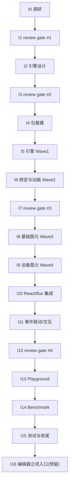

# Industrial HMI/SCADA Components Roadmap

> 最后更新：2026-08-04
> 来源：`docs/discussions/2026-08-03-industrial-hmi-scada-mission-scope-discussion.md`（范围讨论），后续调研报告 `docs/analysis/industrial-hmi/research-*.md`，设计文档 `docs/components/industrial-hmi/design-*.md`
> Mission：`missions/industrial-hmi.json`
> 目标：为 nop-chaos-flux 新增**工业组态（HMI/SCADA）运行时渲染**能力——高性能 Canvas 场景图引擎（LeaferJS 底座 + 自研组态语义层）+ 工业图元库 + 实时数据驱动 + 画面渲染组件（`scada-canvas`），对标 LeaferJS 官方性能档（数值官方自报，已由 I0 调研校准，见 `docs/analysis/industrial-hmi/research-download.md` §2.2；无 >30% 人工触发）

## 文档共识审查记录（本文件）

> 依据 Cross-Cutting「文档共识审查」条款，本文件定稿前须经独立子 agent 反复审查直到共识。记录如下：

- **Round 1（2026-08-03）**：独立 agent（fresh session）审查，判定 `REVISE`，20 条修正项（2 blocker / 6 major / 11 minor / 1 nit）。修正项全部落地或明确裁定（nit #20 保留原文）。证据：本文件头部 + 讨论文件头部 Round 1 记录。
- **Round 2（2026-08-03）**：独立 agent（fresh session）复审，判定 `REVISE`（轻量轮）——20/20 修正项真实落地，新增 3 项机械性问题：① `docs/logs/2026/08-03.md` 新条目未置顶（违反 reverse-chronological）；② Round 2 记录预写 `AGREE` 判定（应先于结论记录事实）；③ "已验证"措辞与"官方自报待 I0 校准"存在张力。修正项全部落地。
- **Round 3（2026-08-03）**：独立 agent（fresh session）复审，判定 `REVISE`（轻量轮）——2 项 minor：① 两份文件 Round 3 占位记录预写 `AGREE` 断言（预写判定反模式复发）；② 讨论文件 §九 待定事项仍引用 Round 2（已过期）。修正项全部落地（占位改中性 + §九 改 Round 3）。
- **Round 4（2026-08-03）**：独立 agent（fresh session）复审，判定 `AGREE`——零新增修正项，**达成共识**（共识循环：R1–R3 修正 3 轮 + R4 确认轮，未超轮次上限）。本文件可作为下游工作输入依据。
- **Round 5（2026-08-03，共识后增补验证）**：因执行安全考量新增「执行必读」节（防 mission-driver 执行 agent 只读 Phase Status/前半部而漏读后部 Cross-Cutting/Rule 条款），纯增补、不改既有条款语义。独立 agent（fresh session）focused 验证，判定 `AGREE`——增补与既有条款一致（编号/判据/阈值逐条吻合）、位置无 BULLET_RE 解析冲突、未破坏动态状态区唯一性；4 项低严重度建议中 3 项已采纳（执行必读头部措辞、Rule 4 引用补全、本记录回填），1 项裁量不采纳（"动画合帧"子约束因 Work Items I6.3/I14.2 已有呼应，核对清单定位为非穷尽）。增补定稿。
- **I1.1 review gate（2026-08-03，roadmap Rule 4 回写）**：独立 agent（fresh session，task `ses_03892d672ffeSeXQMQCUBFBIjo`）对照讨论文件 §八/§九 任务范围 + 5 份调研报告（`docs/analysis/industrial-hmi/research-*.md`）+ 差异清单执行终轮复核审查，判定 `pass-with-minors`——**零 Blocker，范围覆盖完整、选型（LeaferJS 底座 + 自研组态语义层）论证链成立**。修正项 3 项全部落地：`M-1`（Major）scada-apps §6 #9 动画表述修正（leafer 无帧动画/动画组队列类引擎、但过渡/路径动画原语已有——消除与 render-engines §8 #4 的跨报告矛盾）；`m-1`（Minor）scada-apps/summary 头部补「终轮复核说明」标准 bullet；`m-2`（Minor）本文件"待 I0 调研校准"过时表述回写（见「调研结论摘要」数值说明）。差异清单裁定：① SceneV 源码不可获取降级浅层、② 许可矩阵如实记录、③ 共识超轮（scada-apps 8 轮/summary 4 轮，全为行号/计数精度类 Minor、单调收敛）均**维持非阻断**；④ 性能数字观察项（内存 0% 余量 / 首屏 -36% 方向有利）**维持**交 I1.2 spike 实测仲裁。**I1.1 gate 达成共识（0 新增未落地修正项）**，I1 状态回写见 Phase Status。
- **I3.1 review gate（2026-08-03，roadmap Rule 4 回写）**：独立 agent（fresh session，task `ses_0382c18a7ffeF3m1lsPmGffiG7`）对照调研结论（I0.5）+ 项目架构文档 + 本 roadmap 全文 + 差异清单审查 4 份设计文档，产出 `docs/analysis/industrial-hmi/gate-2-review.md`，判定 `pass-with-minors`——**零 Blocker/零 Major，2 Minor 全部落地**：`m-1` 本文件总览依赖措辞回写（补 `@leafer-in/viewport@2.2.9` 必需依赖、移除过时"按需 `@leafer-ui/core`/`@leafer-ui/draw`"表述，对齐 design-engine.md §4.2/§12.2 与 I4 plan 清单）；`m-2` design-engine.md §4.6 组态 JSON 加载分解补全「渲染」分量（parse 23.4 + 实例化 88.5 + 渲染 ~67，口径 gate-1-review §3.2 #8）。差异清单裁定：① 依赖清单措辞需修正（m-1，I4 plan 已先行解析实现侧）；② 范围一致性（编辑器→I16/报警趋势/scada-symbol deferred 全链一致）、③ 顺序一致性（实现映射与依赖图逐项吻合）、④ 选型一致性（v2.2.9 锁定）、⑤ 性能包络一致性（11 行数字逐项对照，仅 m-2 分解遗漏）均**维持非阻断**。**I3.1 gate 作为 I2 设计文档「文档共识审查」终轮复核达成共识（m-1/m-2 落地后确认轮 0 新增）**，无人工确认触发（无范围/顺序/选型变化）；gate-2-review.md 自身经 3 轮共识审查达成 AGREE（R1 2 Minor + R2 N1 → R3）。I3 状态回写见 Phase Status。
- **I7.1/I7.2 review gate（2026-08-04，roadmap Rule 4 回写）**：独立 agent（fresh session，task `ses_037774c97ffekeQTBGto6crjFa`）对照 4 份 design-\*.md + I0.5 调研结论 + spike 工程（`~/sources/industrial-hmi-research/spike-leafer/`）审查 I5/I6 实现（契约一致性/序列化完整性/性能路径/测试覆盖 + leafer 真实 API 抽查），产出 `docs/analysis/industrial-hmi/gate-3-review.md`，判定 `revise`——**0 Blocker / 3 Major / 8 Minor**。3 项 Major 均为「单测全绿但真实 leafer 上不可用」的 live defect，共同根因是 `src/test-support/leafer-ui-mock.ts` 对事件载荷形状、`getByPoint` 返回值形状、zoomLayer 矩阵语义的错误建模掩蔽（I6 plan Failure Paths `leafer-event-api-drift` 触发）：`M-1` event-bridge 读 `event.point`（真实 leafer 事件数据为 `x`/`y`）→ symbol:click/dblclick/hover 永不发射；`M-2` hit.ts 未解包 `IPickResult.target` → 命中反查必失败；`M-3` `applyViewportState` 平移符号反（`move` 应传 `-(Δx)*scale`）→ setViewport/zoomAt/fit/center 反向平移且偏移翻倍。Minor 8 项：`m-1` onRender dirtyBlocks 恒 0（leafer 未暴露脏块计数，文档明示预留字段 I14 固化口径）；`m-2` `changedThreshold` 非 leafer 真实配置键（设计表述失真，修正为自研占位键）；`m-3` design-renderer.md:155 `ScadaConfigDiff.added` 类型笔误（设计写 `string[]`，实现为节点数组且语义正确，修正设计文档）；`m-4` validate 对 bindings/states/animations 仅容器级检查（补齐内部结构校验 + 回归测试）；`m-5` design-symbols.md §4.2 补 `dashOffset` 字段（flow 动画消费）；`m-6` getSymbolProps 返回 leafer 属性面（文档化，e2e 断言指南 I15.1 知悉）；`m-7` interactionLayer 惰性保留标注（sky 覆盖物归 I8.2/I11.2）；`m-8` config-adapter 逐节点 add vs spike batch.add（性能观察项，I14 复测对照，非缺陷）。leafer 真实 API 抽查 10 项：3 项 live-defect 漂移（事件载荷读取面、getByPoint 返回值、zoomLayer move 符号）+ 1 项无害漂移（changedThreshold）+ 1 项性能观察（batch add），其余 5 项一致（A1 tree viewport 固化/lazySpeard 拼写/事件名/forceRender/resize）。差异清单 10 项裁定：3 项实现缺陷（M-1/M-2/M-3）、2 项设计文档修正（m-2/m-3）、1 项文档同步（m-5）、1 项性能观察（m-8）、3 项一致无修正（createNormalizedActionEvent 归属 I11.1 裁定成立/I5 deferred 兑现/范围一致性）。**I5 遗留事项落地**：design-renderer.md:155 diff 类型笔误修正（m-3）、leafer 真实 API 抽查结论记录（gate-3-review §3，作 I14 复测口径基线）。**无人工确认触发**（修正项均为实现缺陷/文档笔误类，无范围/顺序/选型变化）。gate-3-review.md 自身经 3 轮文档共识审查达成 AGREE（R1 2 Minor+1 Nit → R2 3 项（F3 反向落地恢复）→ R3 确认轮 0 新增，未超轮次上限）。I7.2 修正全部落地（M-1/M-2/M-3 代码修正 + mock 面修塑 + 回归测试；m-4 校验补齐 + 3 组回归用例共 18 个非法形态断言；文档 m-1/m-2/m-3/m-5/m-6/m-7 回写；m-8 归属 I14），包级 273 tests / 20 files 全绿、coverage 阈值 90 达标，workspace 全量验证（typecheck/build/lint/test）全绿。I7 状态回写见 Phase Status。
- **I12.1/I12.2 review gate（2026-08-04，roadmap Rule 4 回写）**：独立 agent（fresh session，task `ses_0366f8601ffeTHct9ttCroe5g5`）对照讨论文件 §八（8 条最终决策）+ 4 份 design-\*.md 终态 + I0.5 调研结论 + `renderer-boundary-audit.md`（I10 五边界审计结论，INV-1–INV-5 + D-1 契约裁定）+ `gate-3-review.md`（§10/§11）审查 I8–I11 实现（功能完整性/性能/测试/文档四面），产出 `docs/analysis/industrial-hmi/gate-4-review.md`，判定 `pass-with-minors`——**零 Blocker/零 Major，3 Minor 全部落地**：`m-A` design-engine.md §4.4 视口钳制锚点措辞「视口中心」→「视口原点世界点」（与命令路径/M-3 推导口径一致）；`m-B` use-scada-config-sync 初始视口策略收窄至 full（reset）路径（diff 增量不重应用、绑定域重建不重复执行）+ 回归测试；`m-C` InteractionOverlay 覆盖物几何按 points 包围盒兜底（line/arrow/polygon 无宽高语义 0 尺寸退化）+ 最小框 + 回归测试。**gate-3-review §10 归属核对结论**：前 6 项（五边界审计/onReady/onError 桥接/component:\* 句柄/wheel/pinch 钳制/hover 覆盖物/flow 消费）全部兑现确认、后 2 项（1 万点批量合并断言+batch.add→I14、e2e 补强→I15.1）归属记录核对无误；M-1/M-2/M-3 修复未在 I8–I11 演化中回退（mock↔真实漂移面无回退、无新漂移）。I5/I6 M-1/M-2/M-3 修复复核未回退（event.x/y、IPickResult 解包、-(Δx)\*scale 符号均保持）。**I12 注意项清单**产出（14 行，供 I13/I14/I15 复用：I14×6/I13.1×3/I15.1×2/I15.2×2/I16×1 + 复合归属 1 行）。**无人工确认触发**（修正项均为文档措辞/行为边界类 Minor，无范围/顺序/选型变化）。gate-4-review.md 自身经 2 轮文档共识审查达成 AGREE（R1 2 Nit 落地 + 3 Nit 反向落地驳回 → R2 确认轮 0 新增，未超轮次上限）。I12.2 修正全部落地（m-A 文档回写；m-B/m-C 代码修正 + 2 个 focused 回归测试），包级 452 tests / 34 files 全绿、coverage 阈值 90 达标，workspace 全量验证（typecheck/build/lint/test）全绿。I12 状态回写见 Phase Status。
- **P1 remediation 轮 plan `{1}` 执行完成（2026-08-04，2026-08-04-1235-1-hmi-diff-path-convergence-plan）**：diff 路径收敛与双写源调和三 Phase 全部落地——Phase 1 diff 契约（同 id type 变更 → removed+added、children→undefined → `children: []` patch）、Phase 2 ConfigAdapter（applyDiff removed→added→updated 顺序 + nodeById 索引/声明随 applyUpdate 收敛，type-change remove-then-rebuild）、Phase 3 importConfig 汇入 props 同步链（`syncImported` + skip-next 防回刷 + change 基准 onBuilt）。multi-audit P1-4（nodeById 过期）、P1-5（importConfig 双写源）、open-audit P1 type-drop 三项 confirmed live defect 已修复并各带 focused 回归测试（diffScadaConfig type-change/children-removal、config-adapter type-change/declarations-sync、import-then-edit 幂等 + import 无 props 恢复 ready）；包级 468 tests / 34 files 全绿、workspace 全量验证（typecheck 32/32、build 32/32、lint 32/32、test 59/59）全绿。`design-renderer.md §4.3` diff 契约已同步。plan `{2}`/`{3}`（lifecycle wiring / display-math manifest）继续收口其余 P1。

## Purpose

本文是工业组态能力的长期开发路线图。**范围已由人审确认（2026-08-03 讨论）**：运行时引擎优先，组态编辑器后置为后继 mission（I16 预留立项入口，不实现）。每个工作项（work item）是一个 execution plan 的合理交付范围。

AI 或维护者读完本文即知哪些工作项未开始（`todo`）、已计划（`planned`）、已完成（`done`），无需重走全部设计文档。

**本文是编排层，不是 execution plan，也不是设计契约。** 设计契约看 `docs/components/industrial-hmi/design-*.md`。

## 执行必读（Executors MUST Read）

> mission-driver 的 DRAFT prompt 要求完整阅读本文件（`Read {{roadmapPath}} completely`）。**必须全文阅读**，禁止只读 Phase Status / 前半部分就起草 plan——本文件**后半部分**（Work Items 细节、Phase Details、Dependency Graph、**Cross-Cutting、Rule**）包含对执行者有约束力的条款。执行前强制核对以下关键约束（原文条款为权威，此处仅集中核对；部分约束在 Work Items 中亦有呼应）：

1. **文档共识审查**（Cross-Cutting 第 1 条 + Rule 5）：本 mission 所有 AI 编写文档必须经独立子 agent 反复审查直到共识（判据：连续一轮零新增修正项；编写者不得单方拒绝修正项；上限 3 轮超限升级人工；review gate = 对应阶段文档共识的终轮复核，不叠加）。
2. **review gate 纪律**（Cross-Cutting 第 2 条）：I1/I3/I7/I12 四个 gate 由独立 agent（fresh session）执行，输入 = 任务范围 + 上游产物 + 差异清单；修正项落地后 gate 才可标 `done`。
3. **人工确认阈值**（Cross-Cutting 第 4 条）：引擎选型变更 / `scada-canvas` 公共契约重大变更 / benchmark 不达标 / 共识循环超 3 轮 / 编辑器提前启动——必须停下标记人工决策。
4. **性能红线与测试纪律**（Cross-Cutting 第 6-7 条）：点表刷新合并帧 + 脏属性收集，禁止逐点 setState 直刷 React；canvas 渲染一律 Playwright 程序化断言（测试句柄 `window.__flux_scada_<cid>` 读场景树），禁用截图判定，不引 node-canvas。
5. **平台能力复用表**（Cross-Cutting 第 3 条）：`useScopeSelector`/`useActionDispatcher`/`createNormalizedActionEvent`/registry/formula compiler/i18n/ui 等既有能力禁止重复实现。
6. **状态写回纪律**（Rule 1-4）：状态仅由 plan 生命周期驱动；不得跳序/新增 work item；结构性调整标记人工确认；**review gate 修正项必须回写本 roadmap（Rule 4）**。

## Phase Status

> **全文件唯一的动态状态区。**
> 状态流转：`todo` → `planned`（draft review 通过）→ `done`（closure audit 通过）。
> 本 mission 固定 4 个 **review gate**（I1/I3/I7/I12）：每个 gate 由独立 agent（fresh session，不复用执行上下文）对照上游产物审查，输出修正项并落地回写；修正若涉及范围/顺序/选型变更，标记为需人工确认项并暂停推进。

- **I0. 调研与源码下载** (`done`)
- **I1. 设计回顾与修正 #1 —— 调研结论 gate** (`done`)
- **I2. 通用引擎层设计文档** (`done`)
- **I3. 设计回顾与修正 #2 —— 引擎设计 gate** (`done`)
- **I4. 包基建与依赖引入** (`done`)
- **I5. 引擎核心实现（Wave 1：场景图适配/视口/序列化）** (`done`)
- **I6. 数据绑定与动画引擎（Wave 2）** (`done`)
- **I7. 设计回顾与修正 #3 —— 实现对照 gate** (`done`)
- **I8. 基础图元库（Wave 3）** (`done`)
- **I9. 工业设备图元库（Wave 4）** (`done`)
- **I10. React 渲染器与 flux 集成** (`done`)
- **I11. 事件联动与画布交互** (`done`)
- **I12. 设计回顾与修正 #4 —— 整体 gate** (`done`)
- **I13. Playground 演示页** (`done`)
- **I14. Benchmark 与性能优化** (`done`)
- **I15. 测试补强、文档与收尾** (`done`)
- **I16. 组态编辑器后继 mission 立项入口** (`done`) <!-- 预留：仅产出立项材料，不实现；`todo → planned` 于 plan-2026-08-04-0902-2 激活期回写（I3/I15 先例），`planned → done` 由独立 closure-audit（task `ses_03540a864ffeYfVV7vgePBRGY3`）核验后回写（2026-08-04） -->

## Current Baseline

### 已完成（2026-08-03）

- 需求范围讨论（两轮 Q&A）→ `docs/discussions/2026-08-03-industrial-hmi-scada-mission-scope-discussion.md`
- 联网调研（LeaferJS/Meta2d.js/FUXA/SceneV/Konva/Fabric 等）→ 讨论文件 §三
- Mission 配置 → `missions/industrial-hmi.json`
- 本 roadmap

### 调研结论摘要（2026-08-03，详见讨论文件 §三）

> **数值说明**：以下 LeaferJS 性能数字为**官方自报**（leafer-ui README 宣称，联网检索存在转述出入，如内存 320MB vs 350MB），**已由 I0 调研校准并逐数字标注来源**（`research-download.md` §2.2：跨来源差异 9.4%/≤17.2% 均 <30%，无不安全方向 >30% 差异、无人工确认触发）；观察项（内存验收阈值=官方 320MB 零余量、首屏验收 <2s 比官方 1.28s 宽松 36% 方向有利）已由 **I1.1 gate 裁定维持**，交 I1.2 spike 实测仲裁（I1.1 gate 结论见本文件头部记录块）。

- **引擎选型**：LeaferJS（leafer-ui，MIT，官方宣称百万图形 1.28s 首屏/320MB/60fps 拖动、70KB min+gzip、零依赖、Editor 插件、Flex 布局、官方场景含"万级节点电力组态"）；组态语义层（点表绑定/状态动画/图元模型/序列化）自研。
- **竞品参考**：Meta2d.js（数据驱动视图/订阅/1000+ 动画/生命周期 hooks）、FUXA（SCADA 平台点表/报警/趋势）、SceneV（低代码编辑器/属性面板/事件体系）。
- **通用引擎层要点**：场景图 + 脏区局部重绘、图层分层（背景/图元/交互/HTML 覆盖层）、世界↔视口坐标变换、点表绑定（订阅+节流）、状态驱动动画、命中检测交互、图元注册机制、组态 JSON 序列化、React 桥接（命令式引擎 + 声明式 props）。

### 总览

- 新建 1 个包（`@nop-chaos/flux-renderers-industrial`），依赖引入 `leafer-ui@2.2.9` + `@leafer-in/viewport@2.2.9`（viewport 插件为 A1 固化必需依赖：`tree: { type: 'viewport' }` 显式配置，design-engine.md §4.2/§12.2；版本与 I1.2 spike 一致，I4 plan 已锁定）
- 1 个新 renderer type：`scada-canvas`（props 内嵌组态 JSON：图元树 + 点表），图元级 type 后续叠加
- 数据模型：双轨（组态内点表自包含 + flux 表达式 `$xxx` 桥接）
- 测试：纯逻辑层 Vitest 单测 + Playwright e2e 程序化断言（经测试句柄读场景树，不用截图/不引 node-canvas）
- 性能验收（对标 LeaferJS 官方性能档（数值官方自报，已由 I0 调研校准，`research-download.md` §2.2）：10 万图元可交互 ≥45fps、首屏创建 <2s、内存 ≤320MB；1 万实时数据点端到端刷新 <200ms
- 调研源码下载目录：`~/sources/industrial-hmi-research/`

---

## Work Items

> **状态说明**：各 work item 状态以 `Phase Status` 为准，本表不设独立状态列（避免第二动态状态面，`docs/backlog/00-roadmap-authoring-guide.md` anti-pattern）。

### I0 — 调研与源码下载

> 下载 6 组代表项目全量 clone 到 `~/sources/industrial-hmi-research/`；浅调研项目线上阅读（README + 关键源码），不下载。I0 计划内按 5 个 Phase（I0.1–I0.5）组织；起草时若超载，优先将 I0.4（无依赖，可并行）拆出单独 plan。

| ID   | 内容                                                                                                                                                                                                                                                                      | 产出                            | 依赖             |
| ---- | ------------------------------------------------------------------------------------------------------------------------------------------------------------------------------------------------------------------------------------------------------------------------- | ------------------------------- | ---------------- |
| I0.1 | clone leafer 系列 5 仓（leafer/leafer-ui/leafer-in/leafer-editor/LeaferJS 集成仓）+ meta2d.js + FUXA + SceneV + Konva.js + Fabric.js 到 `~/sources/industrial-hmi-research/`；记录各仓版本/许可/体积/依赖树；**逐项标注性能数字来源链接并校准（官方自报 vs 第三方转述）** | 下载清单 `research-download.md` | —                |
| I0.2 | 深度分析渲染引擎组：leafer 系列（场景图架构/百万图形机制/命中检测/Editor 插件/布局）+ Konva.js/Fabric.js（通用引擎对比/React 集成模式）                                                                                                                                   | `research-render-engines.md`    | I0.1             |
| I0.3 | 深度分析组态应用组：Meta2d.js（数据绑定/订阅/动画/图元注册/JSON 序列化）+ FUXA（点表/报警/趋势/画面导航）+ SceneV（图元/属性面板/事件体系）                                                                                                                               | `research-scada-apps.md`        | I0.1             |
| I0.4 | 浅调研补充项目：Sovit2D/智雨物联、vue-webtopo-svgeditor（SVG 方案）、mxGraph/maxGraph、OSHMI——提取可借鉴设计点                                                                                                                                                            | `research-supplement.md`        | —                |
| I0.5 | 汇总对比矩阵与设计启示：选型结论（LeaferJS 底座 + 自研语义层的可行性验证点）、可提取设计清单、差距分析（flux 集成/React 桥接/测试策略）                                                                                                                                   | `research-summary.md`           | I0.2, I0.3, I0.4 |

### I1 — 设计回顾与修正 #1（调研 gate）

> 第一个固定 review gate，同时充当 I0 调研文档「文档共识审查」的终轮复核（不叠加额外审查）。独立 agent 输入 = 任务范围（讨论文件 §八）+ 上游产物（调研报告）+ 与 roadmap 的差异清单，不复用调研执行上下文。

| ID   | 内容                                                                                                                                                        | 依赖 |
| ---- | ----------------------------------------------------------------------------------------------------------------------------------------------------------- | ---- |
| I1.1 | 调研结论 review：独立 agent 对照讨论文件 §八（范围/选型/数据模型/接入形态）审核 5 份调研报告，输出 review 结论 + 修正项清单                                 | I0.5 |
| I1.2 | 选型可行性 spike：用 leafer-ui 编写最小 demo（10 万矩形创建/拖动/命中检测 + 组态 JSON 加载），验证性能与 API 契合度；结论不成立时提出替代方案并标记人工确认 | I1.1 |

### I2 — 通用引擎层设计文档

> 设计文档统一放 `docs/components/industrial-hmi/design-*.md`（参考 scheduling 12 节 design.md 结构）。

| ID   | 内容                                                                                                                                                                                                                          | 依赖       |
| ---- | ----------------------------------------------------------------------------------------------------------------------------------------------------------------------------------------------------------------------------- | ---------- |
| I2.1 | **引擎架构设计** `design-engine.md`：LeaferJS 适配层（实例生命周期/场景树）、图层分层（背景/图元/交互/HTML 覆盖层）、世界↔视口坐标变换、渲染循环与脏区/局部重绘、性能策略（实例化、裁剪、合帧）                               | I1.2       |
| I2.2 | **数据绑定与动画设计** `design-data-binding.md`：点表/变量表模型、绑定表达式（静态/flux `$xxx` 桥接）、订阅与节流（合并帧/脏属性收集）、状态驱动动画（旋转/闪烁/流动/位移）、多状态呈现（运行/停止/故障）                     | I2.1       |
| I2.3 | **图元模型设计** `design-symbols.md`：Symbol 接口与属性 schema、图元注册机制（对齐 flux registry）、复合图元（group/instance）、基础形状与工业设备图元分类                                                                    | I2.1       |
| I2.4 | **序列化与 renderer 契约设计** `design-renderer.md`：组态 JSON schema（图元树+点表+绑定+事件）校验与序列化/反序列化、`scada-canvas` fields/events/regions/handles、React 桥接（ref 同步/实例生命周期）、事件→flux action 联动 | I2.2, I2.3 |

### I3 — 设计回顾与修正 #2（设计 gate）

| ID   | 内容                                                                                                                                                                                                                        | 依赖 |
| ---- | --------------------------------------------------------------------------------------------------------------------------------------------------------------------------------------------------------------------------- | ---- |
| I3.1 | 设计文档 review：独立 agent 对照调研结论（I0.5）+ 项目架构文档（`docs/architecture/renderer-runtime.md`/`flux-core.md`/模块边界）+ 本 roadmap 审核 4 份设计文档，输出修正项；同时作为 I2 设计文档「文档共识审查」的终轮复核 | I2.4 |
| I3.2 | 设计修正落地：回写设计文档；若修正涉及范围/顺序/选型变化，更新本 roadmap 并标记人工确认项                                                                                                                                   | I3.1 |

### I4 — 包基建与依赖引入

| ID   | 内容                                                                                                                                                                                                                                                                                                                                                                                       | 依赖 |
| ---- | ------------------------------------------------------------------------------------------------------------------------------------------------------------------------------------------------------------------------------------------------------------------------------------------------------------------------------------------------------------------------------------------ | ---- |
| I4.1 | 创建 `flux-renderers-industrial` 包（package.json/tsconfig/vitest/schemas.ts/renderer-definitions.ts/index.ts/styles.css）+ 引入 `leafer-ui` 依赖（**复核 I0.1 许可记录 MIT + 体积预算 + pnpm-lock diff 审查**）+ 更新 `vite.workspace-alias.ts`/根 `tsconfig.json` references。注：`apps/playground/src/styles.css` 的 `@source "../../../packages"` 已全局覆盖新包样式扫描，**无需改动** | I3.2 |
| I4.2 | 注册 `scada-canvas` 到 `examples.manifest.json` + playground registry（首期空壳注册，fields/events 随 I10 补全）                                                                                                                                                                                                                                                                           | I4.1 |

### I5 — 引擎核心实现（Wave 1）

| ID   | 内容                                                                                                                          | 依赖       |
| ---- | ----------------------------------------------------------------------------------------------------------------------------- | ---------- |
| I5.1 | 场景图适配层：`ScadaCanvas` 引擎类（leafer-ui 实例管理、场景树、图层分层、销毁/重建）                                         | I4.1       |
| I5.2 | 视口与坐标变换：world↔viewport、缩放/平移、fit/center、可见性裁剪（纯逻辑层可单测）                                           | I5.1       |
| I5.3 | 组态 JSON 解析与序列化：schema 校验、json→场景树、场景树→json、增量 diff（纯逻辑层）                                          | I2.1, I5.2 |
| I5.4 | 图元基类与基础形状：`BaseSymbol` 接口、矩形/圆角矩形/椭圆/线/箭头/管道/文本/多边形、样式解析与状态样式（纯逻辑 + 场景树映射） | I2.3, I5.1 |

### I6 — 数据绑定与动画引擎（Wave 2）

| ID   | 内容                                                                                                               | 依赖       |
| ---- | ------------------------------------------------------------------------------------------------------------------ | ---------- |
| I6.1 | 点表模型：变量注册（静态值/表达式/flux scope 桥接）、订阅与节流（合并帧、脏属性收集）、刷新流水线                  | I2.2, I5.1 |
| I6.2 | 属性绑定解析：绑定表达式→属性映射（颜色/文本/旋转/可见性/位置）、多状态呈现（值→状态判定）、单位/量程换算          | I2.2, I6.1 |
| I6.3 | 状态动画引擎：旋转/闪烁/流动/位移动画注册与调度、动画生命周期（start/stop/pause）、与状态切换联动（合帧策略）      | I2.2, I6.2 |
| I6.4 | 事件系统：图元事件（click/dblclick/hover）捕获、命中图元解析、事件载荷规范化（对齐 `createNormalizedActionEvent`） | I2.4, I5.1 |

### I7 — 设计回顾与修正 #3（实现对照 gate）

| ID   | 内容                                                                                                                                     | 依赖 |
| ---- | ---------------------------------------------------------------------------------------------------------------------------------------- | ---- |
| I7.1 | 实现对照 review：独立 agent 对照 design-\*.md + I0.5 调研结论审查 I5/I6 实现（契约一致性、序列化完整性、性能路径、测试覆盖），输出修正项 | I6.4 |
| I7.2 | 修正落地 + 补充回归测试                                                                                                                  | I7.1 |

### I8 — 基础图元库（Wave 3）

| ID   | 内容                                                                                                 | 依赖       |
| ---- | ---------------------------------------------------------------------------------------------------- | ---------- |
| I8.1 | 工业基础图元族：矩形/圆角/椭圆/线/箭头/管道/文本/图片/视频占位，样式属性（填充/描边/渐变/阴影/线宽） | I5.4       |
| I8.2 | 视觉状态：选中/悬停/禁用/报警闪烁状态样式、状态切换（与 I6.3 动画联动）                              | I5.4, I6.3 |
| I8.3 | 复合图元：group 组合、symbol instance 模板复用、实例属性覆盖                                         | I2.3, I5.3 |

### I9 — 工业设备图元库（Wave 4）

| ID   | 内容                                                            | 依赖       |
| ---- | --------------------------------------------------------------- | ---------- |
| I9.1 | 设备图元：电机/泵/阀门/风机（含旋转/开关状态动画）              | I8.1       |
| I9.2 | 仪表类：仪表盘/液位计/温度计/进度指示（绑定量程换算、指针动画） | I6.2, I8.1 |
| I9.3 | 传感与控制类：传感器/指示灯/开关/按钮（报警闪烁、状态色）       | I8.2       |
| I9.4 | 管道连接与流动动画：管道连接点/流动方向动画、管道与设备连接语义 | I8.3, I6.3 |

### I10 — React 渲染器与 flux 集成

> **强制原则审计**：本阶段必须执行 `docs/references/new-renderer-introduction-audit.md` 五边界审计（IO 边界 / reuse 边界 / internal state 边界 / contract 边界 / expansion 边界，INV-1/INV-2），审计结论作为 I12 整体 gate 的输入。

| ID    | 内容                                                                                                                                                                             | 依赖        |
| ----- | -------------------------------------------------------------------------------------------------------------------------------------------------------------------------------- | ----------- |
| I10.1 | `scada-canvas` renderer 组件：`RendererComponentProps` 契约、LeaferJS 实例生命周期（mount/unmount/resize）、ref 同步                                                             | I4.2, I5.1  |
| I10.2 | renderer-definitions 完整注册：fields/events/regions/handles、`schemas.ts` 类型、样式契约（marker class + data-slot）；执行 new-renderer-introduction-audit 五边界审计并记录结论 | I2.4, I10.1 |
| I10.3 | 点表 ↔ flux 表达式桥接：`useScopeSelector` 接入 scope 数据流、表达式求值→点表注入、事件经 action dispatcher 派发（对齐 props.events）                                            | I6.1, I10.1 |

### I11 — 事件联动与画布交互

| ID    | 内容                                                                                                                                                                                  | 依赖        |
| ----- | ------------------------------------------------------------------------------------------------------------------------------------------------------------------------------------- | ----------- |
| I11.1 | 图元事件→flux action 全链路：click/dblclick→dialog/页面跳转/数据请求（playground 验证场景）                                                                                           | I6.4, I10.3 |
| I11.2 | 画布浏览交互（**不含编辑器交互**，范围与讨论 Q8 一致）：视口平移/缩放（wheel/pinch）、fit/center 控制、图元 hover 命中反馈；图元拖拽/旋转/多选/属性面板等**编辑器交互全部后置到 I16** | I5.2, I10.1 |

### I12 — 设计回顾与修正 #4（整体 gate）

| ID    | 内容                                                                                                                                        | 依赖  |
| ----- | ------------------------------------------------------------------------------------------------------------------------------------------- | ----- |
| I12.1 | 整体 review：独立 agent 对照需求（讨论文件 §八）+ 全部设计文档 + I0.5 + I10 五边界审计结论审查实现完整性（功能/性能/测试/文档），输出修正项 | I11.2 |
| I12.2 | 修正落地 + 回归验证                                                                                                                         | I12.1 |

### I13 — Playground 演示页

| ID    | 内容                                                                                                                         | 依赖         |
| ----- | ---------------------------------------------------------------------------------------------------------------------------- | ------------ |
| I13.1 | scada-demo 页面：工艺流程组态画面（设备图元+管道+仪表）、点表模拟数据定时刷新、点击设备弹出详情，注册 playground domain 路由 | I10.1, I11.1 |
| I13.2 | 大屏/复杂组态示例页：万级图元压力示例 + 多画面切换（页面导航），注册导航卡片                                                 | I10.1, I11.1 |

### I14 — Benchmark 与性能优化

| ID    | 内容                                                                                                                                            | 依赖  |
| ----- | ----------------------------------------------------------------------------------------------------------------------------------------------- | ----- |
| I14.1 | benchmark 脚本与基线（Playwright 测量）：10 万图元首屏创建/拖动 fps/内存（验收阈值 **≤320MB**）、1 万点实时刷新端到端延迟；固化测量方法与基线值 | I13.1 |
| I14.2 | 性能优化轮：按基线结果优化（图元实例化、裁剪、脏区、数据节流、动画合帧），逐项复测记录                                                          | I14.1 |
| I14.3 | 复测与结论固化：达标（≥45fps / 首屏 <2s / 内存 ≤320MB / 刷新 <200ms）则写结论到 benchmark 文档；不达标则分析瓶颈并标记人工决策                  | I14.2 |

### I15 — 测试补强、文档与收尾

| ID    | 内容                                                                                                                                                                                                                                   | 依赖  |
| ----- | -------------------------------------------------------------------------------------------------------------------------------------------------------------------------------------------------------------------------------------- | ----- |
| I15.1 | 测试补强：e2e 程序化断言补充（场景树/点表刷新/事件联动）、边界用例（空画面/超大画面/非法 JSON）、i18n 文案                                                                                                                             | I14.1 |
| I15.2 | 文档收尾：`docs/index.md` 导航、架构文档（renderer-runtime/模块边界）增量更新、quick-reference 组件表、**flux-guide design-patterns 新增 scada 篇 + `flux-guide/scripts/generate-types.mjs` 注册新包并重新生成 schema.d.ts**、每日日志 | I15.1 |

### I16 — 组态编辑器后继 mission 立项入口（预留）

| ID    | 内容                                                                                                                                           | 依赖  |
| ----- | ---------------------------------------------------------------------------------------------------------------------------------------------- | ----- |
| I16.1 | 编辑器调研与立项材料：图元拖拽放置/属性面板 schema/连线/undo-redo/画布工具箱/与 runtime 共享引擎层复用点 → 产出后继 mission 建议文档（不实现） | I15.1 |

## Phase Details

### I0 调研与源码下载

调研 6 组代表项目（leafer 系列、meta2d.js、FUXA、SceneV、Konva.js、Fabric.js）全量 clone 到 `~/sources/industrial-hmi-research/`，深度分析并产出调研报告；另浅调研 4-5 个补充项目（Sovit2D、vue-webtopo-svgeditor、mxGraph/maxGraph、OSHMI）。I0.5 产出对比矩阵与设计启示，作为后续所有设计的上游依据。

### I1 设计回顾与修正 #1

第一个固定 review gate：独立 agent 审核调研结论与选型（LeaferJS 底座）；同时充当 I0 调研文档「文档共识审查」的终轮复核（不叠加额外审查）。I1.2 以最小 demo 验证 leafer-ui 可行性（10 万图形性能 + 组态 JSON 加载契合度），结论不成立则提出替代方案并标记人工确认。

### I2 通用引擎层设计

4 份设计文档：引擎架构（场景图适配/图层/坐标变换/渲染循环/性能策略）、数据绑定与动画（点表/双轨桥接/订阅节流/状态动画）、图元模型（Symbol 接口/注册机制/复合图元）、序列化与 renderer 契约（组态 JSON schema/scada-canvas fields/React 桥接/事件联动）。

### I3 设计回顾与修正 #2

第二个固定 review gate：独立 agent 对照调研结论 + 项目架构文档审核 4 份设计文档，修正落地；同时充当 I2 设计文档「文档共识审查」的终轮复核（不叠加额外审查）；涉及范围/顺序/选型变化时更新 roadmap 并标记人工确认项。

### I4 包基建

创建 `@nop-chaos/flux-renderers-industrial` 包并引入 `leafer-ui` 依赖；注册 `scada-canvas` 空壳到 manifest 与 playground registry。

### I5 引擎核心实现 Wave 1

场景图适配层、视口与坐标变换、组态 JSON 解析/序列化、图元基类与基础形状。纯逻辑层（坐标/序列化/图元模型）优先单测。

### I6 数据绑定与动画 Wave 2

点表模型（静态/表达式/flux 桥接三源）、属性绑定解析与多状态呈现、状态动画引擎（旋转/闪烁/流动/位移）、图元事件系统与载荷规范化。

### I7 设计回顾与修正 #3

第三个固定 review gate：独立 agent 对照设计文档 + 调研结论审查 I5/I6 实现，输出并落地修正项。

### I8 基础图元库 Wave 3

工业基础图元族（形状/管道/文本/图片/视频占位）、视觉状态（选中/悬停/报警闪烁）、复合图元（group/instance）。

### I9 工业设备图元库 Wave 4

设备图元（电机/泵/阀门/风机）、仪表类（仪表盘/液位计/温度计）、传感控制类（指示灯/开关/按钮）、管道连接与流动动画。

### I10 React 渲染器与 flux 集成

`scada-canvas` renderer 组件与实例生命周期、renderer-definitions 完整注册、点表 ↔ flux 表达式桥接（useScopeSelector/action dispatcher）；执行 new-renderer-introduction-audit 五边界审计（INV-1/INV-2），结论作为 I12 gate 输入。

### I11 事件联动与画布交互

图元事件→flux action 全链路（dialog/跳转/数据请求）；画布浏览交互（视口平移/缩放、hover 命中反馈，**不含图元拖拽/多选——编辑器交互后置 I16**，范围与讨论 Q8 一致）。

### I12 设计回顾与修正 #4

第四个固定 review gate：整体审查（功能完整性/性能/测试/文档，输入含 I10 五边界审计结论），修正落地与回归验证。

### I13 Playground 演示页

工艺流程组态 demo（设备+管道+仪表+点表模拟刷新+点击联动）+ 万级图元压力示例页，注册路由与导航卡片。

### I14 Benchmark 与性能优化

对标 LeaferJS 官方性能档（数值官方自报，已由 I0 调研校准，`research-download.md` §2.2）：10 万图元可交互 ≥45fps、首屏 <2s、内存 ≤320MB；1 万点端到端刷新 <200ms。基准→优化→复测闭环，结论固化。

### I15 测试补强、文档与收尾

e2e 程序化断言补强、边界用例、i18n；`docs/index.md`/架构文档/quick-reference 增量更新与每日日志。

### I16 编辑器后继 mission 立项入口

仅产出后继 mission 立项材料（编辑器范围/复用点/工作量评估），不实现编辑器。

## Dependency Graph

## Cross-Cutting

- **文档共识审查（mandatory，覆盖全部 AI 编写的文档）**：本 mission 中 AI 编写的**所有文档**——调研报告（I0）、设计文档（I2）、plan（`docs/plans/`）、review gate 结论（I1/I3/I7/I12）、benchmark 报告（I14）、每日日志、讨论记录、后继 mission 立项材料（I16）——定稿前必须由**独立子 agent（fresh session，不复用编写者上下文）反复审查改进直到达成共识**。
  - **与既有审查体系的关系（不叠加）**：plan 的 draft review / closure audit（`docs/plans/00-plan-authoring-and-execution-guide.md`）不受本条款替代；文档共识审查是 plan 审查**之外**的增量要求，但**不得对同一份文档跑两套平行独立审查**——review gate（I1/I3/I7/I12）即对应阶段文档共识审查的**终轮复核**（如 I3.1 同时是 I2 设计文档共识审查的终轮），不再额外开一轮。
  - **共识判据**：连续一轮独立审查产生 **0 个新增修正项**（含未采纳项）即达成共识。
  - **修正项裁决**：审查者的修正项要么采纳落地，要么作为「待定项」提交人工或推迟到下一 review gate 裁定；**编写者不得单方拒绝**（避免自锁，对齐 AGENTS.md 禁止执行者自审）。
  - **轮次上限**：同一文档共识循环 ≤3 轮；超限升级人工裁决。
  - **证据记录**：每轮审查的轮次号、修正项摘要与共识结论记录在文档头部「文档共识审查记录」块。
- **review gate 执行纪律**：每个 gate（I1/I3/I7/I12）由独立子 agent（fresh session）执行，不复用被审阶段的执行上下文；输入 = 任务范围（讨论文件 §八）+ 上游产物（调研报告/设计文档/实现）+ 与 roadmap 的差异清单。修正项落地后该 gate 的 work item 才可标记 `done`。
- **平台能力复用（Framework / Platform Reuse）**：以下既有能力**禁止重复实现**，设计/实现时直接消费：

  | 能力                                                                               | 提供方                                                                                                                                 | 消费方                |
  | ---------------------------------------------------------------------------------- | -------------------------------------------------------------------------------------------------------------------------------------- | --------------------- |
  | scope 数据流与响应式取值（`useScopeSelector`/`useRenderScope`）                    | `@nop-chaos/flux-react`                                                                                                                | I6.1 点表桥接、I10.3  |
  | action 事件派发与载荷规范化（`useActionDispatcher`/`createNormalizedActionEvent`） | `@nop-chaos/flux-react`                                                                                                                | I6.4、I10.3、I11.1    |
  | renderer 注册与定义（`RendererComponentProps`/renderer-definitions/registry）      | `@nop-chaos/flux-react` + `flux-renderers-*`                                                                                           | I4.2、I10.1/10.2      |
  | 表达式编译与求值（formula compiler）                                               | `@nop-chaos/flux-formula`/`flux-compiler`                                                                                              | I6.2 属性绑定、I10.3  |
  | i18n 文案（`flux-i18n` locale 文件）                                               | `@nop-chaos/flux-i18n`                                                                                                                 | I15.1                 |
  | UI 组件与样式基元（`cn()`/Button/Dialog 等）                                       | `@nop-chaos/ui`                                                                                                                        | HTML 覆盖层（弹窗等） |
  | Tailwind v4 样式扫描（`@source "../../../packages"`）                              | `apps/playground/src/styles.css`                                                                                                       | 新包样式（无需改动）  |
  | 复杂组件设计流程与原则审计                                                         | `docs/references/new-renderer-introduction-audit.md` / `complex-component-design-process.md` / `renderer-implementation-guidelines.md` | I2、I10.2             |

- **人工确认阈值**：引擎选型变更、`scada-canvas` 公共契约（fields/events）重大变更、benchmark 不达标、文档共识循环超 3 轮、编辑器提前启动——必须停下标记人工决策，不自动推进。
- **新增包流程**：按 `AGENTS.md` "Adding New Packages"（vite.workspace-alias.ts + 根 tsconfig references + docs/logs）。
- **测试纪律**：纯逻辑层（点表/绑定/动画状态机/坐标/序列化）单测先行；canvas 渲染一律 Playwright 程序化断言，禁用截图判定；不引入 node-canvas。**场景树读取机制**：renderer 在 dev/test 下经 `window.__flux_scada_<cid>` 暴露引擎实例（或 renderer 提供测试句柄），供 e2e `page.evaluate` 读取场景树断言。
- **性能红线**：点表刷新走合并帧 + 脏属性收集，禁止逐点 setState 直刷 React；动画合帧调度，禁止每帧全量重建场景。
- **设计文档归属**：`docs/components/industrial-hmi/design-*.md`（12 节结构参考 scheduling）；调研报告 `docs/analysis/industrial-hmi/research-*.md`。
- **组件注册**：新 renderer type `scada-canvas` 需同步 `examples.manifest.json`、playground registry、i18n 文案、quick-reference 组件表。

## Follow-up Backlog

> 来源：`docs/audits/2026-08-03-1506-multi-audit-industrial-hmi.md`（约 30 条 P2/P3）与 `docs/audits/2026-08-03-1506-open-audit-industrial-hmi.md`（6 条 P2），2026-08-04 triage 登记。P0/P1 已由 `docs/plans/2026-08-04-1235-{1,2,3}-*.md` 收口。每条带源审计路径可追溯；分类：`out-of-scope improvement` / `watch-only residual`（个别与 P1 修复同源、被 P1 fix 覆盖的条目标注已收口）。

### Dependency & packaging（multi-audit dim 01/03）

- `multi-audit-industrial-hmi.md` `[P2]` — `src/index.ts:2,94` 模块加载副作用 `registerBuiltinScadaSymbols()`；任何 `import type` 消费者拖入 leafer-ui canvas 运行时。考虑显式 `registerScadaSymbols()` 对齐 `registerXxxRenderers` 约定。
- `multi-audit-industrial-hmi.md` `[P2]` — `dist/` 残留 `scada-canvas-placeholder.*` 陈旧产物（src 已删、tsc 不清 outDir）；build 脚本应先清 `dist`。

### Public API surface（multi-audit dim 03）

- `multi-audit-industrial-hmi.md` `[P2]` — `src/index.ts:5-92` 91/94 导出符号零外部消费者（仅 `registerScadaRenderers`/`ScadaConfig`/`ScadaSymbolNode` 被用）；`design-renderer.md §11` 只授权 register 函数 + 类型。收敛导出面。
- `multi-audit-industrial-hmi.md` `[P2]` — `src/renderer-definitions.ts:14-32` 缺静态元数据（`propContracts`/`eventContracts`/`componentCapabilityContracts`（9 handles）/`rendererClass`），工具链无法发现 9 handles + 5 events。
- `multi-audit-industrial-hmi.md` `[P3]` — `schemas.ts:15` + `renderer-definitions.ts:20` `defaultSchema` 缺必填 `config` 字段 → 无 author 的 schema 永久 loading。
- `multi-audit-industrial-hmi.md` `[P3]` — `serialization/serialize.ts` `serializeScadaConfig` 无 live 消费者（design-contract 函数，仅测试用）。

### State & lifecycle（multi-audit dim 04/06）

- `multi-audit-industrial-hmi.md` `[P2]` — `src/binding/dirty-collector.ts:291-315` `when:'always'` 动画只在同时声明 `states` 的图元上启动（唯一 `animator.start` 路径在 `collectStates` 内）；无 states 的 always 动画静默 no-op 而 validate 接受。
- `multi-audit-industrial-hmi.md` `[P2]` — `use-scada-engine.ts:184-193` `component:destroy` 不断开 ResizeObserver/取消 resize rAF（unmount 才清理）；destroy 后容器仍被观察。
- `multi-audit-industrial-hmi.md` `[P2]` — `use-scada-engine.ts:113-123` dev/test `setPointValues` 注入闭包捕获 mount 期 pipeline；config reload 后写向已销毁 pipeline → 注入静默 no-op。
- `multi-audit-industrial-hmi.md` `[P2]` — `use-scada-points-bridge.ts:134-147` flux 编译/求值错误每次 scope 更新重报（无 lastError 去重）→ onError 风暴 + status 抖动。（P1-8 fix 的降级部分已覆盖"不升级 status"；完整去重风暴语义留此。）
- `multi-audit-industrial-hmi.md` `[P2]` — `use-scada-config-sync.ts:93-120` full-reset 失败（`config-build-failed`）后 engine 树半构建 + 绑定旧 + `prevRef` 过期；下次 diff 基于损坏基线。建议失败时 `prevRef=undefined`。
- `multi-audit-industrial-hmi.md` `[P2]` — `src/engine/event-bridge.ts:92-131` leafer 事件处理无顶层 try/catch；用户侧 throw（如坏 ActionSchema）窜入 leafer 交互管线。

### Display & positioning（multi-audit dim 21）

- `multi-audit-industrial-hmi.md` `[P2]` — `use-scada-config-sync.ts:20-37` `computeSymbolBounds` 忽略 `custom.points` 几何；polygon-only 场景 fit/center 冲到 MAX_SCALE（20×）且图元钉在画布外（line/polygon bounds 退化为 0 尺寸；`viewport.ts:58-59` 1e-6 兜底）。
- `multi-audit-industrial-hmi.md` `[P2]` — `dirty-collector.ts:291-315` + `value-to-state.ts:11-16` 状态判定链不转发主绑定 `scale`（`resolveState(declaration, raw)` 无 options）→ 绑定带 `scale` 时判定值偏离写入值。
- `multi-audit-industrial-hmi.md` `[P2]` — `src/symbols/instrument/{gauge,level,thermometer}.ts` + `base-shapes/text.ts` 自动宽 Text 上 `textAlign:'center'` 无效（leafer 无 width 即无 autoSizeAlign → center 偏移 0）；仪表数值标签左对齐/偏心。
- `multi-audit-industrial-hmi.md` `[P2]` — `scada-canvas.tsx:188-190` `data-slot="scada-canvas-canvas"` 在空 wrapper div 上而非 leafer canvas 元素；slot 断言会指向错误节点。

### Wiring & degradation（multi-audit dim 22）

- `multi-audit-industrial-hmi.md` `[P2]` — `use-scada-config-sync.ts` + `use-scada-engine.ts:154-162` mount 后 `viewport`/`width`/`height` prop 变更不生效（仅初始应用、diff 路径故意跳过；`design-renderer.md §8.3` 声称 command 式反应）。文档化实际契约或接 viewport 变更 effect。
- `multi-audit-industrial-hmi.md` `[P2]` — `use-scada-points-bridge.ts:9-41` 复杂 flux 表达式（`${analog.temp + 1}`）无订阅路径 → `useScopeSelector` 禁用 → 点永不更新；对 author 静默/不透明。
- `multi-audit-industrial-hmi.md` `[P2]` — `use-scada-points-bridge.ts:109` `compiledCache` config 重载不清（长会话无界增长）。
- `multi-audit-industrial-hmi.md` `[P2]` — `src/engine/event-bridge.ts:119-131` `onSymbolHover` 按 pointer.move 派发、无同符号去重（悬停一个符号期间 hover action 风暴）。
- `multi-audit-industrial-hmi.md` `[P2]` — `use-scada-config-sync.ts:114` + `use-scada-events.ts:128-130` onReady 语义漂移：每次构建（含 diff）都触发；残留在 `design-renderer.md §8.1` "first-frame" 措辞（P1-3 fix 已收口代码侧，文档措辞同步待办）。
- `multi-audit-industrial-hmi.md` `[P2]` — `use-scada-handles.ts:62-71` `component:fit/center` 未实现文档声明的 `not-visible` 失败路径。
- `multi-audit-industrial-hmi.md` `[P2]` — `scada-errors.ts` + `scada-canvas.tsx:184-185` 错误码为松散字符串、无注册表/i18n 映射；validate 消息原始英文上屏。
- `multi-audit-industrial-hmi.md` `[P2]` — `scada-canvas.tsx:180-181` 缺 `config` 时永久 loading 无空态（文档化行为，需显式 doc 注记）。

### Test effectiveness & coverage（multi-audit dim 23/14）

- `multi-audit-industrial-hmi.md` `[P2]` — `leafer-ui-mock.ts:189-194` `MockZoomLayer.scaleOfWorld` 不建模 x/y 锚定副作用 → viewport x-sync 分支单测不可验证（P1-9 fix 已收口本点，mock 建模随 plan `{3}` 落地；本条后续仅剩 sync 分支单测补齐核对）。
- `multi-audit-industrial-hmi.md` `[P2]` — `tests/e2e/scada-perf.spec.ts:158-184` "drag pan fps" 指标只数 rAF 帧（~60fps 恒发，与是否真平移无关）→ pan 半恒真断言。需断言 viewport 变化作为平移有效证据。
- `multi-audit-industrial-hmi.md` `[P2]` — `src/engine/batch-add-probe.ts` 0% 覆盖（I14.1 探针无任何测试执行；时序值不可断言但 shape/count/ratio 可）。
- `multi-audit-industrial-hmi.md` `[P2]` — e2e 断言主要是 `window.__flux_scada_<cid>` 场景树属性读取；整画布黑屏仍可能全过——每个 spec 家族至少补一条 canvas 像素/DOM canvas 存在性断言。
- `multi-audit-industrial-hmi.md` `[P2]` — 覆盖缺口：`scada-engine.ts:318,367`（`cacheImage`/`measureAddStrategies` 投影）、`use-scada-engine.ts` `setPointValues` 注入通道、`use-scada-config-sync.ts` `onBuildError` catch、`use-scada-handles.ts` center-no-config、`validate.ts` 17 错误分支、`expression-evaluator.ts` 14 错误分支、switch OFF 位 applyProps。
- `multi-audit-industrial-hmi.md` `[P2]` — `scada-canvas-smoke.test.tsx` 未调 `resetLeaferMock()`（唯一漏调消费者文件；未来 innerId 断言隐患）。

### Documentation drift（multi-audit dim 16）

- `multi-audit-industrial-hmi.md` `[P2]` — `design-renderer.md:179,258` `data-slot="scada-canvas-overlay"` 声明但从未渲染（hover 覆盖物在 leafer sky 层）。
- `multi-audit-industrial-hmi.md` `[P2]` — `design-renderer.md:157` 点表 diff 文档化为 `setPointValues` 增量路径；实现是整域重建 `reloadBindings`。
- `multi-audit-industrial-hmi.md` `[P2]` — `design-renderer.md:257` canvas marker 文档为 "—" 但代码发 `nop-scada-canvas-canvas`（含 CSS）。
- `multi-audit-industrial-hmi.md` `[P2]` — `design-renderer.md:235` `not-visible` 失败路径文档化但未实现。
- `multi-audit-industrial-hmi.md` `[P2]` — `design-engine.md:203-204` `ready`/`error` 列为 engine 事件；实际是 renderer 层 `scada:ready`/`scada:error` action 派发。
- `multi-audit-industrial-hmi.md` `[P2]` — `design-engine.md:220-229`、`design-symbols.md:80` `ScadaTestHandle`/`SymbolCreateContext.engine` 代码里 `unknown`（文档显示强类型；疑似循环导入约束，需 doc 注记）。
- `multi-audit-industrial-hmi.md` `[P2]` — `design-symbols.md:85` `registerScadaSymbol` 文档化 "idempotent"；实现重复注册 throw。
- `multi-audit-industrial-hmi.md` `[P2]` — `docs/components/index.md:341-357` 注册 domain renderer 列表漏 `scada-canvas`（已注册并接入 playground）。

### Open-ended audit P2（open-audit-industrial-hmi.md）

- `open-audit-industrial-hmi.md` `[P2]` — `useScadaConfigSync` `onBuilt` 守卫必须 change 基准而非 identity 基准——宿主每渲染传新 config 对象身份时（store 派生/内联 spread），空 diff 重跑仍触发 `scada:ready`。**已由 plan `{2}` Phase 2（P1-3 fix，change/empty-diff 守卫）收口**；本条标记已收口，仅作追溯。
- `open-audit-industrial-hmi.md` `[P2]` — `reloadBindings` 清空全部 live 点值（注入值重置为 init 无合并）——任何 symbol/variable 变更都触发；静态/表达式运行期值与未来 adapter 值静默丢失。
- `open-audit-industrial-hmi.md` `[P2]` — `scada-image` 加载失败信号 `loadFailed` 无消费者（注释声称 I10 桥接层消费，实际不存在）→ 404 渲染永久灰块零诊断。
- `open-audit-industrial-hmi.md` `[P2]` — `point-store.ts:187-203` `point:change` 订阅者无 try/catch 在 `applyValue` 内运行；订阅者 throw 中断剩余写入循环（今日零生产订阅者，latent）。
- `open-audit-industrial-hmi.md` `[P2]` — `component:destroy` 后 `data-status="ready"` 且 wrapper 仍挂载（`use-scada-handles.ts:54-57`）——销毁状态无处反映；e2e/tooling 会把已销毁 canvas 报为健康。或 surface destroyed status 或文档化为 unmount-only。
- `open-audit-industrial-hmi.md` `[P2]` — `tests/e2e/scada-perf.spec.ts:134,148,237,273,346` `allowConsoleErrors(100)` + `playground-entry-pages.spec.ts:450` `ROUTES_WITH_KNOWN_ERRORS` 是 calendar 先例拷贝而非证据驱动（本审计 live probe 该路由 0 console.error/pageerror）→ 建议移除 allowance 或记录真实已知错误。

## Rule

1. 本文件状态仅由 plan 生命周期驱动（`docs/backlog/00-roadmap-authoring-guide.md`）：draft review 通过 → `planned`；closure audit 通过 → `done`。
2. work item 粒度 = 一个 execution plan 的交付范围；若某 plan 完成时本表无任何状态可更新，视为粒度缺陷，需回填并拆分。
3. AI 不得重新仲裁优先级、跳序或新增 work item；结构性调整（新增/删除/重排）标记人工确认。
4. 每个 review gate 的修正项必须**回写本 roadmap**（涉及范围/顺序变化时），保持编排层与设计层一致。
5. AI 编写的**所有文档**必须经独立子 agent（fresh session）反复审查改进直到达成共识（判据/裁决/轮次上限见 Cross-Cutting「文档共识审查」）；达成共识前文档不得作为下游工作的输入依据。
