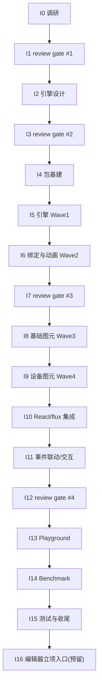

# Industrial HMI/SCADA Components Roadmap

> 最后更新：2026-08-03
> 来源：`docs/discussions/2026-08-03-industrial-hmi-scada-mission-scope-discussion.md`（范围讨论），后续调研报告 `docs/analysis/industrial-hmi/research-*.md`，设计文档 `docs/components/industrial-hmi/design-*.md`
> Mission：`missions/industrial-hmi.json`
> 目标：为 nop-chaos-flux 新增**工业组态（HMI/SCADA）运行时渲染**能力——高性能 Canvas 场景图引擎（LeaferJS 底座 + 自研组态语义层）+ 工业图元库 + 实时数据驱动 + 画面渲染组件（`scada-canvas`），对标 LeaferJS 官方性能档（数值官方自报，待 I0 调研校准）

## 文档共识审查记录（本文件）

> 依据 Cross-Cutting「文档共识审查」条款，本文件定稿前须经独立子 agent 反复审查直到共识。记录如下：

- **Round 1（2026-08-03）**：独立 agent（fresh session）审查，判定 `REVISE`，20 条修正项（2 blocker / 6 major / 11 minor / 1 nit）。修正项全部落地或明确裁定（nit #20 保留原文）。证据：本文件头部 + 讨论文件头部 Round 1 记录。
- **Round 2（2026-08-03）**：独立 agent（fresh session）复审，判定 `REVISE`（轻量轮）——20/20 修正项真实落地，新增 3 项机械性问题：① `docs/logs/2026/08-03.md` 新条目未置顶（违反 reverse-chronological）；② Round 2 记录预写 `AGREE` 判定（应先于结论记录事实）；③ "已验证"措辞与"官方自报待 I0 校准"存在张力。修正项全部落地。
- **Round 3（2026-08-03）**：独立 agent（fresh session）复审，判定 `REVISE`（轻量轮）——2 项 minor：① 两份文件 Round 3 占位记录预写 `AGREE` 断言（预写判定反模式复发）；② 讨论文件 §九 待定事项仍引用 Round 2（已过期）。修正项全部落地（占位改中性 + §九 改 Round 3）。
- **Round 4（2026-08-03）**：独立 agent（fresh session）复审，判定 `AGREE`——零新增修正项，**达成共识**（共识循环：R1–R3 修正 3 轮 + R4 确认轮，未超轮次上限）。本文件可作为下游工作输入依据。
- **Round 5（2026-08-03，共识后增补验证）**：因执行安全考量新增「执行必读」节（防 mission-driver 执行 agent 只读 Phase Status/前半部而漏读后部 Cross-Cutting/Rule 条款），纯增补、不改既有条款语义。独立 agent（fresh session）focused 验证，判定 `AGREE`——增补与既有条款一致（编号/判据/阈值逐条吻合）、位置无 BULLET_RE 解析冲突、未破坏动态状态区唯一性；4 项低严重度建议中 3 项已采纳（执行必读头部措辞、Rule 4 引用补全、本记录回填），1 项裁量不采纳（"动画合帧"子约束因 Work Items I6.3/I14.2 已有呼应，核对清单定位为非穷尽）。增补定稿。

## Purpose

本文是工业组态能力的长期开发路线图。**范围已由人审确认（2026-08-03 讨论）**：运行时引擎优先，组态编辑器后置为后继 mission（I16 预留立项入口，不实现）。每个工作项（work item）是一个 execution plan 的合理交付范围。

AI 或维护者读完本文即知哪些工作项未开始（`todo`）、已计划（`planned`）、已完成（`done`），无需重走全部设计文档。

**本文是编排层，不是 execution plan，也不是设计契约。** 设计契约看 `docs/components/industrial-hmi/design-*.md`。

## 执行必读（Executors MUST Read）

> mission-driver 的 DRAFT prompt 要求完整阅读本文件（`Read {{roadmapPath}} completely`）。**必须全文阅读**，禁止只读 Phase Status / 前半部分就起草 plan——本文件**后半部分**（Work Items 细节、Phase Details、Dependency Graph、**Cross-Cutting、Rule**）包含对执行者有约束力的条款。执行前强制核对以下关键约束（原文条款为权威，此处仅集中核对；部分约束在 Work Items 中亦有呼应）：

1. **文档共识审查**（Cross-Cutting 第 1 条 + Rule 5）：本 mission 所有 AI 编写文档必须经独立子 agent 反复审查直到共识（判据：连续一轮零新增修正项；编写者不得单方拒绝修正项；上限 3 轮超限升级人工；review gate = 对应阶段文档共识的终轮复核，不叠加）。
2. **review gate 纪律**（Cross-Cutting 第 2 条）：I1/I3/I7/I12 四个 gate 由独立 agent（fresh session）执行，输入 = 任务范围 + 上游产物 + 差异清单；修正项落地后 gate 才可标 `done`。
3. **人工确认阈值**（Cross-Cutting 第 4 条）：引擎选型变更 / `scada-canvas` 公共契约重大变更 / benchmark 不达标 / 共识循环超 3 轮 / 编辑器提前启动——必须停下标记人工决策。
4. **性能红线与测试纪律**（Cross-Cutting 第 6-7 条）：点表刷新合并帧 + 脏属性收集，禁止逐点 setState 直刷 React；canvas 渲染一律 Playwright 程序化断言（测试句柄 `window.__flux_scada_<cid>` 读场景树），禁用截图判定，不引 node-canvas。
5. **平台能力复用表**（Cross-Cutting 第 3 条）：`useScopeSelector`/`useActionDispatcher`/`createNormalizedActionEvent`/registry/formula compiler/i18n/ui 等既有能力禁止重复实现。
6. **状态写回纪律**（Rule 1-4）：状态仅由 plan 生命周期驱动；不得跳序/新增 work item；结构性调整标记人工确认；**review gate 修正项必须回写本 roadmap（Rule 4）**。

## Phase Status

> **全文件唯一的动态状态区。**
> 状态流转：`todo` → `planned`（draft review 通过）→ `done`（closure audit 通过）。
> 本 mission 固定 4 个 **review gate**（I1/I3/I7/I12）：每个 gate 由独立 agent（fresh session，不复用执行上下文）对照上游产物审查，输出修正项并落地回写；修正若涉及范围/顺序/选型变更，标记为需人工确认项并暂停推进。

- **I0. 调研与源码下载** (`todo`)
- **I1. 设计回顾与修正 #1 —— 调研结论 gate** (`todo`)
- **I2. 通用引擎层设计文档** (`todo`)
- **I3. 设计回顾与修正 #2 —— 引擎设计 gate** (`todo`)
- **I4. 包基建与依赖引入** (`todo`)
- **I5. 引擎核心实现（Wave 1：场景图适配/视口/序列化）** (`todo`)
- **I6. 数据绑定与动画引擎（Wave 2）** (`todo`)
- **I7. 设计回顾与修正 #3 —— 实现对照 gate** (`todo`)
- **I8. 基础图元库（Wave 3）** (`todo`)
- **I9. 工业设备图元库（Wave 4）** (`todo`)
- **I10. React 渲染器与 flux 集成** (`todo`)
- **I11. 事件联动与画布交互** (`todo`)
- **I12. 设计回顾与修正 #4 —— 整体 gate** (`todo`)
- **I13. Playground 演示页** (`todo`)
- **I14. Benchmark 与性能优化** (`todo`)
- **I15. 测试补强、文档与收尾** (`todo`)
- **I16. 组态编辑器后继 mission 立项入口** (`todo`) <!-- 预留：仅产出立项材料，不实现 -->

## Current Baseline

### 已完成（2026-08-03）

- 需求范围讨论（两轮 Q&A）→ `docs/discussions/2026-08-03-industrial-hmi-scada-mission-scope-discussion.md`
- 联网调研（LeaferJS/Meta2d.js/FUXA/SceneV/Konva/Fabric 等）→ 讨论文件 §三
- Mission 配置 → `missions/industrial-hmi.json`
- 本 roadmap

### 调研结论摘要（2026-08-03，详见讨论文件 §三）

> **数值说明**：以下 LeaferJS 性能数字为**官方自报**（leafer-ui README 宣称，联网检索存在转述出入，如内存 320MB vs 350MB），**待 I0 调研校准并逐数字标注来源**后才作为设计依据。

- **引擎选型**：LeaferJS（leafer-ui，MIT，官方宣称百万图形 1.28s 首屏/320MB/60fps 拖动、70KB min+gzip、零依赖、Editor 插件、Flex 布局、官方场景含"万级节点电力组态"）；组态语义层（点表绑定/状态动画/图元模型/序列化）自研。
- **竞品参考**：Meta2d.js（数据驱动视图/订阅/1000+ 动画/生命周期 hooks）、FUXA（SCADA 平台点表/报警/趋势）、SceneV（低代码编辑器/属性面板/事件体系）。
- **通用引擎层要点**：场景图 + 脏区局部重绘、图层分层（背景/图元/交互/HTML 覆盖层）、世界↔视口坐标变换、点表绑定（订阅+节流）、状态驱动动画、命中检测交互、图元注册机制、组态 JSON 序列化、React 桥接（命令式引擎 + 声明式 props）。

### 总览

- 新建 1 个包（`@nop-chaos/flux-renderers-industrial`），依赖引入 `leafer-ui`（+ 按需 `@leafer-ui/core`/`@leafer-ui/draw`）
- 1 个新 renderer type：`scada-canvas`（props 内嵌组态 JSON：图元树 + 点表），图元级 type 后续叠加
- 数据模型：双轨（组态内点表自包含 + flux 表达式 `$xxx` 桥接）
- 测试：纯逻辑层 Vitest 单测 + Playwright e2e 程序化断言（经测试句柄读场景树，不用截图/不引 node-canvas）
- 性能验收（对标 LeaferJS 官方性能档（数值官方自报，待 I0 调研校准））：10 万图元可交互 ≥45fps、首屏创建 <2s、内存 ≤320MB；1 万实时数据点端到端刷新 <200ms
- 调研源码下载目录：`~/sources/industrial-hmi-research/`

---

## Work Items

> **状态说明**：各 work item 状态以 `Phase Status` 为准，本表不设独立状态列（避免第二动态状态面，`docs/backlog/00-roadmap-authoring-guide.md` anti-pattern）。

### I0 — 调研与源码下载

> 下载 6 组代表项目全量 clone 到 `~/sources/industrial-hmi-research/`；浅调研项目线上阅读（README + 关键源码），不下载。I0 计划内按 5 个 Phase（I0.1–I0.5）组织；起草时若超载，优先将 I0.4（无依赖，可并行）拆出单独 plan。

| ID   | 内容                                                                                                                                                                                                                                                                      | 产出                            | 依赖             |
| ---- | ------------------------------------------------------------------------------------------------------------------------------------------------------------------------------------------------------------------------------------------------------------------------- | ------------------------------- | ---------------- |
| I0.1 | clone leafer 系列 5 仓（leafer/leafer-ui/leafer-in/leafer-editor/LeaferJS 集成仓）+ meta2d.js + FUXA + SceneV + Konva.js + Fabric.js 到 `~/sources/industrial-hmi-research/`；记录各仓版本/许可/体积/依赖树；**逐项标注性能数字来源链接并校准（官方自报 vs 第三方转述）** | 下载清单 `research-download.md` | —                |
| I0.2 | 深度分析渲染引擎组：leafer 系列（场景图架构/百万图形机制/命中检测/Editor 插件/布局）+ Konva.js/Fabric.js（通用引擎对比/React 集成模式）                                                                                                                                   | `research-render-engines.md`    | I0.1             |
| I0.3 | 深度分析组态应用组：Meta2d.js（数据绑定/订阅/动画/图元注册/JSON 序列化）+ FUXA（点表/报警/趋势/画面导航）+ SceneV（图元/属性面板/事件体系）                                                                                                                               | `research-scada-apps.md`        | I0.1             |
| I0.4 | 浅调研补充项目：Sovit2D/智雨物联、vue-webtopo-svgeditor（SVG 方案）、mxGraph/maxGraph、OSHMI——提取可借鉴设计点                                                                                                                                                            | `research-supplement.md`        | —                |
| I0.5 | 汇总对比矩阵与设计启示：选型结论（LeaferJS 底座 + 自研语义层的可行性验证点）、可提取设计清单、差距分析（flux 集成/React 桥接/测试策略）                                                                                                                                   | `research-summary.md`           | I0.2, I0.3, I0.4 |

### I1 — 设计回顾与修正 #1（调研 gate）

> 第一个固定 review gate，同时充当 I0 调研文档「文档共识审查」的终轮复核（不叠加额外审查）。独立 agent 输入 = 任务范围（讨论文件 §八）+ 上游产物（调研报告）+ 与 roadmap 的差异清单，不复用调研执行上下文。

| ID   | 内容                                                                                                                                                        | 依赖 |
| ---- | ----------------------------------------------------------------------------------------------------------------------------------------------------------- | ---- |
| I1.1 | 调研结论 review：独立 agent 对照讨论文件 §八（范围/选型/数据模型/接入形态）审核 5 份调研报告，输出 review 结论 + 修正项清单                                 | I0.5 |
| I1.2 | 选型可行性 spike：用 leafer-ui 编写最小 demo（10 万矩形创建/拖动/命中检测 + 组态 JSON 加载），验证性能与 API 契合度；结论不成立时提出替代方案并标记人工确认 | I1.1 |

### I2 — 通用引擎层设计文档

> 设计文档统一放 `docs/components/industrial-hmi/design-*.md`（参考 scheduling 12 节 design.md 结构）。

| ID   | 内容                                                                                                                                                                                                                          | 依赖       |
| ---- | ----------------------------------------------------------------------------------------------------------------------------------------------------------------------------------------------------------------------------- | ---------- |
| I2.1 | **引擎架构设计** `design-engine.md`：LeaferJS 适配层（实例生命周期/场景树）、图层分层（背景/图元/交互/HTML 覆盖层）、世界↔视口坐标变换、渲染循环与脏区/局部重绘、性能策略（实例化、裁剪、合帧）                               | I1.2       |
| I2.2 | **数据绑定与动画设计** `design-data-binding.md`：点表/变量表模型、绑定表达式（静态/flux `$xxx` 桥接）、订阅与节流（合并帧/脏属性收集）、状态驱动动画（旋转/闪烁/流动/位移）、多状态呈现（运行/停止/故障）                     | I2.1       |
| I2.3 | **图元模型设计** `design-symbols.md`：Symbol 接口与属性 schema、图元注册机制（对齐 flux registry）、复合图元（group/instance）、基础形状与工业设备图元分类                                                                    | I2.1       |
| I2.4 | **序列化与 renderer 契约设计** `design-renderer.md`：组态 JSON schema（图元树+点表+绑定+事件）校验与序列化/反序列化、`scada-canvas` fields/events/regions/handles、React 桥接（ref 同步/实例生命周期）、事件→flux action 联动 | I2.2, I2.3 |

### I3 — 设计回顾与修正 #2（设计 gate）

| ID   | 内容                                                                                                                                                                                                                        | 依赖 |
| ---- | --------------------------------------------------------------------------------------------------------------------------------------------------------------------------------------------------------------------------- | ---- |
| I3.1 | 设计文档 review：独立 agent 对照调研结论（I0.5）+ 项目架构文档（`docs/architecture/renderer-runtime.md`/`flux-core.md`/模块边界）+ 本 roadmap 审核 4 份设计文档，输出修正项；同时作为 I2 设计文档「文档共识审查」的终轮复核 | I2.4 |
| I3.2 | 设计修正落地：回写设计文档；若修正涉及范围/顺序/选型变化，更新本 roadmap 并标记人工确认项                                                                                                                                   | I3.1 |

### I4 — 包基建与依赖引入

| ID   | 内容                                                                                                                                                                                                                                                                                                                                                                                       | 依赖 |
| ---- | ------------------------------------------------------------------------------------------------------------------------------------------------------------------------------------------------------------------------------------------------------------------------------------------------------------------------------------------------------------------------------------------ | ---- |
| I4.1 | 创建 `flux-renderers-industrial` 包（package.json/tsconfig/vitest/schemas.ts/renderer-definitions.ts/index.ts/styles.css）+ 引入 `leafer-ui` 依赖（**复核 I0.1 许可记录 MIT + 体积预算 + pnpm-lock diff 审查**）+ 更新 `vite.workspace-alias.ts`/根 `tsconfig.json` references。注：`apps/playground/src/styles.css` 的 `@source "../../../packages"` 已全局覆盖新包样式扫描，**无需改动** | I3.2 |
| I4.2 | 注册 `scada-canvas` 到 `examples.manifest.json` + playground registry（首期空壳注册，fields/events 随 I10 补全）                                                                                                                                                                                                                                                                           | I4.1 |

### I5 — 引擎核心实现（Wave 1）

| ID   | 内容                                                                                                                          | 依赖       |
| ---- | ----------------------------------------------------------------------------------------------------------------------------- | ---------- |
| I5.1 | 场景图适配层：`ScadaCanvas` 引擎类（leafer-ui 实例管理、场景树、图层分层、销毁/重建）                                         | I4.1       |
| I5.2 | 视口与坐标变换：world↔viewport、缩放/平移、fit/center、可见性裁剪（纯逻辑层可单测）                                           | I5.1       |
| I5.3 | 组态 JSON 解析与序列化：schema 校验、json→场景树、场景树→json、增量 diff（纯逻辑层）                                          | I2.1, I5.2 |
| I5.4 | 图元基类与基础形状：`BaseSymbol` 接口、矩形/圆角矩形/椭圆/线/箭头/管道/文本/多边形、样式解析与状态样式（纯逻辑 + 场景树映射） | I2.3, I5.1 |

### I6 — 数据绑定与动画引擎（Wave 2）

| ID   | 内容                                                                                                               | 依赖       |
| ---- | ------------------------------------------------------------------------------------------------------------------ | ---------- |
| I6.1 | 点表模型：变量注册（静态值/表达式/flux scope 桥接）、订阅与节流（合并帧、脏属性收集）、刷新流水线                  | I2.2, I5.1 |
| I6.2 | 属性绑定解析：绑定表达式→属性映射（颜色/文本/旋转/可见性/位置）、多状态呈现（值→状态判定）、单位/量程换算          | I2.2, I6.1 |
| I6.3 | 状态动画引擎：旋转/闪烁/流动/位移动画注册与调度、动画生命周期（start/stop/pause）、与状态切换联动（合帧策略）      | I2.2, I6.2 |
| I6.4 | 事件系统：图元事件（click/dblclick/hover）捕获、命中图元解析、事件载荷规范化（对齐 `createNormalizedActionEvent`） | I2.4, I5.1 |

### I7 — 设计回顾与修正 #3（实现对照 gate）

| ID   | 内容                                                                                                                                     | 依赖 |
| ---- | ---------------------------------------------------------------------------------------------------------------------------------------- | ---- |
| I7.1 | 实现对照 review：独立 agent 对照 design-\*.md + I0.5 调研结论审查 I5/I6 实现（契约一致性、序列化完整性、性能路径、测试覆盖），输出修正项 | I6.4 |
| I7.2 | 修正落地 + 补充回归测试                                                                                                                  | I7.1 |

### I8 — 基础图元库（Wave 3）

| ID   | 内容                                                                                                 | 依赖       |
| ---- | ---------------------------------------------------------------------------------------------------- | ---------- |
| I8.1 | 工业基础图元族：矩形/圆角/椭圆/线/箭头/管道/文本/图片/视频占位，样式属性（填充/描边/渐变/阴影/线宽） | I5.4       |
| I8.2 | 视觉状态：选中/悬停/禁用/报警闪烁状态样式、状态切换（与 I6.3 动画联动）                              | I5.4, I6.3 |
| I8.3 | 复合图元：group 组合、symbol instance 模板复用、实例属性覆盖                                         | I2.3, I5.3 |

### I9 — 工业设备图元库（Wave 4）

| ID   | 内容                                                            | 依赖       |
| ---- | --------------------------------------------------------------- | ---------- |
| I9.1 | 设备图元：电机/泵/阀门/风机（含旋转/开关状态动画）              | I8.1       |
| I9.2 | 仪表类：仪表盘/液位计/温度计/进度指示（绑定量程换算、指针动画） | I6.2, I8.1 |
| I9.3 | 传感与控制类：传感器/指示灯/开关/按钮（报警闪烁、状态色）       | I8.2       |
| I9.4 | 管道连接与流动动画：管道连接点/流动方向动画、管道与设备连接语义 | I8.3, I6.3 |

### I10 — React 渲染器与 flux 集成

> **强制原则审计**：本阶段必须执行 `docs/references/new-renderer-introduction-audit.md` 五边界审计（IO 边界 / reuse 边界 / internal state 边界 / contract 边界 / expansion 边界，INV-1/INV-2），审计结论作为 I12 整体 gate 的输入。

| ID    | 内容                                                                                                                                                                             | 依赖        |
| ----- | -------------------------------------------------------------------------------------------------------------------------------------------------------------------------------- | ----------- |
| I10.1 | `scada-canvas` renderer 组件：`RendererComponentProps` 契约、LeaferJS 实例生命周期（mount/unmount/resize）、ref 同步                                                             | I4.2, I5.1  |
| I10.2 | renderer-definitions 完整注册：fields/events/regions/handles、`schemas.ts` 类型、样式契约（marker class + data-slot）；执行 new-renderer-introduction-audit 五边界审计并记录结论 | I2.4, I10.1 |
| I10.3 | 点表 ↔ flux 表达式桥接：`useScopeSelector` 接入 scope 数据流、表达式求值→点表注入、事件经 action dispatcher 派发（对齐 props.events）                                            | I6.1, I10.1 |

### I11 — 事件联动与画布交互

| ID    | 内容                                                                                                                                                                                  | 依赖        |
| ----- | ------------------------------------------------------------------------------------------------------------------------------------------------------------------------------------- | ----------- |
| I11.1 | 图元事件→flux action 全链路：click/dblclick→dialog/页面跳转/数据请求（playground 验证场景）                                                                                           | I6.4, I10.3 |
| I11.2 | 画布浏览交互（**不含编辑器交互**，范围与讨论 Q8 一致）：视口平移/缩放（wheel/pinch）、fit/center 控制、图元 hover 命中反馈；图元拖拽/旋转/多选/属性面板等**编辑器交互全部后置到 I16** | I5.2, I10.1 |

### I12 — 设计回顾与修正 #4（整体 gate）

| ID    | 内容                                                                                                                                        | 依赖  |
| ----- | ------------------------------------------------------------------------------------------------------------------------------------------- | ----- |
| I12.1 | 整体 review：独立 agent 对照需求（讨论文件 §八）+ 全部设计文档 + I0.5 + I10 五边界审计结论审查实现完整性（功能/性能/测试/文档），输出修正项 | I11.2 |
| I12.2 | 修正落地 + 回归验证                                                                                                                         | I12.1 |

### I13 — Playground 演示页

| ID    | 内容                                                                                                                         | 依赖         |
| ----- | ---------------------------------------------------------------------------------------------------------------------------- | ------------ |
| I13.1 | scada-demo 页面：工艺流程组态画面（设备图元+管道+仪表）、点表模拟数据定时刷新、点击设备弹出详情，注册 playground domain 路由 | I10.1, I11.1 |
| I13.2 | 大屏/复杂组态示例页：万级图元压力示例 + 多画面切换（页面导航），注册导航卡片                                                 | I10.1, I11.1 |

### I14 — Benchmark 与性能优化

| ID    | 内容                                                                                                                                            | 依赖  |
| ----- | ----------------------------------------------------------------------------------------------------------------------------------------------- | ----- |
| I14.1 | benchmark 脚本与基线（Playwright 测量）：10 万图元首屏创建/拖动 fps/内存（验收阈值 **≤320MB**）、1 万点实时刷新端到端延迟；固化测量方法与基线值 | I13.1 |
| I14.2 | 性能优化轮：按基线结果优化（图元实例化、裁剪、脏区、数据节流、动画合帧），逐项复测记录                                                          | I14.1 |
| I14.3 | 复测与结论固化：达标（≥45fps / 首屏 <2s / 内存 ≤320MB / 刷新 <200ms）则写结论到 benchmark 文档；不达标则分析瓶颈并标记人工决策                  | I14.2 |

### I15 — 测试补强、文档与收尾

| ID    | 内容                                                                                                                                                                                                                                   | 依赖  |
| ----- | -------------------------------------------------------------------------------------------------------------------------------------------------------------------------------------------------------------------------------------- | ----- |
| I15.1 | 测试补强：e2e 程序化断言补充（场景树/点表刷新/事件联动）、边界用例（空画面/超大画面/非法 JSON）、i18n 文案                                                                                                                             | I14.1 |
| I15.2 | 文档收尾：`docs/index.md` 导航、架构文档（renderer-runtime/模块边界）增量更新、quick-reference 组件表、**flux-guide design-patterns 新增 scada 篇 + `flux-guide/scripts/generate-types.mjs` 注册新包并重新生成 schema.d.ts**、每日日志 | I15.1 |

### I16 — 组态编辑器后继 mission 立项入口（预留）

| ID    | 内容                                                                                                                                           | 依赖  |
| ----- | ---------------------------------------------------------------------------------------------------------------------------------------------- | ----- |
| I16.1 | 编辑器调研与立项材料：图元拖拽放置/属性面板 schema/连线/undo-redo/画布工具箱/与 runtime 共享引擎层复用点 → 产出后继 mission 建议文档（不实现） | I15.1 |

## Phase Details

### I0 调研与源码下载

调研 6 组代表项目（leafer 系列、meta2d.js、FUXA、SceneV、Konva.js、Fabric.js）全量 clone 到 `~/sources/industrial-hmi-research/`，深度分析并产出调研报告；另浅调研 4-5 个补充项目（Sovit2D、vue-webtopo-svgeditor、mxGraph/maxGraph、OSHMI）。I0.5 产出对比矩阵与设计启示，作为后续所有设计的上游依据。

### I1 设计回顾与修正 #1

第一个固定 review gate：独立 agent 审核调研结论与选型（LeaferJS 底座）；同时充当 I0 调研文档「文档共识审查」的终轮复核（不叠加额外审查）。I1.2 以最小 demo 验证 leafer-ui 可行性（10 万图形性能 + 组态 JSON 加载契合度），结论不成立则提出替代方案并标记人工确认。

### I2 通用引擎层设计

4 份设计文档：引擎架构（场景图适配/图层/坐标变换/渲染循环/性能策略）、数据绑定与动画（点表/双轨桥接/订阅节流/状态动画）、图元模型（Symbol 接口/注册机制/复合图元）、序列化与 renderer 契约（组态 JSON schema/scada-canvas fields/React 桥接/事件联动）。

### I3 设计回顾与修正 #2

第二个固定 review gate：独立 agent 对照调研结论 + 项目架构文档审核 4 份设计文档，修正落地；同时充当 I2 设计文档「文档共识审查」的终轮复核（不叠加额外审查）；涉及范围/顺序/选型变化时更新 roadmap 并标记人工确认项。

### I4 包基建

创建 `@nop-chaos/flux-renderers-industrial` 包并引入 `leafer-ui` 依赖；注册 `scada-canvas` 空壳到 manifest 与 playground registry。

### I5 引擎核心实现 Wave 1

场景图适配层、视口与坐标变换、组态 JSON 解析/序列化、图元基类与基础形状。纯逻辑层（坐标/序列化/图元模型）优先单测。

### I6 数据绑定与动画 Wave 2

点表模型（静态/表达式/flux 桥接三源）、属性绑定解析与多状态呈现、状态动画引擎（旋转/闪烁/流动/位移）、图元事件系统与载荷规范化。

### I7 设计回顾与修正 #3

第三个固定 review gate：独立 agent 对照设计文档 + 调研结论审查 I5/I6 实现，输出并落地修正项。

### I8 基础图元库 Wave 3

工业基础图元族（形状/管道/文本/图片/视频占位）、视觉状态（选中/悬停/报警闪烁）、复合图元（group/instance）。

### I9 工业设备图元库 Wave 4

设备图元（电机/泵/阀门/风机）、仪表类（仪表盘/液位计/温度计）、传感控制类（指示灯/开关/按钮）、管道连接与流动动画。

### I10 React 渲染器与 flux 集成

`scada-canvas` renderer 组件与实例生命周期、renderer-definitions 完整注册、点表 ↔ flux 表达式桥接（useScopeSelector/action dispatcher）；执行 new-renderer-introduction-audit 五边界审计（INV-1/INV-2），结论作为 I12 gate 输入。

### I11 事件联动与画布交互

图元事件→flux action 全链路（dialog/跳转/数据请求）；画布浏览交互（视口平移/缩放、hover 命中反馈，**不含图元拖拽/多选——编辑器交互后置 I16**，范围与讨论 Q8 一致）。

### I12 设计回顾与修正 #4

第四个固定 review gate：整体审查（功能完整性/性能/测试/文档，输入含 I10 五边界审计结论），修正落地与回归验证。

### I13 Playground 演示页

工艺流程组态 demo（设备+管道+仪表+点表模拟刷新+点击联动）+ 万级图元压力示例页，注册路由与导航卡片。

### I14 Benchmark 与性能优化

对标 LeaferJS 官方性能档（数值官方自报，待 I0 调研校准）：10 万图元可交互 ≥45fps、首屏 <2s、内存 ≤320MB；1 万点端到端刷新 <200ms。基准→优化→复测闭环，结论固化。

### I15 测试补强、文档与收尾

e2e 程序化断言补强、边界用例、i18n；`docs/index.md`/架构文档/quick-reference 增量更新与每日日志。

### I16 编辑器后继 mission 立项入口

仅产出后继 mission 立项材料（编辑器范围/复用点/工作量评估），不实现编辑器。

## Dependency Graph

## Cross-Cutting

- **文档共识审查（mandatory，覆盖全部 AI 编写的文档）**：本 mission 中 AI 编写的**所有文档**——调研报告（I0）、设计文档（I2）、plan（`docs/plans/`）、review gate 结论（I1/I3/I7/I12）、benchmark 报告（I14）、每日日志、讨论记录、后继 mission 立项材料（I16）——定稿前必须由**独立子 agent（fresh session，不复用编写者上下文）反复审查改进直到达成共识**。
  - **与既有审查体系的关系（不叠加）**：plan 的 draft review / closure audit（`docs/plans/00-plan-authoring-and-execution-guide.md`）不受本条款替代；文档共识审查是 plan 审查**之外**的增量要求，但**不得对同一份文档跑两套平行独立审查**——review gate（I1/I3/I7/I12）即对应阶段文档共识审查的**终轮复核**（如 I3.1 同时是 I2 设计文档共识审查的终轮），不再额外开一轮。
  - **共识判据**：连续一轮独立审查产生 **0 个新增修正项**（含未采纳项）即达成共识。
  - **修正项裁决**：审查者的修正项要么采纳落地，要么作为「待定项」提交人工或推迟到下一 review gate 裁定；**编写者不得单方拒绝**（避免自锁，对齐 AGENTS.md 禁止执行者自审）。
  - **轮次上限**：同一文档共识循环 ≤3 轮；超限升级人工裁决。
  - **证据记录**：每轮审查的轮次号、修正项摘要与共识结论记录在文档头部「文档共识审查记录」块。
- **review gate 执行纪律**：每个 gate（I1/I3/I7/I12）由独立子 agent（fresh session）执行，不复用被审阶段的执行上下文；输入 = 任务范围（讨论文件 §八）+ 上游产物（调研报告/设计文档/实现）+ 与 roadmap 的差异清单。修正项落地后该 gate 的 work item 才可标记 `done`。
- **平台能力复用（Framework / Platform Reuse）**：以下既有能力**禁止重复实现**，设计/实现时直接消费：

  | 能力                                                                               | 提供方                                                                                                                                 | 消费方                |
  | ---------------------------------------------------------------------------------- | -------------------------------------------------------------------------------------------------------------------------------------- | --------------------- |
  | scope 数据流与响应式取值（`useScopeSelector`/`useRenderScope`）                    | `@nop-chaos/flux-react`                                                                                                                | I6.1 点表桥接、I10.3  |
  | action 事件派发与载荷规范化（`useActionDispatcher`/`createNormalizedActionEvent`） | `@nop-chaos/flux-react`                                                                                                                | I6.4、I10.3、I11.1    |
  | renderer 注册与定义（`RendererComponentProps`/renderer-definitions/registry）      | `@nop-chaos/flux-react` + `flux-renderers-*`                                                                                           | I4.2、I10.1/10.2      |
  | 表达式编译与求值（formula compiler）                                               | `@nop-chaos/flux-formula`/`flux-compiler`                                                                                              | I6.2 属性绑定、I10.3  |
  | i18n 文案（`flux-i18n` locale 文件）                                               | `@nop-chaos/flux-i18n`                                                                                                                 | I15.1                 |
  | UI 组件与样式基元（`cn()`/Button/Dialog 等）                                       | `@nop-chaos/ui`                                                                                                                        | HTML 覆盖层（弹窗等） |
  | Tailwind v4 样式扫描（`@source "../../../packages"`）                              | `apps/playground/src/styles.css`                                                                                                       | 新包样式（无需改动）  |
  | 复杂组件设计流程与原则审计                                                         | `docs/references/new-renderer-introduction-audit.md` / `complex-component-design-process.md` / `renderer-implementation-guidelines.md` | I2、I10.2             |

- **人工确认阈值**：引擎选型变更、`scada-canvas` 公共契约（fields/events）重大变更、benchmark 不达标、文档共识循环超 3 轮、编辑器提前启动——必须停下标记人工决策，不自动推进。
- **新增包流程**：按 `AGENTS.md` "Adding New Packages"（vite.workspace-alias.ts + 根 tsconfig references + docs/logs）。
- **测试纪律**：纯逻辑层（点表/绑定/动画状态机/坐标/序列化）单测先行；canvas 渲染一律 Playwright 程序化断言，禁用截图判定；不引入 node-canvas。**场景树读取机制**：renderer 在 dev/test 下经 `window.__flux_scada_<cid>` 暴露引擎实例（或 renderer 提供测试句柄），供 e2e `page.evaluate` 读取场景树断言。
- **性能红线**：点表刷新走合并帧 + 脏属性收集，禁止逐点 setState 直刷 React；动画合帧调度，禁止每帧全量重建场景。
- **设计文档归属**：`docs/components/industrial-hmi/design-*.md`（12 节结构参考 scheduling）；调研报告 `docs/analysis/industrial-hmi/research-*.md`。
- **组件注册**：新 renderer type `scada-canvas` 需同步 `examples.manifest.json`、playground registry、i18n 文案、quick-reference 组件表。

## Rule

1. 本文件状态仅由 plan 生命周期驱动（`docs/backlog/00-roadmap-authoring-guide.md`）：draft review 通过 → `planned`；closure audit 通过 → `done`。
2. work item 粒度 = 一个 execution plan 的交付范围；若某 plan 完成时本表无任何状态可更新，视为粒度缺陷，需回填并拆分。
3. AI 不得重新仲裁优先级、跳序或新增 work item；结构性调整（新增/删除/重排）标记人工确认。
4. 每个 review gate 的修正项必须**回写本 roadmap**（涉及范围/顺序变化时），保持编排层与设计层一致。
5. AI 编写的**所有文档**必须经独立子 agent（fresh session）反复审查改进直到达成共识（判据/裁决/轮次上限见 Cross-Cutting「文档共识审查」）；达成共识前文档不得作为下游工作的输入依据。
