# Scheduling Components Roadmap

> 最后更新：2026-07-22
> 来源：`docs/analysis/complex-controls/research-*.md`，`docs/components/{gantt,kanban,calendar,barcode-input,diff-view}/design.md`
> Mission：`missions/scheduling.json`
> 目标：完整覆盖 nop-app-erp 18+1 域的排程/流程/扫码/对比场景

## Purpose

本文是复杂排程/流程类组件的长期开发路线图，覆盖甘特图、看板、排班日历、条码扫描输入、版本对比五个控件的全量功能。每个工作项（work item）是一个 execution plan 的合理交付范围。

AI 或维护者读完本文即知哪些工作项未开始（`todo`）、已计划（`planned`）、已完成（`done`），无需重走全部设计文档。

**本文是编排层，不是 execution plan，也不是设计契约。** 设计契约看 `docs/components/<type>/design.md`。

## Phase Status

> **全文件唯一的动态状态区。**
> 状态流转：`proposed`（pre-todo 初始状态）→ `todo` → `planned`（draft review 通过）→ `done`（closure audit 通过）。

- **S0. 基建与文档** (`done`)
- **S1. Gantt——核心引擎** (`done`)
- **S2. Gantt——交互与视觉** (`done`)
- **S3. Gantt——排程引擎与进阶功能** (`done`)
- **S4. Calendar——排班日历** (`done`)
- **S5. Calendar——交互与进阶** (`done`)
- **S6. Kanban——看板核心** (`done`)
- **S7. Kanban——进阶功能** (`done`)
- **S8. Barcode-input——条码扫码** (`done`)
- **S9. Diff-view——版本对比** (`done`)
- **S10. Playground 测试页面** (`done`)
- **S11. Gantt——P0 缺陷修复** (`done`)
- **S12. Kanban——P0 缺陷修复** (`done`)
- **S13. Calendar——P0 缺陷修复** (`done`)
- **S14. Barcode-input——P0 缺陷修复** (`done`)
- **S15. Gantt——P1 缺陷修复** (`done`)
- **S16. Kanban——P1 缺陷修复** (`todo`)
- **S17. Calendar——P1 缺陷修复** (`todo`)
- **S18. Barcode-input——P1 缺陷修复** (`todo`)
- **S19. Diff-view——P1 缺陷修复** (`completed` ✅)

- **S20. Diff-view——P2 修复与测试补充** (`completed` ✅)

## Current Baseline

### 已完成

- 10 开源项目调研报告 → `docs/analysis/complex-controls/research-*.md`
- 5 份 12 节设计文档 + example.json → `docs/components/<type>/design.md`
- 包组织方案 → `docs/components/complex-controls-organization-and-documentation.md`
- Mission 配置 → `missions/scheduling.json`

### 审计发现（2026-07-22）

深度审计（维度 21/22/23）发现 scheduling 包 **12 个 P0 + ~35 个 P1** 缺陷（Gantt/Kanban/Calendar/Barcode），diff-view **0 个 P0 + 4 个 P1 + 10 个 P2**（经 3 轮独立 agent 共识审查确认）。详见 `docs/analysis/2026-07-22-scheduling-display-operability-deep-analysis.md` 和 `docs/analysis/2026-07-22-diff-view-display-operability-analysis.md`。修复工作项：S11-S14（P0）、S15-S19（P1）、S20（P2）。

### 总览

- 5 控件，共 **20 个工作阶段，108 个 work item**（S0-S10 完成 87 项；S11-S18 新增 8 项 P0+P1 缺陷修复；S19 新增 5 项 Diff-view P1 修复；S20 新增 8 项 Diff-view P2 修复与测试补充）
- 依赖新建 1 个包（`@nop-chaos/flux-renderers-scheduling`）
- 增强 2 个现有包（`flux-renderers-form-advanced`、`flux-renderers-content`）

---

## Work Items

### S0 — 基建与文档

| ID   | Status | 内容                                                                                                                 | 设计文档      | 依赖               |
| ---- | ------ | -------------------------------------------------------------------------------------------------------------------- | ------------- | ------------------ |
| S0.1 | done   | 调研与设计（已完成）                                                                                                 | 5 × design.md | —                  |
| S0.2 | done   | 创建 `flux-renderers-scheduling` 包（package.json、tsconfig、vitest、schemas.ts、renderer-definitions.ts、index.ts） | —             | `scheduling` (NEW) |
| S0.3 | done   | 注册 5 控件到 `examples.manifest.json` + playground registry                                                         | —             | all                |

### S1 — Gantt 核心引擎

| ID   | Status | 内容                                                                                                                                                                                                                                   | 设计文档                                    | 依赖       |
| ---- | ------ | -------------------------------------------------------------------------------------------------------------------------------------------------------------------------------------------------------------------------------------- | ------------------------------------------- | ---------- |
| S1.1 | done   | **GanttStore**：扁平 task/link/resource Map 存储，像素坐标预计算（`$x/$y/$w/$h`），缩放级别管理，布局计算                                                                                                                              | `design.md §4, §11`                         | S0.2       |
| S1.2 | done   | **Task 数据模型**：`GanttTask`（id/text/start/end/duration/progress/type/parent/open）+ `GanttLink`（id/source/target/type/lag）+ `GanttResource` + `GanttAssignment`。支持 task/project/milestone 三种类型。4 种依赖类型：FS/SS/FF/SF | `design.md §4`                              | S1.1       |
| S1.3 | done   | **WBS 树管理**：`parent` 层次索引（`$level`/`$branches`），展开/折叠，懒加载子任务                                                                                                                                                     | `design.md §11.1`                           | S1.2       |
| S1.4 | done   | **时间刻度引擎**：双行刻度配置（`scales[]`），支持 hour/day/week/month/quarter/year 六档单位，strftime 格式字符串。smart_scales 可视窗口裁剪                                                                                           | `design.md §4`                              | S1.1       |
| S1.5 | done   | **缩放引擎**：预定义缩放级别（`zoomLevels`），cellWidth 自动计算，滚动锚定，缩放过渡平滑                                                                                                                                               | `design.md §4`                              | S1.4, S2.3 |
| S1.6 | done   | **工作日历（WorkTime）**：全局/任务级/资源级三级日历，`weekHours` 配置（周一~周日各天工作时长），非工作日跳过，节假日列表（`ICalendar.holidays`）。工时加减计算（addWorkDays/subtractWorkDays）                                        | 需新建设计（参考 DHTMLX WorkTime 策略模式） | S1.2       |

### S2 — Gantt 交互与视觉

| ID    | Status | 内容                                                                                                                                                                                                  | 设计文档                | 依赖 |
| ----- | ------ | ----------------------------------------------------------------------------------------------------------------------------------------------------------------------------------------------------- | ----------------------- | ---- |
| S2.1  | done   | **Gantt 布局容器**：Layout（grid + resizer + timeline），grid 宽度可拖拽                                                                                                                              | `design.md §6`          | S1.1 |
| S2.2  | done   | **任务网格**：可配置列（text/start/end/duration/predecessor/resources），tree 缩进列，列宽可拖拽，单击编辑                                                                                            | `design.md §4`          | S2.1 |
| S2.3  | done   | **时间线渲染**：TimeScale（多行刻度头部）+ CellGrid（背景网格）+ Bars（任务条）+ Links（SVG 依赖线）+ Markers（竖线标记，含今日线）                                                                   | `design.md §10`         | S2.1 |
| S2.4  | done   | **任务条渲染**：`taskBar` region 模板，进度条（可拖拽调整），link handle 锚点，任务类型图标（里程碑菱形/项目条/任务条）                                                                               | `design.md §6`          | S2.3 |
| S2.5  | done   | **SVG 依赖线**：`Links` 组件，polyline 箭头，hitbox（透明宽区域便于点击），选中态高亮，删除按钮                                                                                                       | `design.md §10`         | S2.4 |
| S2.6  | done   | **命令式 DOM 拖拽**：`useGanttDrag`——区分移动/调整开始/调整结束三种模式，pointer 事件，拖拽中实时更新像素坐标（ref bridge，不触发 React），拖拽结束 commit 到 GanttStore。放置指示线 2px 蓝色         | `design.md §11.3`       | S2.4 |
| S2.7  | done   | **链接绘制**：点击 link handle 开始绘制，移动鼠标绘制临时线，点击目标 task 创建依赖。`addLink` action                                                                                                 | `design.md §8`          | S2.6 |
| S2.8  | done   | **滚动同步**：`useGanttScroll`——grid ↔ timeline 垂直滚动同步（rAF 节流），timeline 水平滚动独立。双滚轴系统                                                                                           | `design.md §11.3`       | S2.1 |
| S2.9  | done   | **任务编辑器**：`editor` region——双击/右键任务弹出编辑浮层，编辑任务字段（text/start/end/duration/progress/type/parent），支持内联编辑和 dialog 两种模式                                              | 需新建设计或扩展现有 §6 | S2.6 |
| S2.10 | done   | **键盘导航**：方向键移动选中任务，Enter 打开编辑器，Delete 删除，Tab 切换字段，Ctrl+Z 撤销。WAI-ARIA 角色/属性                                                                                        | Gantt §12.9             | S2.6 |
| S2.11 | done   | **缺省视觉设计**：loading 骨架脉冲（grid + timeline 分割），empty 居中图标+文字，hover 高亮（`rgba(59,130,246,0.08)`），拖拽 ghost（半透明+shadow），缩放过渡动画 300ms ease，滚动回弹 200ms ease-out | `design.md §10`         | S2.1 |

### S3 — Gantt 排程引擎与进阶功能

| ID   | Status  | 内容                                                                                                                                              | 设计文档                                       | 依赖       |
| ---- | ------- | ------------------------------------------------------------------------------------------------------------------------------------------------- | ---------------------------------------------- | ---------- |
| S3.1 | done    | **资源分配 + 负载直方图**：`ResourceLoad` 视图——左侧资源网格 + 右侧负载时间线，色阶显示超负荷，unitLoad 计算                                      | `design.md §12.5`, `design.md` (design-export) | S1.6, S2.3 |
| S3.2 | done    | **基线/对比视图**：`baselines`——存储计划基线 start/end/duration，渲染为灰色浅条（低于主任务条），`criticalPath` 高亮关键路径红色                  | `design.md §12.6`                              | S2.4       |
| S3.3 | done    | **自动排程**：`autoScheduling`——forward/backward 模式，基于依赖树 + 日历推算最早/最晚开始日期，`constraintType`/`constraintDate` 约束             | `design.md §12.7`                              | S1.6       |
| S3.4 | done    | **撤销/重做**：`undoStack`——操作历史记录（add/update/delete task/link），Ctrl+Z/Ctrl+Shift+Z                                                      | `design.md §12.8`                              | S2.6       |
| S3.5 | done    | **导出**：PDF（`gantt.exportToPDF`）、PNG、Excel。通过前端 html2canvas 实现                                                                       | `design-export.md`                             | S2.3       |
| S3.6 | done    | **筛选/分组/排序**：`filterText` 筛选任务名，`groupBy` 按字段分组（资源/类型），列头点击排序。filterOwnership/sortOwnership scope 持久化          | `design-filter-sort-group.md`                  | S2.2       |
| S3.7 | done    | **撤展/缩放动画**：展开/折叠子任务动画（slide），缩放级别切换平滑过渡，今日线滚动到视口                                                           | `design.md §10` 扩展                           | S2.8       |
| S3.8 | done    | **全屏/响应式**：`compactMode`（窄屏隐藏 grid 仅显示 timeline），全屏切换                                                                         | `design-responsive.md`                         | S2.1       |
| S3.9 | removed | **多选 + 批量操作**：`selectionMode: 'multiple'`，Shift+Click 范围选择，批量修改任务属性/拖动 — implementation removed (dead module, never wired) | `design-multi-select-batch.md`                 | S2.6       |

### S4 — Calendar 排班日历

| ID   | Status | 内容                                                                                                                                                         | 设计文档                                    | 依赖 |
| ---- | ------ | ------------------------------------------------------------------------------------------------------------------------------------------------------------ | ------------------------------------------- | ---- |
| S4.1 | done   | **Calendar 渲染器核心**：`calendar.tsx`——月视图（N 资源 × M 日期矩阵）+ 周视图 + 日视图。视图切换，日期导航（前后/今日）                                     | `design.md §4, §6`                          | S0.2 |
| S4.2 | done   | **排班矩阵月视图**：行=资源/员工，列=日期。色块编码（按班次类型/休假类型 `color` 字段），每行独立，事件不跨行                                                | `design.md §4`                              | S4.1 |
| S4.3 | done   | **周/日视图**：时间格细分到小时，垂直百分比定位（`timePointToPercentage`），并发事件宽度分配                                                                 | `design.md §11`                             | S4.1 |
| S4.4 | done   | **事件定位算法**：月视图按资源行独立打包，并发事件 `maxConcurrent` 宽度分配（width%=1/maxConcurrent，left%=index×width%）。周视图垂直定位。`O(n log n)` 排序 | `design.md §11`                             | S4.1 |
| S4.5 | done   | **多日事件拆分**：leave/offsite 等跨日事件按 (resourceId, date) 拆单日块，共享 eventId，css `is-split` 标记。**v1 即支持**，跨日视觉连接线同步 v1            | `design.md §11`                             | S4.4 |
| S4.6 | done   | **日期计算工具**：`calendar-date-utils.ts`——月/周起止计算，`firstDayOfWeek` 配置，Unix 时间戳 + UTC Date 跨时区。复用 `flux-renderers-form` date-utils       | `design.md §11`                             | S4.1 |
| S4.7 | done   | **行级虚拟滚动**：`useCalendarVirtualizer`（`@tanstack/react-virtual`），固定行高 48px，每资源行 = 一个虚拟行，仅渲染可视窗口 + overscan 3 行                | `design.md §12`                             | S4.1 |
| S4.8 | done   | **冲突检测**：同资源同日存在重叠事件时，渲染红色警告边框 + tooltip "时间冲突"。`onConflictDetect` 事件。规则：同人同天两种以上不同班次/休假重叠即冲突        | 需新建设计（参考 HR shift-scheduling 文档） | S4.4 |
| S4.9 | done   | **eventTemplate region**：自定义事件渲染模板，接收 `$slot.event`/`$slot.resource`/`$slot.date` 参数                                                          | `design.md §6`                              | S4.1 |

### S5 — Calendar 交互与进阶

| ID   | Status | 内容                                                                                                                                                        | 设计文档                                              | 依赖 |
| ---- | ------ | ----------------------------------------------------------------------------------------------------------------------------------------------------------- | ----------------------------------------------------- | ---- |
| S5.1 | done   | **拖拽交换班次**：`useCalendarDrag`——pointerdown 选中事件，拖拽到目标日期/资源格后弹出确认。更新 event.start/end + 触发 `onEventChange`                     | `docs/components/calendar/design.md`                  | S4.1 |
| S5.2 | done   | **拖拽创建事件**：在空白格长按/拖拽创建新事件，弹出班次类型选择器                                                                                           | `docs/components/calendar/design.md`                  | S5.1 |
| S5.3 | done   | **资源分组展开/折叠**：`resources[].resources` 嵌套层级，行分组展开/折叠，`open` 状态 scope 持久化                                                          | `design.md §12.3`                                     | S4.1 |
| S5.4 | done   | **跨日视觉连接线**：多日事件在拆分块之间渲染浅色弧形连接线（SVG 或 CSS），hover 时高亮                                                                      | `docs/components/calendar/design.md`                  | S4.5 |
| S5.5 | done   | **批量排班**：选定日期范围 + 资源范围后批量设置班次（如全月固定早班），预览 + 确认                                                                          | `docs/components/calendar/design-batch-scheduling.md` | S4.1 |
| S5.6 | done   | **日历导入/导出**：iCal（.ics）导入导出                                                                                                                     | `docs/components/calendar/design-ical.md`             | S4.1 |
| S5.7 | done   | **时区选择**：`timezoneSelector`——企业跨时区排班场景，Temporal API ZonedDateTime 处理转换。通过 Intl.DateTimeFormat 本地化显示                              | `docs/components/calendar/design.md`                  | S4.6 |
| S5.8 | done   | **打印/导出**：日历打印样式（@media print），PDF/PNG 导出                                                                                                   | `docs/components/calendar/design-export.md`           | S4.1 |
| S5.9 | done   | **缺省视觉设计**：loading 骨架矩阵（行高 48px×7 列脉冲），empty 网格骨架+"暂无排班数据"，hover 高亮（outline+brightness），导航切换动画（slide/fade 250ms） | `design.md §10`                                       | S4.1 |

### S6 — Kanban 看板核心

| ID    | Status | 内容                                                                                                                                                                                            | 设计文档          | 依赖       |
| ----- | ------ | ----------------------------------------------------------------------------------------------------------------------------------------------------------------------------------------------- | ----------------- | ---------- |
| S6.1  | done   | **扁平字典数据模型**：`BoardData`（`Record<string, BoardItem>`），`root` 为根，Column 和 Card 统一为 `BoardItem`（`type` 区分：root/column/card/divider）。`children[]` 引用，`parentId` 不变量 | `design.md §4.1`  | S0.2       |
| S6.2  | done   | **纯函数 helpers**：`moveCard`/`moveColumn`/`addCard`/`removeCard`/`changeCard`/`addColumn`/`removeColumn`。输入旧 `BoardData` 返回新 `BoardData`（不可变更新）                                 | `design.md §11.3` | S6.1       |
| S6.3  | done   | **KanbanBoard 渲染器**：`kanban.tsx`——列容器列表（水平滚动），`columnHeader`/`columnFooter`/`columnHeaderToolbar` region 定制，水平滚动条                                                       | `design.md §6`    | S6.1       |
| S6.4  | done   | **KanbanColumn 渲染**：列头（标题+卡片计数+折叠按钮）+ 卡片列表（垂直滚动）+ 列底（添加卡片按钮）。空列时虚线占位框 + "拖拽卡片到此处" 提示                                                     | `design.md §6`    | S6.3       |
| S6.5  | done   | **KanbanCard 渲染**：`configMap` 卡片类型分发 + `cardTemplate` 后备。`$slot.card`/`$slot.column`/`$slot.index` 区域参数。React.memo 优化                                                        | `design.md §6`    | S6.3, S6.4 |
| S6.6  | done   | **卡片拖拽**：`useKanbanDnd`（`@atlaskit/pragmatic-dnd`）——卡片跨列移动，列内排序，`attachClosestEdge` 精确定位，放置目标列边框高亮（2px blue），卡片间隙指示线                                 | `design.md §11.1` | S6.4, S6.5 |
| S6.7  | done   | **列重排**：列头拖拽手柄 → `useColumnDnd`，左右边缘检测，列间排序                                                                                                                               | `design.md §11.1` | S6.6       |
| S6.8  | done   | **过滤/搜索**：`filterText` 实时文本筛选，`filterCard(card, text) => boolean` 自定义过滤函数，300ms debounce                                                                                    | `design.md §11.3` | S6.5       |
| S6.9  | done   | **列折叠**：`collapsed` 状态，scope-level `collapsedStatePath` 持久化。折叠后列宽收缩为仅列标题                                                                                                 | `design.md §7`    | S6.4       |
| S6.10 | done   | **增删列/卡片**：`useKanbanAdder`——列底 "+" 按钮新增卡片，看板左/右 "+" 新增列。`component:addCard`/`component:addColumn` 句柄                                                                  | `design.md §8`    | S6.2       |
| S6.11 | done   | **缺省视觉设计**：lodaing 脉冲骨架（三列缩略卡片），empty 占位提示，drag ghost（scale(0.95)+shadow），hover 高亮，drop indicator 2px blue                                                       | `design.md §10`   | S6.3       |

### S7 — Kanban 进阶功能

| ID   | Status | 内容                                                                                                                                    | 设计文档                                           | 依赖 |
| ---- | ------ | --------------------------------------------------------------------------------------------------------------------------------------- | -------------------------------------------------- | ---- |
| S7.1 | done   | **列宽调整**：列头边缘拖拽调整列宽，最小/最大宽度约束，scope-level `columnWidthsStatePath` 持久化                                       | `docs/components/kanban/design.md` §12.7           | S6.3 |
| S7.2 | done   | **虚拟滚动**：每列独立 `@tanstack/react-virtual` 虚拟化实例，仅渲染可见卡片 + overscan 5。拖拽到不可见区域自动 scroll-to-position       | `docs/components/kanban/design.md` §12.2           | S6.4 |
| S7.3 | done   | **WIP 限制**：`column.cardLimit` 配置，列卡片数超过显示数量警告（红色计数 + "+N"），阻止拖入（可配置 `wipStrict: true` 则禁止超限拖入） | `docs/components/kanban/design.md` §12.8           | S6.6 |
| S7.4 | done   | **标签/颜色/成员**：`KanbanItem.meta` 中的 `color`/`tags`/`members` 元数据，卡片渲染中展示，按标签筛选                                  | `docs/components/kanban/design.md` §12.9           | S6.5 |
| S7.5 | done   | **活动日志**：`onCardMove`/`onCardAdd`/`onCardRemove` 事件记录操作历史（谁、何时、从哪到哪），`activityLog` 区域显示                    | `docs/components/kanban/design.md` §12.10          | S6.6 |
| S7.6 | done   | **撤销/重做**：`undoStack`——每次卡片移动/增删记录操作，Ctrl+Z 撤销，Ctrl+Shift+Z 重做                                                   | `docs/components/kanban/design-undo-redo.md`       | S6.2 |
| S7.7 | done   | **看板导出/快照**：导出当前看板为 PNG（html2canvas），快照保存/恢复（JSON 序列化 BoardData）                                            | `docs/components/kanban/design-export-snapshot.md` | S6.1 |
| S7.8 | done   | **实时协作**：WebSocket 同步——多用户同时操作看板，操作广播，冲突合并（last-write-wins）                                                 | `docs/components/kanban/design.md` §12.11          | S7.5 |

### S8 — Barcode-input 条码扫码

| ID   | Status | 内容                                                                                                                                                                                                     | 设计文档        | 依赖                |
| ---- | ------ | -------------------------------------------------------------------------------------------------------------------------------------------------------------------------------------------------------- | --------------- | ------------------- |
| S8.1 | done   | **相机生命周期**：`useBarcodeCamera`——`getUserMedia` → `srcObject` → `play()`。会话管理（sessionRef + stale check 取消过期请求）。幂等 WASM 加载（`prepareWasm` 单例 Promise）                           | `design.md §11` | —                   |
| S8.2 | done   | **解码循环**：`useBarcodeDetect`——300ms `setTimeout` 轮询，`BarcodeDetector.detect(video)`，倾斜重试（OffscreenCanvas 旋转 ImageData，角度 [-20,-15,-10,-5,5,10,15,20]）                                 | `design.md §11` | S8.1                |
| S8.3 | done   | **Barcode-input 表单字段**：扩展 `input-text`，添加"扫码"按钮 → 打开全屏 camera overlay → 自动填入 → 触发 `onScan` action。手动键盘输入降级                                                              | `design.md §4`  | S8.2, form-advanced |
| S8.4 | done   | **扫码按钮/overlay UI**：扫码按钮 hover/active 状态（`#f1f5f9`/`scale(0.95)`），overlay 打开/关闭动画（backdrop fade 200ms + scale 过渡），loading 旋转器+"正在打开摄像头..."，结果反馈（震动/颜色变化） | `design.md §10` | S8.3                |
| S8.5 | done   | **闪光灯控制**：`useTorch`——检测 `getCapabilities().torch`，`applyConstraints` 开关，`isAvailable`/`isOn` 状态暴露                                                                                       | `design.md §11` | S8.1                |
| S8.6 | done   | **批量扫描队列**：连续扫描模式下，将扫码结果加入暂存队列，批量确认后提交。PDA 场景：扫描→确认→扫描→确认→批量提交                                                                                         | 需新建设计      | S8.3                |
| S8.7 | done   | **离线和降级**：WASM 预缓存（ServiceWorker），离线 decode 队列，相机不可用时自动降级为纯文本输入 + 手动回车提交                                                                                          | 需新建设计      | S8.2                |

### S9 — Diff-view 版本对比 (done)

| ID    | Status  | 内容                                                                                                                                                                   | 设计文档        | 依赖 |
| ----- | ------- | ---------------------------------------------------------------------------------------------------------------------------------------------------------------------- | --------------- | ---- |
| S9.1  | done    | **DiffFile 数据模型**：非 React 纯逻辑类。GNU unified diff 解析器（参考 GitHub Desktop 实现），oldFile + newFile 双文件行列表，hunk 展开/折叠状态管理                  | `design.md §11` | —    |
| S9.2  | done    | **语法高亮**：可插拔 `DiffHighlighter` 接口——内置 lowlight（refractor/Prism）+ 可选 shiki（TextMate）。缓存 50 条高亮结果                                              | `design.md §11` | S9.1 |
| S9.3  | done    | **字符级内联差异**：`diff-match-patch` 计算删除/插入行之间的字符级差异，`showInlineDiff` 开关（默认 true）。差异部分背景色高亮                                         | `design.md §11` | S9.1 |
| S9.4  | done    | **分栏/统一双视图**：`diff-split-view.tsx`（左右并排：old line + new line）+ `diff-unified-view.tsx`（单列：old→new 行号 + 代码）。groupElements 配对删除/插入行       | `design.md §11` | S9.1 |
| S9.5  | done    | **Hunk 展开/折叠**：`defaultCollapsedLines` 阈值（默认 15 行），超限折叠→可视展开箭头。展开/折叠动画（max-height + opacity 200ms）                                     | `design.md §4`  | S9.4 |
| S9.6  | removed | **大文件虚拟滚动**：`diff-virtual-list.tsx`——`virtualizationThreshold: 500`，超过启用 `FixedSizeList`（行高 24px） — implementation removed (dead module, never wired) | `design.md §12` | S9.4 |
| S9.7  | done    | **视图切换动画**：split↔unified 列宽过渡（CSS Grid 1fr 1fr → 1fr + 150ms ease-out），hover 行高亮（`#f8fafc`），hunk header hover 加深 5%                              | `design.md §10` | S9.4 |
| S9.8  | done    | **三栏对比（v3）**：old + middle + new 三栏并排，合并冲突可视化，差异导航跳转                                                                                          | 需新建设计      | S9.4 |
| S9.9  | done    | **内容防抖**：`oldContent`/`newContent` 变更时 150ms debounce 触发 diff 重计算 + 语法高亮重生成                                                                        | `design.md §9`  | S9.1 |
| S9.10 | done    | **跨文件 diff（§12.2）**：文件列表侧栏、搜索过滤、状态分组切换、文件切换、前后导航按钮、Ctrl+↑/Ctrl+↓ 快捷键、`files` 与 `oldContent/newContent` 互斥 guard            | `design.md §12` | S9.4 |

### S10 — Playground 测试页面

| ID    | Status | 内容                                                                                                                                                                                        | 设计文档 | 依赖   |
| ----- | ------ | ------------------------------------------------------------------------------------------------------------------------------------------------------------------------------------------- | -------- | ------ |
| S10.1 | done   | **Gantt 测试页面**：apps/playground/src/pages/gantt-demo.tsx——任务网格、时间线、缩放、拖拽交互演示，注册到 playground domain 路由 gantt                                                     | —        | S1, S2 |
| S10.2 | done   | **Calendar 测试页面**：apps/playground/src/pages/calendar-demo.tsx——月/周/日三视图切换、事件展示、资源排班、冲突检测、eventTemplate 演示，注册到 playground domain 路由 scheduling-calendar | —        | S4, S5 |
| S10.3 | done   | **Kanban 测试页面**：apps/playground/src/pages/kanban-demo.tsx——列/卡片渲染、拖拽跨列排序、过滤搜索、增删列/卡片演示，注册到 playground domain 路由 kanban                                  | —        | S6, S7 |
| S10.4 | done   | **Barcode-input 测试页面**：apps/playground/src/pages/barcode-demo.tsx——扫码按钮、相机 overlay、解码结果反馈、批量扫描队列演示，注册到 playground domain 路由 barcode-input                 | —        | S8     |
| S10.5 | done   | **Diff-view 测试页面**：apps/playground/src/pages/diff-demo.tsx——分栏/统一双视图切换、语法高亮、字符级差异、hunk 展开折叠演示，注册到 playground domain 路由 diff-view                      | —        | S9     |

### S11 — Gantt P0 缺陷修复

> 来源：`docs/analysis/2026-07-22-scheduling-display-operability-deep-analysis.md` §1，维度 21/22/23 审计发现。修复后需重跑维度 21/22/23 验证。

| ID    | Status | 内容                                                                                                                                         | 严重度 | 依赖       |
| ----- | ------ | -------------------------------------------------------------------------------------------------------------------------------------------- | ------ | ---------- |
| S11.1 | done   | **zoomLevels 透传**：`gantt.tsx` `createInitialStore` 传入 `resolved.zoomLevels`，无值时种子默认 day/week/month 三档                         | P0     | S1.5       |
| S11.2 | done   | **网格行高对齐**：`<tr>` 强制 `height: store.rowHeight`，禁止文本换行（截断），与时间线 40px 行高一致                                        | P0     | S2.1       |
| S11.3 | done   | **`_dirty` parse 守卫移除**：`gantt-store.ts` 移除 `if (this._dirty) return`，或 parse 成功末尾复位 `_dirty=false`                           | P0     | S1.1       |
| S11.4 | done   | **scrollTo 修正**：`scrollToToday`/`scrollToTask` 直接设 `timelineRef.scrollLeft`，仅同步 `scrollTop` 到网格                                 | P0     | S2.8       |
| S11.5 | done   | **展开/收起接线 + 坐标重算**：`GanttGrid`/`GanttBars` 订阅 `treeRevision`；`toggleOpen` 末尾调 `computeCoordinates` 并 bump `layoutRevision` | P0     | S1.3, S2.4 |

### S12 — Kanban P0 缺陷修复

| ID    | Status | 内容                                                                                                                                                   | 严重度 | 依赖 |
| ----- | ------ | ------------------------------------------------------------------------------------------------------------------------------------------------------ | ------ | ---- |
| S12.1 | done   | **controlled 模式修正**：默认非受控（挂载时拷入 localBoardData）；仅显式 `controlled` 标志或 `data-source` 绑定时才受控；`setBoardData` 始终更新 local | P0     | S6.1 |

### S13 — Calendar P0 缺陷修复

| ID    | Status | 内容                                                                                                                                    | 严重度 | 依赖 |
| ----- | ------ | --------------------------------------------------------------------------------------------------------------------------------------- | ------ | ---- |
| S13.1 | done   | **视图切换接线**：`activeView` 从 `useCalendarState` hook 读取用于渲染与 header；schema `view` 仅作初值（`viewOwnership:'local'` 默认） | P0     | S4.1 |
| S13.2 | done   | **月视图事件宽度**：每格按实际并发数算宽 `100/Math.min(dayBlocks.length, effectiveMax)`，`effectiveMax` 仅用于折叠 "+N"                 | P0     | S4.4 |
| S13.3 | done   | **月视图列数**：弃用 `getMonthDays`（含邻月溢出 28-42 天），改为 `getDateRange(getMonthStartEnd(...))` 当月天数矩阵                     | P0     | S4.1 |
| S13.4 | done   | **虚拟器行定位**：行 div 加 `position:'absolute',left:0,right:0`，仅靠 `transform: virtualItem.start` 定位                              | P0     | S4.7 |

### S14 — Barcode-input P0 缺陷修复

| ID    | Status | 内容                                                                                                                                      | 严重度 | 依赖 |
| ----- | ------ | ----------------------------------------------------------------------------------------------------------------------------------------- | ------ | ---- |
| S14.1 | done   | **video 流挂接**：始终渲染 `<video>`（CSS 切换可见性），或在 `camera.isActive`/`videoRef.current` 上加响应式 effect 挂接 stream→srcObject | P0     | S8.1 |

### S15 — Gantt P1 缺陷修复

| ID     | Status | 内容                                                                                                                       | 严重度 | 依赖  |
| ------ | ------ | -------------------------------------------------------------------------------------------------------------------------- | ------ | ----- |
| S15.1  | done   | **条宽 off-by-one**：明确 end 语义（建议 exclusive），用 `Math.max((diff+(inclusive?1:0))*cellWidth, cellWidth)`           | P1     | S1.1  |
| S15.2  | done   | **依赖线 4 类型路由**：按 `link.type` 分支选 source/target 锚点（start=`$x`，end=`$x+$w`），处理 target 在 source 左侧绕行 | P1     | S2.5  |
| S15.3  | done   | **周/季度刻度格式**：补 `V`(ISO 周)/`W`/`q`(季度) formatter 到 `FORMAT_TOKENS`                                             | P1     | S1.4  |
| S15.4  | done   | **里程碑可交互**：菱形 `pointer-events:auto`；同一定位 wrapper；`linkable` 时加连线柄                                      | P1     | S2.4  |
| S15.5  | done   | **taskBar region 透传**：将 `regions.taskBar` 透传进 `GanttBars` 替换默认 `{task.text}`                       | P1     | S2.4  |
| S15.6  | done   | **网格自定义列**：`default` 改读 `(task as any)[col.name]`；`predecessor` 用 `$target`；尊重 `col.cell` region             | P1     | S2.2  |
| S15.7  | done   | **拖拽视觉反馈**：ghost 仅 `translateX(dx)`；原条 opacity 0.3；目标列渲染 drop indicator                                   | P1     | S2.6  |
| S15.8  | done   | **事件派发**：向拖拽 hook 传 `onCommit(taskId, changes)` 回调派发 `onTaskDragEnd`/`onLinkDragEnd`                          | P1     | S2.6  |
| S15.9  | done   | **键盘 Left/Right 语义**：Left=收起、Right=展开；移除 per-bar 箭头→resize 冲突映射                                         | P1     | S2.10 |
| S15.10 | done   | **键盘焦点移动**：ArrowUp/Down 后 `row.focus()`；`updateRowAria` 接入生产组件                                              | P1     | S2.10 |
| S15.11 | done   | **顶层 chevron**：条件改为 `store.getVisibleDescendantCount(task.id) > 0`（有子即显示，非嵌套才显示）                      | P1     | S2.2  |
| S15.12 | done   | **updateTask bump layoutRevision**：`updateTask` 内或 `computeComputedPropertiesInternal` 末尾 bump `layoutRevision`       | P1     | S1.1  |
| S15.13 | done   | **ArrowUp/Down 冲突**：bar handler 内 `stopPropagation`，或移除 per-bar 上下箭头→日期移动绑定                              | P1     | S2.10 |

### S16 — Kanban P1 缺陷修复

| ID    | Status | 内容                                                                                                                | 严重度 | 依赖 |
| ----- | ------ | ------------------------------------------------------------------------------------------------------------------- | ------ | ---- |
| S16.1 | todo   | **BoardData 模型对齐**：`BoardItem` 增 `title?`/`content?` 并双路径读取；或更新 design 对齐 `data` 模型             | P1     | S6.1 |
| S16.2 | todo   | **configMap 渲染路径**：经运行时把 `config.render` SchemaInput 编译为 render handle 再以 `{card,column,index}` 调用 | P1     | S6.5 |
| S16.3 | todo   | **拖拽视觉 CSS**：`data-dragging` 置于具体被拖卡片；CSS 改 `.nop-kanban-card[data-dragging='true']`                 | P1     | S6.6 |
| S16.4 | todo   | **drop indicator**：引入 `attachClosestEdge`，按 edge 算插入位，渲染 2px 蓝线                                       | P1     | S6.6 |
| S16.5 | todo   | **regions 传递**：`<KanbanColumn>` 映射 `columnHeaderRegion`/`cardTemplateRegion`/`columnFooterRegion` 等 prop      | P1     | S6.3 |
| S16.6 | todo   | **DnD 适配器优化**：`useMemo(wipOverLimitColumns)`；重构为 per-component ref 注册（RKK 模式）                       | P1     | S6.6 |
| S16.7 | todo   | **标签筛选**：传 `selectedTagIds` 给 column，按 `meta.tags` 交集过滤                                                | P1     | S6.8 |
| S16.8 | todo   | **列拖拽重排**：对每个列元素调 `registerBoardDropZone` 注册 drop target                                             | P1     | S6.7 |
| S16.9 | todo   | **filterCard 求值**：经 formula compiler 在行 scope 求值；修正字段路径                                              | P1     | S6.8 |

### S17 — Calendar P1 缺陷修复

| ID    | Status | 内容                                                                                                              | 严重度 | 依赖 |
| ----- | ------ | ----------------------------------------------------------------------------------------------------------------- | ------ | ---- |
| S17.1 | todo   | **时区日期运算**：`toISODateString`/`isToday`/`isSameDay` 改用 `getUTC*`；补非 UTC 时区测试                       | P1     | S4.6 |
| S17.2 | todo   | **拖拽创建范围**：pointerup 取 `currentDate` 为 end，取 min/max                                                   | P1     | S5.2 |
| S17.3 | todo   | **导出接线**：`useImperativeHandle` 设 `CalendarHandle.exportToPNG`；加 signal+守卫                               | P1     | S5.8 |
| S17.4 | todo   | **无 resources 回退**：合成默认资源时事件 `resourceId` 归一为 `'_default'`；各 view 过滤逻辑匹配 undefined        | P1     | S4.1 |
| S17.5 | todo   | **ownership 落地**：实现 `viewOwnership`/`dateOwnership` 三层模型；`viewStatePath`/`dateStatePath` 接 scope state | P1     | S4.1 |
| S17.6 | todo   | **邻月溢出天事件**：`positionEventsInMonth` 遍历与渲染相同的 `days`                                               | P1     | S4.4 |
| S17.7 | todo   | **拖拽移动视觉**：hover 格加 `data-drop-target`+ok/conflict 类；ghost 按内容尺寸 + `translate(-50%,-50%)` 居中    | P1     | S5.1 |

### S18 — Barcode-input P1 缺陷修复

| ID    | Status | 内容                                                                                                                  | 严重度 | 依赖 |
| ----- | ------ | --------------------------------------------------------------------------------------------------------------------- | ------ | ---- |
| S18.1 | todo   | **portal 到 body**：`createPortal(
, document.body)`                                                             | P1     | S8.4 |
| S18.2 | todo   | **zxing ponyfill**：实现真实 `@zxing/library` ponyfill 检测器，或显式报"浏览器不支持"                                 | P1     | S8.2 |
| S18.3 | todo   | **WASM 缓存隔离**：WASM 单例不注入覆盖层 AbortSignal；遇 AbortError 立即中断重试                                      | P1     | S8.1 |
| S18.4 | todo   | **Torch 关闭**：实现 react-zxing 的重启流模式（stop+restart）                                                         | P1     | S8.5 |
| S18.5 | todo   | **start() 错误传播**：catch 内 re-throw，或 overlay 用 effect 读 `camera.error` 转 `phase='error'` 并调 `onScanError` | P1     | S8.1 |
| S18.6 | todo   | **handleChange 输入拦截**：始终调 `form.setValue`，minLength/pattern 走表单校验层；或像 input-text 用原生 HTML 属性   | P1     | S8.3 |

### S19 — Diff-view P1 缺陷修复

> 来源：`docs/analysis/2026-07-22-diff-view-display-operability-analysis.md`，维度 21/22/23 审计发现，经 3 轮独立 agent 共识审查确认。diff-view 无 P0（默认配置可用），P1 集中在句柄未实现、definition 缺字段、三栏 toggle 误导、测试覆盖不足。

| ID    | Status | 内容                                                                                                                                        | 严重度 | 依赖 |
| ----- | ------ | ------------------------------------------------------------------------------------------------------------------------------------------- | ------ | ---- |
| S19.1 | done   | **组件句柄实现**：`useImperativeHandle` 暴露 `toggleViewType`/`setViewType`/`expandAll`/`collapseAll`；renderer definition 注册 `reactions` | P1     | S9.4 |
| S19.2 | done   | **renderer definition 补字段**：`fields` 数组补充 `middleContent`/`files`/`activeFileIndex`                                                 | P1     | S9.1 |
| S19.3 | done   | **三栏 toggle 修正**：三栏模式下隐藏 toggle 按钮，或允许 `viewType` 覆盖 `isThreeColumn` 检测                                               | P1     | S9.4 |
| S19.4 | done   | **集成测试补充**：至少一个"渲染真实组件 + 断言具体 DOM 输出"冒烟测试（行数、viewType 切换、hunk 展开）                                      | P1     | S9.4 |

### S20 — Diff-view P2 修复与测试补充

> 来源：同上，经共识审查降级或新增的 P2 级问题。含代码质量修复、非关键场景功能补全、测试断言修复。

| ID    | Status | 内容                                                                                                                   | 严重度 | 依赖  |
| ----- | ------ | ---------------------------------------------------------------------------------------------------------------------- | ------ | ----- |
| S20.1 | done   | **清理未使用 hooks**：移除 `useRendererRuntime()`/`useRenderScope()` 的无意义调用（DV-OPS-01，共识降级 P1→P2）         | P2     | S9.4  |
| S20.2 | done   | **三栏视图语法高亮**：三栏分支传递 `language={debouncedLang}`，`DiffThreeColumnView` 解构并使用（DV-OPS-05）           | P2     | S9.8  |
| S20.3 | done   | **areHunkPropsEqual 补全**：比较器中添加 `prev.onHunkExpand === next.onHunkExpand`（DV-OPS-03）                        | P2     | S9.5  |
| S20.4 | done   | **跨文件快捷键作用域**：Ctrl+↑/↓ 改为仅在 diff-view 容器获取焦点时响应，或用 `data-shortcuts` marker 限定（DV-OPS-04） | P2     | S9.10 |
| S20.5 | done   | **3way 多冲突区逻辑**：重构 `diff-3way.ts:207-213` 为基于原始 `rows` 索引的单次遍历（DV-DISP-06）                      | P2     | S9.8  |
| S20.6 | done   | **清理死代码导出**：删除或标记 `@deprecated` `DiffGutter`/`DiffGutterCell`/`renderFileListSidebar`（DV-DISP-04）       | P2     | S9.4  |
| S20.7 | done   | **重写零断言测试**：重写 `diff-cross-file.test.tsx` 两个测试，断言具体行为而非 `length > 0`（DV-TEST-03）              | P2     | S9.10 |
| S20.8 | done   | **清理 dead parameter**：移除 `buildInlineHtml` 的 `content` 参数（DV-DISP-01）                                        | P2     | S9.3  |

## Phase Details

### S0 基建（proposed）

基础设施：创建新包 + 注册 manifest。不涉及渲染器逻辑。

### S1 Gantt 核心引擎（done）

Gantt 的纯逻辑层——store、数据模型、WBS、时间刻度、缩放、工作日历上架，无 UI 渲染。

### S2 Gantt 交互与视觉（done）

Gantt 的 React 渲染层——布局、网格、时间线、任务条、依赖线、拖拽交互、编辑器、键盘导航、视觉设计上架。S1+S2 构成完整可用的甘特图。

### S3 Gantt 排程引擎与进阶（proposed）

资源负载、基线对比、自动排程、撤销重做、导出等上架。这些功能使甘特图达到企业级 APS 能力。

### S4 Calendar 排班日历（proposed）

排班日历的只读展示版本——月/周/日三视图、事件定位、冲突检测、多日事件拆分、虚拟滚动、eventTemplate 上架。

### S5 Calendar 交互与进阶（proposed）

排班日历的交互增强——拖拽交换班次、拖拽创建事件、资源分组、跨日连接、批量排班、导入导出、时区上架。

### S6 Kanban 看板核心（proposed）

看板的数据模型、纯函数 helpers、列/卡片渲染、拖拽排序、过滤搜索、增删、缺省视觉设计上架。

### S7 Kanban 进阶功能（done）

列宽调整、虚拟滚动、WIP 限制、标签/颜色/成员、活动日志、撤销重做、导出、实时协作上架。

### S8 Barcode-input（done）

相机生命周期、解码循环、表单 input 字段、闪光灯、批量扫描、离线支持上架。

### S9 Diff-view（done）

DiffFile 模型、语法高亮、字符级差异、分栏/统一视图、展开折叠、虚拟滚动、视图动画、三栏对比上架。

### S10 Playground 测试页面（proposed）

为 5 个 scheduling 控件（Gantt / Calendar / Kanban / Barcode-input / Diff-view）各创建一个独立 playground 演示页面，注册到 `App.tsx` `domain` 路由和 `home-page.tsx` 导航卡片。每个测试页面通过 `SchemaRenderer` 真实挂载对应的 scheduling renderer，覆盖核心 props、regions、events 交互路径。

### S11 Gantt P0 缺陷修复（done）

修复 Gantt 5 个 P0 阻断级缺陷：zoomLevels 未透传（时间线空白）、网格行高与时间线错位、`_dirty` 守卫导致编辑后数据冻结、scrollTo 滚错元素、展开/收起接线+坐标重算缺失。来源：`docs/analysis/2026-07-22-scheduling-display-operability-deep-analysis.md` §1。详见 `docs/plans/2026-07-22-1600-1-scheduling-p0-display-operability-fixes.md`。

### S12 Kanban P0 缺陷修复（done）

修复 Kanban 1 个 P0 阻断级缺陷：`data` 传入即进入 controlled 模式致所有 mutation 空操作（拖拽/增删失效）。来源：同上 §2。详见同上 plan。

### S13 Calendar P0 缺陷修复（done）

修复 Calendar 4 个 P0 阻断级缺陷：视图切换读 schema 值而非内部 state、月视图事件固定 25% 宽、月视图 42 列而非资源×天数矩阵、虚拟器行距翻倍（缺 position:absolute）。来源：同上 §3。

### S14 Barcode-input P0 缺陷修复（done）

修复 Barcode 1 个 P0 阻断级缺陷：`<video>` 在 `phase==='scanning'` 才挂载但流在 `loading` 阶段已尝试挂到 null ref（永久黑屏）。来源：同上 §4。

### S15 Gantt P1 缺陷修复（done）

修复 Gantt ~13 个 P1 缺陷：条宽 off-by-one、依赖线 4 类型路由、周/季度刻度格式乱码、里程碑不可交互、taskBar region 未渲染、网格自定义列空、拖拽视觉反馈缺失、事件未派发、键盘语义冲突、焦点不移动、顶层无 chevron、updateTask 不 bump layoutRevision、ArrowUp/Down 冲突。

### S16 Kanban P1 缺陷修复（todo）

修复 Kanban ~9 个 P1 缺陷：BoardData 模型漂移、configMap 渲染路径失效、拖拽视觉 CSS 不命中、drop indicator 缺失、regions 未传递、DnD 适配器重建抖动、标签筛选无效、列拖拽重排失效、filterCard 不求值。

### S17 Calendar P1 缺陷修复（todo）

修复 Calendar ~7 个 P1 缺陷：时区日期运算 bug、拖拽创建范围忽略、导出未接线、无 resources 丢事件、ownership 不消费、邻月溢出天事件丢弃、拖拽移动视觉缺失。

### S18 Barcode-input P1 缺陷修复（todo）

修复 Barcode ~6 个 P1 缺陷：覆盖层未 portal 到 body、无 zxing ponyfill（FF/Safari 永不解码）、WASM 缓存毒化、torch 关闭无效、start() 吞相机错误、handleChange 阻断输入。

### S19 Diff-view P1 缺陷修复（completed ✅）

修复 Diff-view 4 个 P1 缺陷（经共识确认）：组件句柄未实现（toggleViewType/expandAll/collapseAll/setViewType）、renderer definition 缺字段（middleContent/files/activeFileIndex）、三栏 toggle 误导（有 middleContent 时无法切回双栏）、renderer 主组件零集成测试。来源：`docs/analysis/2026-07-22-diff-view-display-operability-analysis.md`。

### S20 Diff-view P2 修复与测试补充（completed ✅）

修复 Diff-view 8 个 P2 缺陷（含共识降级 1 条 + 新增 6 条 + 原报告 1 条）：清理未使用 hooks（DV-OPS-01 降级）、三栏语法高亮（DV-OPS-05）、areHunkPropsEqual 补全（DV-OPS-03）、跨文件快捷键作用域（DV-OPS-04）、3way 多冲突区逻辑（DV-DISP-06）、死代码导出清理（DV-DISP-04）、零断言测试重写（DV-TEST-03）、dead parameter 清理（DV-DISP-01）。

---

## Dependency Graph

```mermaid
graph TD
    subgraph "S0 基建"
        S01[调研与设计✅] --> S02[创建 scheduling 包] --> S03[注册 manifest]
    end

    subgraph "S1-S3 Gantt"
        S11[GanttStore] --> S12[Task 数据模型] --> S13[WBS 树管理]
        S11 --> S14[时间刻度] --> S15[缩放引擎]
        S12 --> S16[工作日历 WorkTime]
        S11 --> S21[布局容器] --> S22[任务网格] --> S23[时间线渲染]
        S15 --> S23
        S23 --> S24[任务条] --> S25[SVG 依赖线]
        S24 --> S26[命令式拖拽] --> S27[链接绘制]
        S21 --> S28[滚动同步]
        S26 --> S29[task editor]
        S26 --> S210[键盘导航]
        S21 --> S211[缺省视觉]
        S16 --> S31[资源负载] --> S32[基线对比]
        S23 --> S31
        S16 --> S33[自动排程]
        S26 --> S34[撤销/重做]
        S23 --> S35[导出]
        S22 --> S36[筛选/分组/排序]
        S28 --> S37[撤展/缩放动画]
        S21 --> S38[全屏/响应式]
        S26 --> S39[多选+批量]
    end

    subgraph "S4-S5 Calendar"
        S41[渲染器核心] --> S42[排班矩阵]
        S41 --> S43[周/日视图]
        S41 --> S44[事件定位] --> S45[多日事件拆分]
        S41 --> S46[日期工具]
        S41 --> S47[行级虚拟滚动]
        S44 --> S48[冲突检测]
        S41 --> S49[eventTemplate]
        S41 --> S51[拖拽交换班次] --> S52[拖拽创建事件]
        S41 --> S53[资源分组]
        S45 --> S54[跨日连接线]
        S42 --> S55[批量排班]
        S41 --> S56[导入/导出]
        S46 --> S57[时区选择]
        S41 --> S58[打印/导出]
        S41 --> S59[缺省视觉]
    end

    subgraph "S6-S7 Kanban"
        S61[扁平字典模型] --> S62[纯函数 helpers]
        S61 --> S63[Board 渲染器] --> S64[Column 渲染] --> S65[Card 渲染]
        S63 --> S65
        S65 --> S66[卡片拖拽] --> S67[列重排]
        S65 --> S68[过滤/搜索]
        S64 --> S69[列折叠]
        S66 --> S610[增删列/卡片]
        S63 --> S611[缺省视觉]
        S64 --> S71[列宽调整]
        S64 --> S72[虚拟滚动]
        S66 --> S73[WIP 限制]
        S65 --> S74[标签/颜色/成员]
        S66 --> S75[活动日志]
        S62 --> S76[撤销/重做]
        S61 --> S77[导出/快照]
        S75 --> S78[实时协作]
    end

    subgraph "S8 Barcode"
        S81[相机生命周期] --> S82[解码循环] --> S83[表单字段] --> S84[overlay UI]
        S81 --> S85[闪光灯]
        S83 --> S86[批量扫描队列]
        S82 --> S87[离线/降级]
    end

    subgraph "S9 Diff-view"
        S91[DiffFile 模型] --> S92[语法高亮]
        S91 --> S93[字符级差异]
        S91 --> S94[分栏/统一视图] --> S95[Hunk 展开折叠]
        S94 --> S96[大文件虚拟滚动]
        S94 --> S97[视图切换动画]
        S94 --> S98[三栏对比]
        S91 --> S99[内容防抖]
    end

    subgraph "S10 Playground 测试页面"
        S101[Gantt 测试页面] --> S102[Calendar 测试页面] --> S103[Kanban 测试页面]
        S104[Barcode 测试页面] --> S105[Diff-view 测试页面]
    end

    S1 -.-> S101
    S4 -.-> S102
    S6 -.-> S103
    S8 -.-> S104
    S9 -.-> S105

    subgraph "S11-S14 P0 缺陷修复"
        S11[Gantt P0 修复]
        S12[Kanban P0 修复]
        S13[Calendar P0 修复]
        S14[Barcode P0 修复]
    end

    subgraph "S15-S18 P1 缺陷修复"
        S15[Gantt P1 修复]
        S16[Kanban P1 修复]
        S17[Calendar P1 修复]
        S18[Barcode P1 修复]
    end

    subgraph "S19 Diff-view P1 修复"
        S19[Diff-view P1 修复]
    end

    subgraph "S20 Diff-view P2 修复"
        S20[Diff-view P2 修复与测试补充]
    end

    S1 --> S11
    S2 --> S11
    S6 --> S12
    S4 --> S13
    S5 --> S13
    S8 --> S14

    S11 --> S15
    S12 --> S16
    S13 --> S17
    S14 --> S18

    S9 --> S19
    S19 --> S20

    S02 --> S11
    S02 --> S41
    S02 --> S61
```

---

## Cross-Cutting

### 平台能力复用

| 能力               | 提供方                                             | 消费方                                |
| ------------------ | -------------------------------------------------- | ------------------------------------- |
| 通用 renderer 装配 | `flux-react` renderer-runtime                      | Gantt/Kanban/Calendar/Barcode/Diff    |
| 表单运行时         | `flux-runtime`                                     | Barcode-input                         |
| UI 组件库          | `@nop-chaos/ui`                                    | All（Button/Dialog/Card/Badge/Input） |
| 数据源             | `data-source` + action 下沉                        | Gantt/Kanban/Calendar                 |
| 拖拽运行时         | `@atlaskit/pragmatic-drag-and-drop`                | Kanban                                |
| 日期基础设施       | `flux-renderers-form` date-utils（原生 Date/Intl） | Calendar                              |
| content 包         | `flux-renderers-content`                           | Diff-view                             |
| form-advanced 包   | `flux-renderers-form-advanced`                     | Barcode-input                         |
| SVG 渲染           | 原生 DOM + SVG                                     | Gantt links, Calendar connectors      |
| 虚拟滚动           | `@tanstack/react-virtual`                          | Calendar, Kanban, Diff                |
| 语法高亮           | refractor/lowlight + shiki（可选）                 | Diff-view                             |
| 条码解码           | `@zxing/library` ponyfill (BarcodeDetector)        | Barcode-input                         |
| 字符 diff          | `diff-match-patch`                                 | Diff-view                             |
| iCal               | `ical.js`                                          | Calendar 导入导出                     |
| 导出               | `html2canvas` / 后端服务                           | Gantt/Kanban/Calendar                 |

### 性能基线

#### 目标 Baseline

| 组件      | 目标                                    | 测量方法               |
| --------- | --------------------------------------- | ---------------------- |
| Gantt     | 500 任务 + 2000 依赖，60fps 滚动 + 拖拽 | Chrome Performance tab |
| Kanban    | 20 列 × 300 卡片，60fps 拖拽            | Playwright 拖拽回放    |
| Calendar  | 300 资源 × 31 天，首屏 < 500ms          | Chromium flamegraph    |
| Barcode   | 扫码延迟 < 500ms（frame → result）      | performance.now()      |
| Diff-view | 1000 行 diff 首屏 < 200ms               | Chromium flamegraph    |

#### 当前实测值

> 以下数据由 `tests/e2e/kanban-perf.spec.ts` 和 `tests/e2e/calendar-perf.spec.ts` 在 Playwright headless Chromium 环境中采集，2026-07-21。高规格场景使用专用性能测试页面 `calendar-perf-scale` 和 `kanban-perf-scale`。

| 组件     | 场景                                   | 实测值                               | 目标值                     | 达标？ | 备注                                                                                |
| -------- | -------------------------------------- | ------------------------------------ | -------------------------- | ------ | ----------------------------------------------------------------------------------- |
| Kanban   | 默认 demo 页面空载 FPS                 | avg 75fps, min 32.3fps               | 60fps 拖拽目标             | 待验证 | 纯 render 时间通过 `performance.mark/measure` 隔离；拖拽 FPS 需在 20×300 规格下测量 |
| Calendar | 默认 demo 页面首次加载（纯渲染时间）   | 由 `performance.mark/measure` 校准   | 首屏 < 500ms               | 待验证 | 移除 Playwright `waitUntil:'load'` 开销，使用 navigation timing API                 |
| Kanban   | 高规格 20×300 卡片 idle FPS            | 待测量（`kanban-perf-scale` 路由）   | idle > 30fps, 拖拽 > 60fps | 待验证 | 专用测试页面已创建，拖拽 FPS 通过 `measureFps` + 鼠标事件模拟                       |
| Calendar | 高规格 300 资源 × 31 天首次加载        | 待测量（`calendar-perf-scale` 路由） | 首屏 < 10s                 | 待验证 | 专用测试页面已创建，使用 `performance.mark/measure` 校准                            |
| Bundle   | `@nop-chaos/flux-renderers-scheduling` | 285.1 KB（rendered）                 | —                          | —      | 详见 `docs/analysis/2026-07-21-bundle-analysis-flux-renderers-scheduling.md`        |

> Calendar 默认 demo 页面测量已从 `Date.now()` + `waitUntil:'load'` 改为 `performance.mark()`/`performance.measure()` 隔离纯渲染时间，消除 Playwright 基础设施开销。高规格测试页面（`calendar-perf-scale`、`kanban-perf-scale`）已创建并注册到 App.tsx domain 路由。Bundle analysis 通过 `vite build --mode analyze` (rollup-plugin-visualizer) 完成。

#### 性能测量脚本

- `tests/e2e/helpers/measure-perf.ts` — FPS 捕获（`requestAnimationFrame` delta）和 timing 工具函数
- `tests/e2e/kanban-perf.spec.ts` — Kanban idle FPS 基线
- `tests/e2e/calendar-perf.spec.ts` — Calendar 首次加载时间

### 测试策略

| 组件      | 单元测试                          | 集成测试                | E2E                       | Playground 测试页面   | E2E 测试文件                                |
| --------- | --------------------------------- | ----------------------- | ------------------------- | --------------------- | ------------------------------------------- |
| Gantt     | store + 坐标 + 缩放 + 日历 + redo | 渲染 + 拖拽 + editor    | Playwright 拖拽/缩放/键盘 | S10.1 `gantt-demo`    | —                                           |
| Kanban    | 纯函数 helpers + 过滤             | 渲染 + 拖拽 + configMap | Playwright 拖拽跨列 ✅    | S10.3 `kanban-demo`   | `tests/e2e/kanban-demo.spec.ts` (6 tests)   |
| Calendar  | 日期 + 定位 + 冲突检测            | 渲染 + 虚拟滚动         | Playwright 视图切换 ✅    | S10.2 `calendar-demo` | `tests/e2e/calendar-demo.spec.ts` (6 tests) |
| Barcode   | WASM + 相机 mock + 解码           | 渲染 + overlay          | —（需摄像头 mock）        | S10.4 `barcode-demo`  | —                                           |
| Diff-view | 解析 + inline-diff + 高亮         | 渲染 + 虚拟滚动         | Playwright split/unified  | S10.5 `diff-demo`     | —                                           |

**Test coverage status (2026-07-21):** Kanban 和 Calendar 的 Playwright E2E 测试已通过，覆盖搜索、过滤、视图切换、导航、事件渲染等。Kanban 纯函数 helper 新增快照式测试。性能基线脚本已创建。参见 `docs/plans/2026-07-21-2100-1-scheduling-test-coverage-plan.md`。

### 需补充设计文档

以下工作项需在实施前完成独立设计文档：

| 工作项                  | 设计文档说明                                                                   | 参考来源          |
| ----------------------- | ------------------------------------------------------------------------------ | ----------------- |
| S2.9 Task Editor        | 扩展现有 `editor` region §6 设计：内联编辑 vs dialog 双模式                    | SVAR Editor 组件  |
| S3.5 导出               | 需设计文档：PDF/PNG/Excel 实现方案（html2canvas 或后端服务）                   | DHTMLX export API |
| S3.6 筛选分组           | 扩展现有设计 + 参考 table `filterOwnership` / `sortOwnership` 模式             | —                 |
| S3.8 全屏/响应式        | 需设计文档：compactMode 切换逻辑、窄屏布局回退方案                             | —                 |
| S3.9 多选+批量操作      | 需设计文档：多选交互模型（Shift+Click 范围选择）、批量操作 action 链           | —                 |
| S4.8 冲突检测           | Calendar §12.1/§12.5 已有拖拽冲突/批量排班冲突预览场景设计，需输出独立设计文档 | —                 |
| S5.8 打印/导出          | 需设计文档：日历打印样式（@media print）、PDF/PNG 导出方案                     | —                 |
| S7.6 撤销/重做 (Kanban) | `docs/components/kanban/design-undo-redo.md` — 已创建                          | S6.2              |
| S7.7 看板导出/快照      | `docs/components/kanban/design-export-snapshot.md` — 已创建                    | S6.1              |

## Rule

1. **设计契约优先**：上表中标注"需设计文档"的工作项，实现前必须先完成独立 design.md。
2. **调研参考**：实现中引用 `research-*.md` 的开源参考来源。
3. **包隔离**：scheduling 包内 3 组件（gantt/kanban/calendar）互不依赖，各自独立目录。
4. **不重建已有能力**：见 Platform Reuse 表，data-source、form runtime、ui 库等不得重建。
5. **状态流转**：`proposed`→`todo` 需人工审核确认设计文档；`todo`→`planned`→`done` 遵循 plan 生命周期。
6. **注册 + manifest**：每个 renderer 实现后注册到 `*-renderer-definitions.ts`，更新 `examples.manifest.json`。
7. **性能门禁**：合并前需满足 Performance Baseline 表中目标指标。
8. **Playground 测试页面**：每个 scheduling 控件完成核心功能（S1-S9 任意工作项从 `proposed`→`done`）后，必须创建对应的 playground 测试页面（S10 该控件的 work item），注册到 `App.tsx` `domain` 路由和 `home-page.tsx` 导航卡片。S10 的 S10.1–S10.5 各自依赖对应控件的核心功能完成后才能从 `proposed` 流转。
