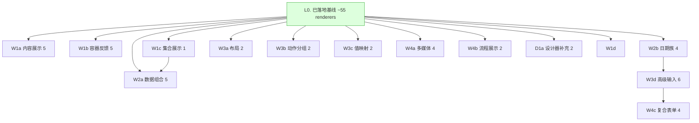

# Components Roadmap

> Last Updated: 2026-06-24
> Source: `docs/components/amis-baseline-matrix.md`, `docs/components/index.md`

## Purpose

本文是 Flux 组件从 AMIS 基线到实现的全局状态索引。AI 或维护者读完本文即知哪些工作项未实现（`todo`）、已计划（`planned`）、已完成（`done`），无需重走全部组件文档与代码。

**可标记单位是工作项（work item），不是 wave，也不是单个组件。** 每个工作项是一组可在一个 execution plan 内交付完毕的相关组件。根据本 roadmap 拟制 plan 时，一个 plan 对应一个或多个工作项；**plan 通过 closure audit 后，必须把对应工作项在 Phase Status 标记为 `done`**——每次 plan 完成后 roadmap 都有可更新内容。

**本文是编排层，不是 execution plan，也不是逐字段契约说明。** 组件契约看 `docs/components/<type>/design.md`；retained/not-retained 决策看 `docs/components/amis-baseline-matrix.md`。

## Phase Status

> **这是全文件唯一的动态状态区。更新状态只改这里。**
> 工作项按 wave 分组（W1 最优先 → W4 最后）。状态流转：draft review 通过 → `todo` 改 `planned`；closure audit 通过 → `planned` 改 `done`（不得提前）。一个 plan 可覆盖多个工作项，届时一并标记。

- L0. 已落地基线（landed）: `done`
- W1a. 内容展示组（5）: `done`（plan: `docs/plans/2026-06-24-0040-2-w1a-content-family-sanitization-plan.md`；markdown/html/link/image/json-view 5 个 renderer 落地于 `flux-renderers-content`；首次建立受控渲染安全门禁——html 默认 DOMPurify sanitize、markdown allowHtml 门禁）
- W1b. 容器与反馈组（5）: `done`（plan: `docs/plans/2026-06-24-0040-1-w1b-feedback-family-content-package-bootstrap-plan.md`；首次落地 NEW 包 `flux-renderers-content` + separator/card/progress/spinner/empty 5 个 renderer；解锁 W1a/W2a-content/W3c/W4a）
- W1c. 集合展示组（1）: `planned`（plan: `docs/plans/2026-06-24-0040-3-w1c-list-collection-display-plan.md`）
- W1d. 移动端交互组（2，pull-refresh/infinite-scroll）: `todo`（依赖 `mobile-roadmap.md` M5；`@nop-chaos/flux-renderers-mobile` 包**代码未落地**，见 mobile-roadmap Current Baseline；口径以 mobile-roadmap 为准）
- W2a. 数据组合组（5）: `todo`
- W2b. 日期族（4）: `todo`
- W3a. 布局组（2）: `todo`
- W3b. 动作分组组（2）: `todo`
- W3c. 值映射组（2）: `todo`
- W3d. 高级输入族（7）: `todo`
- W4a. 多媒体组（4）: `todo`
- W4b. 流程展示组（2）: `todo`
- W4c. 复合表单组（4）: `todo`
- D1a. 设计器补充组（2）: `todo`
- **M0.1 移动端基础设施（safe-area/hairline/haptics/z-index 栈）: `done`** ← 镜像自 `mobile-roadmap.md`（4 子项 M0.1a~M0.1d 已全部落地；plan: `docs/plans/2026-06-22-2057-1-m01-mobile-infrastructure-plan.md`；细节与口径以 mobile-roadmap 为准）
- O1. 非 retained 可选项（13）: 按需启动，不列工作项

## Status Values

| Status     | 含义                                                                                           |
| ---------- | ---------------------------------------------------------------------------------------------- |
| `done`     | 工作项全部组件已实现（`amis-baseline-matrix.md` 中为 `runtime`）且对应 plan 通过 closure audit |
| `planned`  | 已有对应 execution plan，正在或等待实现                                                        |
| `todo`     | 尚未开始，无对应 plan                                                                          |
| `proposed` | 已有提案（含 design.md 立约 / 工作项定义），**待人确认后才可改 `todo`**；AI 不得自行转 `todo`  |

## Platform Reuse

以下能力已由 Flux 现有 runtime / 包提供，实现新组件时**不得重建**，只做组装与 renderer definition：

| 能力               | 提供方                                      | 说明                                                                |
| ------------------ | ------------------------------------------- | ------------------------------------------------------------------- |
| 通用 renderer 装配 | `flux-react` renderer-runtime               | `SchemaRenderer`、region/slot 渲染、node identity                   |
| 表单运行时         | `flux-runtime`                              | scope/form runtime、validation、field metadata                      |
| UI 组件库          | `@nop-chaos/ui`                             | Button/Input/Select/Dialog/Table/Card 等基础控件；**禁止用裸 HTML** |
| 容器/布局          | `container`/`flex`/`fragment`/`page`        | 布局族已 landed，新布局组件优先组合而非新建                         |
| 数据源             | `data-source` + `api-data-source` 架构      | `service` 等数据组合组件复用该模型                                  |
| 集合渲染           | `table`/`crud`/`tree`                       | `list`/`cards`/`pagination` 等复用其 scope/行模型                   |
| 复合值字段         | `object-field`/`array-field`/`detail-field` | `combo`/`input-table`/`picker` 复用其 staged owner 语义             |

## Current Baseline

**已实现（L0，约 55 个 renderer）：**

通用 renderer：`fragment` `loop` `recurse` `page` `container` `flex` `text` `button` `icon` `badge` `dynamic-renderer` `reaction` `dialog` `drawer` `tabs` `form` `fieldset` `code-editor` `input-text` `input-email` `input-password` `textarea` `select` `checkbox` `switch` `radio-group` `checkbox-group` `input-tree` `tree-select` `tag-list` `key-value` `array-editor` `condition-builder` `object-field` `array-field` `variant-field` `detail-field` `detail-view` `table` `tree` `data-source` `chart` `crud` `input-number`

领域 renderer（package 已提供 definition，宿主是否启用取决于 registry 装配）：`designer-page` `designer-field` `designer-canvas` `designer-palette` `report-inspector-shell` `report-inspector` `report-field-panel` `report-designer-page` `report-toolbar` `spreadsheet-page` `word-editor-page`

**Ongoing 巩固（与 wave 并行的持续工作）：**

- 巩固已注册 renderer 的 schema、field metadata、example.json 和回归验证
- 保持 `docs/components/<type>/design.md` 与实际 renderer definition 一致
- surface family（`dialog`/`drawer`）收口为统一 runtime/host/entry 模型，消除 declarative path 与 action-opened path 双轨

**核心缺口：** 43 个 retained-but-unimplemented renderer（W1–W4，12 个工作项）+ 2 个 declared-but-unregistered（D1a）+ 13 个非 retained 可选项（O1）。

---

## Work Items

> 每个 work item = 一个 execution plan 的合理交付范围。组件数标在括号内。

### Wave 1 — 基础展示族

| Work item             | 组件                                            | Package                        | 依赖   | Reuse                                        |
| --------------------- | ----------------------------------------------- | ------------------------------ | ------ | -------------------------------------------- |
| W1a 内容展示组（5）   | `markdown` `html` `link` `image` `json-view`    | `flux-renderers-content` (NEW) | L0     | `text`/`icon`/`badge`                        |
| W1b 容器与反馈组（5） | `separator` `card` `progress` `spinner` `empty` | `flux-renderers-content` (NEW) | L0     | `@nop-chaos/ui` Card/Progress/Skeleton/Empty |
| W1c 集合展示组（1）   | `list`                                          | `flux-renderers-data`          | L0     | `table`/`tree` 行模型                        |
| W1d 移动端交互组（2） | `pull-refresh` `infinite-scroll`                | `flux-renderers-mobile` (NEW)  | L0、M0 | `useTouch` Hook + `page` 集成                |

### Wave 2 — 数据组合与日期族

| Work item           | 组件                                                                                                                                       | Package               | 依赖                             | Reuse                   |
| ------------------- | ------------------------------------------------------------------------------------------------------------------------------------------ | --------------------- | -------------------------------- | ----------------------- |
| W2a 数据组合组（5） | `service` `pagination` → `flux-renderers-data`; `cards` `alert` → `flux-renderers-content` (NEW); `wizard` → `flux-renderers-layout` (NEW) | split                 | L0；`service` 依赖 `data-source` | `data-source`/`crud`    |
| W2b 日期族（4）     | `input-date` `input-datetime` `input-time` `date-range`                                                                                    | `flux-renderers-form` | L0                               | 共享日期格式化/校验底层 |

### Wave 3 — 布局与高级表单族

| Work item           | 组件                                                                                                                                                                                | Package                        | 依赖                     | Reuse                                  |
| ------------------- | ----------------------------------------------------------------------------------------------------------------------------------------------------------------------------------- | ------------------------------ | ------------------------ | -------------------------------------- |
| W3a 布局组（2）     | `grid` `collapse`                                                                                                                                                                   | `flux-renderers-layout` (NEW)  | L0                       | `flex`/`container`                     |
| W3b 动作分组组（2） | `button-group` `dropdown-button`                                                                                                                                                    | `flux-renderers-layout` (NEW)  | L0                       | `button` + ui ButtonGroup/DropdownMenu |
| W3c 值映射组（2）   | `mapping` `status`                                                                                                                                                                  | `flux-renderers-content` (NEW) | L0                       | `text`/`badge`                         |
| W3d 高级输入族（7） | `input-month` `input-quarter` `input-year` → `flux-renderers-form`; `input-file` `input-image` `editor` → `flux-renderers-form-advanced`; `markdown-editor` → `flux-renderers-form` | split                          | L0；上传族需宿主存储契约 | 日期底层 + form core                   |

### Wave 4 — 多媒体与复合表单族

| Work item           | 组件                                      | Package                        | 依赖 | Reuse                                      |
| ------------------- | ----------------------------------------- | ------------------------------ | ---- | ------------------------------------------ |
| W4a 多媒体组（4）   | `audio` `video` `carousel` `qrcode`       | `flux-renderers-content` (NEW) | L0   | 第三方库优先                               |
| W4b 流程展示组（2） | `steps` `timeline`                        | `flux-renderers-layout` (NEW)  | L0   | `@nop-chaos/ui`                            |
| W4c 复合表单组（4） | `combo` `picker` `transfer` `input-table` | `flux-renderers-form-advanced` | L0   | `array-editor`/`object-field` staged owner |

### Follow-up

| Work item             | 组件                                     | 依赖               | 备注                  |
| --------------------- | ---------------------------------------- | ------------------ | --------------------- |
| D1a 设计器补充组（2） | `designer-node-card` `designer-edge-row` | L0 designer family | schema 已声明，需注册 |

---

## Wave Details

### W1a 内容展示组

**目标：** 纯内容渲染组件，覆盖典型内容页。注意 `html`/`markdown` 的受控渲染与 XSS 边界（见 `security-design-requirements.md`）。

### W1b 容器与反馈组

**目标：** 容器分隔与状态/空态反馈。优先复用 `@nop-chaos/ui` 的 Card/Progress/Spinner/Skeleton/Empty。

### W1c 集合展示组

**目标：** `list` 作为有序集合展示 renderer，与 `table`/`tree` 明确边界。

### W1d 移动端交互组

**目标：** 提供移动端核心交互容器。`pull-refresh` 是容器型 renderer（包裹子内容，响应下拉手势触发刷新），`infinite-scroll` 是内建于集合 renderer 的行为（触底自动加载）。二者共用 `useTouch` Hook。归属 `@nop-chaos/flux-renderers-mobile` 包。

| 组件              | 类型             | 集成目标                                               |
| ----------------- | ---------------- | ------------------------------------------------------ |
| `pull-refresh`    | renderer（容器） | page.pullRefresh、crud 内建                            |
| `infinite-scroll` | 内建行为         | crud / list 内建                                       |
| `useTouch`        | Hook             | PullRefresh、Tabs、BottomSheet、SwipeCell、Slider 共用 |

### W2a 数据组合组

**目标：** 数据组合容器与分页。`service` 复用 `data-source` 架构；`pagination` 与集合 renderer 的内建分页明确边界。

### W2b 日期族

**目标：** 日期时间表单输入。共享同一格式化/校验底层；`date-range` 统一收敛 range 变体。

### W3a 布局组

**目标：** 显式网格与折叠容器，基于 `flex`/`container` 之上，不重建布局引擎。

### W3b 动作分组组

**目标：** 分组与下拉式动作触发，复用 `button`。

### W3c 值映射组

**目标：** 值到标签/状态的映射展示。

### W3d 高级输入族

**目标：** 周期输入（月/季/年）、上传（文件/图片）、WYSIWYG 富文本（TipTap）、markdown 编辑器。`editor` 用 TipTap 实现 WYSIWYG 表单字段；`markdown-editor` 用 Textarea + react-markdown 实现源码编辑+预览，零新依赖。上传族标注为跨宿主集成点。

### W4a 多媒体组

**目标：** 音视频/轮播/二维码，优先评估第三方库复用。

### W4b 流程展示组

**目标：** 步骤进度与时间线展示。

### W4c 复合表单组

**目标：** 高级复合选择/编辑控件。`combo`/`input-table` 复用复合值字段 staged owner；`picker`/`transfer` 明确与 `select`/`tree-select` 的边界。

### D1a 设计器补充组

**目标：** 把 schema 已声明的 `designer-node-card`、`designer-edge-row` 接入 designer registry。

---

## Dependency Graph

## Component Coverage

> 静态映射：待实现组件 → 工作项 → owner doc。逐组件实现状态以 `docs/components/amis-baseline-matrix.md` 为唯一权威；工作项级状态看顶部 Phase Status。

| 组件                 | Work item | Package                        | Owner doc                                      |
| -------------------- | --------- | ------------------------------ | ---------------------------------------------- |
| `markdown`           | W1a       | `flux-renderers-content`       | `docs/components/markdown/design.md`           |
| `html`               | W1a       | `flux-renderers-content`       | `docs/components/html/design.md`               |
| `link`               | W1a       | `flux-renderers-content`       | `docs/components/link/design.md`               |
| `image`              | W1a       | `flux-renderers-content`       | `docs/components/image/design.md`              |
| `json-view`          | W1a       | `flux-renderers-content`       | `docs/components/json-view/design.md`          |
| `separator`          | W1b       | `flux-renderers-content`       | `docs/components/separator/design.md`          |
| `card`               | W1b       | `flux-renderers-content`       | `docs/components/card/design.md`               |
| `progress`           | W1b       | `flux-renderers-content`       | `docs/components/progress/design.md`           |
| `spinner`            | W1b       | `flux-renderers-content`       | `docs/components/spinner/design.md`            |
| `empty`              | W1b       | `flux-renderers-content`       | `docs/components/empty/design.md`              |
| `list`               | W1c       | `flux-renderers-data`          | `docs/components/list/design.md`               |
| `pull-refresh`       | W1d       | `flux-renderers-mobile`        | `docs/components/pull-refresh/design.md`       |
| `infinite-scroll`    | W1d       | `flux-renderers-mobile`        | `docs/components/infinite-scroll/design.md`    |
| `service`            | W2a       | `flux-renderers-data`          | `docs/components/service/design.md`            |
| `pagination`         | W2a       | `flux-renderers-data`          | `docs/components/pagination/design.md`         |
| `cards`              | W2a       | `flux-renderers-content`       | `docs/components/cards/design.md`              |
| `wizard`             | W2a       | `flux-renderers-layout`        | `docs/components/wizard/design.md`             |
| `alert`              | W2a       | `flux-renderers-content`       | `docs/components/alert/design.md`              |
| `input-date`         | W2b       | `flux-renderers-form`          | `docs/components/input-date/design.md`         |
| `input-datetime`     | W2b       | `flux-renderers-form`          | `docs/components/input-datetime/design.md`     |
| `input-time`         | W2b       | `flux-renderers-form`          | `docs/components/input-time/design.md`         |
| `date-range`         | W2b       | `flux-renderers-form`          | `docs/components/date-range/design.md`         |
| `grid`               | W3a       | `flux-renderers-layout`        | `docs/components/grid/design.md`               |
| `collapse`           | W3a       | `flux-renderers-layout`        | `docs/components/collapse/design.md`           |
| `button-group`       | W3b       | `flux-renderers-layout`        | `docs/components/button-group/design.md`       |
| `dropdown-button`    | W3b       | `flux-renderers-layout`        | `docs/components/dropdown-button/design.md`    |
| `mapping`            | W3c       | `flux-renderers-content`       | `docs/components/mapping/design.md`            |
| `status`             | W3c       | `flux-renderers-content`       | `docs/components/status/design.md`             |
| `input-month`        | W3d       | `flux-renderers-form`          | `docs/components/input-month/design.md`        |
| `input-quarter`      | W3d       | `flux-renderers-form`          | `docs/components/input-quarter/design.md`      |
| `input-year`         | W3d       | `flux-renderers-form`          | `docs/components/input-year/design.md`         |
| `input-file`         | W3d       | `flux-renderers-form-advanced` | `docs/components/input-file/design.md`         |
| `input-image`        | W3d       | `flux-renderers-form-advanced` | `docs/components/input-image/design.md`        |
| `editor`             | W3d       | `flux-renderers-form-advanced` | `docs/components/editor/design.md`             |
| `markdown-editor`    | W3d       | `flux-renderers-form`          | `docs/components/markdown-editor/design.md`    |
| `audio`              | W4a       | `flux-renderers-content`       | `docs/components/audio/design.md`              |
| `video`              | W4a       | `flux-renderers-content`       | `docs/components/video/design.md`              |
| `carousel`           | W4a       | `flux-renderers-content`       | `docs/components/carousel/design.md`           |
| `qrcode`             | W4a       | `flux-renderers-content`       | `docs/components/qrcode/design.md`             |
| `steps`              | W4b       | `flux-renderers-layout`        | `docs/components/steps/design.md`              |
| `timeline`           | W4b       | `flux-renderers-layout`        | `docs/components/timeline/design.md`           |
| `combo`              | W4c       | `flux-renderers-form-advanced` | `docs/components/combo/design.md`              |
| `picker`             | W4c       | `flux-renderers-form-advanced` | `docs/components/picker/design.md`             |
| `transfer`           | W4c       | `flux-renderers-form-advanced` | `docs/components/transfer/design.md`           |
| `input-table`        | W4c       | `flux-renderers-form-advanced` | `docs/components/input-table/design.md`        |
| `designer-node-card` | D1a       | `flow-designer-renderers`      | `docs/components/designer-node-card/design.md` |
| `designer-edge-row`  | D1a       | `flow-designer-renderers`      | `docs/components/designer-edge-row/design.md`  |

**O1. 非 retained 可选项**（启动任一项前需先更新 `amis-baseline-matrix.md` 的 retained 决策，并为其建工作项）：

- AMIS-derived（有 AMIS 源 type）：`slider`/future `input-slider`、`rating`、`avatar`、`input-color`、`icon-picker`、`location-picker`、`input-city`、`input-signature`、`calendar`、`nav`、`anchor-nav`、`portlet`、`iframe`
- Flux-native 移动端组件（无 AMIS 源，不走 amis-baseline-matrix，启动时建 `docs/components/<type>/design.md` + 工作项即可）：`area`（省市区选择，收货地址依赖）、`number-keyboard`（支付/验证码数字键盘）、`back-top`（长列表回到顶部）

> Flux-native 移动端组件的 retained 决策类比 `mobile-roadmap.md` M5（pull-refresh 等 5 个移动端原生组件也无 AMIS 源，不经 amis-baseline-matrix，直接在 mobile-roadmap 立工作项）。上述 3 个 Flux-native 候选优先级低于 M0.1/M5，按需启动。

## Cross-Cutting

| 关注点              | 说明                                                                                                                                                                                                                                                                                                                                               |
| ------------------- | -------------------------------------------------------------------------------------------------------------------------------------------------------------------------------------------------------------------------------------------------------------------------------------------------------------------------------------------------- |
| Renderer 契约       | 每个新组件必须有 `design.md` + `example.json` + renderer definition（见 `renderer-implementation-guidelines.md`）                                                                                                                                                                                                                                  |
| UI 组件来源         | 一律复用 `@nop-chaos/ui`，禁止裸 HTML                                                                                                                                                                                                                                                                                                              |
| Field metadata      | 表单类组件遵循 `field-metadata-slot-modeling.md` 契约                                                                                                                                                                                                                                                                                              |
| 请求下沉            | 新组件**不得声明挂载时自动加载数据的 schema 字段**（如 `initFetch`/`api`/`source` 等挂载触发语义）。数据请求必须通过 `data-source` + action graph 下沉到请求层。用户交互驱动的按需加载（如 tree `childrenSource` 展开加载、input `suggestSource` 输入建议）不在此限。违反示例与裁定见 `docs/bugs/15-component-level-initfetch-analysis-and-fix.md` |
| 安全                | `html`/`markdown`/`editor`/`iframe` 等需受控渲染                                                                                                                                                                                                                                                                                                   |
| 单测                | 每个落地组件配 focused 单测                                                                                                                                                                                                                                                                                                                        |
| **Playground 示例** | **每个新组件或能力改进，必须在 `apps/playground/src/` 下有可交互示例页面，注册到 playground 路由**                                                                                                                                                                                                                                                 |
| **E2E 测试**        | **每个新组件或能力改进，必须在 `tests/e2e/` 下有对应 e2e 测试文件，覆盖关键交互路径（视口切换、点击、输入、提交等）**                                                                                                                                                                                                                              |
| Owner-doc 同步      | 工作项关闭时更新 `amis-baseline-matrix.md` 状态 + `docs/components/index.md`                                                                                                                                                                                                                                                                       |
| Dev log             | 每次实现后更新 `docs/logs/{year}/`                                                                                                                                                                                                                                                                                                                 |

## Rule

- 本文档是状态索引和粗粒度工作项划分，不是 execution plan。
- **本文档是人与 AI 的对齐点**：工作项的增删、拆分、优先级重排需人确认——这体现人类规划。AI 按既定顺序取第一个 `todo` 工作项执行，不重新仲裁优先级、不跳过、不凭空新增工作项。
- **`proposed` 状态的工作项是 AI 起草的提案，需人确认后才可改 `todo` 进入执行队列；AI 不得自行把 `proposed` 改为 `todo`。** AI 可自主推进 `todo`→`planned`→`done`（基于 plan 完成的客观事实），但不能跨过人审把 `proposed` 变成可执行项。
- **plan 由 AI 自动拟制和执行，人不审 individual plan**；plan 质量靠 closure audit 兜底。人通过 Phase Status 观察 AI 进度。
- **可标记单位是工作项**（W1a…D1a，以及镜像自 `mobile-roadmap.md` 的 M0.1），不是 wave。wave 只是优先级分组。
- AI 可自主推进工作项状态（`todo`→`planned`→`done`），这是基于 plan 完成的客观事实记录，不需要人确认；但工作项本身的增删/重排需人确认。
- 移动端轨道（M0.1/M1-M5）的主入口是 `mobile-roadmap.md`，本文件只做 Phase Status 镜像；M0.1 等移动端工作项的细节看 `mobile-roadmap.md`。
- **W1d 移动端交互组（pull-refresh/infinite-scroll）与 `mobile-roadmap.md` M5 共享同一批交付物**（同属 `flux-renderers-mobile` 包，共用 `useTouch` Hook）。代码落地状态、口径、打勾单位以 `mobile-roadmap.md` Current Baseline 为准；当前两者代码均未落地。当 M5 plan 完成时，W1d 随 M5 一并标 `done`，避免重复打勾或漏打勾。
- 根据 roadmap 拟制 plan 时，plan 对应一个或多个工作项；**plan 通过 closure audit 后，必须把对应工作项在 Phase Status 标记为 `done`**，并同步 `amis-baseline-matrix.md` 的组件状态。
- 不得在 closure audit 通过前把工作项标为 `done`。
- 工作项状态变更只需更新 Phase Status（本文档顶部）。
- 组件 retained/not-retained 决策以 `amis-baseline-matrix.md` 为准。
- 新组件一律先创建目录，再补 `design.md` 和 `example.json`；未实现组件的文档必须写"目标契约"，不得伪装成已落地。
