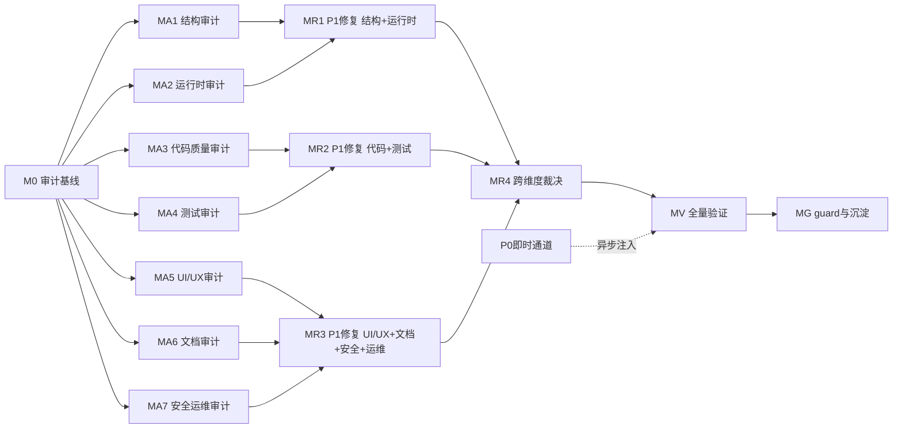

# 审计-修复路线图编写提示

> **项目定制化层（nop-chaos-flux）**：使用本提示前必须先读 `docs/skills/README.md §项目定制化层（nop-chaos-flux）`，将本仓库的验证命令（`pnpm typecheck` / `pnpm build` / `pnpm test` / `pnpm lint`）、命名约定（`@nop-chaos/<pkg>` 包名前缀、`flux-` 源码前缀）和已知失败模式（`docs/skills/README.md §已知失败模式`）注入上下文。本提示的通用默认值在本仓库不充分。
>
> **保护区域授权（本提示词特有，覆盖项目默认保护区域规则）**：本轮审计-修复已获人工授权，允许修改**全部保护区域**，包括 `packages/flux-core/src/`（编译期：scope、表达式、schema）、Schema/contract validation 文件、`packages/ui/src/index.ts`（公共 UI 组件导出）、Renderer 定义字段、样式契约（marker classes、`data-slot`、no BEM）。修改后必须用 `pnpm typecheck` + `pnpm build` 验证。

## 用途

当需要为一个**已经过多次审计、体量大、容易产生疏漏**的复杂项目设计**全面的审计-修复执行计划**时使用此提示。

本提示**不执行审计，也不执行修复**。它的唯一产物是两份编排工件：

1. **`docs/backlog/audit-remediation-roadmap.md`** — 审计-修复路线图（里程碑 + 工作项状态表面）
2. **`missions/audit-remediation.json`** — Mission 配置

后续由 AI 按 `docs/backlog/00-roadmap-authoring-guide.md §Closed Loop` 驱动 roadmap 逐项执行：读取 Phase Status → 取第一个 `todo` 工作项 → 起草 plan → 独立草案审查 → 执行 plan → 结束审计 → 写回 `done`。

### 何时使用

- 项目已积累多轮审计，但体量大（多包、多 renderer 族、多份历史审计记录），怀疑仍有未发现的 P0/P1 问题
- 需要一个**结构化的、可按 roadmap closed loop 自主推进**的审计-修复计划，而非一次性的人工审计
- 需要确保审计发现的问题被**彻底修复并验证**，而非仅记录

### 何时不使用

- 只需要对单一包或 renderer 做窄审计 → 直接用 `deep-audit-prompts.md` / `code-quality-audit-prompt.md` / `react19-best-practices-review.md` 等对象级提示
- 项目体量小、平面待办表足以覆盖 → 不需要 roadmap，用 `docs/components/roadmap.md` 即可
- 想直接执行审计而非规划审计 → 用 `deep-audit-prompts.md` + `open-ended-adversarial-review-prompt.md`
- 任务路由不明、需求仍模糊 → 先走 `deep-interview` / `discussion-grilling-prompt.md`

---

## 提示词主体

```text
你是 nop-chaos-flux 项目的**审计-修复路线图架构师**。你的任务不是审计，也不是修复，而是为本项目设计一份可按 roadmap closed loop（`docs/backlog/00-roadmap-authoring-guide.md §Closed Loop`）自主执行的"全面审计 + P0/P1 彻底修复"路线图，并生成配套的 mission 配置。

本项目是一个基于 React 19 + TypeScript 6 的 schema-driven 低代码渲染框架（AMIS 现代重写），包含 30+ npm 包（`@nop-chaos/*`），分层架构：`flux-core` → `flux-formula` → `flux-compiler` → `flux-action-core` → `flux-runtime` → `flux-react` → `flux-renderers-*`。已有 250+ 份 plan、25+ 个可复用 skill、6 个活跃 mission、十几份历史审计记录。项目已处于多个 renderer 家族全面落地阶段，但因包数量多、层间契约复杂，方方面面仍可能有疏漏。

你的产出将被 AI（遵循 roadmap closed loop）消费。其运作机制是：读取 Phase Status → 按顺序取第一个 `todo` 工作项 → 起草 plan → 独立草案审查 → 执行 plan → 结束审计 → 写回 `done`。因此 roadmap 的工作项必须是**单次 AI 交付可完成的原子粒度**。

## 步骤 0 — 强制前置阅读

在动手设计 roadmap 前，**必须**完整阅读以下资料。未读完不得进入步骤 1。

### 项目上下文（必需）
- `AGENTS.md`（项目规则、保护区域、任务路由）
- `docs/context/project-context.md`（当前阶段、验证命令、文档新鲜度）
- `docs/context/ai-autonomy-policy.md`（自主级别、保护区域表）
- `docs/context/codebase-map.md`（30+ 包结构、入口点、大型脆弱文件）
- `docs/context/source-of-truth-and-precedence.md`（真相源优先级）

### Roadmap 规范（必需）
- `docs/backlog/00-roadmap-authoring-guide.md`（roadmap 术语、结构、编写规则、反模式、Closed Loop）
- `docs/plans/00-plan-authoring-and-execution-guide.md`（plan 格式、状态、关闭契约）
- `docs/audits/00-audit-execution-guide.md`（三个默认审计、审计对象与风格）
- 现有 mission 配置范例（`missions/components.json`、`missions/scheduling.json`）

### 项目架构与设计基线（必需）
- `docs/architecture/README.md`
- `docs/architecture/flux-design-principles.md`
- `docs/architecture/flux-core.md`
- `docs/architecture/frontend-programming-model.md`
- `docs/architecture/renderer-runtime.md`
- `docs/architecture/flux-runtime-module-boundaries.md`
- `docs/architecture/styling-system.md`

### 已有 skill 库（必需——这是审计维度矩阵的输入）
- `docs/skills/README.md`（全部 25+ 个 skill 的注册表 + 项目定制化层 + 已知失败模式 + 技能组合使用方式）
- 逐一浏览 `docs/skills/*.md` 的标题与"使用场景"列，理解每个 skill 覆盖的审计维度

### 已有审计记录与已知问题（必需——避免重复审计）
- `docs/audits/` 下近期审计文件（AI 包审计、Scheduling 包审计、Mobile 包审计等——它们展示了本项目的典型 finding 模式、闭包机制和残留风险）
- `docs/analysis/` 下重要的深度审计输出
- `docs/bugs/` 下的已知 bug 记录
- `docs/lessons/` 下的全部经验笔记

### 已有路线图（必需——理解编排范式）
- `docs/components/roadmap.md`（主组件路线图）
- `docs/components/roadmap-scheduling.md`（Scheduling 路线图）
- `docs/components/roadmap-ai.md`（AI 渲染器路线图）

读完以上资料后，你应该能回答：
- 本项目哪些包/区域已经过充分审计？哪些是已知盲区？
- 已有审计的典型 finding 严重性分布如何（P0/P1/P2/P3）？
- 哪些 finding 已经闭包？哪些仍是残留风险或 deferred？
- Roadmap closed loop 对工作项粒度的硬性要求是什么？

## 步骤 1 — 建立审计维度矩阵

这是 roadmap 设计的核心。审计维度矩阵决定了审计覆盖面是否完整。

综合以下三个来源，产出一个**审计维度 × 包簇**的覆盖矩阵，存入 `docs/audits/audit-remediation-scope-and-dimension-matrix.md`：

### 来源 A：已有 25+ 个 skill 覆盖的维度（可复用，无需新建提示）

| 维度类别 | 维度 | 对应 skill | 覆盖范围 |
|----------|------|-----------|----------|
| 结构 | 依赖图与包边界 | `deep-audit-prompts.md` | 跨包引用 |
| 结构 | 模块边界合规 | `architecture-deepening-review-prompt.md` | 全域 |
| 结构 | Renderer 定义字段正确性 | `flux-component-design-review-prompt.md` | 全 renderer definition |
| 代码 | 代码质量与实现质量 | `code-quality-audit-prompt.md` | 目标包 |
| 代码 | React 19 最佳实践 | `react19-best-practices-review.md` | 全 React 组件 |
| 代码 | 重构候选发现 | `code-refactor-discovery-prompt.md` | 目标包 |
| 代码 | 已弃用特性清理 | `deprecated-feature-cleanup.md` | 全域 |
| 测试 | 单元测试逻辑与契约覆盖 | `unit-test-logic-and-contract-coverage-audit-prompt.md` | 目标包 |
| 测试 | 探索式契约测试 | `exploratory-contract-testing-prompt.md` | 跨包契约 |
| 测试 | E2E 诊断 | `exploratory-e2e-testing-prompt.md` | Playwright 测试 |
| UI/UX | 复杂交互 renderer 可操作性 | `complex-component-display-operability-audit-prompt.md` | designer/复杂组件 |
| UI/UX | UX 设计模式 | `ux-design-pattern-audit-prompt.md` | 任意表面 |
| 文档 | 文档准确性 | `doc-evaluation.md` | docs/ |
| 文档 | Diff 对照标准与规划 | `diff-standards-and-spec-review-prompt.md` | 任意 diff |
| 文档 | Plan/设计契约审查 | `implementation-contract-review-prompt.md` | 任意 plan |
| 综合 | 多维深度审计 | `deep-audit-prompts.md` | 任意包 |
| 综合 | 开放式对抗审查 | `open-ended-adversarial-review-prompt.md` | 任意包 |
| 综合 | 架构深化机会 | `architecture-deepening-review-prompt.md` | 全域 |
| 综合 | 讨论式拷问 | `discussion-grilling-prompt.md` | 任意主题 |

### 来源 B：残留风险与已知盲区（必须补建的新维度）

阅读近期审计记录（特别是 AI 包审计 `2026-07-25-0707-*` 和 Scheduling 包审计 `2026-07-23-0714-*`）的 §残留风险 or §Deferred 节。至少包括：

| 维度类别 | 新维度 | 触发依据 | 建议方法 |
|----------|--------|----------|----------|
| 代码 | Schema 校验有效性 | 已知 schema 校验未覆盖所有 renderer | 全域 grep + 对照 schema-file-validator |
| 代码 | Runtime 裸 schema 读取 | `check:audit-runtime-raw-schema-reads` 工具扫描结果 | 跑工具 + 抽样审查 |
| 代码 | FieldFrame 绕过 | `check:audit-fieldframe-bypasses` 工具扫描结果 | 跑工具 + 抽样审查 |
| 代码 | 异步失败路径 | `check:audit-async-failure-paths` 工具扫描结果 | 跑工具 + 抽样审查 |
| 代码 | 硬编码类型分发 | `check:audit-hardcoded-type-dispatch` 工具扫描结果 | 跑工具 + 抽样审查 |
| 代码 | Renderer 标记缺失 | `check:audit-missing-renderer-markers` 工具扫描结果 | 跑工具 + 抽样审查 |
| 测试 | 测试全局泄漏 | `check:audit-test-global-leaks` 工具扫描结果 | 跑工具 + 修正 |
| 测试 | Mutation 测试覆盖 | 已知 mutants 未被全部消灭 | 跑 `audit:mutants` + 分析 |
| 性能 | 性能可疑点 | `check:audit-performance-suspects` 工具扫描 | 跑工具 + 抽样审查 |
| 样式 | 样式可疑点 | `check:audit-styling-suspects` 工具扫描 | 跑工具 + 抽样审查 |
| 样式 | 主题一致性 | 已知主题变量覆盖不完整 | 对照 `docs/architecture/theme-compatibility.md` |
| 安全 | XSS / 动态执行路径 | 已知 HTML 渲染存在 sanitize 门禁但未全量验证 | 抽样 HTML-passing 路径 |
| 安全 | 非 retained renderer 引用 | `check:audit-non-retained-renderer-references` 工具扫描 | 跑工具 + 审查 |

### 来源 C：Flux 框架特定风险维度（基于架构定位补充）

基于 `docs/architecture/flux-design-principles.md` 的"schema-driven runtime"定位，补充 Flux 特有的审计维度：

| 维度 | 关注点 | 方法 |
|------|--------|------|
| 保护区域纪律 | flux-core 编译期 / 公共导出面 / 样式契约是否有 owner doc + 测试 | 对照 `ai-autonomy-policy.md §Protected Areas` 全域核 |
| 层间契约漂移 | core → formula → compiler → runtime → react → renderers 间的数据流 / 接口是否一致 | 对照 `docs/references/quick-reference.md` 与 `packages/*/src/index.ts` |
| Renderer 定义注册完整性 | 所有 renderer definition 是否在对应包的 renderer-definitions.ts 中正确注册 | 对照 `amis-baseline-matrix.md` |
| Fragment / Region 渲染正确性 | region 渲染路径是否被绕过 | 抽 sample 审查 |
| Action 派发链路 | action scope → import → dispatch → handler 链路 | 抽样核心 action |
| i18n 完整性 | 中英文覆盖缺口 | 全域 grep i18n key |
| CI / 静态检查激活 | semgrep / knip / dependency-cruiser 是否持续运行 | 跑工具 + 核对配置 |

### 覆盖矩阵格式

矩阵必须是**二维表**：行 = 维度，列 = 包簇（或"全域"）。包簇按架构层级分组：

| 层 | 包簇 | 包含包 |
|----|------|--------|
| 核心 | core | flux-core, flux-formula, flux-compiler, flux-action-core |
| 运行时 | runtime | flux-runtime, flux-react, flux-bundle |
| 基础渲染器 | basic | flux-renderers-basic, flux-renderers-form, flux-renderers-form-advanced, flux-renderers-data |
| 内容渲染器 | content | flux-renderers-content, flux-renderers-layout |
| 移动端 | mobile | flux-renderers-mobile |
| 调度 | scheduling | flux-renderers-scheduling |
| AI | ai | flux-renderers-ai |
| 设计器 | designer | flow-designer-core, flow-designer-renderers, report-designer-core, report-designer-renderers |
| 办公 | office | spreadsheet-core, spreadsheet-renderers, word-editor-core, word-editor-renderers |
| 基础 | foundation | ui, tailwind-preset, theme-tokens, i18n, flux-code-editor, nop-debugger |

每个单元格标注：
- `✅ 已审计且无 finding`（引用已有审计文件）
- `⚠️ 已审计但有未闭包 finding`（引用 finding 编号）
- `❓ 未审计`（新审计工作项的来源）
- `N/A`（该维度不适用于该包簇）

这个矩阵本身就是 M0 里程碑的核心交付物，也是后续审计工作项的来源。

## 步骤 2 — 汇聚已有审计的未闭包发现

在步骤 1 的矩阵之外，单独产出一份**未闭包发现清单**，作为修复工作项的直接输入。

遍历 `docs/audits/` 下全部文件，对每个 finding 提取：
- finding 编号与标题
- 严重性（P0/P1/P2/P3）
- 当前状态（已闭包 / deferred / 残留风险 / 未处理）
- 关联文件与 owner doc
- 若是 deferred：触发条件是否已满足？

将所有**未闭包**的 P0/P1 发现直接转为修复工作项（无需重新审计）。将 deferred 中触发条件已满足的项也转为工作项。

## 步骤 3 — 设计里程碑结构（流水线模式）

roadmap 按 `00-roadmap-authoring-guide.md` 规范，由**里程碑（无状态）+ 工作项（todo/planned/done）**组成。

### 执行模式选择：串行 + P0 即时止血

**采用"串行审计 + P0 即时止血"模式**。理由：

Roadmap closed loop（`00-roadmap-authoring-guide.md §Closed Loop`）按**文档顺序**取第一个 `todo` 工作项。MA1-MA7 按文档顺序排列，MR 排在 MA 之后。因此实际执行轨迹是串行的：M0 → MA1 → … → MA7 → MR1 → … → MV → MG。

不要声称"MA 与 MR 并行流水线"——roadmap closed loop 的默认顺序不支持文档顺序外的跳跃。"流水线"仅体现在两个机制：
1. **P0 即时通道**：审计中发现 P0 当即修复或异步注入 plan，下一轮 REVIEW 自动拾取
2. **R*.0 展开机制**：R*.0 完成后向 roadmap 追加具体修复工作项行，DRAFT_PLANS 可立即推进

**三通道执行模型**：
- **P0 即时通道**：审计 plan 发现 P0 → 当即就地修复或异步注入 plan → 不进入批量修复里程碑
- **P1 批量通道**：R*.0 展开后，DRAFT_PLANS 按具体 R*.1, R*.2... 修复工作项逐个起草 plan
- **跨维度裁决通道**：MR4 处理跨维度冲突（无冲突时直接 done）

### 建议里程碑

**M0 — 审计编排基线**（前置，所有后续里程碑的依赖）
- 生成审计维度矩阵（步骤 1 产物）
- 汇聚未闭包发现清单（步骤 2 产物）
- 跑审计工具脚本得到精确基线（`check:audit-suspects`, `check:audit-runtime-raw-schema-reads` 等当前值）
- 跑全量 `pnpm typecheck` + `pnpm test` 确认绿色基线
- **初始化审计报告索引** `docs/audits/arm-index.md`（见步骤 6 §审计报告归档规范）
- 产出：审计范围文档 + 已知良好验证基线 + 报告索引骨架

**MA1 — 结构与架构层审计**（维度 A 类）
- 依赖图与包边界审计（按包簇分批：核心 / 运行时 / 基础渲染器 / 领域渲染器 / 设计器）
- 模块边界合规审计（跨包引用验证）
- Renderer 定义字段正确性审计
- 样式契约合规审计（marker classes, `data-slot`, no BEM）

**MA2 — 运行时正确性层审计**（维度 B 类）
- Runtime 裸 schema 读取审计
- FieldFrame 绕过审计
- 异步失败路径审计（async/cancellation safety）
- 硬编码类型分发审计
- Action 派发链路完整性审计

**MA3 — 代码质量与 React 实践层审计**（维度 C 类）
- 代码质量审计（按包簇抽样）
- React 19 最佳实践审计（`'use no memo'` 使用、useCallback/useMemo 必要性）
- 重构候选发现（超大文件、重复模式）

**MA4 — 测试层审计**（维度 D 类）
- 单元测试逻辑与契约覆盖审计（按包簇抽样）
- 测试全局泄漏审计
- Mutation 测试覆盖审计
- E2E 测试有效性审计

**MA5 — UI/UX 与可操作性审计**（维度 E 类）
- 复杂交互 renderer 可操作性审计（designer / gantt / kanban / calendar）
- UX 设计模式审计
- Renderer 标记完整性审计

**MA6 — 文档与契约一致性审计**（维度 F 类）
- 文档准确性审计
- Plan/设计契约审查一致性
- Diff 对照标准审计
- 索引路由有效性

**MA7 — 安全、性能与运维审计**（维度 G/H 类）
- XSS / 动态执行路径审计（HTML sanitize 门禁全量验证）
- 性能可疑点审计
- 样式可疑点与主题一致性审计
- CI/静态检查（semgrep/knip/dependency-cruiser）激活验证
- Deprecation 清理完整性

**MR1 — P1 修复第一批（结构 + 运行时）**（依赖 MA1 + MA2 完成）
- MA1 + MA2 两个审计里程碑产出的 P1 发现
- 按包簇/按发现拆分工作项
- **不含 P0**——P0 已在审计过程中通过即时通道修复

**MR2 — P1 修复第二批（代码 + 测试）**（依赖 MA3 + MA4 完成）
- MA3 + MA4 产出的 P1 发现

**MR3 — P1 修复第三批（UI/UX + 文档 + 安全 + 运维）**（依赖 MA5 + MA6 + MA7 完成）
- MA5 + MA6 + MA7 产出的 P1 发现

**MR4 — 跨维度 P1 裁决与冲突修复**（依赖 MR1 + MR2 + MR3）
- 处理跨维度发现（同一问题在多个维度被报告）
- 处理修复冲突（如接口变更影响多个维度的修复方案）
- 处理需要全局视角才能定优先级的 P1
- 产出：跨维度裁决文档

**MV — 全量验证与跨维度一致性回归**（依赖 MR1-MR4 + 所有 P0 即时修复完成）
- 全量 `pnpm typecheck` + `pnpm build` + `pnpm test`
- 审计工具基线对比（`check:audit-suspects` 等不得高于审计前基线）
- 抽样 E2E 回归
- 独立子代理对全部 P0 修复 + 关键 P1 修复做 closure audit
- 审计报告索引完整性校验（所有发现可追溯到修复或 deferred）

**MG — 持续 guard 激活与知识沉淀**（依赖 MV）
- 审计工具基线更新
- 新发现的失败模式提升为 `docs/lessons/`
- 重复审计维度若稳定，提升为 `docs/skills/` 新提示
- 更新 `docs/context/project-context.md` 的文档新鲜度状态
- 更新 `docs/skills/README.md` 的已知失败模式清单

### P0 即时修复机制（关键设计）

审计工作项的 plan 在 EXECUTE 阶段发现 P0 时，**执行 agent 必须当即处理**，有两种合法路径：

1. **就地修复（plan 内）**：若 P0 修复简单、不跨包、不影响其他审计维度——在当前 plan 内增加一个修复 Phase，修复后继续审计
2. **异步注入修复 plan**：若 P0 修复复杂、跨包、或需要独立验证——生成一份独立的修复 plan（`docs/plans/YYYY-MM-DD-HHmm-arm-fix-<finding-id>.md`，Status: draft），下一轮 REVIEW_PLANS 自动拾取。同时在审计报告中记录"P0 已异步注入修复 plan"

**无论哪种路径**，P0 不得留到 MR1-MR4 批量修复。审计报告中对每个 P0 必须标注其修复路径与状态（已就地修复 / 已异步注入 plan / 待修复）。

### 里程碑设计规则

1. **审计里程碑（MA1-MA7）的工作项主产物 = 审计报告**，但允许包含就地 P0 修复（plan 内多 Phase）
2. **P1 修复里程碑（MR1-MR3）使用 R*.0 展开机制**——R*.0 的 plan 产物是"向 roadmap 追加具体修复工作项行"。详见步骤 6.3 §R*.0 展开机制
3. **M0 是前置依赖**——所有审计工作项依赖 M0 的维度矩阵、基线与报告索引
4. **实际执行是串行的**（roadmap closed loop 按文档顺序取 todo）——不要声称"MA 与 MR 并行流水线"
5. **MR4 可直接 done**——若 MR1-MR3 无跨维度冲突，R4.1 直接标记 done 并注明"无冲突"
6. **P0 永不进入批量修复**——即时通道是 P0 的唯一合法修复路径
7. **S 级包簇按审计类型区别拆分**：机械维度（依赖图/grep 类）可整簇；行为维度（代码质量/测试覆盖）必须按包拆分 2-4 片

### 包簇复杂度分级

在工作项拆分前，先评估每个包簇的复杂度。使用以下指标测量每个包簇的实际复杂度：

| 指标 | 数据来源（命令） |
|------|----------------|
| 包数 | `ls -d packages/<cluster>/*/src 2>/dev/null \| echo <cluster>_count`（包簇包含的包数量） |
| TypeScript/TSX 源文件数 | `find packages/<cluster> -name "*.ts" -o -name "*.tsx" \| grep -v node_modules \| grep -v __tests__ \| grep -v dist \| wc -l` |
| 测试文件数 | `find packages/<cluster> -name "*.test.ts" -o -name "*.test.tsx" \| wc -l` |
| Renderer 定义数 | `rg -l "renderer-definitions" packages/<cluster> 2>/dev/null \| xargs rg "type:" \| wc -l` |
| 包间依赖数 | `rg '"@nop-chaos/' packages/<cluster>/src/ 2>/dev/null \| wc -l` |
| 跨层引用（非 neighbor 层引用） | `rg '"@nop-chaos/(flux-core|flux-formula|flux-compiler|flux-action-core|flux-runtime|flux-react)"' packages/<cluster> 2>/dev/null \| wc -l` |
| 已知 history finding 数 | `grep -r "P[0-9]-" docs/audits/ \| grep -c "<cluster>"` |

基于这些指标，将每个包簇分为四个复杂度等级：

| 等级 | 判定（满足任一） | 审计粒度策略 |
|------|----------------|-------------|
| **超高（S）** | 包 ≥ 4 且源文件 ≥ 100 或 renderer ≥ 15 | **按包拆分**——每簇拆 2-4 个审计工作项 |
| **高（A）** | 包 ≥ 2 且源文件 30-99 或 history finding ≥ 5 | **按包簇单工作项**——一簇一个审计工作项 |
| **中（B）** | 包 1-2 且源文件 < 30 | **2-3 簇合并**为同一审计工作项 |
| **低（C）** | 工具/库包、极少业务逻辑 | **全域合并**或跨簇统一审计 |

> 实际分级以仓库统计为准，不得直接复用上表——代码会变化。

## 步骤 4 — 拆分工作项（粒度是 roadmap 成败的关键）

这是最容易出错的一步。严格遵循 `00-roadmap-authoring-guide.md §Phase Granularity`：**一个无法由单次交付完成的工作项过大，必须拆分**。

### 工作项粒度判定规则

一个工作项是合格粒度，当且仅当它满足**全部**条件：

1. **单次 AI 会话可完成**——一个 plan 能覆盖，一次 EXECUTE 能跑完
2. **产物明确且单一**——要么是一份审计报告，要么是一组修复 + 测试
3. **可独立验证**——有独立的关闭门控（closure gate）
4. **不跨越多个包边界**——除非工作项本身就是跨层审计
5. **可被独立子代理审计**——审计者能在一个会话内读完产出并裁决

### 粒度反模式（必须避免）

| 反模式 | 症状 | 正确做法 |
|--------|------|---------|
| 工作项过大 | "全域代码质量审计" / "P1 全部修复" | 按包簇或按维度拆分（如"核心 4 包代码审计" / "渲染器包簇代码审计"） |
| 工作项过小 | "检查一个文件" | 合并到同包同维度的合理切片 |
| P1 修复混入审计里程碑 | "审计并修复 runtime 包" | 审计是 MA1-MA7 的工作项；P1 修复是 MR1-MR3 的工作项，引用审计发现编号。**例外**：P0 可在审计 plan 内就地修复（即时通道） |
| 跨里程碑依赖未声明 | 修复工作项不引用审计发现 | 修复工作项的 Dependencies 列必须引用对应审计工作项或审计报告 finding 编号 |
| 工作项无 owner doc 锚点 | "改进代码质量" | 必须引用具体 owner doc（如 `docs/architecture/renderer-runtime.md`） |
| 工作项无 skill 选择 | 未声明用哪个 skill 做审计 | 审计工作项必须引用 `docs/skills/` 下的具体提示 |

### 工作项数量预期

基于复杂度分析的合理工作项总数预期在 **40-80 个**之间。分布预期：
- MA1-MA7 审计工作项：~30-50（S 级包簇按包拆分贡献约 10-20 个）
- MR1-MR3 P1 修复工作项：~10-30（取决于审计发现量）
- P0 即时修复（不占 roadmap 工作项，走异步通道）：0-10

若 roadmap 少于 30 个工作项，大概率是 S 级包簇未做按包拆分（粒度太粗）；若超过 100 个，大概率是低复杂度包簇过度拆分。

## 步骤 5 — 定义优先级与严重性

采用以下四级定义。**严重性判定与修复通道绑定**：

| 级别 | 定义 | 修复通道 | 示例 |
|------|------|---------|------|
| **P0** | 阻断性：运行时崩溃 / 安全漏洞 / 数据损坏风险 / 核心渲染循环断裂 | **即时通道**——审计过程中当即修复或异步注入 plan，不进入批量修复里程碑 | XSS 未 sanitize、Schema 编译崩溃、异步取消导致状态泄漏、公共导出面破坏性变更未通知 |
| **P1** | 严重：功能错误 / 测试缺失或失效 / 架构边界突破 / 文档与实现实质 drift / 样式契约违反 | **维度内通道**——进入对应 MR1/MR2/MR3 批量修复 | Renderer 标记缺失、异步路径未处理失败、React 19 实践违规、FieldFrame 绕过 |
| **P2** | 改进：代码质量 / 可维护性 / 文档完善 | 不在本 roadmap 范围 | 记录为 deferred |
| **P3** | 观察：优化建议 / 未来工作 | 不在本 roadmap 范围 | 记录为 note |

**本 roadmap 只处理 P0 和 P1**。P2/P3 记录在审计报告中作为 deferred，由后续 roadmap 处理。这是范围纪律——避免 roadmap 膨胀到无法收口。

**代码变更已授权**：本轮审计-修复允许修改**全部保护区域**的代码以修复 P0/P1 发现，包括 `packages/flux-core/src/`（编译期）、Schema/contract validation、`packages/ui/src/index.ts`（公共 UI 组件导出）、Renderer 定义字段、样式契约。修改后必须用 `pnpm typecheck` + `pnpm build` 验证。

## 步骤 6 — 生成 roadmap 文件 + 审计报告归档规范

### 6.1 审计报告归档规范（避免 docs/audits/ 混乱）

本轮审计-修复将产出 **20-40 份审计报告**（7 维度 × 多包簇）+ 若干修复证据文件。若无规范，`docs/audits/` 会迅速退化为无法检索的文件堆。

#### 命名规范

所有本轮报告统一使用 **`arm` 前缀**（audit-remediation 缩写），与既有审计文件区分：

```

docs/audits/YYYY-MM-DD-HHmm-arm-<milestone>-<pkg-cluster>-<dimension>.md

````

示例：
- `docs/audits/2026-07-27-0900-arm-MA1-core-cluster-dependency-audit.md`（MA1 结构层，核心包簇，依赖审计）
- `docs/audits/2026-07-27-1400-arm-MA2-runtime-schema-read-audit.md`（MA2 运行时层，裸 schema 读取审计）
- `docs/audits/2026-07-28-0800-arm-MA5-designer-operability-audit.md`（MA5 UI/UX 层，designer 可操作性）
- `docs/audits/2026-07-28-1600-arm-fix-P0-MA1-dependency.md`（P0 即时修复证据）

字段约束：
- `<milestone>`：MA1-MA7 / MR1-MR4 / MV（对齐里程碑命名）
- `<pkg-cluster>`：`core-cluster` / `runtime-cluster` / `basic-renderers` / `content` / `mobile` / `scheduling` / `ai` / `designer` / `office` / `foundation` / `all-clusters`（跨簇审计用 all-clusters）
- `<dimension>`：简短维度标识（dependency / module-boundary / renderer-def / raw-schema / fieldframe-bypass / async-failure / hardcoded-dispatch / code-quality / react19 / test-coverage / test-isolation / mutation / ux / marker / xss / performance / styling-theme / ci-guard / deprecation）

#### 审计报告索引（强制）

M0 必须初始化 **`docs/audits/arm-index.md`**——这是本轮全部审计报告的统一入口。每份新审计报告产出后，执行 agent 必须同步更新此索引。

索引格式：

```markdown
# 审计-修复报告索引（arm）

> 本轮审计-修复全部报告的统一入口。每份报告产出后同步更新。
> 启动时间：YYYY-MM-DD

## 报告清单

| 报告 | 里程碑 | 维度 | 包簇 | P0 数 | P1 数 | P2/P3 数 | 状态 |
|------|--------|------|------|-------|-------|----------|------|
| `arm-MA1-core-dependency.md` | MA1 | 依赖图 | core-cluster | 0 | 2 | 3 | done |
| ... | ... | ... | ... | ... | ... | ... | todo |

## P0 发现追踪（即时通道）

| Finding ID | 报告 | 描述 | 修复路径 | 修复 plan | 修复状态 |
|-----------|------|------|---------|----------|---------|
| P0-MA1-001 | arm-MA1-core-dependency | 循环依赖导致编译死锁 | 就地修复 | （plan 内 Phase 2） | done |
| P0-MA2-003 | arm-MA2-runtime-async | 异步取消未传播 | 异步注入 | 2026-07-27-1030-arm-fix-P0-MA2-003 | done |

## P1 发现汇总（待 MR 批量修复）

| Finding ID | 报告 | 描述 | 目标 MR | 修复状态 |
|-----------|------|------|--------|---------|
| P1-MA1-004 | arm-MA1-core-dependency | redundant type export | MR1 | todo |
| ... | ... | ... | ... | ... |

## 跨维度发现（待 MR4 裁决）

| Finding ID | 涉及维度 | 冲突描述 | 裁决状态 |
|-----------|---------|---------|---------|
| ... | ... | ... | ... |
````

#### Finding ID 规范

每条 finding 的 ID 格式：`P<级别>-<里程碑>-<序号>`，如 `P0-MA1-001`、`P1-MA3-012`。序号在该里程碑内连续。ID 在报告产出时分配，写入索引后不可变。

#### 归档纪律

1. **报告产出即更新索引**——审计 plan 的 EXECUTE 阶段最后一项必须是"更新 `arm-index.md`"
2. **修复完成即回填索引**——P0/P1 修复 plan 完成后，在索引对应行的"修复状态"列回填 `done`
3. **索引是 MV 验证里程碑的输入**——MV 会校验索引中所有 P0/P1 的修复状态均为 `done` 或显式 deferred
4. **既有审计文件不动**——`docs/audits/` 下非 `arm-` 前缀的文件是历史审计，本轮不修改

### 6.2 roadmap 文件结构

按 `00-roadmap-authoring-guide.md §Structure` 生成 `docs/backlog/audit-remediation-roadmap.md`。必须包含以下节（按顺序）：

1. **标题** — `# 审计-修复路线图` + 最后更新日期 + 来源（本提示词）
2. **目的** — 引用 `00-roadmap-authoring-guide.md`，说明本路线图覆盖审计-修复闭环（流水线模式）
3. **Phase Status** — 唯一的动态状态块，按里程碑分组，初始全 `todo`
4. **框架/平台复用** — 列出审计可复用的 skill（25+ 个）+ 审计工具脚本 + 测试基础设施
5. **当前基线** — 引用 `docs/testing/known-good-baselines.md` + 审计工具基线 + 已有审计的已闭包项摘要
6. **审计维度矩阵** — 引用步骤 1 产出的矩阵文件
7. **Milestones** — 里程碑索引，每个里程碑列出工作项表（Work Item / Status / Owner Doc / Dependencies / Skill）
8. **Work Item Details** — 每个工作项的简短交付范围（无复选框，无实现步骤）
9. **依赖图** — Mermaid 流程图（见下方模板）
10. **横切关注点** — 跨工作项关注点（见下方清单）
11. **规则** — 编写和更新规则（引用 `00-roadmap-authoring-guide.md §Writing Rules` + 本提示词的粒度规则 + 报告归档规范）

#### 依赖图模板



#### 横切关注点清单

- **执行模式（串行）**：Roadmap closed loop 按文档顺序取第一个 todo。实际执行是 M0→MA1→…→MA7→MR1→…→MV→MG 串行。不要声称"并行流水线"
- **R\*.0 展开机制**：MR1-MR3 使用"展开器"工作项 R*.0，其 plan 产物是向 roadmap 追加具体修复工作项行。在横切关注点中预声明此机制，使 R*.0 的追加行为不违反"AI 不发明工作项"规则
- **S 级包簇拆分策略**：机械维度（依赖图/合规 grep）S 级整簇可接受；行为维度（代码质量/测试覆盖）S 级必须按包拆分
- **保护区域已授权**：本轮允许修改全部保护区域（`flux-core/src/`、Schema/contract validation、`ui/src/index.ts`、Renderer 定义、样式契约），修改后必须 `pnpm typecheck && pnpm build` 验证
- **P0 即时通道纪律**：审计中发现 P0 必须当即处理（就地修复或异步注入 plan），不得留到批量修复里程碑
- **报告归档纪律**：每份报告产出即更新 `arm-index.md`；修复完成即回填索引
- **审计 plan 的 BUILD_VERIFY**：审计 plan 不改代码，BUILD_VERIFY 跑全量 pnpm test 相对高效（~2-3min），建议默认跑。在 plan 的 Closure Gates 中声明预期
- **审计工具脚本**：`check:audit-*` 脚本非引擎识别 key，不会自动执行；仅在 plan EXECUTE 中显式调用
- **CI 基线守护**：每次修复后审计工具基线不得高于 M0 记录的基线
- **绿色基线保持**：每个 MR 里程碑结束时全量 `pnpm typecheck && pnpm build && pnpm test` 必须通过

### 6.3 R\*.0 展开机制

MR1-MR3 的修复工作项在 roadmap 设计时无法穷举——它们取决于审计发现的数量和性质。因此采用 **R\*.0 展开器**模式：

1. 在 roadmap 中为每个 MR 里程碑创建工作项 `R<里程碑>.0`（如 `R1.0` / `R2.0` / `R3.0`），将其作为该 MR 的第一个工作项。
2. R\*.0 的 plan 产物不是修复代码，而是**向 roadmap 追加具体修复工作项**（如 `R1.1`、`R1.2`...），每个对应一条 P1 发现。
3. 追加的工作项遵循粒度判定规则（步骤 4），引用对应的 finding 编号作为 Dependencies。
4. R\*.0 完成、追加工作项落地后，DRAFT_PLANS 按文档顺序拾取这些具体修复工作项逐个执行。
5. 此机制在横切关注点中预声明，使追加行为不违反"AI 不发明工作项"规则。

### 6.4 roadmap 内容规则

- **保持粗粒度**。Work Item Details 是简短列表，不是实现步骤。具体步骤由 DRAFT_PLANS 在 plan 中生成
- **不重复 owner-doc 内容**。Work Item Details 仅列出交付范围
- **不重复审计发现**。审计发现存审计报告，roadmap 只引用 finding 编号
- **状态准确**。初始全 `todo`，不得预填 `planned` 或 `done`
- **里程碑无状态**。永远不给里程碑标题加状态字段
- **AI 不重新仲裁优先级**。按本提示词设定的里程碑顺序执行；若发现结构需调整，标记供人工审查

## 步骤 7 — 生成 mission.json

生成 `missions/audit-remediation.json`，参照现有 `missions/components.json` 格式：

```json
{
  "name": "audit-remediation",
  "description": "nop-chaos-flux 全面审计与 P0/P1 彻底修复（流水线模式：P0 即时止血 + P1 维度内批量修复）。基于已有 25+ skill + 残留风险新维度 + 审计工具脚本，代码变更已授权（公共导出面除外）。",
  "roadmapPath": "docs/backlog/audit-remediation-roadmap.md",
  "plansDir": "docs/plans",
  "planGuide": "docs/plans/00-plan-authoring-and-execution-guide.md",
  "auditsDir": "docs/audits",
  "contextDir": "docs/context",
  "moduleDir": ".",
  "commands": {
    "test": "pnpm test",
    "build": "pnpm build",
    "lint": "pnpm lint",
    "typecheck": "pnpm typecheck",
    "check:audit-suspects": "pnpm check:audit-suspects",
    "check:audit-reactive-render-reads": "pnpm check:audit-reactive-render-reads",
    "check:audit-async-failure-paths": "pnpm check:audit-async-failure-paths",
    "check:audit-fieldframe-bypasses": "pnpm check:audit-fieldframe-bypasses",
    "check:audit-test-global-leaks": "pnpm check:audit-test-global-leaks",
    "check:audit-missing-renderer-markers": "pnpm check:audit-missing-renderer-markers",
    "check:audit-performance-suspects": "pnpm check:audit-performance-suspects",
    "check:audit-styling-suspects": "pnpm check:audit-styling-suspects",
    "check:audit-non-retained-renderer-references": "pnpm check:audit-non-retained-renderer-references",
    "check:audit-runtime-raw-schema-reads": "pnpm check:audit-runtime-raw-schema-reads",
    "check:audit-hardcoded-type-dispatch": "pnpm check:audit-hardcoded-type-dispatch",
    "check:audit-react19-optimization-candidates": "pnpm check:audit-react19-optimization-candidates"
  },
  "prompts": {
    "multiAudit": "docs/skills/deep-audit-prompts.md",
    "openAudit": "docs/skills/open-ended-adversarial-review-prompt.md"
  },
  "commitFormat": "feat(audit): <description>"
}
```

注意：

- `plansDir` 与其它 mission 共用 `docs/plans`，审计/修复 plan 与业务 plan 同目录（按时间戳 + `arm-` 前缀自然区分）
- `commands` 增加审计工具命令，BUILD_VERIFY 阶段会调用
- 审计工作项生成的 plan，其 EXECUTE 产物是审计报告（存 `docs/audits/arm-*.md`）+ 同步更新 `docs/audits/arm-index.md`，不是代码变更——这点需在 DRAFT_PLANS 的 plan 草案中显式声明
- 审计工作项若在 EXECUTE 发现 P0，plan 必须包含就地修复 Phase 或生成异步注入修复 plan（`docs/plans/YYYY-MM-DD-HHmm-arm-fix-*.md`）
- `description` 应说明流水线模式（P0 即时通道 + P1 维度内批量）

## 步骤 8 — 自检（产出前强制）

在提交 roadmap 和 mission.json 前，对照以下自检清单。任何一项不满足，回到对应步骤修订。

### 粒度自检

- [ ] 每个工作项都是单次 AI 会话可完成的粒度（参考步骤 4 的 5 条判定规则）
- [ ] **S 级（超高复杂度）包簇已按包拆分**（core-cluster/runtime-cluster 各拆 2-4 个工作项，非整簇一个）
- [ ] **C 级（低复杂度）包簇已合并**（foundation/office 不单独拆审计工作项）
- [ ] P1 修复工作项与审计工作项分离（P0 例外：可在审计 plan 内就地修复）
- [ ] 修复工作项的 Dependencies 列引用了对应的审计发现编号（如 P1-MA1-004）
- [ ] 工作项总数在 40-80 之间（S 级包簇按包拆分会显著增加数量；若少于 30 说明 S 级包簇粒度太粗）

### 覆盖自检

- [ ] 审计维度矩阵覆盖了步骤 1 的三个来源（已有 skill + 残留风险 + Flux 特定）
- [ ] 步骤 2 的每个未闭包 P0/P1 发现都有对应的修复工作项
- [ ] MA1-MA7 覆盖了矩阵中所有 `❓ 未审计` 格
- [ ] 已授权可改的保护区域（flux-core/src、ui/src/index.ts、Renderer 定义、样式契约、Schema/contract validation）有显式审计工作项，审计发现可直达修复

### 流水线自检

- [ ] P0 即时通道机制在横切关注点中声明
- [ ] MA 与 MR 形成流水线依赖（MA1+MA2→MR1, MA3+MA4→MR2, MA5+MA6+MA7→MR3）
- [ ] MR4 跨维度裁决是可选的（无冲突时标记 N/A）
- [ ] MV 全量验证依赖所有 MR + P0 即时修复完成
- [ ] 没有任何 P0 留到 MR1-MR3 批量修复

### 报告归档自检

- [ ] 所有审计报告使用 `arm-` 前缀命名规范
- [ ] M0 初始化了 `docs/audits/arm-index.md` 索引骨架
- [ ] roadmap 横切关注点声明了"报告产出即更新索引"纪律
- [ ] Finding ID 规范（`P<级别>-<里程碑>-<序号>`）在 roadmap 规则中声明
- [ ] MV 验证里程碑包含"索引完整性校验"（所有 P0/P1 可追溯到修复或 deferred）

### 结构自检

- [ ] 里程碑无状态字段
- [ ] Phase Status 是唯一的动态状态块，初始全 `todo`
- [ ] 依赖图与工作项表的 Dependencies 列一致（冲突时表获胜）

### 范围自检

- [ ] roadmap 只包含 P0 和 P1 修复；P2/P3 记录为 deferred 而非工作项
- [ ] 没有把审计发现直接写进 roadmap（发现存审计报告，roadmap 只引用编号）
- [ ] 没有把实现步骤写进 Work Item Details（步骤由 plan 生成）

### Roadmap 可执行性自检

- [ ] mission.json 的 commands 是真实可运行的命令（已在 project-context.md 验证）
- [ ] roadmapPath / plansDir / auditsDir 路径正确
- [ ] 审计工作项的 plan 产物明确为审计报告 + 索引更新（非代码变更，除非含 P0 就地修复）
- [ ] 修复工作项的 plan 产物明确为代码/文档变更 + 测试

### 反模式自检（来自 00-roadmap-authoring-guide.md）

- [ ] 没有把 roadmap 写成详细实施规格
- [ ] 没有在 roadmap 中重述 owner-doc 业务规则
- [ ] 没有给里程碑加状态
- [ ] 没有用 "phase / 阶段" 指代 roadmap 单元（用"里程碑 milestone"）
- [ ] 没有在结束审计通过前标记 `done`（初始全 `todo`）

## 步骤 9 — 返回摘要

保存 roadmap 和 mission.json 后，返回：

- 两份产物的路径
- 里程碑数量（预期 M0 + MA1-MA7 + MR1-MR4 + MV + MG = 14 个）与工作项总数
- 步骤 2 汇聚的未闭包 P0/P1 发现数量（这些将走 P0 即时通道或进入 MR1-MR3）
- 步骤 1 矩阵中 `❓ 未审计` 格的数量
- 预估的审计工作项 / P1 修复工作项比例
- 最大的三个风险点（如某包簇无 owner doc、某包审计难度高、公共导出面变更可能引发连锁等）

如果没有足够的输入来设计完整 roadmap（如某 owner doc 缺失、某包无设计文档），明确说明并标记为 roadmap 的前置阻塞项，不要默默继续。

````

---

## 产物清单

执行本提示词后，仓库应新增/更新以下文件：

| 产物 | 路径 | 说明 |
|------|------|------|
| 审计-修复路线图 | `docs/backlog/audit-remediation-roadmap.md` | 主产物，按 roadmap closed loop 消费 |
| Mission 配置 | `missions/audit-remediation.json` | Mission 配置 |
| 审计维度矩阵 | `docs/audits/audit-remediation-scope-and-dimension-matrix.md` | M0 核心交付物，二维覆盖表 |
| 未闭包发现清单 | 内嵌于维度矩阵文档或独立文件 | 步骤 2 产物，修复工作项输入 |

**不产生的产物**（明确边界）：
- 不产生审计报告（审计报告 `docs/audits/arm-*.md` 由 roadmap 的审计工作项执行后产生）
- 不产生 `docs/audits/arm-index.md`（由 M0 工作项执行时初始化）
- 不产生 plan（plan 由执行 agent 按 roadmap closed loop 起草）
- 不修改任何代码或 owner doc（这些由 roadmap 的修复工作项执行时产生，代码变更已授权但不在本提示词范围）

---

## 后续执行路径

本提示词的产出就绪后，按以下顺序执行（**这些步骤不在本提示词范围内**，仅作路由）：

```bash
# 1. 验证 mission 配置
# （检查 missions/audit-remediation.json 格式与路径有效性）

# 2. 按 roadmap closed loop 启动执行
# AI 读取 Phase Status → 取第一个 todo 工作项 → 起草 plan → 独立草案审查 → 执行 → closure audit → 写回 done

# 3. 监控
# 检查 docs/plans/ 下生成的新 plan 和 docs/audits/ 下生成的审计报告
````

执行过程中，AI（遵循 roadmap closed loop）会：

- 按 M0 → MA1-MA7（审计，含 P0 即时通道）→ MR1-MR3（P1 批量修复）→ MR4（跨维度裁决）→ MV（全量验证）→ MG（guard 与沉淀）顺序推进
- MA 与 MR 形成流水线：MA1+MA2 done → MR1 启动，不必等全部 MA 完成
- 每个工作项生成 plan → 独立草案审查 → 执行 → 结束审计
- 审计工作项产出审计报告到 `docs/audits/arm-*.md` + 同步更新 `docs/audits/arm-index.md`
- P0 发现通过即时通道当即修复或异步注入修复 plan
- P1 修复工作项产出代码/文档变更 + 测试
- 全程持久化到磁盘，崩溃后可断点恢复

---

## 定制说明

本提示词已针对 nop-chaos-flux 项目定制（代码变更授权范围、验证命令、包命名约定、已有 skill 库、已有审计记录、报告归档规范均内嵌）。若复制到其他项目：

- 替换步骤 0 的前置阅读清单为该项目的 owner docs
- 重新生成步骤 1 的审计维度矩阵（来源 A 的 skill 清单会不同）
- 调整步骤 3 的里程碑结构（包簇分组、包数量不同）
- 调整步骤 4 的工作项数量预期（与项目包数和模块数成正比）
- 调整步骤 5 的严重性示例与授权范围
- 调整步骤 6.1 的报告归档命名规范（`arm-` 前缀可改为项目特定缩写）
- 重新生成步骤 7 的 mission.json commands（验证命令不同）

若本项目后续发现新的高频失败模式或盲区，应将其补充到步骤 1 来源 B（残留风险维度），保持维度矩阵的新鲜度。
